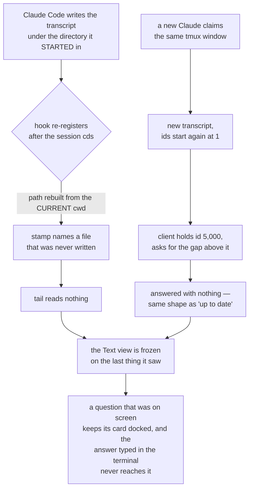

# The answer card that would not go away

**Status:** shipped to prod 2026-08-28 (`49cedbd`, `c05d566`, `a2c7d0f`);
verified on the deployed services, see "What we measured after". **Reported by:**
Viktor. **Author:** Claude (diagnosis + fix). **Scope:** `devvm/claude-se-hook`,
`sessionio/`, `session-events/`, `frontend-v2/`.

## The report

> the question tool in text mode often gets stuck on old prompts. even if I have
> answered them in terminal mode it gets stuck in text mode.

```stats
2 of 16 | live sessions stamped with a file that was never written
883 | AskUserQuestion calls examined across this box
3 s | for a moved session's stream to end — it used to stay open
0 | events a frozen reader received, however long it waited
```

## What was already handled, and what that ruled out

A question card docked over a dialog that is gone was fixed on 2026-08-19
(`14a8ab0`): a question counts as being asked only while it is the last thing
that happened, and one the session moved past is marked `superseded`. That work
holds. Across the 883 AskUserQuestion calls in the transcripts on this box, 876
carry a result, all 878 resolved pairs sit inside one normalized turn, and only
one call anywhere ends a file unanswered — so the transcript almost always says
the question was answered.

Which moves the question: if the transcript says so, why did the card not see it?
It did not see it because the transcript had stopped arriving. Two independent
faults produce that, and a third made the card itself carry stale state once it
was on screen.



## Fault 1 — the transcript path was derived from the wrong directory

`claude-se-hook` reported the session's current working directory and
session-events rebuilt the transcript path from it
(`TranscriptPath(root, cwd, id)`). Claude Code files a session's transcript under
the directory the session was *started* in, so the two agree only until the
session changes directory — which the house workflow asks for on every task, one
worktree per change.

Measured on this box on 2026-08-28, over the 16 live tmux sessions: 2 were
stamped with a file that does not exist.

| session | stamped | actually written to |
|---|---|---|
| `viewing-docs` | `-home-wizard-code-tripit--worktrees-pass-viewer/8087056d….jsonl` | `-home-wizard-code-tripit/8087056d….jsonl` |
| `service-identity` | `-home-wizard-code-x402-gateway/d1824869….jsonl` | `-home-wizard-code/d1824869….jsonl` |

Both streamed `event: ready / data: 0` — an empty log, served with a 200. A
browser that had events from before the re-registration kept showing them, and
nothing further ever arrived.

The harness names the file it is writing in every hook payload. The hook now
passes `transcript_path` through and the service uses it, validated against the
user's own projects root the way a stamp read back already is; the cwd
derivation stays as the fallback for an older hook. The binding the hook
remembers includes the transcript, so a session registered by the previous hook
re-registers on its next prompt rather than staying wrong until Claude restarts.

## Fault 2 — a replaced log was indistinguishable from silence

Event ids belong to one log. `FileSource` assigns them by replaying a transcript
from the start, which is deterministic — the same file re-read by a new process
after a deploy assigns the same ids, and that is what makes a restart free for a
reader. A *different* transcript under the same tmux session name starts again at
1. A client holding id 5,000 then reconnects, asks for the gap above 5,000, and
is answered with nothing, which on the wire is indistinguishable from being up to
date. It shows the previous conversation for as long as the tab stays open.

Nothing told the reader the swap had happened, either. A source was replaced only
when some *other* request asked the registry for that session, and a browser
sitting on an open stream makes no such request; the heartbeat kept the
connection alive on a source that would never deliver again.

Three changes, one per link:

- **The stream says which log it is on.** `ready` carries `epoch` (the
  transcript's identity) and `head` (the newest id). `head` covers the narrower
  case of the same log coming back *shorter* — injected permission events share
  the id space and are not replayed after a restart, so ids can move down.
  `cursor` keeps its own meaning and is still sent only on a fresh open.
- **A retired source ends the streams reading it.** `FileSource.Close()` closes
  every subscription, which ends the SSE response, which is what makes the
  browser reconnect.
- **A sweep notices without being asked.** Every 5 s, live sources are re-checked
  against the session map — only the ones with subscribers, so the cost is one
  tmux round trip per session somebody is actually watching.

The client, offered a log it was not reading, drops what it holds and opens the
session again from the start. A server that names no log is one from before this
contract, and the client behaves exactly as it did.

## Fault 3 — the card carried the previous question's walk

The docked card walks: one question at a time, then a review. That walk is state
the card holds, and `<Show>` kept the same card across two different
AskUserQuestion calls. A fresh single question could therefore open on the
*review* step of the previous one, showing answers chosen for a question nobody
was being asked any more — and Send would have typed those answers into the live
dialog. Reproduced in a test before fixing it: with a 2-question call walked to
its second question, answering it and asking a different single question left the
card reading `review`.

It is keyed on the question's tool id now. The keyed child takes an argument on
purpose: Solid only calls a keyed child as a factory when its arity is above
zero, and a zero-arg one is cached as the static child this exists to stop being.

## What we measured after

On the deployed services, 2026-08-28:

- `ready` now reads `{"cursor":345,"head":421,"epoch":"f6e5ed6b47bf22d9"}`.
- The hook, given a payload whose cwd is a worktree and whose `transcript_path`
  is the real file, leaves the stamp on the real file. The previous code would
  have derived `…-terminal-lobby--worktrees-stuck-question/….jsonl`, which does
  not exist.
- The two mis-stamped sessions were re-stamped by hand and went from `ready: 0`
  to 783 and 2,048 events.
- A stream open on a session whose stamp was then moved ended 3 seconds later,
  and the reconnect reported a different epoch — the signal the client
  resyncs on. Before this change that stream stayed open and silent.

## What this does not change

`runAnswer` still types the first keystroke before it verifies anything; the
checks come between steps. That design assumed a card that could be trusted to be
current, and it is an open item worth taking on its own terms. It is not the fix
for "the card points at a dialog that is gone" — that fix is to not show the
card, which is what these three changes do.
