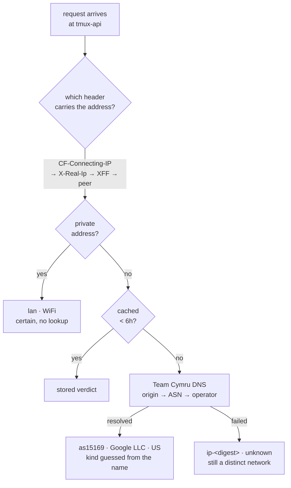

# Data used, split by the link it crossed

**Status:** shipped 2026-08-29 · **Scope:** `tmux-api/netinfo.go`,
`frontend-v2/src/diagnostics/{network,usage}.ts`, the Settings panel

"Data used" already answered how much Terminal Lobby cost a device. Abroad it is
not the figure that decides anything: what a person needs to know is how much of
it went over cellular, because that is the half that is metered. This adds the
network dimension to the counter and to the panel.

## What the browser can tell us

The obvious answer is `navigator.connection`. Two live measurements rule it out
for this.

| Device | `tl.net.type` in `app.context` | Reality |
|---|---|---|
| iPhone (Safari) | absent — no `tl.net.*` at all | the device this feature exists for |
| Linux desktop (Chrome) | `"4g"`, rtt 100, downlink 1.45 | wired ethernet |

Safari has never shipped the Network Information API, so the iPhone reports
nothing. Where the API does exist it reports an effective-throughput class
rather than a medium, which is why a wired desktop reads as "4g".

## What the server can tell us

Every request carries the address it came from, and the server sees it. Three
answers, cheapest first:



**A private address is certain.** Split-horizon DNS points
`terminal.viktorbarzin.me` at the internal ingress (`10.0.20.203`), so a phone
on the house WiFi never leaves the building and arrives from `192.168.x`. That
classifies as WiFi with no lookup at all, and it is the most common case.

**A public address resolves through Team Cymru's DNS service.** Free, no
account, no API key, one TXT lookup for the announcing ASN and one for its name,
cached six hours per address. An address inside overlapping announcements gets
one record per announcement and the **most specific prefix wins**: an address
announced both as part of a `/18` and as part of a `/20` frequently belongs to
two different operators, and only the `/20` is routing it.

**A failed lookup still names a network**, from a per-process keyed digest of
the address, so a month spent roaming separates into networks instead of
collapsing into a single unattributed total.

### The guess is deliberately narrow

Whether an operator's network is cellular is guessed only from an unambiguous
tell in its name — `mobile`, `cellular`, `gsm`, `lte`, `5g`. Brand names are
excluded: most operators sell fixed and mobile access under one brand, and the
AS name on a subscriber line often matches the one on their mobile network. A
confident
wrong label costs the same single tap to fix as an unknown one, while being far
harder to notice, so `unknown` is the default.

That is why the panel carries a correction. A person settles a network in one
tap; it is kept in their roamed prefs keyed by the network name, so it holds on
every device and survives the operator's next address change.

## What changed in the client

| Piece | Change |
|---|---|
| `diagnostics/network.ts` | new — current network, effective kind, the `/netinfo` poll |
| `diagnostics/usage.ts` | store gains a kind dimension; `v1 → v2` migration |
| `store/prefs.ts` | `netKinds`, the roamed per-network corrections |
| `telemetry/diag.ts`, `TerminalView.tsx` | both fold paths attribute at fold time |
| `SettingsPanel.tsx` | period × network table, breakdown filter, current-network line |

The kind is read **at fold time**, so a 60-second window that straddles a
network change is attributed to where it ended, which is where most of its bytes
are likely to have been.

**Refresh triggers.** Coming back online forces a fresh answer, since that is
the one moment the network has certainly changed; a tab returning from a pocket
is throttled to two minutes; opening Settings forces one. Overlapping requests
cannot land out of order — only the newest issue is allowed to write, so a slow
answer describing the link you just left is dropped.

**Cost.** The reply is about 120 bytes, so the poll runs to roughly 12 kB an
hour of active use against the gigabytes it is labelling, and it lands in the
`api` bucket like every other request.

## The unattributed column

Counters written before this existed are lifted into an `unknown` kind rather
than discarded — someone upgrading mid-month would otherwise lose the month they
are in. Those bytes stay in the **Total** column, appear in neither named
column, and the panel says so in a line that only shows when there are any.

## What was deliberately left out

- **A per-network list** (Home WiFi 3.4 GB, EE 1.1 GB, …). More useful abroad,
  but more rows than a 390px panel wants; the current-network line covers
  "which one am I on" without it.
- **The kind in `perf.rollup`.** Grafana cannot yet slice diagnostics by
  network. Adding it means teaching `frontend/diag.js` about the network and
  relaying it into the terminal iframe, which is a larger change than the panel
  needed.
- **IPv6.** Cymru's v6 zone is keyed by nibble-reversed address and is not built
  out here; this network is v4 end to end, so a v6 client would read as
  unknown-but-named.

## Verification

Live on the devvm, exercising each address source:

```
CF-Connecting-IP: 8.8.8.8      → {"net":"as15169","kind":"unknown","label":"Google LLC","cc":"US","source":"asn"}
X-Forwarded-For:  192.168.1.44 → {"net":"lan","kind":"wifi","label":"Home network","source":"lan"}
X-Real-Ip:        1.1.1.1      → {"net":"as13335","kind":"unknown","label":"Cloudflare, Inc.","cc":"AU","source":"asn"}
anonymous                      → 401
```

34 Go assertions, 24 for the client network module, 11 for the store's new
dimension and its migration, 13 for the panel; the full frontend suite is 2,290.

**Open question, and the one thing not proven from this side.** Every request
reaches tmux-api through Traefik, so the verdict depends on the edge forwarding
the client address. Traefik's access log shows it holds the real subscriber
address rather than a Cloudflare one, and generating an authenticated request
through Cloudflare needs a real browser session. So the handler logs
which header each new network's verdict came from — one line, never the address,
which Traefik already records:

```
netinfo: via CF-Connecting-IP -> as15169 (unknown)
```

A `via peer` line would mean the edge stopped forwarding and every device is
being labelled WiFi. First real page load from a phone settles it.
