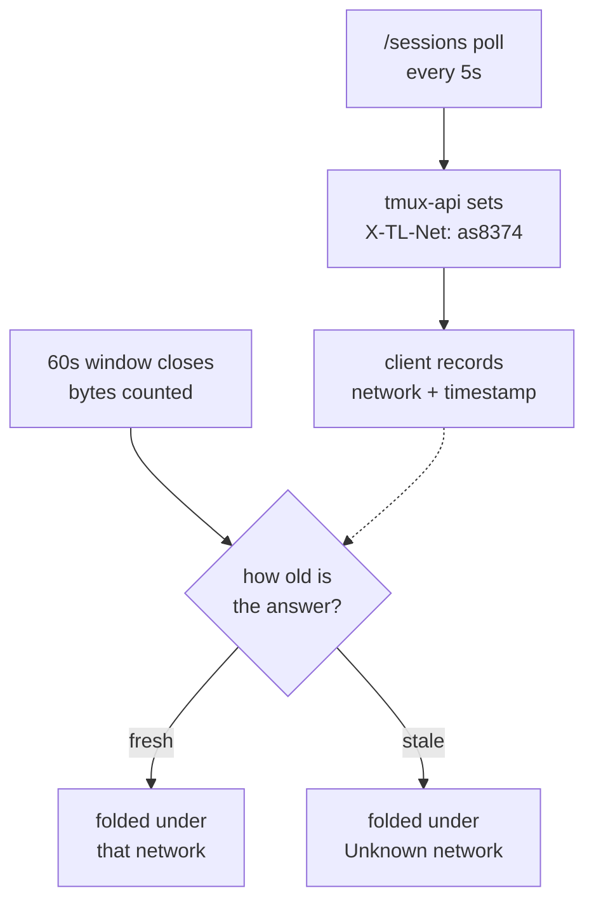

# Data used: name the network, drop the guess

**Status:** designed 2026-08-29, not built — awaiting go-ahead ·
**Supersedes** the WiFi/cellular axis in
[the morning's design](2026-08-29-data-used-by-network-design.md); the rest of
that document — why the browser cannot answer, how the address is resolved —
still holds.

## Why this changes

The WiFi/cellular split shipped this morning. Grilling it the same afternoon
found that "reliable" is not one property here but three, and only the last one
is soft:

| | How it is known | Reliable? |
|---|---|---|
| Bytes per window | measured, post-compression | exact |
| Which network they crossed | the routing table, via ASN | exact |
| Whether that operator is "cellular" | a guess at the operator's name | the soft part |

The live case made it concrete. On a phone roaming in Poland the address
resolves to `AS8374 Polkomtel Sp. z o.o., PL` — an exact identity — and the
category comes back `unknown`, because nothing in "Polkomtel Sp. z o.o." says
mobile. The category needed a person to supply it.

Viktor's call: no manual steps. Rather than removing the feature, the redesign
removes the category and shows the networks themselves. Every element is then
exact, and the reader supplies the categorisation from knowledge the
heuristic does not have — you know which of these is your SIM.

It also answers the roaming question better than the category would have: two
trips stay two rows instead of merging into one "cellular".

```stats
0 | taps required
5s | attribution freshness
~20B | cost per response
```

## What is on screen

```
Data used
› Today                     2.0 GB
  Last 7 days              12.1 GB
▸ This month               31.6 GB   ← selected
  July                     41.0 GB
  Since reset  24 Aug       4.1 GB   [ Reset ]

  Where — this month
▸ Home network             28.0 GB  ████████████
  Polkomtel (PL)            3.4 GB  ██
  Unknown network          210 MB   ▏

  What — this month, all networks
  Terminal        ≈ 2.9 GB  ████████████
  App code          1.1 GB  ████
  Files & images    620 MB  ██
```

One selection drives the panel: the chosen period scopes both the network rows
and the feature bars, and choosing a network narrows the bars further. There is
no second control fixed to a period nobody picked.

## How a window learns its network

The lobby already polls `/sessions` every 5 seconds. tmux-api stamps the answer
on that response, so attribution costs no extra request and is at most 5 seconds
stale while anyone is looking at the tab.



Two properties of the existing code make this work, and both were checked:

- `cache.go` stores only the response **body**, and `main.go:548-551` sets
  headers before the cache lookup. The `/sessions` body cache is shared across a
  user's devices; a per-caller header computed at handler time is not, so two
  devices on different networks cannot receive each other's answer.
- HTTP header cost is about 20 bytes, and less over HTTP/2, where a repeated
  value collapses to a table reference.

### The hidden tab

`lobby.ts:414` parks the poll entirely while a tab is hidden and restarts it on
`visibilitychange`. The device counter deliberately does not pause — *"a hidden
tab that downloaded four megabytes really did spend four megabytes"* — so a
backgrounded phone keeps counting while the stamp ages. That is exactly the
moment someone walks out of the house onto cellular.

Bytes folded while the answer is stale go to **Unknown network** rather than to
the last network seen. The panel does not show a figure that is quietly wrong
about which network, and the hole closes on the next wake, when the poll
restarts and re-stamps.

Proposed bound: **90 seconds**. While visible the stamp refreshes every 5
seconds, so anything older than about half a minute means the tab was
backgrounded; 90 s leaves room for a slow poll without letting a whole
backgrounded stretch pass as attributed. This is a starting value, not a
measurement, and wants checking against how much actually lands in Unknown.

### A forwarded address, not any address

A request that reaches tmux-api with no forwarding header at all currently
resolves to the peer address, which is always private, and so reads as the house
network. Real traffic always arrives through Traefik, which sets
`X-Forwarded-For` on every proxied request; the requests seen without one came
from `t3code/t3-probe` booting the lobby inside the cluster, straight to the
devvm.

So **only a forwarded private address means Home network.** A peer-sourced
address becomes Unknown. Without this, an edge that stopped forwarding would
label every device's traffic as Home, silently — the failure shape this
redesign is meant to avoid.

## The two unknowns are different

They are kept apart because they mean different things to a reader:

- **Unknown network** — counted while we could not say which network it crossed.
  Self-healing: it stops growing as soon as the tab is in front of someone.
- **Earlier** — counted before any of this was measured. Historic, never grows,
  ages out with the 31-day and 12-month windows.

Both sit in the totals and in neither named network.

## Store

`tl:net:v1` moves to schema 3: periods key on network id rather than on the
three kinds, alongside a small directory so a network stays nameable after you
have left it.

```
days:   { "2026-08-29": { "lan": {…buckets}, "as8374": {…}, "unknown": {…} } }
months: { "2026-08":    { … } }
nets:   { "as8374": { label: "Polkomtel", cc: "PL", lastSeen: … } }
since:  { at: 1756…, baseline: {…} }     the resettable period
```

Storage stays small — five numbers per network per day; a month of a dozen
networks is tens of kilobytes against a multi-megabyte quota. Every network is
kept; the panel shows the six largest for the selected period and folds the rest
into **Other**.

Migration from schema 2 folds `wifi`, `cell` and `unknown` into **Earlier**.
Those kinds are not networks and cannot be turned into one without inventing
data. The current month will therefore read mostly Earlier and fill in with real
networks over the following days.

## Two resets, named apart

They do different jobs and both stay:

- **Reset** on the *Since* row rebaselines that one figure and leaves every other
  number standing — start a fresh count without losing the month you are in.
- **Reset counters** discards all history: days, months, networks, directory.

## What is deleted

- The `kind` field, `KINDS`, and the WiFi/cellular columns.
- `guessKind` and the mobile-tell regex in `netinfo.go`.
- `prefs.netKinds`, `coerceOverrides`, and the correction control in the panel.
- The `All | WiFi | Cellular` filter, replaced by network selection.

`/netinfo` stays, minus `kind`: it is what a cold tab asks before its first
`/sessions` answer arrives, and what fills the "you are on X" line.

## Vocabulary

To land in `CONTEXT.md` at implementation, replacing **Network kind** and
**Correction**, which both cease to exist:

- **Network** — one operator's network as the server names it from the address a
  request arrived over: `lan` for anything that reached the internal ingress
  without crossing the public internet, `as8374` for a resolved operator, an
  opaque digest when the lookup fails. Keyed by ASN, so two hotels on the same
  operator are one row. Carries a label and a registered country.
- **Unknown network** — bytes counted while no fresh answer was available.
- **Earlier** — bytes counted before this was measured.
- **Since** — the one period whose start a person sets, by resetting it.

## Open questions

- The 90-second staleness bound is a starting value.
- A registered country is not a location: an operator registered in one country
  can serve another, so `(PL)` says where `AS8374` is registered, not where the
  phone is.
- Keying on ASN merges a hotel's WiFi with a SIM when one operator provides
  both. Rare, and visible in the row's name rather than hidden inside a category.
- Nothing reaches Grafana yet; the split stays per-device, in the browser.

## Verification

- The header cannot leak across devices through the per-user `/sessions` body
  cache — asserted directly, two callers on different networks against one
  cached body.
- A window folded with a stale answer lands in Unknown, not in the last network.
- A peer-sourced address resolves to Unknown, not Home; a forwarded private one
  resolves to Home.
- Migration from schema 2 preserves the totals and puts every pre-existing byte
  in Earlier.
- First real page load through the edge confirms `via X-Forwarded-For` rather
  than `via peer`, which the morning's design left open.
