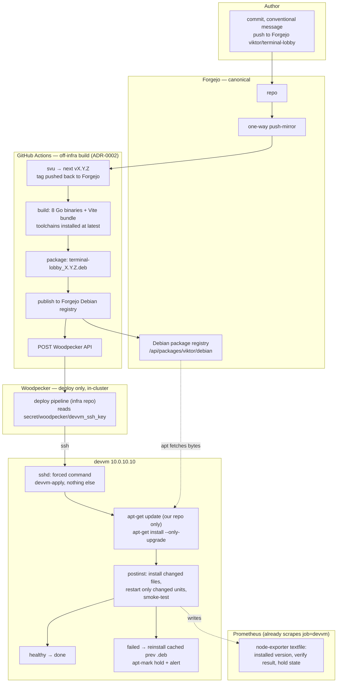

# Terminal Lobby: an IaC-native deployment path

**Status:** design agreed, not yet implemented · **Date:** 2026-08-29 ·
**Decided with:** Viktor, in a `/grill-with-docs` session

## What we are solving

Three things, in Viktor's words: deployment is *"outside of the cluster and
terraform"*, *"the builds are not reproducible"*, and *"the env is only one
time setup"*. Each has a concrete referent in the repo.

**Deployment is outside IaC.** Terraform owns the k8s edge and only that:
`infra/stacks/terminal/main.tf` declares `Service` + `Endpoints` pointing at
`10.0.10.10:{7681,7683,7684,7685,7686,7688}`, the IngressRoutes and the
Authentik gate. Everything on the far side of those endpoints — seven Go
binaries and the five library modules they share, a patched `ttyd`, the SPA, the
systemd units, `/etc` config — arrives
by one of three hand-run scripts (`deploy.sh`, `deploy-v2.sh`,
`deploy-services.sh`) that cross-build on whichever machine you are sitting at,
`scp` to `/tmp`, `sudo install`, `daemon-reload`, and smoke-test. `.woodpecker.yml`
was removed in `c9853e6` as part of the ADR-0002 decommission; README's
"CI status — TODO" section still describes it as ready and waiting on Forgejo
activation, which is no longer the situation.

**Builds are not repeatable.** The Go modules ask for three different toolchains
(`1.21`, `1.22`, `1.22.2`); nothing passes `-trimpath`; `build-ttyd.sh` clones
upstream by the *tag* `1.7.7` rather than a commit; `viu` is a `cargo install`
somebody ran once (`/usr/local/bin/viu`, dated 2026-07-08, sourced from
`~/.cargo/bin`); `deploy-v2.sh` skips `npm ci` while the lockfile hash matches a
stamp file. A build's result depends on the machine that ran it.

**The environment is a one-time setup.** `setup-devvm.sh` is idempotent and
well-factored, but nothing runs it — it is invoked by hand. A blank VM does not
converge to a working workstation.

There is also a fourth problem, found during this session rather than stated up
front. Two Claude sessions deploying tonight discovered that nothing serialises
deploys on this box: the presence CLI identifies every one of Viktor's sessions
as `wizard@devvm@<token>`, so its conflict detection cannot fire between them.
At 03:43 one session installed `term.html` plus a 319-file `assets/` directory;
at 03:46 another restored `index.html` from `index.html.prev`. The box sat in a
mixed state — new `term.html`, old `index.html`, an unreferenced `assets/` dir —
until a third deploy resolved it. `deploy.sh` already carries a hand-maintained
guard against one instance of this class, with a comment explaining that
installing `frontend/index.html` there *"would silently undo that promotion on the
next backend deploy, which is the one way a cutover quietly reverts itself."*
The guard is correct and it protects exactly one file.

## What already works, and is worth keeping

The box is not unmanaged. `t3-provision-users.sh` runs hourly as root from
`t3-provision-users.timer`, reads `roster.yaml` (preferring `origin/master` over
a working tree), and reconciles per-user state — accounts, groups, locked infra
clones, kubeconfigs, sticky ports, `/etc/ttyd-user-map`, `/etc/ttyd-admins`. It
is additive-only for existing users by explicit design. It also reconciles two
machine-wide files, `managed-settings.json` and `tmux-persist`, and the comment
explaining why is the argument for this whole design:

> it was previously only ever installed by a manual `setup-devvm.sh` run, so a
> committed edit could sit undeployed.

`roster_engine.py` behind it is pure and carries 78 pytest cases. The
`t3-membership-sync` pipeline establishes the hand-off shape this design reuses:
CI holds the credentials and commits; the box reconciles from what was committed.

`/home` is also better protected than its single-volume layout suggests.
`devvm-home-backup` runs nightly on the PVE host — rsync with `--link-dest`, a
~33 GB tracked set after exclusions, per-file restore granularity — with weekly
`vzdump` as the bare-metal floor and a monthly offsite pass to the Synology.
3-2-1 is intact.

## Decisions

| # | Decision | Chosen |
|---|---|---|
| 1 | Where dev environments live | Shared devvm, `/home` stays where it is; DR leans on the existing backup chain |
| 2 | Deployable artifact | A versioned `.deb`, installed by `apt` |
| 3 | Promotion | No pin — the box tracks latest |
| 4 | Disruption on upgrade | Restart only genuinely-changed units, immediately |
| 5 | Host baseline owner | Ansible, absorbing both `setup-devvm.sh` and `t3-provision-users.sh` |
| 6 | Build repeatability | Clean CI environment, dependencies installed at latest, no pin machinery |
| 7 | Inner loop | Everything through CI; no local installs |
| 8 | Delivery trigger | Push: GHA → Woodpecker API → SSH forced-command |
| 9 | Bad release | `postinst` verifies; failure auto-reverts to the cached previous `.deb` and holds |
| 10 | Packaging | One app package, plus `ttyd-devvm` and `viu` as their own packages |
| 11 | Versioning | Semver, auto-cut by `svu` over conventional commits, from `v0.1.0` |
| 12 | Sequencing | One project: packaging first, Ansible after |

Two decisions deserve their reasoning recorded, because the alternative was
argued and rejected rather than overlooked.

**Why the dev environments stay on one shared box (decision 1).** Per-user pods
or per-user VMs would make the workspace a Terraform resource, which is where
industry has largely landed — Coder templates the workspace in Terraform over
any backend, and 44% of their users choose VMs over containers. Gitpod's move
away from Kubernetes for dev environments in October 2024 is the cautionary half
of the same story. But Terminal Lobby ships three features that exist *because*
every user is a uid on one kernel: **Share** (attaching a session read-write runs
as its owner), **Lens** (an admin viewing another user's lobby), and
`skills-api`'s cross-user install (`sudo -n -u <user> skills-api -privop pack`,
because peer homes are `0700`). Splitting users across pods or machines does not
make those harder to implement; it makes them a different product that needs a
network protocol where `sudo -u` is today. That is a rewrite, not a deployment
change.

**Why one app package rather than three (decision 10).** The three deploy scripts
are split by blast radius, and that property is worth keeping — a needless
`session-events` restart drops every Text-view client's SSE stream, and a
needless `ttyd` restart drops every attached terminal's WebSocket. But the split
limits *restarts*; it does not require separate *versions*. Restart-if-changed
inside a single package preserves the restart property, while a single version
makes the frontend/backend skew that occurred tonight structurally impossible.
`ttyd-devvm` and `viu` are separate because they are slow to build and almost
never change, and CI's hot path should not pay for them.

## The design

The shape is **push the trigger, pull the bytes**. Nothing inbound to the box
except one SSH key restricted to a single forced command; the package contents
travel over the same apt path a human would use, so `dpkg -l` and
`apt-cache policy` stay truthful about what is installed.

### What the package owns

`terminal-lobby` takes ownership of every file the three scripts install today:
the seven Go binaries (`tmux-api`, `clipboard-upload`, `file-api`, `skills-api`,
`session-events`, `tl-t3-bridge`, `tl-t3-sync`), `index.html`, `term.html`, the PWA assets and webfonts,
the devvm helper scripts (`tmux-attach.sh`, `show-image`, `claude-tmux-state`,
`tmux-restore-user`, `tmux-persist-forget`, `tmux-user-*`), the systemd units,
and `/etc/sudoers.d/ttyd-users` (validated with `visudo -cf` in `postinst`, as
today). `/etc/ttyd-user-map` and `/etc/ttyd-admins` stay generated from
`roster.yaml` and are explicitly *not* package files — every service reads them
and nothing in this repo writes them.

`Depends:` carries what the box currently acquires by hand: `ttyd-devvm`, `viu`,
`libwebsockets`, `libjson-c`, `tmux`, `acl`. That line is what retires "the env is
a one-time setup" for terminal-lobby's own footprint.

### Build identity, without pin machinery

Decision 6 asks for repeatable rather than bit-identical: a clean CI environment
with declared dependencies installed at latest, and no version-pinning
apparatus. That works because artifacts are versioned and immutable — you never
rebuild `1.4.2`, you build `1.4.3`. Each `.deb` records the commit SHA and the
toolchain versions it happened to build with, for forensics rather than for
pinning.

Two things stay pinned, and both are carve-outs rather than exceptions to the
principle:

- **`ttyd` keeps its upstream tag.** It is not a dependency, it is a *patch
  target*: `devvm/ttyd-local.patch` is written against 1.7.7's `src/pty.c` and
  `src/http.c`. Tracking latest means `git apply` starts failing, or applies with
  fuzz. Moving the pin from the tag to the exact commit is a one-line change we
  should take while we are there — the installed binary already reports
  `1.7.7-40e79c7`, so we know which commit is live.
- **`npm ci` and `go.sum` stay.** These are committed lockfiles that already
  exist; `npm ci` *means* "install exactly the lockfile". Replacing them with
  `npm install` would have CI mutate the lockfile on every run.

The `npm ci` skip in `deploy-v2.sh` disappears with the scripts — CI starts from
a clean checkout every time, so the optimisation has nothing to optimise.

### Stamping moves from deploy time to build time

ADR-0007's zero-touch self-update depends on two stamps per artifact:
`__TL_BUILD__` (git SHA, provenance) and `__TL_ASSET__` (a fingerprint of the
artifact's own unstamped content, which is what decides whether an open tab
self-updates). ADR-0008 adds a constraint that is easy to lose in a port: each
surface's fingerprint must hash **its own source concatenated with
`frontend/diag.js`**, because `diag.js` is inlined into all of them and a change
confined to it would otherwise leave every page's identity unmoved — so no open
tab would ever self-update to a fixed `diag.js`.

Today that dependency set is encoded in the deploy scripts. It has to move into
the build, along with `deploy.sh`'s two assertions: that `diag.js` lands inside
an open `<script>` block, and that it contains no literal script tag that would
truncate the page. These are the least obvious things to carry across and the
easiest to drop silently, so they get their own CI test.

One capability is deliberately lost: `deploy.sh` seds the *working tree*, so it
can ship uncommitted edits. Decision 7 gives that up. Local iteration is
`scripts/devserve` and `dev-harness.py`, which need no devvm.

### Verification and the emergency brake

`postinst` runs the checks the scripts run today — `/health` on each service,
an unauthenticated request to each authed surface that must answer `401`,
`/whoami`, and the public assets — and writes the result to a node-exporter
textfile. On failure it reinstalls the previous `.deb` from
`/var/cache/apt/archives`, marks the package held so the next push cannot
re-break the box, and records that in the same textfile.

The hold is an automatic brake, not a workflow. With no pin (decision 3), the
normal rollback is **fix forward**: revert the commit, let `svu` cut a higher
version carrying the old code. A hand-run `apt install terminal-lobby=1.4.1`
would otherwise be undone by the next push, which is worth writing in the
runbook rather than discovering during an incident.

Prometheus already scrapes this box as `job=devvm` at `10.0.10.10:9100`, so
alerting is a rule over the textfile metrics — verify failed, package held, or a
unit in `failed` state — plus a divergence alert comparing the installed version
against the latest published. That divergence alert is what replaces a polling
backstop: decision 8 chose push, so a dropped trigger would otherwise leave the
box quietly stale.

`unattended-upgrades` is already running daily with only the Ubuntu origins
allowed. Adding our origin to `Allowed-Origins` would give a once-a-day backstop
for free, with no new timer. It is a genuine trade — it reintroduces a slow poll
— so it is listed as an open question rather than assumed.

### Serialisation, as a side effect

With the scripts gone, the box has exactly one writer: its own reconcile,
triggered over one forced command, holding `dpkg`'s lock. Two concurrent deploys
become two commits that git serialises and `svu` orders. The mixed state
observed tonight stops being reachable, and it stops depending on agents asking
each other what they are doing.

## Phases

Each phase is independently verifiable, and the first three touch no user
accounts.

**Phase 0 — build, publish, prove.** Create the `ViktorBarzin/terminal-lobby`
GitHub mirror (it does not exist yet; the API returns 404) and enable the
one-way Forgejo push-mirror per ADR-0003. Add `.github/workflows/` with the
`svu` step (the tripit/wrongmove pattern: `fetch-depth: 0`, `fetch-tags: true`,
tag pushed back to canonical Forgejo with `FORGEJO_GIT_TOKEN`), the build, the
`.deb` packaging, and publication to the Forgejo Debian registry. Nothing on the
box changes. Verified by downloading the `.deb` and inspecting it.

**Phase 1 — `ttyd-devvm` and `viu` packages.** Their own workflows, built only
when their inputs change. Install them on the box; confirm the binaries behave
as the hand-installed ones do.

**Phase 2 — install the app package by hand, once.** Add the apt source, install
`terminal-lobby`, confirm `dpkg` now owns every file the scripts used to write
and that the smoke tests pass. This is the one manual install in the design, and
it exists so the cutover is observed rather than triggered.

**Phase 3 — the push path.** The Woodpecker deploy pipeline in the infra repo
(which is already activated, sidestepping the HTTP 500 that blocked activating
`viktor/terminal-lobby`), the forced-command key, `postinst` verification, the
auto-revert, and the Prometheus rules. At the end of this phase, merging to
master puts a new version on the box without anyone running anything.

**Phase 4 — retire the scripts.** Delete `deploy.sh`, `deploy-v2.sh` and
`deploy-services.sh`; rewrite README's Deployment and "CI status — TODO"
sections; write the DR runbook (rebuild the VM, install the package, restore
`/home` from the backup farm).

**Phase 5 — Ansible absorbs the host.** Port `setup-devvm.sh` and
`t3-provision-users.sh` into `infra/playbooks/devvm.yml`, run by root
`ansible-pull` from the public GitHub infra mirror (no credentials needed — the
mirror is public and confirmed fresh). `roster_engine.py` is kept as the
derivation engine: `derive --json` becomes Ansible's var source, so only the
*applier* is rewritten. Additive-only semantics are enforced by module choice
(`append: yes` on groups, never `state: absent`), and the two reconcilers run in
parallel — Ansible in `--check --diff` — until their diffs agree, before the
bash applier is retired.

## Risks

**The Ansible port touches live accounts.** This is the highest-risk work in the
design, which is why it is last and why the shadow period is not optional.
`t3-provision-users.sh` encodes rules whose value is invisible in normal
operation — never removing a group, never replacing a home, never re-locking an
existing account — and a port bug there costs someone their access. The pytest
suite covers the derivation engine, not the applier, so the check-mode diff *is*
the test.

**Auto-latest means upgrades land at moments nobody chose**, including mid-turn
for `emo`. Restart-if-changed keeps that to the units that actually moved, and
tmux sessions survive a `ttyd` restart (the browser reconnects), but this is a
real change in when disruption can occur.

**`postinst` doing this much is unusual.** Verification, conditional restarts and
an auto-revert in a maintainer script is more logic than a `.deb` normally
carries. The mitigation is that this logic exists today and is already tested in
the deploy scripts — it is being moved, not invented — but it needs to be
genuinely idempotent and safe to re-run, because `dpkg` will re-run it.

**`/` is at 93% (16 GB free) on a single LVM volume**, with `VFree 0` in the VG.
This is not caused by anything here and is not fixed by anything here, but a
package cache, a chunked asset directory and a rollback copy all land on that
filesystem. It deserves its own fix and is called out so it is not discovered
during a phase-2 install.

## Open questions

- **The apt credential.** Forgejo's Debian registry needs credentials for a
  private owner, and root on the devvm has no Vault token — `t3-provision-users`
  says so explicitly, and unattended Vault access from the box does not exist.
  The likely answer is that the Woodpecker deploy step, which *does* have Vault,
  installs and refreshes a read-only token in `/etc/apt/auth.conf.d/` as part of
  the same push it already performs. That needs designing properly before phase 2.
- **Whether to add our origin to `unattended-upgrades`** as a daily backstop,
  accepting a slow poll to bound the cost of a dropped trigger.
- **`secret/woodpecker/devvm_ssh_key`** is recorded in README as provisioned. It
  should be confirmed to exist, and its key confirmed to be one we are willing to
  restrict to a forced command, before phase 3 depends on it.
- **Whether Woodpecker pods can actually open TCP 22 to `10.0.10.10`.** Routing
  from the pod network to the box demonstrably works (Traefik reaches `:7681`
  today) and the box runs no host firewall, but nothing has been observed
  crossing to port 22 specifically. Worth one probe before phase 3.
- **Where `ancamilea` sits.** She has a home directory and no row in
  `/etc/ttyd-user-map`. The Ansible port needs to know whether that is a parked
  account or a leftover.

## Out of scope

VM lifecycle stays in the Proxmox UI. A dated decision in
`infra/stacks/infra/main.tf` (2026-05-26) keeps devvm (102) and the k8s nodes
out of Terraform while their cloud-init bootstrap stays in it, on the reasoning
that the bootstrap is what carries reproducibility, and notes that full adoption
waits on the bpg/proxmox provider migration. Nothing here revisits that.

Moving `/home` to its own volume was considered and declined (decision 1): the
backup chain already provides the recovery property, and the volume split buys
reattach-in-seconds over restore-in-an-hour at the cost of a maintenance window.
