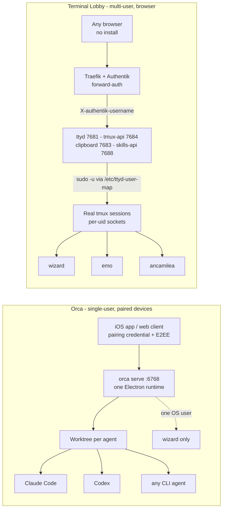

# Orca vs Terminal Lobby — should one replace the other?

**Date:** 2026-08-29
**Status:** evaluation complete, decision recorded
**Orca version:** v1.4.192, deployed headless on the devvm
**Question asked:** does Orca replace Terminal Lobby?

**Answer: no, and the two are not really competing.** They overlap on one
feature — steer a coding agent from your phone — and diverge on almost
everything else. Terminal Lobby is a multi-user browser front door to real tmux
sessions on a shared box. Orca is a single-user desktop orchestrator that fans
one prompt across parallel git worktrees. Running both is coherent. The useful
output of this evaluation is the list of Orca capabilities worth borrowing.

```stats
v1.4.192 | Orca version deployed
6768 | port, advertised ws://10.0.10.10
550 MB | extracted AppImage on disk
0 | lines deleted from your Claude settings
```

## What is running now

Orca v1.4.192 is deployed headless on the devvm and passes its own readiness
contract.

| Item | Value |
|---|---|
| Install path | `/opt/orca/squashfs-root` (extracted AppImage, root-owned, 550 MB) |
| Version record | `/opt/orca/VERSION` — Orca has no `--version` flag, so the tag is recorded by hand |
| Units | `orca-xvfb.service` (Xvfb `:99`), `orca-serve.service` |
| Runs as | `wizard`, so agents inherit the same repos, credentials and git rights you have |
| Listener | `0.0.0.0:6768`, advertised as `ws://10.0.10.10:6768` |
| Telemetry | off — `ORCA_TELEMETRY_DISABLED=1` and `DO_NOT_TRACK=1` |
| Phone path | headscale tailnet; pfSense already serves `10.0.10.0/24` as an approved subnet route |

Verified after install: listener up, `GET /web-index.html` returns 200, a
WebSocket upgrade returns 101, and the service comes back listening after
`systemctl restart`.

This is deliberately **not** in `infra/playbooks/devvm.yml` yet. It is an
evaluation, so it is undeclared machine state. Ansible will not report it as
drift, because the playbook does not describe these paths — but a rebuilt box
will not have Orca until the playbook does.

## The two architectures



The shapes differ at the root. Terminal Lobby resolves *who you are* on every
request and drops privileges into that person's tmux. Orca resolves *which
device is paired* and runs everything as the one user who started the daemon.

## Where Orca is ahead

Read from Orca's own documentation and source, not measured in use — this
evaluation deployed Orca but did not run a real workload through it. Ranked by
what looks worth borrowing.

| Capability | What it does | Terminal Lobby today |
|---|---|---|
| **Parallel worktree fan-out** | One prompt to N agents, each in its own worktree, then compare and merge the winner | No equivalent. The closest thing is opening several sessions by hand |
| **Agent-agnostic state** | Claude Code, Codex and ~30 other CLIs are first-class, each with lifecycle hooks | ADR-0001 tracks Claude Code only |
| **Diff review with annotations** | Comment on a diff line and send the comment back to the agent | Dropped from scope in the 2026-08-18 round-2 grill |
| **Usage and rate-limit tracking** | Shows Claude and Codex quota and reset times, hot-swaps accounts | `homelab claude-usage` exists, but outside the lobby UI |
| **GitHub and Linear browsing** | Open a worktree straight from an issue or PR | Not present |
| **SSH worktrees** | Run agents on a different machine with editing, git and terminals | Not present |
| **Orchestration CLI** | `orca worktree create`, `snapshot`, `click`, `fill` — agents can drive Orca | Not present |
| **Design Mode** | Click an element in a real Chromium window, send its HTML, CSS and a cropped screenshot into the prompt | Not present |

The first two are the interesting ones. Worktree fan-out is Orca's actual
thesis and Terminal Lobby has nothing pointing that direction. The agent-agnostic
state model is a generalisation of work already done here, so it is the cheaper
of the two to borrow.

## Where Terminal Lobby is ahead, and Orca cannot follow

These are structural, not gaps Orca has yet to fill.

1. **Multi-user on one URL.** Terminal Lobby serves wizard, emo and ancamilea
   from `terminal.viktorbarzin.me`, with isolation enforced by the kernel
   through per-uid tmux sockets. `orca serve` is one runtime with one userData
   profile — a second process on the same profile exits with status 3. Serving
   a second person means a second instance, second port, second everything, and
   no shared identity.

2. **Identity comes from Authentik.** Terminal Lobby reuses the identity
   provider already running. Orca authenticates devices, not people, through
   its own pairing credential. It has no concept of your IdP, so an Orca
   endpoint sits outside the access model everything else here uses.

3. **No client install.** Terminal Lobby is a URL, so any borrowed laptop or
   phone browser works. Orca's phone client is an App Store binary. Its web
   client is served by the runtime itself, so reaching it still needs the same
   network path as the app.

4. **Sessions Orca did not create.** Terminal Lobby attaches to tmux sessions
   that exist independently — started from ssh, from cron, from anything — and
   they survive the browser closing. Orca owns its terminals. The whole
   `tmux-persist` snapshot and restore lifecycle has no counterpart.

5. **Sharing and projects.** Read-only and read-write shares, co-owned
   multi-member projects, and Lens are governance features for a shared box.
   Orca is built for one operator.

## Verdict

Keep Terminal Lobby. It is the multi-user front door to a shared machine, and
Orca is not built to be that.

Orca is useful here as a **single-user orchestrator for wizard**, sitting
beside Terminal Lobby rather than under it. The two answer different questions:
"let me get at my sessions on that box from anywhere" versus "run five agents on
this problem and show me the diffs".

If only one had to survive, Terminal Lobby wins on this setup, because the
multi-user and identity properties are load-bearing here and cannot be
reconstructed in Orca.

## Findings from the deployment

What the install turned up, recorded so it does not cost time twice.

### The GPU FATAL is cosmetic

> [!WARNING]
> A health check that greps for `FATAL` or watches child exits will call a
> working Orca server broken. Use the JSON ready contract instead.

Every `orca serve` run on this box logs:

```
ERROR:...zygote_communication_linux.cc:291] Failed to send GetTerminationStatus message to zygote
ERROR:...network_service_instance_impl.cc:721] Network service crashed or was terminated, restarting service.
ERROR:...gpu_process_host.cc:1083] GPU process launch failed: error_code=1002   (x3)
FATAL:...gpu_data_manager_impl_private.cc:416] GPU process isn't usable. Goodbye.
```

Despite the word FATAL, the runtime serves correctly: the listener stays up,
`/web-index.html` returns 200, and a WebSocket upgrade returns 101. The message
comes from a GPU child process in a VM with no GPU.

This matters for health checks. A check that greps for `FATAL` or a non-zero
child exit will call a working server broken. Use the documented contract
instead:

```bash
sudo journalctl -u orca-serve.service -o cat \
  | jq -Rrc 'fromjson? | select(.type == "orca_server_ready" and .schemaVersion == 1)'
```

Time was spent testing `--disable-gpu`, `--no-sandbox`, a setuid `chrome-sandbox`
and a scoped AppArmor profile. All four produced byte-identical failure counts,
which was the clue that the message was not the problem. All four were backed
out.

### Orca's auto-Xvfb did not start

The guide says Orca starts Xvfb on `:99` when no `DISPLAY` is set. On this box
no Xvfb process existed during or after a serve run. The guide's **Managed Xvfb
Service** section is the path that works, and is what is deployed. Setting
`DISPLAY=:99` did not by itself change the GPU messages above — the two issues
are unrelated.

### `orca serve` writes into your agent configs on first start

> [!CAUTION]
> Starting the daemon edits `~/.claude/settings.json` and `~/.codex/`. It
> appended only here - zero deletions, all six existing hooks intact - but it
> is a side effect of `systemctl start`, not something you are asked about.

Starting the daemon — before any pairing, without a prompt — created
`~/.orca/agent-hooks/{claude-hook.sh,codex-hook.sh}` and wired them in:

| File | Change |
|---|---|
| `~/.claude/settings.json` | grew 2,708 → 31,251 bytes; 12 hook references added |
| `~/.claude/settings.json.bak` | backup written first |
| `~/.codex/hooks.json` | 8 hook types, all calling `codex-hook.sh` |
| `~/.codex/config.toml` | 8 `[hooks.state]` entries with `trusted_hash`, pre-approving those hooks |

Checked, because it matters: the Claude settings edit was a pure append. Zero
deleted lines, and all six existing hooks (`auto-learn.py`,
`homelab-memory-recall.py`, `zsh-guard.py`, `fixer-suggest.py`,
`pre-compact-backup.sh`, `post-compact-recovery.sh`) survived intact.

The mechanism is reasonable and mirrors ADR-0001 — hooks are how you learn what
an agent is doing. The difference is when it happens and whether you are asked. Terminal Lobby's
hooks are deployed deliberately through `managed-settings.json`, whereas Orca's
arrive as a side effect of starting a daemon, and it marks its own Codex hooks
as trusted on your behalf.

### Smaller notes

- No `--version` flag and no `version` subcommand. Pin a release tag and record
  it; `/opt/orca/VERSION` holds it here.
- `serve` installs `~/.local/bin/orca` and `~/.local/bin/orca-ide` into the
  running user's PATH directory.
- The OS keyring is unavailable headless, so Orca stores secrets unencrypted and
  says so at startup.
- The pairing offer carries a device credential. With `--json` it lands in the
  journal, which on this box only `wizard` and `root` can read (`adm` group
  membership is `syslog,wizard`).
- FUSE is not needed. `libfuse2t64` is absent here and the `--appimage-extract`
  path documented in the guide avoids it.

## Open questions

- **Does the phone actually reach it?** The route exists — pfSense serves
  `10.0.10.0/24` on the tailnet and the devvm has no firewall — but the iPhone
  node has been offline since 2026-05-22, so the path is unproven end to end.
  Its headscale key is valid until 2026-10-12, so no re-registration should be
  needed.
- **Memory headroom.** The box was at 27 GiB of 31 GiB used before Orca. Orca
  idles at 7 processes. What several agents in parallel worktrees cost has not
  been measured, and this box is shared with emo.
- **Nothing has been run through it.** The capability table is read from Orca's
  documentation. The worktree fan-out claim in particular deserves a real test
  before any of it is used to justify porting work.
- **Whether it stays.** If it does, `/opt/orca`, both units and the `qrencode`
  dependency belong in `infra/playbooks/devvm.yml`.
