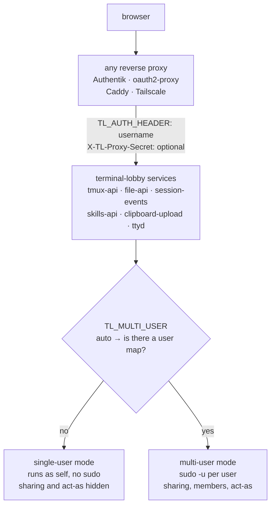
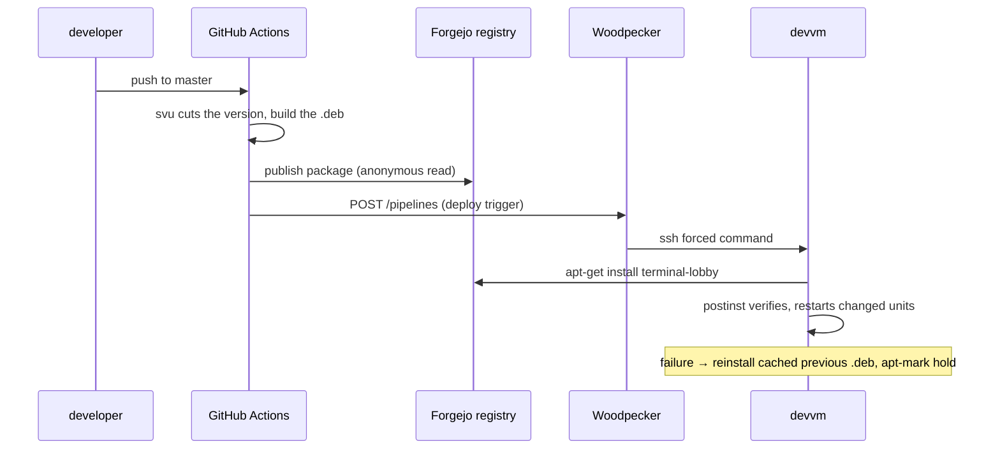

# Pluggable auth, one deployment path, a shorter README

**Status:** approved, not yet built
**Date:** 2026-08-29
**Author:** Viktor Barzin (decisions), Claude (research + design)
**Scope:** the six Go modules, `frontend-v2/`, `devvm/`, `packaging/`,
`.github/workflows/`, `docs/`
**Supersedes for the deploy half:** the phase gate in
`docs/adr/0013-the-box-installs-the-lobby-nobody-ships-it.md`, whose three
prerequisites are now met

## Why

terminal-lobby went public earlier today at
`github.com/ViktorBarzin/terminal-lobby`. Three things make it hard for someone
else to run, and two of them make it harder than it needs to be for us as well.

```stats
6 | Go modules with the header compiled in
929 | lines of hand-run deploy script
562 | README lines, 189 on deployment
0 | infra repo changes needed
```

Authentik is a hard dependency. `X-Authentik-Username` is a compiled-in constant
in six Go modules and a flag on the ttyd unit, so running the lobby means
running Authentik, or patching six binaries.

Deployment is three hand-run scripts totalling 929 lines. The package pipeline
meant to replace them builds and publishes correctly, and its last mile has been
gated off waiting on prerequisites.

The README is 562 lines. Its deployment section alone is 189 of them, 34% of the
document, describing a path that section already notes is being replaced.

## What we found

Five facts shaped the design more than anything else. Each was checked against
the running system rather than assumed.

**A browser cannot set a custom header on a WebSocket handshake or a top-level
navigation.** The terminal is an iframe pointing at ttyd's own page, and ttyd's
bundled client opens the socket. The original idea of a client-supplied secret
header cannot work on the path that carries the terminal. Only a proxy in front
can inject one.

**The services trust the identity header on their own, from anywhere on the
LAN.** All five bind `0.0.0.0`. Measured 2026-08-29:

```
curl -H 'X-Authentik-Username: vbarzin' http://10.0.10.10:7684/whoami
{"admin":true,"authentik":"vbarzin","osUser":"wizard"}
```

No credential of any kind. Authentik gates the Traefik route; it does not gate
the ports. The only control today is network position. Any host on the LAN can
reach the ports.

**There is already a same-user fast path that skips sudo.** `tmuxCmd` and
`file-api`'s `selfUser` both short-circuit when the target is the running user.
A single-user install therefore needs no `sudo`, which means no
`/etc/sudoers.d/ttyd-users`, no `/etc/ttyd-user-map`, and no ACL wrapper. The
whole privilege layer exists to let ttyd become *other* users.

**Two of the three phase-3 prerequisites are already satisfied, and the third is
unblocked.** `secret/woodpecker/devvm_ssh_key` exists in Vault. The Forgejo
Debian registry answers anonymously (`Packages` index and `repository.key` both
return 200), so the apt credential the ADR listed as an open question is not
needed. The box runs no firewall (`ufw` inactive, `iptables` INPUT policy
ACCEPT) with sshd on `0.0.0.0:22`, and pod-to-box routing is already proven by
Traefik reaching `:7681`.

**ttyd already supports what we need.** `-H` takes any header name, and `-c
user:pass` provides basic auth. The coupling to Authentik is ours, in the
constants and the unit file, not ttyd's.

## The design

### Identity and the proxy secret

Two separate questions, answered separately.

*Who is this user* stays a header, but the header's name becomes configuration.
`TL_AUTH_HEADER` names it. Authentik becomes one of several proxies that can
sit in front, alongside oauth2-proxy, Caddy, Cloudflare Access and Tailscale,
each of which already emits a username header.

*Is this caller allowed to assert anything at all* becomes an optional shared
secret in `X-TL-Proxy-Secret`, compared in constant time. When set, a request
without it is refused before the identity header is read. This is what closes
the LAN path above.



### Single-user and multi-user

Single-user is the default because it is what one person self-hosting wants, and
because it costs nothing to support: the same-user fast path already exists.

`TL_MULTI_USER` takes `auto`, `on` or `off` and defaults to `auto`, which means
"multi-user when `/etc/ttyd-user-map` is present". Naming the variable keeps the
detection visible in the config file rather than implicit in a file's existence,
while `auto` means our own install needs no new setting.

`/whoami` grows a `multiUser` boolean. The frontend hides Share, project members
and act-as when it is false, following the pattern the act-as picker already
uses for non-admins. Without this the Share dialog opens onto an empty user
list, which reads as a defect rather than as a mode.

### Configuration

One file, `/etc/terminal-lobby.conf`, referenced by every unit as
`EnvironmentFile=`. systemd expands environment variables in `ExecStart`, so
ttyd's `-H ${TL_AUTH_HEADER}` reads the same file as the Go services. The
package ships it as a dpkg conffile, so a local edit survives upgrades and a
conflicting change prompts with a diff.

| variable | default | meaning |
|---|---|---|
| `TL_AUTH_HEADER` | `X-Forwarded-User` | header carrying the username |
| `TL_PROXY_SECRET` | unset | shared secret; unset means no check |
| `TL_MULTI_USER` | `auto` | `auto` \| `on` \| `off` |
| `TL_BIND` | `0.0.0.0` | listen address for the services |

`X-Forwarded-User` is the default because it is what most forward-auth proxies
already emit, and because a vendor's header name does not belong compiled into a
public project. Our install sets `TL_AUTH_HEADER=X-Authentik-Username`.

The secret is optional. Leaving it unset preserves today's behaviour exactly,
including the LAN path described above; the trade-off is recorded under
[Accepted risks](#accepted-risks).

### Deployment

The push design in ADR-0013 stands. Its phase gate lifts because the
prerequisites it named are now met.



Three scripts are deleted: `scripts/deploy.sh`, `scripts/deploy-v2.sh` and
`scripts/deploy-services.sh`, 929 lines between them. With them goes the class
of incident they were hardened against, where a deploy from a stale worktree
reinstated an older lobby, because the box will have exactly one writer holding
`dpkg`'s lock.

`devvm/terminal-lobby.auth.template` is deleted with them. It exists to give apt
a credential for the registry, and the registry accepts anonymous reads.

### The container

A single image, published to ghcr alongside the existing ones, carrying the
patched ttyd, the five Go services and tmux, in single-user mode.

```
docker run -p 7681:7681 -v ~/work:/home/dev ghcr.io/viktorbarzin/terminal-lobby
```

Single-user is what makes this possible at all. The reason terminal-lobby
resisted containerising was `sudo -u` across many users needing one kernel and a
real `/home`; one user, one tmux server and no sudo is an ordinary container.

One piece needs a fallback. `tmux-user-attach` re-homes the tmux server into the
user's systemd scope, and a container generally has no systemd. In single-user
mode the re-homing has nothing to do, so the fallback is to skip it, but this is
the part of the container work most likely to surprise us.

### Documentation

The README becomes a landing page of roughly 130 lines: what it is, the
screenshots, a quickstart per audience, the configuration table, and links out.
Everything operational moves into `docs/`, unchanged in substance:

| new file | from |
|---|---|
| `docs/deployment.md` | the 189-line Deployment section |
| `docs/multi-user.md` | Sharing, Per-user setup |
| `docs/architecture.md` | Components, How a request flows |
| `docs/development.md` | Local development |
| `docs/interface.md` | Keyboard shortcuts, Mobile, Theme, Gallery |

Nothing is deleted. A first-time reader is asked to read a page rather than a
manual, and the detail stays where someone looking for it will find it.

## Decisions

| # | decision | rationale |
|---|---|---|
| 1 | Pluggable identity header plus optional proxy secret | Separates identity from authentication; a browser cannot supply a header on the terminal's socket, so only a proxy can |
| 2 | Single-user by default, multi-user opt-in | The same-user fast path already exists, so the simple case costs nothing |
| 3 | Secret optional, loud startup warning | Chosen for zero disruption; the warning names what is reachable without it |
| 4 | One `EnvironmentFile` at `/etc/terminal-lobby.conf` | One place to look; dpkg conffile semantics protect local edits |
| 5 | Finish the package pipeline and ship a container | Two audiences, two mechanisms, nothing left hand-run |
| 6 | Keep the Woodpecker push over SSH | ADR-0013's design is sound and its blockers are cleared |
| 7 | One container image, all services | A stranger wants one command, not a compose file |
| 8 | README becomes a landing page | Deployment alone is a third of it and is being replaced |
| 9 | `TL_AUTH_HEADER` defaults to `X-Forwarded-User` | A public project should not compile in a vendor's header name |
| 10 | `multiUser` flag in `/whoami`, UI hides the rest | An empty Share dialog reads as a defect |
| 11 | One release, all at once | The docs describe exactly what shipped, with no half-replaced window |

## Migration for the existing install

> [!IMPORTANT]
> Decision 9 changes the default, so our box needs
> `TL_AUTH_HEADER=X-Authentik-Username` in place at upgrade time. Without it
> every user is locked out until someone notices.

The `postinst` writes that value on first install when it finds an existing
`/etc/ttyd-user-map`, which is the signal that this is our multi-user box rather
than a fresh install. It is a one-time migration keyed on an upgrade condition,
not a permanent special case, and it runs before any unit is restarted.

No change is needed in the infra repo. The secret is optional and our conffile
names the Authentik header, so Traefik keeps sending exactly what it sends
today.

## Accepted risks

> [!WARNING]
> **The LAN path stays open by default.** Decision 3 makes the proxy secret
> optional, so unless `TL_PROXY_SECRET` is set, anything that can reach
> `10.0.10.10:7684` remains able to assert any mapped identity including admin.
> This is today's behaviour, unchanged; the design makes closing it a one-line
> edit rather than a code change, and the startup warning says plainly what is
> reachable. Setting the secret later costs one value in the conffile and one
> `customRequestHeaders` middleware in `infra/stacks/terminal/main.tf`.

**The container's tmux scope handling is unproven.** Skipping the systemd
re-homing should be correct in single-user mode, but it has not been run.

**One release is a large diff.** Six Go modules, the frontend, packaging, a new
image and the docs tree land together. The compensation is that every test suite
already exists and is green (13 Go suites, 2290 frontend tests), so the diff is
verifiable even though it is wide.

## Open questions

- Which supervisor the container uses. A plain entrypoint with `tini` is
  probably enough for six processes; `s6-overlay` is the alternative if restart
  policy per service turns out to matter.
- Whether `docs/interface.md` should stay one file or split further. It is a
  merge of four small sections and may read as a grab bag.
- Whether the divergence alert in ADR-0013 is still worth building now that the
  push path is the only writer. It was designed as the backstop for a dropped
  trigger and that risk has not changed, so the current answer is yes.
