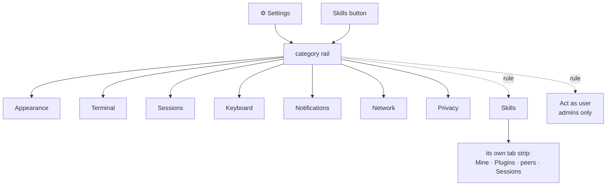

# Settings: from one long column to a two-pane rail

**Status:** shipped 2026-08-30 · **Scope:**
`frontend-v2/src/components/SettingsPanel.tsx` (was 889 lines) and the
Skills panel (937), which becomes `settings/pages/SkillsPage.tsx`; the
`.tl-settings-*` block in `app.css`; `theme.css`; `App.tsx`'s two header
buttons; `docs/interface.md`

Settings had accumulated thirteen groups in a 420px column. Each one is sound
on its own — the Data used breakdown, the notification readouts and the
keyboard exemption note are all recent, deliberate work. Stacked, they share a
single visual weight: a nine-theme grid, a byte-usage dashboard and a
destructive button all read as the same kind of thing, down roughly 2,400px of
scroll.

What this redesign changes is hierarchy, not findability and not content. No setting is added, removed, or renamed.

## What was there

| # | Group | Controls |
|---|---|---|
| 1 | Act as user | select (admin only) |
| 2 | Theme | 9-button grid |
| 3 | Terminal font size | A−/A+ stepper |
| 4 | Terminal text | 2 sliders, 1 segmented |
| 5 | Cursor | segmented, checkbox |
| 6 | Scrolling & links | 2 checkboxes, 1 segmented |
| 7 | Session list | checkbox |
| 8 | New session runs | select |
| 9 | Keyboard | checkbox |
| 10 | Notifications | 2 checkboxes, 3 readouts, 2 buttons |
| 11 | This browser | 2 checkboxes |
| 12 | Data used | periods, networks, buckets, tier, 2 resets |
| 13 | Advanced | checkbox, danger button |

Twelve of the thirteen carried a prose hint underneath. Group 12 alone was
taller than groups 1–8 combined.

## The shape

A 900px dialog: a 200px category rail on the left, a ~680px content pane on the
right, one page rendered at a time.

```
┌──────────────────────────────────────────────────────────┐
│ Settings                                              ✕  │
├──────────────┬───────────────────────────────────────────┤
│   Appearance │  TERMINAL                                 │
│ ▸ Terminal   │                                           │
│   Sessions   │  Font size                    −  11px  +  │
│   Keyboard   │  Line height                  −  1.00  +  │
│   Notificat. │  Letter spacing               −  0.0px +  │
│   Network    │  Bold weight                    600   700 │
│   Privacy    │  Cursor shape        block  bar  underline│
│ ──────────── │  Blink                             ●──○   │
│   Skills     │  Smooth scrolling                  ●──○   │
│ ──────────── │  Scroll speed  ⓘ      1×  1.5×  2×  3×   │
│   Act as user│  Copy button on links              ○──●   │
│              │  Flow control   this device        ●──○   │
└──────────────┴───────────────────────────────────────────┘
```

Rows cap at 600px inside the pane so a label and its control stay near each
other, and the rest reads as margin. Skills is the exception and uses the full
width — its rows are a four-column table that had ~400px of slack even in the
880px dialog it came from.

The design started at 960px. Built, that left ~120px of dead space to the right
of every capped row, so the dialog came in to 900.

### The figures

```stats
13 → 9 | groups become pages
2,400 → 0 | px of scroll to reach any of them
889 → 307 | lines in SettingsPanel.tsx
2,387 | tests passing
```

### The shape of it



### Where the thirteen groups land

| Was | Is now |
|---|---|
| Theme | Appearance |
| Terminal font size · Terminal text · Cursor · Scrolling & links | Terminal |
| This browser → flow control | Terminal |
| Session list · New session runs | Sessions |
| Keyboard | Keyboard |
| Notifications | Notifications |
| Data used | Network |
| This browser → diagnostics · Advanced | Privacy |
| Act as user | Act as user |
| *(the separate Skills overlay)* | Skills |

Group 11, "This browser", is the one that splits: flow control is a terminal
behaviour and diagnostics is a privacy consent, and they were together because
both happen to be per-browser rather than because they are related.

The rail carries two dividers. Preferences sit above the first; Skills, which
is a thing you manage rather than a preference, sits between them; Act as user
sits below the second and renders only for a caller who administers the box.

## The row

Every control becomes label-left, control-flush-right, on one baseline.
Checkboxes become toggle switches so the right edge reads as a column of
states.

```
SCROLLING & LINKS

Smooth mouse-wheel scrolling                          ●──○
Scroll speed  ⓘ                         1×  1.5×  2×  3×
Copy button on terminal links                         ○──●
```

### Hints

Nine explanatory hints move behind a ⓘ beside their label. Clicking expands
the text below the row; clicking again collapses it. Several can be open at
once. This works the same with a mouse, a keyboard and a thumb, and needs no
popover positioning.

Three hints stay visible, because they describe a consequence rather than
explain a control:

| Row | Why it stays inline |
|---|---|
| Act as user | the tab becomes another user with full read-write access, and the switch is recorded |
| Clear local data | says what is removed and that tmux sessions survive |
| Send diagnostics | states the boundary — never terminal contents, keystrokes or session names |

The trade-off: an explanation one click away is one some people will not
read. The three above are where not reading it has a cost, so they keep their
place in the page.

### Roaming

A hint used to tell you whether a setting follows you to your phone. With the
hints collapsed that needs its own marker. Roaming is the common case and
stays unmarked; the rows that live only in this browser carry a quiet
`this device` chip.

| Scope | Rows |
|---|---|
| this device | theme, app shortcuts, flow control, diagnostics, connection tier, byte counters, notification bell |
| roams | font size, line height, letter spacing, bold weight, cursor shape, blink, scroll settings, link copy chip, session list, new-session command, the two notification toggles |

### Text controls

Font size was an A−/A+ stepper while line height and letter spacing were
sliders, so three neighbouring controls over the same subject used two
grammars. All three become `−  value  +`, keeping the steps the sliders
already use: 1px, 0.05 and 0.1px. Steppers give the same target size on touch
and land on an exact value without a drag.

### Theme

The nine themes become swatch cards that render their own colours, with the
name beneath. Each theme block in `theme.css` already defines everything a
swatch needs — `--bg-page`, `--bg-card`, `--text-primary`, `--text-muted`,
`--border`, `--accent` — but scoped to `body.theme-*`, so only the active
theme's values are reachable. Widening each selector to
`body.theme-x, .tl-swatch--x` makes the values cascade into the preview
without duplicating them.

`system` is the one that cannot be static: it resolves to T3 Light or T3 Dark
from `prefers-color-scheme` at render time, and its swatch follows.

## Skills moves in

Skills was a Settings group until 2026-08-19, when it moved to its own overlay
because 38 own skills, 7 plugins, 21 of a peer's and 13 live sessions did not
fit a 420px column under six other groups. That reasoning was about that container.
The rail gives Skills a dedicated page with the full dialog height and no
chrome of its own above it.

What moves is the address, not the design. The tab strip, the filter over name
and description, the install-from-repo form and the row actions are unchanged.
The refresh control moves from the dialog head to the page, beside the tabs.

Navigation nests: rail → Skills → tabs. Tabs suit that list because they are
filters with live counts over one collection, and one tab appears per peer on
the roster, which a fixed rail would express less directly.

The header keeps both buttons. Skills opens the Settings dialog with the rail
already on Skills, so the one-click path stays exactly as it is.

## Opening

The panel reopens on the page you last used, stored per device. Focus lands on
the rail, so ↑↓ walks categories and Enter or Tab moves into the page. Nothing
captures keystrokes on open.

On a phone, below 720px, the rail turns into a row of chips above the page
rather than a screen of its own.

This is a change from the drill-in the design assumed. Built and measured on a
390×844 viewport, the eight categories wrap to three rows of chips and cost
about 105px — 12% of the screen — and in exchange every category stays one tap
away with no back navigation and no second screen to be stranded on. At eight
short labels that trade looked worth taking. A drill-in would suit a longer
rail better, and the page components do not depend on which one wraps them.

## What does not change

- No setting is added, removed or renamed.
- The `/prefs` API, what roams and what does not, and every storage key.
- The Data used breakdown's internals — periods, named networks, buckets, the
  `≈` marker for modelled compressed streams. It gains a page of its own and
  the connection tier is promoted from a fieldset inside it to a row above it.
- The dialog contract Settings and Skills share: `role="dialog"`,
  `aria-modal`, a wrapping Tab trap, Escape to close, focus returned to the
  opener.

## Shape of the code

`SettingsPanel.tsx` was 889 lines holding chrome, state and thirteen groups.
It splits so that a page is one file:

```
components/settings/
  SettingsPanel.tsx     shell — backdrop, dialog, rail, page switch, focus trap
  rail.ts               the category model: id, label, group, when it renders
  controls.tsx          Row, Toggle, Stepper, Segmented, Hint, ScopeChip
  pages/
    AppearancePage.tsx  the nine theme swatch cards
    TerminalPage.tsx    font, text, cursor, scrolling, links, flow control
    SessionsPage.tsx
    KeyboardPage.tsx
    NotificationsPage.tsx
    NetworkPage.tsx     tier row + the Data used block
    PrivacyPage.tsx
    ActAsPage.tsx
    SkillsPage.tsx      SkillsPanel's body, chrome removed
```

`rail.ts` and the pure parts of `controls.tsx` are testable without a DOM,
which is where the new unit tests go: the rail model (which entries exist for
an admin and for everyone else, which dividers show) and stepper clamping at
each control's min and max.

## What the build settled, and what it did not

Two questions the design left open, and where they landed:

- **The rail at 200px under a large text scale.** Resolved by letting a long
  label wrap rather than truncate (`white-space: normal`), so the rail grows a
  row instead of clipping a category name.
- **Whether the `this device` chip reads without a legend.** Still open. The
  intent is that an unmarked row roams, which is learnable but not
  self-evident on first sight. Worth revisiting if it causes a question.

## Tests

New, covering behaviour the rail introduced:

| File | What it holds down |
|---|---|
| `settings.rail.test.ts` | which pages exist per caller, where the rules fall, and a remembered id that is no longer on offer |
| `settings.stepper.test.ts` | step arithmetic: no float drift over the full range, clamping at both ends, and an off-grid value moving to the next grid point |
| `SettingsPanel.rail.test.tsx` | one page at a time, ↑↓/Home/End on the rail, roving tabindex, the remembered page, ⓘ expand/collapse, and the chip appearing only on what does not roam |

Updated because the surface moved: `SettingsPanel.datausage` (opens on the
Network page; the tier is a button strip, and the measured verdict reads out of
the ⓘ), `SettingsPanel.actas` (its own page, its note read off `.tl-set-note`),
`SkillsPage` (formerly `SkillsPanel` — mounts through Settings, and tab queries
are scoped so they do not sweep up the rail, which is a tablist too),
`shortcuts.copy` (the exemptions live behind the ⓘ), and `docs.truth` via the
frontend README's layout map.

Full suite after the change: 2,387 passing, 4 skipped.
