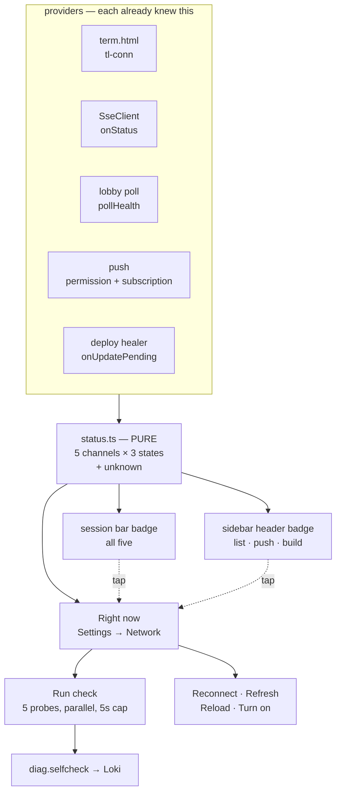

# Connection status a client can see

**Status:** built, 2026-09-01 · **ADR:** [0016](../adr/0016-connection-status-in-the-ui.md)

Viktor asked for it in one line: *"clients should be able to see their
connection status (e.g. is websockets working) etc. this should be viewable in
the ui somewhere so it's easy to see the status."*

```stats
5 | channels, one status model
2 | of them were visible before
3 | states, plus one that is not a verdict
5 s | cap per probe, all run in parallel
0 | notifications a check sends
```

A client keeps five things alive. Before this, a person could see two.

| Channel | Transport | What a user could see |
|---|---|---|
| Terminal | WebSocket → ttyd, inside the `term.html` iframe | a pill *inside the iframe* |
| Transcript | SSE `/events/<session>` | a badge, **text view only** |
| Session list | HTTP poll, 5 s, backoff to 30 s | nothing |
| Notifications | service worker + push subscription | nothing |
| Build | the deploy healer's asset-id check | nothing |

`SessionView.tsx` already carried a comment explaining why the badge hides on
the Terminal view: a status for a surface you are not looking at reads as the
terminal's. That reasoning was right, and it left the terminal — the thing
actually in front of you — reporting nothing at all.

ADR-0008 has been recording every drop, reconnect and stall to Loki for weeks,
which is where the history belongs and where it stays. What it does not yet
cover is answering the question on the device: reading Loki means opening
Grafana, and the person holding the frozen phone cannot.

## The shape



Nothing new is polled. Every provider was already computing its own health and
had nowhere to say it; the poll's failure ladder and the healer's deferred-update
plan were both entirely internal until now.

## What was decided, and why

| Decision | Chosen | The alternative, and what it cost |
|---|---|---|
| Audience | Verdict first, detail below | End-user-only reads well and still sends you to Grafana for someone else's report |
| Channels | The five that carry work | Adding telemetry and network identity duplicates the page below and adds a row nobody can act on |
| Check | Passive state **and** an active check | Passive alone cannot answer "is push broken?" — a subscription looks healthy right up until nothing arrives |
| Scope | Connections plus build version | A tab on old JavaScript against a new server looks exactly like a broken connection |
| Home | First group of Settings → Network | A second rail page called "Connection" splits one mental model across two adjacent entries |
| Badge | Session bar, **or** sidebar header — never both (amended, see below) | The mobile list screen is the whole viewport and would otherwise have no status at all |
| Wording | Dot always, word when wrong | An always-on "Connected" spends bar width on the state that is true 99% of the time |
| Push | Read state, send nothing | `/push/test` fans out to every device; a diagnostic that buzzes the phone in your pocket is one you stop running |
| States | Three, plus a neutral `unknown` | Two states collapse "wait" and "act", which is the one distinction a frozen terminal needs |
| Repairs | Per-row, explicitly tapped | A check that repairs as it goes destroys the state its reader came to look at |
| Timing | Parallel, 5 s each, rows land independently | Serial reaches 20-25 s on a bad link; one combined result shows nothing for 5 s |
| History | Since page load, in memory | Persisting costs a storage decision and a Privacy question; Loki already holds the durable copy |
| Reach | This tab, plus two read-only calls about this device | "All your devices" needs new server state and a retention policy — its own project |

## Three states, and one value that is not a state

`working` / `degraded` / `down`, and `unknown`.

`unknown` is the load-bearing one. Every rule skips it rather than counting it as
health or as fault, which is what makes the whole thing safe to build on top of a
provider that might not answer: a booting terminal iframe, a cached older build
that predates the `tl-conn` message, a browser without push, a screen with no
terminal on it. Two readings have to be avoided here, and skipping `unknown` avoids
both: reporting "everything is connected" on the strength of channels that have
not spoken, and reporting a fault because one has not.

The session list needed its own thinking, because it is the one channel that is
not a persistent connection. "Connected" is a fiction for a 5 s poll, so its row
reports what is true instead: it is working while polls return, degraded while
the backoff ladder climbs, and down after 60 s of failure — two full rungs of a
ladder capped at 30 s.

## The terminal seam, and the port it is waiting for

`term.html` posts `{type:'tl-conn', state, attempt}` up, and answers `tl-conn-ask`
with its current state. Four call sites: the pill painter, the socket's open
path, the session-ended path, and the battery-saver suspend — which reports
`suspended` and is treated as **working**, because the app closed that socket on
purpose and reopens it on the next visibility change.

Viktor raised the obvious alternative mid-design: render the terminal natively in
the SPA and the seam disappears, because the socket becomes a signal like any
other. That is the right direction and the codebase is already leaning toward it
(`theme.ts`: "once it owns xterm"; `keybindings/engine.ts`: "future xterm merge").

It was deliberately not made a prerequisite. Measured: `term.html` is 1.46 MB, of
which 946 KB is the vendored xterm bundle and 471 KB / 8,111 lines is app
logic — the reconnect ladder, the liveness watchdog for half-open mobile
sockets, battery suspend, sixel, the mobile keyboard, clipboard, fonts, themes.
The vendor bundle is transpiled to `safari15` because iPadOS 15's WebKit cannot
parse xterm 6's static blocks. Putting a status panel behind that port would
delay it considerably, and the port changes exactly one thing in this design:
where the terminal's status comes from. Written as a provider rather than a
protocol, it is one message type that a native component later replaces with a
local signal.

The panel is also a useful instrument to have *before* the port, since it is what
will say whether a native terminal reconnects as well as the proven one does.

## What Run check actually does

Five probes, all read-only, fired together, each capped at 5 s, each reported the
moment it lands.

| Row | What the probe reads |
|---|---|
| Terminal | asks the frame to re-report; silence means "not reporting", never "dead" |
| Transcript | the session view's current SSE status |
| Session list | the poll's own bookkeeping, plus `/health` to separate "this tab is stuck" from "the API is down" |
| Notifications | permission, service worker, this device's subscription, and `GET /push-subscriptions` — whether the **server** still holds this endpoint |
| Build | whether the healer has a deferred update |

The notifications row is the one with a deliberate limit. Reading four things
that all look right does not prove a notification would arrive; delivery stays
unproven until someone presses "Send a test" on the Notifications page, which is
still there. What it does catch is the silent failure: everything local reads
healthy while the server dropped the endpoint after a 410 and nothing has been
delivered since.

## Privacy

The panel is a local readout and sends nothing. It works with diagnostics
switched off, which follows the principle already written into
`telemetry/diag.ts` — *"Counting is not consent to send"* — and the fact that
`pushRing` in `diag.js` was already ungated while `emit`/`flush` are gated.

One record is added to the ADR-0008 catalog: `diag.selfcheck`, one per Run check,
carrying each row's verdict and its timing, under the same opt-out as everything
else. It is the only record that says what the UI *claimed*, which is what a
support question is actually about.

Testing that record end to end surfaced a separate, pre-existing gap:
`packaging/build-deb.sh` built the SPA without `TL_BUILD` in its environment, so
vite compiled the literal `__TL_BUILD__` into the bundle and every lobby
diagnostics record reported that string as its build — 100 of 100 records over
12 hours, well before this work. `tl.build` is the attribute that says which
build a client was running when something broke, so the SPA's half of ADR-0008
could not be attributed to a release. `term.html` was unaffected, because
`tl-stamp` stamps it with the same commit. Fixed by passing `$COMMIT` to the
build, and the placeholder guard now scans the emitted chunks as well as the two
stamped HTML surfaces — it only covered the surfaces, which is why this class of
leak got past it.

## What opening the real page changed

Three things were wrong in a way the tests could not see, because each was a
correct implementation of a rule that turned out to be wrong.

1. **The badge read "Offline" on a healthy client.** The browser had never
   subscribed to push, notifications mapped to `down`, and worst-of painted the
   whole client offline while every connection was fine. Push being
   off is the default state of a fresh browser and a deliberate choice in one
   that refused it — neither is this client failing. Not-set-up is now `unknown`,
   so it never colours the badge; the row still says "off for this device" and
   still offers Turn on.
2. **A terminal that had never dropped reported "dropped once".** Every channel
   starts `unknown` and climbs through `degraded` on the way up, and the history
   rule counted that first connect as a fall. A fault is now a fall *from
   working*, or a channel whose first observation is already `down`.
3. **Switching sessions counted as a drop.** Views stay mounted, so the outgoing
   terminal's `working` fell to the incoming terminal's `connecting` — two
   healthy sockets reported as an outage. A view now withdraws its terminal when
   it leaves the screen, the way it already withdrew its transcript, and asks the
   frame to re-report when it comes back (the frame sends one message per real
   change, so it will not volunteer a state it has already sent).

All three are now covered by tests. The first two were pure-model bugs a unit
test would have caught had it been written to the right rule; the tests as
written encoded the same assumption the code did, which is why opening the page
was what found them.

## Amendment, 2026-09-02: one indicator at a time

Viktor, on the shipped version: *"we show too many indicators when something is
connected or not."* He was right, and two of the three were added by this work.

Measured on one screen during a single dropped socket:

| Indicator | Said | Where |
|---|---|---|
| Terminal pill | "Reconnecting… (attempt 7)" | inside the iframe |
| Session bar badge | "Reconnecting" | 40px above it |
| Sidebar header badge | ● green | top-left |

Two identical statements, and a contradiction: the sidebar's badge is scoped to
the three channels a list screen can answer for, so it knew nothing about the
terminal and stayed green while the other two went amber. Each was correct
alone. Together they read as a system that cannot agree with itself.

The rule now is that exactly one connection indicator is on screen at a time:

- the **sidebar badge** stands down whenever a session bar is on screen, and
  covers the screens without one — the phone's list, which is the whole
  viewport, and the desktop empty state;
- the **pill** does not speak when framed. Standalone `term.html` is unchanged;
- the **badge** carries the retry attempt the pill used to show, so a climbing
  ladder still reads differently from a stuck one.

`.tl-conn`, the text view's old SSE word badge, is deleted with the same change.
It had been unreachable since the badge replaced it.

The first cut of this kept one exception: the pill would still appear to report
keystrokes **held** during a drop, which the badge cannot say. That exception is
gone. Held keys are drawn as `.tl-held` glyphs in the terminal itself, at the
cursor, showing the actual characters — the pill's count was a fallback for
characters past the last visible row, so a third copy of a reassurance already
on screen twice. It was also the only branch of the change that could not be
exercised: reproducing held keys requires a socket that connects and then drops
with input arriving in between, which the available harnesses could not stage.
Carrying an unverifiable branch to duplicate an existing signal is a poor trade.

## What this does not do

- **Report on your other devices.** "Your phone last connected 2h ago" needs new
  server-side state and a retention decision.
- **Persist history across reloads.** The counts reset, and a frozen terminal is
  usually met with a reload. Worth revisiting if that turns out to bite.
- **Prove push delivery.** By design, per above.
- **Show exceptions, slow API calls or stalls.** diag.js collects all of it, and
  a Problems section would turn an answer into a developer console.

## Open questions

- The 60 s degraded→down threshold for the session list is reasoned, not measured
  against how often a real link recovers on the third rung.
- The down-state phrasing has been exercised against induced failures, not
  against a genuinely broken box.
- If "my phone stopped buzzing" keeps arriving after this ships, a device-scoped
  `/push/test` is the next thing to build.
