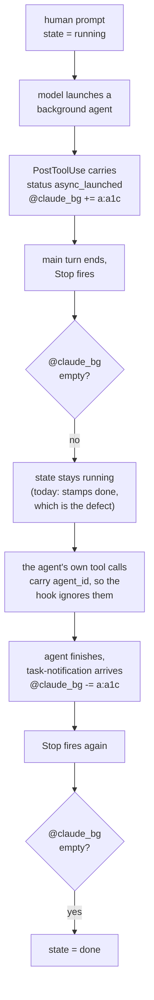

# A session is not done while its background work is running

**Status:** shipped 2026-09-04 in v0.28.3, verified on the box.
**Owner:** wizard. **Repos touched:** terminal-lobby only.

The sidebar's state dot goes green the moment the main Claude turn ends, even
when that turn's last act was to launch a background agent, a `Workflow`, or a
background `Bash`. The session reads *Done* while it is in fact still working
and will speak again on its own. This design keeps the three existing states and
makes `done` conditional on nothing being outstanding.

## What the mechanism does today

`@claude_state` is written only by `devvm/claude-tmux-state`, wired org-wide in
`/etc/claude-code/managed-settings.json` (ADR-0001). Seven events are wired:
`SessionStart`→done, `UserPromptSubmit`/`PreToolUse`/`PostToolUse`→running,
`Stop`→done, `SessionEnd`→clear, `Notification`→classified.

## Measured behaviour

A real `claude` 2.1.260 in a scratch tmux server, every hook event logged with
its full stdin payload, one background `Bash` and one background `Agent`
launched from a single prompt (2026-09-04, 05:09–05:12 UTC):

```
05:09:37  PreToolUse    Bash   run_in_background=true
05:09:38  PreToolUse    Agent  subagent_type=general-purpose
05:09:38  SubagentStart agent_id=a1cbb47bebad51b9b
05:09:39  PostToolUse   Bash   tool_response.backgroundTaskId=bmm8ohp9u
05:09:41  Stop                                   ← stamps done
05:09:51  PreToolUse    Bash   agent_id=a1cbb47…  ← stamps running
05:09:55  PreToolUse    ToolSearch agent_id=a1cbb47…
05:10:19  UserPromptSubmit  prompt=<task-notification><task-id>bmm8ohp9u…
05:10:23  Stop                                   ← stamps done
05:11:57  SubagentStop  agent_id=a1cbb47bebad51b9b
05:11:58  UserPromptSubmit  prompt=<task-notification><task-id>a1cbb47…
05:12:00  Stop
```

Two distinct defects fall out of that trace.

**1. `Stop` fires while background work runs.** At 05:09:41 the dot went green.
The agent it had just launched ran for another 2m16s.

**2. A subagent's own tool calls fire `PreToolUse`/`PostToolUse` in the main
session**, carrying `agent_id`. The trace above was captured with a logging
hook rather than the real script, so what follows is derived from the script's
rules rather than sampled: it stamps `running` on every `PreToolUse`, so between
05:09:41 and 05:10:23 `@claude_state` alternates between `done` and `running`.
tmux-api caches the session list for 5s and the lobby polls every 5s, so which
value a person sees depends on when the sample lands. That is the most likely
explanation for the symptom being intermittent, and the repo test below samples
the option directly to confirm it.

## What the hooks already carry

Every launch and every completion is identifiable from events that are already
wired. No transcript polling and no new service.

| launch (`PostToolUse`, `agent_id` absent) | id field in `tool_response` | completion |
|---|---|---|
| background Agent | `agentId`, alongside `status:"async_launched"` | `UserPromptSubmit` whose prompt opens `<task-notification>` |
| background Bash | `backgroundTaskId` | same |
| `Workflow` | `taskId`, alongside `taskType:"local_workflow"` | same |

The completion event names the id in `<task-id>`, which matches the launch id
exactly in all three cases.

Two facts constrain the implementation:

- Payloads are compact JSON with no whitespace (`"agent_id":"a1cbb…"`), so `case`
  and `sed` extract the fields. `claude-tmux-state` stays dependency-free, unlike
  `claude-se-hook` which needs `jq`.
- A **subagent's** background launches also carry `backgroundTaskId` (05:09:51
  above). Their notifications go to the subagent, never to the main thread, so
  counting them would leave an id that nothing can remove. Only launches with no
  `agent_id` are counted.

`TaskCreated` and `TaskCompleted` exist as event names in the binary and did not
fire for any of these launches. `SubagentStart`/`SubagentStop` do fire and are
accurate, but wiring them means an infra-repo change that reaches every user and
every headless Claude on the box, so they are deliberately not used.

## The model

A session with pending background work stays **`running`**. The wire keeps
`running`/`awaiting`/`done` and gains a per-kind count.

The reasoning: `running` already means "this session is working and will produce
more output". The one thing that used to make it mean more — session-events'
`POST /prompt` 409 turn gate — was removed, so `running` no longer stops anyone
typing. Every existing consumer then behaves correctly with no change: push
holds its "finished" alert, skills-api keeps refusing a restart that would
orphan a workflow, and t3-bridge holds its Working pin, which also keeps T3's
30-minute reaper off a session that is mid-workflow.



### Rules the hook applies

| event | condition | action |
|---|---|---|
| `UserPromptSubmit` | prompt opens `<task-notification>` | remove its `<task-id>` from `@claude_bg`; stamp `running` |
| `UserPromptSubmit` | anything else (a human prompt) | stamp `running`; leave `@claude_bg` alone *(revised 2026-09-12; the callout below says what this row used to say)* |
| `PreToolUse`/`PostToolUse` | `agent_id` present | do nothing |
| `PostToolUse` | `agent_id` absent, `tool_response` carries `agentId` / `backgroundTaskId` / `taskId` with `status:"async_launched"` | add `<kind>:<id>` to `@claude_bg`; stamp `running` |
| `PreToolUse`/`PostToolUse` | `agent_id` absent, no async id | stamp `running` (unchanged) |
| `SubagentStart` | `agent_id` is `a<agent_type>-<hash>`, i.e. a teammate | add `t:<name>` to `@claude_bg`; stamp `running` *(added 2026-09-12)* |
| `SubagentStart` | anything else (a plain subagent) | do nothing: the registry retires it honestly *(added 2026-09-12)* |
| `TeammateIdle` | — | remove `t:<teammate_name>`; stamp nothing *(added 2026-09-12)* |
| `Stop` | — | rebuild `@claude_bg` from `background_tasks`, carrying `t:` tokens through *(revised 2026-09-12)* |
| `Stop` | `@claude_bg` empty | stamp `done` (unchanged) |
| `Stop` | `@claude_bg` non-empty | stamp `running` |
| `SessionStart` | `source` is `startup` or `resume` (a new process) | clear `@claude_bg`; stamp `done` |
| `SessionStart` | `source` is `compact` or `clear` (the same process) | leave `@claude_bg` alone; stamp from it, as `Stop` does *(added 2026-09-12)* |
| `SessionEnd` | — | clear both |
| `Notification` | — | unchanged (ADR-0001's classification) |

`@claude_bg` holds space-separated `<kind>:<id>` tokens, kind being `a` (a
background subagent), `b` (a background command), `w` (a workflow) or `t` (a
teammate), e.g. `a:a1cbb47bebad51b9b b:bmm8ohp9u`. Storing the kind is what lets
the card say *2 agents* rather than only a total; `a` and `t` both read as
*agent* there.

The first three are keyed by the harness's own task id. A teammate is keyed by
its NAME, because `background_tasks` reports a teammate as `running` for as long
as it exists — measured three times on 2026-09-12, the last 3m30s after it had
answered and while the harness's own bar showed it *idle*. The name is what
`SubagentStart` and `TeammateIdle` carry, `Stop` carries those tokens through a
rebuild rather than re-deriving them, and they are dropped when the list holds
no teammate at all. For the same reason a task type the script does not
recognise is skipped rather than counted: a session stuck at `running` refuses
the model picker and holds a T3 attach pin open, with no expiry to fall back on,
while a late green dot corrects itself at the next launch.

`sessionio.Injector.Cancel` already re-derives `@claude_state` after an interrupt
(ADR-0001); it reads `@claude_bg` to decide which state to stamp, and leaves the
set alone — an interrupt ends the turn, not the work, confirmed 2026-09-12 by
interrupting a session with both kinds live (*revised; as shipped it cleared the
set at the same instant*). tmux-api's `clearDeadStates` liveness backstop drops
both options together when no claude lives under the session's `pane_pid`.

## What changes

| file | change |
|---|---|
| `devvm/claude-tmux-state` | the rules table above; `@claude_bg` becomes its second output |
| `tmux-api/main.go` | read `@claude_bg` in the existing `list-sessions -F` call; serialise a per-kind count |
| `tmux-api/proc.go` | `clearDeadStates` clears `@claude_bg` too |
| `sessionio/tmux.go` | `Injector.Cancel` stamps from `@claude_bg`; name the option beside `OptionState` |
| `frontend-v2/src/types/lobby.ts` | the new count field on `Session` |
| `frontend-v2/src/components/SessionCard.tsx` | `Working · 2 agents` beside the dot |
| `frontend-v2/src/components/lobby.logic.ts` | a background chip in `countStates` for collapsed group headers |
| `frontend-v2/src/components/TextView.tsx` (working row) | keep the live row up while background work is outstanding, naming what is outstanding |
| `tl-session-watch/{watch,collect,emit}.go` | carry the count into the logfmt line |

Untouched by design, and correct without changes: `StateDot.tsx`, the state CSS,
`stateLabel`, `favicon.ts`, `tmux-api/pushsender.go`, `skills-api/restart.go`,
`t3-bridge/liveness.go`.

### On screen

```
●  Working · 2 agents          3:41
●  Working · 1 workflow       21:07
●  Working · 1 command         0:52
●  Working · 2 agents, 1 command
●  Working                     0:14      (main turn, nothing backgrounded)
```

The dot, its colour and its pulse are unchanged.

## Accepted trade-offs

**No expiry on an outstanding id.** Decided 2026-09-04, and unchanged. The set
is emptied by `SessionEnd`, an interrupt, the dead-claude backstop, a
`SessionStart` that is a new process, and — since 2026-09-12 — the prune at
`Stop`. No timer anywhere.

> [!IMPORTANT]
> **The human-prompt clear was removed on 2026-09-12.** As shipped, this section
> also read *a human prompt clears the set*, and named the cost: "launch a long
> workflow, then send a second prompt while it runs, and the set is cleared, so
> the next `Stop` reports `done` with the workflow still going."
>
> That case bit. Viktor reported it as "Claude starts a workflow, then the status
> for that session becomes green", and across the 105 workflow runs recorded on
> this box, 43 (40%) had a human prompt land mid-run. A compaction did the same
> thing without anyone typing, through the `SessionStart` clear.
>
> The upgrade this section predicted — provisional ids, confirmed by subagent
> traffic — was not needed. The prune at `Stop` reads the harness's own live
> list, which is the re-derivation the clear was standing in for, and it now
> covers workflows too (see the next trade-off). So a stale id is still
> clearable without a timer: it goes at the end of the next turn, rather than
> the moment somebody types.

## Open questions

Both were answered on 2026-09-12 by running a real `Workflow` in a tmux session
with every hook logging its stdin (claude 2.1.269). The fixtures under
`sessionio/testdata/hooks/` are that capture.

- ~~Whether a `Workflow` launch's `PostToolUse` `tool_response` carries `taskId`
  in the same shape a completed run records in the transcript.~~ It does, byte
  for byte with the transcript shape:
  `{"status":"async_launched","taskId":"w7t7pnsug","taskType":"local_workflow","runId":"wf_ee0ad82c-2d8",…}`.
  `post_workflow_launch.json` is now that live payload rather than the
  transcript's.
- ~~Whether agents running inside a `Workflow` fire `PostToolUse` with
  `agent_id` in the hosting session.~~ They do, and the existing `agent_id` rule
  filters them: a workflow agent's `Bash` call arrived 1.6 s after the launch
  carrying `agent_id` and `agent_type`, and changed nothing.
- Answered in the same run, and the reason this design's one accepted cost could
  be removed: a RUNNING workflow is listed in `Stop`'s `background_tasks`, as
  `{"id":"w7t7pnsug","type":"workflow","status":"running","name":"probe-slow"}`.
  `workflow` is a third kind beside `shell` and `subagent`.

A fourth kind turned up the same evening, and it does not fit the model above.
Viktor: "even though the agents are running, the session says it's green or
done". An agent TEAM is the `Agent` tool given a `name`, and a teammate is
invisible to every signal this design used. Measured on 2.1.269, 2026-09-12,
with every hook event logging its stdin:

| what | a background subagent | a teammate |
|---|---|---|
| the launch answers | `{"status":"async_launched","agentId":"a7a33e…"}` | `{"status":"teammate_spawned","name":"counter","teammate_id":"counter@session-337349ca"}` |
| the id in `background_tasks` | the same `a7a33e…` | `tocihyt26`, which appears nowhere in the launch |
| when it finishes | leaves the list; a `<task-notification>` arrives as a prompt | stays in the list as `"status":"running"`; no prompt hook fires at all |

The last cell is the load-bearing one: a teammate's answer reaches the lead over
the team's own channel, so no `UserPromptSubmit` fires, and a `Stop` taken 3m30s
after the teammate had answered still listed it as running while the harness's
own bar showed it *idle*. 85 of the 136 `Agent` launches in this box's
transcripts that week were teammates, so this was the majority path.

Two events answer it, and wiring them is the `managed-settings.json` change this
design had declined to make: `SubagentStart` fires on every activation — the
spawn, a `SendMessage`, or a person typing into the teammate's pane — and
`TeammateIdle` fires when it stops. A teammate's `SubagentStart` is told from a
plain subagent's by the id the harness builds: `aprobe2-9b0fe9e64c9f7bdf` with
`agent_type` `probe2` against `a8574b6e73ce517a0` with `agent_type`
`general-purpose`. `SubagentStop` stays unused, since `TeammateIdle` names the
teammate directly. `TaskCreated` and `TaskCompleted` are valid event names in
2.1.269 and fired for none of the four kinds.

## How it was verified

**In CI**, `sessionio/hookscript_test.go` runs the real script against a real
tmux server, firing the payloads recorded on 2026-09-04 as the hook runner does
— one argv word, the payload on stdin. Eleven cases, including the two defects
and the silence the hook runner requires on stdout. The fixtures are recorded
rather than written, so a payload-shape change fails there instead of reaching
the box. `tl-session-watch` joined the release workflow's Go loop at the same
time; its tests had never run in CI.

**On the box**, against a real `claude` 2.1.260 and the installed hook, with the
scratch server keeping every lobby session out of it:

```
elapsed   state     @claude_bg
+0s       done      <empty>
+5s       running   a:a9152b596780a40d5   ← agent launched
+101s     running   a:a9152b596780a40d5   ← Stop fired around +10s
+122s     running   <empty>               ← task-notification retired it
+127s     done
```

117 seconds where the old script read *Done*.

**In the deployed lobby**, three live sessions at once, read back from the DOM
and from a screenshot: `Notificati… 2 commands 0:56`, `Book downloa… 1 command`
(on an *awaiting* dot, since a blocked ask outranks), `YouTube video … 4 co…`.
The Text view strip read *Still working in the background: 2 commands* between
the timeline and the composer. Driving it needed the identity header supplied
locally, because `terminal.viktorbarzin.me` is behind Authentik and no
automated client passes it; everything served was the installed package's own
files and the live services on the box.

That pass found one defect the tests could not: the label ellipsised to
`2 com…` in the 260px sidebar, because it shrank in step with the session name.
The name gives up the room now — it already truncates, and a half-shown title
still identifies a session.

**Not verified:** a `Workflow` launch end to end. Its `w:` path is covered by a
fixture carrying the transcript shape, not by a live payload.

## Vocabulary

`CONTEXT.md` gains one term under **Session state**:

> **Outstanding work**: background tasks a session launched that have not
> reported back — background subagents, `Workflow` runs and background commands.
> A session with any outstanding work is *running*, not *completed*, because it
> will produce more output without anyone prompting it. Kept as the set of task
> ids in the session's `@claude_bg` option, added when a launch returns
> `async_launched` and removed when that id's task-notification arrives, or at
> the end of any turn in which the harness no longer lists it.
> _Avoid_: pending tasks, background jobs (both read as shell job control)

ADR-0001 gains a consequence recording that `Stop` alone is not the end of a
turn's work, and that a subagent's tool calls reach the same hooks.
