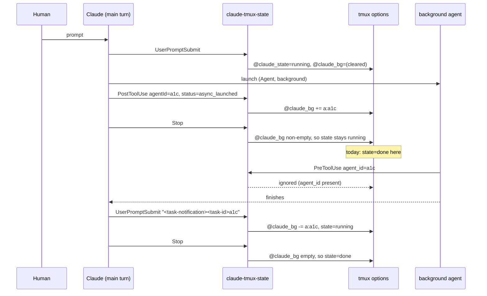

# A session is not done while its background work is running

**Status:** designed 2026-09-04, awaiting confirmation before implementation.
**Owner:** wizard. **Repos touched:** terminal-lobby only.

The sidebar's state dot goes green the moment the main Claude turn ends, even
when that turn's last act was to launch a background agent, a `Workflow`, or a
background `Bash`. The session reads *Done* while it is in fact still working
and will speak again on its own. This design keeps the three existing states and
makes `done` conditional on nothing being outstanding.

## What the mechanism does today

`@claude_state` is written only by `devvm/claude-tmux-state`, wired org-wide in
`/etc/claude-code/managed-settings.json` (ADR-0001). Seven events are wired:
`SessionStart`→done, `UserPromptSubmit`/`PreToolUse`/`PostToolUse`→running,
`Stop`→done, `SessionEnd`→clear, `Notification`→classified.

## Measured behaviour

A real `claude` 2.1.260 in a scratch tmux server, every hook event logged with
its full stdin payload, one background `Bash` and one background `Agent`
launched from a single prompt (2026-09-04, 05:09–05:12 UTC):

```
05:09:37  PreToolUse    Bash   run_in_background=true
05:09:38  PreToolUse    Agent  subagent_type=general-purpose
05:09:38  SubagentStart agent_id=a1cbb47bebad51b9b
05:09:39  PostToolUse   Bash   tool_response.backgroundTaskId=bmm8ohp9u
05:09:41  Stop                                   ← stamps done
05:09:51  PreToolUse    Bash   agent_id=a1cbb47…  ← stamps running
05:09:55  PreToolUse    ToolSearch agent_id=a1cbb47…
05:10:19  UserPromptSubmit  prompt=<task-notification><task-id>bmm8ohp9u…
05:10:23  Stop                                   ← stamps done
05:11:57  SubagentStop  agent_id=a1cbb47bebad51b9b
05:11:58  UserPromptSubmit  prompt=<task-notification><task-id>a1cbb47…
05:12:00  Stop
```

Two distinct defects fall out of that trace.

**1. `Stop` fires while background work runs.** At 05:09:41 the dot went green.
The agent it had just launched ran for another 2m16s.

**2. A subagent's own tool calls fire `PreToolUse`/`PostToolUse` in the main
session**, carrying `agent_id`. The current hook stamps `running` on those, so
between 05:09:41 and 05:10:23 the dot alternated green and blue. tmux-api caches
the session list for 5s and the lobby polls every 5s, so which colour a person
sees depends on when the sample lands. This is why the symptom is intermittent.

## What the hooks already carry

Every launch and every completion is identifiable from events that are already
wired. No transcript polling and no new service.

| launch (`PostToolUse`, `agent_id` absent) | id field in `tool_response` | completion |
|---|---|---|
| background Agent | `agentId`, alongside `status:"async_launched"` | `UserPromptSubmit` whose prompt opens `<task-notification>` |
| background Bash | `backgroundTaskId` | same |
| `Workflow` | `taskId`, alongside `taskType:"local_workflow"` | same |

The completion event names the id in `<task-id>`, which matches the launch id
exactly in all three cases.

Two facts constrain the implementation:

- Payloads are compact JSON with no whitespace (`"agent_id":"a1cbb…"`), so `case`
  and `sed` extract the fields. `claude-tmux-state` stays dependency-free, unlike
  `claude-se-hook` which needs `jq`.
- A **subagent's** background launches also carry `backgroundTaskId` (05:09:51
  above). Their notifications go to the subagent, never to the main thread, so
  counting them would leave an id that nothing can remove. Only launches with no
  `agent_id` are counted.

`TaskCreated` and `TaskCompleted` exist as event names in the binary and did not
fire for any of these launches. `SubagentStart`/`SubagentStop` do fire and are
accurate, but wiring them means an infra-repo change that reaches every user and
every headless Claude on the box, so they are deliberately not used.

## The model

A session with pending background work stays **`running`**. The wire keeps
`running`/`awaiting`/`done` and gains a per-kind count.

The reasoning: `running` already means "this session is working and will produce
more output". The one thing that used to make it mean more — session-events'
`POST /prompt` 409 turn gate — was removed, so `running` no longer stops anyone
typing. Every existing consumer then behaves correctly with no change: push
holds its "finished" alert, skills-api keeps refusing a restart that would
orphan a workflow, and t3-bridge holds its Working pin, which also keeps T3's
30-minute reaper off a session that is mid-workflow.



### Rules the hook applies

| event | condition | action |
|---|---|---|
| `UserPromptSubmit` | prompt opens `<task-notification>` | remove its `<task-id>` from `@claude_bg`; stamp `running` |
| `UserPromptSubmit` | anything else (a human prompt) | **clear `@claude_bg`**; stamp `running` |
| `PreToolUse`/`PostToolUse` | `agent_id` present | do nothing |
| `PostToolUse` | `agent_id` absent, `tool_response` carries `agentId` / `backgroundTaskId` / `taskId` with `status:"async_launched"` | add `<kind>:<id>` to `@claude_bg`; stamp `running` |
| `PreToolUse`/`PostToolUse` | `agent_id` absent, no async id | stamp `running` (unchanged) |
| `Stop` | `@claude_bg` empty | stamp `done` (unchanged) |
| `Stop` | `@claude_bg` non-empty | stamp `running` |
| `SessionStart` | — | clear `@claude_bg`; stamp `done` |
| `SessionEnd` | — | clear both |
| `Notification` | — | unchanged (ADR-0001's classification) |

`@claude_bg` holds space-separated `<kind>:<id>` tokens, kind being `a` (agent),
`b` (background command) or `w` (workflow), e.g. `a:a1cbb47bebad51b9b b:bmm8ohp9u`.
Storing the kind is what lets the card say *2 agents* rather than *3 things*.

`sessionio.Injector.Cancel` already re-derives `@claude_state` after an interrupt
(ADR-0001); it clears `@claude_bg` at the same instant. tmux-api's
`clearDeadStates` liveness backstop drops both options together when no claude
lives under the session's `pane_pid`.

## What changes

| file | change |
|---|---|
| `devvm/claude-tmux-state` | the rules table above; `@claude_bg` becomes its second output |
| `tmux-api/main.go` | read `@claude_bg` in the existing `list-sessions -F` call; serialise a per-kind count |
| `tmux-api/proc.go` | `clearDeadStates` clears `@claude_bg` too |
| `sessionio/tmux.go` | `Injector.Cancel` clears `@claude_bg`; name the option beside `OptionState` |
| `frontend-v2/src/types/lobby.ts` | the new count field on `Session` |
| `frontend-v2/src/components/SessionCard.tsx` | `Working · 2 agents` beside the dot |
| `frontend-v2/src/components/lobby.logic.ts` | a background chip in `countStates` for collapsed group headers |
| `frontend-v2/src/components/TextView.tsx` (working row) | keep the live row up while background work is outstanding, naming what is outstanding |
| `tl-session-watch/{watch,collect,emit}.go` | carry the count into the logfmt line |

Untouched by design, and correct without changes: `StateDot.tsx`, the state CSS,
`stateLabel`, `favicon.ts`, `tmux-api/pushsender.go`, `skills-api/restart.go`,
`t3-bridge/liveness.go`.

### On screen

```
●  Working · 2 agents          3:41
●  Working · 1 workflow       21:07
●  Working · 1 command         0:52
●  Working · 2 agents, 1 command
●  Working                     0:14      (main turn, nothing backgrounded)
```

The dot, its colour and its pulse are unchanged.

## Accepted trade-offs

**No expiry on an outstanding id, and a human prompt clears the set.** Decided
2026-09-04. The set is emptied by four things: a human prompt, `SessionStart`,
`SessionEnd`, an interrupt, and the dead-claude backstop. No timer anywhere.

The cost is one wrong reading, in a case we can name: launch a long workflow,
then send a second prompt while it runs, and the set is cleared, so the next
`Stop` reports `done` with the workflow still going. That session shows today's
behaviour until the workflow ends. The alternative — carrying ids across a human
prompt — was rejected because it makes a stale id unclearable by anything a
person can type, which is the failure ADR-0001 avoided by making a typed prompt
the recovery path.

If that case turns out to bite, the known upgrade is to mark ids provisional at
a human prompt rather than dropping them, confirm any that produce subagent
traffic during the new turn, and drop the unconfirmed ones at the next `Stop`.
That needs per-id activity bookkeeping across turns, which is why it is not the
starting design.

## Open questions

- Whether a `Workflow` launch's `PostToolUse` `tool_response` carries `taskId` in
  the same shape a completed run records in the transcript. The transcript
  evidence is real (`{"status":"async_launched","taskId":"wy71p4jz3","taskType":"local_workflow"}`
  from a run on 2026-09-02); the hook-payload form of it has not been observed
  directly and is confirmed as the first step of implementation.
- Whether agents running inside a `Workflow` fire `PostToolUse` with `agent_id`
  in the hosting session. If they do not, nothing changes; if they do, they are
  filtered by the same `agent_id` rule.

## How this is verified

Two levels, both required before the change is called done.

1. **A repo test around a real claude.** The scratch harness built during this
   design becomes a test: a `claude` in its own `tmux -L` server, a `settings.json`
   pointing every event at the hook, a prompt that launches one background agent
   and one background command, and assertions on `@claude_state` and `@claude_bg`
   sampled over time. The failing assertion today is the one at t+4s, where the
   option reads `done` and should read `running`. The hook has no tests at
   present and ships `Unmanaged` in `release/manifest.go`.
2. **Driving the real lobby.** `terminal.viktorbarzin.me` in a browser, a session
   with a background agent running, a screenshot of the card reading
   `Working · 1 agent`, read back rather than assumed.

Recorded payloads from the 2026-09-04 run are kept with the test as fixtures, so
a payload-shape change fails loudly rather than silently latching a session.

## Vocabulary

`CONTEXT.md` gains one term under **Session state**:

> **Outstanding work**: background tasks a session launched that have not
> reported back — background subagents, `Workflow` runs and background commands.
> A session with any outstanding work is *running*, not *completed*, because it
> will produce more output without anyone prompting it. Kept as the set of task
> ids in the session's `@claude_bg` option, added when a launch returns
> `async_launched` and removed when that id's task-notification arrives. Cleared
> by a human prompt, so typing into a session is what re-derives it.
> _Avoid_: pending tasks, background jobs (both read as shell job control)

ADR-0001 gains a consequence recording that `Stop` alone is not the end of a
turn's work, and that a subagent's tool calls reach the same hooks.
