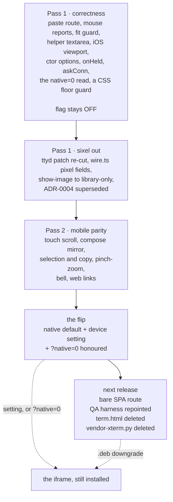
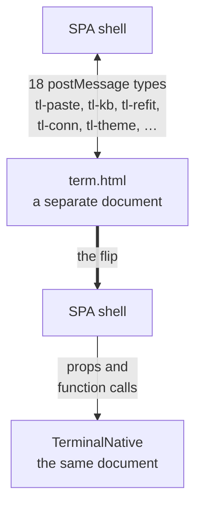

# Removing the iframe from terminal mode

Viktor, 2026-09-04: *"let's work on removing the iframe from terminal mode and
make it native instead."*

Terminal mode is a cross-document `iframe` around `frontend/term.html`. This plan
takes the SPA the rest of the way to rendering the terminal itself, retires the
`postMessage` protocol between the two, and deletes `term.html`.

It continues [ADR-0017](../adr/0017-the-lobby-renders-its-own-terminal.md), which
landed the first stage on 2026-09-02 (`1b9e545`).

## Where this starts, measured today

| fact | value | how it was checked |
|---|---|---|
| prod frontend | the SolidJS SPA | `/usr/local/share/ttyd/index.html` is 68,668 bytes beside `assets/`, `fonts/`, `sw.js`, `manifest.webmanifest`, `build-id` |
| prod terminal | the iframe | `/usr/local/share/ttyd/term.html`, 1,529,744 bytes |
| installed package | `terminal-lobby 0.25.3` | `dpkg` on the devvm |
| native path | behind `?native=1`, default off | `SessionView.tsx:179-186`, `:915` |
| tiers | one | `terminal-dev` + `ttyd-v2` :7687 removed 2026-08-16; `ttyd-ro` :7682 removed 2026-08-29 |
| native modules | 9 files, `src/terminal/`, 366 tests | ADR-0017 |

Two facts about the deployment shape matter later. `manifest.webmanifest:5` sets
`"start_url": "/"`, so a URL flag does not survive a PWA icon launch, and
`ttyd` is invoked as `... -p 7681 /usr/local/bin/tmux-attach.sh`, so it holds a
tmux *client* per websocket while a separate tmux server owns the sessions.

## Decisions

| decision | answer |
|---|---|
| end state | native is the default, `term.html` deleted, `postMessage` protocol retired |
| iPad gate | waived. Flipping on the evidence available, which is not a device |
| parity bar before the flip | everything `term.html` does, minus sixel |
| sixel | deprecated. `show-image` drops the split pane and prints the session library URL |
| ttyd patch | re-cut to drop fix 1 (pixel size). Fixes 2 and 3 stay |
| ttyd restart | unattended, via the normal update cycle |
| escape hatch | a device-scoped setting, plus a URL override that works in both directions |
| bare SPA route | next release, with the deletion |
| docs | supersede ADR-0004, amend the shared infra rule that points agents at `show-image` |
| evidence | the shared Android emulator for every touch and keyboard gap, plus a semver release bump |
| compose mirror | ported. It serves every mobile device, not one tablet |
| gesture scope | two-finger toolbar tap, three-finger session swipe and their shared multi-touch module are dropped. 361 lines |
| CSS floor | a CSS syntax guard joins pass 1, alongside the existing 11-API JS guard |

## What reading the source added to the gap list

ADR-0017's "what is not done" section names selection and copy, pinch-zoom,
sixel and WebGL. Nine more gaps came out of reading `TerminalNative.tsx` against
`term.html`, each confirmed in the source rather than inferred. Three of them are
a prop or an option rather than a port, and all three carry real behaviour.

| gap | where |
|---|---|
| paste route | `TerminalNative.tsx:144` |
| mouse reporting | `wire.ts:encodeBinaryInput` |
| soft-keyboard viewport | `TerminalView.tsx:469`, `App.tsx:194` |
| fit guard | `TerminalNative.tsx`, every `fit.fit()` call site |
| helper textarea | `TerminalNative.tsx`, after `term.open()` |
| pixel size | `TerminalNative.tsx:102` |
| constructor options | `TerminalNative.tsx:88-93` against `term.html:5006-5074` |
| held and refused input | `attach.ts:91,282,462,475` |
| connection ask | `SessionView.tsx:206,936` |

Each row in more detail:

- **Paste.** ADR-0017 reports paste landing on the prompt, which it does. The
  route it takes is not `term.paste(text)`, so a multiline paste runs line by
  line in a shell. `selection.ts:263` describes the `term.paste()` route as
  already in place, so the comment is ahead of the code.
- **Mouse reporting.** Without `term.onBinary`, tmux mouse mode and Claude
  Code's own TUI receive no click, drag or wheel.
- **Soft keyboard.** `App.tsx:194` calls the global optionally, so in native
  mode it finds nothing and an iOS keyboard does not shrink the terminal. A
  `ResizeObserver` on the host does not fire for a keyboard.
- **Fit guard.** Sessions stay mounted and CSS-hidden (`store/keepalive.ts`), so
  the observer fires at zero size. `term.html:5592-5613` skips a zero-size fit
  and replays the owed one.
- **Helper textarea.** `term.html:6339-6347` sets `type=password` and turns off
  autocorrect, autocapitalize and spellcheck, because predictive text otherwise
  commits into terminal input (xterm #2403, #3600).
- **Pixel size.** Sixel could not have worked natively regardless of the addon.
- **Constructor options.** Native passes `allowProposedApi` and `theme`.
  `term.html` passes twelve, including `scrollback: 10000` where xterm defaults
  to 1000, `minimumContrastRatio: 4.5`, `cursorInactiveStyle: 'outline'`,
  `macOptionClickForcesSelection: true`, `altClickMovesCursor: false` and every
  roamed font pref. Several of these only take effect at construction.
- **Held and refused input.** `attach.ts` fires `onHeld` at three sites,
  including `refused:watching`. `TerminalNative` passes no `onHeld`, so a
  read-only viewer's keystroke is dropped without being explained and held
  offline keys are not drawn.
- **Connection ask.** `askConn` is passed on the iframe branch only, so the
  ADR-0016 badge cannot read the native terminal's socket state on demand.

`?native=1` is also read as `.has("native")`, so `?native=0` currently enables
native rather than disabling it. Together with `start_url: "/"`, that means the
flag has most likely only ever been exercised in a desktop browser tab, which is
consistent with the gaps being concentrated in touch and keyboard handling.

## Port size

An eight-agent sweep of `term.html` against the native modules produced the full
inventory. Lines of `term.html` behind each item still to port, after the
gesture rows were dropped:

```stats
2309 | lines of term.html still to port
361 | lines dropped: the two gestures
22 | lines deleted, not ported: pixel size
```

| item | `term.html` | lines |
|---|---|---|
| compose mirror | 7077-7509 | 433 |
| link handling | 5076-5430 | 355 |
| pinch to font size | 7758-7967 | 210 |
| bell + hidden-output attention | 5676-5850 | 175 |
| touch scroll | 6056-6171, 6491-6540 | 166 |
| drag-selection reclaim | 5921-6055 | 135 |
| held-input overlay | 8086-8203 | 118 |
| desktop smooth-wheel interceptor | 6172-6277 | 106 |
| flow-control accounting | 4849-4936 | 88 |
| key-handler contract | 8506-8589 | 84 |
| constructor options | 5006-5074 | 69 |
| visualViewport driving | 8427-8470, 9411-9425 | 59 |
| connection ask | 9822-9873 | 52 |
| webfont race + tier degradation | 4955-5005 | 51 |
| selection and copy wiring | 8566-8586, 6303-6320 | 38 |
| OSC 52 clipboard | 5467-5497 | 31 |
| texture-atlas clear on font load | 5658-5680 | 25 |
| fit guard | 5592-5613 | 22 |
| soft-modifier remap | 8340-8360 | 21 |
| unicode 11 widths | 5536-5553 | 18 |
| watch-mode nudge | 8280-8313 | 14 |
| mouse reports | 8359-8370 | 12 |
| `__tlForwardToTerminal` | 9367-9378 | 12 |
| helper-textarea suppression | 6339-6347 | 9 |
| paste route | 9404-9409 | 6 |


Already done and wired, for completeness: the reconnect ladder, the liveness
watchdog, battery suspend, theme reading and live retheme, the first-output
resize kick, and `SET_TITLE` deliberately ignored.

## Three stages



Passes 1 and 2 run in this session. Stage 3 is agreed as the next release, so the
iframe stays installed as the way back for one release after the flip.

## The message boundary

`term.html` and the SPA exchange 18 message types today. Most become a direct
call once the terminal is a component in the same document.



Two types are not terminal plumbing and need a home rather than a translation:
`tl-build-stale` carries the self-update signal
([ADR-0007](../adr/0007-zero-touch-self-update.md)), and `tl-attention` carries
the bell. Both are enumerated in pass 2.

## Sixel, and when it stops

Sixel is deprecated. `show-image` already registers every image it is given into
the per-session store
([ADR-0005](../adr/0005-session-image-store.md)), so the library keeps working
and becomes the only way images are viewed. `show-image` stops opening a split
pane and prints the session library URL instead.

The timing is worth stating plainly, because one consequence lands before the
flip does. Fix 1 of `devvm/ttyd-local.patch` is what lets tmux re-emit sixel at
all; with it removed, `term.html` keeps sending pixel fields that nothing reads,
tmux sees a 0-pixel pty and draws its `SIXEL IMAGE (WxH)` placeholder. So sixel
stops for the currently-shipped iframe in the same release, which is why the
`show-image` change ships alongside it rather than after it.

Fixes 2 and 3 of that patch stay:

| fix | what it does | who depends on it |
|---|---|---|
| 2. PAUSE/RESUME | makes client flow control work; stock ttyd leaves the pause flag set from spawn | `term.html` today. `wire.ts` has `pauseFrame`/`resumeFrame` and nothing calls them yet, so native starts depending on it when the flow-control accounting is ported in pass 2 |
| 3. index ETag | serves the `-I` index with an ETag and `no-cache` instead of `no-store` | every page load |

Re-cutting the patch triggers `.github/workflows/ttyd.yml`, which builds and
publishes its own `.deb`, whose `postinst` restarts ttyd.

## Why a ttyd restart does not cost a session

The tmux server owns the sessions; ttyd owns a client per websocket. A ttyd
restart drops websockets, the reconnect ladder re-attaches by name from `?arg=`,
and the sessions are untouched. 17 were live on the devvm while this was written.

The safety net is current rather than theoretical: `/var/lib/tmux-persist/`
carries `wizard.tsv`, `wizard.history.tsv` and `wizard.forgotten.tsv`, last
snapshot 03:46 on 2026-09-04, and `tmux-persist restore-one <user> <name>`
restores an individual session. The plan takes a snapshot before the ttyd change
lands and compares the session count afterwards.

## How each change is verified

`~/.claude/rules/20-execution.md` §4 asks that each change be exercised through
the interface a person would use, and that the result be reported.

| change | instrument |
|---|---|
| paste route | paste a three-line block into a real session, confirm one prompt line and no execution |
| mouse reporting | click and drag in a tmux mouse-mode pane, and in Claude Code's own TUI |
| fit guard | switch away from a session and back, confirm the geometry survives |
| helper textarea, compose mirror, touch scroll, pinch-zoom | the shared Android emulator: real Chrome, real touch, Gboard with autocorrect, predictions and swipe typing |
| iOS soft keyboard | the emulator covers the mechanism; the WebKit half is checked with the 5-field probe page on a real phone |
| sixel removal | `show-image` in a live session, confirm the library URL and the stored image |
| ttyd restart | session count before and after, plus one reconnect watched through the badge |
| the flip | drive the real URL, screenshot it, read the screenshot back |

The compose mirror is ported passively, reading `.value` and forwarding a delta
without clearing or reassigning it, because clearing the field is what suppresses
predictive text. That is why `term.html` mirrors rather than letting xterm's own
helper textarea take the input.

## What stays unverified, and what the guards do not reach

iPadOS 15.8 is the floor, and there is no WebKit instrument in this homelab. The
Android emulator is real Chrome, so it proves the touch and keyboard mechanisms
and says nothing about Safari.

The guards that do cover the floor are static, and reading them turned up their
edges. `scripts/test_frontend_compat.py` runs a per-chunk esbuild differential
against `safari15` plus 11 literal API substrings, and
`frontend-v2/test/xterm.baseline.test.ts` asserts that xterm's
`OffscreenCanvas` fallback still round-trips written text in jsdom. What they do
not reach:

| not covered | why |
|---|---|
| anything visual | jsdom has no layout, canvas or WebGL. `.xterm-screen` existing is not a glyph on screen |
| CSS, until pass 1 | `app.css` is 121 KB with no floor check today. iPadOS 15.8 has neither `:has()` nor container queries. Pass 1 adds the guard |
| a WebKit-15 gap outside the 11 substrings | the match is a literal substring over minified bytes, so a minifier alias or bracket access passes |
| touch, gesture, soft keyboard, visualViewport | all of `src/mobile/` runs against synthetic jsdom events |
| PWA cold launch, real WebSocket behaviour, memory pressure on a 2 GB iPad | the whole attach path is jsdom-only |
| the differential itself, sometimes | it skips silently when esbuild is missing from `node_modules/.bin` and PATH. Present in CI, absent on a bare checkout, where it reports a pass with the check not run |

`build-deb.sh:133` runs the compat suite with `-k spa` only, so the
`term.html`-targeted cases in that file do not gate the release path. That
resolves itself when `term.html` goes.

Both guards were run against the SPA extracted from the released `v0.25.0`
`.deb` as well as a local build. They are stronger than they were on 2026-09-02,
and they are still not a device. The flip proceeds on that basis by decision,
with the device-scoped setting and a semver release as the way back.

## Sixel addon sizes, for the record

The decision to deprecate sixel was taken on how useful the flow is, not on
size. The measured numbers, off the already-minified vendored blocks in
`term.html`, are here so a future revisit starts from facts rather than a
re-measurement:

| addon | bytes | gzip -9 |
|---|---|---|
| `@xterm/addon-image@0.9.0` | 79,351 | 25,939 |
| `@xterm/addon-webgl@0.19.0` | 248,565 | 69,525 |

Neither is installed in `frontend-v2`; `node_modules` carries `@xterm/xterm`
6.0.0 and `@xterm/addon-fit` 0.11.0 only.
