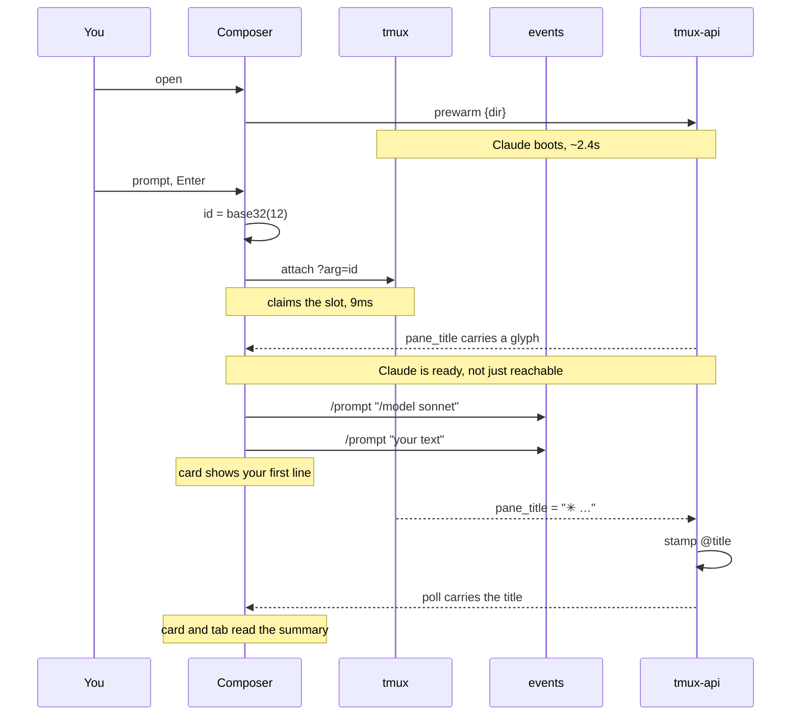
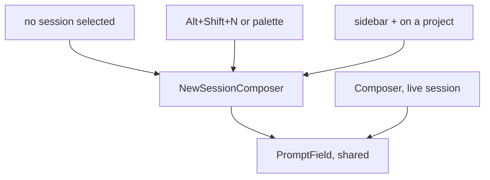
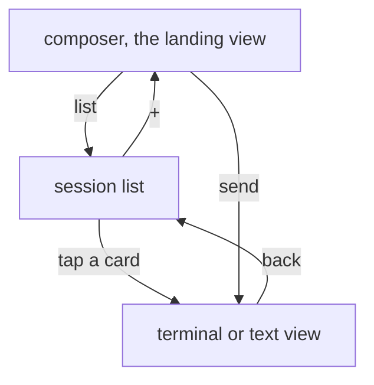
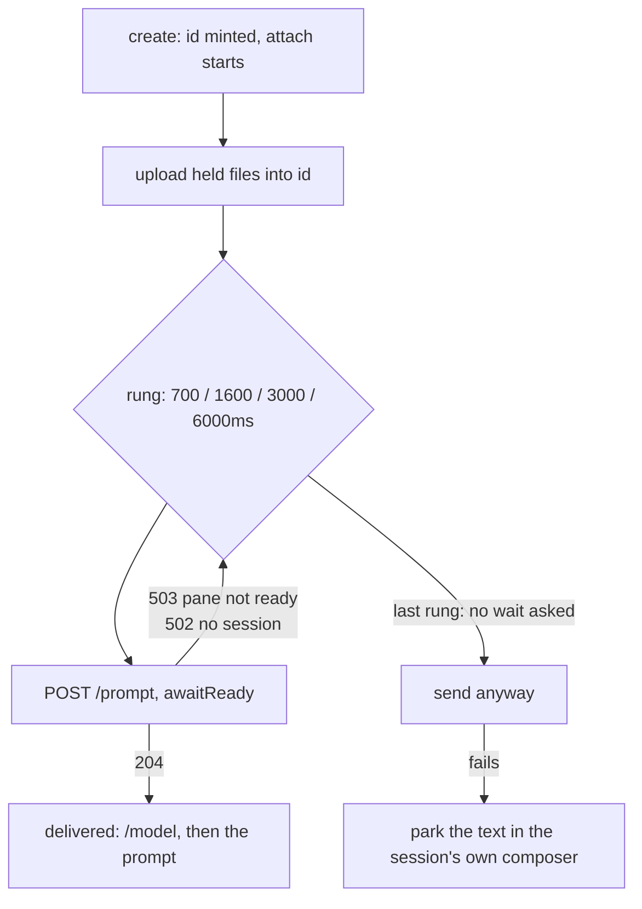

# Prompt-first sessions

Viktor, 2026-09-04: *"let's make the new session experience smoother. naming
conversations should be optional not mandatory like now"*, then *"also rename
the session after the first prompt to match the work"*, then *"I'm looking for
an experience similar to t3 where I can just start typing my prompt and the
session is created after"*.

Today the sidebar's create row refuses an empty box. `store.create` toasts
*"Give the session a name"* and stops (`frontend-v2/src/store/lobby.ts:637`), so
a name has to be chosen before the session exists, which is before there is any
work to name it after.

This replaces it with a composer. You type what you want to do, press Enter, and
the session is created and given your text as its first prompt. The name stops
being something a person chooses at all: it becomes an opaque id, and the title
comes from Claude Code's own summary of the conversation a few seconds later.

```stats
12 | characters in a session id
7 | name validators it satisfies unchanged
78% | of creates go to a named project
~2.4s | Claude boot, mostly paid by pre-warm
6 | stores that stop having to follow a rename
```

## The summariser already ran

Claude Code writes a summary of the conversation into its terminal title, and
`tmux-api` has been carrying it in every `/sessions` row since Task 2.5
(`tmux-api/main.go:65`, the `pane_title` field). Measured live on 2026-09-04:

```
$ tmux list-sessions -F '#{session_name}|#{@title}|#{@claude_state}|#{pane_title}'
new-session |New session|running|✳ Session naming optional
nokia-api   |Nokia api  |running|✳ Nokia API consumption investigation
ca-asia     |Ca-asia    |done   |✳ Tashkent trip planning
paladin     |Paladin    |done   |✳ Paladin account download exploration
hyperoptic  |hyperoptic |done   |✳ Email from hyperiptic
ny-reibursment|         |done   |✳ New York trip expenses
authentik   |           |done   |✳ authentik
ux          |           |running|✳ ux
__…pool_slot|           |done   |✳ Claude Code
```

Two rows settle where the title should come from. `hyperoptic` carries a user's
typo (`hyperiptic`), so the text is derived from the conversation rather than
from the cwd or the session name. `ny-reibursment` is a misspelled session name
whose summary reads `New York trip expenses`, which no echo of the name could
produce.

The mechanism is Claude Code's own: the binary carries a `terminalTitleFromRename`
setting, described as *"Whether /rename updates the terminal tab title"* and
defaulting on, which ties the pane title to Claude's session name and its
generated summary.

So a summariser is already running, in the same pane, with no call of our own.
We read its output rather than starting a second one.

## What we decided

| decision | choice | why |
|---|---|---|
| where the title comes from | `pane_title`, with `✳ ` stripped | already plumbed, no API key, works offline, no new failure mode |
| the create box | a prompt composer, not a name box | naming leaves the critical path entirely |
| where it lives | centre stage on the empty state; the landing view on a phone | matches T3; a fresh phone opens ready to type |
| the session name | an opaque 12-character base32 id, minted in the browser | the name stops being a thing anyone reads, so it can stop moving |
| existing sessions | migrated to ids in the same change | one identity model, not two |
| the composer's controls | project selector, command, model | project selector inline, as in T3 |
| how the model is applied | `/model <name>` injected before the prompt | no change to the `?arg=` contract, and the pre-warm pool still applies |
| prompt delivery | retry ladder, 700/1600/3000/6000ms, gated on a readiness signal | the pattern `stampTitleWhenAlive` already uses; the gate is what the ladder alone could not do — see Sequencing |
| attachments | held in the browser, uploaded into the new session's bucket on send | nothing is uploaded until a session exists to own it |
| title drift | frozen at the first summary | you can find a session by remembering what it was called |
| who writes the title | `tmux-api`, server-side | one writer, and it works with every tab closed |

## The flow



Nothing renames. The id chosen in the browser is the name for the life of the
session, so the six stores keyed by it never have to follow anything.

## Stable ids

A tmux session's name is its identity, and six places record that name
independently: the per-user layout, the project store's `(owner, name)` refs, the
share store's grants, the image directory under `/var/lib/clipboard-store`, the
killed-assignment memory, and the titles store. `rename_cascade.go` exists to
carry a rename through all six. That machinery is only needed because the name is
both the identity and the thing people read.

Making the name an id separates those. The id is minted by the browser at
creation, which keeps a property the design deliberately protects: creating a
session reaches no server, so it still works while `tmux-api` is down
(`frontend-v2/src/lib/slug.ts:9`).

**Shape.** 12 characters of base32, no prefix — 60 bits, which is ample against
a few thousand sessions per user, and `tmux rename-session` refuses a duplicate
name, so a collision is a free retry rather than a corruption. Seven independent
copies of `^[a-zA-Z0-9_-]{1,32}$` validate session names across the Go services,
the frontend and `tmux-attach.sh`; a 12-character id satisfies all of them with
no validator change.

**Migration.** Every live session is renamed to an id in the same change, through
the existing cascade. Its old name is stamped as its `@title`, so nothing a
person reads is lost: `authentik` keeps reading `authentik`, now as a title.

>[!CAUTION]
> **`tmux ls` stops being readable.** This is the main cost of the decision,
> and it is the property the 2026-08-16 title design was protecting. A `tls`
> alias goes into `infra/playbooks/devvm.yml` for every user; plain `tmux ls`
> still works and still shows ids.

```sh
alias tls="tmux ls -F '#{session_name}  #{@title}'"
```

```
$ tls
k7m2q9x4tp  Session naming optional
p3vn8w2ljd  Tashkent trip planning
8wq4mzr7nk  Paladin account download exploration
```

## The composer



`Composer.tsx` carries a lot that only means something for a live session: the
permission panel, the context meter, Stop, queued-prompt chips. It also carries
the field behaviour both composers want: multi-line with Enter/Shift+Enter,
slash-command autocomplete, drafts, and the mobile input attributes that restore
QuickType and swipe typing. The field comes out into a shared `PromptField` and
both composers mount it.

**Controls.** A project selector, the existing command dropdown
(`NEW_SESSION_COMMANDS`), and a model picker. The project selector defaults to
the last project you created in, roamed beside `session.newCommand`; measured
over 7 days, 78% of creates go to a named project (code 32, t3-code 16,
ungrouped 15, tripit 4), so the default has an obvious answer most of the time.
Clicking `+` on a project group overrides it for that create without overwriting
the pref.

**The model.** `start-claude.sh` deliberately passes no `--model`, inheriting the
org default from `managed-settings.json`, and `tmux-user-attach:241` pools only
the bare `claude` key — a `claude-haiku` command key would bypass the pre-warm
pool and give up its head start. So the model is applied by injecting
`/model <name>` down the existing `POST /prompt` path before the prompt itself.
Verified against Claude Code 2.1.260 on 2026-09-04: it sets the model, and does
not open the picker. See Sequencing for the readings and for the account default
it writes alongside.

**Choosing `shell`** turns the box back into a name box. A shell has no prompt to
receive, and it is the case where someone most likely wanted to name the thing.

**On a phone** the lobby shows one view at a time, and the composer becomes the
landing view rather than the session list, so a phone opens ready to type. The
list is one control away, using the flip that already carries you between the
list and a terminal.



**Attachments** are held as `File` objects in the browser and uploaded once the
session exists, into `/var/lib/clipboard-store/<user>/<id>/`, before the prompt
goes out with their paths spliced in. Nothing is uploaded until there is a
session to own it, so abandoning the composer leaves nothing behind. They are
memory-only: the typed text still persists through the existing draft store, the
files do not, so a reloaded or evicted tab shows an empty tray.

## The auto-title

`tmux-api` already polls the session list on a 5-second cache and already owns
the title store. It gains one rule, applied on each poll:

```
for each session where
    @claude_state is set          (a Claude session, not a shell)
    @title is unset               (nobody has titled it)
    pane_title != "✳ Claude Code" (a summary exists)
    created within the last ~2 min
  -> stamp @title = pane_title minus its glyph prefix
     emit session.autonamed
```

The prefix is stripped as a set, not as the literal `✳ `. Claude Code carries six
glyphs for that position — `·` `✢` `✳` `✶` `✻` and a sixth that depends on
`TERM` — and rotates them on a 960ms interval while a turn animates. Sampled
live at 4Hz for 10 seconds across two running sessions, every one of 80 reads
was `✳`, so the animated frames do not reach `pane_title` on this box. Matching
the set anyway costs one character class and removes the case where a title
arrives wearing a `✶`.

Stamping `@title` is what stops the rule firing again, so the title freezes at
the first summary and later drift is ignored. No separate marker is needed.
Clearing a title by hand unsets `@title` and lets the rule run once more, which
makes "clear" mean "go back to auto", which is the meaning that fits now that a
bare name is unreadable.

The ~2 minute window is what stops the rule watching forever. A Claude that
crashed at launch, a plain shell, or a pane title still reading `✳ Claude Code`
leaves the session untitled, which is what every pre-title session already is,
and it stays renameable by hand.

**Between create and the first summary** the card shows the first line of your
prompt. You typed it seconds earlier, so it is likely the most recognisable
thing available, and Claude's summary replaces it when it lands. A session started with
an empty box and no prompt reads `New session` until a summary appears.

**Telemetry.** One new event, `session.autonamed`, carrying `tl.session`,
`tl.delay_ms` and `tl.outcome` (`titled` | `gave_up`). The existing
`session.retitled` with a user client tag, arriving within about ten minutes of
an autoname, is the signal that a summary was rejected.

## What this deletes

Making the name immutable retires the machinery that existed to move it:

| goes away | why |
|---|---|
| `slug/slug.go`, `slug.ts`, `vectors.json`, the transliteration table | no name is ever derived from a title again |
| `nameForTitle`, `fallbackName`, `session-N` | the id is the name |
| the collision toast and the derived-name hint under the box | there is no box and no collision |
| `followRenamedSelection` | nothing renames, so nothing to follow |
| `rename_cascade.go` at its lobby call sites | kept for the migration and for restore's collision path |
| `PATCH /sessions/{name}`'s rename half | retitle becomes `POST /sessions/{name}/title` for everyone |

The phantom-session hazard goes with them. A browser tab holding a stale name
could previously reconnect through `tmux new-session -A` and create that name as
a fresh empty session; with no renames there is no stale name to hold.

## What this does not do

>[!WARNING]
> **iOS is unverified.** There is no instrument for iOS or Safari on this box.
> The phone layout will be exercised on the shared Android emulator, which has
> real touch and a real soft keyboard; the iPad and iPhone behaviour of the
> composer, particularly the soft-keyboard reserve, will not have been driven
> before this ships.

>[!NOTE]
> **T3 thread titles lag by seconds.** `t3-sync/adopt.go:71` titles a mirrored
> thread from `@title`, falling back to the tmux name. A session adopted in the
> few seconds before its summary lands would take an id as its thread title.
> Either adoption waits for a title, or the syncer pushes a thread retitle when
> `@title` first appears; the second is closer to what memory records as
> decision 7's "title regeneration renames via tmux-api".

>[!NOTE]
> **`/model <name>` sets the model.** Checked on Claude Code 2.1.260 for
> `sonnet`, `haiku` and `opus` through the same injection path the browser
> reaches, so the picker ships as designed. It also saves the choice as the
> account's default for new sessions; `managed-settings.json` pins Opus 5 here
> and that applies on restart, so the next session is unaffected. A future
> release could change either behaviour, and the status line is where to look.

>[!WARNING]
> **`CLAUDE_CODE_DISABLE_TERMINAL_TITLE` turns the whole feature off.** Claude
> Code gates the title write on that environment variable; when it is set,
> nothing is written and `pane_title` keeps whatever the shell left there. A
> session started with it set gets no summary, so it stays untitled and shows
> the first line of its prompt. Nothing on this box sets it today. If it ever
> becomes an org default in `managed-settings.json`, the auto-title stops
> working for everyone with no other symptom, so it is worth a line in the
> runbook.

**The pane title's update cadence is not fully characterised.** ADR-0001 calls
the `✳` title "a static summary", and this design only reads it once, so the
cadence does not affect correctness. It would matter if the freeze decision were
ever revisited.

## Sequencing

One branch, landing together. Phase order inside it:

1. Ids: mint in the browser, migrate the live sessions, move the URL hash, ship
   the `tls` alias.
2. Delete the retired machinery, so the rest is written against one model.
3. `PromptField` extraction, then `NewSessionComposer` with its three controls.
4. Prompt delivery, model injection, attachment upload-on-send.
5. The `tmux-api` auto-title rule and `session.autonamed`.

Built in that order, with the auto-title rule (5) brought forward ahead of the
composer (3) so the composer could be written against a title that already
arrives on its own. What follows records where the built thing differs from the
plan above.

### `/model` sets the model, and saves a default with it

Verified against Claude Code 2.1.260 on 2026-09-04, injected through the exact
`sessionio.Injector.Prompt` sequence the browser reaches (`send-keys C-e C-u`,
`set-buffer`, `paste-buffer -p`, `Enter`):

| sent | status line | picker |
|---|---|---|
| `/model sonnet` | `opus-5` → `sonnet-5` | none |
| `/model haiku` | `sonnet-5` → `haiku-4` | none |
| `/model opus` | `haiku-4` → `opus-5` | none |

So the picker ships. Two things came with it. The command answers *"Set model to
Sonnet 5 and saved as your default for new sessions"*, so it writes the
account's own default as well as this session's model; on this box
`managed-settings.json` pins Opus 5 and that applies on restart, so what the
NEXT session starts on is unchanged. And `pane_title` stays `✳ Claude Code`
across all three, so the model line does not disturb the auto-title rule.

### Reachable is not ready, and nothing says so

The plan expected a 404 to mean "not yet". What is there instead is quieter. A
session tmux has created accepts `send-keys` immediately, while the Claude in
its pane takes another ~2s to draw its input, and text injected into that gap is
dropped: `POST /prompt` returns 204, tmux exits 0, and nothing reaches the
conversation.

Measured by injecting `/model sonnet` at fixed offsets from creation, reading
the model back off the status line:

| injected at | landed |
|---|---|
| creation + 0s | no |
| creation + 1s | no |
| creation + 2s | yes |
| creation + 3s | yes |

This is not specific to the model line — the first prompt would go the same way,
and the plan's ladder would have spent its first rung at 700ms, taken the 204,
and stopped. So delivery waits for the pane to be ready as well as walking the
ladder.

**The wait is the bridge's, reused.** `sessionio.AwaitInputReady` already solves
exactly this: it watches the pane draw Claude's own `❯` and then hold still for
300ms, and `t3-bridge` has called it after a resurrection since 2026-08-16, for
the same silent half-landing failure. `POST /prompt` gains an `awaitReady` flag
that runs it and answers 503 rather than injecting, so the check stays where the
evidence is. Nothing about a pane's input line reaches the browser, so anything
written on that side could only have been a proxy for it.

Sampled through a boot on a quiet box, which is why:

| moment | pane | `@claude_state` |
|---|---|---|
| 0.0s | the shell's title still, nothing drawn | unset |
| 1.15s | nothing drawn | `done` |
| 1.46s | title now `✳ Claude Code` | `done` |
| 1.60s | `❯` drawn, still repainting | `done` |
| 1.89s | settled; input accepted | `done` |

`@claude_state` is set 750ms before Claude can read anything, and the title 400ms
before, so neither is the signal on its own. The drawn-and-settled prompt is.

A missing session answers **502**, not 404: `POST /prompt` runs no registry
lookup, so the failure happens inside `tmux send-keys`. 503, 502 and 404 all mean
"come back".



The `awaitReady` flag is off for every other caller. A session someone is looking
at is ready by definition, and the check costs a `capture-pane` per tick. It is
also asked for only when the command is Claude: the check watches for `❯`, so
asking where nothing draws one would spend every rung waiting and give up with
the text unsent.

### Two smaller departures

**A failed delivery parks the text rather than restoring the field.** The plan
said to put the text back in the box. By then there is no box: `store.create`
selects the session, and selecting unmounts the composer. So the message is
written into the NEW session's draft, which is the field the person is now
looking at, with a toast saying where it went.

**The pre-warm slot is not what makes the first attempt succeed.** It removes
the boot wait, so a claimed slot is ready the moment the first rung asks. A cold
create — Ungrouped, or a pool miss — is ready inside the first rung's own wait,
which is what the server-side hold buys over a browser-side check: measured end
to end against a real Claude, the prompt landed on rung one.

Verification before this is called done: drive the real lobby at
`terminal.viktorbarzin.me`, create a session from the composer, and read back a
screenshot showing the card carrying Claude's summary. The phone layout goes
through the shared Android emulator, not a resized desktop browser.
