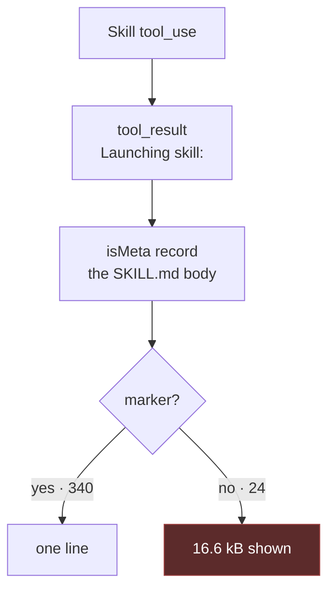

# Skills you can reach, and see

Viktor, 2026-09-04: *"let's work on text mode. let's get the / to trigger skill
search so we can auto suggest skills to paste. I want to have special
visualisation for skills to show the user that the skill is applied"*, then, on
the phone: *"it appears but only when not starting the prompt. if it's in the
middle of a prompt text then it doesn't show"*, and then: *"not all question
tools work in text mode… it's a multi select prompt that can't be handled in
text mode"*.

Three parts. Getting to a skill from the composer, seeing one in the transcript
once it has loaded, and answering a multi-question call without leaving for the
Terminal.

```stats
130 | entries the slash menu offers once the catalogue arrives
95 | of them built into the page
34 | skills of Viktor's own, from GET /commands/{session}
220px | the menu's height, about four rows
22.4% | of 1,045 question calls the text view hands to the Terminal
340 | skill loads across 409 transcripts
24 | of those the renderer does not recognise
16,584 | median characters each of the 24 renders in full
```

## Where the two halves stand today

The `/` menu already exists and already offers skills. `completionFor`
(`frontend-v2/src/components/compose.logic.ts:213`) is wired the whole way down
— `SessionView` → `TextView` → `Composer` → `PromptField` — and `commandRank`
matches a command's name, its name after a namespace, a substring of either, and
a substring of its description. The per-user half comes from `GET
/commands/{session}`, which walks `~/.claude/skills/*/SKILL.md`,
`~/.claude/commands/**/*.md`, the project's `.claude/commands`, and the enabled
plugins (`session-events/commands.go`).

A skill load leaves two rows. The `Skill` tool call classifies as
`dynamic_tool_call` and renders with the generic tool treatment, labelled with
the skill's name (`canonicalize.ts:341`). The SKILL.md body that follows becomes
a centred hairline rule reading `skill · grilling`, the same weight the view
gives `queued`, `context compacted` and `hook failed` (`rows.tsx:440`).

### Three things measured on 2026-09-04

**The menu will not open mid-prompt.** `completionFor` returns null unless the
slash sits at index 0, with the reason in the code: `cd /usr` should not open a
command menu. Reproduced in a real browser at both 1280x900 and 390x844 —
typing `let's design this /dom` offers nothing. This is the phone report, and it
is not a phone defect: the guard behaves the same everywhere.

**A description match is worth as much as a name match.** With the catalogue
loaded, `/grill` returns five entries: `/grill-me`, `/grill-with-docs`,
`/grilling`, then `/improve-codebase-architecture` and `/publish-page`, the last
two because "grill" appears in their descriptions. Bare `/` returns all 130 in a
220px window with no grouping, so a skill is one row among 130, and the
built-ins outnumber the skills 95 to 34.

**24 skill loads render as messages nobody wrote.** `skillLoad`
(`sessionio/skill.go:29`) detects a load by the string `Base directory for this
skill:`. Across 409 transcripts, 340 records carry it and collapse to one line.
24 do not, and render in full: median 16,584 characters, 248,757 in total.
`workflow-authoring` is 14 of them.

The universal signal is the `Skill` tool's own result, `Launching skill: <name>`.
It is present for all 364, bundled skills included, and the tool call beside it
carries the args.



The card this design adds hangs off `B`, not off `D`: the receipt names every
load, so the marker's 340/24 split stops deciding what the reader sees.

## The dev proxy had diverged from the ingress

The vite dev proxy routes three of the ten prefixes the production ingress
routes to `session-events`. `/commands`, `/pane`, `/earlier`, `/result`,
`/keys`, `/search` and `/answer-text` were absent, so each reached ttyd's
`location /`, which serves everything the rules above do not match, and came
back as the SPA's own `index.html` — 200 OK, `text/html`, 9,406 bytes.
`res.json()` throws on that, every caller's `catch` returns its empty fallback,
and the feature is absent with no error surfaced. Measured: the `/` menu showed
the 95 built-ins and none of the 34 skills, with nothing logged.

Production routes all ten (`infra/stacks/terminal/main.tf:446`), and the
IngressRoute's own comment anticipates this exact degradation: *"The page ships
the CLI's built-ins, so a missing route costs the per-user half of the menu
rather than the menu."* The fallback is the right behaviour. What it does not
currently offer is any way to tell a menu missing its per-user half from a
complete one, which is the same state a phone reaches on a dropped request.

`docker/nginx.conf.template` is missing `/search/` and `/answer-text/`. That
template serves the Docker-image deployment rather than the cluster, so it is a
separate drift, noted rather than fixed here.

| prefix | session-events | Traefik (prod) | nginx template | vite dev |
|---|---|---|---|---|
| `/events` | yes | yes | yes | yes |
| `/prompt` | yes | yes | yes | yes |
| `/cancel` | yes | yes | yes | yes |
| `/earlier` | yes | yes | yes | added |
| `/result` | yes | yes | yes | added |
| `/pane` | yes | yes | yes | added |
| `/keys` | yes | yes | yes | added |
| `/commands` | yes | yes | yes | added |
| `/search` | yes | yes | missing | added |
| `/answer-text` | yes | yes | missing | added |

## The composer half

**Skills rank above built-ins, and every row says which it is.** A source badge
on each row — `skill`, `command`, `project`, `plugin`, `builtin` — and within a
match tier the per-user entries sort first. The catalogue is what a person
chose to install; the built-ins are what ships.

**Subsequence matching joins the tiers, description matching sinks below them.**
`/dmod` finds `/domain-modeling`. `/grill` puts the three grill skills first and
keeps `/publish-page` reachable at the bottom, separated, rather than mixed into
the same list.

**Mid-prompt, the menu offers skills and custom commands only.** `/help` inside
a sentence means nothing, so the 95 built-ins stay out of it, and the shorter
list is also what should keep false positives down: `cd /usr` matches no skill
name, so nothing opens. At index 0 the current rules are untouched, built-ins
included.

Mid-prompt completion inserts a *mention*, not an invocation. Claude Code runs a
slash command only when it is the whole prompt, so `let's design this
/domain-modeling` reaches the model as text naming a skill. This is the reading of
"skills to paste" the design assumes: the name is a strong hint the model acts
on. The alternative — inserting prose like "using the domain-modeling skill" —
was considered and set aside.

**A failed catalogue says so.** One muted footer row at the bottom of the menu
when the fetch failed, so a menu missing its per-user half is distinguishable
from a menu that is complete. This needs `store.commands` to separate "the fetch
failed" from "this user has no skills", which today both return `[]`.

```
/  ──────────────────────────────────
 /add-dir        Add a new working directory
 /advisor        Let Claude consult a stronger…
 ┈┈┈┈┈┈┈┈┈┈┈┈┈┈┈┈┈┈┈┈┈┈┈┈┈┈┈┈┈┈┈┈┈┈
 ⚠ your own skills could not be loaded
```

## The transcript half

One card where the skill loads, and nothing outside the transcript.

```
┌─ ⌘ skill ───────────────────────────┐
│ grilling                            │
│ 16.6 kB collapsed · 15:38           │
└─────────────────────────────────────┘
```

The card folds both records of a load. The tool call gives the name and the
args; the injected body gives the size. One thing happened, so the transcript
says so once.

Name only, no description. The transcript never carries one, and the two places
that could supply it each miss cases: the merged catalogue has no entry for a
bundled skill, and `session-events` reading it off disk cannot see one either,
because a bundled skill is not under `~/.claude/skills`. `workflow-authoring` is
in neither, and is the most-loaded skill in the corpus.

Not expandable. A body collapsed to a card and then reopened one tap later is
the same 16.6 kB back in the transcript; the Skills overlay renders SKILL.md
properly and is where reading one belongs.

### Considered and set aside

A chip strip above the composer, listing the skills in force for the session,
with `sessionio.SessionState` carrying the set. `SessionState` is the right home
for that — its doc comment reads *"what the reader needs that is NOT in the
window they hold"*, it already folds the permission mode, the `/context`
reading, the queue and the prompt history over the whole log, and the browser
replays only the last 20 turns (`session-events/sse.go:65`), so a
browser-derived strip would not show a skill loaded 21 turns ago.

It is set aside because marking the load in the transcript is what was asked
for, and the strip raises questions the transcript does not: when a skill stops
applying, what a chip does when tapped, and how many fit a 390px row. Nothing
here forecloses it.

## Answering a multi-question call

The screenshot Viktor sent shows a 4-question call with the answer card reading
*"Only the question on screen has reached here — answer them in the Terminal."*

`multiSelect` itself works. `keysForQuestion` (`answer.logic.ts:129`) toggles
with Down/Space and leaves with Enter, and `Partial` is set only when a call
carries more than one question (`dialog.go:295`), so a single-question
multi-select is answered from the card today. The shape that hands over is the
multi-question one.

| shape | share of 1,045 calls | answerable in text mode |
|---|---|---|
| one question, single-select | 73.0% | yes |
| one question, multiSelect | 4.6% | yes |
| more than one question | 22.4% | only once the record lands |

Of all calls, 2 questions is 10.0%, 3 is 4.4% and 4 is 8.0%.

The hand-over fires on `!recorded() && fromPane().partial`
(`TextView.tsx:223`), so it is the window before the transcript record arrives.
That window is not always short: measured 2026-08-28 over five consecutive calls
in one session, two records landed 3 to 8 seconds after the dialog appeared and
two were written only when the question was answered, 112 seconds later in one
case. Waiting for the record is therefore not a fix.

What the pane does carry is a progress signal. The tab bar draws `☐` for an
unanswered question and `☒` for an answered one, and `tabHeaders`
(`dialog.go:356`) already splits on both. `reviewScreen` (`dialog.go:322`)
already recognises the final Submit step. So the card can walk the call from the
pane one question at a time: answer what is on screen, re-read the pane, parse
the question now drawn, repeat until the review screen, then Submit. The answer
machinery already re-reads the pane between steps to confirm each one landed
(`TextView.tsx:300`), so the missing piece is parsing that fresh pane into the
next question rather than only checking it for expected text.

```
┌───────────────────────────────────────┐
│ Claude needs answers          1 of 4  │
│                                       │
│ Both problems are live, but only the  │
│ crowdsec OOM is critical. What order? │
│                                       │
│  1  Crowdsec first, then the GPU      │
│  2  GPU first                         │
│  3  Both at once                      │
│                                       │
│  ☒ Order  ☐ Done means  ☐ Levers  ☐…  │
│                          [Next]       │
└───────────────────────────────────────┘
```

The step counter comes from the glyphs rather than from a count the card keeps,
so it cannot drift from what the terminal is actually showing. Every later
question's options are genuinely undrawn until the walk reaches them, and the
card says so by showing one at a time rather than listing four with three of
them empty.

## Glossary changes

`CONTEXT.md:252` defines a **Skill** as a directory under `~/.claude/skills/`
"loaded by that user's Claude sessions at start". Two corrections, both
measured:

- The body is injected when the skill is **invoked**, mid-session, not at start.
  That injection is the 16.6 kB this design collapses.
- Bundled skills live nowhere under `~/.claude/skills`, invoke through the same
  `Skill` tool and inject the same way. The card names them, so the term covers
  them.

The **item type** entry enumerates seven values and says the view never branches
on a tool's name. A `skill` type joins the list.

## Ordered plan

1. **The dev proxy mirrors the ingress.** Ten prefixes in
   `frontend-v2/vite.config.ts`, with the measurement in a comment. Everything
   below is verified through it, so it goes first. *(done on the branch)*
2. **`store.commands` distinguishes a failure from an empty catalogue**, and the
   menu grows the footer row. Test-first: a failing fetch, a 200 that is not
   JSON, and a user with no skills are three different outcomes.
3. **Ranking.** `commandRank` gains a subsequence tier; a source rank sorts
   per-user entries above built-ins within a tier; description-only matches sort
   last. `SlashCommand.source` reaches the row as a badge.
4. **Mid-prompt.** `completionFor` accepts a slash after whitespace and, when it
   is not at index 0, ranks only the discovered catalogue by name.
5. **The signal.** `sessionio` detects a load from the `Launching skill:`
   receipt, records the collapsed body's size, and folds the tool call and the
   injection into one event. `skillLoad`'s marker path stays as the fallback for
   a body with no receipt before it.
6. **The card.** A `skill` item type, its own row component, its own styling.
7. **CONTEXT.md**, as above.
8. **The multi-question walk.** `ParseDialog` reports which questions the tab
   bar marks answered; the answer card walks a partial call off successive pane
   reads and shows `n of N` from those glyphs.

## What this does not settle

The mid-prompt false-positive rate is a judgement, not a measurement. A
two-character minimum before the menu opens mid-prompt is in the plan as a
guess; `cd /im` matching `/implement` is the shape of case that would argue for
three, and the corpus has no data on how often a person types a path into the
composer.

How often the multi-question hand-over actually fires is not measured. 22.4% of
calls can reach it, and the transcript-lateness that decides the rest cannot be
recovered from the corpus, because a record's timestamp is its event time rather
than the moment it was flushed. The 2026-08-28 figures above come from watching
five calls directly.

Whether an iPhone PWA has a defect of its own beyond the index-0 guard is
untested, and cannot be tested here — there is no iOS instrument on this box.
The report matches the guard exactly and the guard reproduces on desktop, so the
fix is expected to cover it. If it does not, that is a new finding and needs the
phone in hand.
