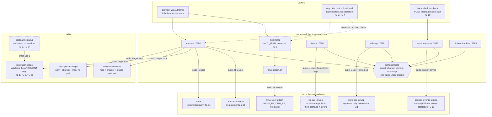

# Terminal Lobby privileged surface audit

Read-only audit at HEAD `5ee20a4`, 2026-09-05. Nothing was written, no
privileged wrapper was executed with crafted arguments, and no other user's
session or private data was touched.

## Scope and the answer

In scope: the 15 shell and script wrappers in `devvm/` that root installs to
`/usr/local/bin`, the four Go privop re-exec children (`skills-api/privop.go`,
`file-api/paths.go`, `session-events/privreader.go`, `sessionio/tmux.go`), the
11 systemd units and 1 timer in `devvm/`, the install manifest
(`release/manifest.go`, `release/users.go`), and the sudo grant those describe.
The live grant on this box is two effective lines, one `(emo)` target and one
`(root)` target, both held by `wizard`.

Four threat models, and every finding says which apply:

| | who |
|---|---|
| A | a non-admin lobby user (emo) driving the web UI as themselves |
| B | a non-admin user with a local shell on the devvm |
| C | a web client reaching the services with no Authentik in front |
| D | the service account itself, if it were not an administrator |

Out of scope: an attacker who is already root, physical access, and Authentik's
own security.

**The answer.** The surface is sound. The trust model is written down in more
detail than the code it guards usually gets, most of the safety claims in
`devvm/sudoers.d-ttyd-users.template` are exactly true, and the two hardest
pieces of code here (`file-api/paths.go`'s four-layer containment and
`session-events/privop.go`'s `transcriptWithin`) do what their comments say.
The one thing to change first is `devvm/tmux-user-setfacl`: it is the only root
grant that walks attacker-shaped filesystem content, and two gaps in it turn a
project share into a root-written ACL on a path the caller picks.

## What holds

Every row below was tested against the code, not read off the comment. This is
the larger half of the result and the reason the rest of the document is worth
reading.

| claim | asserted at | enforced at | verdict |
|---|---|---|---|
| `tmux-user-dirlist` is argument-free and prints directory names only | `devvm/tmux-user-dirlist:10-15` | no positional parameter is referenced anywhere; every `fd` flag is hardcoded at `:46-55`, the pattern is the empty string, no `--follow` so a symlinked directory is neither listed nor traversed | Holds |
| its home comes from the running uid, not `$HOME` | `devvm/tmux-user-dirlist:18-20` | `devvm/tmux-user-dirlist:21` `getent passwd "$(id -un)"` | Holds |
| whitelisting `fd` itself would be arbitrary exec via `--exec` | `devvm/tmux-user-dirlist:10-13` | correct, `fd --exec` exists | Holds |
| `tmux-restore-user` re-checks its user against `/etc/ttyd-user-map` | template:27-28, template:118 | `devvm/tmux-restore-user:40` charset, `:45-48` map parse with `grep -qxF`, `:50` snapshot id `^[0-9]{8}T[0-9]{6}$`, `:51` session name, `:53-78` closed subcommand set, everything passed as separate argv | Holds. Only the arity wording is wrong, TL-32 |
| `tmux-persist-forget` validates both args and takes no path from input | template:29-36 | `devvm/tmux-persist-forget:53` exact arity, `:56` name charset byte-identical to `tmux-api/main.go:139`, `:61-65` map check, `:67` argv exec, no path anywhere | Holds |
| `skills-api`'s child takes one op name in argv and nothing else | template:60 | `skills-api/privop.go:128` builds `sudo -n -u <user> <exe> -privop <op>`, request on stdin, dispatch on a closed const set at `:43-56` | Holds |
| it resolves its own home from its uid | template:60-61 | `skills-api/privop.go:173` `user.LookupId(os.Getuid())`; `restart.go:171` and `source.go:508` reset `HOME` for the same reason | Holds. The parenthetical reason is wrong, TL-34 |
| it re-validates every skill name it is given | template:60-62 | `skillscan/skillscan.go:99` `ValidName`, called from `privop.go:201`, `:211`, `write.go:23`, `delete.go:40`, `source.go:405`; blob paths gated by `validRel`/`validLink` at `fsops.go:351-378` | Holds for names. `owner`/`repo` is the gap, TL-30 |
| exec'ing the user's own `claude` CLI grants nothing they lack in a terminal | template, skills-api entry | `skills-api/restart.go:155-179` validates against `pluginIDRe`, resolves the binary from the user's own `~/.local/bin`, `exec.CommandContext` with argv, no shell | Holds |
| a crafted plugin id cannot inject a `hooks` key into a user's `settings.json` | implied by `state.go:104` | both writers marshal the key properly at `state.go:247` and `:271`, and `writeTopLevel` refuses anything `json.Valid` rejects | Holds |
| `session-events` runs a long-lived child that takes no arguments | template:73-78 | `session-events/privreader.go:58`, one child per user at `registry.go:82-99`, every round trip under `p.mu` at `privreader.go:101-137` | Holds |
| it re-validates transcript paths against its own projects root | template:81-84 | `session-events/privop.go:171-191` `transcriptWithin` runs first at `:115`, `:125`, `:140`: absolute plus `.jsonl`, `EvalSymlinks` on both path and root, then `filepath.Rel` rather than a string prefix | Holds for `readfrom`, `fullresult`, `search`. `catalogue` is the exception, TL-18 |
| it refuses act-as outright rather than resolving the caller | `session-events/authuser.go:53-58` | returns 501 | Holds, a deliberate divergence that fails safe |
| `file-api`'s four layers run with the target user's view of the filesystem | template:48 | `file-api/paths.go:54-103`: shape, lexical `Clean` containment, `EvalSymlinks` with distinct read and write semantics, resolved-vs-resolved-home with a separator-terminated prefix so `/home/alice-evil` cannot match `/home/alice`. Both cases are in `paths_test.go` | Holds |
| writes land with the user's ownership rather than the service's | template:48 | `file-api/privop.go:131`, the child is the user | Holds |
| the path error is not an existence oracle outside the home | `file-api/files.go:291` | out-of-home targets return 400 whether or not they exist, and the path is not echoed | Holds |
| the act-as decision is made in the services against `/etc/ttyd-admins` | template:107-113 | all five services resolve through one `authuser.Gate` (`tmux-api/main.go:270`, `file-api/auth.go:46`, `skills-api/auth.go:72`, `session-events/authuser.go:28`, `clipboard-upload/main.go:368`), one parser at `authuser/authuser.go:134-148` | Holds, and better than claimed |
| `tmux-attach.sh` sources the read-only flag from the server, not a client argument | template:111 | `devvm/tmux-attach.sh:139` parses the server's mode, `:166-167` fails safe to `-r`, the tmux argv at `:178`/`:180` is fixed | Holds |
| watch mode can only downgrade | `tmux-api/shares.go:320-325` | `effectiveMode` returns `ro` only when the client asked for `ro`, otherwise the server ceiling | Holds |
| a foreign attach cannot create a session in someone else's account | `devvm/tmux-attach.sh:155-163` | the create branch was removed after the 2026-08-17 incident and no branch acts on a create answer | Holds |
| the act-as charset is checked before the admin check and before `isMapped` | `authuser/authuser.go:170-174` | `userRe` at `:61` forbids a leading dash and caps at 32 chars; `effective()` at `:175` enforces the order | Holds |
| identity files fail closed | `authuser/authuser.go:139-142`, `resolve.go:256-259` | an unreadable `/etc/ttyd-admins` yields an empty admin set; an unreadable map refuses everyone in multi-user mode | Holds |
| single-user mode cannot act as anyone | `authuser/resolve.go:130-139` | `Admin=false` unconditionally, any `?as=` naming another account refused | Holds |
| `root` is in sudoers but not the map, so `?as=root` fails | template:140 | `root` is no right-hand side in `/etc/ttyd-user-map`; `authuser/authuser.go:181-183` returns `ErrUnknownTarget` | Holds |
| the proxy secret is checked before identity resolution, in constant time | `authuser/resolve.go:11-17` | `resolve.go:111-118`, `:186` `subtle.ConstantTimeCompare` | Holds. It does not cover ttyd or `/internal/attach`, TL-5 and TL-17 |
| the package does not ship the sudo grant | `release/manifest.go:255-261` | no `File` entry targets `/etc/sudoers.d/ttyd-users`; the live file is roster-generated and reads as such | Holds |
| installed modes match the manifest | `release/manifest.go`, `release/users.go:106` | all 21 package executables live as 0755 root:root, none group-writable; `/etc/sudoers.d/ttyd-users` is `-r--r----- root root` | Holds |
| the grant list is kept in step with the roster | `release/users.go:129` | `users.go:132-142` and `:144-148` match the live file, template:114 and :140, and `roster_engine.py:309-314` and `:319-323`, exactly | Holds |
| no unmanaged drift in the files the manifest owns | `release/manifest.go` | all 12 `devvm/` wrappers, 10 system units, both user units, `/etc/tmux.conf` and `/etc/terminal-lobby.conf` are byte-identical to the repo, `Unmanaged:true` entries included | Holds |
| `tl-session-watch` needs root, and says why | `devvm/tl-session-watch.service:47-63` | two concrete reasons, a measurement for why `PrivateTmp` is off, nine hardening directives plus `MemoryMax`; live `ProtectHome=read-only`, `ReadWritePaths=/var/lib/node_exporter/textfile /run /tmp` | Holds, the well-built one |
| `tl-t3-sync@` runs as the instance user with no capabilities | `devvm/tl-t3-sync@.service` | `User=%i`, empty `CapabilityBoundingSet` and `AmbientCapabilities`, `NoNewPrivileges`, `RestrictSUIDSGID`, `ProtectSystem=full`, non-optional `EnvironmentFile` so a user with no config cannot start it | Holds |
| every privileged wrapper sets a strict shell mode | each wrapper | `tmux-attach.sh:10`, `tmux-user-attach:20`, `tmux-user-dirlist:16`, `tmux-restore-user:32`, `tmux-persist-forget:46`, `tmux-user-setfacl:21`, `setup-user-persistence.sh:11`, `devvm-apply:18`, `tl-reconcile:18`. The three bare `set -u` uses (`claude-tmux-state:29`, `claude-se-hook:34`, `clipboard-store-clean:25`) are deliberate and documented, since the hooks must exit 0 | Holds |
| the owner cannot write into a peer's home | template:54, second half | `/home/emo`, `/home/ancamilea`, `/home/breakglass` are all 0750 with per-user primary groups and no other member | Holds in effect. The mode and the read half do not, TL-28 |
| the setfacl inode cap aborts rather than half-applying | `devvm/tmux-user-setfacl:49-53` | the count at `:52-53` runs before any `setfacl` at `:71` | Holds |
| the canonical-path check rejects a symlinked project dir, `..` and trailing slashes | `devvm/tmux-user-setfacl:32-34` | `realpath -e` plus the equality at `:35-36` | Holds for the argument. Not for the tree below it, TL-1 |
| revoke deliberately leaves ancestor traverse ACLs | `devvm/tmux-user-setfacl:88-90` | the code matches | Holds |
| `sudo -H` is passed at all three attach and dirlist call sites | | `devvm/tmux-attach.sh:193`, `tmux-api/dirs.go:44`, `tmux-api/newcommands.go:64` | Holds, and it is why TL-20's impact today is none |
| `tl-reconcile` and `devvm-apply` ignore `SSH_ORIGINAL_COMMAND` | `devvm/tl-reconcile:6-9` region | neither reads its own argv; both log through `logger -t TAG -- "$*"` | Holds. The `authorized_keys` claim beside it does not, TL-14 |
| `ancamilea`'s revocation holds end to end | template:7-8 | she is in neither `/etc/ttyd-user-map` nor the grant, and `tmux-restore-user:45-48` re-validates before `tmux-persist` is reached | Holds |
| the session image store's world-readability is a recorded decision | `docs/adr/0005-session-image-store.md:73-77` | the code matches the ADR, argued from the org's shared-workstation read policy | Holds as an accepted decision. TL-16 is the unstated half |
| `/var/lib/tmux-persist` is locked | | root-owned, snapshot dirs 0700, tsv files 0600 | Holds |
| `/home/wizard/code` is closed to peers | | `drwxrws---` group `code-shared`, whose only member is `wizard`; emo and ancamilea are in `codex-shared` | Holds |
| the sudo environment the privop children rely on is configured as they assume | | `/etc/sudoers:9` `Defaults env_reset`, `secure_path` set, every `env_keep` commented out, no `Defaults` in `/etc/sudoers.d/ttyd-users`. `LD_PRELOAD`, `NODE_OPTIONS`, `PYTHONPATH` and `PATH` are stopped by that alone | Holds. Undocumented dependency, see TL-20 and TL-22 |
| the sudoers file's statement that every grant is already implied for `wizard` | template:86-90 | `wizard` holds `(ALL) NOPASSWD: ALL` | Holds, and it is why most `impact today` below reads none |

Forty-three claims tested, forty-three held as stated or with the narrow exception
named in the row. Seventeen comments assert a property the code does not have;
those are section 6.

One claim was not tested here. The act-as paragraph at template:107-113 is a
statement about `devvm/tmux-attach.sh` and tmux-api's auth layer; the identity
review covered it and it held, but the sudoers reviewer read `/etc/ttyd-admins`
(one entry, `wizard`) and stopped.

## What we found

Thirty-five findings. `impact today` is what an attacker gets on this box as
configured right now; for most of them it is nothing, because the service
account already holds `(ALL) NOPASSWD: ALL` and the sudoers file says so
itself. `impact as designed` is what the weakness costs under the model the
code intends, a non-admin service account and mutually isolated users. A row
whose today column reads none is still worth fixing, and a row whose today
column reads real is the short list.

| id | finding | sev | model | impact today | impact as designed |
|---|---|---|---|---|---|
| TL-1 | `setfacl` dereferences the symlink arguments `find` feeds it | critical | A, D | Real. emo plants a symlink in their own project dir, shares it, and root writes `u:emo:rwX` on the target anywhere on the box | Same, and it is the one root grant that touches attacker-shaped content |
| TL-2 | The ACL dir may be under any home, and tmux-api never binds it to the caller | critical | A | Real. `dir=/home/wizard/.ssh` plus `coOwned=true` gets emo rwX on another user's keys and `~/.claude` | Mutual user isolation gone in one HTTP call |
| TL-3 | The identity header is client-settable on the five open ports | critical | B, C | Real. No `TL_PROXY_SECRET` is set, all five ports bind `*`, `iptables -S INPUT` is `-P INPUT ACCEPT` | Any LAN host or local shell impersonates any mapped identity |
| TL-4 | The package's own migration wrote `TL_BIND=0.0.0.0` and left the secret unset | critical | C | Real, and the installer created the condition its shipped default warns about | Same. A rebuild reproduces it |
| TL-5 | ttyd takes neither `TL_BIND` nor `TL_PROXY_SECRET` | high | C | An interactive shell as any mapped user from the LAN, surviving the fix the README recommends | An operator who follows the README still ships an open terminal on 7681 |
| TL-6 | `clipboard-cleanup.service` has no `User=`, so a daily `rm -rf` sweep runs as unconfined root | high | D | None. Only `wizard` can write the store, and `wizard` is root-equivalent | A scheduled root deletion of any directory's contents, armed by one symlink and a 30-day wait |
| TL-7 | `/tmp/clipboard-files` is created 0755 in world-writable `/tmp` with no boot-order guard | high | B | Real if a local user wins the boot race with an `@reboot` job or a lingering user unit | Same. It is a write capability, not only a read one |
| TL-8 | `file-api`'s privileged child takes its containment root from argv | medium | D | None | Arbitrary read and write of every mapped user's files, the widest gap in the audited surface |
| TL-9 | `file-api` is check-then-open, and co-ownership gives the race a user boundary | medium | A, C | Conditional on a live co-owned dir, the owner operating in it, and a won race | Cross-user read or truncating write, exactly the isolation the service exists to keep |
| TL-10 | The tmux-api internal token travels on a `curl` command line | medium | B | Real. `/proc` has no `hidepid`, so any local user reads it during a foreign or watch attach | The 0600 file mode buys nothing; the token is the only gate on `/internal/attach` |
| TL-11 | Co-ownership revoke is best-effort, and a member can make it permanently impossible | medium | A | Real. Grow the tree past 200000 inodes and revoke aborts while the UI returns 204 | A departed member keeps rwX and inherited default ACLs forever |
| TL-12 | `selfUser == ""` fails open to inline cross-user operations | medium | D | None unless `user.Current()` fails, and then a leak rather than an escalation | The sudo boundary disappears silently; three services disagree about the same decision |
| TL-13 | `claude-tmux-state` splices a raw session name into a TLEVENT JSON line | medium | A | Audit integrity. A non-admin plants event rows attributed to another user | Same, and the telemetry stream is the only cross-user record |
| TL-14 | `/etc/sudoers.d/tl-reconcile` is a root grant no artifact installs or validates | medium | D | None | The non-admin service account goal is unreachable while the file exists; a manifest-only rebuild breaks deploys |
| TL-15 | `t3-mint`'s root grant rests on `/etc/ttyd-user-map`, and nothing here records it | medium | C, D | None | A widened or malformed map lets a network-facing service account mint root-issued pairing tokens |
| TL-16 | The clipboard store's modes are systemd's default umask rather than a stated choice | low | B | Matches ADR-0005's accepted decision and the org read policy | The OS layer is deliberately looser than the API layer, and nothing says so where the modes are chosen |
| TL-17 | `/internal/attach` decides admin from a name in the request body | low | C, D | A mode string, a repin, and a `ClientTty` overwrite. No attach, since the tmux grant is `wizard`'s alone | Authorization collapses to one secret with no identity proof and no secret check |
| TL-18 | `session-events`' `catalogue` op takes an unvalidated cwd | low | D | None. The only caller always passes `""` | A directed read oracle inside a 0750 home, returning one line of content per file |
| TL-19 | The session-start hook takes the OS user from the request body | low | B | Any local shell re-points one of a user's session views at another of their transcripts, or fabricates registrations and unbounded map entries | Same, plus the service's identity vocabulary is no longer the user map |
| TL-20 | `tmux-user-attach` takes the target user's home from `$HOME` | low | D | None. `env_reset` and `sudo -H` at every call site | One `env_keep` line, or a caller that drops `-H`, and a session starts in the caller's home running their command file, as another user |
| TL-21 | `tmux-user-setfacl` validates grantees against `/etc/passwd`, not the user map | low | D | None through HTTP. `addMember` gates on `isMappedOSUser` | Root writes `u:<any system account>:rwX` plus default ACLs over a user's tree |
| TL-22 | `sudo` and `tmux` are resolved through `PATH` in two privileged paths | low | D | None. No unit sets `PATH`, and systemd's default is root-owned throughout | The privileged call's binary is chosen by inherited `PATH` |
| TL-23 | `tmux-attach.sh` logs the raw `?arg=` value 22 lines before validating it | low | C | Journal content controlled from a query string, with no session and no shell needed | Same |
| TL-24 | `clipboard-store-clean` creates `.deleted-at` through symlinks as root | low | D | None. The store is `wizard`-owned and not world-writable | Root creates a dotfile inside any directory the service account names |
| TL-25 | `tmux-persist` is a root dependency no reconciled installer declares | low | D | None. The pieces happen to be current on this box | A rebuild from the playbook comes up with the grant, the state tree, and no binary or units |
| TL-26 | `skills-api/restart.go` cites a launcher that is not installed, and drops `--session-id` | low | B | Within one user. A restarted session can resume onto the wrong conversation after a reboot | Shipping the file the comment names would point every session at the admin's home |
| TL-27 | "Set `TL_BIND=127.0.0.1`" is not a boundary on a multi-user box | low | B | Documentation. The setting is not in use here | The recommended alternative to the secret gives a local user the same forging path |
| TL-28 | "Peer homes are 0700" is not the live mode | low | B | Real for the read direction. `/home/wizard` is 0711 and `~/.claude` is 0775 | A maintainer deciding whether the skills-api re-exec still earns its complexity reads a mode that is neither verified nor enforced |
| TL-29 | The `authuser` package doc says nothing client-supplied decides anything | low | C | None directly. It is a comment | A reviewer asking whether identity can be forged gets a wrong answer |
| TL-30 | `skills-api`'s child does not re-validate `owner`/`repo` | info | D | None | Two values that never passed the charset gate reach an api.github.com path unescaped |
| TL-31 | The `/usr/bin/tmux` grant is annotated as a poll | info | D | None | The annotation understates a grant that is by construction a shell as the target user |
| TL-32 | `tmux-restore-user`'s arity is understated twice | info | D | None | An auditor stops looking after the username and misses four more validated arguments |
| TL-33 | The template's two byte-identical placeholder lines | info | D | None | Indistinguishable from a copy-paste slip at a glance |
| TL-34 | The `env_reset` parenthetical gives a wrong reason for correct code | info | D | None | It is the sentence a reader uses to decide another wrapper needs no such care |
| TL-35 | `ancamilea`'s snapshots and home outlive her grant | info | D | None. The enforcement path refuses her before touching them | A departed user's session titles and transcript ids persist, and re-adding the name makes them restorable |

## Trust boundaries

Every hop that crosses a uid change, and where the validation sits.



Reading it: the three `(root)` wrappers are the only hops that raise privilege
rather than drop it, and of those, only `tmux-user-setfacl` takes a path.
`tmux-restore-user` and `tmux-persist-forget` re-check their user against
`/etc/ttyd-user-map` and take no path at all, which is why they hold.

## Findings in detail

### TL-1 setfacl dereferences the symlink arguments find feeds it

Critical. Threat models A and D. Two reviewers found this independently, so it
is one defect with two write-ups; one fix closes both.

```
devvm/tmux-user-setfacl:83-86
    find "$real" -xdev \( "${prune[@]}" \) -prune -o -print0 \
        | xargs -0 -r setfacl -m "$acc_spec" --
    find "$real" -xdev \( "${prune[@]}" \) -prune -o -type d -print0 \
        | xargs -0 -r setfacl -d -m "$def_spec" --
```

Entry point: `PATCH /projects/<id>` on tmux-api with `coOwned=true`, or
`POST /projects/<id>/members`. `tmux-api/coownership.go:53` then runs
`sudo -n /usr/local/bin/tmux-user-setfacl grant <dir> <members>` as root.

Trigger: any symlink anywhere inside the shared tree, for example
`ln -s /usr/local/bin ~/proj/x`, then toggle co-ownership on `~/proj`.

The chain. The canonical-path check at `:35-36` covers argv[2] and nothing
below it. The first `find` has no `-type` filter and no `! -type l`, so every
symlink inside the tree is printed and becomes a `setfacl` argument. `setfacl`
is invoked without `-R`, and its man page says `-P` "also skips symbolic link
arguments. Only effective in combination with -R", so the default without `-R`
is to follow a symlink argument. Root therefore applies `u:emo:rwX` to the
symlink target. Measured on this box against acl 2.3.2, in a scratch directory
with no privileged wrapper involved: `setfacl -m u:nobody:rw -- link` put
`user:nobody:rw-` on the target, not on the link, and
`find tree -print0 | xargs -0 setfacl -m u:emo:rwX --` over a tree whose only
entries were symlinks left the ACL on files and directories outside the tree.
`-xdev` bounds `find`'s descent, not the dereference, so the target may be on
any filesystem. The `-type d` pass at `:85-86` and `:93-94` does not match a
symlink under `find -P`, so only the access-ACL pass escapes; that is enough.

impact today: real, and the wizard-is-admin caveat does not apply because the
attacker here is emo. `u:emo:rwX` on a directory resolves to `rwx`, so the good
targets are directories of root-executed code (`/usr/local/bin`, a root cron
script directory, `/root/.ssh`) rather than `/etc/sudoers.d`, which sudo's own
ownership check protects. Writing `/usr/local/bin/tmux-user-setfacl` or
`tmux-restore-user` is code execution as root the next time either runs.

impact as designed: identical, and it is the worst outcome in the intended
model. The one root grant that touches attacker-shaped filesystem content
becomes an ACL writer for any path.

The fix, at line level. Filter symlinks out in `find` on all four pipelines:

```
find "$real" -xdev \( "${prune[@]}" \) -prune -o \( -type f -o -type d \) -print0
```

Adding `-P` to the four `setfacl` calls at `:84`, `:86`, `:92` and `:94` also
works, measured on acl 2.3.2. The `find` filter is the one to land, because it
survives an acl version whose `-P` semantics differ; do both if you want belt
and braces. Then correct the header comment at `devvm/tmux-user-setfacl:13-18`
and template:126-127, which currently assert the opposite.

### TL-2 The ACL directory may sit under any home, and tmux-api never binds it to the caller

Critical. Threat model A. Also found twice; one fix closes both.

```
devvm/tmux-user-setfacl:39-40
[[ "$real" =~ ^/home/[^/]+/.+ ]] || { echo "dir must be under a user home, not a home root" >&2; exit 2; }
home="/home/$(printf '%s' "$real" | cut -d/ -f3)"

tmux-api/projects.go:706
        (validates the PATCH dir with filepath.IsAbs and maxDirLen, nothing else)
```

Entry point: `POST /projects {"name":"x","dir":"/home/wizard/.ssh"}` as
`emil.barzin`, then `PATCH /projects/<id> {"coOwned":true}`. Registered at
`tmux-api/main.go:381-382` with no admin gate; `handleProjects`
(`projects.go:340`) calls `resolveOSUser` only.

The chain. `createProject` (`projects.go:379-397`) accepts any absolute path as
`Dir`, and the store's own `validate` (`projects.go:219-225`) repeats the same
two checks. There is no containment helper in the package at all; the only
`EvalSymlinks` in tmux-api is `prewarm.go:84`, unrelated. The creator is
auto-enrolled as sole member (`projects.go:399`), so `patchProject`'s
membership gate passes. The flip emits `{grant, "/home/wizard/.ssh", ["emo"]}`
(`coownership.go:24-27`), and `runCoownAsync` execs the wrapper with no `-u`,
so sudo's default target root matches the `ALL=(root)` grant. Every wrapper
guard then passes: absolute, canonical, a real directory, matches
`^/home/[^/]+/.+` (strictly below a home, just not the caller's), emo is a real
user, the tree is small. The ancestor loop at `:75-80` breaks immediately
because `dirname` equals `home`, and `/home/wizard` is already 0711 so emo can
traverse to the newly ACL'd target. The regex is self-fulfilling: `home` on
line 40 is derived from the caller's own string rather than from `getpwnam`.

impact today: real. `/home/wizard` is 0711 and `.ssh` is 0700, so the OS denies
this today and the ACL creates it. Read gets SSH private keys, `~/.claude`
credentials and `~/.git-credentials`; write into `~/.ssh/authorized_keys` or a
`~/.claude` hook is code execution as `wizard`, who holds `(ALL) NOPASSWD: ALL`.

impact as designed: identical, and it is precisely the isolation the per-user
design exists to provide.

The fix, at line level. Constrain the directory to the caller at both layers.
In tmux-api, reject at `projects.go:390` and `:706` any `Dir` that is not under
the caller's own home after `filepath.EvalSymlinks`, and re-check on every
PATCH that can change `Dir` or `CoOwned`. In `devvm/tmux-user-setfacl`, take
the requesting OS user as an explicit fourth argument, re-check it against
`/etc/ttyd-user-map` with the same `sed`/`cut`/`grep -qxF` idiom
`tmux-restore-user:45-48` uses, resolve that user's home from `getent passwd`,
and replace the regex at `:39` with a prefix test against it. Then
template:123-127 says what it enforces.

### TL-3 The identity header is client-settable on the five open ports

Critical. Threat models B and C.

```
authuser/resolve.go:180-184
        want := g.Config.ProxySecret
        if want == "" { return nil }   // check disabled

authuser/resolve.go:115
        raw := strings.TrimSpace(r.Header.Get(g.Config.header()))
```

Entry point: any HTTP request to 7683 (clipboard-upload), 7684 (tmux-api), 7685
(session-events), 7686 (file-api), 7688 (skills-api) or 7681 (ttyd), carrying
the header named by `TL_AUTH_HEADER`.

Trigger: `curl -H 'X-Authentik-Username: vbarzin' http://<devvm>:7684/whoami`.

Live state, read from this box rather than inferred.
`/etc/terminal-lobby.local.conf` sets `TL_BIND=0.0.0.0` and
`TL_AUTH_HEADER=X-Authentik-Username` and sets no `TL_PROXY_SECRET`; the
running tmux-api's `/proc/<pid>/environ` carries exactly those three variables.
`ss -ltnp` shows 7683, 7684, 7685, 7686 and 7688 on `*` and 7681 on `0.0.0.0`,
with only 7689 on loopback. `iptables -S INPUT` is `-P INPUT ACCEPT` with no
rules, and ufw is inactive. `Resolve` never touches `r.RemoteAddr`;
`resolve.go:110-175` was read in full looking for a peer check and there is
none. `/etc/ttyd-user-map` maps `vbarzin=wizard`, and `wizard` is the sole
entry in `/etc/ttyd-admins`.

So a caller who reaches any of those ports names their own identity, becomes
`wizard`, and is an admin. `POST /shares` then creates a share of a `wizard`
session to guest `emo` with mode `rw` (the owner comes from `resolveOSUser` at
`shares.go:141`, which is the forged header, not from a body field), or
`DELETE /sessions/<name>` kills sessions, or `POST /projects` drives TL-2.

impact today: full compromise of the `wizard` account from any host that can
route to the devvm, and from any local shell including emo's.

impact as designed: the same shape, bounded by what the service account can do.
Any LAN host or local user impersonates any mapped identity and gets that
user's sessions, files, skills and clipboard store.

The fix, at line level. Set `TL_PROXY_SECRET` in
`/etc/terminal-lobby.local.conf` and have the proxy send `X-TL-Proxy-Secret`,
since `TL_BIND=0.0.0.0` is deliberate for the cluster ingress. Independently,
change all five compiled defaults to loopback so a unit whose optional
`EnvironmentFile` is absent fails closed: `tmux-api/main.go:24`,
`file-api/main.go:24`, `skills-api/main.go:28`, `clipboard-upload/main.go:43`,
and `session-events/main.go:23` (which is `":7685"`, not `"127.0.0.1:7685"`).

### TL-4 The package migration wrote TL_BIND=0.0.0.0 and left the secret unset

Critical. Threat model C. TL-3 is the code path; this is how the box got there.

```
release/manifest.go:73-78, what the package SHIPS
# ... Widen it to
# 0.0.0.0 when the proxy is somewhere else -- an ingress in a cluster, say -- and
# set TL_PROXY_SECRET in the same change, because a service reachable from the
# network trusts TL_AUTH_HEADER from anything that reaches it.
TL_BIND=127.0.0.1

release/manifest.go:343-345, what the package WRITES on an existing box
# what it was. If your proxy can send a shared secret, set TL_PROXY_SECRET here
# and have it send X-TL-Proxy-Secret -- that is what closes the network path.
TL_BIND=0.0.0.0
```

`MigrateConfigSnippet` (`manifest.go:326-350`) runs once in postinst and fires
on any box that has `/etc/ttyd-user-map` and no local conf yet, which is every
multi-user install. `/etc/terminal-lobby.local.conf` here is byte-for-byte that
heredoc. The snippet names the mitigation in its own prose and does not apply
it; `TL_PROXY_SECRET` exists on this box only as the commented line at
`/etc/terminal-lobby.conf:22`. The units read the local conf after the shipped
one, so it wins.

impact today: real, and it is the same exposure as TL-3 with the installer as
the cause rather than an operator.

impact as designed: same, and worse under mutual user isolation, since the
header alone selects which OS user the request acts as.

The fix, at line level. In `MigrateConfigSnippet` (`manifest.go:326-350`),
either generate a random `TL_PROXY_SECRET` into the local conf in the same
write as `TL_BIND=0.0.0.0`, or keep 127.0.0.1 and make widening an explicit
operator action. A release `Check` asserting that a non-loopback request
without the secret is refused would catch the regression the way the existing
401 probes catch the others.

### TL-5 ttyd takes neither TL_BIND nor TL_PROXY_SECRET

High. Threat model C.

```
devvm/ttyd.service:33
ExecStart=/usr/local/bin/ttyd -W -a -H ${TL_AUTH_HEADER} -P 30 -t enableClipboard=true -I /usr/local/share/ttyd/index.html -p 7681 /usr/local/bin/tmux-attach.sh

README.md:60-64
> With `TL_PROXY_SECRET` unset, anything that can reach the service ports can
> send `TL_AUTH_HEADER` and be treated as that user. Either set the secret and
> have your proxy send it, or set `TL_BIND=127.0.0.1` so only the local proxy
> can reach them.
```

`-H <name>` tells ttyd to trust that header as the authenticated user and
export it as `TTYD_USER`, which `devvm/tmux-attach.sh:15` reads verbatim before
mapping it and exec'ing `tmux-user-attach` at `:190-193`. The `ExecStart` has
no `-i/--interface` and no credential flag, so ttyd binds every interface
regardless of `TL_BIND` (confirmed live, pid on `0.0.0.0:7681`), and ttyd has
no `TL_PROXY_SECRET` support at all. Both remedies the README offers therefore
leave 7681 answering to a self-asserted header. There is no systemd-level
narrowing in the unit either, no `IPAddressDeny` and no socket unit.

impact today: an interactive shell as any mapped user from any host on the LAN,
surviving the fix the README recommends for TL-3.

impact as designed: an operator who follows the README and sets the secret
still ships an unauthenticated terminal on the one port that gives a shell.

The fix, at line level. Add `-i ${TL_BIND}` to `devvm/ttyd.service:33`, then
verify it: start ttyd with `-i 127.0.0.1` on a spare port and confirm the
socket binds loopback rather than everything, because a silently ignored flag
here fails open. The fallbacks that need no verification are `-i lo`, a unix
socket with the proxy in front, or narrowing at the host firewall. Amend
`README.md:60-64` to say plainly that `TL_PROXY_SECRET` covers the HTTP
services only and that 7681 must be reachable from the proxy alone; that half
is right either way and is the more valuable one.

### TL-6 clipboard-cleanup.service runs as unconfined root

High. Threat model D.

```
devvm/clipboard-cleanup.service, the whole file
[Unit]
Description=Retention sweep for the session image store and old dropped files

[Service]
Type=oneshot
ExecStart=/usr/local/bin/clipboard-store-clean
```

Every other unit this package ships that runs a package binary sets
`User=wizard` explicitly (`ttyd.service:35`, `tmux-api.service:18`,
`clipboard-upload.service:18`, `session-events.service:20`,
`file-api.service:21`, `skills-api.service:32`). This one sets nothing.
Verified live: `User=`, `Group=`, `NoNewPrivileges=no`, `ProtectSystem=no`,
`ProtectHome=no`, `PrivateTmp=no`, and the full 40-capability bounding set.

The sweep escapes its tree. `devvm/clipboard-store-clean:96` globs
`for sessdir in "$userdir"*/`, so every `sessdir` carries a trailing slash;
`:97` `[ -d "$sessdir" ]` follows symlinks and passes for a symlink to a
directory; `:111` then runs `rm -rf "$sessdir"`. Measured in a scratch
directory on this box's coreutils 9.4: `rm -rf /path/symlink/` exits 0, leaves
the symlink, and empties the target. The 30-day gate does not save it, because
root arms its own gate: the marker at `:100` is `"$sessdir.deleted-at"`, which
resolves through the symlink, so `:109` `date +%s > "$marker"` has root create
`.deleted-at` inside the victim directory on run one, and `:110`'s
`find "$marker" -mtime +30` fires 30 days later. No race is needed.

Two neighbouring paths are genuinely closed and should not be re-raised: `find`
defaults to `-P` so neither `:116` nor `:122` descends a symlink, and
`/tmp/clipboard-files` is `wizard`-owned 0755 under a sticky `/tmp`.

impact today: none. Only `wizard` can write the store, and `wizard` is
root-equivalent.

impact as designed: a daily root-context deletion of any directory's contents,
armed by one symlink and a wait, plus a root process talking to loopback with
an identity header it chose (`:63`).

The fix, at line level. Add `User=wizard` (matching every sibling) plus the
sandbox block `tl-session-watch.service:47-63` already demonstrates:
`NoNewPrivileges=yes`, `ProtectSystem=strict`, `ProtectHome=yes`,
`ReadWritePaths=/var/lib/clipboard-store /tmp/clipboard-files /tmp/clipboard-images`,
`PrivateDevices=yes`, `CapabilityBoundingSet=`, `RestrictSUIDSGID=yes`. Every
path the script touches is `wizard`-owned, so nothing in the sweep needs root.
In the script, skip a symlinked `sessdir` (`[ -L "${sessdir%/}" ] && continue`)
and write the marker with a no-follow open. TL-24 patches the same unit and
should land in the same change.

### TL-7 /tmp/clipboard-files can be squatted before the service starts

High. Threat model B.

```
clipboard-upload/main.go:32
var fileDir = "/tmp/clipboard-files"

clipboard-upload/main.go:82
os.MkdirAll(fileDir, 0755)
```

`/tmp` is tmpfs on this box (`findmnt -no FSTYPE /tmp`), so it is empty at
every boot, and `devvm/clipboard-upload.service:3` orders the unit only
`After=network.target`, with no `RuntimeDirectory=` and no ordering against
user sessions. `MkdirAll` returns nil for an existing directory of any owner
and any mode, and nothing afterwards stats the owner.

Trigger: a non-admin local user with an `@reboot` cron entry or a lingering
systemd user unit that runs `mkdir -m 0777 /tmp/clipboard-files` before the
service starts.

impact today: real if the race is won. They read every file any lobby user
transfers, and can replace the contents, which `handleStoredFile` then serves
back to another user's browser from `/file/`.

impact as designed: same. Unlike TL-16 this is a write capability, not only a
read one.

The fix, at line level. `RuntimeDirectory=clipboard-files` with
`RuntimeDirectoryMode=0700` in `devvm/clipboard-upload.service`, and point
`fileDir` at `/run/clipboard-files`. systemd creates and chowns the directory
before the service starts, so there is no window.

### TL-8 file-api's privileged child takes its containment root from argv

Medium. Threat model D. The widest gap in the audited surface under the
intended model.

```
file-api/main.go:31
home := flag.String("home", "", "internal (-privop): user home containment root")

file-api/privop.go:244-252
func runPrivopMain(op, home, path string, all bool) {
        case "list":  res = opList(home, path, all)
        case "read":  res = opReadEnvelope(home, path)
        case "write": content, _ := io.ReadAll(...); res = opWrite(home, path, content)
```

Entry point: the sudo grant itself. `wizard ALL=(emo) NOPASSWD:
/usr/local/bin/file-api` (template:114) carries no argument spec, so any argv
is permitted, and `-home` is the containment root.

Trigger: `sudo -n -u emo /usr/local/bin/file-api -privop read -home /home -path /home/emo/.ssh/id_ed25519`.
Note the root has to be `/home`, not `/`: `within()` at `paths.go:108-112`
compares against `root+"/"`, which for `/` is `//`, and no cleaned path starts
with that, so `-home /` is rejected by layer 2.

The chain. `runPrivopMain` passes the argv `-home` straight into
`resolveWithin` as the containment root, so all four layers measure the
requested path against a root the caller chose. `within("/home", "/home/emo/.ssh/id_ed25519")`
passes, `EvalSymlinks("/home")` succeeds, layer 4 compares against `/home` and
passes. The child is running as emo, so the read returns the file base64'd on
stdout; write is the same walk with `mustExist=false`, then `privop.go:139`
`Lstat` and `privop.go:142` `os.WriteFile`, truncating for example
`/home/emo/.bashrc` with stdin content. Nothing in the child checks that `home`
matches the uid it is running as. The contrast is in the same repo:
`session-events/privop.go:66-75` derives its root from
`user.LookupId(os.Getuid())`, and the sudoers file describes that one
accurately.

impact today: none. `wizard` already holds `(ALL) NOPASSWD: ALL`, so the same
read and write are available without the grant.

impact as designed: a non-admin service account holding only the six listed
grants gets arbitrary read and write of every mapped user's files, not the
confined-to-their-own-home behaviour the grant documents. Writing a peer's
`~/.bashrc` is persistent code execution as them.

The fix, at line level. In `runPrivopMain` (`file-api/privop.go:244`), ignore
the `-home` flag and derive the root from the running uid, copying
`session-events/privop.go:66-75`. Refuse to run if the lookup fails. Keep
`-home` only as a test seam on the inline path, or delete the flag and stop the
parent sending it. Then template:48 is true.

### TL-9 file-api is check-then-open, and co-ownership gives the race a user boundary

Medium. Threat models A and C.

```
file-api/paths.go:78, :99, :102
resolved, err = filepath.EvalSymlinks(clean)
if !within(realHome, resolved) { return "", errOutsideHome }
return resolved, nil        // a STRING; nothing holds the path

file-api/files.go:266-270
if info, err := os.Lstat(resolved); err == nil && !info.Mode().IsRegular() {
if err := os.WriteFile(resolved, []byte(body.Content), 0o644); err != nil {
```

Entry point: `GET /files/read?path=<abs>` and `POST /files/write {path,content}`
on 7686, for a request whose mapped OS user equals the service user, so
`crossUser()` at `file-api/privop.go:37` is false and the op runs inline. The
attacker's own entry is `rename(2)` inside a co-owned directory.

The chain. `resolveWithin` resolves, checks, and returns a plain string;
nothing pins the inode. `handleRead` then `Stat`s and `Open`s that string, and
`handleWrite` `Lstat`s it and hands it to `os.WriteFile`, which opens
`O_WRONLY|O_CREATE|O_TRUNC` and follows symlinks. Each is an independent second
path walk. The swap capability comes from co-ownership itself:
`devvm/tmux-user-setfacl:59-60` sets `u:$u:rwX` as both access and default ACL,
and `rwX` on a directory is `rwx`, so a co-owner may `rename(2)` inside a
directory that sits inside the owner's home. `fs.protected_symlinks` does not
help, since it only covers sticky world-writable directories.

The layer-4 doc comment calls itself "the backstop a symlink escape that
slipped past layer 2 dies on", which is true at the instant of the check and
not at the instant of the open.

impact today: conditional on three things at once, a live co-owned project
directory, the owner performing a read or write inside it, and the peer winning
the rename window at that instant. When all three land, a read leaks a file the
service user can read and a write truncates one it can write; the service user
is root-equivalent here, so a won write is escalation. The peer cannot initiate
the operation themselves, and under Authentik the leaked bytes go to the
owner's own browser, so the read half only pays off under threat model C.

impact as designed: identical, user to user.

The fix, at line level. Open first, validate second. For read, replace the
`Stat`-then-`Open` pair at `files.go:152-169` with
`os.OpenFile(clean, os.O_RDONLY|syscall.O_NOFOLLOW, 0)`, then fstat the fd and
compare `os.Readlink("/proc/self/fd/N")` against `realHome`. For write, replace
`files.go:266-270` and the same pair at `privop.go:139-142` with an `openat`
against a parent opened `O_DIRECTORY`, using
`O_WRONLY|O_CREAT|O_NOFOLLOW`. The cheapest partial fix is one flag on each
open, which removes the leaf-swap variant and leaves only the harder
directory-component race.

### TL-10 The tmux-api internal token travels on a curl command line

Medium. Threat model B.

```
devvm/tmux-attach.sh:129-132
    resp="$(curl -s -m 5 -w $'\n%{http_code}' \
        -H "X-Internal-Token: ${token}" -H 'Content-Type: application/json' \
        --data "{\"owner\":\"${target_owner}\",...}" \
        http://127.0.0.1:7684/internal/attach 2>/dev/null || true)"
```

`/proc` is mounted without `hidepid` (`/proc rw,nosuid,nodev,noexec,relatime`
in `/proc/self/mountinfo`), so any local OS user polling `ps` or
`/proc/<pid>/cmdline` reads the token out of a foreign or watch attach.
`/var/lib/tmux-api/internal.token` being 0600 `wizard` inside a 0700 directory
buys nothing against that.

impact today: real for the read. What it converts to is small, and TL-17 has
the accounting: the verdict is a JSON string, and turning it into an attach
needs `sudo -n -u <owner> /usr/bin/tmux` at `tmux-attach.sh:180`, a grant
`wizard` alone holds. A token-holding emo gets a mode string, a repin on
someone else's session (`shares.go:465-468`) and a `ClientTty` overwrite on an
existing share row.

impact as designed: the token is the only thing between the network and
`/internal/attach`, and it is readable by anything running as the service
account.

The fix, at line level. Pass it on stdin (`curl -H @-`) or from a config file
at `devvm/tmux-attach.sh:129-130`, never argv.

Same file, hygiene rather than a finding: `:131` builds the request body by
string-interpolating `${target_owner}`, `${name}`, `${guest}` and `${my_tty}`
into a JSON literal with no escaping. All four are regex-validated upstream
(`NAME_RE` at `:69` and `:114`, `MODE_RE` at `:117`, `/dev/*` at `:126`), so
nothing reaches it today. A `printf`-built body or a real encoder would keep it
that way.

### TL-11 Co-ownership revoke is best-effort, and a member can make it permanently impossible

Medium. Threat model A.

```
devvm/tmux-user-setfacl:52-53
count="$(find "$real" -xdev \( "${prune[@]}" \) -prune -o -print 2>/dev/null | head -n $((CAP + 1)) | wc -l)"
[[ "$count" -le "$CAP" ]] || { echo "tree too large ($count > $CAP inodes) — refusing" >&2; exit 3; }

devvm/tmux-user-setfacl:91-94
        | xargs -0 -r setfacl -x "$acc_spec" -- 2>/dev/null || true
```

The inode cap runs before the action branch, so `exit 3` aborts a revoke as
well as a grant, and the revoke passes swallow every error. The caller never
notices: `runCoownAsync` is fire-and-forget in a goroutine and only logs
(`tmux-api/coownership.go:52-58`), while `removeMember` returns 204 regardless
(`tmux-api/projects.go:608-614`).

impact today: real. A co-owner who grows a shared tree past 200000 inodes keeps
`rwX` plus inherited default ACLs on every file in it forever, and the lobby
shows them removed. That defeats the script's own stated reason for running as
root at `:9-11`, "could not fully REVOKE a departed member's access ... Root
makes both grant and revoke complete", and nothing reconciles ACLs afterwards.

impact as designed: the same.

A related wrinkle that is not a security issue but will confuse whoever debugs
this: `head -n $((CAP+1))` SIGPIPEs `find`, and under `set -euo pipefail` the
assignment on `:52` aborts with status 141 before the friendly message on `:53`
ever prints. It still fails closed.

The fix, at line level. Move the cap check inside the `grant` branch at `:71`,
or skip it entirely for `revoke`. Drop `2>/dev/null || true` from `:92` and
`:94` and let a failure propagate, then have `runCoownAsync` surface a failed
revoke rather than logging it, and make `removeMember` (`projects.go:608-614`)
report the ACL outcome instead of an unconditional 204.

### TL-12 selfUser == "" fails open to inline cross-user operations

Medium. Threat model D.

```
file-api/privop.go:37
func crossUser(osUser string) bool { return selfUser != "" && osUser != selfUser }

file-api/main.go:43-45
if u, err := user.Current(); err == nil { selfUser = u.Username }
```

There is no `else` and no fatal. If `user.Current()` ever fails, every
cross-user request stops going through `sudo -u <user>` and runs inline in the
service process, with the containment root still set to the target user's home
(`userHome(osUser)` at `files.go:147` and `:257`). The sudo boundary the design
rests on disappears silently. It is baked in as intended behaviour by
`file-api/privop_test.go:15-17`, "tests + a service that can't resolve its own
user → always inline". The same shape is at `skills-api/privop.go:121`
(`if osUser == selfUser || selfUser == ""`) and `skills-api/restart.go:126`.
tmux-api does not do this: `main.go:323`, `dirs.go:41` and `newcommands.go:61`
all test `osUser == selfUser` alone. Three services disagree about one
decision.

impact today: none unless `user.Current()` fails, and then a leak rather than
an escalation, since the service user could read those files anyway.

impact as designed: a non-admin service account loses the per-user identity on
every cross-user op. Reads and writes either fail confusingly against 0750
homes or, for anything group-readable, land under the wrong identity with no
audit trail naming the target user.

The fix, at line level. Refuse to serve cross-user requests when `selfUser` is
empty, or `log.Fatal` at `file-api/main.go:43` when `user.Current()` errors.
Make `skills-api/privop.go:121` and `restart.go:126` agree with whichever you
pick, and with tmux-api.

### TL-13 claude-tmux-state splices a raw session name into a TLEVENT JSON line

Medium. Threat model A.

```
devvm/claude-tmux-state:42-43
    # elsewhere. Only $1 (a fixed word from the case below) and the tmux
    # session name are interpolated; tmux rejects newlines in session names.

devvm/claude-tmux-state:48
        logger -t claude-tmux-state "TLEVENT {\"ts\":\"...\",\"user.id\":\"$(id -un)\",\"attrs\":{\"tl.session\":\"$(tmux display-message -p -t "$TMUX_PANE" '#S' 2>/dev/null)\",...
```

Entry point: the session name, set from any shell inside the user's own
terminal with `tmux rename-session` or `tmux new -s`. The lobby's own rename
endpoint enforces `sessionNameRe`; the shell does not.

Trigger: a name shaped like `x"},"user.id":"wizard","z":{"a":"b`, which closes
the `attrs` object and yields valid JSON with a second top-level `user.id`.
Probed on a private tmux socket, own server, nothing shared touched: a session
name containing a double quote survives verbatim, and tmux permits `{`, `}`,
comma and quote. tmux maps only `:` and `.` to `_` and c-escapes newlines,
which is exactly the character the comment cites and not the one that matters.

The emitted line goes to the shared journal, ships as `{job="devvm-journal"}`,
is matched by `telemetry.Marker "TLEVENT"` (`telemetry/telemetry.go:35-36`) and
JSON-decoded, where a duplicate key resolves last-wins in `encoding/json`. The
expansion is quoted and stays one argv word, so there is no command injection.
`tmux-user-attach:277` builds the same shape from `NAME_RE`-validated values
and is fine.

impact today: audit and telemetry integrity. A non-admin injects event rows
into the shared 30-day store attributed to another user. No file or process
access.

impact as designed: the same, and worse where the telemetry stream is the only
cross-user record of what happened.

The fix, at line level. Fold the name before interpolating, reusing the charset
guard the script already has at `:135-140`:
`case "$sess" in ""|*[!A-Za-z0-9_-]*) sess=invalid ;; esac`. Cheap enough for a
hook that fires on every tool call, unlike `jq`. Fix the comment at `:42-43` in
the same edit; newlines were never the risk, quotes are.

### TL-14 /etc/sudoers.d/tl-reconcile is a root grant no artifact installs or validates

Medium. Threat model D.

```
devvm/tl-reconcile:6-9
#   command="/usr/local/bin/tl-reconcile",no-agent-forwarding,no-port-forwarding,\
#   no-pty,no-user-rc,restrict ssh-ed25519 AAAA... woodpecker-deploy
#
# in root's authorized_keys.

live /etc/sudoers.d/tl-reconcile, 0440 root:root
wizard ALL=(root) NOPASSWD: /usr/local/bin/tl-reconcile
```

Checked by hand: root's `authorized_keys` contains zero `tl-reconcile` lines,
and `wizard`'s line 10 is the forced command `sudo -n /usr/local/bin/tl-reconcile`.
So the install described in the header is not the install in use, and the sudo
call it needs comes from a second grant file that is in no artifact. It is
absent from `release/manifest.go` `Files` (no entry targets `/etc/sudoers.d` at
all), absent from `release/users.go:144-148` (which lists exactly three root
wrappers), absent from the template, and `PostinstScript` at
`release/manifest.go:363` validates only `/etc/sudoers.d/ttyd-users`, so a
malformed or edited `tl-reconcile` grant is never syntax-checked at install.
Two prose files mention it, `docs/deployment.md:123` and `docs/adr/0013:113`.

The grant is also wider than its own comment reads. `devvm/tl-reconcile:110-111`
runs `apt-get install` as root, and dpkg runs maintainer scripts as root, so it
is "run whatever root code the configured apt source publishes", not "install
one binary". It is not steerable by argument: the script never reads its own
argv, only `$*` inside `log()` at `:20` and `$1` inside package helpers.

impact today: none. `wizard` already holds `(ALL) NOPASSWD: ALL`, and root's
`authorized_keys` being empty of deploy keys is the safer of the two
arrangements.

impact as designed: the non-admin service account goal is already unreachable
while this file exists, since a demoted `wizard` still holds NOPASSWD root
through it. It breaks the other way too: rebuild from the manifest alone and
deploys stop working, because the grant is in no package. The three artifacts
that describe the privileged surface all under-report it.

The fix, at line level. Two edits. Replace the root-`authorized_keys`
instruction at `devvm/tl-reconcile:6-9` with what the box runs, the forced
command in the service user's `authorized_keys` plus the sudoers line it needs.
Then make the grant an artifact: a `sudoRootDeployCommands` entry beside
`sudoRootCommands` at `release/users.go:144`, `devvm/sudoers.d-tl-reconcile`
shipped as a manifest `File` at mode 0440, and `PostinstScript`
(`manifest.go:363`) extended to `visudo -cf` both files.

### TL-15 t3-mint's root grant rests on /etc/ttyd-user-map, and nothing here records it

Medium. Threat models C and D.

```
/etc/sudoers.d/t3-autopair:6
t3-dispatch ALL=(root) NOPASSWD: /usr/local/bin/t3-mint

its own comment, lines 1-5
t3-mint validates the target user against /etc/ttyd-user-map and mints a
one-time t3 pairing token as that user
```

That map is the file `release/users.go` owns and rewrites (`:103-125` renders
the grant beside it), so Terminal Lobby's roster output is the sole input
deciding what a network-facing service account can mint tokens for, across a
repo boundary, with the dependency recorded nowhere here.
`release/users.go:144-148` enumerates three root wrappers and `t3-mint` is not
one, `release/manifest.go:149` `External` lists only `/usr/local/bin/ttyd`, and
`grep -rln t3-mint` over the whole terminal-lobby tree returns nothing. The
only installer is `infra/scripts/workstation/setup-devvm.sh`, the hand-run
unreconciled script (absent from `infra/playbooks/devvm.yml`), and the live
binary is 786 bytes dated Jun 20 with no repo copy to diff against.

impact today: none.

impact as designed: `t3-dispatch` is unprivileged and network-facing by design,
so a compromise there converts a widened or malformed `ttyd-user-map` into
root-minted pairing tokens, and no terminal-lobby test or manifest would notice
the map's second consumer.

The fix, at line level. Add `/usr/local/bin/t3-mint` to
`release/manifest.go:149` `External` and say in `release/users.go` near `:103`
that the map has a consumer outside this repo, naming it. The installer half
belongs in `infra/playbooks/devvm.yml`.

Same class, minor, same lens: `/etc/systemd/system/session-events.service.prev`
(root 0644, Jul 20) is a revert-path leftover in no repository. systemd ignores
the suffix so it is inert, but it is unreconciled state in the unit directory.

### TL-16 The clipboard store's modes are systemd's default umask rather than a stated choice

Low. Threat model B.

```
clipboard-upload/main.go:89    os.MkdirAll(storeRoot, 0755)
clipboard-upload/main.go:1003  os.MkdirAll(dir, 0755)      // storeRoot/<osUser>/<session>
clipboard-upload/main.go:1011  f, err := os.Create(dest)   // 0666 & ~umask
```

`systemctl show clipboard-upload -p UMask -p User` returns `UMask=0022
User=wizard`, so the modes land 0755 and 0644. Live:
`drwxr-xr-x wizard wizard /var/lib/clipboard-store`, the same for
`/var/lib/clipboard-store/emo`, `-rw-r--r--` on the PNGs, and on
`_telemetry/{emo,wizard}.jsonl`. The store root is outside every home, so no
home mode gates it, and nothing in `release/manifest.go` declares the directory.

impact today: this matches `docs/adr/0005-session-image-store.md:73-77`, which
states the decision and argues it from the org's shared-workstation read
policy. Nothing is exposed that policy does not already permit. The honest gap
is that the OS layer is deliberately looser than the API layer, and nothing at
`main.go:89`, `:1003` or `:1011` says so or references the ADR.

impact as designed: unchanged, since a non-admin service account still creates
the tree 0755.

The fix, at line level. The uncontested part is `UMask=` in
`devvm/clipboard-upload.service`, so the modes stop being an accident of
systemd's default, and a one-line comment at `main.go:1003` pointing at
ADR-0005 so the next reader knows the mode is chosen. Tightening the modes is
an ADR change first, and any change has to keep `show-image` working for a
non-`wizard` user, so per-user directories owned by `wizard` at 0700 is not
sufficient on its own.

### TL-17 /internal/attach decides admin from a name in the request body

Low. Threat models C and D.

```
tmux-api/shares.go:340
// mode ({"mode":"ro"|"rw"}) so tmux-attach.sh can source `-r` from the server,
// never a client argument. Token-gated; localhost-only in practice.

tmux-api/shares.go:361-363
        if internalToken == "" || r.Header.Get("X-Internal-Token") != internalToken {
                http.Error(w, "forbidden", http.StatusForbidden)

tmux-api/shares.go:404
        case actAsGate.IsAdmin(body.Guest) && isMappedOSUser(body.Owner):
```

The handler is on `http.DefaultServeMux` (`main.go:385`), the same listener
bound to `0.0.0.0:7684`. It never calls `Gate.Resolve` or `Gate.Authorize`, so
it reads no identity header and runs no `checkSecret`; an operator who sets
`TL_PROXY_SECRET` still has this endpoint answering without one. There is no
`RemoteAddr` check anywhere, so "localhost-only in practice" is enforced by
nothing.

impact today: bounded. With TL-10 the token is readable by a local user, but
the answer is a mode string, and converting it to an attach needs
`sudo -n -u <owner> /usr/bin/tmux` at `tmux-attach.sh:180`, which the grant
gives to `wizard` alone. What a token-holding emo gets is the mode string, a
`pinGrid`/`RepinGrid` on someone else's session (`shares.go:465-468`) and a
`ClientTty` overwrite on an existing share row. The admin branch creates no
share row (`shares.go:404-412`).

impact as designed: authorization collapses to one secret with no identity
proof and no secret check, and the endpoint stays on the public listener.

The fix, at line level. Add an explicit
`net.SplitHostPort(r.RemoteAddr)` loopback check at the top of
`handleInternalAttach` (`shares.go:361`), or move the internal endpoints to a
separate loopback listener, and call `g.checkSecret(r)` there too. Correct the
wording at `:340` to say what enforces it, and note at `:390-393` that
`body.Guest` is a caller assertion rather than a resolved identity.

### TL-18 session-events' catalogue op takes an unvalidated cwd

Low. Threat model D.

```
session-events/privop.go:158-162
        case "catalogue":
                // No path check: Discover only ever reads .claude/{skills,commands}
                // under the home this child owns and under the session's own working
                // directory, and it answers with entries rather than file contents.
                return privResponse{OK: true, Commands: Discover(home, req.CWD)}
```

`handlePrivop` bounds `readfrom`, `fullresult` and `search` with
`transcriptWithin` first (`:115`, `:125`, `:140`). `catalogue` is the one
exception. `Discover` joins the caller's cwd with `.claude/skills` and
`.claude/commands` (`commands.go:59-67`), `os.ReadFile`s every match
(`:88`, `:114`) and returns `describe(body)`, which for a file without
frontmatter is `firstProseLine(text)` (`:211-233`). So file content crosses
back, not only entry names, and the in-file comment's "entries rather than file
contents" is the narrower claim that does not hold.

Two things widen it. `session-events/commands.go:86`
(`if !e.IsDir() && e.Type()&os.ModeSymlink == 0 { continue }`) deliberately
accepts symlinked entries in `skillsIn`, and `commandsIn`'s `WalkDir` at `:105`
reads any `*.md` it reaches. An attacker who picks `cwd=/tmp/x` and plants
`/tmp/x/.claude/skills/a` as a symlink to any directory gets `describe()` of
`<target>/SKILL.md` read with the victim's uid, so both halves of the path are
attacker-chosen.

impact today: none. The one caller always passes `""`, because
`sessionio/layout.go:257-263` builds `SessionInfo{TmuxSession, Transcript}`
without ever setting `CWD`, so `commands.go:290` has nothing to pass. That is
also a functional bug, since project-local slash commands never reach the
composer, and whoever fixes `Get` to carry the cwd turns this live without
touching `privop.go`.

impact as designed: a non-admin service account borrows any mapped user's
identity to enumerate and read one line out of every
`.claude/commands/**/*.md` and `.claude/skills/*/SKILL.md` under any directory,
including inside a 0750 home it cannot open, plus an existence oracle for that
shape.

The fix, at line level. Before `privop.go:162`, bound `req.CWD` the way the
other ops are bounded: reject a non-absolute path and require
`filepath.Rel(home, filepath.Clean(req.CWD))` to stay under the child's own
home, which is `transcriptWithin`'s shape minus the `.jsonl` requirement. Then
correct template:81-84, or name `catalogue` as the exception. Separately fix
`sessionio/layout.go:262` to carry `CWD` so the feature works.

### TL-19 The session-start hook takes the OS user from the request body

Low. Threat model B.

```
session-events/registry.go:359-365
if json.NewDecoder(r.Body).Decode(&b) != nil || b.User == "" || b.SessionID == "" || b.TmuxSession == "" {
        http.Error(w, "bad body (need user, session_id, tmux_session)", http.StatusBadRequest)
        return
}
if err := rg.user(b.User).sm.Put(sessionio.SessionInfo{...

session-events/main.go:336
root.HandleFunc("POST /hooks/session-start", localhostOnly(rg.handleSessionStart()))
```

`localhostOnly` (`session-events/localhost.go:11-20`) authenticates the host,
not the account, and every lobby user has a shell on this box. `authMiddleware`
is bound to the catch-all at `main.go:345`, and Go's ServeMux gives the
method-plus-path pattern priority, so the hook route never sees auth. `b.User`
then selects whose registry entry and whose tmux server is touched:
`rg.user()` at `registry.go:82-102` creates state keyed on that string, and
`sessionio/layout.go:252` reaches `sessionio/tmux.go:105-108`, which for the
service's own user runs tmux directly and for any other string execs
`sudo -n -u <b.User> tmux set-option`. Nothing checks the name against
`/etc/ttyd-user-map`, although `isMappedOSUser` exists and is used elsewhere,
and nothing checks it against `authuser`'s `userRe`, which
`authuser/authuser.go:170-174` documents as the check that must run first
precisely because the value is bound for `sudo -u <user>` argv.

The containment that survives is real. `SessionMap.Put` refuses a path that is
not `.jsonl` or not under `ProjectsRoot(homeBase, b.User)`
(`layout.go:249-251`), `Get` re-checks on the way out (`:259`), and because
`WithinProjects` rejects a relative path it also stops a dash-leading value
reaching `set-option`, which `tmux.go:320` emits with no `--`. It cannot become
a sudo flag either, since the value is one argv element consumed by `-u`.

impact today: integrity and noise. A local shell re-points one of a user's
session views at another of that same user's transcripts, or fabricates
registrations. A loop of distinct junk `user` values mints unbounded entries in
`rg.users`, which are never evicted, and one failing sudo per request in the
journal. No content flows back to the attacker.

impact as designed: the same, plus the service's identity vocabulary is no
longer the user map, since a name nothing on the box maps to still creates
state and a sudo attempt.

The fix, at line level. Validate `b.User` with `authuser`'s `userRe` and
`isMappedOSUser` before `registry.user()`, the way
`skills-api/handlers.go:554-563` does for its owner parameter. Better, have the
hook prove its identity rather than assert it: `SO_PEERCRED` over a unix
socket, or a per-user token the hook script already holds, and require the
resolved uid's username to equal `b.User`.

### TL-20 tmux-user-attach takes the target user's home from $HOME

Low. Threat model D.

```
devvm/tmux-user-attach:25-26
start_dir="${2:-$HOME}"

devvm/tmux-user-attach:88
COMMANDS_FILE="$HOME/.config/terminal-lobby/commands"
```

Its sibling in the same sudo grant refuses to do this, and says why:

```
devvm/tmux-user-dirlist:18-21
# Resolve the invoking user's home explicitly rather than trusting $HOME —
# the same robustness tmux-user-attach uses for the login shell. `sudo -H`
# sets HOME, but this keeps working even without it.
home="$(getent passwd "$(id -un)" | cut -d: -f6)"
```

`resolve_cmd` at `:98` reads `COMMANDS_FILE` to map a command key to a command
line that then runs as the target user.

impact today: none. `/etc/sudoers:9` is `Defaults env_reset` with no `env_keep`
anywhere in `/etc/sudoers.d`, so sudo sets `HOME` to the target user, and all
three in-repo call sites pass `-H` (`devvm/tmux-attach.sh:193`,
`tmux-api/dirs.go:44`, `tmux-api/newcommands.go:64`).

impact as designed: the wrapper's containment depends on a `Defaults` line in a
file this package does not own. One `Defaults env_keep += "HOME"` or a caller
that drops `-H`, and a session for another user starts in the caller's home and
runs the command line from the caller's commands file, as that user.

The fix, at line level. Four lines, copied from the sibling: resolve the home
from `getent passwd "$(id -un)"` at the top of `devvm/tmux-user-attach` and use
it at `:25`, `:26` and `:88`.

### TL-21 tmux-user-setfacl validates grantees against /etc/passwd, not the user map

Low. Threat model D.

```
devvm/tmux-user-setfacl:44-47
for u in "${users[@]}"; do
    [[ "$u" =~ $USER_RE ]] || { echo "bad user '$u'" >&2; exit 2; }
    id "$u" >/dev/null 2>&1 || { echo "no such user '$u'" >&2; exit 2; }
done
```

`www-data`, `nobody` or any service account passes. Both sibling root wrappers
re-check their user argument against `/etc/ttyd-user-map` with the same
`sed`/`cut`/`grep -qxF` idiom (`tmux-restore-user:45-48`,
`tmux-persist-forget:61-65`), and the sudoers template cites that re-check as
the reason each grant is contained.

impact today: none through HTTP. `tmux-api/projects.go:550` gates `addMember`
on `isMappedOSUser`, so members reaching `coownership.go` are mapped users.
Worth noting that the store's own `validate` at `projects.go:236` checks only
`sessionNameRe`, so a member arriving from the persisted JSON rather than from
`addMember` is not map-checked.

impact as designed: under the non-admin service account the wrapper is the
boundary, and it will have root write `u:<any system account>:rwX` plus default
ACLs over a user's tree.

The fix, at line level. Apply the sibling idiom to each member inside the loop
at `:44-47`, four lines.

### TL-22 sudo and tmux are resolved through PATH in two privileged paths

Low. Threat model D.

```
sessionio/tmux.go:106-108
        return exec.Command("tmux", full...)
        return exec.Command("sudo", append([]string{"-n", "-u", osUser, "tmux"}, full...)...)

session-events/privreader.go:58-59
func privopCommand(osUser, exe string) []string {
        return []string{"sudo", "-n", "-u", osUser, exe, "-privop"}
}
```

The same repo documents the opposite discipline twice.
`file-api/privop.go:194-197` says "sudoBinary is absolute ... An absolute path
keeps the privileged call independent of whatever PATH the unit happens to
inherit", and `tmux-api/main.go:128-133` pins `/usr/bin/sudo` too.

impact today: none. No unit sets `PATH` (`devvm/session-events.service` and
`devvm/tmux-api.service` carry only `EnvironmentFile` lines), so systemd's
default applies and every directory on it is root-owned.

impact as designed: the privileged call's binary is chosen by whatever `PATH`
the process inherits. One `Environment=PATH=...` line, or a service account
whose environment is influenced elsewhere, redirects the sudo invocation
itself.

The fix, at line level. Use the pinned absolute variable these two packages
already have siblings for, at `sessionio/tmux.go:106`, `:108` and
`session-events/privreader.go:58`.

Two latent one-liners in the same file, both currently unreachable because
every caller passes a package constant. `sessionio/tmux.go:305-306`
interpolates the option name into a tmux format string
(`"#{session_name}\n#{"+name+"}"`), where `#(...)` is command expansion, so a
name containing `}#(cmd)#{` would execute a command through tmux. And
`SetOption` at `tmux.go:319` passes its value as a bare positional with no
`--`, so a value beginning with `-` would be permuted into a flag by glibc
getopt. Add the `--`, and reject a name outside `[A-Za-z0-9_@-]` in `Option`.

### TL-23 tmux-attach.sh logs the raw ?arg= value before validating it

Low. Threat model C.

```
devvm/tmux-attach.sh:47
logger -t ttyd-attach "attach: TTYD_USER='${auth_user:-<none>}' arg='${1:-<none>}' os_user='${os_user:-<unresolved>}'"
```

The `NAME_RE` gate that constrains `$1` is 22 lines later at `:69`, so the
journal write sees the unfiltered URL parameter, and `$TTYD_USER` is likewise
the raw identity header. Under threat model C this is journal content
controlled from an HTTP query string with no shell and no tmux session needed,
which is a strictly easier entry point than TL-13's rename route, and the
`|= "TLEVENT"` selector matches on line content rather than syslog tag.

Quoting is correct so there is no command injection, and journald keeps an
embedded newline inside one entry rather than splitting it, which caps this
below TL-13's clean field forgery.

impact today: journal noise and misattribution from an unauthenticated request.

impact as designed: the same.

The fix, at line level. Move the `logger` call at `:47` below the `NAME_RE`
check at `:69`, or log a folded copy of `$1`.

### TL-24 clipboard-store-clean creates .deleted-at through symlinks as root

Low. Threat model D. Same unit as TL-6, same change.

```
devvm/clipboard-store-clean:96-109
        for sessdir in "$userdir"*/; do
            [ -d "$sessdir" ] || continue
            marker="$sessdir.deleted-at"
            ...
            elif [ ! -f "$marker" ]; then
                date +%s > "$marker"
```

`[ -d ]`, `[ ! -f ]` and the redirection all follow symlinks, so a symlinked
session directory turns the marker write into a root file creation at any path.
Reproduced in a scratch directory: the file lands inside the symlink target.
The content is an epoch, not attacker-chosen, so this creates a root-owned
dotfile rather than truncating a chosen file.

impact today: none. The store is `wizard`-owned and not world-writable, so only
the service account can plant the symlink, and it is root-equivalent.

impact as designed: a low-privileged service account controls the whole tree a
root job walks and writes into, so root-owned files appear at paths of its
choosing and root traverses into directories it never intended to open.

The fix, at line level. `[ -L "${sessdir%/}" ] && continue` at `:97`, plus the
unit hardening in TL-6.

### TL-25 tmux-persist is a root dependency no reconciled installer declares

Low. Threat model D. Build integrity, not privilege.

```
devvm/tmux-restore-user:35
TMUX_PERSIST=/usr/local/bin/tmux-persist

release/manifest.go:149, the manifest's complete list of files another package installs
External: []string{"/usr/local/bin/ttyd"},
```

Terminal Lobby ships `tmux-restore-user` and grants it NOPASSWD root
(`release/users.go:145`), and the script's whole job is to exec
`/usr/local/bin/tmux-persist`. That binary is byte-identical to
`infra/scripts/tmux-persist.sh`, and it plus its three units are installed by
`infra/scripts/workstation/setup-devvm.sh:258` and `:297`, the hand-run script
the 2026-08-29 org rule replaced. `grep tmux-persist infra/playbooks/devvm.yml`
returns nothing. `tmux-persist-restore.service` runs `tmux-persist restore` as
root with no `User=`.

impact today: none as an attack. The pieces are in place and current here,
verified byte-identical.

impact as designed: rebuild the devvm from the reconciled playbook and it comes
up with the root sudo grant, the `/var/lib/tmux-persist` tree, and no
`tmux-persist` binary or units. Restore silently fails, no snapshots are taken,
and a root-granted wrapper points at a path that does not exist.

The fix, at line level. Pick one owner. Either add `/usr/local/bin/tmux-persist`
to `release/manifest.go:149` `External` and port its three units into
`infra/playbooks/devvm.yml`, or move `tmux-persist` into `devvm/` and ship it
from the manifest beside `tmux-restore-user` and `tmux-persist-forget`. Until
then, have `tmux-restore-user` fail with a named missing-dependency error when
`[ -x "$TMUX_PERSIST" ]` is false.

### TL-26 skills-api/restart.go cites a launcher that is not installed, and drops --session-id

Low. Threat model B.

```
skills-api/restart.go:113-114
// The flags mirror devvm/start-claude.sh, which is how every session on this box
// already starts, plus --continue.

skills-api/restart.go:121
return fmt.Sprintf("%s --dangerously-skip-permissions --continue --name %s", bin, session)
```

Both halves of the sentence are wrong. `grep -n start-claude release/*.go`
returns nothing, `/usr/local/bin/start-claude.sh` does not exist, and
`devvm/start-claude.sh:3-5,17` still greets "Bob" and hardcodes
`cd /home/wizard/code`. The launcher every session runs is infra's 126-line
version in `/etc/skel` and each home, which pins `--session-id <uuid>` per
launch (`:31-32`, passed at `:120`).

impact today: within one user. `/usr/local/bin/tmux-persist:253` and `:282` do
read `--session-id`/`--resume` out of argv and fall back otherwise, so a pane
respawned with `--name` only can resume onto the wrong conversation of that
same user after a reboot. The fallback was not traced far enough to be sure a
`--continue` pane always mis-maps, so treat that half as the weaker claim.
There is no cross-user reach; the respawn goes through `tmuxCmd` at
`restart.go:126-130`, which runs as the session's own OS user.

impact as designed: unchanged in reach. The load-bearing part is the comment:
the next person to touch the launcher contract will edit or ship the file it
names, and shipping `devvm/start-claude.sh` would point every user's session at
the admin's home directory.

The fix, at line level. Rewrite `restart.go:113-114` to name the launcher that
actually runs, and delete or stub `devvm/start-claude.sh`. For the id half,
resolve the uuid the restarted pane lands on and stamp it, for example
re-stamping `@claude_transcript` from the SessionStart hook, or pass the
existing conversation id. Do not put a fresh `--session-id` next to
`--continue`.

### TL-27 "Set TL_BIND=127.0.0.1" is not a boundary on a multi-user box

Low. Threat model B. Documentation.

```
README.md:63
> have your proxy send it, or set `TL_BIND=127.0.0.1` so only the local proxy
> can reach them.
```

"Only the local proxy can reach them" is true for a single-user install.
Terminal Lobby's stated deployment is a shared multi-user devvm, where every OS
user reaches loopback, and `Resolve` applies no source check
(`authuser/resolve.go:110-175`, read in full). So on the exact box this project
is written for, the recommended alternative to the shared secret gives a local
user the same forging path as a LAN attacker.

`README.md:54` also states the `TL_BIND` default as `127.0.0.1`, while the
compiled default in `tmux-api/main.go:24` and `file-api/main.go:24` is
`0.0.0.0` and `TL_BIND` only narrows it. `release/conffile_test.go:169` pins the
shipped conffile to `127.0.0.1`, and `ttyd.service:14-15` marks both
`EnvironmentFile` lines optional with `-`, so a box without the conffile binds
everything.

impact today: documentation only. `TL_BIND=127.0.0.1` is not set here, so this
creates no attacker position TL-3 does not already own.

impact as designed: an operator following the README believes they closed the
boundary and did not.

The fix, at line level. In `README.md:60-64` and
`devvm/terminal-lobby.conf:31-34`, drop `TL_BIND=127.0.0.1` as an alternative
to the secret for multi-user installs and say the secret is required whenever
`TL_MULTI_USER` resolves to true. Correct `README.md:54` to the shipped-binary
default, or change the binaries as in TL-3. Optionally have `Configure()`
refuse to start, rather than warn at `resolve.go:398`, when `MultiUser()` is
true and `ProxySecret` is empty.

### TL-28 "Peer homes are 0700" is not the live mode

Low. Threat model B.

```
devvm/sudoers.d-ttyd-users.template:51-57
#   /usr/local/bin/skills-api         skills-api re-execs ITSELF as the mapped
#                                      user ... peer homes are 0700,
#                                      so the owner cannot write into the
#                                      recipient's home and the recipient cannot
#                                      read the owner's.
```

Live modes: `/home/emo`, `/home/ancamilea` and `/home/breakglass` are
`drwxr-x---` (0750), and `/home/wizard` is `drwxr-x--x` (0711) with
`/home/wizard/.claude` at `drwxrwxr-x` (0775). The write half holds in effect,
because each user's primary group is their own and no other user is in it. The
read half does not, for the account that matters most: 0775 on `~/.claude`
removes any need to guess a path past the first component, so a peer can list
and read `~/.claude/skills` (the exact tree skills-api mediates), `rules`,
`hooks` (0755), `plugins` and `shell-snapshots`.

What does not leak, checked individually: `~/.claude/projects` is 0700 so
transcripts are closed, `.claude.json` and every `.claude.json.tmp.*` are 0600,
`.claude/settings.json` is 0600, `.ssh`, `.config` and `.kube` are 0700, and
`/home/wizard/code` is group `code-shared` with `wizard` the only member.
The repo contradicts itself in the same breath, since `file-api/main.go:9`,
`file-api/privop.go:22` and template:73 all say 0750; 0700 appears once, and
only where it is load-bearing.

Nothing in this repository sets those modes. `grep -rn '0711' .` returns one
unrelated comment at `devvm/tmux-user-setfacl:73`, there is no `chmod` of a
home anywhere in `devvm/` or `release/`, and skills-api has no `MkdirAll` or
`Chmod` outside its tests. The mode came from the roster provisioner or a
manual change, so the trail leaves this repo. What is reported here is the
comment, which is this repo's.

impact today: real for the read direction, and the grant's mechanism is
untouched, so no isolation the re-exec provides is defeated.

impact as designed: the comment is what a maintainer reads when deciding
whether the skills-api re-exec still earns its complexity. "Peer homes are
0700" reads as a verified invariant, and no unit, script or Go file asserts a
home mode.

The fix, at line level. Correct template:54 to what is true and say who owns
it: peer homes are 0750 with per-user primary groups, the service account's
home is 0711 with a 0775 `~/.claude`, and neither mode is set or checked by
this package. Then make it enforceable rather than asserted, either by having
skills-api's privop refuse to run when the source or target home is group- or
world-readable, or by adding a home-mode probe to the release `Checks` list so
a drifted mode fails the install. Tightening `/home/wizard` belongs in the
roster.

### TL-29 The authuser package doc says nothing client-supplied decides anything

Low. Threat model C.

```
authuser/authuser.go:25-28
// Nothing client-supplied decides anything here. The caller is derived from
// the Authentik header, which Traefik strips from the incoming request and
// re-sets from its own auth result; the admin list is on disk; and the target
// must already be a mapped terminal account.
```

True for the Traefik path, false for every other path, and nothing in the
package enforces the Traefik path. `Resolve` reads the header directly at
`resolve.go:115`, after a secret check disabled by default at `:181-183`.

Worth saying in the same breath: the same file contradicts the comment plainly
at `resolve.go:397-402`, which logs at startup that any caller reaching the port
may send the header and be treated as that user, and `README.md:59-64` repeats
it. So this is an inaccurate sentence next to two accurate statements of the
same fact, not a codebase that misleads a careful reader.

impact today: none directly. Its cost is that it invites the next reader to
skip the secret.

impact as designed: a reviewer reading this package to decide whether identity
can be forged gets a wrong answer.

The fix, at line level. Rewrite `authuser/authuser.go:25-28` to state the
actual invariant: the header is trusted input, and what makes it trustworthy is
the deployment, a proxy that strips and re-sets it plus `TL_PROXY_SECRET` or a
loopback-only bind on a single-user box. Name `TL_PROXY_SECRET` as the in-repo
control.

### TL-30 skills-api's child does not re-validate owner/repo

Info. Threat model D.

```
skills-api/privop.go:279-291
        case opInspect: info, err := inspectSource(home, req.Owner, req.Repo)
        case opSource:  out, err := installFromSource(home, req.Owner, req.Repo, req.Kind, req.Names)

skills-api/privop.go:27
// It never takes a home, a path, or a user from the caller ... Every name it
// does take is re-validated by skillscan.
```

`ownerRe`/`repoRe` (`source.go:88-89`) run only inside `normalizeSource`, whose
only callers are `handlers.go:370` and `:403` in the parent. The child
re-validates `Names` (offered-set membership plus `skillscan.ValidName` at
`source.go:400-404`) and takes `Owner` and `Repo` on trust. They reach an
`api.github.com` path unescaped at `source.go:245`.

The argv leg is dead, which is why this is info rather than higher.
`source.go:384-387` runs `inspectSource` before the kind switch and returns on
error, so nothing reaches `npx -y skills add owner/repo` (`source.go:429`) or
`claude plugin marketplace add` unless GitHub served a tree for that
owner/repo, and a GitHub login cannot begin with a dash. The plugin leg is
doubly gated by `info.Marketplace != ""` (`source.go:406`). Also checked and
clean: `req.Plugin` is re-validated by `pluginIDRe` at `restart.go:156`, and
`req.Name` by `ValidName` including inside `WriteSkillMd`
(`skillscan/write.go:23`).

impact today: none.

impact as designed: two values that never passed the charset gate reach a path
on a fixed host, with Go stripping `Authorization` across a cross-host
redirect, nothing filesystem-bound derived from either, and both installers
receiving them as one argv element with no shell.

The fix, at line level. In `perform()`'s `opInspect` and `opSource` cases, add
`if !ownerRe.MatchString(req.Owner) || !repoRe.MatchString(req.Repo) { ... }`
before the call. The regexes already exist and the child links them.

### TL-31 The /usr/bin/tmux grant is annotated as a poll

Info. Threat model D.

```
devvm/sudoers.d-ttyd-users.template:15-17
# scoped to each named target user — never `(ALL)` — and to a fixed set of
# audited binaries:
#   /usr/bin/tmux               tmux-api polls `tmux list-sessions`
```

sudoers can constrain arguments and this line does not, and tmux takes a
command to run, so `sudo -n -u emo /usr/bin/tmux new-session -d '<cmd>'` is code
execution as emo. `sessionio/tmux.go:108` is the in-repo builder and
`tmux.go:397` already passes `new-session`.

There is no weakness to fix behind it. `/usr/local/bin/tmux-user-attach` sits
on the same line and exists to hand the web user an interactive shell as that
OS user, so a service account able to attach terminals as every mapped user
necessarily has code execution as them, by product design. Removing the tmux
grant would change nothing.

impact today: none.

impact as designed: none beyond what `tmux-user-attach` already grants.

The fix, at line level. One sentence at template:17, saying the grant is by
construction a shell as the target user, so a reader does not treat the
per-binary narrowing below it as buying isolation the attach grant has already
spent.

### TL-32 tmux-restore-user's arity is understated twice

Info. Threat model D.

```
devvm/sudoers.d-ttyd-users.template:27-28
#   target user). Self-validates its one arg
#   against /etc/ttyd-user-map.

devvm/sudoers.d-ttyd-users.template:118
# single OS-user arg and re-checks it against /etc/ttyd-user-map, so this grant
```

The real shape, from the file: `:39-40` user charset, `:45-48` map check,
`:53` `action="${2:-restore}"`, `:54-77` a closed case set, `:65` and `:69`
`valid_ts` `^[0-9]{8}T[0-9]{6}$`, `:72` `valid_name` on every variadic name,
`:73` exec with separate argv entries. So one user, one action, one timestamp
and N names, not one arg. The script grew its subcommand set on 2026-08-14 and
the annotations did not follow. Every added argument is validated and nothing
is exploitable; `shift 3` on a short argv fails under `set -e`, so it fails
closed.

impact today: none.

impact as designed: none directly. The cost is that an auditor is told the
input surface is one username and stops looking, which is the reading error
that would let a future subcommand ship unvalidated.

The fix, at line level. Replace "its one arg" (template:27) and "a single
OS-user arg" (template:118) with the real shape.

### TL-33 The template's two byte-identical placeholder lines

Info. Threat model D. Not an attack surface.

```
devvm/sudoers.d-ttyd-users.template:114
wizard ALL=(<os_user>) NOPASSWD: /usr/bin/tmux, /usr/local/bin/tmux-user-attach, …
devvm/sudoers.d-ttyd-users.template:115
wizard ALL=(<os_user>) NOPASSWD: /usr/bin/tmux, /usr/local/bin/tmux-user-attach, …
```

Both lines hash identically, and `git log -S` shows they arrived together in
`dff8498`, the commit that stopped shipping the real grant and turned the file
into a template: two real per-user lines were replaced by the same placeholder
and became duplicates. Template:102 already says "One line per non-wizard OS
user", so the pair illustrates that. The file is not installed (template:1) and
the live grant carries one such line, for emo.

impact today: none. impact as designed: none.

The fix, at line level. Collapse to one line, since template:102 already states
the repeat rule, or write them as `<os_user_1>` and `<os_user_2>`. It is worth
doing because it is indistinguishable from a copy-paste slip at a glance.

### TL-34 The env_reset parenthetical gives a wrong reason for correct code

Info. Threat model D.

```
devvm/sudoers.d-ttyd-users.template:60-61
#   resolves its own home from its uid rather than $HOME (sudo leaves the
#   caller's HOME in place)
```

On this box sudo does not. `/etc/sudoers:9` sets `env_reset`, which initialises
`HOME` from the target user, and `sudoers(5)` says `always_set_home` is
redundant when `env_reset` is on. The code at `skills-api/privop.go:173` is
right and should not change.

impact today: none. impact as designed: none directly.

The fix, at line level. Correct the parenthetical at template:60-61. It is the
sentence a reader would use to decide that some other wrapper needs no such
care, which is exactly the reasoning TL-20 shows going the other way.

### TL-35 ancamilea's snapshots and home outlive her grant

Info. Threat model D. Hygiene ownership.

```
devvm/sudoers.d-ttyd-users.template:7-8
# does not merely go stale -- installing it REVOKES the grants of every user it
# has forgotten, and their terminals stop attaching.
```

The documented failure mode fires correctly, and the enforcement sits upstream
of the residue: ancamilea appears zero times in `/etc/ttyd-user-map` and zero
times in `/etc/sudoers.d/ttyd-users`, and `devvm/tmux-restore-user:40-48`
rejects any user not on the map before `tmux-persist` is reached.
`/home/ancamilea` (0750, mtime 2026-08-17) and
`/var/lib/tmux-persist/snapshots/ancamilea` (root:root 0700, mtime 2026-08-14)
remain, and no timer, playbook or package prunes either. `breakglass` never
used the lobby and has no snapshot directory.

impact today: none. The snapshots are root-owned 0700 under a root-owned tree.

impact as designed: a departed user's session titles and transcript ids persist
indefinitely in root-owned state, and re-adding the same OS name to the roster
would silently make months-old snapshots restorable to whoever holds that
account next.

The fix, at line level. Have the reconcile that rewrites `/etc/ttyd-user-map`
also tombstone or archive `/var/lib/tmux-persist/snapshots/<user>` for dropped
names, and say near template:8 that revocation stops attach but does not remove
stored snapshots.

## False safety comments

These are cheap to fix and they matter out of proportion to their severity,
because the next person to widen a grant will read the sentence rather than the
switch statement. Each row is a comment that asserts a property the code does
not have.

| where | what it asserts | what the code does | finding |
|---|---|---|---|
| `devvm/tmux-user-setfacl:13-18` and template:126-127 | "can't be turned into an arbitrary-path ACL-writer" | the checks cover argv[2] only; the tree below it is unfiltered and `setfacl` follows symlink arguments | TL-1 |
| template:126 | "canonical dir strictly under a home" | under any home, never the caller's, and `home` is derived from the caller's own string at `:40` | TL-2 |
| template:48 | file-api's child "takes no path it trusts" | it takes `-home`, the containment root, from argv | TL-8 |
| `file-api/paths.go` layer-4 comment | "the backstop a symlink escape that slipped past layer 2 dies on" | true at the instant of the check, not at the instant of the open | TL-9 |
| template:81-84 | session-events "re-validates every path against its OWN projects root" | true of three ops; `catalogue` validates none | TL-18 |
| `session-events/privop.go:159-161` | `catalogue` "answers with entries rather than file contents" | `describe()` falls through to `firstProseLine`, so one line of content crosses back | TL-18 |
| `sessionio/layout.go` | "only a .jsonl under that user's own projects root is opened" | true of the string, not of the file | TL-9, TL-19 |
| template:54 | "peer homes are 0700 ... the recipient cannot read the owner's" | 0750 for peers, 0711 for the service account with a 0775 `~/.claude` | TL-28 |
| template:60-61 | "sudo leaves the caller's HOME in place" | `/etc/sudoers:9` is `env_reset`, which sets HOME from the target user | TL-34 |
| template:27-28 and :118 | "its one arg" / "a single OS-user arg" | one user, one action, one timestamp and N names, all validated | TL-32 |
| template:17 | "/usr/bin/tmux — tmux-api polls `tmux list-sessions`" | unrestricted argv, which is a shell as the target user | TL-31 |
| `skills-api/privop.go:27` | "Every name it does take is re-validated by skillscan" | `Owner` and `Repo` are not | TL-30 |
| `authuser/authuser.go:25-28` | "Nothing client-supplied decides anything here" | the header is read directly after a check disabled by default | TL-29 |
| `tmux-api/shares.go:340` | `/internal/attach` is "localhost-only in practice" | nothing binds it to loopback and nothing checks `RemoteAddr` | TL-17 |
| `devvm/claude-tmux-state:42-43` | "tmux rejects newlines in session names" | true, and irrelevant; the character that breaks the JSON is the quote, which tmux accepts | TL-13 |
| `devvm/tl-reconcile:6-9` | the forced command lives "in root's authorized_keys" | root has zero deploy keys; it is `wizard`'s, via an undeclared sudoers file | TL-14 |
| `skills-api/restart.go:113-114` | the flags "mirror devvm/start-claude.sh, which is how every session on this box already starts" | that file is installed nowhere; the real launcher is infra's, and it pins `--session-id` | TL-26 |
| `README.md:63` | `TL_BIND=127.0.0.1` means "only the local proxy can reach them" | every OS user on a shared devvm reaches loopback | TL-27 |

## Fix order

Eight branches. The first two are the ones that change what an attacker can do
on this box today; everything after that is the design catching up with its own
documentation.

**1. `setfacl-containment`** (TL-1, TL-2, TL-11, TL-21). First, because it is
the only place a non-admin lobby user reaches root, and both halves are small.
The `find` filter is four line edits, the caller binding is one argument plus a
prefix test, and the two false comments go in the same commit.
Verify: `shellcheck devvm/tmux-user-setfacl && (cd tmux-api && go test ./...)`,
then reproduce the symlink case in a scratch directory and confirm the ACL no
longer lands on the target.

**2. `close-open-ports`** (TL-3, TL-4, TL-5). Second, because it is a
configuration change plus five compiled defaults, and it closes the unauthenticated
path for the LAN and for every local shell at once. Set `TL_PROXY_SECRET` and
have the ingress send it in the same change as any `TL_BIND` edit.
Verify: `(cd authuser && go test ./...) && (cd release && go test ./...)`, then
a live check that a non-loopback request without the secret is refused, and the
`-i` flag test TL-5 describes before trusting it.

**3. `clipboard-unit-hardening`** (TL-6, TL-7, TL-16, TL-24). One unit file each
for the sweep and the uploader, plus the symlink guard in the script. TL-7 is
the only member with a live attacker position, so it sets the pace.
Verify: `systemd-analyze verify devvm/clipboard-cleanup.service devvm/clipboard-upload.service && (cd clipboard-upload && go test ./...)`.

**4. `privop-roots`** (TL-8, TL-12, TL-18, TL-22, TL-30). Makes the four privop
children agree with each other and with the sudoers file: home from the uid,
fail closed when the identity is unknown, bound every path, pin the binaries.
Verify: `for m in file-api skills-api session-events sessionio; do (cd $m && go test ./...) || break; done`.

**5. `attach-token-and-races`** (TL-9, TL-10, TL-17, TL-19). The token off the
command line, a loopback check on the internal endpoints, peer credentials on
the hook, and `O_NOFOLLOW` on the two opens. TL-9's full `openat` rewrite can
follow later; the one-flag version lands here.
Verify: `(cd file-api && go test ./...) && (cd tmux-api && go test ./...) && shellcheck devvm/tmux-attach.sh`.

**6. `unowned-root-grants`** (TL-14, TL-15, TL-25, TL-35). Makes the manifest
and `users.go` describe the whole privileged surface, including the two grants
and one binary they currently omit. No behaviour changes, so it is safe to land
whenever, and it is what makes a rebuilt box match this one.
Verify: `(cd release && go test ./...)` plus a `--check` run of
`infra/playbooks/devvm.yml` that comes back a no-op.

**7. `journal-integrity`** (TL-13, TL-23). Two shell edits, both in hot paths,
so keep them fork-free.
Verify: `shellcheck devvm/claude-tmux-state devvm/tmux-attach.sh && (cd telemetry && go test ./...)`.

**8. `comments-and-docs`** (TL-20, TL-26, TL-27, TL-28, TL-29, TL-31, TL-32,
TL-33, TL-34). Every false safety comment not already carried by an earlier
branch, plus the `$HOME` change in `tmux-user-attach` and the dead launcher.
Cheap, and it is the branch that makes the sudoers file trustworthy again for
the next reader.
Verify: `shellcheck devvm/tmux-user-attach && (cd release && go test ./...)`.

## What this audit did not cover

Reproduced as the reviewers stated it.

**The shell, units and live-state pass.** Re-checked, at HEAD `5ee20a4`, only
the findings whose evidence is a `devvm/` shell script, a systemd unit, the
sudoers template, or a file mode. Read in full: `devvm/tmux-user-setfacl` (96
lines), `devvm/tmux-restore-user` (78), `devvm/tmux-persist-forget` (40-67),
`devvm/clipboard-store-clean` (124), `devvm/clipboard-cleanup.service`,
`devvm/ttyd.service`, `devvm/terminal-lobby.conf`,
`devvm/sudoers.d-ttyd-users.template` (all 140), `devvm/tl-reconcile`,
`devvm/claude-tmux-state` (36-52, 128-145), `devvm/tmux-user-attach` (20-100),
`devvm/tmux-user-dirlist`, `devvm/show-image` (20-90). Live, read-only: file
modes on the homes and `/var/lib/clipboard-store`, the `/etc/sudoers.d`
listing, `/etc/sudoers` Defaults, `wizard`'s and root's `authorized_keys`,
`ttyd --help`, `setfacl(1)`. One safe experiment, on the reviewer's own scratch
files only, no privileged wrapper invoked: `setfacl` against a symlink, with
and without `-P`.

Never looked at, by scope: every Go finding (`paths.go` layering, the privop
children, `authuser`, the internal-attach endpoint, the manifest and migration
drift finding), the README claims, and the ttyd/tmux-api HTTP surface except
where a shell finding's chain ran through it. Not read at all, in scope but out
of budget: `devvm/tmux-attach.sh` in full (194 lines, only its sudo lines were
read), `claude-se-hook`, `setup-user-persistence.sh`, `tls`, `devvm-apply`,
`tl-t3-sync@.service`, `tl-session-watch.service`, the two user units, and the
installed `/usr/local/bin/tmux-persist`, which is a root-executed bash script
this repo grants root to but does not ship.

**The Go pass.** Go source only: `file-api`, `skills-api`, `session-events`,
`sessionio`, `tmux-api`, `authuser`, `release`. Re-read at HEAD:
`file-api/{main,privop,paths,files}.go`,
`session-events/{privop,privreader,registry,commands,localhost,main}.go`,
`skills-api/{main,privop,handlers,source,restart,auth}.go`,
`tmux-api/{main,projects,coownership,shares,prewarm,dirs,newcommands,snapshots}.go`,
`sessionio/{tmux,layout}.go`, `authuser/{authuser,resolve}.go`,
`release/manifest.go`. Read-only; no wrapper was executed and nothing was
written. Shell wrappers, units and live-box state were out of that lens except
where a Go file called into them. Not looked at: every `devvm/` shell wrapper
(the `tmux-user-setfacl` symlink and any-home holes were not re-derived by this
lens), the systemd units, `clipboard-upload`'s store modes, and all live-box
state. Inside its own scope it did not review `skillscan`'s unpack, blob and
backup code paths, `t3-sync`, the push-subscription and VAPID handlers,
`tmux-api/prewarm.go` beyond its exec construction, `release/users.go`, or any
test file for coverage gaps. The Claude CLI's actual `--session-id`/`--continue`
semantics were not verified against documentation, so TL-26's reasoning about
that flag pair is from the flags' plain meaning, not from a manual. Nothing was
exercised at runtime, so every Go claim is source-level reasoning.

**Evidence quality worth flagging, since it will cost whoever fixes these.**
Several original citations pointed at lines that cannot exist. One reviewer
cited `tmux-restore-user:107`, `:112`, `:117`, `:118`, `:121` in a 78-line file
and `clipboard-store-clean:260` in a 124-line file; another cited
`tmux-persist-forget:131-143` in a 67-line file and `clipboard-store-clean:174`.
The underlying claims are true at the real lines, so this was bad bookkeeping
rather than fabricated substance, but a patch written from those numbers would
edit the wrong place. Every line number in this document was re-read against
the file at HEAD `5ee20a4` before it was written down.

**Live-state claims not re-derived.** Confirmed by hand:
`/etc/sudoers.d/tl-reconcile` exists, root:root 0440, grants `wizard` NOPASSWD
root on `/usr/local/bin/tl-reconcile`, and is in no manifest entry; root's
`authorized_keys` contains zero `tl-reconcile` lines; `wizard`'s line 10 is the
forced command; `devvm/start-claude.sh` appears in no manifest entry and
`/usr/local/bin/start-claude.sh` does not exist. Not re-checked: the `ss` and
`iptables` port claims beyond one reading, `/proc` environ contents, and the
`tmux-persist` unit inventory.

**Not examined at all.** The frontend, the push and VAPID surface, the T3
bridge, `clipboard-upload` beyond its store modes and bind address, the
Authentik configuration itself, and anything reachable only through a browser
session. No finding here rests on a runtime observation of the running
services; the live reads were configuration, file modes, sockets and process
arguments.

## Open questions

1. **Is the non-admin service account still the target?** Half these findings
   have `impact today: none` and exist only under that model. If the design has
   settled on an admin service account, branches 4, 6 and 8 are documentation
   work rather than security work, and should be scheduled as such.
2. **Is `TL_BIND=0.0.0.0` intended here, or migration residue?** If the cluster
   ingress genuinely reaches this box, the fix is the shared secret. If it does
   not, the fix is narrowing the bind, and `MigrateConfigSnippet` should stop
   widening it.
3. **Should a project directory be restricted to the caller's own home?**
   TL-2's fix assumes yes. If cross-home sharing is a feature you want, the
   binding has to be an explicit consent step by the directory's owner, and
   that is a product decision rather than a patch.
4. **ADR-0005 and the clipboard store.** The world-readable modes are a
   recorded decision. Revisit it, or leave it and document the umask at the
   code? Any tightening has to keep `show-image` working for a non-`wizard`
   user.
5. **Who owns `/usr/local/bin/tmux-persist` and the `t3-mint` grant?** Both are
   root-executed dependencies of Terminal Lobby that live in another repo's
   hand-run installer. Moving them into `devvm/` and the manifest is one
   answer; declaring them as `External` and porting the units into
   `infra/playbooks/devvm.yml` is the other.
6. **Should `/internal/attach` move to its own loopback listener?** A
   `RemoteAddr` check is three lines; a second listener is the cleaner shape and
   changes the deployment.
