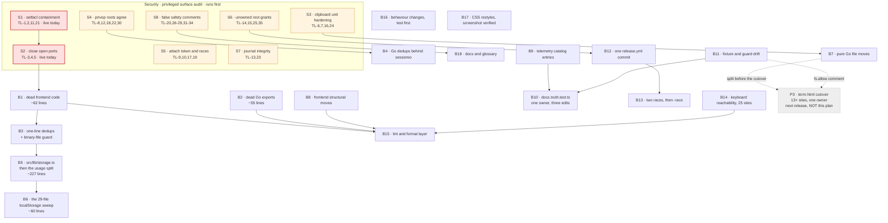
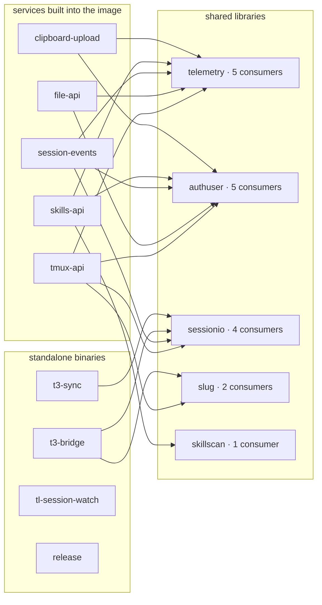

# Refactor and cleanup plan, 2026-09-05

Status: draft, awaiting Viktor's decisions in "Open questions"

This plan sequences 99 audited findings into 26 branches that each land with
tests green and each revert on their own. Most of it is maintenance on a healthy
tree. `npx tsc --noEmit` exits 0, `go vet ./...` is clean in all 14 modules, and
1,020 commits landed in the last 90 days, so nothing here is a build break. What
it buys is roughly 812 lines removed, four dead code paths gone, six duplicated
contracts collapsed to one, and the repo's first lint, format and race gates,
each seeded green rather than dropped on the tree as a wall of diagnostics.

Eight of the 26 branches are security fixes, added on 2026-09-05 from the
privileged surface audit in
[2026-09-05-privileged-surface-audit.md](2026-09-05-privileged-surface-audit.md).
Two of those change what an attacker can do on this box today and run before
every maintenance batch. The rest are the design catching up with its own
documentation. Security review was listed as out of scope in this plan's first
draft; that is no longer true, and the audit is now the companion document.

Still deliberately left alone: the native terminal port and everything its plan
schedules, the ADR set as recorded decisions, `frontend-v2/public/sw.js`, the
231 test files as a subject, dependency review, and bundle cost. Section 8 says
what that means, without softening it.

## What this is not

The native terminal de-iframe work is separate, planned, and owned elsewhere.
Its plan is
[docs/plans/2026-09-04-native-terminal-de-iframe-design.md](2026-09-04-native-terminal-de-iframe-design.md),
its decision is ADR-0017, and it runs in the worktree `.worktrees/native-parity`
on branch `wizard/native-parity`. Nothing in this plan schedules a pass of that
work, and nothing here should be read as re-proposing it.

Two measurements change how this plan treats that branch, and both matter for
scheduling.

`git diff --numstat master..wizard/native-parity` prints nothing. The branch is
three commits, a wip that was then reverted plus a merge from master, and
`git -C .worktrees/native-parity status --porcelain` is empty. So no file in
this plan can textually conflict with that branch today. Every "collides with
in-flight" note in the audit is a collision with a plan, not with a diff.

The terminal deletions are P3, one release after the flip. The plan's stage
diagram puts "term.html deleted, vendor-xterm.py deleted" in the node labelled
"next release" (line 154), and line 159 reads "Passes 1 and 2 run in this
session. Stage 3 is agreed as the next release, so the iframe stays installed as
the way back for one release after the flip." `grep -n TerminalView` over that
plan returns one line, a source citation, not a deletion. So `frontend/term.html`,
`frontend-v2/src/components/TerminalView.tsx` and the `.tl-frame-*` rules are
live for at least one more release, and this plan touches none of them.

## What we found

| Area | Findings | Lines removable | Largest single win |
|---|---|---:|---|
| fe-shell | 2 | 12 | `forwardToTerminal` is a dead dependency implementation on master today, `App.tsx:686-689` plus the `CommandDeps` field at `commands.ts:36`, with nothing reading it |
| fe-views | 5 | 51 | `canonicalize.isReadOnlyToolName` has no caller in the repo, tests included |
| fe-store | 5 | 10 | `LobbyStore.moveGroupBy` has zero consumers; drag-to-position replaced it |
| fe-platform | 5 | 248 | `diagnostics/usage.ts` is 652 lines across byte arithmetic and a schema-v3 localStorage layer, split at one line |
| fe-css | 5 | 117 | `.tl-app` and `.tl-header*` style a shell no component emits, 24 lines |
| legacy-frontend | 4 | 59 | `onTermReady` and the `term.ready` event have one caller, the condemned page |
| go-tmux-api | 3 | 0 | The `/telemetry` rate limiter mutates two package maps from HTTP goroutines with no lock |
| go-t3 | 2 | 14 | `resolveCWD` and `candidateCWD` are the same function in two modules, each documented as having to agree with the other |
| go-session | 5 | 34 | Four production `Emit` call sites name events in neither catalog, so `Emit` drops every one |
| go-services | 4 | 129 | `skillscan.Copy`, `Compare` and `Diff` are reachable only from skillscan's own tests |
| build-ops | 3 | 34 | `release.yml`'s paths-ignore misses `Dockerfile` and `docker/`, so a container-only edit cuts a .deb version |
| cross, the Go module graph | 6 | 36 | "Run tmux as another OS user" has three implementations that diverge in argv and in the self-check |
| cross, frontend-wide | 4 | 68 | The localStorage try/catch guard is reimplemented in 29 files across 9 directories, with a byte-identical comment in 10 |
| cross, lint and format | 5 | 0 | A full recommended lint over 110k lines yields four correctness errors, and all four are false positives |
| cross, sequencing | 12 | restates | The in-flight branch is empty, and the terminal deletions are one release away |
| **Maintainability total** | **70** | **812** | |

The 29 security findings sit in a separate table, because "lines removable" does
not describe them. They come from a second audit of the privileged surface: the
15 shell wrappers root installs to `/usr/local/bin`, the four Go privop re-exec
children, the 11 systemd units, and the sudo grant those describe.

| Severity | Findings | Exploitable today | Fix branches |
|---|---:|---|---|
| critical | 6 | TL-1 and TL-3 verified live by hand | S1, S2 |
| high | 4 | TL-7 only | S3 |
| medium | 5 | none | S4, S5, S6 |
| low | 8 | none | S7, S8 |
| info | 6 | none | S8 |
| **Security total** | **29** | **3** | **S1 to S8** |

The audit's larger half is what held. 43 falsifiable safety claims in
`devvm/sudoers.d-ttyd-users.template` were tested against the code rather than
read off the comment, and they hold, including `file-api/paths.go`'s four-layer
containment and `session-events`' `transcriptWithin`. Read that section of the
audit before this one; it is what makes the exceptions legible as exceptions.

The 812 counts the 58 area findings once each. The 12 sequencing findings restate
lines already counted (the term.html cutover restates two build-ops and
go-services findings, the knip merge restates two tooling findings, the usage.ts
pair restates two fe-platform findings), so adding them would double count.
Where an adversary revised a number, both are given in the batch that carries it.

## The batch sequence

Read the solid arrows as hard order.

S1 and S2 run before any maintenance batch, and S1 before S2 only because it is
the smaller of the two and needs no decision from Viktor. Both were reproduced by
hand rather than read out of the source, so they are the two entries here that
are not a reading.

Four security branches gate a maintenance batch because they rewrite the same
code it touches, and doing them the other way round means refactoring code that
is about to change shape:

- **S3 before B7.** Both touch `clipboard-upload/main.go`. Harden the unit and
  the sweep script first, then split the file, or the hardening lands in a file
  that immediately moves.
- **S4 before B4.** Both rewrite the four privop children. S4 makes them agree
  on where a home comes from and what happens when the identity is unknown; B4
  then dedups what is left. Deduping first would collapse two implementations
  that are about to stop being identical.
- **S6 before B12.** Both edit `release/`. S6 makes `manifest.go` and `users.go`
  describe the whole privileged surface, B12 rewrites the CI module loop that
  reads from them.
- **S8 before B18.** Both edit prose. S8 corrects comments that assert a safety
  property the code does not have, B18 is the glossary and docs pass. Correct
  the false ones before rewriting the set.

Then the maintenance order, unchanged. B1 before B15, because seeding knip before
the deletions means writing ignore entries for symbols about to disappear, then
deleting the entries. B3 before B5, because the storage helper is where
`MinStorage` lands. B8 before B15, because a knip config written against the
current tree encodes the old paths. B9 before B10, because a guard written
against a catalog with names missing starts red. B12 before B13, because `-race`
is red on master today and must not land in the same commit that rewrites the
module loop. B14 before B15, so the two accessibility rules arrive green.
Everything unconnected runs in parallel.

## The security batches

Eight branches from the privileged surface audit. Each entry names its findings;
the chain, the quoted code and the line-level fix live in that document under the
same TL ids. Every branch says what an attacker gets today and what the weakness
costs under the model the code states as its intent, because for six of the eight
those are different answers and collapsing them would misrank the work.

### S1. setfacl containment

Findings: `TL-1`, `TL-2`, `TL-11`, `TL-21`. Critical. Reproduced by hand.

`devvm/tmux-user-setfacl` is the only root grant that walks filesystem content an
attacker shapes. Lines 83-84 and 91-92 pipe `find "$real" ... -print0` into
`xargs -0 setfacl` with no `-type` filter, and `setfacl` follows a symlink
argument when `-R` is absent. Measured in a scratch directory on acl 2.3.2: the
ACL landed on the outside target, not on the link.

Impact today: a non-admin lobby user plants `ln -s /usr/local/bin ~/proj/x`, sets
`coOwned=true` on the project, and `tmux-api/coownership.go:53` has root write
`u:them:rwx` on `/usr/local/bin`. Writing either root wrapper there is code
execution as root the next time it runs. Impact as designed: identical, and it is
the worst outcome in the intended model.

What lands: `\( -type f -o -type d \)` on all four `find` pipelines, the caller
binding from TL-2, the grantee check against the user map rather than
`/etc/passwd` from TL-21, the revoke fix from TL-11, and the header comment at
`devvm/tmux-user-setfacl:13-18` corrected, since it currently asserts the
opposite.

Verify: `shellcheck devvm/tmux-user-setfacl && (cd tmux-api && go test ./...)`,
then reproduce the symlink case in a scratch directory and confirm the ACL no
longer reaches the target. Risk of the fix: low. Size: four line edits plus a
prefix test.

### S2. Close the open ports

Findings: `TL-3`, `TL-4`, `TL-5`. Critical. Reproduced by hand.

`TL_BIND=0.0.0.0`, `TL_PROXY_SECRET` unset, and no host firewall on the box
(`ufw` inactive, iptables INPUT policy ACCEPT). tmux-api 7684, session-events
7685, file-api 7686, skills-api 7688 and clipboard-upload 7683 all bind every
interface, and `TL_AUTH_HEADER` is the only thing authenticating a request.

Measured on 2026-09-05: a request to the box's LAN address carrying a
client-supplied identity header returned 200 with a full session list, and the
identical request without the header returned 401. Authentik gates the public
hostname, not the port.

Impact today: anything routable to the box can name any user in
`/etc/ttyd-user-map` and be treated as them. Impact as designed: the same, and
this is the one finding where the two columns do not diverge.

What lands: `TL_BIND=127.0.0.1` if the proxy is local, or `TL_PROXY_SECRET` plus
the ingress sending `X-TL-Proxy-Secret` if it is not. Both need the compiled
defaults in the five services to agree. `ttyd` on 7681 reads neither variable
(TL-5) and needs its own answer in the same branch.

Verify: `(cd authuser && go test ./...) && (cd release && go test ./...)`, then a
live check that a non-loopback request without the secret is refused. Risk of the
fix: medium, because getting it wrong locks the lobby out of its own proxy.
Blocked on open question 10.

### S3. Clipboard unit hardening

Findings: `TL-6`, `TL-7`, `TL-16`, `TL-24`. High.

`clipboard-cleanup.service` runs as unconfined root, `/tmp/clipboard-files` can
be squatted before the service starts, the store's modes are systemd's default
umask rather than a stated choice, and `clipboard-store-clean` creates
`.deleted-at` through symlinks as root. TL-7 is the only member with a live
attacker position, so it sets the pace.

What lands: one unit file each for the sweep and the uploader with the usual
hardening directives, plus the symlink guard in the script.

Verify:
`systemd-analyze verify devvm/clipboard-cleanup.service devvm/clipboard-upload.service && (cd clipboard-upload && go test ./...)`.
Runs before B7, which splits `clipboard-upload/main.go`.

### S4. Make the privop roots agree

Findings: `TL-8`, `TL-12`, `TL-18`, `TL-22`, `TL-30`. Medium.

The four privop children disagree with each other and with the sudoers file about
where a home comes from, what happens when the identity is unknown, whether a
path is bounded, and whether a binary is resolved through `PATH`. `selfUser == ""`
fails open to inline cross-user operations (TL-12), which is the member of this
set worth reading first.

What lands: home from the uid in every child, fail closed on an unknown identity,
bound every path, pin the binaries by absolute path.

Verify:
`for m in file-api skills-api session-events sessionio; do (cd $m && go test ./...) || break; done`.
Runs before B4, which dedups these same children.

### S5. Attach token and races

Findings: `TL-9`, `TL-10`, `TL-17`, `TL-19`. Medium.

The tmux-api internal token travels on a curl command line where the process
table shows it (TL-10), `/internal/attach` decides admin from a name in the
request body (TL-17), the session-start hook takes the OS user from the request
body (TL-19), and file-api is check-then-open with co-ownership giving the race a
user boundary (TL-9).

What lands: the token off the command line, a loopback check on the internal
endpoints, peer credentials on the hook, and `O_NOFOLLOW` on the two opens. TL-9's
full `openat` rewrite can follow later; the one-flag version lands here.

Verify:
`(cd file-api && go test ./...) && (cd tmux-api && go test ./...) && shellcheck devvm/tmux-attach.sh`.

### S6. Unowned root grants

Findings: `TL-14`, `TL-15`, `TL-25`, `TL-35`. Medium.

Three root-executed dependencies are not declared by any reconciled installer:
`/etc/sudoers.d/tl-reconcile` (TL-14), t3-mint's grant resting on
`/etc/ttyd-user-map` (TL-15), and `/usr/local/bin/tmux-persist` (TL-25). TL-35 is
the live consequence, ancamilea's snapshots and home outliving her grant.

What lands: `release/manifest.go` and `release/users.go` describing the whole
privileged surface, including the two grants and one binary they omit. No
behaviour change, so it is safe to land whenever, and it is what makes a rebuilt
box match this one.

Verify: `(cd release && go test ./...)` plus a `--check` run of
`infra/playbooks/devvm.yml` that comes back a no-op. Runs before B12.

### S7. Journal integrity

Findings: `TL-13`, `TL-23`. Low.

`claude-tmux-state` splices a raw session name into a TLEVENT JSON line, so a
name containing a quote forges a log record. `tmux-attach.sh` logs the raw
`?arg=` value before validating it.

What lands: two shell edits, both in hot paths, so keep them fork-free.

Verify:
`shellcheck devvm/claude-tmux-state devvm/tmux-attach.sh && (cd telemetry && go test ./...)`.

### S8. False safety comments

Findings: `TL-20`, `TL-26`, `TL-27`, `TL-28`, `TL-29`, `TL-31`, `TL-32`, `TL-33`,
`TL-34`. Low and info.

Every comment that asserts a safety property the code does not have, where an
earlier branch does not already carry it. The set includes "peer homes are 0700"
against a live `/home/wizard` at 0711 (TL-28), "set `TL_BIND=127.0.0.1`" offered
as a boundary on a multi-user box (TL-27), the authuser package doc claiming
nothing client-supplied decides anything (TL-29), the template's two
byte-identical placeholder lines (TL-33), and the `env_reset` parenthetical
giving a wrong reason for correct code (TL-34). Plus the `$HOME` change in
`tmux-user-attach` (TL-20) and the dead launcher in `skills-api/restart.go`
(TL-26).

These mislead the next person to widen a grant, which is the whole reason they
are worth a branch rather than a backlog. Cheap, and it makes the sudoers file
trustworthy again for the next reader.

Verify: `shellcheck devvm/tmux-user-attach && (cd release && go test ./...)`.
Runs before B18.

## The batches

### B1. Dead frontend code, deletions only

Deletes four dead symbols and two orphaned CSS blocks. No behaviour changes, no
markup changes, nothing a running app can observe.

Findings: `css-dead-shell-header`, `css-dead-caret-answerable`,
`store-lobby-movegroupby-dead`, `store-skills-cleardiff-dead`,
`fe-feat-is-read-only-tool-name-dead`, and the standalone half of
`shell-softkeys-copy-noop-under-native`.

Files: `frontend-v2/src/app.css` (49-72, 1384-1387, 3446-3452),
`frontend-v2/src/store/lobby.ts` (133, 925-927, 1083, plus the `moveGroup`
import at 10), `frontend-v2/src/store/skills.ts` (69, 215) with
`frontend-v2/test/SkillsPage.test.tsx:136`,
`frontend-v2/src/components/canonicalize.ts` (119-130, plus the header list at
5), `frontend-v2/src/components/App.tsx:686-689` and
`frontend-v2/src/keybindings/commands.ts:36`.

Two things this batch splits, deliberately. The soft-keys Copy button is a
permanent no-op on the default native terminal, and its replacement is a native
copy route, which belongs in the terminal work (see B-terminal below). What is
dead on master today, and only that, lands here:
`grep -rn "forwardToTerminal" frontend-v2/src frontend-v2/test` returns four
lines, the `CommandDeps` field declaration, the `App.tsx` implementation, and two
test stubs that satisfy the interface. Nothing reads the field.

Second, `store-skills-cleardiff-dead` carries a question rather than an obvious
answer: with no clearer, a fetched diff is never returned to null and outlives
the panel collapse at `SkillsPage.tsx:837`. Ask the SkillsPage owner whether the
diff is meant to persist, and delete only on a yes. TypeScript's excess-property
check errors on the test stub the moment the interface field goes, so the
compiler enforces step 3 of that deletion.

Verify: `cd frontend-v2 && npx tsc --noEmit && npm run test`

Size estimate: about 62 lines removed across 7 files. Risk low.

### B2. Dead Go exports in skillscan

`skillscan.Copy`, `Compare` and `Diff` have no caller outside skillscan's own
tests. `grep -rn "skillscan\.Copy(\|skillscan\.Compare(\|skillscan\.Diff(" --include="*.go" .`
exits 1 with no output, and skillscan is imported only by skills-api. Each has a
live successor: production copying goes through `copyWith` directly, and the
same/differs/absent verdict is computed inline at `skills-api/handlers.go:94-99`
from hashes the privileged children return.

Findings: `skillscan-superseded-exports`.

Files: `skillscan/fsops.go:21` (Copy), `skillscan/state.go:507-526` (Compare),
`skillscan/state.go:528-546` (Diff, the range corrected from the filed 533-546
because 528-533 is its doc comment), `skillscan/state.go:561-571`
(`readSkillMd`, orphaned once Diff goes), and the two tests
`TestDiffShowsChangedLinesWithContext` at `state_test.go:307-330` and
`TestCompareClassifiesAPeerSkillAgainstMine` at `:332-355`. Repoint
`copy_test.go:22, 67, 90, 111` from `Copy(src, dst)` to
`copyWith(src, dst, DefaultLimits)`, which line 49 of that file already calls, so
coverage is unchanged.

Keep `Verdict`, `Absent`, `Same`, `Differs`, `Inspect`, `ClearEnabled` and
`Backup`. Drop the framing that the privileged-child design replaced all three:
`Copy` is a one-line wrapper over `copyWith` that lost its last non-test caller.
The filed estimate is 55 lines; with the corrected Diff range and `readSkillMd`
it is about 71.

Verify: `cd skillscan && go vet ./... && go test ./... && cd ../skills-api && go vet ./... && go test ./...`

Size estimate: 55 lines filed, about 71 measured. Risk none.

### B3. One-line dedups and the binary-file guard

Four small fixes plus one CI check that starts red today and turns green in the
same commit.

Findings: `store-states-key-defined-twice`, `store-keepalive-nul-byte`,
`lint-nul-byte-needs-git-not-linter`, `fe-cross-bytes-formatted-five-ways`.

`frontend-v2/src/store/keepalive.ts` carries a literal U+0000 at lines 32 and 58,
which makes git and grep treat the whole file as binary. `git grep -n "KeptSession" -- src/`
prints "Binary file src/store/keepalive.ts matches" on stderr and a clean zero on
stdout, so every grep-driven refactor across the terminal subsystem has been
skipping it silently. `git grep -ln "store/keepalive" -- src/ test/` returns 14
files, not the 2 the finding first claimed. The fix is two characters: write the
separator as the escape sequence for U+0000, which JS parses to the identical
byte, so persisted keys and every `keyOf` comparison stay byte-identical.

The tooling half of that finding is wrong and is corrected here. Biome 2.5.12
over that exact file reports "Checked 1 file in 6ms" with zero diagnostics, and
`--only=suspicious/noControlCharactersInRegex` over `src` returns two hits, both
on `src/terminal/held.ts:57`, where the ESC bytes are the point of the regex. The
instrument that finds it is git's own binary heuristic, which names
`frontend-v2/src/store/keepalive.ts` as the only binary file among 667 tracked
sources. Add that as a three-line CI step before `test (go)`.

`STATES_KEY` is declared twice for one key, `tl:session-states:v1`: the writer in
`lobby.ts:202` and the reader in `visits.ts:33`, with no import between them, so
bumping one version orphans the other while all four tests stay green, because
every one of them seeds storage through `visits.ts`. Delete the private const and
import from `./visits`. Resolve `lobby.ts:195`'s comment naming a third
participant in the legacy frontend while there, since
`git grep -n "tl:session-states" -- frontend/` returns nothing.

`skills.ts:331-337`'s private `human` is `skills.logic.ts:128`'s exported
`humanBytes` plus one guard, in the same directory, with no import between them.
Delete `human` and move the `bytes <= 0` guard into `humanBytes`, verifying the
zero-byte expectation in `test/skills.logic.test.ts` first, since `fileSummary`
renders "0 B" today. Separately, rename `rows.tsx:79`'s `formatBytes` to
`formatCharCount`, which is what its own doc comment says it is, so exactly one
exported `formatBytes` remains. Leave `FilePreview.fmtBytes` alone, its rounding
order is deliberate and its reason is written out at lines 40-42.

Verify: `cd frontend-v2 && npx tsc --noEmit && npm run test`, then
`comm -23 <(git ls-files '*.ts' '*.tsx' '*.js' '*.go' '*.css' | sort) <(git grep -Il '' -- '*.ts' '*.tsx' '*.js' '*.go' '*.css' | sort)`
must print nothing.

Size estimate: about 8 lines removed, one CI step added. Risk low.

### B4. Go dedups behind sessionio

Three duplications where the shared home already exists and the go.mod `replace`
edge is already wired.

Findings: `t3-resolvecwd-duplicated`, `modgraph-privop-argv-vs-sudoers`,
`modgraph-tmux-as-user-triplicated`.

`t3-bridge/attach.go:217-222` and `t3-sync/adopt.go:144-149` are the same
function, and each doc comment names the other as the reason it exists. Move the
body into `sessionio` as `ResolveCWD(transcript, tmuxDir string) string` next to
`TranscriptCWD`. The merged doc comment has to carry both sides' reasoning, the
bridge's resurrect-into-the-parent-directory failure and the syncer's
wrong-T3-project case, or one is lost. Net is about 6 lines, not the 14 filed.

The privileged re-exec argv is built by hand in three modules against one
hand-maintained sudoers template, and only `session-events/privreader.go:56-60`
wraps it in a named function with the comment saying why. Spread that shape to
`file-api/privop.go:205` and `skills-api/privop.go:128`, then add one test per
module reading `../devvm/sudoers.d-ttyd-users.template` and asserting the
module's own `exeSelf` fallback path appears in the NOPASSWD list at line 114.
Cross-directory test reads are already the house idiom (`t3-sync/adopt_test.go:568`,
`notify_test.go:173`, `t3client_test.go:637`).

Do not invent a shared `privexec` module: a fifteenth go.mod costs a require and
replace pair in three services plus two CI entries, to hold about twenty lines
that are already correct. The duplication here is cheap; the missing check is
what costs.

"Run tmux as another OS user" has three implementations that diverge, which is a
stronger case for consolidating than the "identical bodies" the finding first
claimed. `sessionio/tmux.go:99` is socket-aware with no binary seam,
`tmux-api/main.go:322` has binary seams and no `-H`, and
`skills-api/restart.go:125` adds `-H` plus an extra `|| selfUser == ""` branch.
`sessionio/tmux.go:95-98` says it is exported so callers do not re-derive the two
rules that matter, and tmux-api already pays for the sessionio edge, already
constructs an `Injector` at `shares.go:329`, and then re-derives the one function
that edge exists to supply.

Two parts of that fix are safe and one is not. Add `Binary` and `Sudo` fields to
`Injector` with defaults, and leave `skills-api/restart.go:125` alone with a
one-line comment saying why: taking the sessionio edge for one five-line function
adds a fourth require and replace pair, a transitive dependency on a 4k-line
transcript library, and a `sessionio/**` entry in the container paths filter, to
remove five lines. Do not make `-H` a per-Injector struct field and then repoint
all 16 tmux-api call sites at one package-level Injector: today `tmuxCmd` gives
all 16 no `-H` and two sites add it separately, so a per-Injector flag flips every
one of them to the same setting. Either make `-H` a per-call argument, or audit
all 16 sites before the repoint. Neither `go vet` nor the existing tests catch the
difference, because sudo argv is exercised only through fakes. That audit is why
this batch is risk medium rather than low.

Verify: `for m in sessionio t3-bridge t3-sync file-api skills-api session-events tmux-api; do (cd $m && go vet ./... && go test ./...) || break; done`

Size estimate: about 27 lines filed, about 19 net. Risk medium, because of the
`-H` audit across 16 call sites.

### B5. The storage helper, then the usage split

An ordered pair that must not be reversed. Reversed, the split copies a duplicate
into a brand-new file and the dedup gains an eighth site to chase.

Findings: `platform-minstorage-storage-quadruplicated`,
`platform-usage-store-half-split`, `seq-usage-ts-459-pulled-two-ways`.

Commit 1 creates `frontend-v2/src/lib/storage.ts` holding
`export type MinStorage = Pick<Storage, "getItem" | "setItem" | "removeItem">`
and `export function localStorageOrNull(): MinStorage | null`, then deletes the
four local type declarations (`connection.ts:115`, `network.ts:86`,
`usage.ts:459`, `healer.ts:76`) and three identical `storage()` bodies
(`connection.ts:117-123`, `network.ts:88-94`, `usage.ts:572-578`). There are 13
`= storage()` default-parameter sites to rewrite, not 14. The test file is
`test/connection.tier.test.ts`, not `test/connection.test.ts`. `healer.ts`'s copy
is not purely private in effect: `healer.ts:101` uses it as the type of
`storage?:` inside the exported `DeployHealerDeps`, so structural typing is what
makes the move safe, not privacy.

Commit 2 moves what is left of `usage.ts:459-652` into
`src/diagnostics/usage-store.ts`. Two corrections from the adversary pass are
load-bearing. `SCHEMA_VERSION` cannot move: it is read at `usage.ts:148` by
`emptyStore()` and `:221` by `foldInto()`, both above the seam, so it stays in
`usage.ts` and gains an `export`. And the importers to repoint are seven, not
four: `src/telemetry/diag.ts:18`, `src/components/TerminalView.tsx:17`,
`NetworkPage.tsx:17`, `test/usage.test.ts:32`, `test/network.test.ts:18`,
`test/SettingsPanel.datausage.test.tsx:20`, plus `test/diag.netusage.test.ts:568`,
which reaches the module by dynamic import and is invisible to a static rewrite
pass. The `TerminalView.tsx:17` edit is safe to make now: that file survives the
flip by a release and is simply deleted later.

Verify: `cd frontend-v2 && npx tsc --noEmit && npm run test`

Size estimate: 227 lines filed (32 plus 195). The first commit's net is nearer 25
removed against a 12-line new file. Risk low.

### B6. The 29-file localStorage sweep

`grep -rn 'localStorage' src --include='*.ts' --include='*.tsx' | wc -l` returns
82 across 29 files in 9 directories, and essentially every access carries its own
try/catch. Ten of them share a comment character for character. One directory
already extracted the helper and kept it private, `keybindings/engine.ts:60-72`.

Findings: `fe-cross-localstorage-guard-29-files`.

Widen `src/lib/storage.ts` from B5 with `lsGet(key)` and
`lsSet(key, val | null)`, lifting the body from `engine.ts:60-66`, which already
has the `typeof localStorage !== "undefined"` arm the others omit. Convert the
ten comment-identical files, then delete `engine.ts`'s private pair. Two
constraints. `lsGet` must return null and let each caller supply its own default,
never take a default parameter, because the fallback differs per caller
(`FONT_SIZE_DEFAULT`, `DEFAULT_THEME`, an empty Set) and a default parameter
would start changing behaviour. And `store/device-prefs.ts:164` enumerates keys
with `localStorage.key(i)` rather than `getItem`, so it needs an enumerate
accessor or stays as it is; it is also the subject of B16's `clearLocalData`
work, so sequence the two.

Exclude `TerminalNative.tsx` entirely. It holds 7 of the 82 sites and is the file
the terminal passes rewrite; converting it here costs seven sites out of 82 and
buys a hand-written edit inside a component about to be restructured twice.

Verify: `cd frontend-v2 && npx tsc --noEmit && npm run test`

Size estimate: about 60 lines removed. Risk low.

### B7. Pure Go file moves

Three same-package moves, no signature changes, no call-site edits, no exported
surface. All three are `package main`, so the compiler catches anything left
behind.

Findings: `tmux-api-main-go-split`, `t3-bridge-main-split`,
`clipboard-upload-two-jobs-one-file`, `seq-clipboard-split-straddles-the-termhtml-row`.

`tmux-api/main.go` is 1,045 lines doing four jobs, and the test layout already
names the seams: 13 `_test.go` files in that module have no source file of the
same name. Move `148-268` to `session_model.go`, `563-785` to `sessions.go`,
`796-1044` to `session_mutate.go`. `main.go` drops to 452 lines, a 57% cut, and
its remaining job is process wiring plus `/whoami` and `/restore`. Note that
`exactPane` stays in `main.go` by design, so one of the six `sessions_test.go`
tests still does not sit beside its subject.

`t3-bridge/main.go:586-741` (Config and argv parsing, starting at the doc
comment, not at `type Config` on 589, or the comment is orphaned) goes to
`config.go`, and `743-891` (the claude passthrough and the anti-fork-bomb guard)
to `claudepath.go`. Keep `ProbeEnv` at `main.go:280`, because
`t3-sync/t3client_test.go:637` greps `t3-bridge/main.go` for it.

`clipboard-upload/main.go:126-359` (not 367, since 360-367 is `actAsGate`'s doc
comment) goes to `assets.go`. Do this now rather than later: the moved block
contains the `/term.html` row at `:197` and its comment block at `:136-150`,
which the P3 cutover deletes. Split first, and that deletion is a three-line edit
to `assets.go` instead of a one-line edit buried inside a 234-line move. Leave
the helper block at `main_test.go:391-490` whole; only `withUserMap` is shared.

Verify: `for m in tmux-api t3-bridge t3-sync clipboard-upload; do (cd $m && go vet ./... && go test ./...) || break; done`

Size estimate: 0 lines removed, about 900 moved. Risk low. The cost is git-blame
churn and merge friction, which is the argument for one commit per module with no
edits inside the moved ranges.

### B8. Frontend structural moves

Findings: `fe-cross-store-imports-components`, `fe-feat-derive-rows-452-lines`.

Four store modules plus keybindings and mobile import pure logic out of
`src/components/`, so the lowest layer depends on the highest.
`grep -rn 'from "\.\./components' src/store src/keybindings src/mobile src/terminal src/lib src/clipboard src/notify src/pwa src/diagnostics`
returns 8 lines, and the reverse grep exits 1, so it is one-directional rather
than a cycle. The three modules are framework-free:
`grep -n 'solid-js\|JSX\|tsx'` over them exits 1, and `order.logic.ts`'s own
header calls itself "PURE session ORDERING". Move `order.logic.ts`,
`lobby.logic.ts` and `compose.logic.ts` to a new `src/logic/`, 1,288 lines and 33
import specifiers to repoint, 20 in src and 12 in test. Vite and vitest resolve
`src/logic/` with no config change. Do not move `answer`, `context`, `find` or
`timeline` `.logic.ts` in the same pass: every importer of those is a component,
so they are correctly placed and moving them is churn for nothing.

Separately, `deriveRows` is 439 lines, 39% of `timeline.logic.ts`, running
300-738 (the filed 452 counted `markSuperseded`'s doc comment). Extract three
module-private functions inside the file: `collectTurnRows` (329-621, taking the
eight turn-scoped accumulators as locals, which the comment at 315-317 already
says they are), `foldSettledTurn` (625-669, which needs `settled` as a parameter
because the block branches on it and has an else at 667), and `workingRowFor`
(671-733, carrying the 40-line rationale comment with it). Nine test files
exercise `deriveRows` through the unchanged public signature, which is what makes
the split safe to verify.

Verify: `cd frontend-v2 && npx tsc --noEmit && npm run test`

Size estimate: 0 lines removed, 1,288 moved plus 33 import rewrites. Risk low.

### B9. Telemetry catalog entries

Catalog fixes always land before the guard that enforces them, or the guard
starts red.

Findings: `telemetry-uncatalogued-events`,
`platform-telemetry-watch-switched-dropped`.

`Emitter.Emit` is gated on the catalog (`telemetry/telemetry.go:102`), so an
uncatalogued name is dropped with no error, no log line and no test failure. Five
names are missing today: `claude.answered`, `file.attached`,
`session.grid_repinned` and `skill.edited` from the Go side, and `watch.switched`
from the TypeScript union, whose own header says "Add an event to BOTH, in the
same commit." The catalog itself records that this happened once before, at
`telemetry/events.go:36-40` for `session.retitled`.

Add the five keys to `knownEvents` in `telemetry/events.go`, each with the
attribute list its call site passes, and add a row per event to the catalog table
in `docs/adr/0006-usage-telemetry.md`, which `telemetry/events.go:11-12` requires
in the same commit. No call site changes. `watch.switched` is the only record of
a member choosing read-only against read-write on a session, and its `tl.as`
attribute is the deliberate marker for an owner typing in someone else's shared
session, so none of that reaches Loki today.

Two claims to soften rather than repeat. The four-name Go count is a lower bound
by method: the diff compares only literals in `events.Emit("...")`, and
`skills-api/handlers.go:421-426` emits a variable. Both of those two were checked
by hand and are catalogued. And the volume ranking ("claude.answered is the
highest-volume of the four") is unverified, since
`tmux-api/repair_grid_pins.go:57` sits in a per-user, per-pin sweep and nothing
in the tree measures either. Drop the ranking or measure it.

Blast radius worth stating: five event names begin reaching Loki that have never
appeared there, so any ADR-0006 dashboard built on a closed set of names sees new
rows.

Verify: `cd telemetry && go test ./... && cd ../tmux-api && go test ./... && cd ../session-events && go test ./...`

Size estimate: 5 catalog lines, 5 ADR rows. Risk low.

### B10. docs.truth.test.ts, one owner, three edits

Three findings rewrite this file, two of them inside the same const block. One
owner, one pass, in this order because each depends on the previous shape.

Findings: `platform-route-guard-covers-one-service`,
`seq-docs-truth-test-has-three-editors`, and the guard half of
`telemetry-no-catalog-guard`.

Step 1, generalise. The dead-route guard reads one server (`MAIN_GO` at line 34,
not the 32 filed) and filters to one service
(`if (!/session-events/.test(doc)) continue;` at line 91, not the 110 filed).
Eleven session-events helpers are covered and twelve are not, spanning tmux-api,
clipboard-upload, file-api and skills-api with 25 routes between them. All twelve
are correct today, so this is prevention. Replace `MAIN_GO` with a five-entry
service table keyed on the tag each helper's doc comment already names, confirmed
for all four (`config.ts:226` reads "Build a tmux-api URL under the /api/sessions
prefix"). Keep the three existing assertions and run them per row. The one thing
to get right is the route parser: tmux-api registers both `/sessions` and
`/sessions/`, and skills-api registers two-segment paths, so the wildcard
normalisation must keep sub-paths rather than truncate to the first segment, or
the test is vacuously strict.

Step 2, the telemetry catalog case. Parse `knownEvents` out of
`../../telemetry/events.go` and the `TlEvent` union out of
`src/telemetry/track.ts`, and assert every union member is in the catalog. Assert
that direction only: the Go catalog legitimately carries 17 names emitted by Go
services and never by the browser, so a two-way equality assert fails on correct
code. Add the same file's assertion that no file under `src/` outside
`lib/config.ts` contains the literal `"/api/sessions/`, with `pwa/push.ts:21-23`
on a named allowlist carrying its service-worker-parity reason.

Step 3, the `@deprecated` assertion, last, and with the decision it forces. The
existing guard asserts a helper is marked, never that nothing calls it.
`config.ts:126-134` marks `permissionUrl` `@deprecated DEAD ROUTE` and says
calling it today gets a 404, while `src/store/session.ts:567` calls it on every
Allow and Deny in PermissionPanel. Adding the assertion fails immediately, which
is the point, but the commit then has to gate that call or delete both halves.
That is a behaviour decision hiding inside a test-tightening finding. See "Open
questions".

Verify: `cd frontend-v2 && npm run test -- docs.truth`

Size estimate: 0 lines removed, about 50 lines of test changed. Risk low, except
step 3, which is a behaviour decision.

### B11. Fixture and guard drift

Small guards that close gaps a previous incident already named.

Findings: `slug-cleantitle-parity-unpinned`, `slug-vectors-stale-header` (folded
in as one line of the same diff), `frontend-pwa-assets-two-copies` step 1,
`fe-feat-shortcuts-help-omits-two-chords`,
`fe-cross-telemetry-url-bypasses-apiurl`,
`seq-vitest-fs-allow-is-a-termhtml-dependency`.

`CleanTitle`'s 11 case pairs are hand-copied into `slug/slug_test.go:88-98` and
`frontend-v2/test/title.test.ts:18-28`, while `slug/vectors.json`, whose header
says "Add a case here rather than to either language's test file", now has one
reader. Add a `cleanTitleCases` array to the fixture and have both suites read
it. The cross-directory import works because `frontend-v2/vitest.config.ts:15`
sets `server.fs.allow: [".."]` and `tsconfig.json` sets `resolveJsonModule`, with
`test/diag.test.ts:12` as the live precedent. It does not work for the reason the
finding first gave: the deleted `slug.test.ts` used a Node `readFileSync`
relative to cwd, not an ESM JSON import, so it proves nothing about resolution.
While in that file, rewrite the `vitest.config.ts:10-12` comment, which today
names `frontend/term.html` as the only reason `fs.allow` exists. That reason
evaporates at P3, and the slug fixture import goes with it unless the comment
names both. Fold the stale `vectors.json` header rewrite into the same diff.

`frontend/` and `frontend-v2/public/` hold five byte-identical PWA assets, and
only `sw.js` has the test pinning them together. ADR-0014 diagnosed exactly this
hazard for `sw.js` and fixed only `sw.js`, so an icon or `start_url` change made
in `frontend-v2/public/` passes CI, renders on the dev server, and ships nothing.
Extend the block at `test/pwa.tap.test.ts:237-252` from one file to five. Ship
step 1 alone. Step 2, collapsing to one copy, has an unverified premise its own
author flagged (whether the dev harness's clipboard-upload has
`/usr/local/share/ttyd` populated) and a second consequence they did not
(`npm run build` stops emitting `dist/sw.js`).

The shortcuts overlay claims to enumerate every chord and omits two of 22,
including the only keyboard entry to Find in session. Add the two rows, then
extend `test/bindings.logic.test.ts:106` to iterate all of `DEFAULT_BINDINGS`
rather than the four `KB_ALWAYS_BINDINGS`. Assert one direction only: five rows
in `buildShortcutGroups` correspond to no binding (`ALT (hold)`, `MOD+J`, `/`,
`?`, `Esc`), so a symmetric test fails on those immediately, and the allowlist
has to cover the rows-without-bindings side as well as any deliberately withheld
chord.

`telemetry/diag.ts:77` hardcodes `/api/sessions/telemetry`, bypassing `apiUrl`
and so losing the `?api=` origin override. `config.ts:83-88` documents
`pwa/push.ts` as the one exception and never mentions telemetry, and
`diagnostics/probes.ts:47-54` writes out the bug this class already caused. Add a
`telemetryUrl()` helper beside `apiUrl` that picks up `?api=` and deliberately
omits `as=`, because the intake attributes by forward-auth header and appending
`as=` would file a lens user's telemetry against the person being watched. Widen
the comment from one exception to two. No production behaviour changes, since
`API_BASE` is empty without the override.

Verify: `cd frontend-v2 && npm run test && cd ../slug && go test ./...`

Size estimate: about 29 lines removed. Risk low.

### B12. One release.yml commit

Four findings edit this file, three of them inside eight lines. Four agents each
opening it produces three conflicts for changes that share no logic. One owner,
one commit.

Findings: `release-ci-module-list-hardcoded`, `lint-go-gofmt-only-no-golangci`,
`release-cut-by-container-only-changes`, `seq-three-findings-rewrite-one-ci-loop`.

Step 1, derive the module list. Lines 53-56 are a hand-typed list of 14 names
plus `[ -f "$mod/go.mod" ] || continue`, so a module missing from the list
produces no warning. That is measured, not hypothetical: `tl-session-watch/go.mod`
was added 2026-09-01 and reached the list 2026-09-04, and four commits landed on
the module in between with no CI compiling or testing it. Replace with
`for mod in $(git ls-files '*/go.mod' | xargs -n1 dirname | sort)` and drop the
guard. Keep a floor check so the derivation cannot silently pass zero modules;
that floor is why this step is small rather than trivial, and it is what stops a
loud omission becoming a quiet one.

Step 2, the gofmt gate. `git ls-files '*.go' | xargs gofmt -l` prints exactly
three paths, 35 changed lines across 14 modules and ~68k lines. Add
`test -z "$(gofmt -l .)"` inside the loop body before `go vet`, with the fix
command echoed on failure. gofmt ships with the toolchain `actions/setup-go`
already installs, so no new dependency. Seed it green in the same commit, but fix
`tmux-api/netinfo.go:363` by hand: it opens a doc block with the JavaDoc-style
`/**`, and gofmt's repair splits that into `/*` plus a bare `*`, which reads
worse than the original. Run `gofmt -w` on the other two test files only.

Step 3, the paths-ignore entries. `grep -n 'docker\|Dockerfile\|scripts/' packaging/build-deb.sh`
returns exactly two lines, both naming `scripts/test_frontend_compat.py`, and no
`docker/` or `Dockerfile` reference at all. That one grep proves all four
entries: `Dockerfile`, `docker/**`, `.github/workflows/container.yml`,
`scripts/devserve/**`. Do not add `packaging/**` or `scripts/**` wholesale, since
`build-deb.sh` is the build and `scripts/test_qa_harness.py` is a release gate.
Keep `release.yml` out of its own paths-ignore: a workflow change does change what
the package is built from.

Do not add `-race` here (B13 explains why) and do not add golangci-lint. `go vet`
is clean across all 14 modules, the Go dead code found is exported symbols
`unused` skips by default, and both Go defects found are races no static linter
detects.

Verify: push to a branch and read the workflow run. The first run must print the
same 14 module lines the hand-typed list produced.

Size estimate: about 6 lines in the workflow plus 35 gofmt lines. Risk low. A
mistake blocks releases for all 14 modules and the frontend, which is the reason
for one owner.

### B13. Two races, then the detector

`-race` is red on master today, before any proposed change lands.
`cd tmux-api && go test -race ./...` prints a data race between
`netinfo_test.go:343` and `netinfo.go:398`. Three commits, in this order.

Findings: `tmux-api-telemetry-bucket-race`, `seq-race-flag-is-red-on-master`.

Commit 1 fixes the netinfo race, which is a test-lifecycle defect rather than a
caching bug. `netinfo_test.go:341-343` installs a blocking resolver into the
package var `netinfoResolver` and restores it in a `defer`, while the warmer
goroutine at `netinfo.go:398` still reads it, precisely because the installed
resolver never returns. Drain or cancel the goroutine before restoring the
global, or stop making the resolver a package var. No change to the caching is
needed, and the existing test already catches it, so no new test is required to
prove the fix.

Commit 2 fixes the telemetry buckets. `tmux-api/telemetry.go:55-58` declares two
package-level maps with no mutex (`grep -n 'sync\.' tmux-api/telemetry.go` exits
1), mutated from `allowFrom` at `:77` and `:80-89`, reached from the `/telemetry`
HTTP handler, one goroutine per request. Every other in-memory store in that
module holds a lock. Replace with a small locked `bucketPool` type and move
`allowFrom` onto it; `allowIntake` and `allowDiag` become one-line forwarders, so
`handleTelemetry`'s triple at `:149-152` needs no edit. State the trigger
honestly: `buckets[osUser] = b` runs only when the key is absent, so the fatal
concurrent-map-writes throw needs two concurrent first requests for a not-yet-seen
OS user, the post-restart reconnect burst. Once the key exists the race is on
`b.tokens` and `b.last`, which is silent rate-limiter miscounting rather than a
crash. Two tabs of the same user race, and two different users race on one map
header, so both directions of the original blast-radius sentence were wrong. Ship
`TestIntakeBucketsConcurrent` with the fix: the detector is silent on these maps
today, so the flag without the test proves nothing about them, and the test
without the flag proves nothing either.

Commit 3 flips `go test ./...` to `go test -race ./...` in `release.yml:58`,
amending the file B12 owns. The tmux-api suite measured 17.3s under `-race`
against a few seconds without, applied across 14 modules.

Verify: `cd tmux-api && go test -race ./...` clean, then the workflow run.

Size estimate: 0 lines removed, about 40 lines changed. Risk low, ordering strict.

### B14. Keyboard reachability for 25 mouse-only controls

89 of the 93 lint errors in `src` are accessibility, and 25 of them are click
handlers on non-interactive elements, in an app built around 22 registered
chords, a shortcuts overlay and a command palette. Accessibility appears nowhere
in the audit's nine areas or fourteen adversarial passes. This is worth doing on
its own terms even if the linter is rejected: a keyboard-first terminal app with
25 mouse-only controls is the defect, and the linter is only how it was found.

Findings: `lint-a11y-89-unchecked`.

Files: `SessionView.tsx`, `App.tsx`, `SessionCard.tsx`, `ProjectGroup.tsx`,
`Sidebar.tsx`. Each site is a div or span with `onClick` that becomes either a
real `<button>` or gains `role="button" tabIndex={0}` and an Enter or Space
`onKeyDown`. Every change adds a keyboard path to a control that already has a
mouse path, so no interaction is removed. The one risk is a keydown handler
double-firing alongside a parent's capture-phase listener, so check each site
against its parent first. Existing tests assert class names and click handlers,
not key handlers, so they stay green and cover none of the new paths: add one
keyboard case per converted control.

Leave `useButtonType` (38 hits) and the four aria rules off, with the counts
recorded in the config. `grep -rn '<form' frontend-v2/src --include='*.tsx'`
returns 2, so a missing `type` attribute has almost nothing to submit, and
turning them on puts 54 errors between this change and a green gate.

Land before B15, so the two accessibility rules arrive green.

Verify: `cd frontend-v2 && npm run test`, plus a tab-through of the sidebar and
the session cards on the running app.

Size estimate: 0 lines removed, 25 sites plus 25 test cases. Risk low.

### B15. The lint and format layer

Tooling last, and curated rather than recommended. The measured yield settles
both questions.

Findings: `lint-biome-not-eslint`, `lint-format-ratchet-not-bigbang`,
`seq-two-knip-findings-are-one-tool-install`, and the two merged knip findings
`fe-feat-no-unused-export-check` and `platform-no-unused-export-check`.

Biome over 409 files and 110k lines takes 0.56s. A `recommended: true` rollout
ships 1,442 diagnostics on a tree the baseline calls healthy, of which four are
correctness and all four are false positives (`held.ts:57`'s bracketed-paste
regex twice, `Sidebar.tsx:106`'s `Map.set` return value,
`NewSessionComposer.tsx:158`'s assignment with `void` already written). The
predictable outcome of landing 1,442 is someone turning the check off. So write
`frontend-v2/biome.json` with `recommended: false` and enable exactly:
`noImportCycles` (0 violations, starts green, closes a class permanently, and the
rule is proven live against a synthetic two-file cycle), `noDoubleEquals`,
`noExplicitAny` scoped to `src` only through an overrides entry (test/ has 48 and
they are test doubles), `noEmptyCharacterClassInRegex` (0 in src, 4 in test,
which are probably a real regex mistake), and the two accessibility rules from
B14. Record the counts for the rules left off (1,073 non-null assertions, 131
template concatenations) in a comment, so the next person does not re-derive
them. Suppress the three false-positive sites with `biome-ignore` and a reason,
not by disabling rules globally.

Sell it as what it is. The linter here is a formatter plus an accessibility
checker plus a cheap import-cycle gate. Its measured bug-finding yield over this
tree is zero, and any proposal that sells it as bug-finding will be judged
against that number.

Eslint is not the answer. `eslint-plugin-solid`'s headline rule is
`no-destructure`, and this codebase never destructures props, both greps return
0. `typescript-eslint`'s `no-floating-promises` is the one thing it would
genuinely add: biome's nursery equivalent returns 0 but runs without a tsconfig
project here, so that zero is untrusted. It is not worth a type-aware pass over
110k lines by itself.

Format by ratchet, not big bang. A tree-wide `biome format --write` is 5,498
changed lines across 262 of 409 files, and every one of those 262 has a commit in
the last 90 days, so the ratchet reaches the same end state inside a quarter for
free. Add `biome check --changed --since=origin/master --linter-enabled=false src test`
with an explicit `git fetch ... || true` ahead of it, so a missing ref degrades to
formatting nothing rather than failing the release. Ship a
`.git-blame-ignore-revs` holding nothing yet, so a future bulk reformat has
somewhere to go. Put the fix command in the CI failure message. If someone later
insists on the big bang, it lands on `wizard/native-parity` or after it merges,
never on master while that branch is open, since the drift set includes
`TerminalNative.tsx`, `terminal.dragselect.test.ts`, `app.css` and
`TerminalView.tsx`.

Knip lands as one config, not two. Both knip findings propose the same tool, the
same `package.json` and the same CI step, differing only in which directory they
scoped the seeding to. Neither eslint nor biome does unused-export analysis, so
knip is genuinely the right tool and cannot fold into the biome adoption. One
`knip.json` with `entry: ["src/main.tsx", "public/sw.js"]` and `test/` declared as
a project, because with 231 test files an unlisted `test/` is where the noise
comes from, more than the other src directories either finding named. Seed with
an ignore list, not with one-token edits: the honest seeding cost is about 70
decisions across both areas once the ~49 exported interfaces are counted, not the
21 and 12 filed. Decide once, up front, whether unused exported types are
reported, because that is what turns 21 into 70. The one real deletion,
`isReadOnlyToolName`, already landed in B1, which is the whole reason tooling
comes last.

Verify: `cd frontend-v2 && npm run lint && npm run format:changed && npm run lint:exports && npx tsc --noEmit && npm run test`

Size estimate: 45 lines filed across the two knip findings, most of which become
ignore entries rather than deletions. Three `biome-ignore` comments. Risk low.

### B16. Behaviour changes, characterisation test first

Everything in this batch changes what a person sees or which identity a request
resolves to, and none of it has a test asserting today's behaviour. Section 6
names the test and the file for each. Write those first.

Findings: `fe-feat-three-relative-time-formatters`,
`store-clearlocaldata-skips-indexeddb`, `authuser-effective-header-not-exported`,
`modgraph-projects-containment-diverges`,
`modgraph-usermap-and-authheader-rederived`,
`seq-behaviour-changes-with-no-characterisation-test`.

Three relative-time formatters word the same interval two ways. The sidebar says
"5m ago", the Settings network panel says "5 min ago", and `RightNow` never
reaches a day unit. Collapse onto one floored ladder in `lobby.logic.ts`, which
already carries the clock-skew floor, and make the other two adapters. The
user-visible surfaces are three, not the one filed: the Settings wording,
`RestorePicker`'s sub-minute band (today "0m ago" under 30s and "1m ago" from 30
to 59s, both becoming "Ns ago"), and its 25-47h band (36h reads "2d ago" today,
"1d ago" floored). The three cases pinned at `RestorePicker.test.tsx:116-118` all
still pass under the floored ladder, so nothing existing goes red and nothing
existing covers the change either.

"Clear local data" sweeps localStorage by prefix and calls `sessionStorage.clear()`,
and stops there, leaving `tl-transcripts` (up to 12 sessions at 2,000 events each)
on disk. The prefix sweep itself is correct; IndexedDB is the gap. The naive fix
ships a hang and must not be implemented as first written: `indexedDB.deleteDatabase`
fires `onblocked` and never completes while a connection is open, and two of the
three databases are held open, `tl-transcripts` by a module-level memo at
`transcript-cache.ts:193` with no invalidation, and `tl-notif` by the service
worker at `public/sw.js:70` and `:271`. Race each delete against `onblocked` plus
a timeout so a blocked delete degrades to a no-op rather than stranding the
reload. That is the only variant safe without touching a database another
execution context owns. Widen the confirm text at `PrivacyPage.tsx:29` to name
cached transcripts in the same change.

`authuser` keeps the effective header name unexported, so five services declare
their own `const authHeader = authuser.DefaultAuthHeader`, and one reads it in
production at `clipboard-upload/main.go:571`. On a box where `TL_AUTH_HEADER` is
`X-Authentik-Username`, which `release/manifest.go:339` pins on an existing
multi-user install, that branch never sees the header and the handler derives the
user from a client-supplied form field instead, still bounded by `osUserKnown`.
Export `func (g *Gate) AuthHeader() string` and change `:571` to use it. Two
edits, not one: `clipboard-upload/main.go:374-376`'s comment justifies the const
on the compile-time default and must be rewritten or deleted, or the next reader
restores it. There is no "add a gate" step,
`grep -c 'var actAsGate' clipboard-upload/main.go` prints 1 (`main.go:368`, a
composite literal), and adding a second gate would give that process a different
MapPath. Reach is narrower than the headline: `/register` is documented as a
localhost callback that normally carries no forward-auth header, so this bites
proxied callers on non-default-header boxes. Risk medium is right.

The "is this .jsonl inside the projects root" boundary has two implementations,
and the exported one is lexical while the privileged one resolves symlinks. Move
the hardened body into `sessionio` and have `WithinProjects` delegate, so
`layout.go:249`, `:259` and `t3-sync/adopt.go:111` inherit it. Keep the
`err == nil` fallback exactly as written: a transcript Claude has not written yet
is an ordinary state, and dropping the fallback makes it fail containment on the
stamp path. Two costs, both real: two `EvalSymlinks` walks per stamp, and a box
where `~/.claude` is itself a symlink is the realistic way this could start
refusing valid transcripts, which resolving both roots is what makes safe. Add
the table case for a link inside the root pointing out of it, so the decision is
recorded rather than inferred.

The user-map path is re-declared in four modules beyond `authuser`, plus a fifth
non-comment site at `release/manifest.go:328` inside the environment-file
template the package ships. `session-events/main.go:24` is free, it already
imports `authuser` in the same package. `t3-sync` takes the edge and loses both
copies, including `tmuxAuthHeader`, whose own comment says "rather than
hard-coding a second answer" while hard-coding the fallback answer.
`tl-session-watch` and `release` keep their literals with a pointer comment,
because both taking an edge to the identity gate would invert the layering. A
guard that allowlists the sites has to skip comments or match only const, var and
flag-default forms: 14 of the 20 hits are prose in doc comments, and nobody
maintains a fourteen-entry comment allowlist. Verify `t3-sync` against a live box
rather than only `go test`, because `tmuxAuthHeader` feeds every loopback call it
makes to tmux-api, so a wrong delegation 401s the syncer silently.

Verify: `cd frontend-v2 && npm run test` and
`for m in authuser clipboard-upload sessionio session-events t3-sync tl-session-watch; do (cd $m && go vet ./... && go test ./...) || break; done`

Size estimate: about 28 lines removed. Risk medium. This is the batch to land
slowest, and the only one where a live multi-user box is part of the check.

### B17. CSS restyles, screenshot verified

Two changes no test in this tree can cover. They need a before and after
screenshot, and this batch says so rather than implying coverage.

Findings: `css-tool-row-double-definition`, `css-skill-meta-collision`.

`.tl-tool-head`, `.tl-tool-toggle` and `.tl-tool-name` are each defined twice,
1,850 lines apart, both live, both applying to `rows.tsx`'s markup, with the
later block winning per property and the rest merging. Fold the 1360-1379 copies
into the canonical 3217-3260 block. One correction to carry: the 3223 block
declares `font: inherit`, and a shorthand resets font-size, so the toggle does
not keep the 1367 font-size, it inherits from `.tl-tool-head` and lands on the
same computed value by a different route. Carrying font-size onto 3223 is
redundant, not required.

Split `.tl-tool-name` out as its own screenshot-verified commit. Deleting
1388-1391 is a restyle, not a dedup: `--font-mono` is defined at
`theme/theme.css:112`, so `font-family: var(--font-mono); font-weight: 500` is
live today and its removal changes the noun on every tool row. "Never intended to
survive" is an intent claim with nothing behind it, so treat this as a deliberate
visual change.

`.tl-skill-meta` is claimed by the transcript row (`rows.tsx:210`) and the Skills
panel (seven sites in `SkillsPage.tsx`), and the later settings copy leaks
`white-space: nowrap` into the transcript. Scope the settings copy to
`.tl-skills-page .tl-skill-meta`. Call it a latent name collision rather than a
rendering bug: no screenshot and no wrapped-text report exists, and the container
holds two short spans in an `inline-flex`. Note in the commit that this raises
specificity from (0,1,0) to (0,2,0), harmless here only because
`.tl-skill-file-foot .tl-skill-meta` at 4804 is later at equal specificity, since
a reader will otherwise assume scoping is specificity-neutral. The panel root is
`SkillsPage.tsx:182`.

Verify: `cd frontend-v2 && npm run test` for regressions, then screenshot a
transcript carrying a tool row and a skill row, and the Skills settings panel,
before and after.

Size estimate: about 26 lines removed. Risk low, verification manual.

### B18. Docs and glossary

Comment and markdown only. No code, no CI, no package, with one test file.

Findings: `modgraph-architecture-table-covers-4-of-14`,
`tmux-api-project-store-split-brain`, `stale-harness-references`,
`modgraph-container-filter-unguarded`.

`docs/architecture.md` opens "What the pieces are and how a request reaches a
terminal" and its Components table names 3 of the 5 shipped services and 1 of the
5 shared library modules. `file-api` and `session-events` appear only inside the
frontend row's prose, despite both being systemd units with their own ports and
their own health probes in the package manifest, and both being built into the
container. Add a row for each and a short "Go modules" subsection carrying the
graph below.

Fourteen modules, 17 cross-module replace edges, every one imported by non-test
code, so there is no dead replace edge in the graph. Three places must agree on
it: each go.mod's replace block, the loop at `release.yml:53-55`, and the paths
filter at `container.yml:14-32`. The filter is correct today and nothing holds it
correct, since a paths filter that omits a directory does not fail, it just does
not fire, and the image keeps the old bundled library. Add
`release/containerfilter_test.go` asserting the transitive closure of the
Dockerfile's service list against the filter, in both directions. It must fail
loudly if the Dockerfile's service loop stops matching, or it becomes a vacuous
pass, which is the same failure mode B12's floor check exists to prevent.

`CONTEXT.md:66` says a project "Lives in the global project store, not any one
user's layout", which is true of `GlobalProject` and incomplete. Identity,
membership, attach mode and co-ownership live there; a member's ordering of
projects and of the sessions inside them lives in that member's layout document,
which is what `PUT /layout` writes. The whole `/projects` handler family has no
caller outside a QA script, and nothing in the repo would tell a reader so:
`docs.truth.test.ts` guards a client helper against a dead route, and nothing
guards a route against having no client. Replace the one sentence with two that
name both stores and both files, add a pointer comment above `layout.go:54`'s
`type Project` to `GlobalProject`, and touch `vite.config.ts:137`, whose dev-proxy
comment also names the unreached routes. This is doc incompleteness rather than
drift, and the `/projects` handlers are already recorded as an unported v2
surface in the 2026-07-17 feature inventory.

`scripts/qa-harness.py:5-7` opens "Companion to dev-harness.py", which was
deleted, and `.gitignore:13` points at `scripts/devserve/BATTERY.md`, which does
not exist. Fix both, and establish the battery's absence separately before
dropping the `scripts/devserve/baseline/` rule the pointer annotates. For
`docs/adr/0013:85-86`, append a dated superseding line rather than rewriting the
Consequence: the ADR correctly describes what was true on the day the deploy
scripts were deleted, and this repo treats a recorded decision as deliberate. The
line should say `dev-harness.py` was deleted and `qa-harness.py` is what to run,
not that `scripts/devserve` was replaced, since `git ls-files scripts/devserve`
returns four tracked files.

Verify: `cd release && go test ./...`, and read the rendered markdown.

Size estimate: about 4 lines removed, one new test file. Risk none.

### B-terminal. Inside the plan's own passes, not on master

Three findings edit `TerminalNative.tsx`, the one file passes 1 and 2 rewrite.
None should be a standalone commit to master against a component about to be
restructured twice. They are listed here so they are not lost, and they belong in
the native-parity plan's pass list rather than in this plan's schedule.

Findings: the replacement half of `shell-softkeys-copy-noop-under-native`,
`shell-dock-has-no-native-terminal`, `frontend-diag-onrender-no-producer`,
`seq-terminalnative-prop-surface-is-the-real-collision`.

The prop surface is the real constraint. `TerminalNative` has seven props
(`args`, `onConn`, `watch`, `onReady`, `ownsBridges`, `active`, `onAttention`),
and `Dock.tsx:70-92` passes four that do not exist (`session`, `creating`,
`newCommand`, `onFrameCommand`). So porting the dock is a prop addition, and the
native copy route is an eighth prop. Both are pass work.

The soft-keys Copy button belongs in pass 2, whose node already reads "selection
and copy". Implement it over `term.getSelection()` and the existing `case "copy"`
action at `TerminalNative.tsx:2827-2863`, not over `selection.ts`'s stash, which
`TerminalNative.tsx:2508` says nothing feeds yet because copy is pass 2. The
no-op it fixes exists on master today, before the port: `TerminalView.tsx:465` is
the sole installer of `__tlForwardToTerminal`, `SessionView.tsx:1059` calls it,
and native is the default renderer.

The dock is a plan gap rather than a cleanup. `grep -in "dock"` over the plan and
over ADR-0017 both return zero, and the dock is desktop-only, not phone-only:
`App.tsx:371` reads `if (dockAllowed()) return; // coarse pointer: no dock` and
`Dock.tsx:14-15` says coarse pointers ignore the dock entirely. So the unhandled
case is every desktop user's Ctrl+J shell. There is no Dock render test anywhere,
only the store-level `dock.logic.test.ts`, so a port would break nothing in CI
and ship unverified. Decide it before pass 2 closes.

`onRender` has never had a producer: four hits repo-wide, one definition, one API
entry, one interface member, one no-op stub, no call site. The `tl.render.*`
attributes ADR-0008 lists as part of `perf.rollup` have never been emitted.
Nothing regressed, so this is a gap in ADR-0008's dashboard rather than a defect.
If it is wired, use `term.onRender` or `term.onWriteParsed` with the timestamp
taken at feed time, not `term.write`'s parser callback, or rename the attribute
to `tl.parse.*`. Either way it is a decision to record.

### P3. The term.html cutover, next release, one owner

Not scheduled by this plan. Recorded here so it is not filed twice and not
started early. Two findings, `build-term-html-hard-dependency` and
`release-termhtml-packaging-blast-radius`, are the same cutover filed separately,
overlapping on `packaging/build-deb.sh:73` and `:86`, both proposing edits to the
native-parity plan document. Merge them into one P3 checklist owned by one
person, written into that plan rather than filed as cleanup items. Add
`frontend-diag-onterm-ready-orphan` and `frontend-diag-three-surfaces-drift`,
which are orphaned by the cutover rather than competing with it.

The merged list, in the order the build fails: `build-deb.sh:108-112` (TERM_ASSET
extraction and the fingerprint grep, which dies before the surface loop is
reached), `:73` (the `-term` flag), `:86` (the surface loop), `:149-155` (the
compat gate, whose `scripts/test_frontend_compat.py:34-38` resolves to
`frontend/term.html` under the release gate because `build-deb.sh:154` sets
`TL_SPA` and the script reads `TL_INDEX`), `verify-deb.sh:63` and `:73-74`,
`release/manifest.go:198` and the `HashedTermPage` field at `:113-117`,
`clipboard-upload/main.go:197` with its comment block, `docker/smoke.sh:57-70`,
`docker/nginx.conf.template:62`, `Dockerfile:32`'s now-false comment,
`scripts/qa-harness.py` (8 routes), `scripts/qa_driver.py` (4 references, and
`:318` is executable, the driver's session-creation `page.goto`),
`scripts/test_qa_harness.py:439` and `:467`, `scripts/test_watch_mode_e2e.py:36`,
`scripts/build-tl-symbols.sh:26`, `scripts/vendor-xterm.py` deleted whole, the 47
test files naming `term.html` together with the `fs.allow` comment from B11,
`frontend/diag.js:853-872` and `:1042` with `telemetry/diagevents.go:61` and the
ADR-0008 catalog row, `docs/architecture.md` rows 9, 32 and 34, and
`docs/interface.md:36` and `:119-120`. Also `app.css:2058-2109` (the six
`.tl-frame-*` selectors, whose test-only consumers at
`test/TerminalView.bridge.test.tsx:474-491` a src-scoped grep missed) and
`TerminalView.tsx` itself, which the plan schedules nowhere.

That is thirteen-plus sites and nearer 120 lines than the 30 or 70 either finding
filed, and it reddens two release-workflow steps, `build the package` and
`test (python)`, plus the container push gate. Every item is correct and
load-bearing today. Doing half is worse than doing none, which is the argument
for one owner rather than two findings.

## Test-first items

Six changes alter behaviour with nothing asserting the current behaviour, and the
repo rule is test-first. Write the characterisation test, watch it pass against
today's code, then change the code.

| Change | Test to write first | File |
|---|---|---|
| `clearLocalData` gains an IndexedDB sweep | Assert `clearLocalData` completes and calls `reload` even when a delete blocks. `grep -n "indexedDB\|IDB" test/device-prefs.test.ts` returns nothing today, and the proposed fix as first written hangs, so this is the test that catches a broken proposal | `frontend-v2/test/device-prefs.test.ts` |
| One relative-time ladder | Pin 30s, 25h and 36h against today's output before touching `formatAgo`. Lines 116-118 pin only 5m, 3h and 48h, and the bands that move are asserted nowhere | `frontend-v2/test/RestorePicker.test.tsx` |
| Soft-keys Copy reaches a terminal | Assert the copy request reaches a real terminal handle. Today lines 130-145 assert a `vi.fn()` was called, which is why the no-op stays green | `frontend-v2/test/SoftKeys.test.tsx`, or a SessionView-level file |
| The dock's terminal | Mount `Dock` and assert a terminal renders, before anyone changes which terminal. Only `dock.logic.test.ts` exists and it is store-level | new `frontend-v2/test/Dock.render.test.tsx` |
| `AuthHeader()` and the register handler | Assert `AuthHeader()` tracks `Config.AuthHeader`, and drive `/register` with `TL_AUTH_HEADER` set to a non-default name. This is the risk-medium identity change and it has no test today | `authuser/resolve_test.go` beside line 60, plus a clipboard-upload case |
| Locked telemetry buckets | `TestIntakeBucketsConcurrent`, about 64 goroutines at `allowIntake` and `allowDiag`. Test-first by construction: the detector is silent on these maps today, so the flag without the test proves nothing | `tmux-api/telemetry_test.go` |

The two CSS restyles in B17 cannot be covered by any test in this tree. No test
reads computed style. They need before and after screenshots, and B17 says so
rather than implying coverage.

Everything else in this plan is a pure move, a deletion, or a comment, where
`npx tsc --noEmit`, `go vet`, `go test` and the existing suites are sufficient.

## Deferred and dropped

**Deferred to P3, not moot.** This is the correction that matters most. Every
finding that reads as "about to be deleted anyway" is live for at least one more
release, because the flip keeps the iframe installed as the way back.
`css-frame-rules-orphaned-by-native-parity` styles the `?native=0` path the
escape-hatch decision requires. `platform-usage-store-half-split`'s
`TerminalView.tsx:17` import is a real import to repoint, not a corpse, and B5
repoints it now. The whole term.html packaging cutover is P3 work with one owner.
Anyone who reads "TerminalView.tsx is condemned, ignore it" and deletes
accordingly breaks the escape hatch a release early.

**Folded rather than filed.** `slug-vectors-stale-header` is the same drift as
`slug-cleantitle-parity-unpinned` in a different file, and its own proposal ends
with "keep the last line only if slug-cleantitle-parity-unpinned lands". It rides
in that commit as one line of the diff, not as a seven-line JSON comment edit of
its own. `fe-feat-is-read-only-tool-name-dead` is the entire yield of the
`fe-feat` unused-export sweep, so it rides in B1 rather than waiting for knip.
Eleven of that sweep's twelve symbols are a surplus `export` keyword on a symbol
used in its own file, which costs nothing and hides nothing, so score that
finding as prevention rather than as a cleanup of twelve things.

**Dropped, do not re-propose.** A second gofmt finding duplicated
`lint-go-gofmt-only-no-golangci` and proposed `gofmt -w` over all three
unformatted files. That seeding step is unsafe: `gofmt -d tmux-api/netinfo.go`
shows it splitting the malformed `/**` at line 363 into `/*` plus a bare `*`,
which reads worse than the original. B12 carries the corrected step, fix that one
by hand. A correction claiming `TerminalNative` installs one window bridge rather
than five was also dropped: `grep -n 'ownWhile(' TerminalNative.tsx` returns
3098, 3120, 3121, 3125 and 3129, five installs. The original citations were bad,
the headline count was right, and severity is unchanged.

**Rejected on measurement.** Do not add golangci-lint. `go vet` is clean across
14 modules, the Go dead code found is exported symbols `unused` skips by default,
and both Go defects found are races only `-race` detects. Do not build a madge
step for import cycles: measured at zero across 177 src files, with the rule
proven live against a synthetic cycle, and biome's `noImportCycles` covers it for
free inside B15. Do not adopt typescript-eslint for `no-floating-promises` alone:
it is the one thing eslint would genuinely add, and it is not worth a type-aware
pass over 110k lines by itself. Do not split `clipboard-upload`'s asset half into
a second service: a separate binary costs a systemd unit, a port, a Dockerfile
entry, a manifest File and Unit entry, and an ingress change in another repo, to
buy nothing the file split already buys. Do not build a shared `privexec` module
for the twenty lines of privileged argv, for the same shape of reason.

## What this audit did not cover

Reproduced from the re-checkers, unsoftened. Two of the gaps below were closed on
2026-09-05 and are marked where they appear: `devvm/` as code, and the
highest-privilege paths, are now covered by the privileged surface audit, which
carries its own separate gap list. Frontend security is still open, since that
audit scoped itself to the privileged surface and did not read the transcript
renderer. The two `innerHTML` sinks were checked by hand afterwards and are
defended, `Mermaid.tsx:85` with `securityLevel: "strict"` and `CodeView.tsx`
because highlight.js escapes its input, but that is two lines checked, not a
review.

Every finding whose files sit under `frontend-v2/` or `frontend/`: the fe-shell,
fe-views, fe-store, fe-platform, fe-css and legacy-frontend sets, plus the
frontend halves of the cross and seq findings (`fe-cross-*`,
`seq-two-knip-findings`, `seq-usage-ts-459`, `seq-docs-truth-test`,
`seq-terminalnative-prop-surface`, `seq-vitest-fs-allow`,
`lint-a11y-89-unchecked`, `lint-nul-byte-needs-git`). That re-checker did not
audit Go modules, `packaging/`, `docker/`, `docs/` or `.github/` except where a
frontend finding cites them. All checks were static reads and greps at HEAD
53e5717, and the vitest suite was not run.

Nothing in this audit ran the code. Every frontend claim, including "behaviour is
identical by construction" on the minstorage, usage-store, src/logic move and
relative-time findings, is a reading of the source. Neither the surveyor nor the
adversary ran `npm run test`, `npx tsc --noEmit`, or drove the app. Six findings
change what a user sees (the two CSS restyles, the relative-time ladder,
`clearLocalData`, the soft-keys copy route, the dock's terminal) and not one
screenshot or test run exists anywhere in the record.

Unassigned by directory and file type:

- `frontend-v2/public/sw.js`. Shipped code with its own IndexedDB and
  cache-version contracts, reached by name from the release manifest, and outside
  `npm run typecheck` because it is plain .js in `public/`. It appears here only
  as a knip entry point and as the thing holding `tl-notif` open. Its
  cache-versioning, its `skipWaiting` and claim behaviour, and its parity with
  the `frontend/` copy were never read.
- The 231 test files as a subject rather than as evidence. Nobody grepped for
  `it.skip`, `describe.skip` or `it.only`, duplicated fixtures, or tests that
  assert on mocks they themselves installed. `SoftKeys.test.tsx:130-145` is called
  out as mock-only in one finding, which suggests a class, not an instance.
- `src/app.css` as a whole. Two dead-class findings and two collision findings
  came out of it, and the adversary explicitly says the "only two cross-section
  collisions" claim is false without producing an inventory. Nobody counted the
  file, audited the theme token set, or checked light and dark parity across its
  ~4,800 lines.
- Dependencies. `package.json` was opened only to add scripts. No
  unused-dependency, outdated-dependency or license check, and the two knip
  findings propose the repo's first lint dependency without anyone reading what
  is already installed.
- Frontend security. The transcript renderer takes untrusted session output and
  there is no finding about `innerHTML`, URL sanitisation in the file-preview
  overlay, or the postMessage origin checks the de-iframe work is about to
  delete.
- Bundle and runtime cost. `vite.config.ts` is cited three times for chunking
  facts and never audited. No finding measures bundle size, the xterm chunk, or
  the cost of keeping every visited session mounted, which SessionView's own
  comments say is the design.
- The `frontend/` tree beyond `diag.js`. `fonts/`, the icons, the missing
  `index.html` and `sw.js` parity were touched only through the PWA-duplication
  finding.

One structural gap in the method itself: the surveyor's greps were repeatedly
scoped to `src/` and then described as exhaustive over `src/` and `test/`. That
produced wrong blast radii in at least three in-scope findings (`usage.ts`
importers, `tl-frame` CSS consumers, `keepalive` consumers). Any finding in this
set whose blast radius was not independently re-derived should be assumed to
under-count `test/`.

From the Go, scripts, docker, packaging, devvm, .github and docs re-check, nine
things nobody was assigned:

1. CLOSED 2026-09-05 by the privileged surface audit, which read all 15 wrappers
   and the 11 units. The duplicate NOPASSWD lines noticed in passing below are
   now TL-33. Original text: `devvm/` as code. It is in scope and effectively unaudited. The only finding
   touching it reads `devvm/sudoers.d-ttyd-users.template` as a fixture for a
   proposed test; nobody examined `devvm/tmux-attach.sh`, `tmux-user-attach`,
   `tmux-restore-user`, `claude-tmux-state`, `clipboard-store-clean`, or the
   `.service` and `.timer` units. These are the highest-privilege code in the
   repo, they run as root or through the sudo grant on every attach, and no
   finding looks at their argument validation, quoting, or drift against
   `release/manifest.go`'s Unit list. One thing noticed in passing and not
   chased: `devvm/sudoers.d-ttyd-users.template` lines 114 and 115 are
   byte-identical duplicate NOPASSWD lines.
2. `scripts/` as code rather than as grep targets. Seven Python and shell files
   including `qa-harness.py`, `qa_driver.py`, `test_frontend_compat.py` (951
   lines) and `vendor-xterm.py`. They appear in the finding set only where they
   mention `term.html`. Nobody read them for correctness, dead code, or
   duplication, and two of them gate the release.
3. No lint or format proposal for Python or shell. The lint findings cover
   TypeScript (biome) and Go (gofmt) and stop there. No ruff, no black, no
   shellcheck, in a repo whose release workflow runs pytest and whose build is a
   bash script, the same "no linter anywhere" fact that motivated the other two.
4. `docker/` beyond the six `term.html` lines. `entrypoint.sh`, the whole of
   `nginx.conf.template`, the Dockerfile's multi-stage layering and
   `.dockerignore` were never read.
5. The ADR set as a set. Individual ADRs are cited (0006, 0008, 0011, 0013, 0017,
   0018, 0019) but nobody checked whether any Status field is stale, whether a
   superseded ADR is still referenced as current, or whether the numbering has
   gaps. `docs/plans/` got the same treatment: one plan read, the rest untouched.
6. Go test quality. Test files were counted and used to locate seams, tmux-api's
   13 orphan `_test.go` files are a finding, but nobody asked whether any Go test
   is skipped, flaky, or asserts nothing, and no module's coverage was measured.
   `go test -race` ran on one module of fourteen; the other thirteen have not
   been run under the detector by anyone in this audit, and the one that ran was
   already red.
7. `go.mod` hygiene across the 14 modules. Nobody compared declared Go versions,
   checked for unused requires, or checked that the toolchain agrees with CI. The
   box is go1.22 while `release.yml` installs `go-version: stable`, and nothing
   asserts the two are compatible.
8. CLOSED 2026-09-05. The audit asked exactly this question and answered it in
   43 verified safety claims plus 29 findings; S4 is the branch that fixes the
   argv validation, and open question 7 is the grant-width half. Original text:
   Whether the privileged paths are correct, as opposed to duplicated.
   `modgraph-privop-argv-vs-sudoers` examines the re-exec argv for duplication
   and proposes a sudoers-parity test. No finding asks whether the argv
   validation inside the privileged children is right, or whether the sudo grant
   is wider than it needs to be.
9. Nothing was exercised. Every "this would break the build" claim in the
   `term.html` cutover is static reading: no .deb was built,
   `packaging/verify-deb.sh` was never run, `docker/smoke.sh` was never executed,
   and the ingress that both cutover findings say carves `/term.html` lives in
   `infra/stacks/terminal/main.tf`, outside this repo, which nobody opened. The
   deployment half of the largest sequenced change in the set is asserted, not
   verified.

## Open questions

These need a decision before the batches they sit in can be implemented.

1. **The `permissionUrl` call in B10 step 3.** `config.ts:126-134` marks the
   helper `@deprecated DEAD ROUTE` and says calling it gets a 404, while
   `src/store/session.ts:567` calls it on every Allow and Deny in PermissionPanel.
   Adding the caller assertion fails on that line immediately. Gate the
   PermissionPanel call, or delete both halves? This changes what a user's Allow
   and Deny does, so it is a product decision, not a test fix.
2. **The `onRender` leg.** Wire it (two lines inside a terminal pass, and
   ADR-0008's Latency dashboard row gains its render series back), or delete it
   (about 10 lines across `diag.js` and `telemetry/diag.ts`, plus a
   `diagevents.go` comment and an ADR catalog row, after which the dashboard row
   loses a third of its content)? Either way it is a decision to record rather
   than a silent tidy-up.
3. **The dock's terminal.** Port `Dock.tsx` to `TerminalNative` (four new props,
   plus a decision on what `onFrameCommand` becomes with no postMessage to ride
   up on), or retire the dock with the iframe (deleting `Dock.tsx`,
   `src/store/dock.ts`'s render coupling, and `App.tsx:363-376`)? The dock is
   desktop-only, so this is every desktop user's Ctrl+J shell.
4. **`SkillsStore.clearDiff` in B1.** With no clearer, a fetched diff is never
   returned to null and outlives the panel collapse at `SkillsPage.tsx:837`. Is
   the diff meant to persist for the life of the page? If yes, delete the dead
   action. If no, the fix is the opposite: call it from the collapse handler.
5. **Unused exported types in B15.** Knip reports about 49 exported interfaces
   with no external reference (options and deps shapes such as
   `StatusStoreOptions`, `TextZoomDeps`, `FireOptions`). They are cheap
   documentation of a parameter shape and worth keeping. Scope the check to
   values, or keep types in scope and carry them on an ignore list? This is what
   turns the seeding cost from 21 decisions into about 70.
6. **Batch order.** This plan runs deletions, then dedups, then splits, then
   tooling, with the accessibility work just ahead of the linter. The alternative
   is tooling first, so every later batch lands under the gate. The measured
   argument against that is the seeding cost: knip and gofmt both want a green
   seed, and seeding before the deletions means writing ignore entries for
   symbols about to disappear, then deleting the entries. gofmt is the one
   exception already pulled forward, since its seed is three mechanical files
   with no dependency on anything else. Confirm the order, or say to flip it.

The next four came with the security branches on 2026-09-05.

7. **Is the non-admin service account still the target?** Six of the eight
   security branches have `impact_today: none` and exist only under the model the
   sudoers file states as its intent, a service account that is not an
   administrator. If that design has settled on an admin service account instead,
   S4, S6 and S8 become documentation work rather than security work, and their
   position in the order changes. S1 and S2 are unaffected either way, since both
   have a live non-admin attacker.
8. **Should a project directory be restricted to the caller's own home?** TL-2's
   fix assumes yes. If cross-home sharing is wanted, the binding has to become an
   explicit consent step by the directory's owner, which is a product decision
   rather than a patch, and S1 grows accordingly.
9. **ADR-0005 and the clipboard store modes.** Revisit the world-readable modes,
   or leave them and document the umask at the code? Any tightening has to keep
   `show-image` working for a non-wizard user, so this one has a test before it
   has a fix.
10. **`TL_BIND=0.0.0.0`, intended or migration residue?** S2 cannot land without
   this. If the cluster ingress genuinely reaches this box, the fix is the shared
   secret and the bind stays wide. If it does not, the fix is narrowing the bind,
   and `MigrateConfigSnippet` should stop widening it on upgrade. A related
   sub-question with its own answer: `/internal/attach` currently decides admin
   from a name in the request body (TL-17). A `RemoteAddr` check is three lines;
   a second loopback listener is the cleaner shape and changes the deployment.

Two more sit in the audit rather than here, because they are about ownership
rather than about this plan: who owns `/usr/local/bin/tmux-persist` and the
t3-mint grant, both root-executed dependencies of Terminal Lobby living in
another repository's hand-run installer.
