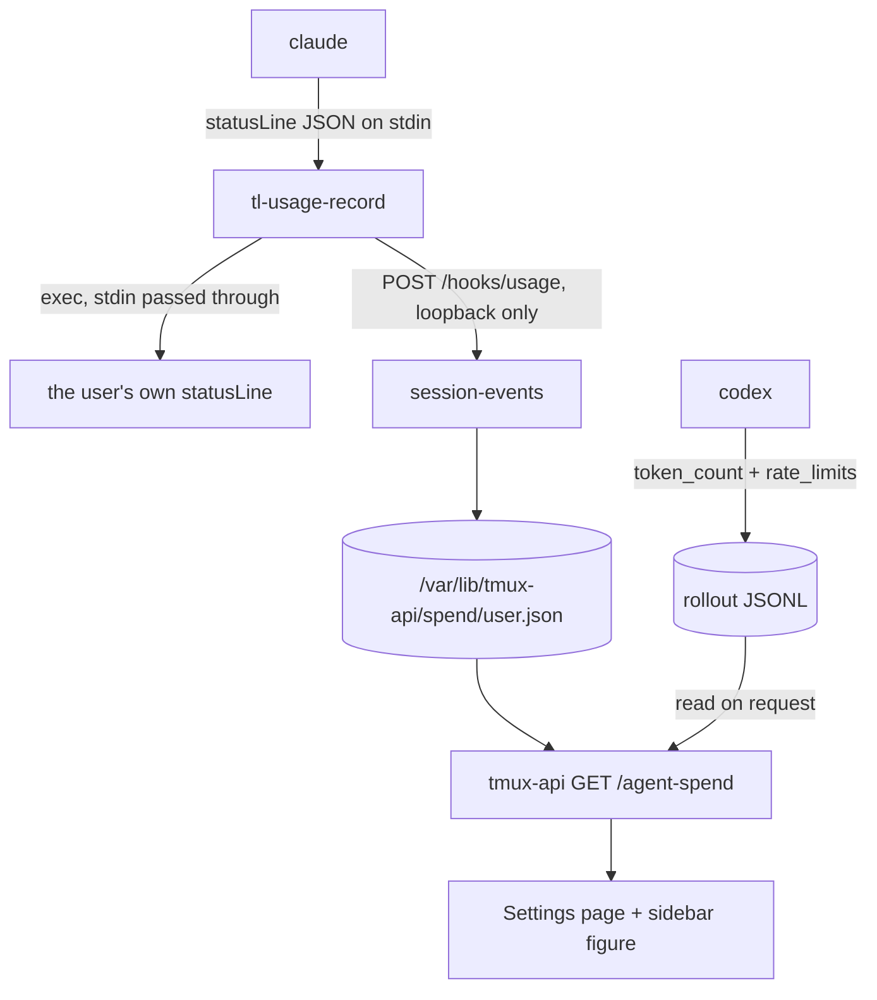

# Agent spend and limits in Settings

Terminal Lobby runs Claude Code and Codex sessions all day and does not
currently show what they consume. This adds a Settings page that answers
"what have my agents cost me, and how close am I to a limit", plus a small
figure in the sidebar footer so the answer is visible without opening
Settings.

## What each vendor can actually tell us

The two tools report different things, so the panel shows different things
for each rather than forcing them into one shape.

| | Claude Code | Codex |
|---|---|---|
| dollars | `cost.total_cost_usd`, computed by the CLI | none on ChatGPT plans |
| 5-hour and weekly windows | `rate_limits`, present for Pro and Max seats only | `rate_limits.primary` / `.secondary`, always |
| tokens | per message in the transcript, and in the statusLine payload | `token_count` events in the rollout |
| plan identity | `subscriptionType` in the credentials file | `plan_type` in the rollout |
| where we read it | a statusLine recorder we install | the newest rollout JSONL, read directly |

Measured on this box on 2026-09-06. An enterprise Claude seat carries no
`rate_limits` object, so its section shows spend and no windows. A Pro or
Max seat carries both.

## Sources we checked and did not use

- **Fetching totals from the provider.** `GET /api/oauth/usage` returns
  `429` with `retry-after: 3582`, a one-hour budget per account, and is
  gated on a `user:profile` scope that service tokens lack. The endpoint
  that does return dollars, `/v1/organizations/cost_report`, answers `403`
  to an OAuth token and wants `sk-ant-admin…`. OpenAI's `/v1/organization/costs`
  wants `sk-admin-…`. Someone installing this app from the public image will
  have neither, so spend accumulates locally.
- **Claude Code hooks.** No hook payload carries cost. `SessionEnd` delivers
  `{reason}`; `Stop` delivers `last_assistant_message` and no numbers. The
  only money-shaped field anywhere in the hook surface is
  `estimated_cache_write_usd`, a forward-looking cache-rebuild estimate on
  `SessionStart` and the model-switch pair.
- **Loki.** `cost_usd` per `api_request` is already there, keyed by
  `tmux_session`, which is exactly our session key. It is homelab
  infrastructure though, so an OSS install would ship a dead panel. Worth
  revisiting as an optional backend later.
- **`~/.claude/stats-cache.json`.** The write path is current in 2.1.263, but
  the file is only recomputed when someone opens `/usage`. The copy on this
  box was last computed on 2026-03-08 with empty token data.
- **Pricing transcript tokens ourselves.** Transcripts carry tokens and the
  model but no cost, so this means maintaining a price table that must be
  updated whenever a rate changes, with no signal when it has gone stale. The statusLine number is Claude Code's own
  arithmetic and needs no table.

## How the numbers arrive

The Claude recorder is a small script shipped by this repo and wired by
whoever owns the machine's Claude configuration, which is the same split
`docs/adr/0001-claude-state-via-hooks.md` already established for the state
dot: the script lives here, the `managed-settings.json` entry lives in infra
on the devvm and in the image build for the container. It records the payload
and then execs whatever statusLine the user already had, passing stdin
through, so an existing custom prompt keeps working.

Codex needs nothing installed. Its rollout files already carry
`rate_limits` on every turn.

## What the page shows

A new rail entry after Privacy, with one section per tool. A section renders
only when that tool has data, so a Claude-only box sees one section and a
plain-shell box sees no page at all.

**Claude Code**

- Spend for the selected period, as the heading figure.
- 5-hour and weekly bars when the seat reports them.
- Session rows: name, model, tokens, spend.

**Codex**

- 5-hour limit and weekly limit bars, labelled in OpenAI's words. These are
  account-wide facts and sit above the session rows rather than inside them.
- Plan, and credit balance when `credits.has_credits` is true.
- Session rows: name, model, tokens. No dollars, because ChatGPT plans do
  not report any.

Periods are Today, 7 days, This month and All time, reusing the control the
Network page already has.

A window reading whose `resets_at` has passed describes a window that no
longer exists, so it is dropped rather than shown as current.

## The sidebar figure

A small figure in the sidebar footer next to the gear, following the attached
session's tool, which `tmux-api/proc.go` already derives as
`claude | codex | shell`:

- Claude session: today's spend, for example `$4.12`.
- Codex session: the tighter of the two windows, for example `31%`.
- Shell, or no session attached: nothing.

No colour states. A dollar total has no ceiling, and inventing a threshold
means inventing a budget the user never set.

## Storage

`/var/lib/tmux-api/spend/<user>.json`, matching the per-user JSON files
already at `/var/lib/tmux-api/{prefs,push-subs,titles,layout,assignments}`.
Per-session rows are listed for 30 days; every reading has already rolled its
difference into a per-day total, and the day totals are a few bytes each and are
kept indefinitely, which is what makes All time possible.

A row past 30 days is retired rather than deleted: it keeps the conversation's
running totals as the baseline the next reading is differenced against and loses
its name and model. Deleting it would make a conversation resumed later
contribute its whole history to the day it came back.

## Scope and boundaries

- Numbers are the signed-in user's own. The endpoint follows `?as=` like every
  other call, so an admin acting as someone else sees that person's figures.
- The sidebar figure is always on. There is no preference to hide it.
- No timestamp or refresh control. Both sources update when a turn completes.
- Vocabulary: this repo already uses "usage" for wire bytes
  (`CONTEXT.md:448`) and "subscription" for Web Push. Neither word is reused
  here, and the new terms go into the Language section of `CONTEXT.md`.

## Open questions

- Whether the container image should wire the recorder itself, or leave it to
  the operator the way the deb does. The image owns its own
  `managed-settings.json`, so it can, but that makes the image the first
  install shape that edits Claude configuration on the user's behalf.
- Whether Loki is worth adding later as an optional backend for devvm
  installs, which would give retroactive history that the local recorder
  cannot.
