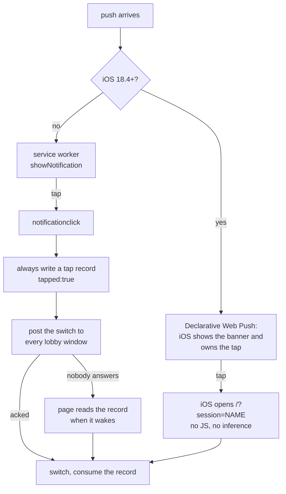

# Landing a notification tap on the session that called

Status: done (landed 2026-09-06)
Date: 2026-09-06
Author: wizard

Tapping a notification on the iPhone does not reliably open the session the
notification was about. This has been fixed six times since 2026-07-17 and has
come back each time. This plan treats the recurrence as the problem to solve,
not just the current symptom.

## What the journal says

Seven days of `notify.stash_read`, the event the page emits every time it looks
for a pending tap:

| reason | meaning | count (7d) |
|---|---|---|
| `acted` | routed to the tapped session | 51 |
| `already` | the tapped session was already on screen | 11 |
| `untapped` | records exist, every banner still in the shade | 156 |
| `stale` | records exist, all older than the 15-minute window | 201 |
| `absent` | no record at all | 376 |

51 of 795 reads routed. `stale` is the largest actionable bucket: a tap record
was there and was thrown away for being older than 15 minutes.

`notify.clicked` fired 85 times in the same week. Every one of them today came
from the stash path; the service worker's `postMessage` path contributed
nothing.

## Why it keeps coming back

Four structural reasons, each of which has produced at least one of the six
regressions.

**1. The tapped session is inferred, not received.** On iOS the app is
foregrounded with no argument saying which banner was tapped. The current design
guesses: it writes a record per push, then at boot asks which banner has
disappeared from the notification shade. Every fix so far has been a better
guess.

**2. The signal the guess rests on is unsound on WebKit.** The
`getNotifications({tag})` filter only started being honoured in WebKit main on
2024-08-29 and no Safari release note says which iOS shipped it. Separately,
same-tag notifications do not coalesce on iOS (WebKit bug 258922, still
reproducing on 18.4), so the count can say 1 while two banners are on screen.

**3. Two files, one service worker.** `frontend-v2/public/sw.js` is what we
edit, test and build. `frontend/sw.js` is what the Debian package installs
(`release/manifest.go:223`). They are byte-identical today and nothing enforces
it. The same duplication covers the manifest and the three icons.

**4. Nothing exercises the path in a browser.** Every one of the six fixes was
verified against mocked `navigator.serviceWorker` and a stubbed notification
shade. That kind of test was green through all six breakages.

## Two concrete bugs, on top of the design

**B1. A tap is dropped when the app is backgrounded but alive.** In
`sw.js`'s `notificationclick`, when window clients exist the worker posts the
switch and waits 400 ms for an acknowledgement. WebKit resolves `matchAll()`
before the client can run JS, and `postMessage()` to a waking client fails
silently (WebKit bug 268797). No client answers, the loop ends, and the handler
returns **without writing a tap record**. The tap leaves no trace anywhere.
This is the common case on a phone: the PWA is usually resident.

**B2. A warm route leaves its record behind.** `register.ts:435` calls
`readAndClearPendingSession()`, which deletes only the legacy `last` key. The
per-session record survives, so the next return to the foreground routes to the
same session again, pulling the user off whatever they moved to.

## The fix

### Part 1 — stop guessing on iOS

Adopt Declarative Web Push (iOS/iPadOS 18.4+, Safari 18.4+). The push payload
carries a `navigate` URL and WebKit opens it itself. The Notifications spec
settles the important part: when a notification has a navigation URL,
activation navigates and returns, and `notificationclick` is never dispatched
(§2.7, steps 5 and 6). Nothing is inferred because nothing needs to be.

- `tmux-api/pushsender.go` adds `web_push: 8030`, `mutable: true` and a
  `notification` object carrying `title`, `body`, `navigate`, `tag`,
  `app_badge` and our own `session` / `waiting` under `notification.data`. The
  flat keys stay for Chrome, Android and any Apple device below 18.4.
- **`mutable: true` is deliberate.** Without it WebKit displays the banner
  itself and never starts the service worker, which would take the device-side
  badge count with it — the count ADR-0015 exists to protect, and whose absence
  was the "the counter wrongly resets to a bigger number" bug. With it the push
  event still fires, so the worker keeps counting and calls `setAppBadge`, and
  the tap still navigates. The catch is that `event.data` is **null** on that
  path and the payload arrives as `event.notification`, so `sw.js` has to read
  both shapes.
- **`navigate` must be an absolute URL.** WebKit is stricter than the spec here:
  a relative URL fails to parse and the *entire message is dropped*, notification
  and all. The server does not know its public origin today. Record `origin` on
  the push subscription when the client PUTs it, and emit the declarative fields
  only when a valid absolute `https` origin is known. No origin means the flat
  payload alone, which is exactly today's behaviour.
- `app_badge` omitted leaves the icon badge unchanged rather than clearing it,
  so an explicit `0` is what clears it.
- Payload budget: the nested copy costs roughly 200 bytes against a ~4 KB
  limit. `waitingListCap` (64 names, ~2 KB) is re-measured against the new
  shape rather than assumed still safe.

### Part 2 — make the fallback deterministic and honest

For every browser that is not on the declarative path, and for older Apple
devices:

- **`notificationclick` always leaves a `tapped:true` record**, in every
  branch, before it tries to route. This is B1, and it converts the iOS
  backgrounded case from a guess into a fact.
- **A warm route consumes that session's record** (`clearPendingSessions`, not
  `readAndClearPendingSession`). This is B2.
- **One decision function.** `stashExpired`, `stashIsActionable` and
  `pickTappedSession` overlap today, and `stashIsActionable` now only decides
  what to *report*, so the two can disagree and the journal then lies about
  why. Replace them with one pure function that takes the records, the current
  notification list and a clock, and returns the session plus the reason. Pure
  means no `getNotifications` call inside it, which makes it exhaustively
  testable.
- **Read the shade once, filter tags ourselves.** `reg.getNotifications()` with
  no argument, matched in JS, removes the dependency on a filter WebKit only
  learned recently.
- **A real tap does not expire on the receipt clock.** A `tapped:true` record
  is stated intent; it lives until it is consumed. A push-time receipt keeps a
  tight window. This is the 201 `stale` reads.
- **Re-check on `focus` and `pageshow`, not `visibilitychange` alone.** A
  foregrounding that fires only `focus` currently never reads the stash.

### Part 3 — stop breaking it

- **One service worker file.** Point `release/manifest.go` at
  `frontend-v2/public/`, delete the `frontend/` copies of `sw.js`, the manifest
  and the icons, and add a guard so a future divergence fails the build.
- **A device dimension in telemetry.** Every notification event today is
  attributed to a user, not a device, so a two-device account's tap path cannot
  be read at all. Add a stable per-installation id.
- **The click handler reports.** `notificationclick` currently emits nothing,
  which is why "does iOS dispatch it when backgrounded?" took a bugzilla thread
  to answer instead of a query.
- **A real-browser end-to-end test.** Chromium under Playwright against the
  deployed bundle: register the real worker, deliver a real push, dispatch a
  real notification click, assert the app switched session. Runs in CI on every
  push. Both branches of B1 get a case: a client that acknowledges, and one that
  never answers.

## What this does not fix

iOS itself has no instrument on this network. The declarative path is verified
by reading the payload the server emits and by Viktor tapping a banner on his
phone; there is no automated test of WebKit's behaviour and there will not be
one. The Chromium test guards the mechanism, not Apple's half of it.

Devices below iOS 18.4 stay on the inference path. It will be better than it is
today and it will still be inference.

## Open questions

- **Does a declarative tap reload an already-open lobby?** The Notifications
  spec leaves this implementation-defined ("select one of the following two
  options in an implementation-defined manner: navigate an existing top-level
  traversable / create a fresh one"), and WebKit hands the URL straight to the
  embedder through an SPI delegate that Safari implements privately. So it is
  not answerable from source, and the first tap on the phone is what tells us.
  If it does reload, the tap is still correct and costs a second of reattach;
  worth it against a tap that lands on the wrong session.
- **Which iOS is the phone on?** Below 18.4 there is no declarative path and
  Part 1 does nothing there — Part 2 is what serves those devices.

## What shipped

All three parts, plus the two bugs. Verified before landing:

| check | result |
|---|---|
| Go, every module (build, vet, test) | pass |
| frontend typecheck, lint, knip, build | pass |
| vitest | 4,523 passed, 4 skipped, 236 files |
| Chromium end-to-end (new) | 8 passed in 23 s |
| `pytest scripts/` whole directory | 149 passed |

The guard was checked by breaking the fix on purpose. Removing the always-stash
line from `sw.js` fails exactly the two frozen-lobby cases and nothing else, so
it catches the regression it was written for rather than passing whatever is
there.

Three blind challengers read the diff and returned 15 findings, 11 distinct.
Ten were real and fixed. Two more were found afterwards by hand and fixed here:
the receipt tier routed a banner the shade still showed, which moved a desktop
reader off the session they were reading; and the worker read `app_badge` off
the `Notification`, where WebKit does not put it (it arrives as
`PushEvent.appBadge`).

Still unverified, and there is no instrument on this network for it: the
declarative path as Apple actually runs it. Chromium exercises the flat
fallback and the whole service-worker handshake. The first tap on the phone is
what confirms the rest.
