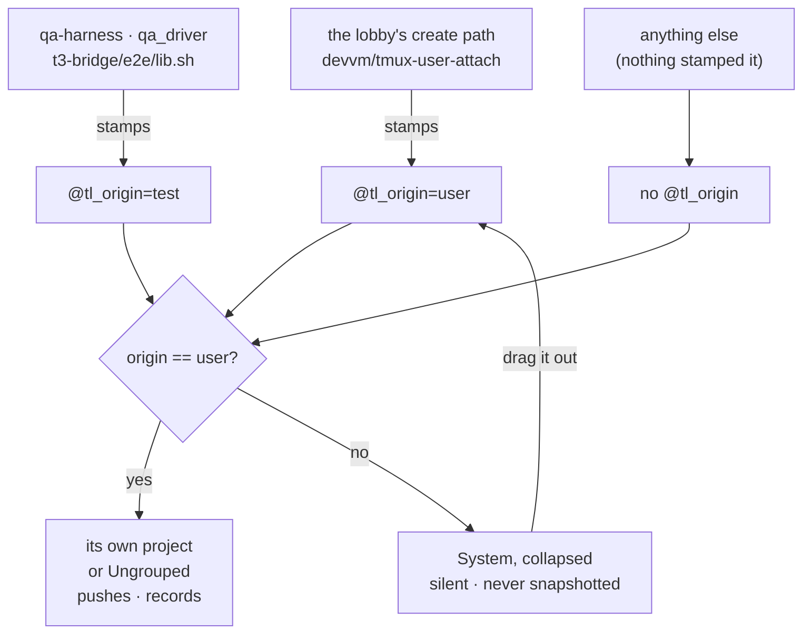

# A session knows who made it

**Status**: approved, not yet built
**Date**: 2026-09-06, revised 2026-09-10
**Repos**: `terminal-lobby` (most of it), `infra` (one file)

## The problem

The QA fleet drives the real deployed lobby against the real backends, on
purpose. `scripts/qa-harness.py` exists so what an agent clicks is what
`terminal.viktorbarzin.me` serves. The cost of that faithfulness is that its
sessions are wizard's sessions. They sit in his sidebar, and
`create_claude_session` starts a real Claude in them, so every turn they finish
is a completion, and every completion is a Web Push to his phone.

t3-bridge's e2e harness does the same by a different route: `t3-bridge/e2e/lib.sh`
creates `t3e2e-*` sessions on the default socket, where the lobby sees them.

The Go live tests do not. `withRealTmux` (`tmux-api/title_live_test.go:27`) points
`tmuxBinary` at a wrapper running `tmux -S <tmpdir>/s` and kills that server in
`t.Cleanup`, and has since 2026-08-16 (`b0be8d5`).

Measured on the box on 2026-09-06, four sessions in the list were created by
tooling rather than by a person:

| name | created | how it got there |
|---|---|---|
| `qa-slug` | 2026-09-06 00:27 | qa-harness fleet |
| `shell-2` | 2026-09-05 23:40 | unattributed |
| `kbfix-probe` | 2026-09-05 12:23 | unattributed, an ad-hoc probe by its name |
| `shell` | 2026-09-04 14:38 | unattributed |

Three of the four are unattributed. They match no harness convention, so
something created them by hand or from a script that is not in this repo.

Nothing in the system can tell any of them from a session a person opened. A
session is created with a minted 12-character id (ADR-0019), and a QA agent
driving the primary new-session flow mints one exactly like the composer does.

Since ADR-0022 a name does not stay that id: when a title lands, tmux-api derives
a name from it and renames the session. That does not weaken anything here. A
tmux option survives a rename, so `@tl_origin` rides along, and `derivedNameFor`
(`tmux-api/name_from_title.go:50`) declines to rename a `reservedName`, so a
`qa-` session keeps the prefix the backstop reads.

## What changes

A session gains an **Origin**: `user` when the lobby's own create path made it,
`test` when a harness stamped it, and absent when nobody said. Anything that is
not `user` is a **system session**.

System sessions collect into one group at the foot of the sidebar, called
**System**, collapsed by default. They stay fully addressable: attach, prompt,
kill, and open by URL all work as they always did. They do not push, and they
are not recorded in telemetry. Dragging one out adopts it: it becomes a user
session for good.



## Decisions

| question | decision |
|---|---|
| What stops sending | Web Push (done and awaiting) and usage telemetry, for everything in System |
| Where they go | A **System** group at the foot of the sidebar, collapsed by default |
| Group or project | A synthesised group, a third `GroupKind` beside `project` and `ungrouped` |
| How a session is marked | `@tl_origin`, a tmux option. `user` is stamped on create by the lobby's path; `test` by the harnesses; absent means system |
| Reserved prefixes | `reservedName()` still forces system, whatever the option says |
| Existing sessions | Grandfathered: at first boot after the upgrade, every live session with no reserved prefix is stamped `user` |
| Rescue | Dragging a session out of System stamps it `user`. It stays out, and it pushes and records like any session |
| Direct access | Unchanged. `/?session=qa-foo` opens; attach, prompt and kill all work by name |
| Collapse state | The existing per-device collapse store, key `:system`. Default collapsed; expanding it sticks on that device |
| Lens (`?as=`) | Same rule, same group, per tab |
| Restore across reboot | Never. `tmux-persist` skips them at save time |
| Prewarm pool slots | Left invisible. They are churn on a 2-minute TTL, not sessions |
| ADR | Yes, ADR-0024, plus **Origin** in CONTEXT.md |

## How it works

### The marker

`@tl_origin` is a tmux session option, sitting beside `@title`, `@last_drive`
and `@claude_state`. Same reasoning as ADR-0001 and ADR-0019: it belongs to the
session, it dies with it, no store to keep in sync, and anything that can reach
the tmux server can read or write it. There is precedent for this exact use:
`@tl_speculative`, written by `devvm/tmux-user-attach:240`, is how a prewarmed
slot records that it was made on spec rather than asked for.

`@tl_origin` joins `tmuxListFmt` (`tmux-api/main.go:61`), so it arrives with
every other field and costs no extra fork. `listFields` goes 12 → 13.

The reserved-prefix half needs no new rule. `reservedName()`
(`tmux-api/migrate_ids.go:61`) already answers "does this name belong to
something other than a person", over `reservedNamePrefixes = {"qa-", "t3e2e-",
"tlp-t", poolSlotPrefix}`. It exists so the id migration leaves harness sessions
alone, and it is the same question asked here.

```go
// System sessions are everything the lobby did not make: unstamped, stamped by
// a harness, or carrying a prefix another service reserves.
func isSystemSession(s Session) bool {
    return s.Origin != originUser || reservedName(s.Name)
}
```

### Stamping the human path

This is the inversion the "unattributed" half requires. Absence of a mark can
only mean something once the lobby's own path leaves one.

`devvm/tmux-user-attach:295` runs `tmux new-session -A`, which attaches or
creates and does not say which. A `has-session` check immediately before it
answers that, and a create is followed by `set-option @tl_origin user`. The warm
path at `:227` stamps nothing, and does not need to: pool slots never reach the
list.

A QA agent driving `/?session=<minted-id>` goes through this same path and so
gets stamped `user`. The harness then overwrites it to `test` for every session
its run owns, which it can already enumerate: that ownership set is what its
mutation guard is built on.

### Grandfathering

Every session alive today is unstamped, so without a migration all of them would
land in System on the deploy. One pass at tmux-api start stamps `user` on every
live session that has no `@tl_origin` and no reserved prefix. It sits beside
`migrateSessionNamesToIDs` (`tmux-api/main.go:250`), which is the same shape of
one-shot repair.

The four strays above keep their place in that pass: `qa-slug` is caught by its
prefix, and the other three are stamped `user` like everything else, then killed
by hand in step 11. That is the honest trade. The alternative was moving all 26
live sessions into System and dragging back the ones that matter.

### The group

`GroupKind` (`frontend-v2/src/components/lobby.logic.ts:24`) is `"project" |
"ungrouped"` today. Ungrouped is already a synthesised group that is not a
project: `name: ""`, token `"u"`, hidden while empty, its own collapse key. A
third kind, `"system"`, token `"s"`, is the same shape, pinned to the end of the
sequence rather than placed by `ungroupedIndex`.

`deriveSidebar` (`lobby.logic.ts:130`) already resolves project members first,
then sweeps leftovers into Ungrouped. A leftover that is a system session goes
to System instead. A session the layout has explicitly placed in a project keeps
that place, which is what makes the rescue work with no special case.

The collapse store (`frontend-v2/src/store/collapse.ts`) is per-browser
localStorage keyed by group name, with `:ungrouped` and `:shared` as sentinels
that cannot collide with a project name. `:system` joins them. The one change to
that store is the default: a key it has never seen reads as expanded today, and
System reads as collapsed.

The header carries its count while collapsed, the way the other groups do, so a
session that lands there wrongly is still one line of evidence rather than
nothing.

### Rescue

Dropping a card into another group already writes the layout. It also POSTs the
new origin, so the session stops being a system session on the server as well as
in the arrangement. That needs one small endpoint,
`POST /sessions/{name}/origin`, which is the same shape as
`POST /sessions/{name}/title` (`tmux-api/session_mutate.go:173`).

### Push

`pushSender.tick` skips system sessions before the edge diff: no state recorded,
no `outstanding` entry, no place in the badge or the `waiting` list. Skipping
before the diff rather than at the send matters, because a rescued session would
otherwise fire once on a stale edge.

### Telemetry

Two legs, because the events come from two places.

The **browser batch** (`POST /telemetry`) is refused by the qa-harness proxy, the
way it already refuses other mutations, with the usual `qa-harness guard:` body.
This catches events that carry no `tl.session` at all, such as `app.loaded` and
`theme.changed`, which a session-keyed rule cannot see.

**Server-side emitters** get a session-origin check at emit. The `telemetry`
package gains an optional hook; an event whose `tl.session` names a system
session is not written. tmux-api answers it from the sessions cache it already
keeps. The other services need a small cached tmux read, at most one fork per
user per cache window.

`tl-session-watch/collect.go:238` makes its own tmux call for OOM and liveness
snapshots and sits outside that path, so it gets the same exclusion directly.

### Restore

`infra/scripts/tmux-persist.sh` skips system sessions in `capture_live`, so one
never enters a snapshot and a reboot never brings it back.
`infra/tests/tmux-persist/` gets the case.

## Plan

1. **Marker** — `@tl_origin` in `tmuxListFmt`, `Session.Origin` on the wire,
   `isSystemSession`. Tests: parsed, reserved prefixes, unstamped is system.
2. **Stamp the human path** — `has-session` check plus `set-option` in
   `devvm/tmux-user-attach`.
3. **Grandfather** — the one-shot pass at tmux-api start, beside the id
   migration.
4. **Harness stamping** — qa-harness.py stamps each session its run owns;
   `qa_driver` stamps its direct creations; `t3-bridge/e2e/lib.sh` stamps its
   `t3e2e-*` sessions.
5. **The group** — third `GroupKind`, pinned last, hidden while empty; `:system`
   in the collapse store, defaulting to collapsed.
6. **Rescue** — `POST /sessions/{name}/origin`, called by the drop handler.
7. **Push** — the sender skips them before the edge diff.
8. **Telemetry** — the emit hook wired per service; the harness proxy refuses
   `POST /telemetry`; `tl-session-watch` excluded.
9. **infra** — `tmux-persist.sh` and its test.
10. **Docs** — **Origin** and the System group in CONTEXT.md, ADR-0024.
11. **Clean up** — kill the four stranded sessions above.

Landing is two pushes: terminal-lobby, whose own CI builds the package the box
installs, and infra, where CI applies on push to master.

## What this does not catch, and what it costs

A creator that starts using the lobby's own attach path and never stamps
anything is indistinguishable from a person, because after the inversion that
path stamps `user` for everyone who uses it. The harnesses work around this by
overwriting their own sessions afterwards. Anything new that creates sessions
this way has to do the same.

The collapse default cuts both ways. A session that lands in System wrongly is
behind one click rather than in front of you, which is the point, and is also
the failure mode to watch for in the first weeks. The count in the collapsed
header is what makes it noticeable.

Verification is the sidebar and the phone, not the test suite. After this lands,
a fleet run should leave the main list unchanged, the System count should move,
and no push should arrive. That is what gets checked before it is called done.
