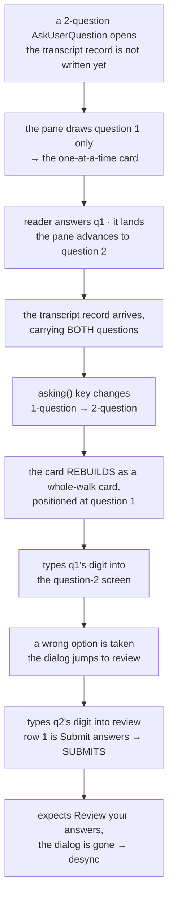
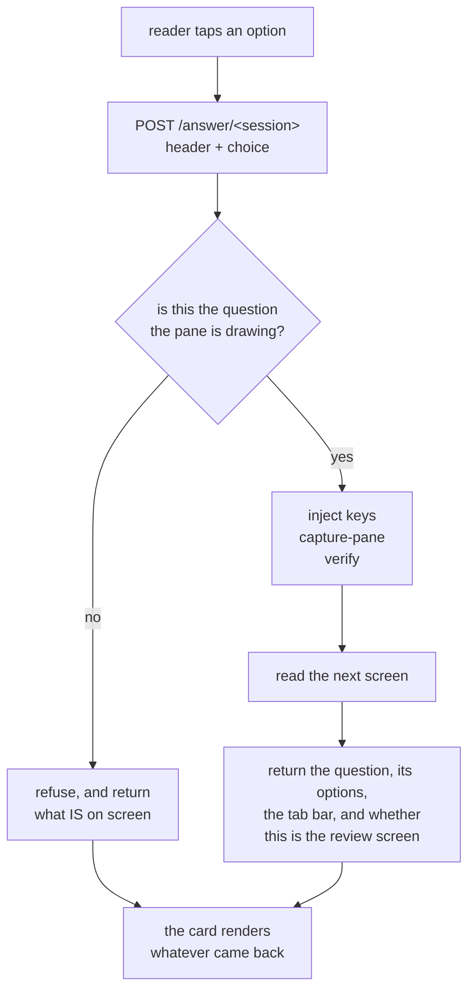

# Text mode answers the dialog, one choice at a time

**Status:** design, agreed 2026-09-10 through `/grill-with-docs`. Not yet built.
**Reported by:** Viktor. **Author:** Claude (measurement + design).
**Scope:** `frontend-v2/`, `session-events/`, `sessionio/`, `docs/adr/0010`.

## The report

> Sometimes when answering the user question 2, I get the error that the terminal
> moved while I was answering them. The only way to unblock myself is to continue
> in the terminal. Let's fix this! I want the text mode to be able to fully handle
> these prompts.

Seen on both phone and desktop, and the screen involved is the review screen at
the end of a multi-question call.

```stats
63 ms | for the review screen to draw — the client's first look is at 90 ms
2 of 5 | AskUserQuestion records not written until the question was ANSWERED
22.4% | of 1,045 calls the one-at-a-time card rescued from a Terminal hand-off
1 | stale marker found live: we say "Other", the CLI draws "Type something."
```

## What we ruled out first

Three explanations fit the symptom and none of them survived measurement. They
are recorded here so the next reader does not repeat them.

| suspected | measured 2026-09-10, CLI 2.1.267 | verdict |
|---|---|---|
| `REVIEW_MARKER` wording drifted | live review screen carries both "Review your answers" and "Ready to submit your answers?" | wording is correct |
| review title scrolled out of `capture-pane` | title disappears only at ≤ 10 rows; no pane on this box is under 23 | not reachable here |
| the check times out before the screen draws | q2 digit → review screen visible in 63 ms, against a first look at 90 ms | comfortable margin |
| the pane read is cached and returns a stale screen | `GET /pane` runs a fresh `capture-pane -p` per request (`sessionio/ready.go:38`) | fresh every time |

## What appears to break

This is a reading of the code and the measurements, not a reproduction. It
explains every part of the report — the "sometimes", question 2, the review
screen, and both devices — so it is the working hypothesis, and the design below
removes the whole class rather than this instance.

The card takes its **questions** from the transcript and its **position** from
the pane. Those two sources can disagree, and when they do the card plans from
question 1 into a dialog that has moved past it.



Three things line up to make it possible:

1. **The record can be late.** Claude Code writes the `AskUserQuestion` record
   when it gets round to it; measured on 2026-08-28 over five consecutive calls,
   two were not written until the question had been answered, one of them 112
   seconds later (`TextView.tsx:245`). Through that window the pane is the only
   source, and the pane draws one question.
2. **The handover changes the card's identity.** `asking()` keys on the content
   of every question in the call, so a one-question pane reading and a
   two-question transcript reading produce different keys, and
   `<Show … keyed>` rebuilds the card (`TextView.tsx:566`). Content-keying does
   carry a half-finished walk through the handover, which is the case the comment
   there describes; a multi-question call is the case where the two readings
   produce different keys.
3. **The whole-walk card does not read the position it is handed.** `count` and
   `answered` come from the pane and are passed in, but only the partial branch
   reads them (`QuestionCard.tsx:112`). `planAnswer` always plans from question
   one.

The error message is the visible part. The consequence underneath it is that the
walk can put question 1's choice into question 2 and then press Submit, so an
answer nobody picked can be committed.

## The design

**Every choice is a request.** The reader picks an option, that goes to the
server, the server answers the question the pane is drawing and returns whatever
the pane draws next. There is no plan computed ahead of time, no local
multi-question form, and no index to misalign.



### Where the walk runs

In Go, in `session-events`, next to the parser that already reads these screens.
Today each step is a POST plus up to two GETs from the browser, and the browser
cannot see the pane it is racing. In Go the keystroke, the capture and the check
are one local sequence at millisecond latency, and there is only one process
reading the dialog, so no two sources can disagree.

`answer.logic.ts` (394 lines) and its three test files port across and are
deleted from the frontend. The fixtures under `sessionio/testdata/` become the
shared contract for both the parser and the driver.

### What decides which question is on screen

**The question text the pane is drawing**, matched against the call's question
list. Not the tab-bar count.

Measured 2026-09-10: for a multi-select question the tab bar flips to `☒` on the
**first Space**, before the question has been left. `←  ☐ Picks  ☐ Drink` became
`←  ☒ Picks  ☐ Drink` with a single toggle sent and no Enter. So `answered` runs
one ahead for multi-select and cannot be a position index. The tab bar still
supplies the count and the headers, which it reports reliably.

### Going back

The tab bar becomes tappable chips in the card. Tapping an answered chip sends
`←` until that question is on screen; the pane then shows the pick itself —
measured, the chosen row renders as `2. Pear ✔` — and choosing again replaces it.
Revision costs no state on our side, because the CLI is already holding it.

There is no local draft to revise, so a choice commits when you make it. The
CLI's own review screen at the end is still the place to see everything before
submitting, and `←` from there still works.

### A screen we cannot read

Show the captured pane as monospaced text, and make the lines that look like
option rows tappable, each sending its digit, with `⏎` and `⎋` beneath.

Detecting rows is a guess, made on screens we could not otherwise parse, and a
CLI restyle can make it wrong. That trade-off was weighed against a plain key row
of `↑ ↓ ← → ⏎ ⎋` and this was the choice, agreed 2026-09-10. When no rows are
detected the card shows the pane and no controls; that case has no answer path
and is the one place a reader would still reach for the Terminal.

The "Open Terminal" button stays on the card. What goes away is the card ever
telling you to use it, and Send ever latching disabled.

### Noticing when the CLI moves under us

When the parser meets a dialog screen it cannot fully read, record **which known
markers were present and which were missing** — the `☒`/`☐` glyphs, both review
wordings, the free-text option label, the numbered list. Structure only, never
the text on screen, which keeps it inside ADR-0008's content-free rule. A marker
missing across several sessions is drift.

This rides on dialogs that are happening anyway, so it costs nothing. A synthetic
nightly test was considered and declined: making the CLI draw an
`AskUserQuestion` requires a real model call, and that is recurring spend.

One marker is **already stale**, found while measuring this: `OTHER_LABEL` is
`"Other"` (`answer.logic.ts:71`) and CLI 2.1.267 draws `3. Type something.`. It
has caused no harm because the digit position is unchanged, so the injected key
is still right and only the card's own label is wrong. It is a good illustration
of what the fingerprint is for.

## What changes, by file

| file | change |
|---|---|
| `session-events/main.go` | new `POST /answer/{session}`: one choice in, the next screen out |
| `sessionio/dialog.go` | position by drawn question text; marker fingerprint on a partial read |
| `sessionio/answer.go` (new) | the driver: inject, capture, verify, read the next screen |
| `frontend-v2/src/components/answer.logic.ts` | deleted, ported to Go |
| `frontend-v2/test/answer.{logic,options,panewalk}.test.ts` | deleted, ported to Go |
| `frontend-v2/src/components/QuestionCard.tsx` | one question at a time, tappable tab-bar chips, raw-pane mode |
| `frontend-v2/src/components/TextView.tsx` | drops `planAnswer`/`runAnswer`/`waitForNextReading`/`stoppedOn` |
| `docs/adr/0010-…md` | amended in place |

## ADR-0010

Amended in place rather than superseded. Its decision — key injection over a hook
broker — is unchanged and is still the expensive part to reverse. Two of its
stated consequences change:

- the browser no longer mirrors and drives the prompt; `session-events` drives it
  and the browser renders what comes back;
- "treat a failure to parse as an unknown prompt: show the honest fallback to the
  terminal" becomes: show the screen itself, with what can be pressed on it.

"Whoever answers first wins" is unchanged, and a walk that finds the pane
somewhere it did not expect still stops rather than typing on. What changes is
that stopping is now cheap: the next request re-reads and the card re-renders
against whatever is actually there.

## Deliberately not doing

- **A synthetic nightly contract test.** It needs a real model call. Declined on
  cost; the fingerprint covers it from real traffic instead.
- **A key row beneath the tappable rows.** Considered as the floor for a screen
  with no detectable rows; not taken.
- **A server read-sweep** to fill in picks for questions not on screen. It was
  agreed under an earlier shape of this design and dropped when the card became
  one question at a time — navigating to a question already reveals its `✔`.
- **A lock during a walk.** It cannot stop a human typing into the pty, so it
  would not actually serialise access to the dialog.

## Open questions

- **No field telemetry backs the frequency claims.** `text.answer_failed` carries
  `tl.reason`, `tl.step`, `tl.questions` and `tl.source`, which would say how
  often this fires and on which shape of call. Two agents dispatched to query it
  returned nothing, so the numbers here are all first-hand measurement on this
  box. Worth pulling before or during the build, mostly to confirm the failures
  cluster on `tl.source: "transcript"` with `tl.questions ≥ 2`.
- **The mechanism is a reading, not a reproduction.** Reproducing it needs the
  transcript record to land mid-walk, which is timing we do not control. The
  cheapest confirmation is the telemetry above; the design does not depend on it,
  since one-request-per-choice removes both the stale plan and the two-source
  disagreement regardless of which one fires.
- **Per-choice latency on a phone.** Server-side work measured at 63–154 ms; a
  cellular round trip adds perhaps 200–400 ms on top. That should feel fine with
  a spinner on the tapped row, but it is unmeasured on a real phone.
