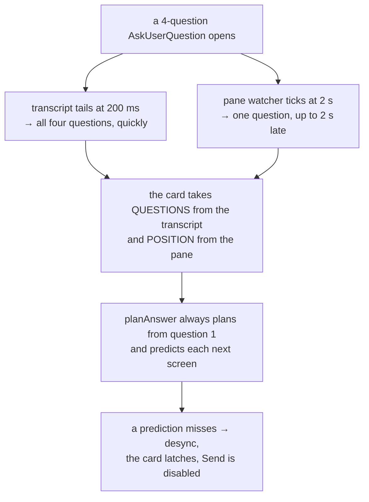
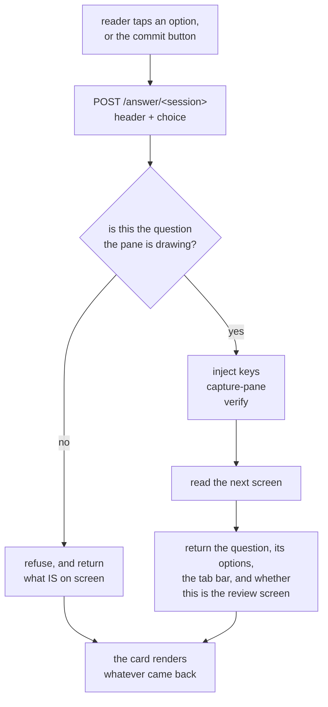
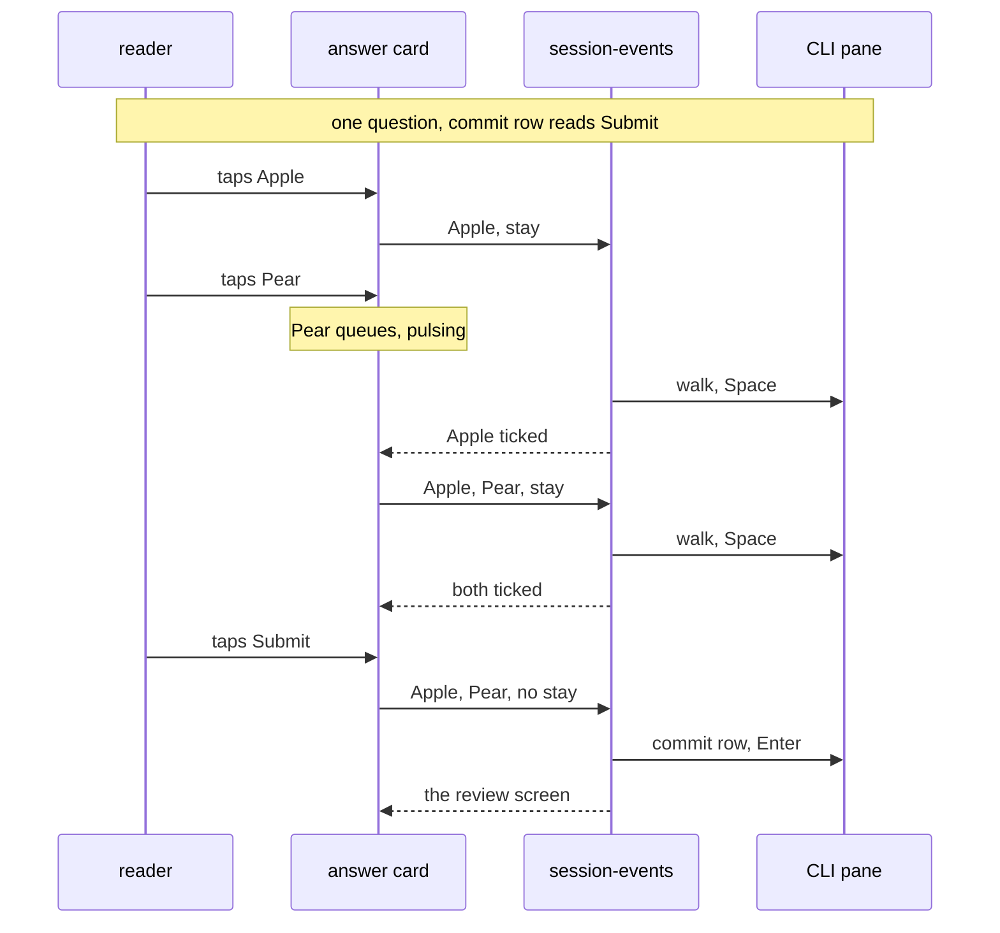

# Text mode answers the dialog, one choice at a time

**Status:** shipped 2026-09-11 and verified against the deployed service, v0.50.4.
See "What production found" below. Designed 2026-09-10 through `/grill-with-docs`.
**Amended 2026-09-23:** a multi-select tap now toggles one row, and a commit
button leaves the question. See "Amended 2026-09-23" below.
**Reported by:** Viktor. **Author:** Claude (measurement + design).
**Scope:** `frontend-v2/`, `session-events/`, `sessionio/`, `docs/adr/0010`.

## The report

> Sometimes when answering the user question 2, I get the error that the terminal
> moved while I was answering them. The only way to unblock myself is to continue
> in the terminal. Let's fix this! I want the text mode to be able to fully handle
> these prompts.

Seen on both phone and desktop. Of the six recorded failures one is the review
screen; the other five stop earlier, which the field data below sets out.

```stats
4 of 5 | four-question answers from the text view FAILED, in 10 days of field data
6 of 6 | of those failures are `desync` — never `refused`, never `unreadable`
2 | of them happened during the session that produced this document
1 | stale marker found live: we say "Other", the CLI draws "Type something."
```

## What the field data says

`text.answer_failed` and `text.answer_sent` land in Loki as
`{job="devvm-journal", unit="tmux-api.service"}` under the `TLEVENT` marker. The
emit shipped in `da5cd67` on 2026-08-30; a 14-day query reaches back before that
and finds nothing older, so this is the complete population.

Window 2026-09-01 07:25 to 2026-09-10 19:37 UTC, 15 events, one user.

| call shape | sent | failed | fail rate |
|---|---|---|---|
| 1 question | 8 | 2 | 20% |
| 4 questions | 1 | 4 | 80% |

All six failures are `desync`. Zero `refused` and zero `unreadable`, so the keys
were always accepted and the pane was always readable. What fails is the
expected-text match, every time.

| ts (UTC) | source | questions | step | `expect_len` | pane reads |
|---|---|---|---|---|---|
| 2026-09-10 19:37:05 | transcript | 4 | 1/5 | 182 | 2 |
| 2026-09-10 19:30:45 | transcript | 4 | 1/5 | 321 | 2 |
| 2026-09-10 00:00:55 | transcript | 4 | 4/5 | 19 | 5 |
| 2026-09-04 17:32:57 | pane | 1 | 1/1 | 8 | 2 |
| 2026-09-04 17:30:42 | pane | 1 | 1/1 | 8 | 2 |
| 2026-09-04 15:25:09 | transcript | 4 | 1/5 | 68 | 2 |

`expect_len` says which check gave up. 19 is `"Review your answers"`. 8 is a
tab-bar `☒ <header>`. 182, 321 and 68 are the length of the *next question's
text*, which is what a whole-walk step looks for.

The top two rows are the grilling session that produced this document: Viktor
answering rounds 2 and 3 in the text view, on the current build, from a browser.
Four questions each, and both stopped at the first check.

## What breaks

Four of the six failures stop at **step 1**: the digit for question 1 went in,
and the pane did not show question 2's text within the two reads the client
allows. One stops at the review marker, two on the pane path's tab-bar check.

The single thing common to all six: **the plan predicts what the next screen
will say, and then does not find it.** That prediction is the whole-walk
design — `planAnswer` sets each step's expectation to the *following* question's
text, and the last step's to `"Review your answers"` (`answer.logic.ts:161-167`).

What I could not isolate is why the prediction misses. Four candidates survive
measurement, and the design removes all four, so I stopped short of picking one:

| candidate | evidence for | evidence against |
|---|---|---|
| the CLI truncates a long question, so the text is not on screen | three failures carry `expect_len` of 182–321 | tested 2026-09-10 with a 218-character question: the shipped `landed()` matched at 111 ms, on the first read |
| the screen has not drawn yet at 90 ms and 310 ms | both reads are always consumed | measured 63–154 ms for both transitions on an idle box |
| the keys did not advance the dialog | `desync` rather than `refused` only proves the POST succeeded, not that the TUI acted | `runAnswer` sends batches back to back with no delay (`answer.logic.ts:328`), while the Go picker for the same class of TUI sleeps `keySettle = 120 ms` between keystrokes (`sessionio/setmodel.go:24`) |
| the pane had already moved past question 1 when Send was pressed | `fromPane()` lags up to 2 s (`PaneWatchInterval`, `registry.go:238`) while the transcript tails at 200 ms (`main.go:32`), so the card's two sources are 10× apart in freshness | not directly observed |

Two defects turned up while chasing this that are worth fixing regardless:

1. **`landed()` searches the whole captured pane**, conversation scrollback
   included, not just the dialog region (`answer.logic.ts:375`). A step can pass
   on text that was already on screen before anything was typed.
2. **No settle time between key batches.** The codebase already knows this TUI
   needs 120 ms between keystrokes on the model-picker path and allows none on
   the answer path.

### How the two sources disagree

Independent of which candidate above fires, the card holds two readings that can
contradict each other, and this is what the design removes.



Three specifics behind that:

1. **The record can be late.** Claude Code writes the `AskUserQuestion` record
   when it gets round to it; measured on 2026-08-28 over five consecutive calls,
   two were not written until the question had been answered, one of them 112
   seconds later (`TextView.tsx:245`). Through that window the pane is the only
   source, and the pane draws one question.
2. **The handover changes the card's identity.** `asking()` keys on the content
   of every question in the call, so a one-question pane reading and a
   four-question transcript reading produce different keys, and
   `<Show … keyed>` rebuilds the card (`TextView.tsx:566`). Content-keying does
   carry a half-finished walk through the handover, which is the case the comment
   there describes; a multi-question call is the case where the two readings
   produce different keys.
3. **The whole-walk card does not read the position it is handed.** `count` and
   `answered` come from the pane and are passed in, but only the partial branch
   reads them (`QuestionCard.tsx:112`). `planAnswer` always plans from question
   one.

The error message is the visible part. The consequence underneath it is that the
walk can put question 1's choice into question 2 and then press Submit, so an
answer nobody picked can be committed.

## The design

**Every choice is a request.** The reader picks an option, that goes to the
server, the server answers the question the pane is drawing and returns whatever
the pane draws next. There is no plan computed ahead of time, no local
multi-question form, and no index to misalign. On a multi-select question each
choice is one toggle, and the card's commit button is the request that leaves
the question (amended 2026-09-23, below).



### Where the walk runs

In Go, in `session-events`, next to the parser that already reads these screens.
Today each step is a POST plus up to two GETs from the browser, and the browser
cannot see the pane it is racing. In Go the keystroke, the capture and the check
are one local sequence at millisecond latency, and there is only one process
reading the dialog, so no two sources can disagree.

`answer.logic.ts` (394 lines) and its three test files port across and are
deleted from the frontend. The fixtures under `sessionio/testdata/` become the
shared contract for both the parser and the driver.

### What decides which question is on screen

**The question text the pane is drawing**, matched against the call's question
list. Not the tab-bar count.

Measured 2026-09-10: for a multi-select question the tab bar flips to `☒` on the
**first Space**, before the question has been left. `←  ☐ Picks  ☐ Drink` became
`←  ☒ Picks  ☐ Drink` with a single toggle sent and no Enter. So `answered` runs
one ahead for multi-select and cannot be a position index. A re-measurement on
2.1.280 (2026-09-23) found that the box also empties again once every tick is
removed, so the tally can fall as well. The tab bar still supplies the count
and the headers, which it reports reliably.

### Going back

The tab bar becomes tappable chips in the card. Tapping an answered chip sends
`←` until that question is on screen; the pane then shows the pick itself —
measured, the chosen row renders as `2. Pear ✔`. Revision costs no state on our
side, because the CLI is already holding it.

What a second pick does depends on the question. Single-select replaces, which
is what the widget does. Multi-select **adds**: its rows are toggles, so the
request carries the desired final set and the server changes only the rows whose
state differs. Sending one label there would have unticked the first pick, which
is what the first build did until it was measured on 2026-09-11.

There is no local draft to revise. A single-select choice commits when you make
it. A multi-select tap did too until 2026-09-23, when ticking and leaving became
separate requests (see "Amended 2026-09-23" below). The CLI's own review screen
at the end is still the place to see everything before submitting, and `←` from
there still works.

### A screen we cannot read

Show the captured pane as monospaced text, and make the lines that look like
option rows tappable, each sending its digit, with `⏎` and `⎋` beneath.

Detecting rows is a guess, made on screens we could not otherwise parse, and a
CLI restyle can make it wrong. That trade-off was weighed against a plain key row
of `↑ ↓ ← → ⏎ ⎋` and this was the choice, agreed 2026-09-10. When no rows are
detected the card shows the pane and no controls; that case has no answer path
and is the one place a reader would still reach for the Terminal.

The "Open Terminal" button stays on the card. What goes away is the card ever
telling you to use it, and Send ever latching disabled.

### Noticing when the CLI moves under us

When the parser meets a dialog screen it cannot fully read, record **which known
markers were present and which were missing** — the `☒`/`☐` glyphs, both review
wordings, the free-text option label, the numbered list. Structure only, never
the text on screen, which keeps it inside ADR-0008's content-free rule. A marker
missing across several sessions is drift.

This rides on dialogs that are happening anyway, so it costs nothing. A synthetic
nightly test was considered and declined: making the CLI draw an
`AskUserQuestion` requires a real model call, and that is recurring spend.

One marker is **already stale**, found while measuring this: `OTHER_LABEL` is
`"Other"` (`answer.logic.ts:71`) and CLI 2.1.267 draws `3. Type something.`. It
has caused no harm because the digit position is unchanged, so the injected key
is still right and only the card's own label is wrong. It is a good illustration
of what the fingerprint is for.

## What changes, by file

| file | change |
|---|---|
| `session-events/main.go` | new `POST /answer/{session}`: one choice in, the next screen out |
| `sessionio/dialog.go` | position by drawn question text; marker fingerprint on a partial read |
| `sessionio/answer.go` (new) | the driver: inject, capture, verify, read the next screen |
| `frontend-v2/src/components/answer.logic.ts` | deleted, ported to Go |
| `frontend-v2/test/answer.{logic,options,panewalk}.test.ts` | deleted, ported to Go |
| `frontend-v2/src/components/QuestionCard.tsx` | one question at a time, tappable tab-bar chips, raw-pane mode |
| `frontend-v2/src/components/TextView.tsx` | drops `planAnswer`/`runAnswer`/`waitForNextReading`/`stoppedOn` |
| `docs/adr/0010-…md` | amended in place |

## ADR-0010

Amended in place rather than superseded. Its decision — key injection over a hook
broker — is unchanged and is still the expensive part to reverse. Two of its
stated consequences change:

- the browser no longer mirrors and drives the prompt; `session-events` drives it
  and the browser renders what comes back;
- "treat a failure to parse as an unknown prompt: show the honest fallback to the
  terminal" becomes: show the screen itself, with what can be pressed on it.

"Whoever answers first wins" is unchanged, and a walk that finds the pane
somewhere it did not expect still stops rather than typing on. What changes is
that stopping is now cheap: the next request re-reads and the card re-renders
against whatever is actually there.

## Deliberately not doing

- **A synthetic nightly contract test.** It needs a real model call. Declined on
  cost; the fingerprint covers it from real traffic instead.
- **A key row beneath the tappable rows.** Considered as the floor for a screen
  with no detectable rows; not taken.
- **A server read-sweep** to fill in picks for questions not on screen. It was
  agreed under an earlier shape of this design and dropped when the card became
  one question at a time — navigating to a question already reveals its `✔`.
- **A lock during a walk.** It cannot stop a human typing into the pty, so it
  would not actually serialise access to the dialog.

## What production found

The design shipped green: 5,040 frontend tests, three Go suites, every build.
Then driving one real four-question dialog against the deployed service found
four defects in a row, none of which any test could see. They are recorded here
because the pattern is the lesson, not the individual bugs.

```stats
4 | defects found by driving the real CLI, after every suite was green
0 | of them reproducible against the stand-in TUI the unit tests drive
5 | versions shipped in one afternoon, 0.50.0 through 0.50.4
```

| version | what was wrong | how it showed |
|---|---|---|
| 0.50.1 | two toggles packed into one `send-keys` run lose all but the first | asked for two toppings, got one |
| 0.50.2 | a `Space` behind two navigation keys is eaten by the repaint; one navigation key survives, so the shape of the option list decided whether an answer landed | same symptom, narrower |
| 0.50.3 | `Enter` on a multi-select row **toggles it back off**. The widget's footer says `Enter to select`, and the commit is an unnumbered `Next` row below the free-text option (`Submit` on the last question, measured on 2.1.280) | filming the pane: the pick appeared at 418 ms and vanished at 549 ms |
| 0.50.4 | the review screen carries **no footer**, and the reader refused to parse anything footerless, so the last answer of every multi-question call reported `done` while the session sat waiting on Submit | the card would have gone quiet on a blocked session |

**Why the tests could not catch any of them.** The Go tests drive a stand-in TUI
that reads its input as a stream and records every keystroke it sees. A real
widget that drops a key during a repaint, or treats `Enter` as a toggle, reads
to that stand-in as a widget that accepted everything. The fixtures had the same
blind spot from the other side: `dialog-multi.txt` has carried the `Next` line
all along, parsed as a description of option 4.

The instrument that worked was filming the pane during a live request, printing
the option rows every few milliseconds against the elapsed clock. Two of the
four were only legible that way.

**What the verification run proved.** Four questions answered by tapping in the
deployed text view at 414px, including a multi-select built up to two picks
across a tap on an answered chip to go back, then Submit. Claude received
`Fruit → Pear`, `Picks → Nuts, Cream`, `Drink → Coffee`, `Size → Large`. No
Terminal hand-off at any point. The second pick needed that walk back because
every multi-select tap committed its question at the time; the 2026-09-23
amendment below removes the walk.

## Amended 2026-09-23: a multi-select tap toggles, a button commits

> multi answer questions now move on to the next step on the first selection and
> the user can't select more than one answer.

Viktor, 2026-09-23, in a desktop browser. The fix below was decided with him
through `/grill-me` the same day.

**What was happening.** The design applied one rule to both kinds of question: a
choice commits when you make it. That fits a single-select question, where one
choice is the whole answer. On a multi-select question every tap sent the
desired set and the server then walked to the commit row and pressed `Enter`
(`planChoice` in `sessionio/answerplan.go`), so the first tap left the question,
and on a one-question call the next screen was the review screen. The card's
hint said to come back for another pick, and the verification run above did
build a two-pick answer that way, but every extra pick cost a walk back.

### What CLI 2.1.280 does, measured 2026-09-23

A scratch Claude Code session in tmux, driven one `send-keys` run per key with a
settle after each and captured after every step, with the tool results read back
from the session's transcript. Five runs: one multi-select question (`Fruit`:
Apple, Pear, Plum), the same question committed with nothing ticked, two
multi-select questions (`Fruit`, then `Toppings`), ticks removed one by one, and
the free-text row on its own. A second probe the same day sent the keys the
server sends, a bracketed paste and runs of `Backspace`, and moved the cursor
back up from the free-text row.

| behaviour | what the CLI did |
|---|---|
| leaving a multi-select question | an unnumbered row directly under the free-text row, where `Enter` commits. It reads `Next` on every question but the last and `Submit` on the last, so a one-question call's only question shows `Submit` |
| `Enter` on a numbered row | toggles that row and stays on the question |
| after `Submit` | the review screen, which a one-question multi-select call shows too. It still has no footer, as 0.50.4 found |
| committing with nothing ticked | allowed. The question stays unanswered, the review screen warns `⚠ You have not answered all questions`, and the tool result reads `The user did not answer the questions.` |
| the free-text row | an inline field. Typing goes straight in and ticks it, and the row then reads `[✔] Mango` in place of `Type something`. A bracketed paste lands the same way, spaces kept. `Space` types a literal space and ticks it, and `Enter` toggles the box and keeps the text. `Backspace` down to empty unticks it; three in one run are all taken, and one on the empty field does nothing. Committed beside two ticked options, Claude received `Apple, Pear, Mango` |
| `Enter` on the empty free-text row | ticks `[✔] Type something`, and the row is dropped at commit: Claude received `Apple` alone |
| the tab bar's box | fills on the first tick and returns to `☐` once every box is unticked |
| the footer | `↑/↓ to navigate` with one question and `Tab/Arrow keys to navigate` with two or more. `ctrl+g to edit in Vim` joins it while the cursor is on the free-text row or the commit row, and goes again when the cursor moves back up to an option |

The key-delivery findings of 0.50.1 and 0.50.2 still govern every walk: each
cursor walk and each `Space` gets its own `send-keys` run with `keySettle`
between, which is how `planChoice` already batches and why the probe sent one
key per run.

### What changes

1. **A tap toggles one row.** It is one request carrying the set the question
   should hold, with `stay`. The server applies it without leaving the question,
   and the card draws the ticks from the reading that comes back, so a tick
   appears only once the pane shows it. The card still holds no model of the
   dialog.
2. **Taps wait their turn.** A tap made while a request is in flight waits for
   that request's reply, then goes out computed against the reply's reading.
   Its row pulses with the existing `tl-pulse` animation until then, and no tap
   is lost.
3. **A commit button leaves the question.** It sits at the right end of the
   card's bottom actions row, where the review screen's Submit sits, and carries
   the pane's own commit-row label, `Next` or `Submit`. It is disabled while
   nothing is ticked, while a tap is queued, and while a request is in flight.
   Tapping the last ticked row unticks it like any checkbox. The old rule that
   the last pick re-confirmed itself is gone, because a tap no longer has to
   leave the question.
4. **Free text is one more pick.** Tapping the free-text row opens the card's
   field. Its Add action types the text into the CLI's inline row, which ticks
   it, reads it back, and presses no `Enter`. The pick shows as a ticked row and
   the commit button sends it with the others. Clearing the field removes the
   pick.
5. **An answer counts once.** Every request keeps its one `text.answer_sent` or
   `text.answer_failed`, with a new attribute `tl.action` = `choose`, `toggle`,
   `commit`, `back`, `submit` or `keys`. `claude.answered` is not emitted for a
   toggle, so one multi-select answer counts once, at its commit. Back, submit
   and raw keys count as before.
6. **Single-select is unchanged.** One tap answers, through the digit.

The live check runs in desktop Chromium, where Viktor met the bug.



### The wire additions

`frontend-v2/src/lib/answer-api.ts` mirrors `sessionio/answerapi.go`, and both
carry exactly this. Single-select requests are unchanged.

| field | on | meaning |
|---|---|---|
| `stay` | request | Multi-select only. Apply the desired set to the question on screen and do not leave it: no walk to the commit row, no `Enter`. Applied when a fresh reading shows every box as requested, the free-text row included, and `unverified` otherwise; the reply always carries the reading. An empty set is valid and unticks everything. On a single-select question it is refused as `unknown-option` with nothing typed |
| `choices` naming `Type something` | request | The desired set covers the free-text row: `choices` may name it beside option labels, and `text` is then that row's content, which may not be empty. When `choices` leaves it out and the row holds text, the server clears the row with `Backspace`, never `Space` |
| no `stay` | request | The commit: the same multi-select request, carrying the set the card displays. The server applies the diff (normally empty), verifies it, walks to the commit row and presses `Enter` in a batch of its own, then verifies the move as before: the review screen, another question, or the dialog gone. An empty set is refused as `unknown-option` with nothing typed |
| `commit` | reading | The label of the commit row under a multi-select's free-text row, `Next` or `Submit`, and empty when none is drawn |
| `typed` | reading | The text in a multi-select's free-text row, and empty while it reads `Type something` |
| `typedChecked` | reading | That row's box |

The free-text row stays out of `options`, as `Type something` always has, and is
found by position: the last numbered row before the separator above
`Chat about this`, which on a multi-select sits directly above the commit row.
Position is the only reliable handle, because typing replaces the label. The
commit row is never again read as an option's description, which is how the
`Next` line in `dialog-multi.txt` had been parsed, as "Why the tests could not
catch any of them" above notes.

Two constraints shape how the server does this:

- **Clearing the free-text row leaves the keys allowlist alone.** `answerKeys`
  in `sessionio/tmux.go` carries no `BSpace`, and it is the whole security
  boundary of the public `POST /keys` route. The server clears the row through
  the internal raw-keys path the model picker already uses (`rawKeys` in
  `sessionio/setmodel.go`), bounded by the characters the reading shows in the
  row plus a small margin, and only while the pane draws that row with the
  cursor on it.
- **A toggle is verified by its boxes.** `answerMoved` in
  `sessionio/answerdrive.go` looks for three signals that a question was left,
  and a toggle that adds a second pick changes none of them, so it would come
  back `unverified`. A `stay` request is checked against the fresh reading's
  boxes and free-text row instead.

**The empty commit.** The CLI accepts a commit with nothing ticked, and the card
and the server do not. The button is disabled in that state and the server
refuses an empty commit, so a stray press cannot send Claude "The user did not
answer the questions." A reader who means to skip the question can still do it
in the Terminal.

**The button's label before the first reply.** The watcher's reading is
withdrawn once the call's record lands, and the transcript records no commit
row, so a fresh question is usually drawn without one. Until the first reply
brings a reading, the card takes the label from the call's shape instead:
`Submit` on the call's last question and `Next` on the others, which is what
the CLI draws.

## Open questions

- **Which of the four candidates fired was never isolated, and no longer can
  be.** The telemetry pinned *where* the old walk stopped and ruled out refused
  keys and an unreadable pane, but not why a prediction missed. The code that
  predicted is deleted, so the question is now closed rather than answered. What
  the shipping work did establish is that the real widget drops keystrokes under
  conditions the old plan never accounted for, which is consistent with at least
  two of those candidates.
- **n is small.** 15 events, one user, 10 days. The 80% figure for four-question
  calls rests on 5 attempts, of which 1 succeeded.
- **The event carries no session name**, only `user.id` and `tl.device`, so a
  failure cannot be tied back to the transcript it came from. Adding the session
  to the event would make the next investigation much shorter. Addressed on
  2026-09-11: the events now come from `session-events`, which adds
  `tl.session` to each.
- **Per-choice latency on a phone.** Server-side work measured at 63–154 ms; a
  cellular round trip adds perhaps 200–400 ms on top. That should feel fine with
  a spinner on the tapped row, but it is unmeasured on a real phone. Since
  2026-09-23 a multi-select answer is one request per tick plus the commit, sent
  one after another through the queue, so it matters most there.
- **Bracketed paste into the multi-select inline field, through the deployed
  route.** The first probe typed with `tmux send-keys -l`, and the server's
  `AnswerText` uses bracketed paste. The second probe sent that paste the way
  `AnswerText` does (`set-buffer`, then `paste-buffer -p`) on a private tmux
  socket, and `Kiwi fruit` landed in the field and ticked it. It has not yet
  gone through the deployed service, so the live check still has to show the
  text ticked in the row after an Add, with no `Enter` pressed.
- **Words left in the field when the commit button is pressed.** The decisions
  above cover words that went in through Add. For a reader who types into the
  field and presses the commit button without Add, the card commits the words
  with the ticked rows rather than dropping them, and it enables the button on
  those words alone. That keeps what the reader can see on screen, and in that
  one case it departs from "disabled while nothing is ticked". Keeping to the
  letter of that decision is a one-line change in `commitSet`
  (`QuestionCard.tsx`).
- **A tap racing a keystroke in the Terminal.** A tap is computed against the
  last reading the card holds and applied as a desired final state, so a box
  toggled in the Terminal between that reading and the request is set back to
  what the card last saw. This follows from the contract rather than from
  anything observed, and the 2026-09-11 design had the same window.
