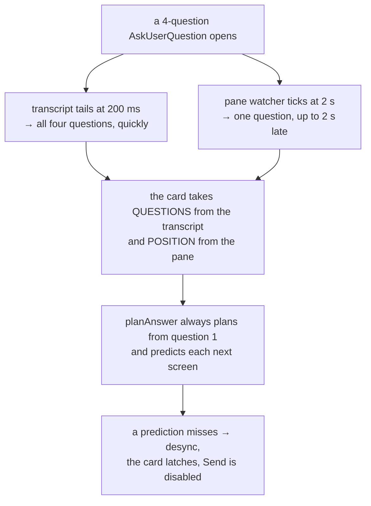
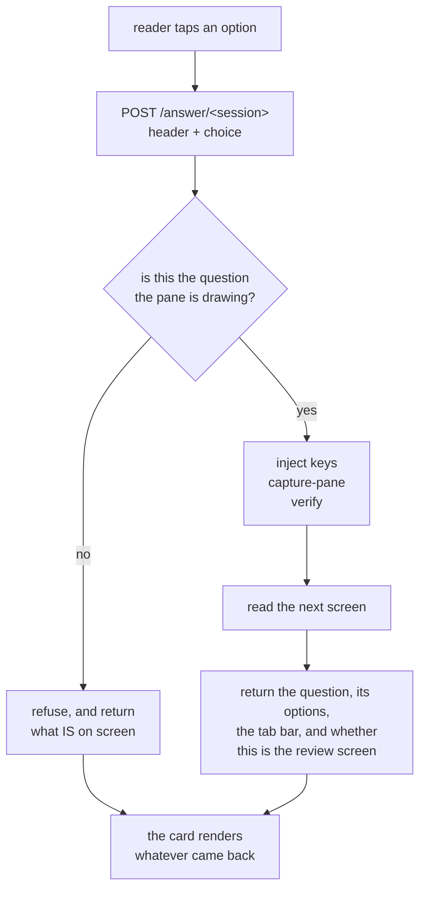

# Text mode answers the dialog, one choice at a time

**Status:** design, agreed 2026-09-10 through `/grill-with-docs`. Not yet built.
**Reported by:** Viktor. **Author:** Claude (measurement + design).
**Scope:** `frontend-v2/`, `session-events/`, `sessionio/`, `docs/adr/0010`.

## The report

> Sometimes when answering the user question 2, I get the error that the terminal
> moved while I was answering them. The only way to unblock myself is to continue
> in the terminal. Let's fix this! I want the text mode to be able to fully handle
> these prompts.

Seen on both phone and desktop. Of the six recorded failures one is the review
screen; the other five stop earlier, which the field data below sets out.

```stats
4 of 5 | four-question answers from the text view FAILED, in 10 days of field data
6 of 6 | of those failures are `desync` — never `refused`, never `unreadable`
2 | of them happened during the session that produced this document
1 | stale marker found live: we say "Other", the CLI draws "Type something."
```

## What the field data says

`text.answer_failed` and `text.answer_sent` land in Loki as
`{job="devvm-journal", unit="tmux-api.service"}` under the `TLEVENT` marker. The
emit shipped in `da5cd67` on 2026-08-30; a 14-day query reaches back before that
and finds nothing older, so this is the complete population.

Window 2026-09-01 07:25 to 2026-09-10 19:37 UTC, 15 events, one user.

| call shape | sent | failed | fail rate |
|---|---|---|---|
| 1 question | 8 | 2 | 20% |
| 4 questions | 1 | 4 | 80% |

All six failures are `desync`. Zero `refused` and zero `unreadable`, so the keys
were always accepted and the pane was always readable. What fails is the
expected-text match, every time.

| ts (UTC) | source | questions | step | `expect_len` | pane reads |
|---|---|---|---|---|---|
| 2026-09-10 19:37:05 | transcript | 4 | 1/5 | 182 | 2 |
| 2026-09-10 19:30:45 | transcript | 4 | 1/5 | 321 | 2 |
| 2026-09-10 00:00:55 | transcript | 4 | 4/5 | 19 | 5 |
| 2026-09-04 17:32:57 | pane | 1 | 1/1 | 8 | 2 |
| 2026-09-04 17:30:42 | pane | 1 | 1/1 | 8 | 2 |
| 2026-09-04 15:25:09 | transcript | 4 | 1/5 | 68 | 2 |

`expect_len` says which check gave up. 19 is `"Review your answers"`. 8 is a
tab-bar `☒ <header>`. 182, 321 and 68 are the length of the *next question's
text*, which is what a whole-walk step looks for.

The top two rows are the grilling session that produced this document: Viktor
answering rounds 2 and 3 in the text view, on the current build, from a browser.
Four questions each, and both stopped at the first check.

## What breaks

Four of the six failures stop at **step 1**: the digit for question 1 went in,
and the pane did not show question 2's text within the two reads the client
allows. One stops at the review marker, two on the pane path's tab-bar check.

The single thing common to all six: **the plan predicts what the next screen
will say, and then does not find it.** That prediction is the whole-walk
design — `planAnswer` sets each step's expectation to the *following* question's
text, and the last step's to `"Review your answers"` (`answer.logic.ts:161-167`).

What I could not isolate is why the prediction misses. Four candidates survive
measurement, and the design removes all four, so I stopped short of picking one:

| candidate | evidence for | evidence against |
|---|---|---|
| the CLI truncates a long question, so the text is not on screen | three failures carry `expect_len` of 182–321 | tested 2026-09-10 with a 218-character question: the shipped `landed()` matched at 111 ms, on the first read |
| the screen has not drawn yet at 90 ms and 310 ms | both reads are always consumed | measured 63–154 ms for both transitions on an idle box |
| the keys did not advance the dialog | `desync` rather than `refused` only proves the POST succeeded, not that the TUI acted | `runAnswer` sends batches back to back with no delay (`answer.logic.ts:328`), while the Go picker for the same class of TUI sleeps `keySettle = 120 ms` between keystrokes (`sessionio/setmodel.go:24`) |
| the pane had already moved past question 1 when Send was pressed | `fromPane()` lags up to 2 s (`PaneWatchInterval`, `registry.go:238`) while the transcript tails at 200 ms (`main.go:32`), so the card's two sources are 10× apart in freshness | not directly observed |

Two defects turned up while chasing this that are worth fixing regardless:

1. **`landed()` searches the whole captured pane**, conversation scrollback
   included, not just the dialog region (`answer.logic.ts:375`). A step can pass
   on text that was already on screen before anything was typed.
2. **No settle time between key batches.** The codebase already knows this TUI
   needs 120 ms between keystrokes on the model-picker path and allows none on
   the answer path.

### How the two sources disagree

Independent of which candidate above fires, the card holds two readings that can
contradict each other, and this is what the design removes.



Three specifics behind that:

1. **The record can be late.** Claude Code writes the `AskUserQuestion` record
   when it gets round to it; measured on 2026-08-28 over five consecutive calls,
   two were not written until the question had been answered, one of them 112
   seconds later (`TextView.tsx:245`). Through that window the pane is the only
   source, and the pane draws one question.
2. **The handover changes the card's identity.** `asking()` keys on the content
   of every question in the call, so a one-question pane reading and a
   four-question transcript reading produce different keys, and
   `<Show … keyed>` rebuilds the card (`TextView.tsx:566`). Content-keying does
   carry a half-finished walk through the handover, which is the case the comment
   there describes; a multi-question call is the case where the two readings
   produce different keys.
3. **The whole-walk card does not read the position it is handed.** `count` and
   `answered` come from the pane and are passed in, but only the partial branch
   reads them (`QuestionCard.tsx:112`). `planAnswer` always plans from question
   one.

The error message is the visible part. The consequence underneath it is that the
walk can put question 1's choice into question 2 and then press Submit, so an
answer nobody picked can be committed.

## The design

**Every choice is a request.** The reader picks an option, that goes to the
server, the server answers the question the pane is drawing and returns whatever
the pane draws next. There is no plan computed ahead of time, no local
multi-question form, and no index to misalign.



### Where the walk runs

In Go, in `session-events`, next to the parser that already reads these screens.
Today each step is a POST plus up to two GETs from the browser, and the browser
cannot see the pane it is racing. In Go the keystroke, the capture and the check
are one local sequence at millisecond latency, and there is only one process
reading the dialog, so no two sources can disagree.

`answer.logic.ts` (394 lines) and its three test files port across and are
deleted from the frontend. The fixtures under `sessionio/testdata/` become the
shared contract for both the parser and the driver.

### What decides which question is on screen

**The question text the pane is drawing**, matched against the call's question
list. Not the tab-bar count.

Measured 2026-09-10: for a multi-select question the tab bar flips to `☒` on the
**first Space**, before the question has been left. `←  ☐ Picks  ☐ Drink` became
`←  ☒ Picks  ☐ Drink` with a single toggle sent and no Enter. So `answered` runs
one ahead for multi-select and cannot be a position index. The tab bar still
supplies the count and the headers, which it reports reliably.

### Going back

The tab bar becomes tappable chips in the card. Tapping an answered chip sends
`←` until that question is on screen; the pane then shows the pick itself —
measured, the chosen row renders as `2. Pear ✔`. Revision costs no state on our
side, because the CLI is already holding it.

What a second pick does depends on the question. Single-select replaces, which
is what the widget does. Multi-select **adds**: its rows are toggles, so the
request carries the desired final set and the server changes only the rows whose
state differs. Sending one label there would have unticked the first pick, which
is what the first build did until it was measured on 2026-09-11.

There is no local draft to revise, so a choice commits when you make it. The
CLI's own review screen at the end is still the place to see everything before
submitting, and `←` from there still works.

### A screen we cannot read

Show the captured pane as monospaced text, and make the lines that look like
option rows tappable, each sending its digit, with `⏎` and `⎋` beneath.

Detecting rows is a guess, made on screens we could not otherwise parse, and a
CLI restyle can make it wrong. That trade-off was weighed against a plain key row
of `↑ ↓ ← → ⏎ ⎋` and this was the choice, agreed 2026-09-10. When no rows are
detected the card shows the pane and no controls; that case has no answer path
and is the one place a reader would still reach for the Terminal.

The "Open Terminal" button stays on the card. What goes away is the card ever
telling you to use it, and Send ever latching disabled.

### Noticing when the CLI moves under us

When the parser meets a dialog screen it cannot fully read, record **which known
markers were present and which were missing** — the `☒`/`☐` glyphs, both review
wordings, the free-text option label, the numbered list. Structure only, never
the text on screen, which keeps it inside ADR-0008's content-free rule. A marker
missing across several sessions is drift.

This rides on dialogs that are happening anyway, so it costs nothing. A synthetic
nightly test was considered and declined: making the CLI draw an
`AskUserQuestion` requires a real model call, and that is recurring spend.

One marker is **already stale**, found while measuring this: `OTHER_LABEL` is
`"Other"` (`answer.logic.ts:71`) and CLI 2.1.267 draws `3. Type something.`. It
has caused no harm because the digit position is unchanged, so the injected key
is still right and only the card's own label is wrong. It is a good illustration
of what the fingerprint is for.

## What changes, by file

| file | change |
|---|---|
| `session-events/main.go` | new `POST /answer/{session}`: one choice in, the next screen out |
| `sessionio/dialog.go` | position by drawn question text; marker fingerprint on a partial read |
| `sessionio/answer.go` (new) | the driver: inject, capture, verify, read the next screen |
| `frontend-v2/src/components/answer.logic.ts` | deleted, ported to Go |
| `frontend-v2/test/answer.{logic,options,panewalk}.test.ts` | deleted, ported to Go |
| `frontend-v2/src/components/QuestionCard.tsx` | one question at a time, tappable tab-bar chips, raw-pane mode |
| `frontend-v2/src/components/TextView.tsx` | drops `planAnswer`/`runAnswer`/`waitForNextReading`/`stoppedOn` |
| `docs/adr/0010-…md` | amended in place |

## ADR-0010

Amended in place rather than superseded. Its decision — key injection over a hook
broker — is unchanged and is still the expensive part to reverse. Two of its
stated consequences change:

- the browser no longer mirrors and drives the prompt; `session-events` drives it
  and the browser renders what comes back;
- "treat a failure to parse as an unknown prompt: show the honest fallback to the
  terminal" becomes: show the screen itself, with what can be pressed on it.

"Whoever answers first wins" is unchanged, and a walk that finds the pane
somewhere it did not expect still stops rather than typing on. What changes is
that stopping is now cheap: the next request re-reads and the card re-renders
against whatever is actually there.

## Deliberately not doing

- **A synthetic nightly contract test.** It needs a real model call. Declined on
  cost; the fingerprint covers it from real traffic instead.
- **A key row beneath the tappable rows.** Considered as the floor for a screen
  with no detectable rows; not taken.
- **A server read-sweep** to fill in picks for questions not on screen. It was
  agreed under an earlier shape of this design and dropped when the card became
  one question at a time — navigating to a question already reveals its `✔`.
- **A lock during a walk.** It cannot stop a human typing into the pty, so it
  would not actually serialise access to the dialog.

## Open questions

- **Which of the four candidates fires is unresolved.** The telemetry pins
  *where* the walk stops to the step and the expectation length, and rules out
  the keys being refused or the pane being unreadable. It does not say why a
  prediction missed. Isolating it needs the pane captured at the moment of a real
  failure, which no instrument records today. The design does not wait on that:
  one request per choice removes the prediction, so every candidate stops
  applying.
- **n is small.** 15 events, one user, 10 days. The 80% figure for four-question
  calls rests on 5 attempts, of which 1 succeeded.
- **The event carries no session name**, only `user.id` and `tl.device`, so a
  failure cannot be tied back to the transcript it came from. Adding the session
  to the event would make the next investigation much shorter.
- **Per-choice latency on a phone.** Server-side work measured at 63–154 ms; a
  cellular round trip adds perhaps 200–400 ms on top. That should feel fine with
  a spinner on the tapped row, but it is unmeasured on a real phone.
