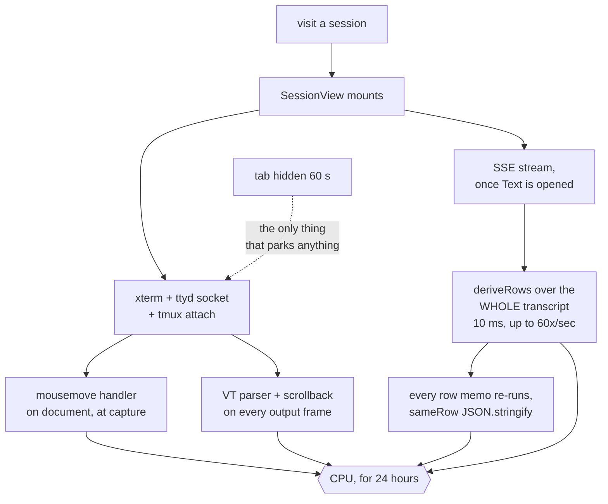
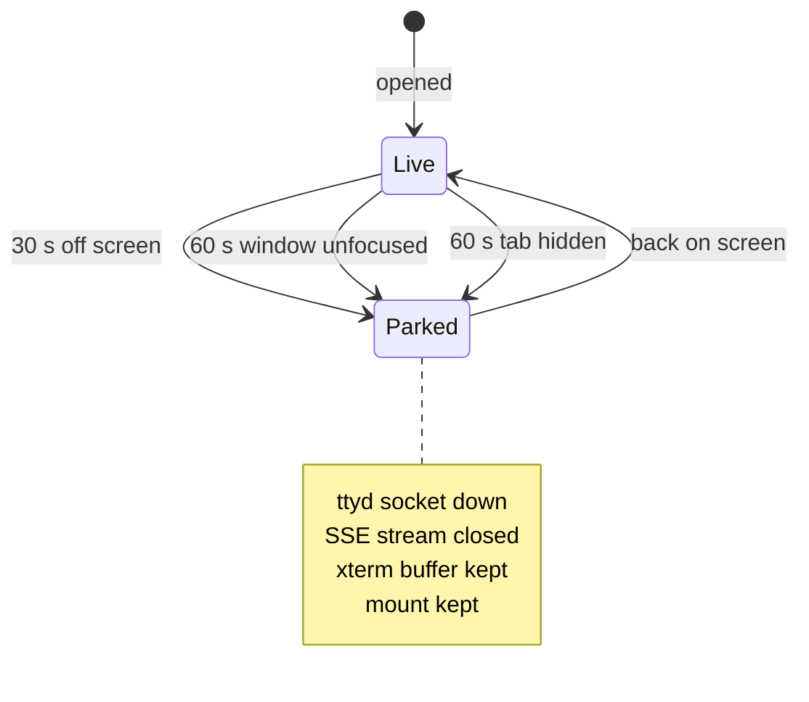

# Park what nobody is reading

Status: approved, not yet implemented. Viktor, 2026-09-11.
Related: [preload a session on hover](2026-09-11-preload-session-on-hover-design.md), which
this plan makes safe to ship.

## The report

Chrome's CPU climbs the longer the lobby tab stays open, and closing the tab
ends it. It does not come back down on its own. Viktor keeps the lobby open all
day, visits many sessions in a sitting, and usually has it backgrounded in one
of several senses: another tab in front, another app focused, minimised, or
sitting on a second monitor.

## What costs what

Two costs, and they multiply.

```stats
10 ms | one deriveRows pass, measured in-repo
24 h | how long a visited session keeps a live socket
22 | sessions on this box today
0 | park while the window is unfocused
```

**Every session you visit keeps a live terminal for 24 hours.**
`store/keepalive.ts` mounts a `SessionView` per visited session and never caps
the list; `KEEP_TTL_MS` is 24 hours and prune drops only what is older than
that or gone from the lobby. `TerminalNative`'s `onMount`
(`components/TerminalNative.tsx:949`) opens an xterm, a ttyd WebSocket and a
tmux attach with no gate on whether the session is on screen, and the default
view is the terminal (`store/viewmode.ts:31`), so this happens for every visit.
Visit fifteen sessions and the tab is running fifteen terminals. A hidden one
does not paint, which is worth saying precisely: xterm pauses its renderer
through an IntersectionObserver (`RenderService.ts:126-151` bails before the
frame), so `display: none` costs zero drawing. What it does cost is the VT
parser, a 10,000-line scrollback, an open WebSocket and an attached tmux client,
for each of the fifteen. Claude Code animates a spinner while a turn runs and
tmux pushes every redraw to every attached client, so a working session is not an
idle one. The frame rate of that spinner has not been measured here.

**Each mounted terminal also listens on `document` for every mouse move.**
`TerminalNative.tsx:2980` registers `mousemove` at capture, permanently, and
`onMotion` has no early exit: it calls `worldAt()`, which runs
`host.querySelector(".xterm-screen")`, `contains()` and `term.hasSelection()`
before anything learns the terminal is hidden. Fifteen terminals means fifteen of
those per mouse move, at roughly 100 moves a second while the pointer is over the
page.

**The battery saver that would stop this only watches the tab.**
`terminal/battery.ts` already knows how to drop a socket losslessly and bring it
back, and `terminal/attach.ts:541` feeds it `document.hidden` for the whole tab.
That flag is false for a window that is visible but unfocused, which covers the
second monitor and every alt-tab. So in the case Viktor is in most of the day,
nothing parks.

**Each open transcript re-derives itself in full on every animation frame.**
`SessionView.tsx:330` is `createMemo(() => deriveRows(store.events))`, and
`store/session.ts:321` records the cost from a previous measurement: 10 ms per
derivation, 2,644 ms when run per event. Events flush on `requestAnimationFrame`,
so a live turn can run that 10 ms sixty times a second. The open is already
windowed (`lib/config.ts:101` sends `rev=1&turns=20`), but nothing sheds the old
end afterwards, so the array grows all day and the 10 ms grows with it.

**And the timeline re-runs every row memo on top of that.**
`MessagesTimeline.tsx:241`'s `keyed` memo has no `equals` and returns a fresh
object, so every mounted row's memo re-runs on every event. Each re-run calls
`sameRow` (`timeline.logic.ts:835`), which recurses into every hidden leaf of a
folded turn and `JSON.stringify`s both sides of any object field, because a fresh
derivation fails reference equality on all of them. `allKeys` carries
`equals: sameKeys` so the `<For>` itself is spared; the memo bodies are not. Rows
are never unmounted by design, so this scales with transcript length the same way
`deriveRows` does.

Today, one visit buys a permanent cost:



After, a session's cost follows whether anyone is reading it:




## What changes

Four changes, smallest first.

### 1. Ask whether anyone is reading this session, not whether the tab is hidden

`battery.ts` decides; it just needs a better question. Today its input is
`hidden: document.hidden`. It becomes three inputs, and away is any of them:

| input | source | grace |
|---|---|---|
| tab hidden | `document.hidden` | 60 s (unchanged) |
| window unfocused | `document.hasFocus()` | 60 s |
| session off screen | the `ownsBridges` prop `SessionView` already passes | 30 s |

The 30-second grace on the off-screen case means flicking between two sessions
costs nothing. `attach.ts` owns the countdown and the listeners already, so this
is one more listener and one more input on a decision function that is pure and
tested.

The suspend path is unchanged and already lossless: tmux repaints the live
screen on reconnect, which is the same path a ttyd restart takes today.

### 2. Park the transcript stream with the terminal

A session nobody is reading also holds an SSE stream, and every event on it
re-derives that session's timeline. The stream closes when the session parks and
reopens on return. `SseClient` already resumes from a cursor
(`sse/client.ts:440`), so nothing is lost, it arrives when you look.

### 3. Slide the transcript window

Hold the last 20 turns, matching what the open already asks for. Drop the oldest
beyond that. Scroll-up refetches through `loadEarlier`, which exists and pages in
40 KB to 400 KB steps.

**The window only slides while the reader is pinned to the bottom.** Scrolled up,
trimming stops, so history paged in on purpose is not thrown out from under the
person reading it. Returning to the bottom resumes trimming.

### 4. Keep polling when the window is unfocused

The lobby poll is what repaints the tab title and the favicon badge, and it is
one request every few seconds. It parks on `document.hidden` today and that
stays. It does **not** park on unfocus, because that is exactly when a badge
telling you a session is waiting is worth most.

### 5. Gate the mousemove handler on being read

`onMotion` returns immediately when its session is not the one on screen. The
signal is the same one change 1 introduces, so this is two lines and it removes
fourteen of fifteen handlers' work.

### 6. Give the `keyed` memo an equality

Stop every row memo re-running on every event. This sits on top of the
`deriveRows` cost and multiplies it by the row count, so bounding the window does
not remove it on its own.

### 7. Two smaller repairs found while scanning

`Dock.tsx:59` adds `window` pointermove and pointerup on each gutter drag and
removes them only on pointerup. A cancelled touch drag strands the pair, and each
stranded handler forces a layout per pointermove. It needs a `pointercancel`
listener.

`transcript-cache.ts:154` calls `backend.list()` on every idle cache write, which
`getAll()`s every cached record to read two fields for eviction. It wants an
index or a cursor rather than a full deserialise.

## Decisions

| question | answer |
|---|---|
| Cap the kept mounts? | No. Keep them, park the idle ones. The 2026-08-19 call stands. |
| What a parked session keeps | Socket down, xterm buffer kept, so return is instant. |
| Off-screen grace | 30 s |
| Unfocused grace | 60 s |
| Hidden grace | 60 s, unchanged |
| Park the poll on unfocus? | No. Badges are the reason the tab is open. |
| Park the poll when hidden? | Yes, unchanged. Web Push covers notifications there. |
| Transcript window | 20 turns, trimmed only while pinned to the bottom |
| Incremental deriveRows | Not in this pass. See below. |
| Mousemove handler | Gated on being read, not detached |
| `keyed` memo equality | Fixed in this pass |
| Dock pointercancel | Fixed in this pass |
| transcript-cache `getAll` | Fixed in this pass |
| Return UX | Nothing. Stale screen, then repaint. |
| Rollout | Straight to master |
| Target | A hidden idle tab near 0%, a visible idle tab under about 2%, flat over hours |

### Why the incremental derive is out of scope

Viktor first asked for it, and I pushed back. With the window bounded to 20
turns, the 10 ms pass gets small on its own, and an incremental derive means
rewriting the turn grouping in `timeline.logic.ts`, which carries the fold
logic, the superseded-question rule and the out-of-order merge. That is the part
of the timeline most likely to mis-render if it moves. The plan is to bound the
window, measure again, and only rewrite the derive if it is still on top.

## What this does not change

- Kept mounts. Switching to a session you have opened still shows what is
  already there rather than rebuilding it, which is the 1,797 ms this design
  exists to protect.
- The suspend and resume machinery, the reconnect ladder, the held-input replay.
  All four changes reuse what is there.
- Web Push, which is server-driven and independent of any of these sockets.

## How this meets the hover preload plan

[Preload a session on hover](2026-09-11-preload-session-on-hover-design.md) is
approved and not yet implemented. It starts a real tmux attach on 250 ms of
hover, so running a pointer down the sidebar would attach every session it
passes. With parking in place those attaches park 30 seconds after the pointer
moves on, which bounds a cost the preload plan would otherwise leave open.
Whichever lands second inherits the other's assumptions, so they want landing in
this order: parking, then preload.

> [!NOTE]
> Changes 5, 6 and 7 came from three scanning agents run over the frontend, and
> each was verified against the code before it was written down here. The same
> scan corrected an earlier claim in this doc: a hidden xterm does not repaint,
> it only parses.

## Risks

**A parked socket that will not come back.** The worst outcome is returning to a
session and finding a dead terminal. The resume path is the one a ttyd restart
already exercises daily, and the reconnect ladder handles a failed resume, but
this is the part to watch after landing.

**tmux window sizing.** tmux sizes a window to its latest active client, so
parking and unparking changes which client is newest. `SessionView`'s
`claimGrid` already refuses to claim for a watching device or someone else's
session, and re-claims on return.

**A session that goes quiet while parked.** Output arriving at a parked session
is not lost, tmux keeps it in the pane and repaints on reattach, but anything
reading the live byte stream for side effects would miss it. The attention
signal for bells is one of those, and it only matters for the session on screen,
which is never parked.

## Verification

1. Unit tests for the widened battery decision, covering each of the three away
   inputs and their graces.
2. Unit tests for the sliding window, including the pinned-to-bottom rule.
3. Drive the real lobby: open several sessions, leave the window unfocused,
   confirm the sockets drop and that returning to a session repaints.
4. Compare Chrome's task manager before and after over a session-hopping run.

## Open questions

- How much memory a parked xterm buffer holds has not been measured. The plan
  keeps buffers for the full 24 hours, so a heavy day could accumulate. If it
  turns out to matter, releasing the xterm after a longer parked period is the
  next step, and it was considered and set aside here rather than ruled out.
- `sse/client.ts:14` says text mode is the default view for every session.
  `store/viewmode.ts:31` says the default is the terminal, changed 2026-08-19.
  The comment is stale; worth fixing when that file is next touched.
