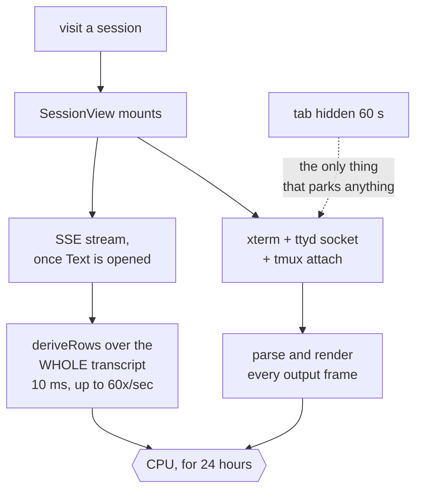
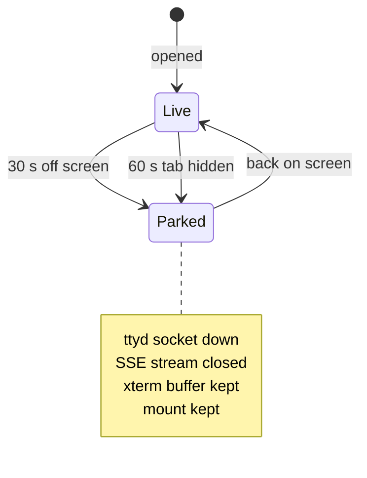

# Park what nobody is reading

Status: approved, not yet implemented. Viktor, 2026-09-11.
Related: [preload a session on hover](2026-09-11-preload-session-on-hover-design.md), which
this plan makes safe to ship.

## The report

Chrome's CPU climbs the longer the lobby tab stays open, and closing the tab
ends it. It does not come back down on its own. Viktor keeps the lobby open all
day, visits many sessions in a sitting, and usually has it backgrounded in one
of several senses: another tab in front, another app focused, minimised, or
sitting on a second monitor.

## What costs what

Two costs, and they multiply.

```stats
10 ms | one deriveRows pass, measured in-repo
24 h | how long a visited session keeps a live socket
22 | sessions on this box today
0 | park while the window is unfocused
```

**Every session you visit keeps a live terminal for 24 hours.**
`store/keepalive.ts` mounts a `SessionView` per visited session and never caps
the list; `KEEP_TTL_MS` is 24 hours and prune drops only what is older than
that or gone from the lobby. `TerminalNative`'s `onMount`
(`components/TerminalNative.tsx:949`) opens an xterm, a ttyd WebSocket and a
tmux attach with no gate on whether the session is on screen, and the default
view is the terminal (`store/viewmode.ts:31`), so this happens for every visit.
Visit fifteen sessions and the tab is running fifteen terminals, each parsing
and rendering whatever its Claude prints. Claude Code animates a spinner while a
turn runs and tmux pushes every redraw to every attached client, so a working
session is not an idle one. The frame rate of that spinner has not been measured
here.

**The battery saver that would stop this only watches the tab.**
`terminal/battery.ts` already knows how to drop a socket losslessly and bring it
back, and `terminal/attach.ts:541` feeds it `document.hidden` for the whole tab.
That flag is false for a window that is visible but unfocused, which covers the
second monitor and every alt-tab. So in the case Viktor is in most of the day,
nothing parks.

**Each open transcript re-derives itself in full on every animation frame.**
`SessionView.tsx:330` is `createMemo(() => deriveRows(store.events))`, and
`store/session.ts:321` records the cost from a previous measurement: 10 ms per
derivation, 2,644 ms when run per event. Events flush on `requestAnimationFrame`,
so a live turn can run that 10 ms sixty times a second. The open is already
bounded, but not the way this doc first said, and the difference matters. The
browser always sends `rev=1`, and `session-events/sse.go:250` answers that with
`src.Backfill(0, OpenBackfillBytes)`, which is 100 KB (`sse.go:95`). `turns=` is
read only in the `!reverseOpen` branch at `sse.go:215`, the fallback for a server
that predates the reverse open, and `lib/config.ts:123` omits it entirely at the
default of 20. So the open is bounded in BYTES and is routinely wider than 20
turns. Nothing sheds the old end afterwards either, so the array grows all day and
the 10 ms grows with it.

Today, one visit buys a permanent cost:



After, a session's cost follows whether anyone is reading it:




## What changes

Four changes, smallest first.

### 1. Ask whether anyone is reading this session, not whether the tab is hidden

`battery.ts` decides; it just needs a better question. Today its input is
`hidden: document.hidden`. It becomes three inputs, and away is any of them:

| input | source | grace |
|---|---|---|
| tab hidden | `document.hidden` | 60 s (unchanged) |
| session off screen | the `ownsBridges` prop `SessionView` already passes | 30 s |

A third input, `document.hasFocus()`, was built with these two and then removed
the same day. The Risks section below carries the reasoning; the short version is
that it parked exactly one terminal the other two do not already cover, the one
being read, and that cost the terminal bell.

The 30-second grace on the off-screen case means flicking between two sessions
costs nothing. `attach.ts` owns the countdown and the listeners already, so this
is one more listener and one more input on a decision function that is pure and
tested.

The suspend path is unchanged and already lossless: tmux repaints the live
screen on reconnect, which is the same path a ttyd restart takes today.

### 2. Park the transcript stream with the terminal

A session nobody is reading also holds an SSE stream, and every event on it
re-derives that session's timeline. The stream closes when the session parks and
reopens on return. `SseClient` already resumes from a cursor
(`sse/client.ts:440`), so nothing is lost, it arrives when you look.

### 3. Slide the transcript window

Hold the last 20 turns. Drop the oldest beyond that. Scroll-up refetches through
`loadEarlier`, which exists and pages in 40 KB to 400 KB steps.

The trim CREATES that window rather than maintaining one the open already
established, because the open is bounded in bytes (above). A 100 KB open can
deliver well over 20 turns of a terse session, so the trim has to run from the
opening `ready` frame's flush and not only when live events arrive. Otherwise an
idle session that over-delivered on open keeps the excess for as long as it stays
open, which is the case this whole design is about.

**The window only slides while the reader is pinned to the bottom.** Scrolled up,
trimming stops, so history paged in on purpose is not thrown out from under the
person reading it. Returning to the bottom resumes trimming.

### 4. Keep polling when the window is unfocused

The lobby poll is what repaints the tab title and the favicon badge, and it is
one request every few seconds. It parks on `document.hidden` today and that
stays. Nothing parks on unfocus, which started as a deliberate exception for the
poll and ended up true of the whole design.

## Decisions

| question | answer |
|---|---|
| Cap the kept mounts? | No. Keep them, park the idle ones. The 2026-08-19 call stands. |
| What a parked session keeps | Socket down, xterm buffer kept, so return is instant. |
| Off-screen grace | 30 s |
| Hidden grace | 60 s, unchanged |
| Park anything on unfocus? | No. Built, then removed the same day; see Risks. |
| Park the poll when hidden? | Yes, unchanged. Web Push covers notifications there. |
| Transcript window | 20 turns, trimmed only while pinned to the bottom |
| Incremental deriveRows | Not in this pass. See below. |
| Return UX | Nothing. Stale screen, then repaint. |
| Rollout | Straight to master |
| Target | A hidden idle tab near 0%, a visible idle tab under about 2%, flat over hours |

### Why the incremental derive is out of scope

Viktor first asked for it, and I pushed back. With the window bounded to 20
turns, the 10 ms pass gets small on its own, and an incremental derive means
rewriting the turn grouping in `timeline.logic.ts`, which carries the fold
logic, the superseded-question rule and the out-of-order merge. That is the part
of the timeline most likely to mis-render if it moves. The plan is to bound the
window, measure again, and only rewrite the derive if it is still on top.

### What the window costs

`cache.save` replaces a session's stored record rather than merging into it, so
once memory holds 20 turns the IndexedDB copy holds 20 turns too, and
`MAX_EVENTS_PER_SESSION = 2000` stops being reachable. Open cost is unaffected,
since a resume still starts from the newest id held. What is lost is offline
scroll-back depth, which `loadEarlier` refetches when there is a network. Keeping
more would mean holding 2,000 events in memory, which is the thing being removed,
so this is accepted rather than solved.

## What this does not change

- Kept mounts. Switching to a session you have opened still shows what is
  already there rather than rebuilding it, which is the 1,797 ms this design
  exists to protect.
- The suspend and resume machinery, the reconnect ladder, the held-input replay.
  All four changes reuse what is there.
- Web Push, which is server-driven and independent of any of these sockets.

## How this meets the hover preload plan

[Preload a session on hover](2026-09-11-preload-session-on-hover-design.md) is
approved and not yet implemented. It starts a real tmux attach on 250 ms of
hover, so running a pointer down the sidebar would attach every session it
passes. With parking in place those attaches park 30 seconds after the pointer
moves on, which bounds a cost the preload plan would otherwise leave open.
Whichever lands second inherits the other's assumptions, so they want landing in
this order: parking, then preload.

## Risks

**A parked socket that will not come back.** The worst outcome is returning to a
session and finding a dead terminal. The resume path is the one a ttyd restart
already exercises daily, and the reconnect ladder handles a failed resume, but
this is the part to watch after landing.

**tmux window sizing.** tmux sizes a window to its latest active client, so
parking and unparking changes which client is newest. `SessionView`'s
`claimGrid` already refuses to claim for a watching device or someone else's
session, and re-claims on return.

**A session that goes quiet while parked.** Output arriving at a parked session
is not lost, tmux keeps it in the pane and repaints on reattach, but anything
reading the live byte stream for side effects misses it. The bell is one of
those. `term.onBell` fires from bytes the socket delivers, so a park silences
it, and the output-while-hidden signal goes the same way.

**And, while `unfocused` was an input, it reached the session on screen.**
Unfocused is a window-wide condition, so a minute after an alt-tab the session
being read had parked too. A bell rung after that raised no `● <name>` title
prefix and no dot on the [Terminal] segment, because `notify/attention.ts` latches only on a signal that
arrives, and none does. What still arrives is everything the poll drives: the
`(N●)`/`(N✓)` count badge, the favicon's awaiting and done kinds, and the
per-session OS notification or Web Push, which names the session in its own
text. So what is lost is which session rang, inside the page, and not that
something happened.

**So the input came out.** `unfocused` parked exactly one terminal that the other
two rows do not already cover, the one being read: a session off screen parks on
its own 30 s row, and a hidden tab on its own 60 s row. Viktor's call on
2026-09-11 was to keep the bell, on the grounds that a lobby left visible on a
second monitor is open precisely to be noticed. So `document.hasFocus()` is not
an away input, in `battery.ts` or in the transcript stream's park, and a window
sitting behind an editor keeps one live terminal out of fifteen. The earlier
paragraph is kept rather than deleted because it is the reasoning that decided
it.

## Verification

1. Unit tests for the widened battery decision, covering each of the three away
   inputs and their graces.
2. Unit tests for the sliding window, including the pinned-to-bottom rule.
3. Drive the real lobby: open several sessions, leave the window unfocused,
   confirm the sockets drop and that returning to a session repaints.
4. Compare Chrome's task manager before and after over a session-hopping run.

## Open questions

- How much memory a parked xterm buffer holds has not been measured. The plan
  keeps buffers for the full 24 hours, so a heavy day could accumulate. If it
  turns out to matter, releasing the xterm after a longer parked period is the
  next step, and it was considered and set aside here rather than ruled out.
- The `[Text]` activity dot now stays lit while a resumed stream is catching up,
  rather than going dark for the round trip after you return to a parked session.
  Both readings are wrong for about the same length of time; this one errs
  toward "go look", and it covers the resume that never lands.
- `sse/client.ts:14` says text mode is the default view for every session.
  `store/viewmode.ts:31` says the default is the terminal, changed 2026-08-19.
  The comment is stale; worth fixing when that file is next touched.
