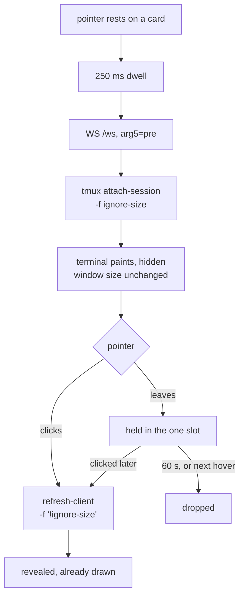

# Preload a session on hover

Status: approved, not yet implemented. Viktor, 2026-09-11.
Decision record: [ADR-0026](../adr/0026-a-preloaded-terminal-attaches-without-driving.md).
Glossary: **Preload attach** in [CONTEXT.md](../../CONTEXT.md).

## What this buys

Opening a session the tab has not opened before costs **779 ms** from the click
to a readable terminal, and 91% of that lands after the WebSocket opens:
the tmux attach and the redraw. Hovering a card
starts the attach 250 ms before the click, so the terminal is already drawn when
the click lands.

```stats
779 ms | click to readable terminal today
627 ms | of it is the tmux attach
91% | of an open a hover can move
300 ms | the target
```

Measured against the deployed build on 2026-09-11 with Playwright, ms from
pointerdown, six opens across two page loads:

| open | click → /token | click → ws open | click → first frame | click → readable |
|---|---|---|---|---|
| first of a page load, chunk from network | 252 | 270 | 1,354 | 1,620 |
| first of a page load, chunk from HTTP cache | 121 | 129 | 1,110 | 1,192 |
| every later open (median of 6) | 58 | 67 | 694 | **779** |

The gap between `ws open` and `first frame` is 627 ms: ttyd forking
`devvm/tmux-attach.sh`, tmux attaching, and the full redraw. Preloading
JavaScript does not affect it, which is why the preload has to be a real
attach.

Two other costs surfaced while measuring, and both ship alongside this.

**The xterm chunk has no preload hint.** `dist/assets/xterm-D0vEgCRV.js` is
329,698 B raw and 82,870 B gzipped, imported lazily at
`TerminalNative.tsx:953`, and `dist/index.html` carries zero `modulepreload`
links. It is worth 413 to 841 ms on the first terminal open of a page load.

**The transcript cache is not writing records.** `session.ts:188` makes
`events` a Solid store, `session.ts:331` hands that proxy to `cache.save`, and
`transcript-cache.ts:77` returns it unchanged below the 2,000-event cap.
IndexedDB cannot structured-clone a proxy, so the `put` throws
`DataCloneError`, the `catch {}` at line 156 swallows it, and the slot is
dropped. Observed live on 2/2 opens on 2026-09-11, both below the cap. Above it
`slice()` returns a plain array of proxied elements, which we expect fails the
same way; that half is inference, not an observation. So text opens have been
cold since the cache shipped on 2026-08-28, costing 220 to 660 ms each.

## How it works



### The client

A hover on a sidebar card starts a **250 ms** dwell. On expiry, one hidden
`TerminalNative` is mounted for that session — the terminal only, not a whole
`SessionView`, so no `/events` stream and no `watchPanes` subscriber.

There is **one** preload slot. The next hover replaces it, a click promotes it
onto the normal `keepalive.ts` policy, and 60 s of neither drops it. A pointer
that leaves while the socket is still connecting aborts it; a preload that has
already landed is kept, on the assumption that hover, glance away, click is a
common mouse path. That assumption is untested.

Pointer only. Keyboard focus and the command palette do not fire it, and neither
does touch: hover does not exist on a coarse pointer, so phones and tablets keep
today's behaviour. Own sessions only: a foreign attach goes through tmux-api's
`/internal/attach` authorization on every connection, which costs a round trip,
a `sudo` and an audit line per card the pointer crosses.

### The attach

`?arg=` position 5 already carries the client's attach request: empty for drive,
`ro` for watch. It gains `pre`, and `tmux-attach.sh` maps it to
`attach-session -f ignore-size`. Read-write, so it can be promoted without a
second attach, but carrying tmux's ignore-size flag so it cannot move the
window. It takes the `attach-session` branch rather than `new-session -A`, so a
session that died between the poll and the dwell fails the preload instead of
being recreated.

### The promotion

`POST /sessions/{name}/grid` already means "the client being read says what size
it is". It gains one step in front: if the session has a read-write client
carrying ignore-size, run `refresh-client -t <client> -f '!ignore-size'` first.
`clientsListFmt` in `tmux-api/driven.go` already reads `#{client_flags}`, so
finding that client costs no extra tmux call. Watch-mode clients are excluded by
being read-only.

The same predicate keeps the driving clock honest: `drivesToStamp` stamps
`@last_drive` for any session with a read-write client attached, so without this
exclusion, hovering down the sidebar would restamp every card's timer.

## What ships

Three commits, landing together.

1. **Fix the transcript cache.** `trimToCap` returns `events.slice()`
   unconditionally. A test that a Solid store array survives a round trip
   through the real IndexedDB backend. The existing tests use the in-memory
   backend, which does not exercise structured cloning.
2. **Prefetch the xterm chunk after first paint**, at idle priority rather than
   as a `modulepreload`. On the 400 kbps link this app is built for, a blocking
   82 KB fetch would put 1.7 s of xterm in front of the session list, which is
   the screen you need first.
3. **The preload attach**: arg5 `pre`, the ignore-size attach in
   `tmux-attach.sh`, the driven-mark exclusion and promotion in tmux-api, and
   the dwell, slot and TTL in the frontend.

## How we will know it worked

Drive the deployed build with Playwright: hover a session never opened in that
page load, wait out the dwell, click, and time pointerdown to non-empty
`.xterm-rows` text. Compare against the same click with no hover.

Target: **under 300 ms**, against the 779 ms measured today. Measure all three
changes separately as well as together, so the improvement can be attributed.

## What we are not sure of

The 250 ms dwell and the 60 s TTL are starting values, not measurements. We
chose not to instrument preload hit rate, so revisiting them means measuring
again rather than reading a dashboard.

The 779 ms baseline was measured on attaches that resolved read-only, because
the sessions used were already driven from elsewhere. A read-write attach runs
the same fork and attach and skips `PinGrid`, so it should not be slower, but
that is reasoning rather than an observation.

`vite` alone no longer reaches tmux-api and session-events on this box: both now
require `X-TL-Proxy-Secret`, while ttyd does not. Anyone repeating these
measurements needs a shim that adds the header, or the recipe in memory #12057
will 401 on the sidebar.
