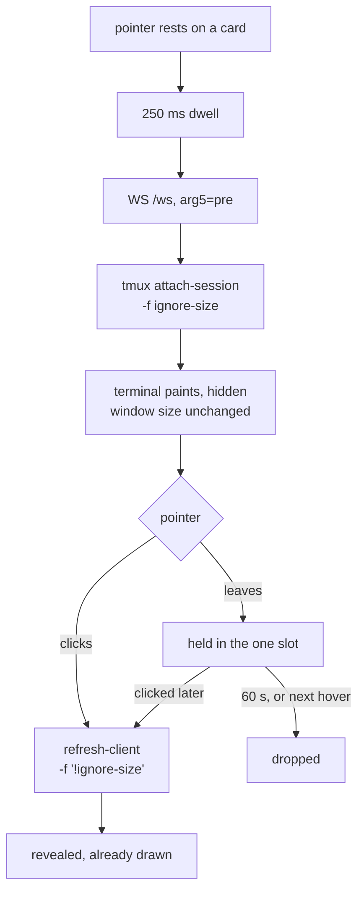

# Preload a session on hover

Status: shipped 2026-09-12 in v0.52.3. Viktor, 2026-09-11.
Decision record: [ADR-0026](../adr/0026-a-preloaded-terminal-attaches-without-driving.md).
Glossary: **Preload attach** in [CONTEXT.md](../../CONTEXT.md).

## What this buys

Opening a session the tab has not opened before costs **779 ms** from the click
to a readable terminal, and 91% of that lands after the WebSocket opens:
the tmux attach and the redraw. Hovering a card
starts the attach 250 ms before the click, so the terminal is already drawn when
the click lands.

```stats
779 ms | click to readable terminal today
627 ms | of it is the tmux attach
91% | of an open a hover can move
300 ms | the target
```

Measured against the deployed build on 2026-09-11 with Playwright, ms from
pointerdown, six opens across two page loads:

| open | click → /token | click → ws open | click → first frame | click → readable |
|---|---|---|---|---|
| first of a page load, chunk from network | 252 | 270 | 1,354 | 1,620 |
| first of a page load, chunk from HTTP cache | 121 | 129 | 1,110 | 1,192 |
| every later open (median of 6) | 58 | 67 | 694 | **779** |

The gap between `ws open` and `first frame` is 627 ms: ttyd forking
`devvm/tmux-attach.sh`, tmux attaching, and the full redraw. Preloading
JavaScript does not affect it, which is why the preload has to be a real
attach.

Two other costs surfaced while measuring, and both shipped alongside this.

**The xterm chunk had no preload hint.** `dist/assets/xterm-D0vEgCRV.js` is
329,698 B raw and 82,870 B gzipped, imported lazily at
`TerminalNative.tsx:953`, and `dist/index.html` carries zero `modulepreload`
links. It is worth 413 to 841 ms on the first terminal open of a page load.

**The transcript cache was not writing records.** `session.ts:188` makes
`events` a Solid store, `session.ts:331` hands that proxy to `cache.save`, and
`transcript-cache.ts:77` returns it unchanged below the 2,000-event cap.
IndexedDB cannot structured-clone a proxy, so the `put` throws
`DataCloneError`, the `catch {}` at line 156 swallows it, and the slot is
dropped. Observed live on 2/2 opens on 2026-09-11, both below the cap. Above the
cap `slice()` returns a plain array whose elements are still proxies, which
fails the same way: verified separately with vitest the same day. So text opens
have been cold since the cache shipped on 2026-08-28, costing 220 to 660 ms
each.

## How it works



### The client

A hover on a sidebar card starts a **250 ms** dwell. On expiry, one hidden
`TerminalNative` is mounted for that session — the terminal only, not a whole
`SessionView`, so no `/events` stream and no `watchPanes` subscriber.

There is **one** preload slot. The next hover replaces it, a click promotes it
onto the normal `keepalive.ts` policy, and 60 s of neither drops it. A pointer
that leaves while the socket is still connecting aborts it; a preload that has
already landed is kept, on the assumption that hover, glance away, click is a
common mouse path. That assumption is untested.

Pointer only. Keyboard focus and the command palette do not fire it, and neither
does touch: hover does not exist on a coarse pointer, so phones and tablets keep
today's behaviour. Own sessions only: a foreign attach goes through tmux-api's
`/internal/attach` authorization on every connection, which costs a round trip,
a `sudo` and an audit line per card the pointer crosses.

### The attach

`?arg=` position 5 already carries the client's attach request: empty for drive,
`ro` for watch. It gains `pre`, and `tmux-attach.sh` maps it to
`attach-session -f ignore-size`. Read-write, so it can be promoted without a
second attach, but carrying tmux's ignore-size flag so it cannot move the
window. `wire.ts:367-372` requires `/token` and `/ws` to carry byte-identical
args, so `pre` has to be built into both from the same `terminalFrameArgs`
inputs. It takes the `attach-session` branch rather than `new-session -A`, so a
session that died between the poll and the dwell fails the preload instead of
being recreated.

### The pin

`PinGrid` sizes a watched session through a hook that reads the client list and
calls `resize-window` itself, so tmux's ignore-size flag does not reach it. The
hook gains a `grep -v ignore-size` filter beside the `grep -v read-only` it
already had, and `gridHookMark` goes to `tl-grid-v3` so `repairStaleGridPins`
reinstalls it on sessions pinned by an older build. Without this a hover moved
a pinned session's window to the hovering client's size, measured 80x39 to
200x49 on 2026-09-11, and pins are never reverted.

### The promotion

`POST /sessions/{name}/grid` already means "the client being read says what size
it is". It gains one step in front: if the session has a read-write client
carrying ignore-size, run `refresh-client -t <client> -f '!ignore-size'` first.
`clientsListFmt` in `tmux-api/driven.go` already reads `#{client_flags}`, so
finding that client costs no extra tmux call. Watch-mode clients are excluded by
being read-only.

The same predicate keeps the driving clock honest: `drivesToStamp` stamps
`@last_drive` for any session with a read-write client attached, so without this
exclusion, hovering down the sidebar would restamp every card's timer.

## What ships

Three commits, landing together.

1. **Fix the transcript cache.** `unwrap()` from `solid-js/store` before the
   write. `slice()` is not enough: measured on 2026-09-11 with vitest,
   `structuredClone` throws on the store array and throws again on
   `events.slice(0)`, because reading an index of a store returns a proxied
   element. It succeeds on `unwrap(events)`. Plus a test that a store array
   survives a round trip through the real IndexedDB backend. The existing tests
   use the in-memory backend, which does not exercise structured cloning.
2. **Prefetch the xterm chunk after first paint**, at idle priority rather than
   as a `modulepreload`. On the 400 kbps link this app is built for, a blocking
   82 KB fetch would put 1.7 s of xterm in front of the session list, which is
   the screen you need first.
3. **The preload attach**: arg5 `pre`, the ignore-size attach in
   `tmux-attach.sh`, the driven-mark exclusion and promotion in tmux-api, and
   the dwell, slot and TTL in the frontend.

## What happened

Shipped in three parts on 2026-09-11 (v0.52.0) and corrected twice on
2026-09-12 (v0.52.3). Driven against real sessions each time, which is what
caught both corrections.

| | click → readable terminal |
|---|---|
| preloaded | **39 ms** median, 151 ms worst |
| cold, same page load | 586 ms |
| before any of this | 779 ms |

The mechanism was verified rather than inferred: while hovering, the tmux client
reads `attached,ignore-size,UTF-8`; after the click, `attached,focused,UTF-8`,
with the same `client_name`. The socket is promoted in place.

### Two corrections after it shipped

**Sessions drifted into Watch mode.** Promotion re-took the join decision, so it
read `driven` at click time rather than at dwell time. `driven` is true for any
session holding an attached client, and `keepalive.ts` holds one on every
session visited in the last day, so clicking a preloaded card resolved to watch
as a matter of course. It shipped as a passing test asserting watch was the
right answer. `store/watchmode.ts` already carried the rule this broke: a
reading that counts your own client is sampled at a decision point and never
tracked, a rule an earlier version of the same mistake had already cost a
revert. The decision is taken once again, pinned from both directions.

**The preload opened at the wrong size**, and the size turned out to be half
of it. It mounted `display: none`, its host measured 0x0, and `fit.ts` refuses
to fit against that, so it kept xterm's constructed 80x24 and the click paid
the reflow. The first fix remembered the last host BOX and handed it to the
guard, which made it worse: the fit is xterm's FitAddon, which measures the
parent element itself, so it proposed 11x5 from the same hidden host. The
second remembered the GRID a visible terminal reached and resized the preload
to it, which fixed the cell COUNT and left the cell SIZE wrong — see below.

### The flicker the sizing fix left behind (2026-09-12)

Handing a hidden terminal the right grid does not let it measure a character,
and xterm needs both. Recorded on the deployed build with a CDP screencast: the
first frame after the click carried a per-row `letter-spacing` of a whole cell
and no colour, because the char-measure element reported 0 px inside
`display: none`. It corrected itself 90 to 200 ms later on the first real
measurement, and 207 ms later on the first open of a page load, where the grid
was 80x24 as well.

| open | first pixels | wrong for |
|---|---|---|
| preload, first of a page load | 110 ms | 207 ms |
| preload, a later open | 250 ms | ~170 ms |
| no preload (control) | 380 ms | empty pane ~800 ms, then correct |

A preload is now mounted OFFSTAGE rather than hidden: `position: absolute`
over the pane, `visibility: hidden`, `bottom` clear of the scratch-shell panel
(`app.css`, `.tl-offstage`; the slot rule is `slotClasses` in `App.tsx`).
`visibility: hidden` keeps the layout box, so the measurement is the one the
pane will give it, and it takes the subtree out of the tab order as
`display: none` did. Measured after, on the built branch: char measure 256 px,
`letter-spacing` 0 px, 1320x901, 53 rows, all of it settled BEFORE the click
and none of it changed by the click, with the panel up as well as down. Every
frame from +27 ms is the finished terminal.

`terminal/lastbox.ts` is gone with it. A laid-out host lets the FitAddon
measure again, so there is no grid left to borrow.

## How we knew it worked

Drive the deployed build with Playwright: hover a session never opened in that
page load, wait out the dwell, click, and time pointerdown to non-empty
`.xterm-rows` text. Compare against the same click with no hover.

Target: **under 300 ms**, against the 779 ms measured today. Measure all three
changes separately as well as together, so the improvement can be attributed.

## What we are not sure of

The 250 ms dwell and the 60 s TTL are starting values, not measurements. We
chose not to instrument preload hit rate, so revisiting them means measuring
again rather than reading a dashboard.

The 779 ms baseline was measured on attaches that resolved read-only, because
the sessions used were already driven from elsewhere. A read-write attach runs
the same fork and attach and skips `PinGrid`, so it should not be slower, but
that is reasoning rather than an observation.

`vite` alone no longer reaches tmux-api and session-events on this box: both now
require `X-TL-Proxy-Secret`, while ttyd does not. Anyone repeating these
measurements needs a shim that adds the header, or the recipe in memory #12057
will 401 on the sidebar.
