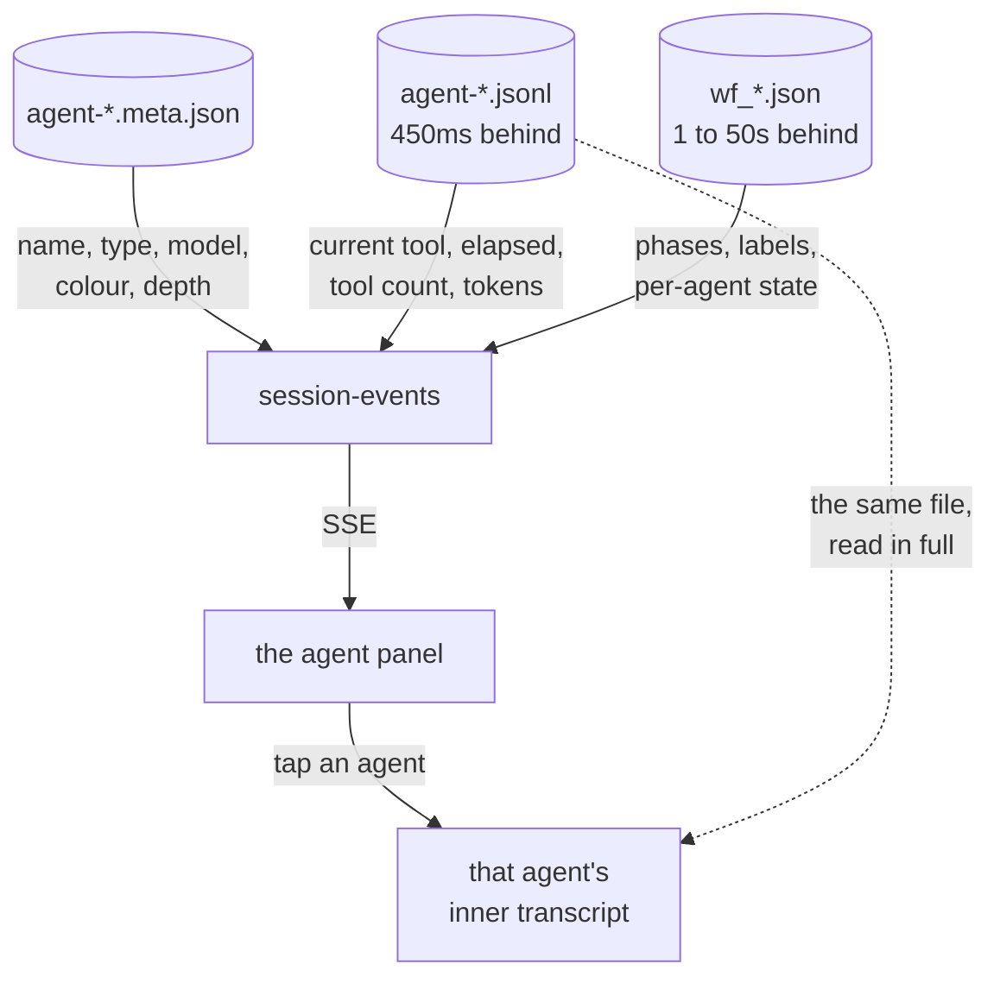

# Seeing what a session's agents are doing

**Status:** design, prototypes out for selection.
**Owner:** wizard. **Repos touched:** terminal-lobby.
**Decisions from:** a grilling session on 2026-09-12.

## The five to choose between

Open one, press `16 agents`, then `idle`. That pair separates them faster than
anything else on this page. Each one plays a scripted session on a compressed
clock, so the motion can be judged rather than imagined.

| | open it | where it puts the panel | the bet |
|---|---|---|---|
| 1 | **[Marginalia](agent-panel/p1-ambient.html)** | a rail down the right margin, no card, one hairline | identity and nesting drawn by a single coloured rule, and no spinner anywhere |
| 2 | **[Console](agent-panel/p2-instrument.html)** | a resizable dock, grown out of today's strip | a `LAST 12` column of tool-call bars, the only honest shape data with no denominator makes |
| 3 | **[Strand](agent-panel/p3-narrative.html)** | inline in the timeline, where the spawn happened | a running head appears only once the live work scrolls off, so there is no second place the facts live |
| 4 | **[Runway](agent-panel/p4-spatial.html)** | a dock with every agent on one time axis | a fan-out has a shape, and a silence is a visible gap nothing has to name |
| 5 | **[Foreground](agent-panel/p5-focus.html)** | a sticky band above the timeline | one agent leads, picked by stated facts, and the card says which rule fired |

Five agents built these independently from one brief and a different design
thesis each, so four of the five chose a different placement. The rest of this
page is the reasoning and the measurements they were built against.

## The problem

A session that spawns subagents or runs a `Workflow` tells the text view almost
nothing about them. This design adds a surface that names each piece of
concurrent work and says what it is doing right now, and it records what the
data can and cannot support so the five prototypes compete on layout rather than
on signals the data does not carry.

## What the text view shows today

A subagent renders as one collapsed tool row, `◈ AGENT <description> ✓`
(`rows.tsx:224-352`). The tick arrives about two seconds after launch, because
the `Agent` call returns as soon as the agent is spawned, while the agent itself
runs for minutes. Under the timeline, `.tl-bg-strip`
(`TextView.tsx:710-723`) reads:

```
Still working in the background: 2 commands
```

That strip is accurate, and it is all the text view reports about background
work today. It comes from
`Session.bg`, a per-kind count derived from the `@claude_bg` tmux option and
polled every 5 seconds, with the task ids discarded before they reach the wire
(shipped 2026-09-04, v0.28.3). So the view knows how many things are running, and
nothing further about each one.

The nested sub-timeline that would render an agent's inner work already exists
in code. `ToolRow.children` (`timeline.logic.ts:74-105`) renders behind a dashed
left rail at `rows.tsx:292-298`, is unit-tested at
`test/timeline.native.test.ts:211-225`, and has never fired on real data: 0 of
373 transcripts on this box contain a single sidechain record. The reason is in the next section.

## What we decided

| decision | answer |
|---|---|
| Scope | One session's own work, not a fleet view across sessions. |
| Entities | `Agent` subagents, `Workflow` runs, background `Bash` commands, and schedules this session set for itself. |
| The job | Glance first, drill on demand. |
| The hero | What each agent is doing right now: its name and its current tool call. |
| Row content | Description plus current tool, elapsed, tool-call count, tokens. |
| Nesting | Indented tree. |
| Workflows | Their own treatment, with phases visible. |
| Finished agents | Running on top, finished collapsed below. |
| Nothing running | The panel disappears entirely. |
| Tap an agent | Opens its full inner transcript. |
| Silence | Show the elapsed number. Never say "stuck". |
| Scale | Reads well at 3 to 6 agents, survives 16. |
| Motion | Instant, no smoothing. |
| Device | Desktop first, unbroken at phone width. |
| Actions | Read only. |

Two of these are worth their reasoning.

**Scheduled work was scoped down.** The interview picked cron and scheduled
agents as in scope alongside a one-session view, and those two do not fit
together: a cron fires on its own clock, usually in a different session. The
scope that survives is work this session scheduled for itself, such as a pending
`/loop` wakeup or a cron it created. Everything else scheduled is a different
screen.

**The drill target grew.** The interview first settled on "jump to its result in
the main timeline", on the assumption that a subagent's inner work was not
available. The measurements below found that it is, in full, so the decision was
revisited and tapping an agent now opens its whole conversation.

## The data, measured 2026-09-12

Subagent work is not in the session transcript. Across 373 transcripts on this
box spanning versions 2.1.232 to 2.1.263, `"isSidechain":true` appears zero
times. Each agent writes its own file instead:

```
<project>/<sessionId>/subagents/agent-<agentId>.jsonl        one file per agent
<project>/<sessionId>/subagents/agent-<agentId>.meta.json    written ~2s before the first record
<project>/<sessionId>/subagents/workflows/wf_<runId>/agent-<agentId>.jsonl
<project>/<sessionId>/workflows/wf_<runId>.json              workflow run state
```

Those per-agent files are appended as the agent works. Measured against wall
clock while three agents ran concurrently in this session, the write lag was
450 ms, and the file grew from 200 to 252 records over the sample. One record
lands per completed block, so a tool call appears the moment the model finishes
emitting it and a half-written argument never reaches disk.

The sidecar carries identity:

```json
{"agentType":"priorart-recon","description":"Find prior art for agent visualization",
 "name":"priorart-recon","spawnDepth":0,"model":"claude-opus-5",
 "taskKind":"in_process_teammate","teamName":"session-408579e1","color":"yellow"}
```

`color` is assigned by Claude Code itself, which lets the panel agree with what
the CLI shows rather than inventing a second identity scheme.

A `Workflow` keeps structural state that is populated mid-flight. Of 14 in-flight
agents sampled across 6 killed runs, `label`, `phaseTitle`, `agentId`, `model`,
`startedAt`, `lastProgressAt` and `promptPreview` were present on 14 of 14,
`lastToolName` on 14 of 14, and `tokens` and `toolCalls` on 14 of 14.
`resultPreview` and `durationMs` were present on 0 of 14, appearing only on
completion:

```json
{"type":"workflow_agent","label":"frontend source + SW","phaseIndex":2,
 "phaseTitle":"Delete","agentId":"abe4fe23899a30fb9","state":"progress",
 "startedAt":1788614184282,"lastToolName":"ListAgents","tokens":217854,"toolCalls":66}
```

That file lags the agents' own transcripts by 1 to 50 seconds, median around 10,
so it is the structural view and the per-agent files are the live one.



### Scale, from real runs on this box

| metric | value |
|---|---|
| max concurrent agents in one workflow | 16 |
| max agents in one workflow run | 117 |
| max subagent transcripts in one session | 153 |
| typical ad-hoc concurrent subagents | 3 |

The design target follows from those: read well at 3 to 6, survive 16.

### What the data cannot support

Listed so that no prototype spends effort drawing something that would be a
guess.

- **Whether an agent is alive.** There is no heartbeat and no exit record, and
  120 seconds of silence is normal for an agent reading a large file. The panel
  may show "last activity 3m12s" and may not say stuck, hung or unhealthy.
- **A progress percentage per agent.** No denominator exists. A workflow knows
  its phase count from the start; an agent knows nothing of its own length.
- **Token streaming inside a block.** One record per completed block, and
  non-final blocks of a request carry placeholder counts, so a per-second burn
  chart would be a staircase with wrong risers.
- **Which parallel group an agent belongs to.** `phaseIndex` groups by phase;
  `parallel()` leaves no marker in the run state.
- **A workflow agent's result before it finishes.** `resultPreview` and
  `durationMs` are absent on every in-flight sample.
- **Cost in money.** Tokens and model name only.
- **Nesting deeper than one level, confirmed.** `spawnDepth` exists and reaches
  1 in all data here. A depth-2 tree should render; deeper is untested.
- **Another user's agent content.** Agent transcripts are mode 600 owned by the
  hosting user. The `.meta.json` sidecars are 664, so a multi-user view could see
  identity and not work.

## Prior art

**Claude Code's CLI** already draws a tree, with `├─ └─ │`, a braille spinner at
80ms, and `⟳ ✔ ✘` for state. A live row reads
`├─ ⟳ frontend source + SW   general-purpose · opus · 12.3k tok · 5 tools · 1m 30s`,
and completion prints `Done (5 tool uses · 12.3k tokens · 1m 30s)`. Two ideas
from it are worth keeping: inside a phase box only failed and in-flight agents
get rows while finished ones collapse to a single `✓ 9 done` line, and a flat
list caps at the last 8 with `└─ · · · +16 more`. What it does not carry is the
hero this design is built around: there is no per-agent activity string, and
progress renders by inlining the child's entire transcript.

**t3code's `AgentsPanel.tsx`** (583 lines, landed 2026-08-06 as
`feat: native subagent & workflow observability`) solves the same problem in a
right-hand panel. Five mechanics from it are treated as solved rather than
reinvented: rows hold their spawn-order position and never reorder; one activity
line per row uses `progress ?? "▸ " + lastToolName` while live and
`error ?? result` once settled, so the row never changes shape on completion;
anything that ticks sits in a fixed-width cell; the volatile string truncates
rather than wraps; and timers tick by direct DOM write so a running row costs no
re-renders per second.

## How the prototypes were made

Five agents, one identical brief, a different design thesis each, and no sight
of one another's work. The brief carried the decisions above, the measured data
model, the real design tokens, and the two existing implementations (the Claude
Code CLI's own tree, and t3code's `AgentsPanel.tsx`) so nobody spent their
invention rediscovering solved mechanics.

| thesis | given to |
|---|---|
| Ambient. A monitoring surface that demands attention has failed. Encode state in position, weight and hue so a glance costs nothing. | Marginalia |
| Instrument. The person running sixteen agents is an operator. Aligned columns, every number visible, density read as order. | Console |
| Narrative. Delegation happened in the conversation, so it belongs in the timeline rather than in a panel beside it. | Strand |
| Spatial. A list throws away the shape of the work. Sixteen agents across three phases is a shape, and shapes read faster than rows. | Runway |
| Focus. Sixteen rows of equal weight is sixteen things nobody read. Surface the one that matters, keep the rest as a thin index. | Foreground |

Each page carries the same state buttons (`3 agents`, `16 agents`, `workflow`,
`one failed`, `all done`, `idle`) so one moment can be compared across all five,
and a replay control for watching the motion. Every one was verified by driving
it at 1440x900 and reading the screenshots back.

## What this costs to build

Nothing in today's pipeline opens the `subagents/` directory.
`sessionio/normalize.go:186` skips sidechain records for model detection,
`:388` only sets a flag, and `sessionio/filesource.go` never looks in that
directory. So this is new plumbing in `session-events` rather than a rendering
change: watch `subagents/`, parse each agent's meta and tail its file, and carry
per-agent state onto the SSE stream. The renderer work then depends on which
prototype wins.

One latent bug sits in the path this feature will exercise. `host` in
`timeline.logic.ts:319` is a single variable set on each
`collab_agent_tool_call` and cleared only by that call's own result, so with two
agents in flight every child row lands under the second one. It has never been
observed because no sidechain data exists here, and it will start mattering the
moment agent work reaches the timeline.

## Open questions

- Whether the `wf_*.json` lag of 1 to 50 seconds is a flush cadence or a
  progress-event cadence. Watching one live workflow run settles it. Either way
  the per-agent files carry the live picture, so this affects only how fresh the
  phase strip is.
- Whether push beats polling here. The hook stream (`PreToolUse` with `agent_id`)
  would give a push signal, at the cost of an infra-repo change reaching every
  user on the box, and it does not cover sessions Terminal Lobby did not host.
  A file watch on `subagents/` has neither problem.
- How an agent's inner transcript is addressed once it is renderable. It is a
  second conversation inside a session, and the view was built on the assumption
  that a session has one.

## Vocabulary

`CONTEXT.md` gains three terms under the text view.

> **Agent panel**: the surface in the text view that names a session's
> concurrent work and says what each piece is doing now. Shows `Agent`
> subagents, `Workflow` runs, background commands and the session's own pending
> schedules. Absent when nothing is running.
> _Avoid_: task list, agent tree, activity panel

> **Live activity**: the one-line answer to "what is this agent doing right
> now", read from the last `tool_use` block in the agent's own transcript file.
> Distinct from **Outstanding work**, which is the count-only signal the state
> dot uses.
> _Avoid_: status, progress (nothing here has a denominator)

> **Agent transcript**: the per-agent JSONL under a session's `subagents/`
> directory, holding everything one subagent said and did. A session has one
> conversation and any number of agent transcripts beside it.
> _Avoid_: sidechain (that names a record flag that never appears here),
> subsession
