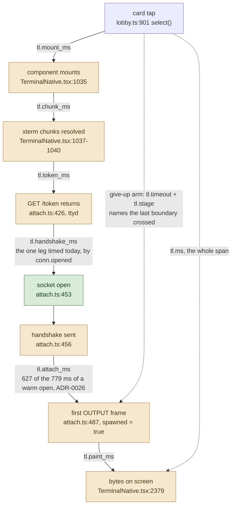
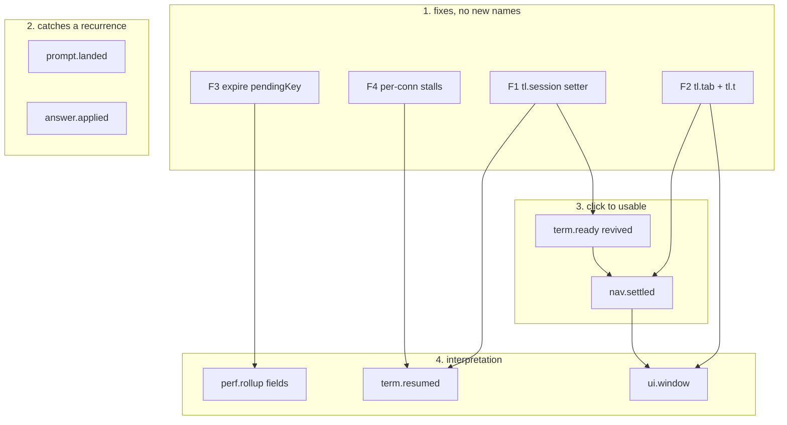

# Journey telemetry: one design from four surface maps

Status: draft, 2026-09-12
Scope: terminal-lobby client and server telemetry, both channels
Extends ADR-0006 (usage) and ADR-0008 (client diagnostics).

## The decision in one paragraph

Four agents mapped four surfaces blind and produced seventeen proposals. This
design keeps six records, one of which already exists in the catalogue and needs
a caller rather than a name. Everything else is either a cross-cutting fix that
costs no record at all, or a duplicate of something already listed here. The
single change that matters most is not a record: no diagnostics record from the
SPA carries a session, so every measurement the app takes today is tab-shaped,
and "the box is slow" and "this one session is slow" are the same line in Loki.

| | count |
|---|---|
| proposals received | 17 |
| new record names | 5 |
| records revived from the catalogue | 1 |
| proposals merged into another record | 5 |
| proposals dropped or reclassified as fixes | 6 |
| worst-case cost, diagnostics channel | 187 of 300 per minute |
| worst-case cost, usage channel | 167 of 600 per minute |

## What all four maps found independently

`stamp()` sets `tl.session` only from `opts.session` (frontend/diag.js:531), and
the one `bind()` call site in the repository passes no session
(frontend-v2/src/telemetry/diag.ts:73-87). Measured over 24 hours on
2026-09-12: 0 of 1,117 `perf.rollup` records carry `tl.session`. ADR-0008:121-124
and telemetry/diagevents.go:11-13 both state that every record carries it, so the
documents and the wire disagree.

Passing a session at bind time would not fix it. The SPA is one page that holds
many sessions and switches between them without rebinding, which is why the four
maps converged on the same shape: a live setter on the core, and per-occurrence
records that name the session they belong to.

Three further findings recur across maps and are treated as settled here:

- `term.ready` is in the catalogue (telemetry/diagevents.go:61), implemented
  (frontend/diag.js:861-872), exposed (frontend/diag.js:1042) and has no caller
  in frontend-v2. Its former caller was frontend/term.html, deleted 2026-09-05.
- `tl.render.*` is declared, documented and never set. `onRender` has no caller
  outside the interface at frontend-v2/src/telemetry/diag.ts:29 and the inert
  stub at :62. Measured: 0 of 1,117 records over 24 hours.
- `tl.parent` has no setter reachable from any surface that still exists.
  Measured: 0 of 1,117 records.

## Two premises that moved while this was being written

**The contention fix has landed.** `source()` no longer holds `us.mu` across the
first read. It takes the lock, and when a session needs building it records a
channel in `us.building`, releases the lock, and reads outside it
(session-events/registry.go:131-176, with `fs.TailOnce()` at :385). The comment
at :118-130 carries the measurement. Two callers asking for the SAME session
still wait on that channel, which is the one thing still serialized, so the
narrower shape remains: one session's 85 s first read blocks every request for
that session while leaving the user's other fifteen alone. That is precisely the
shape a per-session record can see and a tab-shaped one cannot, so the design
below is unchanged by the fix; what changes is that it is now watching for a
narrower recurrence rather than the original one.

**Prometheus is no longer out of scope.** tmux-api/perf_metrics.go copies six
`perf.rollup` attributes into per-user gauges (`tl.echo.p50/p95/max/n`,
`tl.input.p50/p95`), called from tmux-api/telemetry.go:324-325, with the stated
plan of setting an alert threshold against 26 weeks of distribution. Two
consequences for this design, both noted where they land: the input-latency
figure F3 corrects is already feeding a gauge, and the export does not carry
`tl.echo.unmatched`, so a percentile whose slow tail was discarded arrives in
Prometheus with nothing saying how much was discarded.

## The budget, measured rather than assumed

There are two pools, not one. tmux-api/telemetry.go:156 sets
`intakeRatePerMinute = 600` for usage and :160 sets `diagRatePerMinute = 300`
for diagnostics, in separate token buckets that cannot spend each other's
budget. Measured per user per minute over the six hours ending 2026-09-12 19:40,
counting only browser-submitted records:

| channel | cap | measured peak | user |
|---|---|---|---|
| diagnostics | 300/min | 145/min | wizard |
| diagnostics | 300/min | 38/min | emo |
| usage | 600/min | 22/min | wizard |
| usage | 600/min | 21/min | emo |

A second ceiling sits below the usage cap: the intake honours
`maxBatchEvents = 50` per POST (tmux-api/telemetry.go:155) and the client flushes
every 10 s (frontend-v2/src/telemetry/track.ts, `DEFAULT_FLUSH_MS`), so one tab
cannot get more than 300 usage records a minute accepted whatever it queues. The
excess is counted as dropped and reported as `api.rejected`, not queued.

### Arithmetic for this design

Diagnostics, worst case for one user:

```
  145   measured peak today (wizard)
 + 32   term.ready, 16 mounted terminals x up to 2 attach attempts a minute
 + 10   term.resumed, bounded by the measured peak stall rate (emo, 10/min)
 ----
  187   of 300, leaving 113/min spare
```

Usage, worst case for one user:

```
   22   measured peak today (wizard)
 + 120  nav.settled, a tab driven through the palette at 2 actions a second
 + 12   prompt.landed
 +  8   answer.applied
 +  5   ui.window, one per 60 s per visible interacting tab
 ----
  167   of 600, and under the 300/min per-tab intake ceiling
```

The realistic usage figure is far lower. Navigation-class usage events today
total about 0.30/min averaged across all users, and the measured peak for the
whole usage channel is 22/min. `nav.settled` at 120/min is a keyboard-hammering
bound, not an expectation.

If the two pools turn out to be one shared 300/min budget, the combined worst
case of 354/min does not fit and `nav.settled` is the term to trim, since it
carries the whole excess. The code says two pools; this is the one budget claim
worth re-reading before implementation.

## perf.rollup is at its attribute ceiling

Three of the four maps proposed adding fields to `perf.rollup`. Together they
proposed thirteen. Enumerating the record's assembly at frontend/diag.js:584-618
plus the six correlation attributes from `stamp()` (:521-534) and the two the
intake adds (`tl.client` and `tl.build`) gives 47 keys when every optional field
is present. `MaxAttrs` is 48 (telemetry/telemetry.go:53) and `bound()` sorts
ascending and keeps the first 48 (telemetry/telemetry.go:196-206), so the keys
that go first are the ones that sort last: `tl.ws.out_n`, `tl.ws.out_b`,
`tl.ws.in_n`, `tl.ws.in_b`, then `tl.win_s` at position 43, `tl.tab` at 42 and
`tl.session` at 41.

The live maximum is lower because four fields never fire. Over 24 hours, 1,117
records, the widest single record held 36 attributes, and eight structural keys
appeared on none of them: `tl.render.*` (four), `tl.parent`, `tl.session`,
`tl.net.term_drop`, `tl.net.text_drop`. Wiring `onRender` would move the ceiling
from 43 to 47 without anyone noticing, and the record would begin losing
correlation attributes silently in exactly the busy windows that motivated
raising `MaxAttrs` to 48 in the first place.

So `perf.rollup` takes three fields and gives back five:

```
   47   structural ceiling today
 -  4   remove tl.render.*, declared since it shipped and never set
 -  1   remove tl.parent, no setter since term.html was deleted
 +  1   tl.gap_ms, the longest interval between ticks in the window
 +  1   tl.echo.slow, echo candidates discarded on the deadline
 +  1   tl.input.dropped, keystrokes that expired without reaching a socket
 ----
   45   of 48, leaving 3 spare
```

`perf.rollup` is closed after this. The next field needs one of these five back,
and the render leg's measurement moves to `tl.paint_ms` on `term.ready`, where it
is taken at the moment a person is waiting for it rather than sampled
continuously.

This is the one decision no single map could reach, because each saw only its own
one to four additions.

## The click-to-usable chain



Six of the eight boundaries have no timer. The one that does,
`conn.opened`'s `tl.handshake_ms`, fires from the global WebSocket wrapper
(frontend/diag.js:1143-1150), so a click-opened terminal, a reconnect and a hover
preload are indistinguishable in it. Live records confirm the shape: six
`conn.opened` records carried `handshake_ms` between 180 and 246 ms and no
session, no phase and no `tl.token_ms`, because the only caller passes
`{handshakeMs}` alone while the emitter reads `d.tokenMs` at frontend/diag.js:866.

`term.ready` is the record that covers this chain and already exists.

## The final vocabulary

| record | channel | status | attrs | cadence | worst case |
|---|---|---|---|---|---|
| `term.ready` | diagnostics | revived, in the catalogue | 18 | per attach, whether it completes or gives up | 32/min |
| `term.resumed` | diagnostics | new name | 11 | per stall that ends | 10/min |
| `prompt.landed` | usage | new name | 15 | per prompt sent from a composer | 12/min |
| `answer.applied` | usage | new name | 11 | per tap on an answer card | 8/min |
| `nav.settled` | usage | new name | 14 | per deliberate navigation action | 120/min |
| `ui.window` | usage | new name | 23 | per 60 s per visible interacting tab | 5/min |

Catalogue growth: one name in telemetry/diagevents.go (`term.resumed`), four in
telemetry/events.go. `term.ready` is already in diagevents.go:61 with a row in
ADR-0008 at line 114; that row is re-worded rather than added, since it currently
reads "iframe boot to first byte to first paint" and describes a page that was
deleted on 2026-09-05.

### term.ready, revived

Answers: which segment of a terminal open ate the time, on which session, and
where an open that never finished stopped.

| attribute | meaning |
|---|---|
| `tl.session` | the session being attached |
| `tl.kind` | `cold`, `preloaded` or `kept`, read from `preloadAttach` at SessionView.tsx:320 and from whether the mount list already held the key |
| `tl.mount_ms` | `select()` at lobby.ts:901 to the mount body at TerminalNative.tsx:1035 |
| `tl.chunk_ms` | the `Promise.all` of the two xterm chunks, TerminalNative.tsx:1037-1040 |
| `tl.token_ms` | the `/token` fetch at attach.ts:426. The field is already declared at frontend/diag.js:866 and has never been set |
| `tl.handshake_ms` | `mkSocket` at attach.ts:445 to `onopen` at attach.ts:453. Repeated from `conn.opened` so one record stands alone |
| `tl.attach_ms` | handshake sent at attach.ts:456 to the first OUTPUT frame at attach.ts:487 |
| `tl.paint_ms` | first OUTPUT frame to its xterm write callback resolving. TerminalNative.tsx:2379 calls `term.write(bytes)` with no callback today, so this leg costs a change at that line |
| `tl.ms` | click to paint, so a query can rank without summing legs |
| `tl.watch` | true when the attach resolved read-only (SessionView.tsx:545) |
| `tl.timeout` | true when a deadline expired before the first OUTPUT frame |
| `tl.stage` | on a timeout, the last boundary crossed: `mount`, `chunk`, `token`, `handshake`, `attach` |

Emit site: frontend-v2/src/components/TerminalNative.tsx:2379, on the first
`term.write` of an attach; the give-up arm fires from a timer armed beside the
`attach()` call at :2362 and cancelled by the same hook.

Plumbing: `termReady` joins the `Diagnostics` interface at
frontend-v2/src/telemetry/diag.ts:24-33 (the core already exports `onTermReady`
at frontend/diag.js:1042, only the typed seam is missing); an `onFirstOutput`
dependency joins `onAttach` at attach.ts:111 so the attach legs reach the
component; the click time is stamped in `applySelection` at lobby.ts:882 into a
module-scoped map the mount reads once.

The existing emitter's `tl.nav_ms`, `tl.ttfb_ms`, `tl.nav.bytes` and
`tl.nav.cached` describe a document navigation that no longer happens and are
dropped with it.

One operational note: `onTermReady` emits urgent (frontend/diag.js:871), which
flushes immediately. Sixteen terminals reconnecting after a ttyd restart would be
sixteen separate POSTs. The success arm is better batched and the give-up arm
better urgent, which is a one-line change at the emitter.

### term.resumed

Answers: how long the terminal was actually dead, and how many times the person
retried during the silence.

`term.stall`'s `tl.ms` is the detection delay, not the stall length. The check
runs on a 5 s interval (frontend/diag.js:1507-1509) against a 3,000 ms floor
(:37), so the first tick to notice fires between 3,000 and 8,000 ms after the
send, and that arithmetic is the whole of the value. Measured over 7 days: emo
549 records, minimum 3,001 ms, maximum 7,996 ms, none above. The 85,486 ms freeze
would have been recorded as a single `tl.ms` near 5,000.

| attribute | meaning |
|---|---|
| `tl.ms` | first inbound frame minus the send that opened the silence |
| `tl.n` | keystrokes sent during the silence, which is the retry count |
| `tl.session` | which terminal |
| `tl.conn` | so the record joins its own `conn.opened` and `term.ready` |
| `tl.state` | `visible` or `hidden` when output returned |

Emit site: frontend/diag.js:771-789, inside `onWsRecv`, guarded by the existing
`stallReported` latch so it fires once per silence. The send timestamp is kept
when the stall is reported at :681.

The 8,000 ms ceiling on `term.stall` has nothing to do with
`REQUEST_TIMEOUT_MS = 8000` at frontend-v2/src/lib/http.ts:22. It is `stallMs`
(3,000) plus the tick period (5,000). The two numbers coinciding is worth keeping
out of the post-mortem's causal chain.

### prompt.landed

Answers: from pressing Enter, did the prompt appear in the timeline, and how long
did it stand in?

The only timing on this path today is the POST round trip, and the POST returning
is not the prompt appearing. An optimistic chip is inserted the instant `res.ok`
arrives (session.ts:893, carrying `at: Date.now()`) and released when the real
transcript record arrives over `/events` (session.ts:586-604). The comment at
session.ts:467-478 names the unmeasured leg: the CLI takes 620 to 680 ms to write
its own record, 1.2 s on a first turn, and unboundedly longer when the prompt is
queued behind a running turn. A chip that is never released is recorded nowhere.

| attribute | meaning |
|---|---|
| `tl.session` | which session |
| `tl.post_ms` | the POST `/prompt` round trip |
| `tl.settle_ms` | Enter to the chip being released, or the give-up value |
| `tl.status` | the POST status |
| `tl.queued` | whether the session was mid-turn when it went |
| `tl.cmd` | boolean: was this a slash command. The command NAME is not carried |
| `tl.n` | the prompt's length in characters, the same line `claude.prompt_sent` holds |
| `tl.first` | true when this was a new session's first prompt |
| `tl.rung` | for a first prompt, which rung of the delivery ladder landed it, or -1 for a give-up (first-prompt.ts:129-159) |
| `tl.upload_ms` | for a first prompt, the attachment upload that runs before the ladder (NewSessionComposer.tsx:515) |

Emit site: frontend-v2/src/store/session.ts:594, inside the drop loop where a
chip is released, with a give-up arm firing `tl.settle_ms = -1` when a chip is
still standing after a deadline. The first-prompt arm fires from
NewSessionComposer.tsx:529, after the deliver await.

Both legs are browser `Date.now()` deltas. Mixing in the transcript's `at` field
would fold phone clock skew into the number, since that field is the devvm clock.

### answer.applied

Answers: how long answering a blocking question takes, and how often the answer
never arrives.

No duration exists on this path at either end. Server-side `text.answer_sent` and
`text.answer_failed` (session-events/main.go:697-736) carry none. Client-side
`api.slow` cannot fire for a healthy answer: its threshold is 1,500 ms
(frontend/diag.js:43) and a healthy `/answer` measures 528 to 657 ms server-side,
because sessionio/answerdrive.go:35 holds a 600 ms verify settle. The failure a
person actually sees has no record anywhere: `sendAnswer` returns null on
`!res.ok` (frontend-v2/src/lib/answer-api.ts:171) and on a throw (:174), so a
request killed by the 8 s deadline raises the toast at TextView.tsx:523-528 and
writes nothing. Throughout the round trip the card is latched by `answering()`
(TextView.tsx:513-518), so the reader watches a dead card for a duration nobody
can query.

| attribute | meaning |
|---|---|
| `tl.session` | which session |
| `tl.ms` | tap to applied, or to give-up |
| `tl.applied` | whether the answer took |
| `tl.reason` | the server's `AnswerReason` verbatim, plus two client-only words: `unreachable` for a throw and `http` for a non-2xx |
| `tl.status` | HTTP status, 0 for a throw |
| `tl.kind` | the question's shape, single or multi |

Emit site: frontend-v2/src/store/session.ts:972-973, wrapping the `sendAnswer`
call in `answerOne` so every caller is covered rather than just the card.

Volume is small. ADR-0010:65 records 15 answers over 10 days; the 8/min figure is
a four-question multi-select walk answered quickly.

### nav.settled

Answers: what the person asked for, what it cost them, and whether it finished.

Every navigation record today fires at the moment of the click and structurally
cannot know the outcome. `session.selected` is emitted inside `applySelection`
(lobby.ts:883) before anything is fetched; `view.switched` inside `saveMode`
(viewmode.ts:42); `settings.opened` before the panel mounts (App.tsx:592), and
the `goto` arm that moves between pages while Settings is already open
(App.tsx:586) emits nothing at all. Three actions emit nothing on any path:
search resolves or throws with no record (session.ts:975-984), `loadEarlier`
emits only on success (:1064) and not on the catch (:1072), and deselect
(lobby.ts:913-919) leaves no trace.

| attribute | meaning |
|---|---|
| `tl.act` | `select`, `deselect`, `view`, `route`, `find`, `earlier`, `jump`, `gallery`, `preview` |
| `tl.from` | the route or settings page left |
| `tl.to` | the route entered: a `PageId` from settings/rail.ts, a `ViewMode`, or the literal `list` |
| `tl.session` | the session the action targeted; absent for list and settings routes |
| `tl.ms` | click to settled, or to abandonment |
| `tl.outcome` | `ok`, `slow`, `failed`, `abandoned` |
| `tl.dwell_ms` | how long the previous route was on screen, which gives dwell without a second record |
| `tl.count` | for find, the query's LENGTH; for earlier, the bytes asked for |
| `tl.hits` | for find, the number of results |
| `tl.attach` | for select, whether an attach was involved, which points at the matching `term.ready` |

Emit site: a new frontend-v2/src/telemetry/journey.ts exposing
`beginAction(act, to)` returning `settle(outcome, extra)`, called from
lobby.ts:901 and :913, viewmode.ts:42, App.tsx:586 and :592, session.ts:975 with
the catch at :981, and session.ts:1046 settling at both :1064 and :1072.

The deadline is 8,000 ms, matching `REQUEST_TIMEOUT_MS` at
frontend-v2/src/lib/http.ts:22, so an abandoned action and the browser's own
give-up are the same moment.

Considered and not taken: adding `tl.ms` and `tl.outcome` to `session.selected`
and `view.switched` instead. Those fire at click time and would have to move to
settle time, which changes what 30 days of stored records mean and would change
the Terminal Lobby Usage dashboard under it. `applySelection` is also reached by
rename with no user intent behind it (lobby.ts:876-882), so it would start
reporting costs nobody paid.

`term.ready` keeps the leg breakdown for the terminal open. `nav.settled` with
`tl.act=select` carries the total and the outcome and says whether a `term.ready`
exists to explain it. A session that is already mounted produces a `nav.settled`
and no `term.ready`, which is correct: nothing attached.

### ui.window

Answers: whether the hover preload earns the attach it costs, and whether a
person is re-issuing an action because nothing is happening.

This is where the three rollup-extension proposals land, since `perf.rollup` is
closed. It is windowed rather than per-event because scroll and keystroke rates
are set by a finger rather than by a decision: one flick fires hundreds of events.

| attribute | meaning |
|---|---|
| `tl.win_s` | window length, matching `perf.rollup`'s convention |
| `tl.route` | the route the window ended in |
| `tl.routes.n` | distinct routes visited |
| `tl.scroll.n` | scroll gestures, debounced to one per settled scroll |
| `tl.scroll.px` | total distance, absolute |
| `tl.scroll.up_n` | how many went backwards through history, which separates reading from following |
| `tl.act.n` | `nav.settled` actions started, so a dropped batch is still visible in aggregate |
| `tl.retry.n` | the same action re-issued against the same target inside 3 s |
| `tl.idle_s` | longest gap with no input |
| `tl.input.n` | keydown and pointerdown COUNT only |
| `tl.pre.n` | preloads started (preload.ts, `DWELL_MS = 250` at :44) |
| `tl.pre.hit` | preloads a click promoted (`markLanded`, preload.ts:231) |
| `tl.pre.ttl` | preloads dropped unopened at `SLOT_TTL_MS = 60_000` (preload.ts:47) |
| `tl.pre.fail` | preloads refused: a read-only resolve (SessionView.tsx:545) or an act-as tab's own-sessions-only refusal |
| `tl.key.n` `tl.key.p50` `tl.key.p95` `tl.key.max` | composer keystroke cost, keydown to the frame after `onInput` returns (PromptField.tsx:722-726) |

Emit site: frontend-v2/src/telemetry/journey.ts on its own 60 s timer, gated on
`document.visibilityState === "visible"` and the window having seen interaction,
the same gate `perf.rollup` uses at frontend/diag.js:585.

ADR-0026's closing section records the decision not to instrument preload hit
rate, and preload.ts:37 repeats it; the 250 ms dwell and the 60 s TTL are named
there as starting values rather than measurements. This reopens that narrowly:
`term.ready`'s `tl.kind` is not readable without the denominator, since knowing
40% of opens are preloaded means little if most preloads are never clicked. Every
preload already opens a real WebSocket through the wrapped constructor, so it
already emits a `conn.opened` indistinguishable from a user-driven open, which
means any open-latency query built on `conn.opened` today already mixes clicks
with pointer movements.

The composer keystroke fields answer the question about typing on a phone and are
cheapest here: `tl.echo.*` and `tl.input.*` cover the terminal only, verified
rather than assumed, because `m.input.add()` runs in exactly one place
(frontend/diag.js:735-753, inside `onWsSend`) and the composer posts over fetch
with no WebSocket in the path.

## Cross-cutting fixes, no records

These land first and cost nothing on either budget.

**F1. A live session on diagnostics records.** Add `setSession(name)` to the core's
returned handle and to the `Diagnostics` interface at
frontend-v2/src/telemetry/diag.ts:24-33; have `stamp()` (frontend/diag.js:526-534)
read the live variable rather than `opts.session`; call it from the attach path in
frontend-v2/src/terminal/attach.ts. Stamp it onto per-occurrence records only:
`term.stall`, `term.resumed`, `conn.opened`, `conn.dropped`, `api.slow`,
`app.exception`, `term.ready`. Not onto `perf.rollup`, which covers a 60 s window
that may span several sessions and whose echo sampler is per-document anyway: a
session label there would be precise about a number that is not.

Drop `tl.parent` from `stamp()` in the same change. It has no setter, appears on
no live record, and its slot is what `tl.session` uses.

**F2. A tab and a clock on usage records.** Add `tl.tab` (from `diag().ids().tab`,
the same per-page-life id the diagnostics channel already stamps at
frontend/diag.js:527) and `tl.t` (milliseconds since this tab booted, the
convention the flight recorder already uses at frontend/diag.js:931) to the stamp
block at frontend-v2/src/telemetry/track.ts:216, each in its own try so a
throwing reader costs the attribute and never the event.

Boot order works: `startDiagnostics()` runs at frontend-v2/src/index.tsx:29
before `render()` at :53, so `diag()` is bound before any component can call
`track()`, and the inert handle returns an empty tab, which degrades to today's
behaviour.

Without this, a usage event's timestamp is the flush time rather than the action
time: telemetry/telemetry.go:172 stamps `time.Now()` inside the intake's
per-event loop and the client batches for 10 s, so up to 10 s of actions land
microseconds apart. Order survives; the gap between two actions does not.

This also does not join the two channels at device granularity, and that is worth
knowing rather than discovering later. `tl.device` is two id spaces sharing one
name: usage events read `tl:device:v1` and mint 32 hex characters
(frontend-v2/src/telemetry/device.ts:30, :53, :66-75) while diagnostics records
read `tl_device` and mint 16 (frontend/diag.js:49, :446-449). Live, same user,
same build, four minutes apart: `3a631ae8972d91281808c1bdd5ced007` on one line
and `ea012e64225613c6` on the other. `tl.tab` is the join that works; unifying the
device ids is a separate question this design does not settle.

**F3. Expire the keystroke latch.** `pendingKey` is set by every keydown anywhere
in the app (the window listener in capture phase, frontend/diag.js:1321-1328) and
cleared only inside `onWsSend` (:748). A keystroke that never reaches the terminal
socket, from the palette, a dialog, the sidebar or the composer, leaves the latch
set, and the next `ws.send` of any kind is charged `now - keyAt` at :741. Measured
on 2026-09-11: `tl.input.max` was 16,597,361 ms, which is 4.6 hours recorded as
one keystroke's input latency, and 14 of 164 windows carrying `tl.input.p50` had a
p50 above 1,000 ms. The same stale latch also opens the echo gate at :739 for a
send that was not a keystroke.

The fix is to expire `pendingKey` in `tick()` once `now - keyAt` exceeds
`matchMs`, exactly as the echo candidate is expired at :683-688, and count the
expiries as `tl.input.dropped`. Anything older than 2 s is a keystroke that went
somewhere else.

This one has a deadline attached to it that the others do not.
tmux-api/perf_metrics.go:38-39 already copies `tl.input.p50` and `tl.input.p95`
into per-user gauges with only a float64 type check, and the file's own comment
says the plan is to watch the distribution for a couple of weeks and set an alert
threshold from it. The 4.6-hour samples are in that distribution now.

**F4. Per-connection stall bookkeeping.** `lastSendAt`, `lastRecvAt` and
`stallReported` are bind-scoped globals (frontend/diag.js:467-469), so with
several terminals mounted in one document a stall is attributed to the tab.
`onWsSend` and `onWsRecv` gain an optional connection key and the stall watch keys
on it. The per-socket edges already exist in the SPA at attach.ts:764 and :485.
frontend/ now holds only diag.js and fonts/, so this change has no second consumer.

`term.resumed` depends on this. So does `term.stall` being nameable.

## Attribute-cap check

Truncation is by sorted key ascending, keeping the first `MaxAttrs = 48`
(telemetry/telemetry.go:196-206), so a record over the cap loses its
alphabetically last keys. Correlation attributes sort late (`tl.session` at 41 and
`tl.tab` at 42 on a full `perf.rollup`), which is why the margin matters more than
the count.

| record | attrs | of 48 | margin |
|---|---|---|---|
| `term.ready` | 18 | 38% | 30 |
| `term.resumed` | 11 | 23% | 37 |
| `prompt.landed` | 15 | 31% | 33 |
| `answer.applied` | 11 | 23% | 37 |
| `nav.settled` | 14 | 29% | 34 |
| `ui.window` | 23 | 48% | 25 |
| `perf.rollup` after this design | 45 | 94% | 3 |

Counts include the correlation attributes each channel stamps: five on usage
(`tl.device`, `tl.tab`, `tl.t`, `tl.client`, `tl.build`) and seven on diagnostics
(`tl.tab`, `tl.device`, `tl.role`, `tl.conn`, `tl.session`, `tl.client`,
`tl.build`), with `tl.parent` removed by F1.

`ui.window` is the widest new record at 23. It is fixed-width by construction:
every field is a counter or a percentile, and none of them is per-session or
per-route, so it cannot grow with the number of sessions a person has.

`perf.rollup` at 45 of 48 is the one record with a thin margin, and that is after
this design gives five slots back. It is closed to new fields.

## No-content check

ADR-0006's rule is that a record says which feature ran, never what was typed into
it. Per record, what could leak and why it does not:

| record | what could leak | why it cannot |
|---|---|---|
| `term.ready` | nothing but durations, an enum and a session name | every field is a millisecond count, a boolean, or a value from a closed set (`cold`/`preloaded`/`kept`, `mount`/`chunk`/`token`/`handshake`/`attach`) |
| `term.resumed` | nothing | durations and counts |
| `prompt.landed` | the prompt text, the slash command's name | `tl.n` is the LENGTH, the same line `claude.prompt_sent` holds (ADR-0006:93). `tl.cmd` is a boolean, deliberately not the command name, because a slash command can be a user-authored skill whose name is closer to content than to a feature |
| `answer.applied` | the answer text, the option labels, the pane | `tl.reason` is the server's `AnswerReason` enum plus `unreachable` and `http`; `tl.kind` is the question's shape. ADR-0010 already holds this line for `text.answer_failed`, which records where the sequence stopped and never what the pane held, since a dialog can quote anything the session was working on |
| `nav.settled` | the search query | `tl.count` on a find is the query's LENGTH and `tl.hits` is a result count. The query string never leaves the browser. `tl.to` is a `PageId` from the ten values in settings/rail.ts or a `ViewMode`, which are feature names |
| `ui.window` | typed characters, key identities | `tl.input.n` is a count of keydown and pointerdown events. No key identity, no character, no geometry. `tl.key.*` are durations. `tl.scroll.px` is a distance |
| `perf.rollup` | unchanged | the three new fields are counts and a duration |

Session names travel on all of these, as they already do on 2,321
`session.selected` records in 7 days. `tl.session` is listed in the attribute
conventions at telemetry/events.go:14-17 and is the one attribute `Emit` itself
reads. A session name is user-chosen words (ADR-0022), which is a residual worth
stating plainly: it is a feature identifier under the existing convention, not
conversation content, and this design does not widen that.

The flight recorder is deliberately unchanged. `tl.trace` is the one place the
flat-scalar contract is opened, and the catalogue says it may carry input geometry
and control keys. In practice it carries none: `pushRing` is defined at
frontend/diag.js:923 and exposed at :1046, and the only caller in the repository
is frontend-v2/src/diagnostics/status-store.ts:200, pushing connection state
transitions. Each of the `term.stall` traces pulled live is a list of
`conn.state` rows. Lighting up the geometry capability is not needed by anything
here, so it stays as it is.

## Which records catch a recurrence

The regression was a per-user lock in session-events held across a full
transcript parse. Which user-visible paths freeze is decided by which handlers
call `rg.source()` (session-events/registry.go:131).

On that path: `GET /events` (main.go:71), `GET /earlier` (:141), `GET /result`
(:150), `GET /search` (:170), `GET /pane` (:211), `POST /cancel` (:320),
`POST /answer` (via `handleAnswer` at :505).

Not on it: `POST /prompt` (main.go:90), which runs no registry lookup. Also not on
it: `/token` and `/ws`, which nginx routes to ttyd
(docker/nginx.conf.template:69-87 routes only the listed prefixes to
session-events).

Since the fix landed, the per-user scope is gone and the per-session scope
remains: `us.building` still makes concurrent callers for the same session wait on
one read. The queries below work for both shapes. What separates them is how many
distinct `tl.session` values are stuck in the same minute.

### Direct

**prompt.landed.** `tl.settle_ms` rides entirely on `GET /events`; `tl.post_ms`
rides `POST /prompt`, which is the one session-events endpoint outside that path.
One record therefore carries the control and the signal together. During a
freeze, prompts record a fast POST and a give-up settle. One `tl.session` stuck is
a session-scoped read; many different `tl.session` values stuck for one user
inside one minute is the user-scoped shape the fix removed. That discrimination is
the thing nobody had.

**answer.applied.** `POST /answer` takes the same path. During a freeze every tap
records `tl.ms` near 8,000 with `tl.reason=unreachable` and `tl.status=0`, and
that combination is recorded nowhere today, because the client is silent on both
failure arms and the server never reaches its own emit.

**nav.settled** for `tl.act=find` (`GET /search`), `earlier` (`GET /earlier`) and
`view` (the `/pane` read at session.ts:999). This is not hypothetical. Over the
24 hours ending 2026-09-12 20:00, `api.slow` shows `/pane/*` at 81 records for
wizard with a p50 of 8,001 ms and 18 for emo at a p50 of 7,488 ms, which is the
client's 8 s deadline expiring. The accessor returns null inside a catch
(session.ts:1003), so the reader sees a card that does not update and Loki records
an endpoint with no session and no action attached.

### Indirect, and honest about it

**term.ready**, **term.stall with a session**, and **term.resumed** measure the
terminal, and the terminal socket is ttyd's rather than session-events'. A lock
in session-events does not reach them directly. What they would show is the
box-wide effect of parsing a 39 MB transcript, and `tl.kind` is the discriminator:
a saturated box makes cold, preloaded and kept opens slow together, while a
session-scoped problem shows one session's cold open at tens of seconds while
kept opens in the same tab stay near the 0.4 ms warm figure.

The live `/token` numbers say this leg is worth measuring on its own terms: ten
`api.slow` records over 24 hours between 1,584 and 35,241 ms, across both users,
including a status of 0. Nothing today names a single session involved.

### Justified on other grounds

**ui.window** would not have caught this. It answers whether the hover earns its
attach, which decides the dwell and TTL values ADR-0026 left open, and
`tl.retry.n` is the frustration signal that today's stall pile conflates with
retries: 444 of emo's 527 consecutive same-tab stalls land within 60 s of the
previous one, because each retry keystroke resets `stallReported` at
frontend/diag.js:749 and mints another record. The 495 figure in the brief is a
count of retries, not of freezes.

**tl.gap_ms on perf.rollup** would not have caught this either. It protects every
other number on that record. Measured on 2026-09-11: `tl.win_s` had a p50 of 60 as
designed and a maximum of 10,743 s, which is one record whose percentiles cover
three hours of wall time. It also separates two populations currently sharing the
`term.stall` name: wizard has 9 stalls above 8,000 ms, up to 455,563 ms, which are
not longer stalls but a 5 s timer that did not fire for 7.6 minutes.

**tl.echo.slow and F3** protect numbers that are now in Prometheus. The echo
sampler is a best-case instrument by construction: any echo slower than
`matchMs = 2000` is discarded and becomes a bare increment on
`tl.echo.unmatched` (frontend/diag.js:685 and :783), so `tl.echo.max` cannot
express a slow echo, and across a full day and 430 samples the largest echo ever
recorded was 1,926.7 ms. `perfRollupGauges` (tmux-api/perf_metrics.go:33-40)
exports the percentiles and not `tl.echo.unmatched`, so the gauge carries no
record of how much of the tail was removed before it arrived. `tl.echo.slow`
should be exported alongside `tl.echo.n` when it exists.

## What was merged, and what was dropped

| proposal | outcome | reason |
|---|---|---|
| `term.ready` with per-leg attributes | kept | the record this chain needs, already catalogued |
| `term.ready` with a timeout arm, as a second proposal | merged into `term.ready` | same record, one extra arm, no second name |
| `nav.settled` covering `select` | merged with `term.ready` | `term.ready` owns the leg breakdown; `nav.settled` carries the total, the outcome and `tl.attach` |
| `prompt.first_token` | dropped | it measures Claude's latency rather than the lobby's, and the lobby's own failure on that path is already visible in `prompt.landed`'s give-up arm. Worth revisiting if the Claude-side number becomes the question |
| `prompt.first`, the first-prompt ladder | merged into `prompt.landed` | same question with a ladder in front of it. `tl.first`, `tl.rung` and `tl.upload_ms` carry the ladder |
| preload counters on `perf.rollup` | moved to `ui.window` | `perf.rollup` has three slots and four were asked for |
| composer keystroke fields on `perf.rollup` | moved to `ui.window` | same reason |
| `tl.input.dropped` on `perf.rollup` | kept, one field | it is the check on F3, and it belongs beside the number it corrects |
| `tl.gap_ms` on `perf.rollup` | kept, one field | it validates that record specifically, since it measures the tick loop that assembles it |
| echo split into `tl.echo.slow` and `tl.echo.ambiguous` | half kept | `tl.echo.slow` lands; `tl.echo.unmatched` stays as the total, so ambiguous is derivable as the difference and costs no slot |
| `tl.echo.slow_max` and raising `matchMs` from 2,000 to 8,000 | deferred | it changes what `tl.echo.max` means for a series that is now also a Prometheus gauge, and the trade-off (pairing a keystroke with an unrelated redraw between 2 and 8 seconds later) wants a decision rather than a default |
| `tl.session` on `term.stall`, `term.resumed` and `perf.rollup` | kept for the first two | see F1 for why `perf.rollup` is excluded |
| `tl.tab` and `tl.t` on usage events | kept as F2 | no record name changes |
| per-connection stall bookkeeping | kept as F4 | a fix, not a record |

Nothing here duplicates an existing catalogue entry. The two that came closest
were checked: `session.attached` (telemetry/events.go) is described as "the
terminal actually mounted" and has no call site in frontend-v2, and its only
emitter is server-side `tmux-attach` with `tl.client=attach`, carrying no tab, no
device and no duration, so it cannot stand in for `term.ready`. `text.first_paint`
(session.ts:454) measures stream open to first row and is the text view's own
number, not a click-to-pixels one.

## Order of work



**Phase 1** is four independent changes that add no record name and no rate cost.
F1 is the highest-value single change in this document and everything on the
diagnostics channel depends on it. F2 is the same for the usage channel. F3 has
the nearest deadline, since the gauge it corrects is already collecting.

**Phase 2** lands the two records that catch a recurrence directly, on the channel
with the most headroom. Neither depends on phase 1, so they can run in parallel
with it; they are ordered second only because phase 1 is cheaper and unblocks more.

**Phase 3** needs the `diag.ts` seam and the `onFirstOutput` dependency in
attach.ts. `nav.settled` reads better after `term.ready` exists, since
`tl.attach` points at it.

**Phase 4** is the interpretation work. `term.resumed` needs F4. `ui.window` needs
F2 and the `markLanded` and `markFailed` hooks that already exist at preload.ts:231
and :235 and go nowhere.

Each new name lands in the same commit as its call site and its ADR row, per
telemetry/events.go:11 and telemetry/diagevents.go:6-8. The ADR edits are:

- docs/adr/0008-client-diagnostics.md:103, the `perf.rollup` row, losing render
  and gaining the three new fields
- docs/adr/0008-client-diagnostics.md:114, the `term.ready` row, re-worded from
  "iframe boot to first byte to first paint" to the legs it now carries
- docs/adr/0008-client-diagnostics.md:121-124, dropping `tl.parent` and narrowing
  the `tl.session` claim to per-occurrence records
- a new `term.resumed` row in the same table
- docs/adr/0006-usage-telemetry.md, four new rows in the source table
- telemetry/events.go:14-17, the attribute conventions gaining `tl.tab` and `tl.t`

## How to query it

The journal line carries a timestamp before the marker, so `| json` on its own
parses nothing. This form is verified live:

```
homelab logs query '{job="devvm-journal"} |= "TLDIAG" |= "term.stall"
  | pattern "<_> <_> TLDIAG <rec>" | line_format "{{.rec}}" | json
  | line_format "{{.user_id}} {{.attrs_tl_ms}} {{.attrs_tl_session}}"' --since 24h
```

The query that would have named the regression, once `prompt.landed` exists: for
one user inside one minute, count distinct `attrs_tl_session` where
`attrs_tl_settle_ms` is the give-up value and `attrs_tl_post_ms` is under 100. One
session is that session. Every session at once is a user-wide lock.

Nothing here becomes a Loki label. Loki is one anonymous tenant with a global
5,000-active-stream cap, so every attribute stays inside the line, which is what
the `pattern`-then-`json` form above reads.

## What we do not know yet

**Whether the two rate pools are really two.** tmux-api/telemetry.go:156 and :160
read as separate token buckets and the design's arithmetic depends on it. If they
are one 300/min budget, the combined worst case of 354/min does not fit and
`nav.settled` is the term to trim.

**Whether the terminal chain is on the lock path at all.** The routing says it is
not: nginx sends `/token` and `/ws` to ttyd. The live `/token` records between
1,584 and 35,241 ms are real, and this design measures them, but attributing them
to session-events rather than to a busy box is a hypothesis, not a finding.
`term.ready`'s `tl.kind` is what would settle it.

**Whether the brief's link between `term.stall` and this regression holds.** The
8,000 ms ceiling on `term.stall` is `stallMs` plus the tick period, unrelated to
`REQUEST_TIMEOUT_MS`, and the terminal socket is ttyd's. The 495 stall records may
be a separate phenomenon that happened to be concurrent. The 44 minutes of dead
terminal derived from them is a floor built from detection delays, not from dead
time; `term.resumed` is what measures the real figure.

**How often the echo sampler is contaminated by composer typing.** The mechanism
is verified in code: the window keydown listener at frontend/diag.js:1321-1328 is
document-wide and sets `pendingKey` for composer typing, and the SPA opens its
terminal WebSocket in the same document, so a composer keystroke followed by any
terminal `ws.send` that is not itself a keystroke (a resize at attach.ts:811, a
liveness probe at :589) is recorded as terminal input latency. The rate at which
this fires is unmeasured. F3 bounds the damage to `matchMs` but does not
eliminate it.

**Whether a keystroke typed between socket-open and first output is dropped by
ttyd.** attach.ts:469-478 says ttyd drops input arriving before the process is
spawned, citing protocol.c:316-317, but the citation shown is the
`RESIZE_TERMINAL` case. If live input is dropped too, the terminal is focused and
accepting keystrokes (attach.ts:757 gates only on `readyState`) during the
`tl.attach_ms` leg, which would make that leg user-visible rather than merely
slow.

**What the right composer keystroke budget is.** `tl.key.*` is proposed with four
fields on a record with 25 attributes of margin, so the cost is not the concern;
what the numbers should be compared against is unknown until there are some.

**Whether `tl.render.*` is wanted back.** This design removes it on the evidence
that it has never been set. If continuous render sampling is wanted later, it
needs four of `perf.rollup`'s remaining three slots, which means something else
leaves first. Naming that trade now would be guessing at a requirement nobody has
stated.

**What the residual same-session wait costs in practice.** The fix leaves
`us.building` serializing concurrent callers for one session. On a 39 MB
transcript that is still an 85 s wait for every request naming that session while
the read runs, and nothing measures how often several callers land on one cold
session at once. `prompt.landed` and `nav.settled` would count it once they exist.
