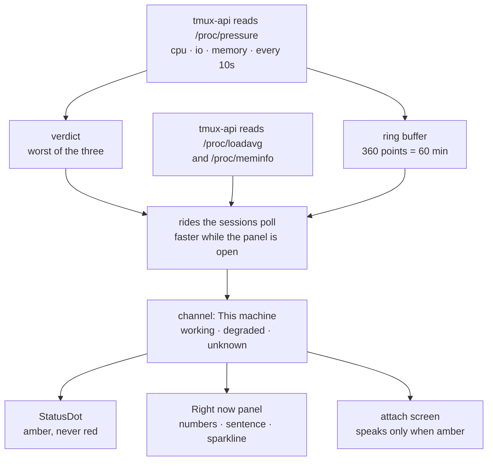

# Tell people when the box is the reason

Status: approved, not yet implemented. Viktor, 2026-09-12.
Parent: [ADR-0016, a client can see whether it is connected](../adr/0016-connection-status-in-the-ui.md),
whose five-channel model this extends by one.

## The report

Viktor, 2026-09-12: *"adding some health indicators for terminal loading. The
goal is to allow users to know the load of the machine and the overall health.
If the machine is overloaded, then users should expect worse behaviour and
slowness of the machine."*

ADR-0016 gave a person five answers to "why is this slow" — the terminal socket,
the transcript stream, the session list poll, notifications, and a stale build.
All five are about the client. None of them can say the sixth thing, which is
that the box itself is stalling and every one of those channels is healthy.

Today the box answers that question only through Prometheus and Grafana, which
is not somewhere the person holding the slow terminal can go.

```stats
6 | channels after this, up from five
3 | resources read, from /proc/pressure
2.4 % | of the last 30 days the dot would have been amber
17 h | of the last 696, measured not estimated
0 | new HTTP requests in the common case
1 | new row in Settings → Network
```

## What this box actually does

Read on the devvm on 2026-09-12, 56.2 days into the current boot, and
cross-checked against the same counters in Prometheus (`node_pressure_*`,
`instance="devvm"`, which agree to within a few minutes of accumulation).

| resource | stalled (some) | stalled (full) | % of uptime (some) |
|---|---|---|---|
| IO | 40.50 h | 37.71 h | 3.00% |
| CPU | 8.92 h | 0.00 h | 0.66% |
| memory | 2.85 h | 2.58 h | 0.21% |

Two things in that table shape the design.

**IO stall is 4.5 times more common than CPU stall here.** The picture people
carry of an overloaded machine is a busy CPU, and on this box that is the rarer
event.

**For IO, `full` is almost equal to `some`.** PSI's `some` counts time at least
one task was stalled; `full` counts time *every* non-idle task was. When this
box stalls on IO, it stalls everyone at once, which is the experience the
feature exists to name.

Load average over the same 30 days, normalised per core (32 vCPUs):

| percentile | load1 / core |
|---|---|
| p50 | 0.056 |
| p75 | 0.101 |
| p90 | 0.176 |
| p95 | 0.308 |
| p99 | 1.089 |
| max | 5.357 |

Load sits near zero almost always and its p99 is right at the classic "one per
core" line. It is a usable number, and on its own it would have stayed calm
through most of the 40 hours of IO stall above, because a load average blends
runnable and blocked tasks into a single figure and cannot say which it is
counting.

## Why the colour comes from pressure, not from load

Linux PSI measures the thing being asked about directly: wall-clock time lost to
waiting for a resource. "The box feels slow" and "tasks are stalled" are the
same sentence.

Load average stays on screen, because it is the number people recognise and
because it is the one that survives when PSI is missing. It does not pick the
colour.

The three pressures have different distributions on this hardware, so they do
not share a threshold:

| percentile | CPU some | IO full | memory full |
|---|---|---|---|
| p50 | 0.22% | 0.14% | — |
| p90 | 0.86% | 12.87% | 0.19% |
| p95 | 2.83% | 25.28% | — |
| p99 | 10.06% | 52.20% | 6.91% |
| max | 60.39% | 87.59% | 56.59% |

A single shared line at 10% would paint amber roughly 5% of the month on IO
alone while CPU almost never spoke. Each resource gets its own line instead,
each chosen to land near the same rarity.

## The thresholds, and where they came from

| resource | amber above | hours in 30 d | % of month |
|---|---|---|---|
| CPU, `some` | 10% | 7.17 | 1.0% |
| IO, `full` | 50% | 7.33 | 1.0% |
| memory, `full` | 10% | 4.83 | 0.67% |
| **any of the three** | | **17.00** | **2.44%** |

Derived from 696 hours of Prometheus history for `instance="devvm"` rather than
picked as round numbers. The target was 1-3% of the time — about half an hour a
day, rare enough to carry meaning and common enough that people will have seen
it before the day it matters.

These are defaults, set as environment on the systemd unit
(`TL_HEALTH_CPU_PCT`, `TL_HEALTH_IO_PCT`, `TL_HEALTH_MEM_PCT`), because the
package installs on machines other than this one and the distribution above is
this machine's. They are ratios and percentages throughout, so a four-core
laptop is read on the same scale rather than permanently amber.

## The design



### A sixth channel, not a second indicator

`This machine` joins `ChannelId` in
[`frontend-v2/src/diagnostics/status.ts:36`](../../frontend-v2/src/diagnostics/status.ts)
and appears in both `SESSION_CHANNELS` (`:59`) and `LOBBY_CHANNELS` (`:73`). The
scoping rule that keeps the model honest — a surface reports only what it can
honestly report — admits it to both: unlike a terminal socket, the box is the
same box whichever screen you are on.

A person with a frozen terminal asks one question. One dot should answer it
whether the cause is their link or the machine, and `worst()` (`:130`) already
does that arithmetic.

### It reaches degraded and stops there

| state | what it means | can the machine cause it |
|---|---|---|
| working | nothing to say | yes |
| degraded | reason to wait | yes |
| down | reason to act | no |
| unknown | not reporting | yes |

ADR-0016 settled that `degraded` means wait and `down` means act. There is no
action a person can take about a busy machine, and the box is plainly not down —
they are talking to it. If load ever gets bad enough to break the poll, the
Session list channel turns red and says so on its own row, which is the accurate
statement.

Red therefore keeps its single existing meaning, "you are disconnected"
(`app.css:118`, `badgeWord` returning "Offline" at `status.ts:154`).

### Depth is carried by the sentence

With two usable states, the dot cannot separate a brush against the threshold
from a sustained grind. The words can, and they are what someone opening the
panel reads anyway:

| condition | sentence |
|---|---|
| under every line | *(no sentence; the row reads "Fine")* |
| over a line | "Typing and commands may feel slow. The machine is busy." |
| over twice a line, sustained | "Typing and commands are slow right now. The machine is very busy." |

Effect first, cause second, because the reader arrived at the panel already
holding the effect.

### The panel row

Settings → Network → Right now gains a sixth row, `This machine`, below `Build`:

- the three pressure readings and the load average, as numbers;
- the sentence above;
- a 60-minute sparkline of the deciding pressure — the worst of the three at
  each sample, so the line and the colour never disagree.

An hour is long enough to tell a fading spike from something that started before
the reader sat down. One line rather than three keeps it readable in the roughly
200 px a phone gives it; which resource is responsible is named in the numbers
directly above.

`Run check` treats it as a sixth probe and fetches a fresh reading. It is the
cheapest of the six, and a row that sits still while five others refresh reads
as broken.

### The panel's healthy sentence changes by one word

`verdict()` (`status.ts:193`) returns "Everything is connected." today. With a
row that reports the machine, that claims something narrower than the panel now
checks, so it becomes **"Everything is working."**

### The attach screen speaks only when amber

Clicking a session on a healthy box looks exactly as it does today. When the
machine is amber at that moment, the opening screen carries one extra line
saying so. A fast attach should not grow statistics; a slow one should explain
itself.

## Where the numbers come from

**Reading.** `tmux-api` samples `/proc/pressure/{cpu,io,memory}`,
`/proc/loadavg` and `/proc/meminfo` every 10 seconds on its own goroutine,
following the pattern `runPrewarmReaper` already uses (`main.go:361`). These are
world-readable; no privilege and no helper is involved.

**Delivering.** The reading rides the session-list poll, which the client
already runs every 5 seconds and backs off to 30 under failure
(`store/lobby.ts:277`). `tmux-api/netinfo.go:51` established this pattern in
this codebase: `X-TL-Net` puts a server fact on a response the client already
asks for, "so attribution costs no request of its own." Machine health follows
it. While the Right now panel is open the client asks a small dedicated endpoint
every few seconds, which is the one moment someone is watching the number move.

**History.** A 360-entry ring buffer in the Go service, 10 seconds apart,
covering an hour in a few kilobytes. Prometheus holds the same data at 26 weeks
and higher fidelity, and querying it would tie Terminal Lobby to this homelab's
monitoring stack and hand every other install a blank graph. The ring buffer
empties on service restart, which is honest and infrequent.

**When PSI is missing** — older kernels, some container runtimes, the Docker
dev environment — the row falls back to load average and memory headroom and
says in words that it is doing so. ADR-0016's argument applies: a row that
disappears reads as a bug and cannot be asked about, and a degraded signal is
worth more than a blank one as long as it does not pretend to be the good one.

## What we are not doing

**Showing what is eating the box.** No process list, no per-user breakdown. The
goal Viktor set is expectation-setting, and a top-N of other people's commands
on a shared box is a different feature with a privacy question attached.

**Reporting your own slice.** The devvm gives each user a 24 GB cap and each
pane a 6 GB scope cap, so "you are at your cap" is a real and more actionable
fact than "the box is busy". It is also a second number to explain on a surface
that currently has none. Out of this cut, not out of the idea.

**CPU steal.** Measured and deliberately excluded. Steal on this VM sat above
10% for 8.67 hours of the last 30 days and peaked at 43.8%, which is the
hypervisor giving vCPUs to other guests; nothing inside the box looks
responsible while it happens. Viktor's call was to keep the first cut to the
three resources a person can reason about. The consequence to record: the
indicator can read green through a slow hour whose cause is outside this VM.

**Disk space, swap, and the lobby's own services.** Each is a defensible
addition and each widens what the row has to explain. Swap is the closest call —
8 GB of 23 GB is in use right now, and swapping is felt directly.

**Changing what the app does under load.** Backing off the hover-preload or
stretching timeouts when the box is busy would give the app's slowness two
causes that cannot be told apart from the outside. It reports; it does not
react.

**New telemetry.** Prometheus already keeps all of this for 26 weeks at higher
fidelity than the panel displays. A second, lower-fidelity copy sent from the
browser would spend the ADR-0008 rate budget on data we already hold.

**Alerting anyone.** No toast, no push. Host-level alerting already exists, and the
expectation is that a second channel repeating it would reduce attention to
both.

## Open questions

- The thresholds are calibrated against this box's last 30 days. Whether 2.4%
  is the right amount of amber is a judgement about attention, not a
  measurement, and the first month of real use is what tests it.
- The IO figure is the one to watch. `full` IO pressure above 50% for 7.33 hours
  a month is a strong claim about how often this box freezes for everyone, and
  it has not yet been matched against anyone reporting that it did. If they
  disagree, the threshold moves, and the mismatch is itself worth understanding.
- The sentence wording has not been read by anyone but its author. "The machine
  is busy" may land as an excuse rather than as information.
- A restart empties the ring buffer, so the sparkline is short exactly after a
  deploy. Whether that is annoying enough to warrant persisting it is a question
  for after it ships.
