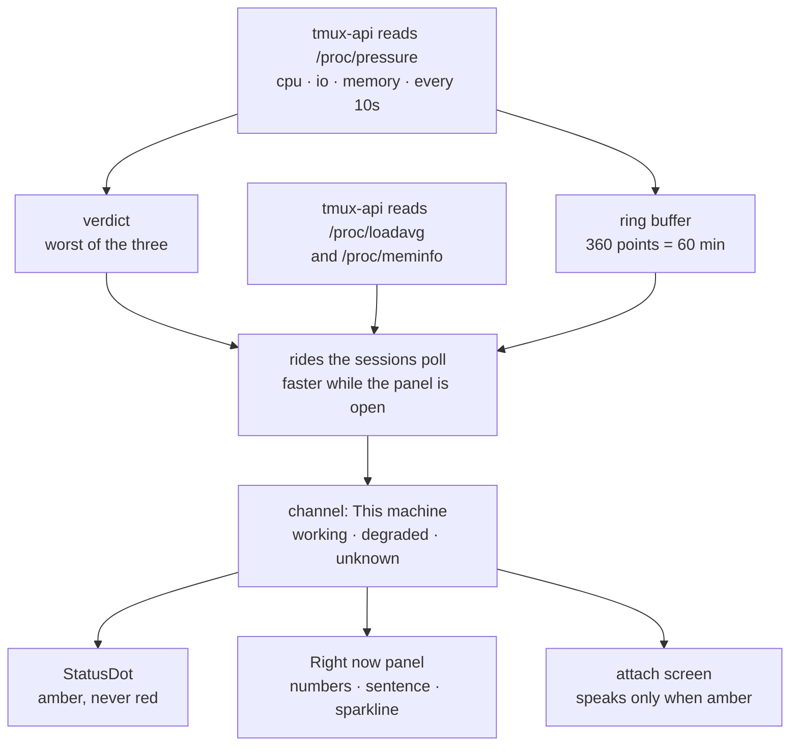

# Tell people when the box is the reason

Status: approved, not yet implemented. Viktor, 2026-09-12.
Parent: [ADR-0016, a client can see whether it is connected](../adr/0016-connection-status-in-the-ui.md),
whose five-channel model this extends by one.

## The report

Viktor, 2026-09-12: *"adding some health indicators for terminal loading. The
goal is to allow users to know the load of the machine and the overall health.
If the machine is overloaded, then users should expect worse behaviour and
slowness of the machine."*

ADR-0016 gave a person five answers to "why is this slow" — the terminal socket,
the transcript stream, the session list poll, notifications, and a stale build.
All five are about the client. None of them can say the sixth thing, which is
that the box itself is stalling and every one of those channels is healthy.

Today the box answers that question only through Prometheus and Grafana, which
is not somewhere the person holding the slow terminal can go.

```stats
6 | channels after this, up from five
3 | resources read, from /proc/pressure
2.4 % | of the last 30 days the dot would have been amber
17 h | of the last 696, measured not estimated
0 | new HTTP requests in the common case
1 | new row in Settings → Network
```

## What this box actually does

Read on the devvm on 2026-09-12, 56.2 days into the current boot, and
cross-checked against the same counters in Prometheus (`node_pressure_*`,
`instance="devvm"`, which agree to within a few minutes of accumulation).

| resource | stalled (some) | stalled (full) | % of uptime (some) |
|---|---|---|---|
| IO | 40.50 h | 37.71 h | 3.00% |
| CPU | 8.92 h | 0.00 h | 0.66% |
| memory | 2.85 h | 2.58 h | 0.21% |

Two things in that table shape the design.

**IO stall is 4.5 times more common than CPU stall here.** The picture people
carry of an overloaded machine is a busy CPU, and on this box that is the rarer
event.

**For IO, `full` is almost equal to `some`.** PSI's `some` counts time at least
one task was stalled; `full` counts time *every* non-idle task was. When this
box stalls on IO, it stalls everyone at once, which is the experience the
feature exists to name.

Load average over the same 30 days, normalised per core (32 vCPUs):

| percentile | load1 / core |
|---|---|
| p50 | 0.056 |
| p75 | 0.101 |
| p90 | 0.176 |
| p95 | 0.308 |
| p99 | 1.089 |
| max | 5.357 |

Load sits near zero almost always and its p99 is right at the classic "one per
core" line. It is a usable number, and on its own it would have stayed calm
through most of the 40 hours of IO stall above, because a load average blends
runnable and blocked tasks into a single figure and cannot say which it is
counting.

## Why the colour comes from pressure, not from load

Linux PSI measures the thing being asked about directly: wall-clock time lost to
waiting for a resource. "The box feels slow" and "tasks are stalled" are the
same sentence.

Load average stays on screen, because it is the number people recognise and
because it is the one that survives when PSI is missing. It does not pick the
colour.

The three pressures have different distributions on this hardware, so they do
not share a threshold:

| percentile | CPU some | IO full | memory full |
|---|---|---|---|
| p50 | 0.22% | 0.14% | — |
| p90 | 0.86% | 12.87% | 0.19% |
| p95 | 2.83% | 25.28% | — |
| p99 | 10.06% | 52.20% | 6.91% |
| max | 60.39% | 87.59% | 56.59% |

A single shared line at 10% would paint amber roughly 5% of the month on IO
alone while CPU almost never spoke. Each resource gets its own line instead,
each chosen to land near the same rarity.

## The thresholds, and where they came from

| resource | amber above | hours in 30 d | % of month |
|---|---|---|---|
| CPU, `some` | 10% | 7.17 | 1.0% |
| IO, `full` | 50% | 7.33 | 1.0% |
| memory, `full` | 10% | 4.83 | 0.67% |
| **any of the three** | | **17.00** | **2.44%** |

Derived from 696 hours of Prometheus history for `instance="devvm"` rather than
picked as round numbers. The target was 1-3% of the time — about half an hour a
day, rare enough to carry meaning and common enough that people will have seen
it before the day it matters.

These are defaults, set as environment on the systemd unit
(`TL_HEALTH_CPU_PCT`, `TL_HEALTH_IO_PCT`, `TL_HEALTH_MEM_PCT`), because the
package installs on machines other than this one and the distribution above is
this machine's. They are ratios and percentages throughout, so a four-core
laptop is read on the same scale rather than permanently amber.

## The design



### A sixth channel, not a second indicator

`This machine` joins `ChannelId` in
[`frontend-v2/src/diagnostics/status.ts:36`](../../frontend-v2/src/diagnostics/status.ts)
and appears in both `SESSION_CHANNELS` (`:59`) and `LOBBY_CHANNELS` (`:73`). The
scoping rule that keeps the model honest — a surface reports only what it can
honestly report — admits it to both: unlike a terminal socket, the box is the
same box whichever screen you are on.

A person with a frozen terminal asks one question. One dot should answer it
whether the cause is their link or the machine, and `worst()` (`:130`) already
does that arithmetic.

### It reaches degraded and stops there

| state | what it means | can the machine cause it |
|---|---|---|
| working | nothing to say | yes |
| degraded | reason to wait | yes |
| down | reason to act | no |
| unknown | not reporting | yes |

ADR-0016 settled that `degraded` means wait and `down` means act. There is no
action a person can take about a busy machine, and the box is plainly not down —
they are talking to it. If load ever gets bad enough to break the poll, the
Session list channel turns red and says so on its own row, which is the accurate
statement.

Red therefore keeps its single existing meaning, "you are disconnected"
(`app.css:118`, `badgeWord` returning "Offline" at `status.ts:154`).

"Amber" is shorthand throughout this document. The degraded colour is the
theme's `--state-running`, which is `#d4a574` in one theme, `#4493f8` in slate,
`#e8e8e8` and `#b5482d` in two others (`theme/theme.css:136,174,212,250`). The
machine's degraded dot therefore looks exactly like the terminal's degraded dot,
which is the point: a reader learns one colour, not six.

### Depth is carried by the sentence

With two usable states, the dot cannot separate a brush against the threshold
from a sustained grind. The words can, and they are what someone opening the
panel reads anyway:

| condition | sentence, printed at the top of the panel |
|---|---|
| under every amber line | *(no sentence; the row reads "Fine")* |
| over an amber line | "Typing and commands may feel slow. The machine is busy." |
| over a very-busy line | "Typing and commands are slow right now. The machine is very busy." |

The very-busy line is its own calibrated number per resource, not a multiple of
the amber one. The first draft of this said "over twice a line", and building it
showed why that does not work: IO's amber line is 50%, twice it is 100%, and
100% is the ceiling of a stall rate. IO could never have reached the tier, not
even during a total ten-minute stall. Measured maximum on this box is 87.59%.

| resource | amber | hours/30 d | very busy | hours/30 d |
|---|---|---|---|---|
| CPU, `some` | 10% | 7.17 | 20% | 2.50 |
| IO, `full` | 50% | 7.33 | 70% | 1.17 |
| memory, `full` | 10% | 4.83 | 20% | 1.33 |

Each very-busy line lands between 1 and 2.5 hours a month, so the tier says the
same thing whichever resource raises it — the same reasoning that gave each
resource its own amber line. CPU and memory happen to sit at twice their amber
lines; only IO moves, from unreachable to reachable.

Three more environment variables carry them: `TL_HEALTH_CPU_VERY_PCT`,
`TL_HEALTH_IO_VERY_PCT`, `TL_HEALTH_MEM_VERY_PCT`.

"Sustained" is not a separate condition. The rates are ten-minute windows, so a
reading over a line has already lasted ten minutes and cannot be a blip;
requiring consecutive samples on top would charge the same constraint twice.

Effect first, cause second, because the reader arrived at the panel already
holding the effect.

### The panel row

Settings → Network → Right now gains a sixth row, `This machine`, below `Build`:

- the three pressure readings and the load average, as numbers;
- its short phrase, naming the resource, the way the other five rows do;
- a 60-minute sparkline of the deciding pressure — the worst of the three at
  each sample, so the line and the colour never disagree.

### The chart says what it is

The first cut of the chart carried no visible words at all. Its only
explanation was the `aria-label` on the `<svg>`, which is exactly the reader who
does not need it: anyone looking at the chart saw a line, a dotted line, and no
way to tell what either meant. Asked twice in a row what it showed, the honest
answer was that nothing on screen said.

Three labels, each answering a question the shape cannot:

| element | what it settles |
|---|---|
| caption above | "How close the busiest of the three is to its limit" — the y axis |
| axis ends below | `1h ago` … `now` — the x axis, and which end is the present |
| dashed swatch | `busy line` — what the rule at 1.0 is |

The y axis needs saying because height is each reading over its **own**
resource's limit rather than a percentage: 20% stall is over the line for CPU
and nowhere near it for IO, so on a raw-percent axis those two points would sit
at the same height and mean opposite things. The resource being drawn also
changes from point to point, which is why the caption names "the busiest of the
three" rather than one of them.

Every label is HTML outside the `<svg>`, never SVG `<text>`. The chart is drawn
with `preserveAspectRatio="none"` so a wider panel gets a longer hour instead of
a fatter line, and that same stretch would smear text inside the viewBox
sideways.

Four things needed correcting after the first version, none of which a test
caught and all of which a screenshot made obvious:

- the empty state ran `No readings yet` straight into the axis row, because
  `.tl-spark` was a flex row at a fixed 40px and the labels sat beside the chart
  rather than under it;
- that same empty state captioned a `busy line` when no chart and no rule were
  drawn, which is a label for something absent. The axis row now renders only
  when a chart does;
- the swatch was grey while the rule it names is `--state-running`. It is the
  only thing tying a fixed label row to a rule whose height moves with the data,
  so it has to look like the rule rather than sit near it;
- the caption read "hour by hour", which suggests several hours of buckets
  rather than one continuous hour. The axis ends already carry the timespan, so
  the caption gave that job up and took the y axis instead.

The sentence is on the row **only when the top of the panel has stopped saying
it**. The first build printed it in both places and a screenshot at 355px showed
the cost: `verdict()` already prints it whenever the machine is the only channel
complaining, which is the common case because a busy box breaks nobody's socket,
so the same words appeared twice seven rows apart.

Dropping it from the row entirely was the first fix, and it removed the sentence
from a case that still needed it. The moment anything else is also complaining,
`verdict()` becomes "2 things need attention" and the sentence leaves the panel
altogether — and that is the case it exists for, because the dot is amber for a
brush past a threshold and for a sustained grind alike, and the sentence is the
only thing separating them. So the row picks the sentence up exactly where the
headline drops it, and both tiers of the handoff are pinned by tests.

An hour is long enough to tell a fading spike from something that started before
the reader sat down. One line rather than three keeps it readable in the roughly
200 px a phone gives it; which resource is responsible is named in the numbers
directly above.

`Run check` treats it as a sixth probe and fetches a fresh reading. It is the
cheapest of the six, and a row that sits still while five others refresh reads
as broken.

### The panel's healthy sentence changes by one word

`verdict()` (`status.ts:193`) returns "Everything is connected." today. With a
row that reports the machine, that claims something narrower than the panel now
checks, so it becomes **"Everything is working."**

### There is no attach screen, and the session bar already answers

The design asked for one extra line on the opening screen when the machine is
amber at the moment someone clicks a session. Building it found that there is no
opening screen to put a line on: the terminal was de-iframed (`term.html` was
deleted in `2c64552`), `TerminalNative` paints when it is ready, and there
is no loading overlay, spinner or placeholder anywhere between the click and the
first frame.

Adding one would be a far larger change than this design authorises, and it
would make every fast attach worse to excuse the rare slow one.

The requirement turns out to be met without new code. `machine` is in
`SESSION_CHANNELS`, so the session bar's own `StatusDot` already carries it: open
a session on a stalling box and the dot beside the session name is amber, and
tapping it opens the panel that explains why. That is the same indicator, on the
same surface, at the same moment — reached by the channel being scoped correctly
rather than by a second surface saying the same thing.

## Where the numbers come from

**Reading.** `tmux-api` samples `/proc/pressure/{cpu,io,memory}`,
`/proc/loadavg` and `/proc/meminfo` every 10 seconds on its own goroutine,
following the pattern `runPrewarmReaper` already uses (`main.go:361`). These are
world-readable; no privilege and no helper is involved.

**Delivering.** The reading rides the session-list poll, which the client
already runs every 5 seconds and backs off to 30 under failure
(`store/lobby.ts:277`). `tmux-api/netinfo.go:51` established this pattern in
this codebase: `X-TL-Net` puts a server fact on a response the client already
asks for, "so attribution costs no request of its own." Machine health follows
it, and it has to be a header rather than a field in the body: the `/sessions`
body is cached per OS user for 5 seconds (`tmux-api/main.go:155`), while the
header is stamped per response before the cache lookup (`sessions.go:29-32`).
While the Right now panel is open the client asks a small dedicated endpoint
every few seconds, which is the one moment someone is watching the number move.

**History.** A 360-entry ring buffer in the Go service, 10 seconds apart,
covering an hour in a few kilobytes. Prometheus holds the same counters for the
devvm, but at a 2-minute scrape interval and roughly 13 weeks of coverage
(61,343 samples, 85.2 days) rather than the 26 weeks the k8s nodes get. For a
60-minute window that is 30 points against the ring buffer's 360, so querying it
would give a coarser graph, not a better one, and would tie Terminal Lobby to
this homelab's monitoring stack and hand every other install a blank panel. The
ring buffer empties on service restart, which is honest and infrequent.

**Too short a window reports figures but no colour.** The thresholds *are*
ten-minute rates, so a narrower window measured against them is a noisier
measurement wearing the same number. Below four minutes the state stays
`unknown` — which this model already defines as "has not reported", and which
every rule skips rather than counting as health or as fault. Every figure is
still filled in, so the panel shows live numbers throughout and only the dot
waits.

Both ends of that bar came from driving a real `tmux-api`, and each moved it.

Ten seconds after start it reported `ioPct 53.68` against a 50% amber line,
which in the first implementation painted the dot amber off a single sample
interval. So the colour had to wait for something.

Waiting for the full ten minutes was the second try, and it was too strict in
the direction that matters. On a box at 2.59 runnable tasks per core, with IO
stalled 82.12% and memory 24.72% — both past their very-busy lines — the
endpoint reported `unknown`, because the process had been up 5.7 minutes. Every
number said the box was grinding and the dot stayed grey. A deploy is often what
preceded the grinding, so ten minutes of silence suppresses the case the channel
exists for.

Four minutes is the shortest bar the data supports. Moving the window from ten
minutes to four moves the hours over each line, measured over 30 days:

| resource | 10-minute window | 4-minute window |
|---|---|---|
| CPU `some` > 10% | 7.17 h | 9.33 h |
| IO `full` > 50% | 7.33 h | 8.17 h |
| memory `full` > 10% | 4.83 h | 4.17 h |

Noise cuts both ways, and the union lands near 2.9% of the month against the
2.44% the ten-minute lines were calibrated to. Still inside the 1-3% this was
designed for, and it buys back six of the ten blind minutes after a restart.

**When PSI is missing** — older kernels, some container runtimes, the Docker
dev environment — the row falls back to load average and memory headroom and
says in words that it is doing so. ADR-0016's argument applies: a row that
disappears reads as a bug and cannot be asked about, and a degraded signal is
worth more than a blank one as long as it does not pretend to be the good one.

## What we are not doing

**Showing what is eating the box.** No process list, no per-user breakdown. The
goal Viktor set is expectation-setting, and a top-N of other people's commands
on a shared box is a different feature with a privacy question attached.

**Reporting your own slice.** The devvm gives each user a 24 GB cap and each
pane a 6 GB scope cap, so "you are at your cap" is a real and more actionable
fact than "the box is busy". It is also a second number to explain on a surface
that currently has none. Out of this cut, not out of the idea — and cheaper than
it looks, because `tl-session-watch` already collects it: every 30 seconds, as
root, it attributes `memory.current`, the unreclaimable part of `memory.stat`
and `memory.max` per {user, session} and writes `tl_pane_memory_bytes` to a
node_exporter textfile (`tl-session-watch/collect.go:447-465`,
`emit.go:83-118`).

**CPU steal.** Measured and deliberately excluded. Steal on this VM sat above
10% for 8.67 hours of the last 30 days and peaked at 43.8%, which is the
hypervisor giving vCPUs to other guests; nothing inside the box looks
responsible while it happens. Viktor's call was to keep the first cut to the
three resources a person can reason about. The consequence to record: the
indicator can read green through a slow hour whose cause is outside this VM.

**Disk space, swap, and the lobby's own services.** Each is a defensible
addition and each widens what the row has to explain. Swap is the closest call —
8 GB of 23 GB is in use right now, and swapping is felt directly.

**Changing what the app does under load.** Backing off the hover-preload or
stretching timeouts when the box is busy would give the app's slowness two
causes that cannot be told apart from the outside. It reports; it does not
react.

**New telemetry.** Prometheus already keeps all of this for the devvm at a
2-minute interval over about 13 weeks. A second copy sent from the browser would
spend the ADR-0008 rate budget on data we already hold.

**Alerting anyone.** No toast, no push. Host-level alerting already exists, and the
expectation is that a second channel repeating it would reduce attention to
both.

## Open questions

- The thresholds are calibrated against this box's last 30 days. Whether 2.4%
  is the right amount of amber is a judgement about attention, not a
  measurement, and the first month of real use is what tests it.
- The IO figure is the one to watch. `full` IO pressure above 50% for 7.33 hours
  a month is a strong claim about how often this box freezes for everyone, and
  it has not yet been matched against anyone reporting that it did. If they
  disagree, the threshold moves, and the mismatch is itself worth understanding.
- The sentence wording has not been read by anyone but its author. "The machine
  is busy" may land as an excuse rather than as information.
- A restart empties the ring buffer, and the effect is sharper than "short".
  Each sparkline point is a ten-minute rate, so it needs a pair of samples ten
  minutes apart: for the first ten minutes after a restart the series is empty,
  not short. The dot colours at four minutes, so between four and ten minutes
  the row can be amber above a chart that says "no readings yet". That is
  accepted rather than fixed, because making the early points four-minute rates
  would put values on the axis that are not comparable to the later ones. Whether
  the gap is worth closing by persisting the buffer is a question for after it
  ships.
- The memory input may be watching the wrong level. Over the last 30 days
  `earlyoom` killed nothing and the host never approached OOM (minimum available
  memory 1.06 GiB across 13 weeks), while 73 processes were killed by the
  per-pane 6 GB cgroup cap: 51 vitest, 12 ffmpeg, 4 claude, every one
  `CONSTRAINT_MEMCG` against a `tmux-spawn-*.scope`. Memory pain here is mostly
  per-pane, and a machine-wide reading stays green through it. That strengthens
  the case for the deferred per-user slice, and it is worth settling before the
  memory threshold is trusted to carry its share.
