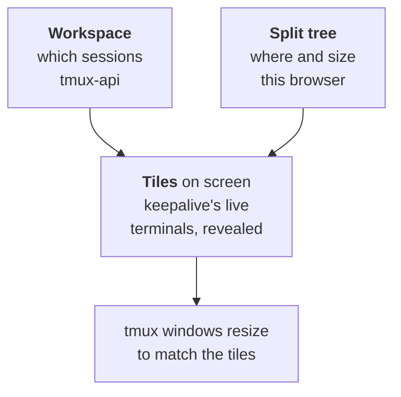
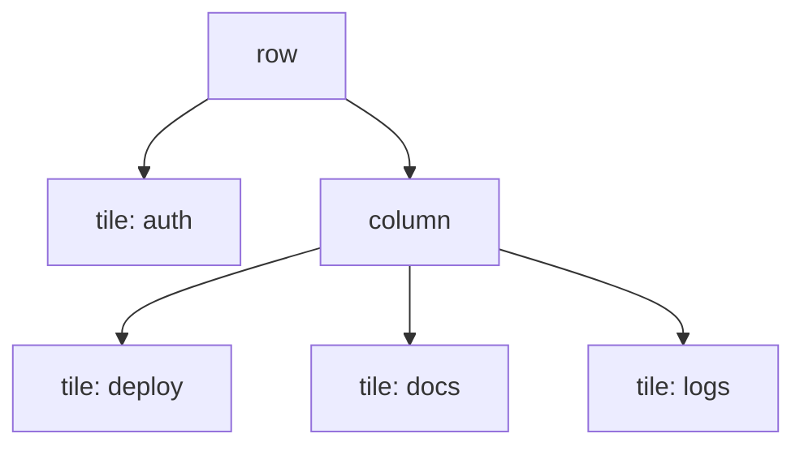
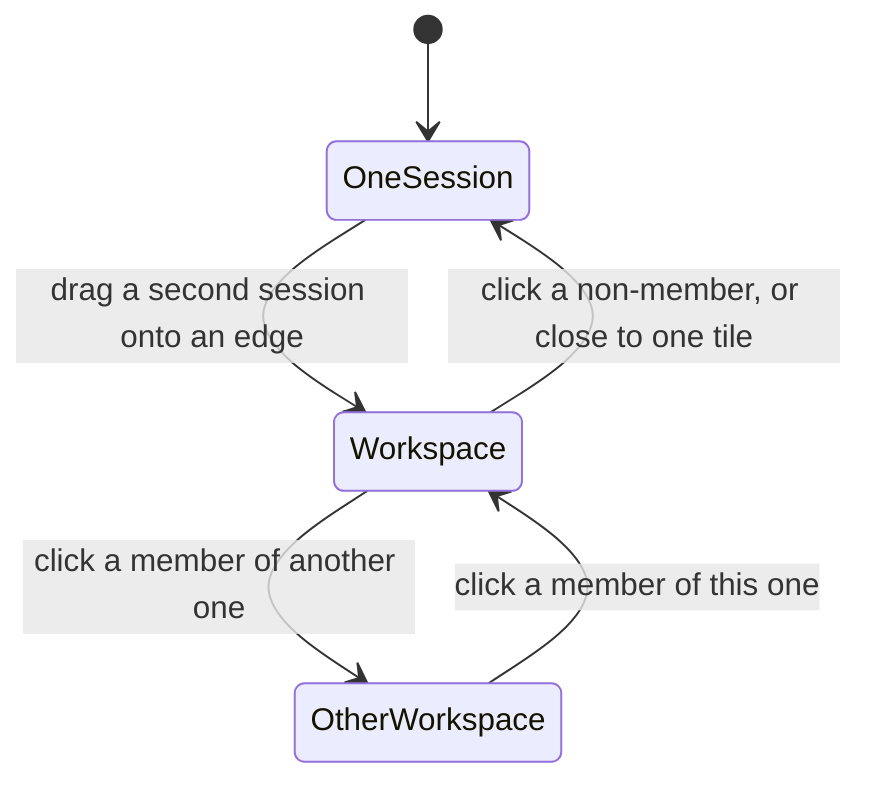

# Multi-session workspaces: several sessions on screen, dragged into place

Status: design, awaiting build
Date: 2026-09-12
From: a grilling session with Viktor
Related: ADR-0027 (the two decisions this design rests on)

Viktor, 2026-09-12: *"I want to be able to view multiple sessions at the same
time, similarly to how Agent Conductor or CMAX does it. I want to be able to
manually drag-and-drop sessions around to arrange my workspace."*

The job is driving more than one session at once — typing into two, comparing
their output — not watching a wall of agents from a distance. That decides the
rest: tiles hold real terminals at real fidelity, and the realistic count is
whatever the screen can hold rather than a number we pick.

## The shape in one picture



Three stores, each answering one question. The server says which sessions belong
together. The browser says how they are arranged on *this* screen. The tab
already holds the live terminals, so putting four on screen starts nothing new.

## What this costs, and why it is less than it looks

```stats
0 | new connections per extra tile
779 ms | to rebuild one terminal, if a slot ever moves
240 px | smallest tile a split may produce
1 | workspace a session may belong to
```

`frontend-v2/src/store/keepalive.ts` already keeps every session opened in a tab
mounted for 24 hours, each holding one ttyd WebSocket, one attached tmux client,
one SSE stream and one xterm buffer. `App.tsx:1139-1148` renders them all and
hides all but one:

```tsx
<For each={mounted()}>
  {(k) => {
    const shown = () => k.key === selectedKey();
    return <div class="tl-session-slot" classList={{ "tl-hidden": !shown() }}>
```

That single equality is the entire single-session assumption. Showing four
sessions at once adds no connections, no attaches and no xterms. It reveals what
is already running.

> [!IMPORTANT]
> The constraint that shapes everything else is in the comment above that loop:
> *"The slots are appended and never reordered, so a live terminal is never
> moved in the DOM."* Moving a slot's node disposes `TerminalNative`, which
> drops the xterm, the ttyd socket and the tmux attach — the 1,797 ms rebuild
> keepalive exists to avoid. So the split tree is a **positioning layer over a
> fixed DOM order**, never a reordering of it. ADR-0027 records this.

Two consequences follow, and both are visible to a person:

- Tiles cannot genuinely slide around under the cursor during a drag. A
  translucent drop shadow shows where the tile will land; tiles snap on release.
- The tree is realised as CSS grid areas (or computed rects) assigned to slots
  in their existing DOM order. Closing a tile changes an area assignment, not a
  DOM position.

## Language

Two new terms, added to `CONTEXT.md`. Three obvious candidates were already
taken: **Layout** is the per-user sidebar arrangement, **Project** is the
server-side session grouping, and **Grid** is a session's tmux window size in
columns and rows. **Pane** is tmux's own word for the splits inside a single
session, which `PaneKeypad.tsx` already drives.

**Tile** — one rectangle showing one session.
**Workspace** — the tree of tiles, and the set of sessions in it.

## Splits are the view

There is no multi-session *mode*. One session is a tree of one node, which is
what the lobby shows today and what a phone always shows. `shown()` becomes a
membership test against the visible set, and the parked-session logic, which
already asks "is this the session on screen", asks "is it in the visible set"
instead — a generalisation it needs regardless.

The alternative was a toggled mode leaving the single-session path byte-identical.
It ships sooner and leaves two rendering paths that every later feature has to
work in twice.

### The tree

N-ary rows and columns, like tmux's own layout. Three tiles across are one row
of three, so a divider moves exactly its two neighbours. A binary tree is easier
to serialise and lets one divider shift tiles that were not being dragged.



### Adding, moving, removing

| gesture | result |
|---|---|
| drag a sidebar session onto a tile's left, right, top or bottom third | splits that tile, new tile takes the dropped session |
| drag onto a tile's middle | replaces what is in that tile |
| drag a session already in the workspace | moves its tile; never duplicates it |
| drag a tile anywhere outside the split area | removes it from the workspace |
| the tile header's close control | the same removal, without the drag |
| drag a divider | resizes the two tiles either side |

Removing a tile leaves the session running and in the sidebar where it was.
Removing down to one tile ends the workspace: you are looking at a session
again.

**The same session cannot occupy two tiles.** keepalive mounts exactly one live
view per session, keyed by owner and name, so a duplicate means a second tmux
attach — and two tiles of one session would contend for its grid continuously,
which is what the grid pinning exists to prevent.

### Limits

No cap on the number of tiles; a bigger screen holds more. A minimum tile of
roughly 240px (about 30 columns at the default font) is enforced two ways: a
split that would take any tile below it is refused, and its drop preview shows
as invalid. If the browser window itself shrinks below what the tree needs, the
workspace shows only the focused tile and restores the full tree when the window
grows back, so a dragged-narrow window never loses an arrangement.

### Focus

Click a tile to focus it. The focused tile's header is highlighted and takes
every keystroke until you click elsewhere. No keyboard shortcuts in this
release — focus-follows-mouse was rejected because a stray mouse movement sends
keystrokes to a different agent, and in a terminal that means running them.

The existing `alt+1`…`alt+0` (attach session N) keep their current meaning: they
behave exactly as clicking that sidebar card does, described under "Entering and
leaving" below.

## Sizing: a tile sizes the real session

Each visible terminal tells tmux its size through
`claimGrid` → `POST /sessions/{name}/grid`. With one visible session, one grid
is claimed. With four, four are — so a session in a 45-column tile has a
45-column tmux window, for every device attached to it, and Claude Code re-wraps
its output to fit.

This is deliberate: the tile is the size the session is. Two alternatives were
considered and declined. Shrinking the font per tile to preserve ~80 columns keeps other devices out of it but makes a
terminal font render at fractional sizes. Flooring the grid and scrolling the
tile puts a horizontal scrollbar on a terminal.

**Every visible tile re-claims its grid after any change to the visible set** —
leaving a workspace, removing a tile, dragging a divider, resizing the window.
Without this, a session narrowed by a tile stays narrow: a pinned tmux window
only re-reads its clients on an attach, a detach or a resize, and switching a
slot's visibility is none of those. That exact failure was measured on
2026-09-06, a desktop reading at 231x62 sitting inside a 60-column window with a
page reload the only fix. A session nobody is showing keeps its last size until
something shows it again, which is today's behaviour unchanged.

There is no zoom. tmux's `resize-pane -Z` has an equivalent here — leaving the
workspace shows the session full size — and a second way to temporarily enlarge
a tile is a mode to get stuck in.

### Watching tiles

A tile attached read-only carries the existing watch indicator in its header,
never calls `claimGrid`, and renders the session at whatever size its drivers
gave it, centred with dead space around it where the tile does not match. A
read-only client taking the size is the one thing the pinning exists to stop,
and the server cannot tell two devices of one person apart — the caller
declining is what keeps that promise.

## Workspaces

A workspace is created implicitly by the first split and never needs a name. It
is identified by its members.

**A session belongs to at most one workspace.** Dragging a session that is
already in workspace A into workspace B moves it: A loses that tile and reflows,
the way moving a session between projects already works, and the undo stack can
take it back.

### Where the two halves live

| what | where | why |
|---|---|---|
| workspace id, ordered members | tmux-api, per user, beside `layout/<user>.json` | it is durable intent about the work, it changes what the sidebar does, and two tabs on one machine must agree |
| the split tree and tile sizes | this browser, beside `store/device-prefs.ts` | a 32-inch split is meaningless on a laptop; the same reasoning that keeps sidebar collapse state per-browser |

ADR-0027 records this boundary. A device that has never seen a workspace has no
geometry for it, and **auto-arranges evenly in the workspace's server-side
member order** — two members split vertically, three or four as a 2x2, and so
on. Deterministic, so the same workspace looks the same on any fresh device, and
the first drag makes it that device's own.

### Entering and leaving

The sidebar marks every member of the current workspace. Two levels: all members
carry a quieter version of the active treatment, and the focused tile's card
keeps the full one it has today, so the sidebar still says where the keystrokes
are going. Members can sit in different projects, so they are not adjacent and
no bracket can join them.



Clicking a sidebar session that belongs to no workspace leaves the workspace and
shows that session alone. The workspace is not lost — clicking any of its
members brings the whole thing back, with the clicked tile focused. Workspaces
are places you enter and leave, and a plain session click behaves as it does
today.

### Death and restore

A member being killed dims its tile and strikes it through with the `↺` arrow
and the seconds counting down, exactly as a sidebar card does. When the Grace
window closes, the tile closes and its siblings reflow.

**A kill keeps membership.** Only a deliberate close or drag-out removes a
session from a workspace, so restoring that session later puts its tile back —
the same behaviour `assignments/<user>.json` already gives project assignment,
and for the same reason.

## Everything else, and what changes

| surface | behaviour |
|---|---|
| tile header | ~24px: title, state dot, watch indicator when read-only, close. Nothing else — context meter and spend stay on the session bar |
| session bar | one bar, showing the focused tile's session. Its contents change as focus moves |
| Ctrl+J dock | full width under every tile, exactly where it is today. It is one scratch shell for the tab, not per tile |
| terminal or text per tile | a tile honours `store/viewmode.ts`, which is already per session per device. The bar's view switch changes the focused tile, and the split geometry is unaffected by it |
| URL | still names one session. Because membership is server-side, opening a member's URL restores its workspace with that tile focused, so a shared link round-trips |
| notifications | every visible tile counts as open. Whatever suppression the open session gets today — push, bell badge, unseen marker — applies to the whole visible set |
| cold start | entering a workspace attaches every member at once |
| undo | every structural change goes on the existing stack, resizes included. Resize entries coalesce, or one divider drag fills all 25 slots |
| preload on hover | unchanged. Hovering a non-member still attaches it hidden; clicking promotes it and takes over the view |
| phones | coarse pointer at 720px or narrower sees no workspaces: clicking a member opens that session alone, as today |
| touch above 720px | full split view, finger drag included. `@formkit/drag-and-drop` was adopted partly for touch, so edge-drop should largely come for free — worth a real device check before calling it done |
| lens (`?as=<user>`) | reads the target's membership and highlights members. The split tree is the lens tab's own, since geometry is device-local. It cannot add, remove or reorder members |

> [!WARNING]
> The notification change deserves its own test. A push about a member of a
> workspace you are looking at will stop arriving, and notification tap routing
> has broken three times before, most recently on 2026-09-01.

## Build notes

One release, both halves together.

**Frontend**

- `App.tsx:1141` — `shown()` becomes a visible-set test.
- A new `store/workspace.ts` for the tree: n-ary nodes, sizes, the focused tile,
  and the add/move/remove/resize operations. Pure, so it tests without a DOM.
- A positioning layer assigning grid areas to existing slots. No slot moves.
- Tile chrome and the drop-shadow drag, built on `src/dnd/` rather than a second
  drag implementation.
- Grid re-claim on every visible-set change, declining while watching.
- Undo handlers beside the existing ones in `store/undo.*`.
- Geometry persisted per device, beside `store/device-prefs.ts`.

**tmux-api**

- A workspaces document per user, next to `layout/<user>.json`: id, ordered
  members, and the exclusivity rule. `GET`/`PUT`, validated the way `layout.go`
  validates.
- Membership survives a kill, the way `assignments/<user>.json` does.

**Tests** — the tree operations are pure and get property-based tests: any
sequence of splits, moves, removes and resizes leaves a tree where every tile is
at or above the minimum, no session appears twice, and removing to one tile ends
the workspace.

**Verification before this is called done** — drive the real
`terminal.viktorbarzin.me` in a browser: build a four-tile workspace, type into
two of them, confirm each session's tmux window matches its tile
(`tmux list-windows` on the devvm), leave and re-enter the workspace, and
screenshot it. A green test suite does not show that four terminals stayed
attached.

## Open questions

- The minimum tile of ~240px is a proposal, not a measurement. It should be set
  from what a Claude Code TUI actually needs to stay usable, checked on the real
  thing.
- Whether `@formkit/drag-and-drop` handles edge-region drops (as opposed to list
  reordering) without a custom drop-target layer is unconfirmed. If it does not,
  the drop targets are ours and the library contributes the pointer handling
  only.
- Attaching every member at once on a cold tab is the chosen behaviour and has
  not been measured at six members on a slow connection. If the first paint
  suffers, staggering the non-focused tiles is the fix and changes nothing else
  in this design.
