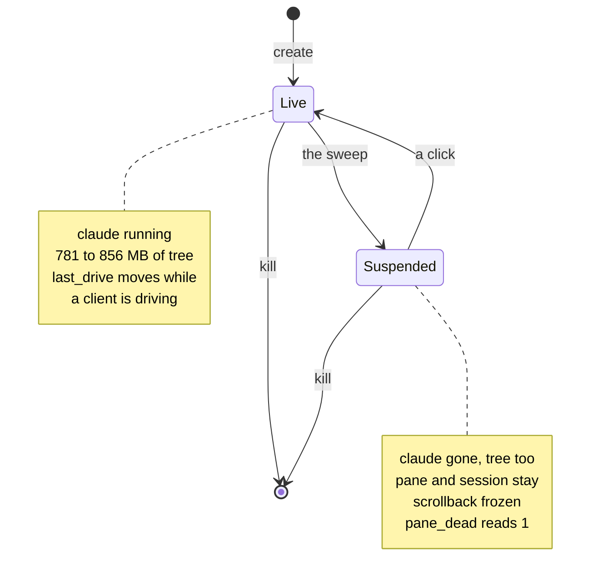
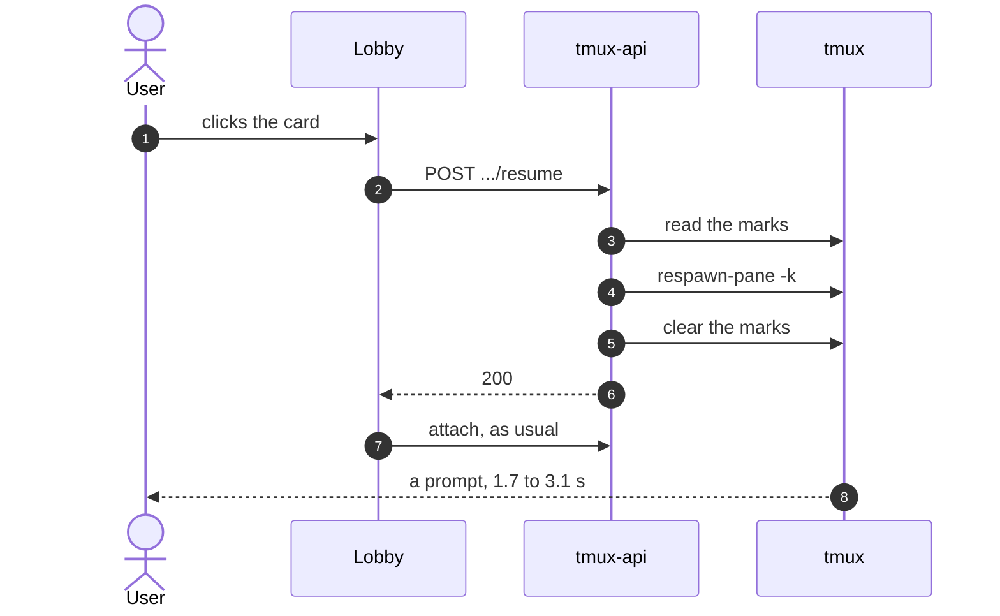

# Suspend a session nobody has driven for three days

Status: approved, being implemented. Viktor, 2026-09-19.
Decision record: [ADR-0030](../adr/0030-a-quiet-session-gives-its-memory-back.md).
Glossary: **Suspended session**, **Resume**, **Idle age**, **Suspend threshold**
in [CONTEXT.md](../../CONTEXT.md).

## What this buys

```stats
16.5 GiB | held by 38 live claude processes
9.3 GiB | available, of 31.3 GiB
9.3 GiB | of 14 GiB of swap already in use
4.6 GiB | held by the 17 sessions nobody has driven for 72 h
```

Measured on the devvm on 2026-09-19. Across the box's users, 38 claude
processes are alive and hold 16.5 GiB resident. The machine has 31.3 GiB of RAM
with 9.3 GiB available, 9.3 of its 14 GiB of swap in use, and wizard's
`user-1000.slice` sitting at its 4 GiB swap cap, so his sessions have no room
left to page into.

17 of those 38 have not been driven for over 72 hours.

A session nobody has driven for three days keeps a conversation that is already
written down on disk. The transcript JSONL is the conversation; the process is a
way of continuing it. So the process can go, and the session can stay.

### A session costs its process tree, not its claude

Reading claude's own RSS understates a session by about 60%. Six stdio MCP
children hang off each one, and stdio children die with the parent that spawned
them, so killing claude reclaims the whole tree.

| part of a session | resident |
|---|---|
| the claude process | 305 to 377 MB |
| its six stdio MCP children | about 476 MB |
| the tree | 781 to 856 MB |

### The prize, by threshold

| idle longer than | sessions | held |
|---|---|---|
| 4 h | 28 | 9.9 GiB |
| 24 h | 25 | 8.4 GiB |
| 72 h | 17 | 4.6 GiB |

PSS is 93% of RSS across these trees, so nearly all of it is private and the
reclaim is close to additive rather than shared pages moving from one column
into another.

Idleness on this box is bimodal. 9 sessions were touched within 4 hours, 25 have
not been touched for over a day, and nothing at all sits between 4 hours and
12 hours. Any threshold chosen inside that gap returns the same set. emo owns 12
of the 17 that are past three days, so the first run of this reclaims mostly his
memory and mostly for wizard's benefit, which is worth saying out loud before it
happens.

## Why 72 hours and not 4

Loki holds 14 days of `user_prompt` events, 2,005 of them across 235 sessions.
Reading each session's gaps between prompts, and correcting for right-censoring
so that a gap still open when the window ends is not counted as a gap that
ended:

| quiet for | resumed within 24 h |
|---|---|
| 1 h | 50% |
| 4 h | 26% (45% among sessions still live) |
| 12 h | 16% |
| 24 h | 8% |
| 48 h | 2% |

Of the gaps that did end in a resume, p50 is 8.4 minutes and 83% are under an
hour. Coming back to a conversation is something people do quickly or not at
all.

That is the whole argument for the threshold. At 4 hours, a quarter of what we
suspend gets resumed inside the day, so a quarter of suspensions charge somebody
a resume for memory that was about to be wanted. By 12 hours that is 16%, by
24 hours 8%, and by 48 hours 2%.

The conservative end is not free, and the cost is visible in the table above.
72 hours reclaims 4.6 GiB where 24 hours would reclaim 8.4 GiB. We are giving up
3.8 GiB to avoid interrupting the 8% who come back on the second day. Because
the distribution is bimodal, the sessions that separate those two rows are
concentrated near the 24 hour mark rather than spread across the range, so this
is a choice about one cluster of sessions and not a smooth trade.

72 hours is also past the last point that was measured. The curve at 48 hours
reads 2% and is still falling; 72 hours is read off that curve, not off data.

## The idle signal

### It is `@last_drive`, and nothing else

`@last_drive` is a tmux session option written by `tmux-api/lastdrive.go`.
`drivesToStamp` stamps `now` on any session that has a read-write client
attached, refreshed on the 5 s session poll with a 30 s staleness window so the
box is not writing an option per session per poll, and seeds a session that has
never been stamped from its creation time so the number is never empty. It
arrives on the wire as `Session.LastDrive` and the sidebar already shows it as
the relative time on each card.

**Idle age** is `now` minus that stamp.

Three properties of the signal shape how the sweep behaves.

**Watching and hovering leave it alone.** A read-only Watch-mode client is not
driving, and a **Preload attach** carries tmux's ignore-size flag and is
excluded from the driven predicate for exactly this reason (ADR-0026). So
reading a session, or running the pointer down the sidebar, does not make a
session look younger than it is.

**A tab left open does not hold the clock open forever.** The stamp needs a live
read-write client, and parking drops a session's socket 30 s after it goes off
screen (`frontend-v2/src/terminal/battery.ts`). A person with twelve tabs open
is holding the clock for the one they are looking at.

**`stampDrives` and the resume are the only writers.** A prompt delivered over
HTTP by agent-api reaches the pane through `sessionio.Prompt` and never
attaches a client, so it does not move the stamp, which is why an agent-api
conversation is excluded from the sweep rather than timed by it (open questions
below). `resumeSession` writes the stamp as well, because a session brought
back by hand still carries the stamp that made it a candidate and the next
sweep would take it again five minutes later.

### Transcript mtime was measured and rejected

A transcript whose last record is dated 2026-08-19 had an mtime 28 minutes old
when it was read on 2026-09-19. The file is written for reasons other than a new
conversation record, so its mtime answers "was this file touched" and not "did
anybody say anything". Keyed on mtime, 36 of the 38 live sessions read as active
within the hour, against 9 by `@last_drive`.

mtime is used nowhere in this feature, and that is a deliberate exclusion rather
than an omission.

### tmux's own clocks do not answer it either

`#{session_activity}` moves on any attach, a read-only one included, which is
the measurement that produced `@last_drive` in the first place
(`tmux-api/lastdrive.go`, 2026-08-18). `#{client_activity}` is a client's attach
time and does not move on `send-keys`, so a session being driven by a script
would read as idle by it.

## The mechanism

### Killing claude destroys the tmux session unless you stop it first

Verified on the box on 2026-09-19. `remain-on-exit` is off globally and off on
every window; every lobby session has exactly one window and one pane; the pane
command is `/bin/zsh -lic "claude --dangerously-skip-permissions --effort max
..."`. When claude exits, the `-c` list ends, zsh exits, the pane exits, and a
session with one pane dies with the pane. A suspend that simply signalled claude
would destroy the session it meant to keep.

The fix is one option, set on one session, immediately before signalling:

```sh
tmux set-option -t '=<name>:' remain-on-exit on
```

Never globally. Set globally, an ordinary `exit` typed into a pane would stop
closing its session, which changes behaviour for every session on the box and
for every user. With the option set on the one session, the pane goes dead
rather than disappearing, tmux freezes its scrollback, `#{pane_dead}` reads 1,
and `respawn-pane -k` is what puts a command back into it.

The target form matters. `set-option` wants `'=<name>:'` with the trailing
colon. A bare `=<name>` is rejected, and a plain `<name>` resolves by unambiguous
prefix, which can stamp a neighbouring session (`devvm/tmux-user-attach:330-356`
carries the same note for the same reason).

### The conversation uuid comes from `@claude_transcript`

For 15 of the 38 live processes, the `--session-id` in the pane's argv had no
matching `<uuid>.jsonl` on disk, while the session's `@claude_transcript` option
pointed at a file that existed. The option is the authority.
`sessionio/layout.go:328-330` `ClaudeIDFromTranscript` takes the uuid from that
path's basename, reached through `sessionio.NewSessionMap(...).Get(name)`. A
session whose transcript cannot be resolved is not suspended, because there
would be nothing to resume it from.

One more timing fact that shapes how the sweep addresses sessions: tmux-api's
autotitle renames a session 10 to 25 s after it starts (ADR-0022). Anything that
targets a session across time re-resolves the name or addresses the pane by its
pane id.

### The lifecycle



### The sweep

Every 5 minutes, in tmux-api. For each session, in this order:

1. skip it if any guard below applies;
2. read `@last_drive`, compute idle age, skip it if the age is under the
   threshold for its kind;
3. resolve the conversation uuid from `@claude_transcript`, and skip it if that
   fails;
4. write `@tl_resume_cmd` and `@tl_suspend_state`;
5. set `remain-on-exit on` for that session alone;
6. signal claude, through that user's own tmux server, and wait for it to go;
7. write `@tl_suspended`;
8. emit `session.suspended`.

Step 4 comes before step 6 so that a sweep dying between the signal and the
marks still leaves a record of how to revive the pane. Neither of those two
options changes how the session reads, so writing them early costs nothing.

Step 7 comes after step 6, and that ordering is the one the resume path
depends on. `@tl_suspended` is what makes a session read as suspended, and a
click on a suspended row runs `respawn-pane -k`, which replaces whatever is in
the pane. A session wearing the mark while its claude is still alive is
therefore one click from losing a live conversation. Writing the mark only once
the process is confirmed gone gives the resume a single invariant to rely on:
**marked suspended means claude is already gone.**

The failure that made this concrete: tmux-api runs as `wizard`
(`devvm/tmux-api.service`) and the sweep covers every mapped user, so the kill
has to reach another user's process. Measured on the box on 2026-09-19, an
unprivileged `kill` from `wizard` against `emo`'s claude returns `EPERM`, and
`emo` owns 20 of the sessions on the box, several idle since August. With the
mark written first, each of those would have been stamped and never killed,
once every five minutes.

Two changes close it. The signal goes through `tmux run-shell` on the session's
own server, which runs as that user, so no new sudoers grant is needed:
`/usr/bin/tmux` is already granted per target user. And any failure after
`remain-on-exit` was set puts the option back, so a session that could not be
suspended is left exactly as it was found.

`run-shell` reports nothing back: measured on tmux 3.4, with no attached client
it exits 0 and prints nothing whether the command worked or not. The outcome is
read from `/proc` instead, which is the honest check regardless, and `/proc` is
readable across users on this box (no `hidepid`).

The resume endpoint carries the same check from the other side. It reads
`#{pane_dead}` alongside the marks and refuses to respawn a pane that is still
running, clearing the stale mark and answering 409 instead.

### The wire

Three new tmux session options, written only by tmux-api.

| option | holds |
|---|---|
| `@tl_suspended` | unix seconds at suspend. Absent means live. |
| `@tl_resume_cmd` | the exact command `respawn-pane -k` runs to bring it back |
| `@tl_suspend_state` | the `@claude_state` value at suspend time, restored on resume |

In Go, `tmux-api`:

- `Session` gains `SuspendedAt int64` with the JSON tag `suspendedAt,omitempty`.
- `stateSuspended = "suspended"` joins `knownStates`
  (`session_model.go:166-172`).
- `tmuxListFmt` (`main.go:64-79`) gains one column for `@tl_suspended`, placed
  **before** `#{pane_title}`. `pane_title` stays last because `SplitN` hands the
  final field every leftover tab, and a pane can write its own title, so any
  column parsed out of the tail is whatever the pane last said. `listFields`
  goes 17 to 18 (`main.go:83`) and the column constant joins the others at
  `main.go:88-129`.
- `parseSessions` (`sessions.go:195-283`) reads the column into `SuspendedAt`
  and forces `State = stateSuspended` when it is above zero.
- `clearDeadStates` (`proc.go:172-190`) needs one guard. Today it blanks `State`
  whenever `/proc` shows no claude under the pane, which is precisely what a
  suspended session looks like, so without the guard the state it just set is
  erased on the next poll.

Over HTTP, one route, `POST /sessions/{name}/resume`, registered beside the
other `/sessions/{name}/...` routes in `main.go`:

| status | body, and when |
|---|---|
| 200 | `{"resumed":true}`, the respawn was issued |
| 404 | no such session |
| 409 | `{"error":"not suspended"}`, it is live |

In TypeScript, `frontend-v2`:

- `types/lobby.ts:11`, `ClaudeState` gains `"suspended"`.
- `types/lobby.ts`, `Session` gains `suspendedAt?: number`.
- `StateDot.tsx` renders `tl-state-suspended` like the other states.
- `SessionCard.tsx`, the root `.tl-card` gains `.tl-card-suspended`.
- `lib/lobby-api.ts` gains `resumeSession(name)`.

### The resume path



Measured cold, from `claude --resume <uuid>` to a fully loaded prompt:

| transcript | to a loaded prompt |
|---|---|
| empty | 1.7 s |
| 4.7 MB | 2.8 s |
| 24.4 MB | 3.1 s |

**A resume costs no money.** The cost readout stayed at $0.00 across the
measurements, and a transcript carrying a `totalCostUSD` of 398.25 displayed
that figure restored from the file rather than charged again.

### The pre-warmed pool was considered and set aside

An in-process `/resume <uuid>` into a standing **Pre-warm slot** works. It takes
0.9 to 1.8 s against the cold path's 1.7 to 3.1 s, so it is worth about 1.4 s.
Four things count against it, all measured on 2026-09-19:

- a slot's cwd is fixed when it is warmed, so it can only serve a session whose
  directory matches, which is under half of them;
- one slot serves one resume at a time;
- claiming a slot leaves the create path cold for 2.7 s until it refills, which
  moves the cost onto whoever makes the next session;
- the slot carries the previous conversation forward. One process went from
  308 MB to 530 MB across three swaps, which is the opposite of what this
  feature is for.

Viktor chose the cold path knowing the 1.4 s. The pool is untouched here.

## The guards

A session is suspended only if none of these is true. They are absolute, not
weighted against the idle age.

| never suspended | why |
|---|---|
| `@claude_state == "running"` | it is working. |
| `@claude_state == "awaiting"` | Claude asked a question and is blocked on a person. Exempt forever, whatever the idle age. |
| any attached client | somebody has it open right now. |
| a pool slot, or any `reservedName` | `tmux-api/migrate_ids.go:58`. These belong to the machinery, not to a conversation. |
| the tool is not claude | `proc.go` `toolUnder`, `Session.Tool`. A shell has no `--resume`. |
| no resolvable transcript | nothing to resume from. |

The `awaiting` exemption is the one worth defending explicitly. A question that
has been waiting three days is not a stale question, it is the reason somebody
will open that session, and the answer is still in the pane. Age tells you
nothing about it.

Two thresholds, by kind of session:

| kind | threshold | predicate |
|---|---|---|
| a person's session | 72 h | the default |
| a system session | 4 h | `isSystemSession`, `tmux-api/origin.go:54` |

`isSystemSession` is the same predicate the sidebar's **System** group already
uses, so a session that is folded away from a person's list is also the one on
the short clock. Nothing new has to be maintained to keep them in step.

## Telemetry

Two ADR-0006 TLEVENT lines on tmux-api's stdout.

| event | attrs |
|---|---|
| `session.suspended` | `tl.session`, `tl.idleSeconds`, `tl.rssBytes` |
| `session.resumed` | `tl.session`, `tl.suspendedSeconds`, `tl.resumeMs` |

`tl.rssBytes` records what a suspension actually reclaimed, and
`tl.suspendedSeconds` records how long the guess held before somebody wanted the
session back. Those two together are what would move the threshold later, and
they are the reason the 72 hour number does not have to be right on the first
try.

## Out of scope

**No manual suspend button.** The trigger is the sweep and nothing else. A
person who wants a session gone has a kill.

**No resume on hover.** ADR-0026 settled what a hover may do to a session, and
the answer was an attach that takes nothing from anybody. Starting a process is
several orders of magnitude past that, and running the pointer down the sidebar
would start every suspended session in it. A click is a commitment; a hover is
not.

**The pre-warmed pool is not involved**, in either direction. It does not serve
resumes and it is not suspended.

**Pane content is left frozen, not cleared.** tmux keeps the dead pane's
scrollback, so a suspended session still shows the last thing that happened in
it. That is what makes the sidebar entry worth clicking.

## Open questions

- **Whether a suspended mark survives a reboot.** Not measured. For the mark to
  mean anything afterwards, a tmux-persist restore would have to bring back both
  the session options and a pane in the dead state, and neither half has been
  checked. Whether that needs an infra change is the open part. What IS measured
  is the shape a restore leaves behind: `zsh -c '…; claude …; exec bash -l'`
  keeps the pane alive when its claude is killed (tmux 3.4, `#{pane_dead}` 0,
  `#{pane_current_command}` bash), so the suspend marks on the claude being gone
  rather than on the pane dying, and the resume respawns over the surviving
  shell.
- **Whether 72 hours is the right number.** The Loki analysis covers 14 days and
  its last measured point is 48 hours, so the 72 hour resume rate is read off a
  falling curve rather than counted. A month of `session.resumed` events with
  `tl.suspendedSeconds` answers it directly, and 24 hours is the obvious
  candidate if the data supports it, worth 3.8 GiB more at today's mix.
- **What a prompt posted to a suspended session does, settled in two
  halves.** `POST /prompt/{session}` reads `@tl_suspended` and answers 409
  naming the session, because nothing below it says anything useful: measured
  on tmux 3.4, `send-keys` into a dead pane exits 0 and the keystrokes vanish,
  `paste-buffer` answers `target pane has exited`, and when the session's
  wrapper shell outlived its claude both succeed and the text is typed at a
  bash prompt and run. And an agent-api conversation is no longer eligible at
  all: driven over HTTP it never attaches a client, so `stampDrives` never
  moves its `@last_drive` and it reads as idle since creation however busy the
  caller has been, while `isSystemSession` puts it on the 4-hour fuse. Sessions
  carrying `@agent_owner` are skipped until agent-api can resume one itself,
  which is the part still open.
- **emo owns 12 of the 17 sessions this would suspend first**, and has not been
  asked. Nothing about the design depends on his answer, but the first run being
  mostly his sessions is a fact he should hear before it happens rather than
  after.
