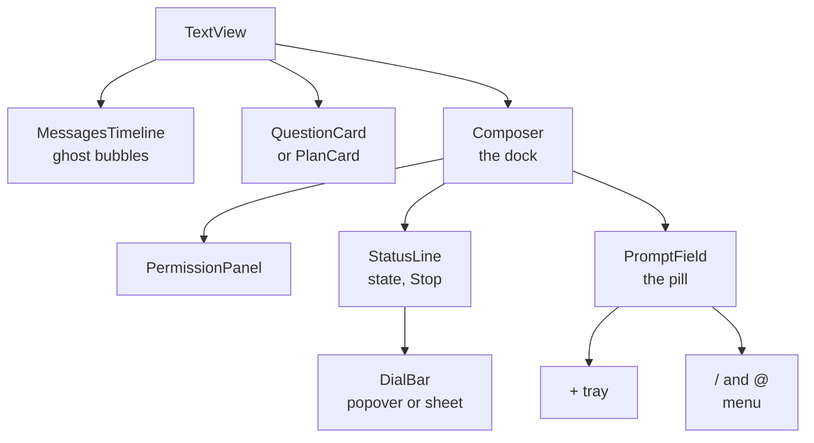
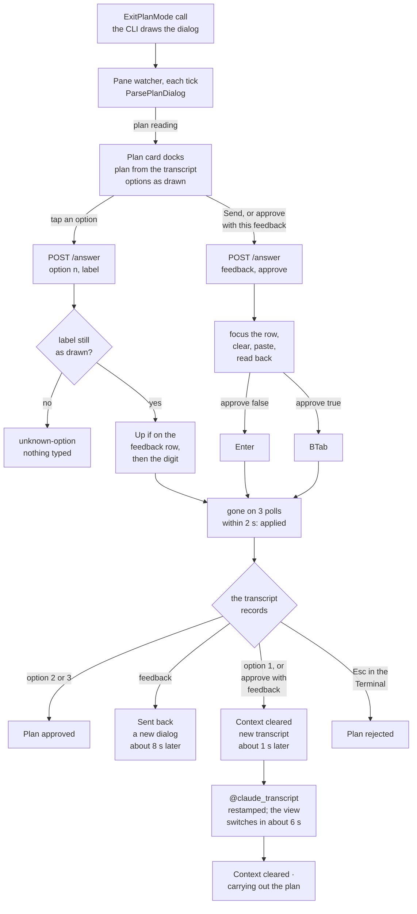

# Redesigning the Text view composer

**Status:** approved 2026-09-24. Quiet line chosen; building it.
**Owner:** wizard. **Repos touched:** terminal-lobby (frontend-v2, sessionio, session-events). No infra change: the two new server features ride routes the ingress already allows.
**Decisions from:** Viktor's request on 2026-09-24, three questions he answered the same day, his choice of Quiet line from the five prototypes, and his request the same day that the Text view also answer Claude Code's plan-approval dialog.

The pictures and the five live prototypes sit beside the published page on
pages.viktorbarzin.me, under `composer/`.

## Chosen: Quiet line

**[Open the prototype](composer/1-quiet-line.html).**

Viktor chose Quiet line on 2026-09-24 from the five directions kept below under
[The five directions](#the-five-directions). While it was being specified he
added a second part: the Text view should answer Claude Code's plan-approval
dialog, so a reader can review a plan and start it, including the option that
clears context first, without switching to the Terminal. The view cannot answer
that dialog today. Both parts are built on one branch, `wizard/quiet-line`, and
released together.

The prototype is the visual spec: its HTML, CSS and script, the notes panel
under its frames, and the screenshots taken from it. What follows is what the
choice commits us to.

### A. The composer

| | |
|---|---|
| Shape | One thin line, the **status line**, sits above a pill. |
| The line, left | The session's state. While Claude works it reads `Working · <tool> <label> · <elapsed> · N steps` with Stop beside it. While Claude waits it reads "Waiting for you · Ns" and offers no Stop. Otherwise it shows the watching reason, or "Still working in the background: …". |
| The line, right | Labelled **dials** for mode, model with effort, and context. The context dial shows only when there is a reading. On desktop each dial opens a popover; on a phone the dials open one bottom sheet with three tabs. |
| The pill | A "+" that opens the **+ tray** (attach a file, add a photo, / commands, @ a file path), the field, and Send drawn as an arrow. |
| Mid-turn | A quiet "queues" hint appears beside Send. Send is never renamed and never greyed out in the live composer. |
| The timeline | The working row and the background-work row leave it for the status line. Queued prompts become dashed ghost bubbles at the end of the conversation instead of pills in the composer. |
| The dock's top edge | Carries the state: a slow sweep while Claude works, the awaiting colour while it waits, a dashed danger rule in bypass. Bypass and no ask also turn the mode dial into a hatched danger tab and give the pill a danger border. |
| The question card | May take up to 62% of the pane instead of 52%, since the composer under it is 38px shorter. |

At rest the composer and its status line measure 86px on the desktop and 92px on
the phone, against 124px and 127px today (phone figures without the
home-indicator strip). While Claude works the height does not change, because
the working state is the same line.

### The mode dial

The mode dial opens a list of the permission modes, each explained in one line.
Picking one asks the server to walk the CLI to that mode (contract 1), and the
dial then shows the mode the server read back off the pane. Shift+Tab in the
field still steps one mode, as it does today. A pick of the current mode closes
the list and sends nothing.

| mode | label | its line in the list |
|---|---|---|
| `manual` (`default` in older transcripts) | Manual | Asks before every edit and command |
| `plan` | Plan | Reads and plans. Changes nothing |
| `acceptEdits` | Edits | File edits land unasked. Commands still ask |
| `auto` | Auto | Most actions land unasked. Risky ones ask |
| `bypassPermissions` | Bypass | Nothing asks. Every tool runs |
| `dontAsk` | No ask | Nothing asks. Anything that would ask is refused |

Bypass and No ask sit below a rule, in the danger tone. The No ask line differs
from the prototype's ("Same as bypass, under the CLI's newer name"), because
Claude Code 2.1.281 refuses, rather than runs, any tool that would ask in that
mode (read from the CLI binary on 2026-09-24). No ask is also not a stop on the
Shift+Tab cycle, so no walk can reach it; the list shows it disabled unless it
is the current mode. A mode the session does not offer is learned from the
server's `unavailable` reply and stays disabled until the Text view is opened
again.

### The new-session composer

It matches the live composer:

- The same pill and + tray. The field reads "What do you want to do?", and Send stays disabled while it is empty, as today.
- The project, command, model and effort pickers become labelled dials on the thin line above the pill, built from the same dial component: a popover on desktop, one sheet on the phone. Model and effort share one dial.
- Choosing a plain shell turns the pill into a naming pill that reads "Name this shell…", with Send disabled while it is empty and no "+".

### B. Answering the plan-approval dialog

- A plan card docks above the composer while the dialog is up, the way the question card does. It shows the title "Claude's plan is ready", then the plan itself, then the CLI's approve options with their numbers and exact labels.
- The plan comes from the transcript, as the input of the `ExitPlanMode` call, rendered as markdown and clamped with "Show all". The options are read off the pane, because their labels vary by session ("(6% used)", whether auto mode exists), so none are hard-coded.
- "Tell Claude what to change" goes through the composer, and the dock holds one text box. While the card is up the pill's placeholder reads "Tell Claude what to change…", and Send sends the text as feedback, after which the CLI keeps planning. While the composer holds text, the card also offers "Approve with this feedback", which is the CLI's shift+tab on its feedback row.
- After an approval that clears context, the new conversation opens with a "Context cleared · carrying out the plan" marker and the plan drawn as a plan row, instead of the long "Implement the following plan: …" message. The earlier conversation is not shown, as today.
- A plan row records its outcome instead of reading "awaiting approval" forever: approved (with auto mode, or with each edit approved by hand), approved after clearing context, sent back with feedback, or rejected.
- The composer never types into an open plan menu by accident. While the dialog is on the pane, Send is routed as feedback, and the server refuses a plain `POST /prompt` (contract 4), so a stale client gets its text back.

### Pinned tests, rewritten on purpose

These tests encode the old look and are rewritten to the new one:

- Attach shows a visible word.
- The controls sit on a bar below the field.
- The field and the bar are one surface.
- The status row is the timeline's last row.

These still hold and keep their meaning:

- Send is the last control in its group, is never greyed out in the live composer, and is never labelled "Queue".
- Stop and Send both show while Claude works.

### Behaviour the composer keeps

- Enter sends and Shift+Enter adds a newline; the phone's send key sends through `beforeinput` `insertLineBreak`. IME commits never send.
- ↑ on an empty field walks history. Shift+Tab cycles the mode. 1 or 2 on an empty field answers a pending permission.
- Attachments are inline tokens at the caret with a chip and a thumbnail behind them. Backspace removes a whole chip, a thumbnail opens full size, and paste and drag-and-drop attach.
- The / and @ completion menu opens above the field.
- Drafts persist per session, and the field never clears without a confirmed send or a restore.
- Send stays available while Claude works, and a mid-turn send queues. Stop shows only while Claude works.
- While the device only watches, attach and the model dial are disabled with the reason.
- Codex sessions get codex models and hide the mode dial unless the pane reports a mode. Shell sessions have no model dial.
- The Text view never writes to a pane except after a human action.

## Implementation plan

The builders work from two specs written on 2026-09-24, one for the composer and
one for the plan card, each checked against the code at `a6a74816` and against
Claude Code 2.1.281. This section keeps what a later reader needs from them:
where the work lands, the four wire contracts, the plan-approval flow, what the
tests pin, and how the release is checked.

### Where the work lands



The new-session composer mounts the same `DialBar`, with project, command and
model dials, above the same `PromptField`, or above the naming pill for a shell.

| area | files | change |
|---|---|---|
| Status line | new `components/StatusLine.tsx`, `statusline.logic.ts` | The thin line: dot, state words, tool, label, elapsed, steps (only above 1), Stop, the 1 s clock and a polite live region. `lineState` decides what the left side says: watching first, then the open turn (waiting or working), then background work, then nothing. The dock's edge follows the session itself, so a watcher still sees the sweep. |
| Dials | new `Dial.tsx`, `ModePanel.tsx`, `logic/modes.ts`; `ModelMenu.tsx` becomes `ModelPanel.tsx` and `ContextMeter.tsx` becomes `ContextPanel.tsx` | One dial component for both composers. A fine pointer opens one popover at a time; a coarse pointer opens one sheet with a tab for every dial, drawn or folded. The chips' menus become panel bodies. |
| Pill | `PromptField.tsx`, new `PlusTray.tsx` | "+", field, "queues" hint, Send. The bar and the Attach button go; both hidden file inputs stay mounted. Two new sinks, `hasInput` and `submitVia`, let the plan card's "Approve with this feedback" reuse the field's confirmed-send path. |
| Dock | `Composer.tsx`, `TextView.tsx`, `SessionView.tsx` | The composer becomes the permission panel, the status line with its dials, then the pill, and sets `data-status` and `data-danger` for the edge and the danger styling. TextView drops the background strip, passes the open turn's live row to the line, docks the plan card where the question card docks, and holds the mode dial while any dialog is up. |
| Timeline | `MessagesTimeline.tsx`, `rows.tsx`, `timeline.logic.ts` | The working row is no longer drawn; its data still feeds the line through `liveRow`. Queued prompts render as ghost bubbles after the last row, three at most, then "+N more waiting". Plan rows carry an outcome, and the first record after a clear draws a `ContinuationRow`. |
| Mode | new `lib/mode-api.ts`, `logic/compose.logic.ts` | One POST per pick and no retry, since a timed-out walk may still have pressed keys. `PANE_MODES` learns the measured "don't ask on" status line, which its current pattern misses. |
| Model names | `lib/models.ts` | `modelName` shows "Opus 5.5" in the dial; the exact slug moves to the dial's title and the picker rows. |
| New session | `NewSessionComposer.tsx` | The four selects become three dials (project, command, model with effort) above the pill, and the naming box becomes the naming pill. The accessible names stay, so the rewritten tests can find them. On the phone a pick keeps the sheet open, so two choices take one visit. |
| Plan card | new `components/PlanCard.tsx`, `lib/answer-api.ts`, `types/events.ts`, `store/session.ts` | The card, the plan reading and answer types, `origin` and `plan` on events, and a `plan-open` refusal that keeps the text in the field. |
| Styles | `app.css`, `theme/theme.css` | The new rules replace the composer block; the chip rules and the queued list go; `.tl-qcard` caps at `min(62%, 460px)`; a `--pop-shadow` token serves the popovers, the tray and the sheet. Every size keeps the `--tl-text-scale` factor, and the phone field keeps its 16px floor. |
| Plan reading | new `sessionio/plandialog.go`, `session-events/registry.go` | `ParsePlanDialog`, and the pane watcher publishing its reading on the same `asking` meta as a question reading. |
| Plan answers | `sessionio/answerapi.go`, `answerdrive.go`, new `plandrive.go` | The `plan` field on `POST /answer/{session}` and its key sequences. |
| Mode driver | `sessionio`, beside `setmodel.go`; `session-events/main.go` | The `mode` field on `POST /model/{session}`. |
| Prompt guard | `session-events/main.go` | `POST /prompt/{session}` refuses while the plan dialog is drawn. |
| Continuation | `sessionio/record.go`, `event.go`, `normalize.go` | The first user record of a conversation started by clearing context carries `origin` and `plan` to the client. |

The prototype folds its line with container queries, which need Safari 16, and
the oldest engine the lobby serves is Safari 15.6. The status line therefore
measures its own width with a ResizeObserver and writes `data-room`:

| room | width | what folds |
|---|---|---|
| wide | above 780px | nothing |
| mid | 601 to 780px | the dials' micro-labels |
| narrow | 461 to 600px | also the step count, and the long background words ("Background:" instead) |
| tight | 460px and below | also the model dial while the left side has content, the context dial while working or watching, the word "Working", and the watching reason |

The mode dial never folds, and a folded dial stays reachable on the phone,
where the sheet has a tab for every dial.

### The four wire contracts

The server and the frontend implement exactly these. Contracts 1 and 3 extend
existing routes instead of adding paths: `session-events` routes are
allow-listed one by one in the infra repo's IngressRoute, so a new path prefix
would need a change in another repo.

#### 1. Mode driver

`POST /model/{session}` takes a new body field, `{"mode": "<identifier>"}`, with
the identifier one of `manual`, `acceptEdits`, `plan`, `auto`,
`bypassPermissions` or `dontAsk`. `default` is accepted as `manual`.

- The server reads the pane's mode. If it already matches, it replies applied with nothing typed.
- Otherwise it presses BTab one at a time, each press its own send-keys run with `keySettle` (120 ms) between, reads the pane after each press, and stops the moment the target shows. It never presses more than the number of modes in the measured cycle plus one. If the cycle returns to the starting mode without showing the target, the reason is `unavailable`.
- Safety. While the session is working (`@claude_state` running or awaiting) or a background agent runs (`@claude_bg` non-empty), a walk must not pass through `bypassPermissions` or `dontAsk` on the way to a different target. The server refuses such a walk before pressing anything, from the measured cycle order, with reason `unsafe-path`. If an unexpected dangerous mode shows mid-walk while the session is working, it stops at once and reports `unsafe-path`. Choosing `bypassPermissions` or `dontAsk` as the target itself is allowed.
- The reply is `{"applied": bool, "reason"?: string, "mode": "<identifier read after>", "presses": n}`, and the request is recorded with `tl.action` = `mode`.

The cycle, measured on Claude Code 2.1.281 on 2026-09-24 with one BTab per
send-keys run and the status line read after each press:

| how the session was started | cycle |
|---|---|
| plain `claude` | manual, acceptEdits, plan, auto, back to manual (4 stops) |
| `--dangerously-skip-permissions`, as `devvm/start-claude.sh` and the skills-api restart start sessions here | bypassPermissions, auto, manual, acceptEdits, plan, back to bypassPermissions (5 stops) |
| `--allow-dangerously-skip-permissions` | manual, acceptEdits, plan, bypassPermissions, auto, back to manual |
| `--permission-mode dontAsk` | the first press goes to manual, and dontAsk never comes back |
| auto mode disabled | plan, manual, acceptEdits, back to plan (3 stops) |

BTab is accepted mid-turn. The status line reads "manual mode on", "accept edits
on", "plan mode on", "auto mode on", "bypass permissions on", or "don't ask on
(shift+tab to cycle)" for dontAsk.

#### 2. Plan reading

```json
{
  "kind": "plan",
  "options": [
    {"number": 1, "label": "<exact label>"},
    {"number": 2, "label": "…"},
    {"number": 3, "label": "…"}
  ],
  "feedbackRow": 4,
  "planPath": "~/.claude/plans/<slug>.md"
}
```

The pane watcher publishes it the way it publishes a question reading, on the
same `asking` meta, so the newest reading wins across the two kinds and one
empty body withdraws either. A question reading has no `kind`, which is how an
older client tells them apart: it finds no questions in a plan reading and docks
nothing. The answer route returns the reading in its replies.

The reading is recognised by the dialog's own landmarks inside the dialog's own
region, never from a quoted copy elsewhere in the capture. Measuring on
2026-09-24 refined which landmarks can be required, while the JSON shape stayed
as above:

- The parse is anchored at the bottom. The footer, `ctrl+g to edit in <editor> · <path>`, must be the last non-blank line of the capture. The dialog takes the input box's place, so nothing is drawn under it, while a copy quoted in the conversation always has the input box and the CLI's status line below it.
- Walking up from the footer: the hint `shift+tab to approve with this feedback`, the feedback row, the approve rows numbered from 1, the question ending "Would you like to proceed?", and a rule. The feedback row is found by the hint under it, because typing into the row replaces its label, "Tell Claude what to change".
- "Ready to code?" and "Here is Claude's plan:" help find the region's top when they are drawn, and are never required: PgDn scrolls them away with the plan, and on a 58-column pane long feedback pushes them off.
- The number of approve rows is read, not assumed. The usual layout has three, with the feedback row on 4. A session with auto mode disabled and the clear-context option turned off draws two ("Yes, auto-accept edits", "Yes, manually approve edits"), with the feedback row on 3.
- Nothing is read from the plan viewport. At 58x20 it has no lines at all, which is why the card takes the plan from the transcript.

`ParseDialog` needs no change: it requires the question widget's "Enter to
select … Esc to cancel" footer, which the plan dialog does not draw. Tests pin
that each parser returns nil on the other's captures.

#### 3. Plan answers

On the existing `POST /answer/{session}`, `AnswerRequest` gains `plan`:

- `{"option": n, "label": "<exact label>"}` approves with option n, from 1 up to the row before the feedback row. It is refused as `unknown-option`, with nothing typed, when the drawn label differs.
- `{"feedback": "<text>", "approve": false|true}` types the text into the feedback row, then presses Enter to send it back to planning, or BTab to approve with the feedback.

Every key is its own send-keys run with `keySettle` between, and every step is
proved by a fresh reading before the next key goes in:

| request | keys | proved by |
|---|---|---|
| approve n | `Up` first, only when the cursor is on the feedback row, where a digit would be typed as text; then the digit n | the dialog gone |
| feedback | the feedback row's digit when the cursor is elsewhere and the row is empty, otherwise `Down` until the cursor is on it (the digit on a focused row types itself); clear any other text in the row; paste the feedback | the row shows the feedback, with the cursor on it |
| feedback, commit | `Enter` when `approve` is false, `BTab` when it is true | the dialog gone |

- `Esc` is never sent: it rejects the plan even with text in the field.
- `Enter` is never pressed on an empty feedback row, which acts like Esc. It follows only a reading that shows the feedback in the row.
- The dialog counts as gone when it is absent on three consecutive polls within 2 s, so one blank repaint is not taken for an answer. After feedback a new dialog appears later, about 8 s in the measured session, by which time the answer has been reported applied.
- Feedback is one line of at most 2,000 bytes, because the CLI's field is a single line.
- A per-session lock keeps two devices from interleaving a paste and a digit on one dialog.
- Replies reuse the existing reasons: `unknown-option`, `not-drawn` (the pane shows the other kind of dialog, whose reading comes back), `no-dialog`, `unverified` and `refused`. A question request while a plan is drawn is refused `not-drawn` with the plan reading, and the reverse.
- Each request is recorded with `tl.action` = `plan-approve` or `plan-feedback`, and `claude.answered` counts each applied plan answer as one answer.

#### 4. Prompt guard

`POST /prompt/{session}` replies 409 with `{"applied": false, "reason":
"plan-open"}` while the plan dialog is on the pane, and the client puts the text
back in the field with a notice. The server captures the pane on every prompt,
not only when `@claude_ask` is stamped, so a session whose hook is missing is
still covered. A capture error lets the prompt through as today.

The guard exists because `Injector.Prompt` sends C-e, C-u, a paste and Enter
into whatever has focus. On the plan menu a digit selects an option, so a prompt
such as "1. do X" could clear context and start executing.

### The plan-approval flow



The reading travels on the session stream's `asking` meta with `kind: "plan"`.
A plain `POST /prompt` sent while the dialog is up gets the 409 `plan-open`
refusal of contract 4 and never reaches the menu.

"Approve with this feedback" cleared context in the one session where it was
measured, whose option 1 was "Yes, clear context … and use auto mode". Whether
it always does, or follows whatever option 1 does in a session, is not measured.

### When the card docks, and what it shows

The card docks while a plan reading is present and the newest `ExitPlanMode`
call is pending, not in the transcript yet (the card then reads "Loading the
plan…" above the options), or resolved before the reading arrived. It does not
dock when the call was resolved after the reading, because that dialog has just
been answered. Transcript events do not reset the reading, because two plan
dialogs in a row can produce byte-identical readings. A reading identical to the
one this client answered a moment ago does not re-dock while that answer is
settling.
While the card is docked, the status line reads "Waiting for you" even in the
moment before the transcript record arrives.

The plan text is the call's `input.plan`, with one exception measured once:
when Claude writes the plan file and calls `ExitPlanMode` in the same message,
the input holds the old file while the dialog draws, and the approval carries,
the new one. The transcript shows it as a Write or Edit to the plan path whose
result lands after the `ExitPlanMode` call. The card then shows the Write's
content, or applies the Edit when its old text occurs once, and otherwise shows
the input with the note "Claude changed the plan while presenting it. The
Terminal shows the current version." The pane's copy is never used.

The card has no digit shortcuts, since a stray 1 would clear context. While it
is docked, the pending plan row collapses to "Plan · waiting for your approval ·
shown below", so a long plan is not on screen twice.

| reply | what the card shows | the composer |
|---|---|---|
| option in flight | the option shows "Approving…"; the others are disabled | a Send press is ignored, and the card says "Still sending your last answer…" |
| feedback in flight | "Sending your feedback…"; options disabled | the text stays |
| applied | the card undocks at once, and the row reads "Approving…", "Sending back…" or "Clearing context…" until the transcript result lands or 20 s pass | clears, for feedback |
| `unknown-option` | re-rendered from the reply's reading, with "The Terminal now shows different choices. Pick again." | the text stays |
| `not-drawn`, `no-dialog` | "The plan is no longer waiting in the Terminal." | the text stays; the next Send goes out as a prompt |
| `unverified` | "Your answer may not have landed. Check the Terminal." and a Terminal button | the text stays |
| pane unreadable | "Couldn't read the plan's choices. Open the Terminal to answer it." No raw keypad, because a stray digit clears context. | the text stays |

### The composer while the plan card is docked

| | while the card is docked |
|---|---|
| Placeholder | "Tell Claude what to change…" |
| Send, Enter, the phone's send key | `POST /answer` with `plan: {feedback, approve: false}` instead of a prompt. The field clears only when the reply is applied, and an empty field sends nothing. |
| "Approve with this feedback" | The same path with `approve: true`, offered while the field holds non-blank text. |
| Line breaks | Become spaces before sending, with a line under the card saying so. |
| Over 2,000 bytes | Not sent, and the card says why. |
| Attachments | Sent as their paths, as a prompt would carry them. |
| "queues" hint | Hidden, because this send answers the dialog. |
| Send's look | Unchanged: never renamed, never greyed out. |
| Mode dial and Shift+Tab | Held while any dialog is up, with the reason as the dial's title. For the plan dialog this is required, because BTab on the feedback row approves the plan; for questions and permissions it is a precaution. |
| Model dial | Held with the same reason; `/model` already answers 409 while `@claude_ask` is set. |
| 1 or 2 on an empty field | Still the permission shortcut only; never an answer to the plan. |

### Outcomes in the timeline

Outcomes are read where a `tool_result` resolves the pending `ExitPlanMode`
call, from the result's text, its error flag and `toolUseResult`.

| what the transcript records | outcome | row header |
|---|---|---|
| a result starting "User has approved your plan" | approved, with the mode from the next `permission-mode` record in the turn | "Plan approved · auto mode", "Plan approved · you approve each edit", "Plan approved · accept edits", or "Plan approved" until that record arrives |
| an error result carrying "To tell you how to proceed, the user said:" | sent back | "Sent back with feedback", with the feedback quoted under it |
| any other error result: Esc, Enter on an empty feedback row, or the old transcript's side of a clear | rejected | "Plan rejected" |
| no result, and a newer row exists or the turn has settled | superseded | "Plan not answered" |
| the first record of the new transcript after a clear | continuation | the marker, then "Plan approved · carrying it out in a fresh context" |
| this client's own answer applied, result not written yet | transient | "Approving…", "Sending back…", "Clearing context…" |

An approved row's body becomes the plan that was approved
(`toolUseResult.plan`), so edits made in the CLI with ctrl+g show. Once
resolved, the body collapses to its first line behind "Show plan".

### After clear context

Option 1, and "Approve with this feedback" in the measured session, start a new
conversation. About 1 s after the key a new transcript appears. Its first user
record carries `planContent` and `origin: {kind: "auto-continuation"}`, and its
text is "Implement the following plan: …" ending with the old transcript's path,
plus `User feedback on this plan: <text>` after an approval with feedback. The
old transcript records the same rejection as Esc. The SessionStart hook (source
`clear`) restamps `@claude_transcript`, the registry's 5 s sweep retires the old
stream, and the client reconnects and drops the old events, so expect up to
about 6 s from the key to the new view.

- The server sets `origin` and `plan` on that record's user event only. `Body` keeps the full text, so an older bundle renders what it renders today.
- The client draws a `ContinuationRow` in the turn's user-row slot, where it stays visible when the turn folds: the "Context cleared · carrying out the plan" marker, the plan as a plan row, and the feedback quoted when there was some.
- The new file's records carry `sessionId` (the new conversation) beside `session_id` (the old one). `ClaudeID` already prefers `sessionId`; the comment in `record.go` that calls the two spellings identical is corrected.
- Until the switch, the client that answered shows "Clearing context…" on the row and "Clearing context · starting on the plan" on the status line, for up to 20 s, instead of the rejection the old transcript records. Other devices, and an answer given in the Terminal, show "Plan rejected" until their stream switches.

### Telemetry

- `text.answer_sent` and `text.answer_failed` carry `tl.action` = `plan-approve` or `plan-feedback`, and `tl.reason` on a failure. Neither carries the feedback text or a label, per ADR-0008's content-free rule.
- `claude.answered` fires once per applied plan answer.
- A mode request on `POST /model/{session}` carries `tl.action` = `mode`. The event that same route emits for a model change, `claude.model_set`, is not in the catalog (`telemetry/events.go`), so `Emit` drops it: `session-events.service` wrote none in the 7 days before 2026-09-24. Whichever event carries the mode request needs a catalog entry to be counted.
- The plan spec proposes a `claude.prompt_refused` event for the prompt guard (`tl.reason` = `plan-open`, `tl.count` the prompt's length). A new event means the Go catalog, the TS union and ADR-0006's table change in one commit.

ADR-0006 records the new `tl.action` values.

### Tests

Test-first throughout: each test fails for the right reason before its code
lands.

Rewritten on purpose:

| test | asserts now |
|---|---|
| `Composer.layout` | the pill holds "+", the field and the Send group, in that order; the dials sit on the status line before the pill; nothing follows the pill; Send is the pill's last control while idle and while working; Stop is on the status line; a click on the mode dial opens the list and does not cycle, and Shift+Tab in the field cycles once |
| `Composer.attachlabel` | the + tray's rows are worded "Attach a file", "Add a photo", "Commands and skills" and "A file path"; "+" keeps an accessible name, and explains itself when disabled or busy |
| `composer.aesthetics` | `.tl-pill` has a 1px solid border and a 21px radius; `.tl-statusline` has no border and no background; `.tl-plus` has no box |
| `mode-chip`, `model-chip` (renamed `mode-dial`, `model-dial`) | the dial's value, title and `data-danger`; the model dial reads "Opus 5.5 · Medium" with the slug in its title and the picker |
| `TextView.mode` | a pick from the list calls `onSetMode`, never `onKeys`, and shows the reply's mode |
| `Composer.keyboard`, `PromptField` | queued prompts are not in the composer; "+" is the pill's first control and Send its last |
| `MessagesTimeline` | the timeline draws no working row; the working and waiting words move to the status line's tests |
| `timeline.fits` | the docked card caps at `min(62%, 460px)`, still with no `vh` |
| `NewSessionComposer` | its `pick()` and `option()` helpers drive dials; the test bodies keep their meaning |
| the plan row's tests | "awaiting approval" gives way to the outcomes |

Kept as they are, since the classes and behaviour they read survive:
`Composer.queue` (its "never 'Queue'" check reads Send's accessible name, with
"queues" a separate element), `Composer.mobile`, `Composer.attach`,
`Composer.thumbs`, `Composer.autosize`, `Composer.firstsize`, `complete-scroll`,
`complete-menu.css`, `compose.*`, `drafts`, `suspended.send`, `timeline.waiting`,
`textzoom` and `css-tokens`.

New:

| where | covers |
|---|---|
| frontend, composer | `statusline.logic` (precedence, `liveRow`, room widths at each boundary), `StatusLine` (the words per state, no Stop while waiting or watching, one announcement per change of state), `Dial` (popover, sheet, tabs, focus, dismissal), `ModePanel`, `mode-api` (the POST, failures, no retry), `Composer.tray`, `MessagesTimeline.ghost` (three at most, one copy of a pending prompt, a pinned reader stays at the bottom), `models.name`, `composer.css` |
| frontend, plan card | `timeline.plan` (each outcome from real result bodies, the approved body, superseding, the stale-input rule), `timeline.continuation`, `timeline.plandock` (every docking case; `askingFromPane` stays null for a plan reading), `PlanCard`, `Composer.plan` and `TextView.plan` (the placeholder, Send routed as feedback, the field clearing only on applied, line breaks, the held mode dial, "Clearing context…"), `session.planopen` |
| Go, `sessionio` | `plandialog_test` over every `testdata/plan-*.txt` capture, with each parser nil on the other's captures and the cursor and typed text never marshalled; `plandrive_test` against the dialog stand-in, which learns a plan mode (approve, a stale label, the cursor on the feedback row, feedback both ways, replacing old text, a failed read-back never followed by Enter, a blank repaint, mixed requests); the mode driver (a walk that stops on the target, `unavailable` after a full cycle, `unsafe-path` before any press and mid-walk, the press bound); record and normalize tests from the continuation records |
| Go, `session-events` | the watcher publishes and withdraws a plan reading; the prompt guard refuses with 409 before `injector.Prompt`; plan requests reach the driver and record `plan-approve` and `plan-feedback` with no label text |

### How it is verified

1. The checks. Go, in each of sessionio, session-events, tmux-api, agent-api and spendstore: `gofmt -l . && go vet ./... && go test -race ./...`. Frontend: `cd frontend-v2 && npm ci && npm run typecheck && npm run lint && npm run lint:exports && npm test`.
2. Screenshots from a Python Playwright script in the `scripts/qa_driver.py` pattern, read back, at 1280x800 and at 390x844 with touch: idle, working, waiting with the question card and with the plan card, bypass, each dial and the + tray, the keyboard up, the new-session composer and the naming pill. At rest the composer should measure 86px on the desktop and 92px plus the inset on the phone.
3. Real devices. The phone layout on the shared Android emulator, and Safari through `homelab ios shot`, which matters here because the baseline engine is Safari 15.6.
4. A live Claude Code session in tmux, one key per send-keys run: approve with each option, send feedback back, approve with feedback, clear context and follow the switch to the new conversation, and a mode walk refused mid-turn.
5. After the deploy, the new `tl.action` values in Loki.

### Open points for Viktor

The build goes ahead with the default in the last column, and each can change
if Viktor prefers the other way.

| # | point | default in the build |
|---|---|---|
| 1 | No ask is styled as a danger mode, while the CLI refuses rather than runs in it | the danger styling stays |
| 2 | No ask cannot be reached by Shift+Tab | listed, disabled, "Set when the session starts. Shift+Tab cannot reach it", unless it is the current mode |
| 3 | While watching a working session, the line shows the watching reason rather than the working summary | the watching reason; the edge still sweeps and the timeline still shows tool rows |
| 4 | "Take control" on the line is in the prototype but not in the decisions | shown only where it is wired to the existing watch toggle |
| 5 | Model names ("Opus 5.5") replace slugs in the dial, which reverses the slug rule in `lib/models.ts` | names in the dial; the slug in its title and the picker |
| 6 | The mode dial and Shift+Tab are held during question and permission dialogs too | held for all three |
| 7 | Send's arrow is white on the accent, like the question card's Submit, rather than the prototype's page colour | white |
| 8 | New-session dials sit right-aligned with nothing on their left; left-aligned would read as a sentence | right-aligned |
| 9 | The phone new-session field keeps its 76px minimum, so that pill is taller at rest | kept |
| 10 | The plan card has no plain Reject button; the CLI rejects only through Esc or an empty feedback row, and the Terminal's Esc still works | no Reject button |
| 11 | Feedback line breaks become spaces, and attachments travel as paths | as described |
| 12 | Only the answering client shows "Clearing context…"; others show "Plan rejected" for up to about 6 s | client-side only; covering every client needs a server meta, which is a contract addition |

### Risks the builders handle

- Walks to Auto will often be refused mid-turn. Sessions here start with `--dangerously-skip-permissions`, which puts Bypass between Plan and Auto. From Manual, Edits or Plan a walk to Auto passes through Bypass and is refused with `unsafe-path` while Claude works. The refusal names the way out: stop Claude first, or pick it when the turn ends.
- Contract 1 does not say the server refuses a mode walk while a dialog is drawn. The composer holds the dial; the `/model` route's existing `@claude_ask` refusal, or a pane read, would also cover a stale client.
- Stale plan text is handled exactly for a Write and on a best-effort basis, with a note, for an Edit. Always exact would mean adding the plan file's text to the reading, which changes contract 2.
- Some keys are unmeasured, and each is avoided or covered by a read-back: BTab on the approve rows (never sent), a run of Backspaces in the feedback row, the digit with text already in the row (the driver walks with Down instead), digits from rows 2 and 3, and Up from a row holding wrapped text.
- A panel drawn under the dialog, such as background agents or a notification, was never seen. It would make the parser return nil, which leaves today's behaviour: no card.
- The prompt guard reads the pane a few milliseconds before injecting, so a dialog drawn in that gap is not caught.
- Stop no longer shows while Claude waits. A question is taken down with the card's own buttons, Send, or the Terminal.
- A mid-turn send shows first as a normal bubble and then as a ghost, once the CLI's queued record arrives; a dedupe keeps one copy on screen.
- The timeline's bottom fade covers its last 26px, where the "↓ Latest" button sits today; the button moves up to 30px.
- Claude and codex each offer six effort levels, where the prototype drew four; the effort control is a 3x2 grid.
- Codex has no plan dialog, so both parsers return nil there and nothing changes.

## The options page, kept for reference

The sections from here down are the options page as Viktor reviewed it, kept for
reference as the record of what was weighed, with the open questions brought up
to date.

## What we are solving

Viktor asked for a full redesign of the composer at the bottom of the Text view,
and of what it shows. Asked what bothers him, he picked all four of these:

1. **Too much at once.** Attach, the mode chip, the model and effort chip, Stop
   and Send sit in one row all the time.
2. **It takes too much of the screen.** A tall box plus a row of chips takes
   space from the conversation, most of all on a phone.
3. **The controls say too little.** "manual" and "claude-opus-5-5 · medium" do
   not read as things to press, or say what pressing them does, and a red Stop
   shows while Claude is only waiting for an answer.
4. **It looks generic.** It works, but it does not feel designed for this app.

Scope, as he chose it: the composer and the status line above it
("● Working… 24m 21s · 7 steps", "● Waiting for you 3s"), designed as one piece.
The docked question card and the permission panel keep their look, and have to
sit well above whatever replaces the composer. Desktop and phone count equally.

## Today, measured

Measured on the deployed build (0.71.2) in an idle session, at the same frame
sizes the prototypes use.

| | Desktop 1280×800 | Phone 390×844 |
|---|---|---|
| Composer at rest | 124px | 127px |
| Controls at rest | 4: Attach, mode, model, Send | 4, the same |
| While Claude works | 160px: the working row in the timeline, a gap, then the composer | 183px; the command label wraps to two lines |
| Controls while working | 5: Stop joins | 5 |

On the phone the model chip is 152px wide and runs under Send at rest and under
Stop while working, so it reads "claude-opus-5-5 · ı" and then "claud". That is
a defect in today's layout, whichever direction is chosen.


## The five directions

Each direction was built by a separate designer, blind to the other four, from
one brief (see [how they were made](#how-they-were-made)). All five use the app's
own theme tokens and its two fonts, DM Sans and JetBrains Mono, so any of them
works in all eight themes; they differ in layout, hierarchy, motion and what they
choose to show.

Every prototype is live. Both frames take typing, and the state switcher covers
Idle, Typing, Attachments, Working, Waiting, Menus, Watching and Keyboard up.
A theme toggle switches between slate and t3-light, and each mode control can be
walked round to bypass to see how a dangerous mode is marked.

| | Direction | At rest, desktop / phone | Controls at rest | Status lives | Stop lives | Mode and model |
|---|---|---|---|---|---|---|
| | Today | 124 / 127px | 4 | a timeline row | the bar, beside Send | chips in the bar |
| 1 | [Quiet line](composer/1-quiet-line.html) (chosen) | 86 / 92px | 5 | one thin line above the field | on that line | labelled dials on that line |
| 2 | [Instrument panel](composer/2-instrument-panel.html) | 125 / 129px | 5 / 3 | the composer's top band | the band, "Stop Claude" | labelled cells; one Session control on the phone |
| 3 | [Prompt](composer/3-prompt.html) | 75 / 97px | 5 | a tmux-style strip under the field | a ^C key cap beside the field | segments in that strip |
| 4 | [Floating card](composer/4-floating-card.html) | 101 / 118px | 5 | a pill on the card's top edge | in that pill | icons, named on hover; short labels on the phone |
| 5 | [Tide](composer/5-tide.html) | 72 / 70px | 1 | a coloured line that grows into a strip | the strip, while working | a tray that rises on hover or focus |

Heights include each direction's own status line, which today is a separate row
in the timeline. Phone figures leave out the home-indicator strip; direction 4's
includes the 22px margin its card floats on. Controls are counted as buttons,
not counting the field.

### 1. Quiet line

**[Open the prototype](composer/1-quiet-line.html).** The composer should cost
one line until you need more.

- A single-line pill holds a "+", the field and Send. The "+" opens a tray:
  attach a file, add a photo, / commands, @ a file path.
- One thin line above it carries the state on the left ("Working · Edit
  QuestionCard.tsx · 4m 12s · 7 steps", with Stop beside it) and three labelled
  dials on the right: mode, model with effort, context. On the phone they open
  one sheet with three tabs.
- The dock's top edge lights with the state: a slow sweep while working, the
  awaiting colour while waiting, a dashed danger rule in bypass.
- Queued prompts become dashed ghost bubbles at the end of the conversation.
- Breaks three pinned behaviours: Attach loses its word, the controls no longer
  sit on a bar below the field, and the dials line is not part of the field's
  surface. A mode click opens a list of the six modes rather than cycling.


### 2. Instrument panel

**[Open the prototype](composer/2-instrument-panel.html).** Every control says
what it is and what it will do.

- One framed instrument in three rows. The top band is the status line: the
  state word lit like a lamp, the tool, elapsed time, steps, and "Stop Claude"
  only while Claude works. The band's colour is Claude's state.
- Below the field, a rail of labelled cells: MODE (each mode explained in one
  line in its menu), MODEL, CONTEXT with a ten-segment meter, ATTACH, and Send as
  a solid key. While Claude works, Send carries a "queues next" caption.
- Bypass and no ask stripe the whole frame in the danger colour.
- On the phone the rail folds into one Session cell ("Manual · Opus 5.5 High ·
  42%") that opens a sheet with the same labelled controls.
- Breaks: Stop moves out of the bar into the band, a mode click opens a menu
  rather than cycling, and the status row leaves the timeline.


### 3. Prompt

**[Open the prototype](composer/3-prompt.html).** It is a terminal lobby, so the
composer is a typeset prompt.

- The field is set in JetBrains Mono behind a ❯. The glyph, the caret and a rail
  down the left edge take the permission mode's colour, and the strip names the
  mode and what it means ("MANUAL asks first"). In bypass the rule turns red and
  the rail becomes hazard striping.
- One tmux-style strip replaces both the chip row and the timeline's status row:
  mode, model and effort, a context meter, the live activity, and "+ attach".
  Each segment opens its picker; mode cycles.
- The prompt line holds key caps only: "⏎ send" always, "^C stop" while Claude
  works. On desktop, live hints sit on the rule above the field ("⏎ queue after
  this turn" while working, "1 allow · 2 deny" when a permission waits).
- Breaks: Send is no longer the last control of the bar's right group, and Send
  and Stop move up beside the field.


### 4. Floating card

**[Open the prototype](composer/4-floating-card.html).** Polish over novelty: a
composer that floats over the conversation instead of walling it off.

- A card with an 18px radius floats 16px above the pane's edge, and the
  conversation fades out underneath it. The full-width strip and its top border
  go.
- The status line becomes a pill riding the card's top edge, with Stop inside it
  only while Claude works.
- On desktop the bar is three quiet icons (attach, mode, model), a context ring
  with its number inside, and a filled Send; each icon's words appear on hover
  and focus. The phone keeps short labels: Attach, Manual, Opus · High. Bypass
  and no ask keep their word visible everywhere.
- Attachments also get a thumbnail tray above the text.
- Breaks: Attach shows its word only on hover on desktop, and Stop is no longer
  in the bar's right group.


### 5. Tide

**[Open the prototype](composer/5-tide.html).** Show what the moment needs and
nothing else.

- At rest there is one line: the field and Send. The status row becomes a 2px
  line along the composer's top edge: a slow shimmer while Claude works, a still
  line in the awaiting colour while it waits, nothing when idle.
- While Claude works the line swells into a strip: the tool in plain words
  ("Editing QuestionCard.tsx"), time, steps, and Stop at its end. While it waits,
  the strip reads "Claude asked you something ↑" and has no Stop. Typing
  mid-turn shows a "Will queue" pill.
- Hover on desktop, or focus on the phone, raises a tray of labelled keys: Mode,
  Model, Context with a small gauge, Attach. Bypass and no ask keep a red flag
  and edge even at rest.
- The transitions carry the design; with reduced motion on, nothing moves.
- Breaks: the controls no longer sit on a bar below the field, the field and bar
  stop being one surface, and Attach shows its word only when the tray is up.


## With the question card docked

The card keeps today's look in every direction. These show how each composer sits
under it.


## What stays the same, whichever is chosen

The brief fixed the behaviour, so every direction keeps: Enter to send and
Shift+Enter for a newline; history on ↑; Shift+Tab to cycle the mode; 1 and 2 on
an empty field to answer a permission; attachments as inline tokens with a
thumbnail that opens full size; the / and @ completion menu; Send staying
available while Claude works, with a mid-turn send queued; Stop only while Claude
works; a 16px floor on the phone's field so iOS does not zoom.

## Open questions at the options stage

Each is now settled or carried into the implementation plan.

- **Real devices.** Every phone frame is a 390px region in desktop Chromium, so
  touch, the soft keyboard and iOS focus zoom stay unverified until the build is
  checked on the shared Android emulator and with `homelab ios`. That check is
  step 3 of [How it is verified](#how-it-is-verified).
- **A mode menu needs a new driver.** Settled as contract 1: the server presses
  Shift+Tab one step at a time and reads the pane until the pick shows, on the
  existing `POST /model/{session}` route.
- **Proposals inside the prototypes.** None of them came with Quiet line (Stop
  putting queued prompts back into the field, mode going inert while watching,
  ^C in the field stopping the turn), so none are in the build.
- **Tide on a phone** raised its controls only when the field had focus. Tide was
  not chosen.
- **Pinned tests.** Settled: the tests rewritten on purpose, and the ones that
  still hold, are listed under [Chosen: Quiet line](#chosen-quiet-line).

## How they were made

Five designers, one per direction, each blind to the others, worked from one
brief: the four complaints, the behaviour list above, and four constraints. The
constraints were the app's theme tokens and fonts only, accessible controls with
44px touch targets on the phone, motion in CSS, and nothing a Solid component and
a stylesheet could not build. Each prototype has the same eight states, and each
designer screenshotted every state in both themes and read the pictures back
before handing over. Today's baseline was measured on the deployed 0.71.2 at
1280×800 and 390×844.
