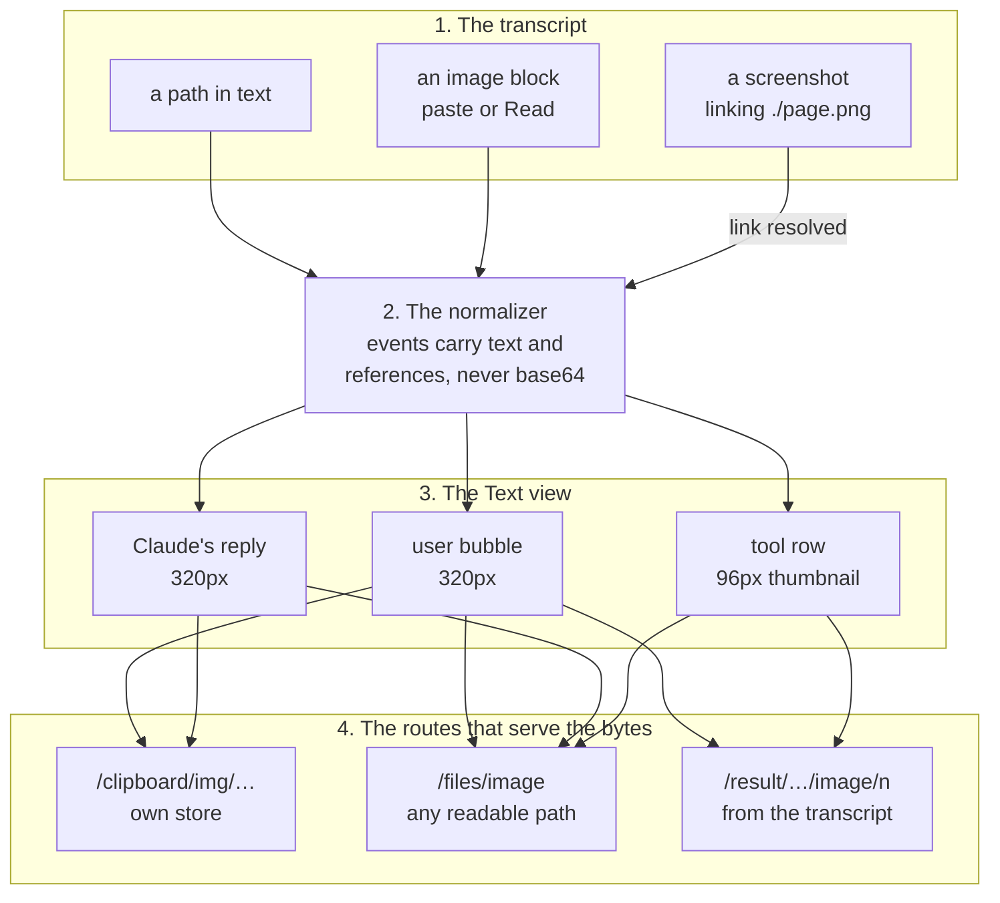

# Native images in the Text view

**Status:** approved 2026-09-24; building it.
**Owner:** wizard. **Repos touched:** terminal-lobby (`sessionio/`, `session-events/`,
`file-api/`, `telemetry/`, `frontend-v2/`, `frontend/diag.js`). No infra change.
**Decisions from:** Viktor's request on 2026-09-24 and his answers the same day.
Decisions 1 to 3 are his answers; 4 and 5 are the defaults recorded with them.
**Reverses:** decision 8 of `docs/plans/2026-08-17-text-view-attachments-design.md`,
"tool rows stay path-only". That doc carries a dated revision saying so.

Viktor, 2026-09-24:

> in text mode i would want to be able to view images natively. we can
> distinguish them by file name/path. agent communicating back with images
> should also render the same way.

```stats
134 | Read results in 143 recent transcripts that carried a picture, each shown as base64 text
60 of 137 | pictures Claude read sat under /tmp, outside what file-api serves today
85 | Playwright screenshots, each shown as a relative text link
10 of 11 | text blocks where Claude named a picture put the path in backticks, which the renderer skips
```

## What we are solving

Today the Text view draws a picture in two cases, both built by the August
attachments work: a file attached in the lobby, and a bare absolute path in
Claude's prose. Every other way a picture turns up in a conversation reaches the
page as text. A path in backticks stays text. A markdown image points at the
lobby's own origin and shows a broken icon. A picture pasted into the terminal
shows as the placeholder `[Image #1]`. What Claude's Read returns for an image
shows as up to 8 KiB of base64 JSON. A browser screenshot shows as a text link to
a file, relative to a directory the page does not know.

Viktor asked for pictures to draw natively in the conversation, recognised by
file name or path, and for pictures the agent sends back to draw the same way as
the ones he sends. This doc records what that means for each shape, the
contracts between the renderer and the three services that serve the bytes, and
how the work is tested and checked.

## Where pictures come from, measured

A read-only census on 2026-09-24 over 143 recent transcripts on this box found
five shapes.

| Shape | What the transcript holds | Seen | What the Text view shows today |
|---|---|---|---|
| A lobby attachment | an absolute path, `/var/lib/clipboard-store/<user>/<session>/pasted-YYYYMMDD-HHMMSS-<hex8>.png`, in the prompt text | 1 prompt | the picture, capped at 320px; a click opens the file preview |
| A picture pasted into the terminal | a user record whose content is `[text "[Image #1]", image {source: {type: base64, media_type}}]`, with `imagePasteIds: [1]`; 380k base64 characters each | 2 prompts | the placeholder `[Image #1]`; the image block is dropped |
| Claude reads a picture | a `tool_result` holding only `[{type: image, source: {type: base64, …}}]`, and a second copy in `toolUseResult.file.base64` beside `originalSize` and `dimensions` | 137 Read calls, 134 results with a picture | up to 8 KiB of the base64 JSON in a `<pre>`; "Show full output" fetches all of it as text |
| A Playwright screenshot | a text result with a relative markdown link, `[Screenshot of viewport](./page-top.png)` | 92 calls, 85 that succeeded | the text, link included |
| Claude names a picture | a path in prose, in backticks, as `` or as `[x](…)` | 11 text blocks | a bare absolute path draws, with no height cap; backticks are skipped; `` breaks |

Three things in these numbers shape the design.

**Read is most of the volume, and much of it lives in /tmp.** The base64 in a
Read result runs to a median of 140k characters (p95 547k, max 645k). Of the 137
pictures read, 74 sat under `/home/wizard/code`, 57 in a session scratchpad under
`/tmp/claude-1000`, 3 elsewhere in `/tmp`, and 3 elsewhere (one in the lobby
store, two in the home directory). `/files/read` serves only paths inside the
caller's home, so 60 of the 137 could not be fetched through it even if the
renderer asked. A Read result carries the picture itself, though, so its
thumbnail can come from the transcript and needs no file at all.

**Screenshot links are relative to the directory Claude was launched in.** All 92
calls passed a `filename`; among the 85 that succeeded, 42 were absolute and 43
relative. The other 7 failed because the file was outside Playwright's allowed
roots. The link in the result equals the file's path relative to the first `cwd`
in the transcript in 85 of 85 cases, while the `cwd` on the record itself
differed in 65, because Claude had changed directory. Only 5 of the 85 files
still exist, so most screenshot rows from before this change will show no
thumbnail.

**Claude seldom names a picture in its own words, and when it does it uses
backticks.** 10 of the 11 text blocks put the path in backticks, and none used a
markdown image or link. The six absolute paths among them were all URL paths
from web projects (`/logos/…`, `/stories/…`), which do not exist as files on the
box, and 4 more absolute paths sat in fenced code. In this sample the prose rule
would have fallen back to text every time, so the fallback matters as much as
the drawing.

## What exists, and what it does not do yet

The August attachments work built most of what drawing needs. `segmentMessage`
and `contentUrlFor` in `frontend-v2/src/lib/attachments.ts` recognise a path and
choose the route that serves it. `AttachmentView` draws a picture capped at 320px
and shows the path text when the bytes do not load. The gallery and the composer
share one `.tl-lightbox` overlay. The gaps, each checked against origin/master at
`a6a74816`:

1. Inline code is skipped along with fenced code (`Markdown.tsx`, the
   `rehypeAttachments` walk). That is right for a fence, where a path is usually
   part of a command, and it hides the backticked paths Claude writes.
2. `resolveImageSrc` keeps a raw path as the `src` when there is no base
   directory, so `` asks the lobby origin, gets a 404 and shows a
   broken icon. `[x](/abs.png)` links to the lobby origin.
3. The block switch in `sessionio/normalize.go` has no `image` case, so a picture
   pasted into the terminal is dropped on the way to the page.
4. `decodeToolResult` returns a JSON string, else the first text block, else the
   raw JSON. An image-only result reaches the last case, is cut at
   `MaxInlineResult` (8 KiB) and lands in the tool row's `<pre>`.
5. `/files/read` confines every path to `/home/<user>` (`file-api/paths.go`), so a
   picture in `/tmp` answers 400.
6. A user bubble over 600 characters collapses by slicing its body, which can end
   in the middle of a path.
7. The path matcher (`FILE_RE`) finds `/a.png` inside `shots/a.png`, so a relative
   path can be read as an absolute one.

## Decisions

1. **An absolute image path in Claude's text draws as a picture under the text.**
   A path ending in `.png`, `.jpg`, `.jpeg`, `.gif` or `.webp`, in any letter
   case, draws whether it is written plain, in inline backticks, as a markdown
   image `` or as a markdown link `[x](path)`. Paths inside fenced code
   blocks stay code. A bare name with no directory (`nova-tv.png`) does not draw.
   A path that turns out not to be a readable image stays as text, with no
   broken-image icon, which is how URL paths like `/logos/x.png` fall back.

2. **Tool rows show a small thumbnail that opens full size.** That covers Claude
   reading a picture (the Read tool's image result), browser screenshots
   (Playwright's `browser_take_screenshot` saves a file and links it relatively
   in its text result), and any tool result that carries an image block. A
   picture pasted into the terminal draws in the user's bubble, where the
   placeholder was. The raw JSON and base64 of an image result no longer reach
   the tool row. The same picture may show twice, in the user's bubble and in
   Claude's Read of it right after. That is accepted, and it reverses decision 8
   of the August design.

3. **A picture-only route serves images from any path the OS user can read.** It
   sits under the existing `/files/` prefix, which the infra IngressRoute already
   sends to file-api, so there is no infra change. It reads as the effective OS
   user, so OS permissions decide, `/tmp` included. It sniffs the bytes and
   serves only PNG, JPEG, GIF and WebP, plus SVG under a sandbox policy so that
   opening one in its own tab runs nothing. It always sends `nosniff`, keeps the
   10 MB cap of `/files/read`, sends a private cache header instead of
   `no-store`, and does not emit `file.previewed`, since that metric counts
   previews people open. Image blocks inside transcripts have no file, so their
   decoded bytes are served through routes under the existing `/result/` prefix
   of session-events, never through the 8 KiB event wire and never as text.
   Events carry references (index, media type, byte size) and never the base64.

4. **Pictures are sized for reading, thumbnails for scanning.** Pictures in
   bubbles and prose are capped at 320px tall (the August design's size), keep
   their aspect ratio, and fit the bubble on a phone. Tool-row thumbnails are
   about 96px tall. A click opens the shared `.tl-lightbox` (85vw by 85vh, closed
   by a press), and on a phone opening it puts the keyboard away, as the
   composer's does. Pictures load lazily, and one that fails to load shows its
   path as text. Collapsing a long user bubble does not cut a path in half.

5. **Telemetry carries no paths and no image bytes** (ADR-0008). Picture requests
   do not count as `file.previewed`.

### Settled while specifying

Choices the implementation spec made inside those five. Each is a small change
if it reads wrong in use.

- **Prose keeps every image type the matcher already knows**, not only the five
  in decision 1. Today's prose pass already treats SVG, BMP, ICO, AVIF, HEIC,
  HEIF and TIFF paths as pictures, and narrowing it would take away something
  that works. SVG goes
  through the picture route under its sandbox policy; the others keep
  `/files/read`, home only, as today. Restricting prose to the five is a change
  to one set.
- **One picture per path per message**, drawn under the paragraph, heading, list
  item or table of its first mention. A path in a table cell draws after the
  table rather than inside the cell. A markdown image `` draws in place,
  since the author put it there.
- **A picture in a bubble opens the lightbox, not the file preview.** The file
  preview stays the way to open a document.
- **The server resolves screenshot links**, against the first `cwd` in the
  transcript (see "Screenshots" below).
- **A file thumbnail shows the file as it is now.** A picture on disk is
  revalidated on each view (`no-cache`), while a transcript block, which never
  changes, is cached as immutable. Screenshots do get overwritten under the same
  name: 10 file names were reused within one transcript, up to 3 times each.
- **No server-side resize.** A thumbnail loads the whole image. Lazy loading
  limits that to what is on screen, and Data used will show whether a resize
  step is worth building.
- **A pasted file's source note leaves no row** (added 2026-09-26, from the
  desktop check). When a file path is pasted into the terminal, Claude Code
  attaches the picture to the prompt and then writes an isMeta record
  `[Image: source: <path>]`. It rendered as a message from Claude, and with
  paths drawing it showed the pasted picture a second time under the bubble.
  The normalizer drops a meta record made only of such notes. 5 of the 24
  transcripts on this box with a terminal paste carry one.

## How a picture reaches the page

Two paths lead to the bytes. A picture that is a file on disk is named by its
path, and the renderer asks file-api for it, or clipboard-upload when it is in
the caller's own lobby store. A picture that exists only inside the transcript,
a terminal paste or a Read result, is named by its position, and session-events
reads its bytes back out of the transcript when the renderer asks. Either way
the event stream carries a name for the picture and never the picture.



| The picture | Drawn in | Served by |
|---|---|---|
| a path in the caller's own lobby store | a bubble or a reply | clipboard-upload, `/clipboard/img/…` |
| any other image path | a bubble or a reply | file-api, `/files/image?path=…` |
| a block pasted into the terminal | the bubble, where `[Image #N]` was | session-events, `/result/<session>/user/<record>/image/<n>` |
| a block in a tool result, such as a Read | the tool row | session-events, `/result/<session>/<toolId>/image/<n>` |
| a screenshot's file | the tool row | file-api, `/files/image?path=…` |

Every one of them opens the shared `.tl-lightbox` when pressed.

## Contracts

### The picture route (file-api)

```
GET /files/image?path=<absolute path>[&as=<os user>]
```

Registered in `file-api/main.go` beside `/files/list`, `/files/read` and
`/files/write`. The IngressRoute sends `PathPrefix(/files/)` to file-api without
stripping it (checked live on 2026-09-24; its only middlewares are
`authentik-forward-auth` and `tl-proxy-secret`), and the container nginx and the
vite dev proxy carry `/files` as a prefix too. `?as=` goes through the act-as
gate exactly as it does on `/files/read`.

| Status | When |
|---|---|
| 200 | the first 512 bytes sniff as PNG, JPEG, GIF or WebP; or the path ends in `.svg` |
| 304 | `If-Modified-Since` matches the file's mtime |
| 400 | `path` missing or not absolute; the path is a directory, FIFO, socket or device |
| 404 | the path does not exist, or the effective user cannot open it |
| 405 | any method but GET |
| 413 | larger than 10 MB |
| 415 | anything else |
| 401, 403, 500 | identity problems, exactly as on the other file-api routes |

Missing and unreadable share 404. The client treats every non-200 the same way,
by showing the path as text, and telling the two apart would give the caller
nothing their own shell cannot.

Headers on a 200:

| Header | Value |
|---|---|
| `Content-Type` | the sniffed type, or `image/svg+xml` for a path ending in `.svg` |
| `X-Content-Type-Options` | `nosniff` |
| `Cache-Control` | `private, no-cache` |
| `Last-Modified` | the file's mtime |
| `Content-Security-Policy` | `sandbox; default-src 'none'; style-src 'unsafe-inline'`, on SVG only |

Every error carries `Cache-Control: no-store`, so a file that appears later is
asked for again.

The route uses `no-cache` rather than a max-age because screenshots are
overwritten under the same name, and a max-age would keep showing the previous
capture. `no-cache` still stores the image and revalidates it with one small
conditional request. The policy goes on SVG only. An SVG opened in its own tab
is a document that could run script, and the sandbox stops that. A raster image
opened in a tab is an image document the browser builds itself, and a
`default-src 'none'` policy on it can stop some browsers from showing the image
at all.

How it opens a file, with no home containment:

1. `path` must be non-empty and absolute, else 400.
2. Open with `O_RDONLY|O_NONBLOCK`. The open follows symlinks the way the user's
   own shell would, and with no containment there is nothing for a symlink to
   escape. `O_NONBLOCK` keeps a FIFO named `x.png` from hanging the request.
3. Every later check runs on the open handle. `Stat` must say regular file (else
   400) and at most 10 MB (else 413). Nothing is looked up by path a second
   time, so nothing can be swapped in between the check and the read.
4. Read up to 512 bytes, sniff, seek back to 0. A path ending in `.svg` is served
   as SVG with the policy whatever the sniff says, because the sniffer cannot
   name SVG. Anything else is 415, and none of its bytes cross the
   privileged-child pipe.

A request whose effective user is the service user runs inline. file-api runs as
wizard with `PrivateTmp=no`, `ProtectHome=no` and `ProtectSystem=no`, so `/tmp`
is the real `/tmp`. Any other user goes through the existing privileged child,
`sudo -n -u <user> file-api -privop image -path <p>`, which answers with the
envelope the `read` op already uses (content, type, mtime). The parent writes
that with `http.ServeContent`, so conditional requests behave the same on both
legs. The sudo grant carries no argument list, so the new op needs no sudoers
change.

The route never emits `file.previewed` or any other usage event, never writes the
path to a log line (an unexpected failure logs the errno, not the error text,
which contains the path), and never applies home containment.

### The image-block routes (session-events)

```
GET /result/{session}/{toolId}/image/{n}        the n-th image block of the tool result for toolId
GET /result/{session}/user/{record}/image/{n}   the n-th image block of the user record whose uuid is record
```

Both sit under `/result/`, which the IngressRoute, the container nginx and the
vite proxy already send to session-events, so there is no infra change. In the
Go 1.22 mux the two patterns have five and six segments, so they overlap neither
each other nor `GET /result/{session}/{toolId}`. `n` counts image blocks from 0
in content order, and counts every block of type `image` whatever its source, so
a reference's `n` is always the route's `n`.

| Status | When |
|---|---|
| 200 | the bytes |
| 400 | `n` not an integer from 0 to 99; `toolId` not `^[A-Za-z0-9_-]{8,128}$`; `record` not a UUID |
| 404 | session not registered; no such result or record; no block `n`; the block's source is not base64 |
| 413 | decoded size over 10 MB |
| 415 | the decoded bytes do not sniff as PNG, JPEG, GIF or WebP |
| 401, 403, 501 | as on the other text-view routes; act-as answers 501 across the Text view |

The block's declared `media_type` is not trusted; the bytes are sniffed like a
file's. A 200 carries the sniffed `Content-Type`, `nosniff`, and
`Cache-Control: private, max-age=31536000, immutable`. A transcript is
append-only and tool ids and record uuids are unique, so one URL never names
different bytes, and a picture stays viewable after its session has gone. Errors
carry `no-store`. The 413 cannot fire while a scanned line is bounded at 8 MB,
which bounds a block at about 6 MB decoded; it is kept so both picture routes
state the same cap.

Reading follows `GET /result/{session}/{toolId}`: resolve the session's source
for the caller, then scan the transcript for the one record. For a tool id the
scan matches the `tool_result` block whose `tool_use_id` it is, never the
`tool_use` line that also contains the id. For a record it matches the record
whose `uuid` it is, never one that names it as `parentUuid`. A session owned by
a user other than the service user is read through session-events' privileged
child, on a child of its own per request (`doOnce`) rather than the shared pipe:
one scan can ship about half a megabyte, and on the shared pipe that would hold
that user's 200 ms tail polls behind it. The immutable cache makes it one child
per picture per device.

### How events reference pictures

Additive fields on `sessionio.Event`, which a bundle built before them ignores:

```go
// ImageRef is one picture block a user prompt or a tool result carried. The
// bytes stay in the transcript and are read back by N through the image-block
// routes, so a phone opening a session never downloads a picture it does not
// scroll to, and the 8 KiB wire cap never cuts one.
type ImageRef struct {
	N         int    `json:"n"`                   // index among the record's image blocks, from 0
	MediaType string `json:"mediaType,omitempty"` // what the block declared; advisory
	Bytes     int64  `json:"bytes,omitempty"`     // decoded size, read off the base64 length
	Paste     int    `json:"paste,omitempty"`     // the N in the prompt's "[Image #N]"
}

// On Event:
	Images   []ImageRef `json:"images,omitempty"` // user and tool_result events
	RecordID string     `json:"record,omitempty"` // user events that carry Images
	Files    []string   `json:"files,omitempty"`  // tool_result: files a screenshot tool wrote, absolute
```

- A reference is emitted only for a block whose `source.type` is `base64`, the
  only shape the census saw (2 of 2 pastes, 134 of 134 Read results). `N` still
  counts the others.
- `Paste` is the k-th entry of the record's `imagePasteIds` for the k-th image
  block, set only when the record has as many ids as image blocks.
- `RecordID` is the record's `uuid`, set only when `Images` is.
- The decoded size is computed from the length of the base64 token without
  decoding it, so the tail never holds the base64 as a string. A Read line
  carries two copies of up to 645k characters each.

One of each, as a client receives them:

```json
{"id":41,"kind":"user","session":"deploy-the-thing","turnId":"t7","at":1790000000000,
 "body":"[Image #1]\n\nwhat is wrong with this layout?",
 "images":[{"n":0,"mediaType":"image/png","bytes":73251,"paste":1}],
 "record":"1ecbc9e7-ef70-4213-bd81-82c2dfcb5169"}

{"id":57,"kind":"tool_result","session":"deploy-the-thing","turnId":"t7","at":1790000004000,
 "toolId":"toolu_01EaDF17CdmXP8Wc3ctiXaL2",
 "images":[{"n":0,"mediaType":"image/png","bytes":139874}]}

{"id":63,"kind":"tool_result","session":"deploy-the-thing","turnId":"t7","at":1790000009000,
 "toolId":"toolu_01Kx…",
 "body":"### Result\n- [Screenshot of viewport](./page-top.png)\n…",
 "files":["/home/wizard/page-top.png"]}
```

The Read example's `bytes` comes from a real record: 186,500 base64 characters
with one pad decode to 139,874 bytes, which is that record's
`toolUseResult.file.originalSize`.

The TypeScript mirror in `frontend-v2/src/types/events.ts` adds
`images?: ImageRef[]`, `record?: string` and `files?: string[]`.

### A tool result's text when it holds pictures

`decodeToolResult` becomes the text half of
`decodeToolContent(raw) (text string, images []ImageRef)`:

- a JSON string gives that string and no images;
- a block array gives the first text block's text ("" when there is none) and a
  reference per image block;
- the raw JSON is the answer only when the array holds neither a text block nor
  an image block, so an unknown shape keeps today's fallback.

A result with at least one image block carries its capped text in `Body`
(usually empty), its `Images`, no structured `Result`, and `Truncated` only when
the text itself was cut. The structured `toolUseResult` is dropped because it
repeats the picture (Read writes a second copy in `file.base64`) and nothing
renders it for these tools, so a Read of a picture offers no "Show full output".
When a long text does come with a picture, `/result/{session}/{toolId}` returns
the full text with no structured form. Base64 reaches none of the event stream,
`/result`, or search.

A side effect: the in-memory log and the opening window each get up to 8 KiB
smaller per image result, and the census counted 134 of them.

### The event shape moves the log epoch once

The log epoch is a hash of the transcript path today, and the client's
transcript cache keeps events for as long as the epoch holds, up to 2,000 per
session. Without a change, a device that cached a session before this deploy
would keep showing base64 bodies and bare placeholders for those events. An
event-shape version, `2026-09-24-images`, is folded into the hash, so a client
holding events in the older shape drops them and reopens, the same path a
rewritten transcript already takes. The cost is one full opening window per
cached session per device, once: 0.77 to 2.1 MB uncompressed each, as measured
when the cache was built.

### Screenshots: where the files land, and who resolves the link

`playwright-mcp@<user>.service` runs `@playwright/mcp@0.0.76` as the user, with
cwd `/` and no `--output-dir`, and Claude reaches it over HTTP. Read from its
bundled playwright-core:

- With a `filename`, the file is written to `path.resolve(clientWorkspace, filename)`,
  where the client workspace is the MCP client's root, the directory Claude Code
  was launched in.
- Without one, the file goes to `<workspace>/.playwright-mcp/page-<stamp>.png`
  and the result also carries an image block.
- A target outside the output directory and the workspace is refused. Those are
  the census's 7 errors: `File access denied: … is outside allowed roots.
  Allowed roots: /home/wizard/code/.playwright-mcp, /home/wizard/code`.
- The printed link is the file's path relative to the workspace, prefixed with
  `./` when it has no directory part.

On disk on 2026-09-24, `/home/wizard/.playwright-mcp` held 41 PNGs and
`/home/wizard/code/.playwright-mcp` held 9. Of the 85 census links, 47 were
`./name.png` and 38 were under a `.playwright-mcp/` directory.

The rule, in the normalizer:

- The launch directory is the `cwd` of the first record that carries one. The
  normalizer sees every record from the top, because a transcript's first read
  is the whole file.
- A `tool_use` whose name ends in `browser_take_screenshot` marks its id
  (`mcp__playwright__browser_take_screenshot` in all 92 census calls; the suffix
  also covers plugin-scoped names).
- When that id's `tool_result` holds no image block and is not an error, every
  markdown link target in its text ending in `.png`, `.jpg` or `.jpeg` becomes an
  absolute path. It is kept as written when already absolute and joined to the
  launch directory otherwise, then cleaned and deduplicated. The list goes into
  `Files`.
- With no launch directory known, there are no `Files`.

The server resolves the link because the browser never sees a cwd, while the
normalizer already holds the one fact the rule needs, and one place then encodes
Playwright's convention. The input `filename` alone is not enough, since 43 of
the 85 were relative. The rule stays with screenshots because no other tool in
the census linked pictures relatively, and a rule for any relative image link in
any tool output would fire on every markdown file Claude reads, whose links are
relative to that file. A screenshot call without a `filename` carries an image
block instead, so its row takes the block and gets no `Files`: one picture, one
thumbnail.

### What the renderer does

**URL builders** (`frontend-v2/src/lib/config.ts`), each with the doc comment
`test/docs.truth.test.ts` requires of a builder:

| Builder | Route |
|---|---|
| `pictureUrl(path)` | `/files/image?path=…` |
| `toolImageUrl(session, toolId, n)` | `/result/<session>/<toolId>/image/<n>` |
| `promptImageUrl(session, record, n)` | `/result/<session>/user/<record>/image/<n>` |

Each carries `&as=` under an administrator's act-as lens, as the other builders
do. The block routes end in the index rather than an extension because the Data
used classifier in `frontend/diag.js` files any path ending in `.png` under App
code. It gains a rule that files these routes under Files & images, where
`/files/image` already lands.

**Recognising a path** (`lib/attachments.ts`):

- The matcher skips a match whose preceding character is a word character, `:`,
  `/`, `.`, `~` or `-`. That keeps `shots/a.png`, `./a.png`, `~/a.png` and the
  tail of `https://x/a.png` from reading as absolute paths. It checks the
  preceding character in the loop rather than with a lookbehind, because a
  browser engine without lookbehind would throw when the module loads.
- A trailing backtick is trimmed from a store path, so a backticked store path in
  a bubble stops carrying it into the file name.
- `isPicturePath(s)` decides an `img` src or a link href. The path starts with `/`
  and not `//`, has no `?` or `#`, ends in an image extension, and does not start
  with one of the lobby's own routes (`/files/`, `/clipboard/`, `/result/`,
  `/api/`, `/assets/`), so a hand-written `` keeps
  working as written.
- `contentUrlFor` decides by kind. A store path keeps the owner check and
  `/clipboard/img`; a PNG, JPEG, GIF, WebP or SVG path goes to `/files/image`;
  any other image type keeps `/files/read`, home only; a document is unchanged.
  The file preview keeps `/files/read`, so `file.previewed` keeps counting
  previews people open.

**Claude's replies** (`components/Markdown.tsx`). The attachments pass walks the
rendered markdown with an ancestor stack. It skips `pre` subtrees whole, so
fenced and indented code stay code. In inline code, in a link and in plain text
it queues each picture path and leaves the text as it is; a link's href moves to
the picture route. After the walk it inserts a `div.tl-md-pictures` after each
paragraph, heading or table that named a picture, and at the end of each list
item that did. A markdown image draws in place through the same resolver, and
one that fails becomes its path as text. The pass also runs while the effective
user is still unknown (`attachAs` is ""): store paths then get no URL, and every
other picture still draws.

**User bubbles** (`components/MessagesTimeline.tsx`, `components/Attachment.tsx`).
`segmentPrompt(text, images)` splits the body into text, paths and pictures. Each
`[Image #N]` becomes the reference whose `paste` is N, or the k-th reference
when none carries a paste id. A placeholder with no reference stays text, and
references no placeholder claimed draw at the end. `collapseSegments` replaces
the 600-character slice: it counts text, paths and placeholders, cuts only
inside text, and keeps a path or a picture whole or drops it.

**Tool rows** (`components/rows.tsx`). Each `images` reference becomes a
thumbnail from the block route and each `files` path a thumbnail from the
picture route, drawn right after the row's head so they show while the row is
folded. A thumbnail that fails to load draws nothing, and the row keeps its
label, path chip and text. The output section is skipped when the text is empty
and the row has thumbnails, so a Read of a picture no longer shows an empty
`<pre>`.

**One `Picture` component** draws all three: a `<button>` around a lazily loaded
``, sized `full` (the existing `.tl-attach-image`, 320px) or `thumb`
(`.tl-tool-thumb`, 96px), with a fallback for when the image errors. It is a
button around the image rather than a click handler on it, for the two
accessibility lint rules the 2026-09-16 revision of the August doc names.

**The lightbox** is one overlay for the whole app, mounted in `App.tsx` beside
the gallery and driven by a small store (`store/picture.ts`). Opening it blurs a
focused field and remembers it, so on a phone the keyboard goes away. Closing it
focuses that field again and nothing else, so a field nobody was typing in does
not raise a keyboard. It closes on a press anywhere and on Escape, which it takes
in the capture phase so the key never reaches the composer or the terminal. The
composer and the gallery keep their own lightbox code and share the class and
the behaviour.

**Sizes** (`app.css`, existing tokens only). The `full` size reuses
`.tl-attach-image`: a block button, `zoom-in`, and an image capped at
`max-height: 320px; max-width: 100%`. A thumbnail is
`height: 96px; width: auto; min-width: 64px; max-width: min(100%, 320px); object-fit: cover; object-position: top`,
so a full-page capture (11 of the 85 screenshots) shows its top rather than a
thin sliver, and the lightbox shows all of it. On a 390px phone the stylesheet
leaves a bubble about 266px of content width (6vw of timeline padding each side,
85% of what remains, less the bubble's 12px padding and 1px border), and
`max-width: 100%` fits a picture to it. That figure is computed from the CSS;
the phone screenshots in the verification below are what confirm it.

## Security position

The picture route widens file-api for one purpose, so it is worth reading beside
the 2026-09-05 audit, `docs/plans/2026-09-05-privileged-surface-audit.md`.

- **Reach.** The route reads as the effective OS user, the same user whose shell
  the lobby opens, and returns only bytes that sniff as a raster image or come
  from a path ending in `.svg`. It can show that user nothing their own terminal
  cannot, and it returns no bytes of anything else.
- **Existence.** The audit lists "the path error is not an existence oracle
  outside the home" as holding for file-api, and that stays true of
  `/files/read`. The picture route answers differently for a picture, for
  another readable file and for a missing or unreadable one, which tells the
  caller whether a path exists and is readable. It does so only for paths the
  same user can already list from a shell, and missing and unreadable share 404,
  so it says nothing about files the user cannot read.
- **Threat model D, the service account if it were not an administrator.**
  TL-8, a containment root taken from argv, has since been fixed: the child
  reads its home from the password database, so the `read` op stays inside the
  target user's home whoever invokes it. The new `image` op has no containment
  by design. Under the audit's designed model, a holder of the sudo grant could
  therefore read any picture a mapped user can read, where before it reached
  only inside that user's home. What it gains is pictures outside the home that
  only that user can read, such as a Claude scratchpad under
  `/tmp/claude-<uid>`, and never anything that is not a picture. The impact
  today is none, for the reason most of the audit's rows read none: the service
  account holds `(ALL) NOPASSWD: ALL`.
- **TL-9, check then open.** The route opens first and runs every check on the
  handle, and it has no containment for a raced symlink to escape, so the race
  TL-9 describes does not apply to it.
- **SVG** is served only under `sandbox; default-src 'none'`, so an SVG opened
  in its own tab runs no script and loads nothing.
- **The block routes** read the same transcript that `/events` and `/result`
  already serve to the same caller under the same auth, and return only picture
  bytes, so they add no reach beyond the session's own transcript.

## Telemetry

- The routes emit nothing. The request-timing middleware labels them `/files/*`
  and `/result/*` from the path alone, with no query string, and the client's
  Data used buckets keep only byte counts per bucket.
- `file.previewed` is still emitted only by `/files/read`.
- No picture path or image byte reaches any telemetry (ADR-0008).
- One usage event is added, `text.picture_opened`, emitted when the lightbox
  opens, with `tl.kind` = `file` or `block` and `tl.source` = `bubble`, `prose`
  or `tool`, and no path, size or media type. Like every event it is listed in
  the catalog (`telemetry/events.go`), the client's event union
  (`frontend-v2/src/telemetry/track.ts`) and ADR-0006's table. It goes beyond
  the five decisions, so it is also listed under the open questions.

## Where the changes land

| Area | Files |
|---|---|
| Events and the transcript | `sessionio/record.go`, `event.go`, `normalize.go`, `reader.go`, `filesource.go` |
| Block routes | `session-events/main.go`, `images.go` (new), `privop.go`, `privreader.go`, `DEPLOY.md` |
| Picture route | `file-api/main.go`, `image.go` (new), `privop.go`; the boundary comments in `devvm/file-api.service` and `devvm/sudoers.d-ttyd-users.template` |
| Renderer | `frontend-v2/src/lib/config.ts`, `lib/attachments.ts`, `components/Markdown.tsx`, `Attachment.tsx`, `MessagesTimeline.tsx`, `rows.tsx`, `timeline.logic.ts`, `PictureLightbox.tsx` (new), `TextView.tsx` (one prop), `store/picture.ts` (new), `types/events.ts`, `App.tsx`, `app.css` |
| Data used | `frontend/diag.js` |
| Telemetry | `telemetry/events.go`, `frontend-v2/src/telemetry/track.ts` |
| Docs | this doc, the August doc's revision, `docs/architecture.md`, `docs/adr/0006-usage-telemetry.md`, `CONTEXT.md` |

The quiet-line branch (the composer and the plan-approval card) touches
`rows.tsx`, `timeline.logic.ts`, `TextView.tsx` and `app.css` in other regions:
the working and plan rows, one prop line, and rules away from the attachments
block. Whichever branch lands second merges the other's changes.

## Tests

Test first, per module. The Go checks are
`gofmt -l . && go vet ./... && go test -race ./...` in `sessionio`,
`session-events`, `file-api` and `telemetry`, and in the modules that import
sessionio without changing (`agent-api`, `tmux-api`). The frontend checks are
`npm ci && npm run typecheck && npm run lint && npm run lint:exports && npm test`;
knip fails an unused export.

### Go

`sessionio`:

- A pasted picture travels as a reference. A user record
  `[text "[Image #1]\n\nwhat is this", image]` with `imagePasteIds: [1]` gives one
  user event with the body unchanged, one reference
  `{N: 0, MediaType: "image/png", Bytes: len(png), Paste: 1}`, the record's uuid,
  and no substring of the base64 anywhere in the event's JSON.
- Paste ids apply only when they line up: two blocks with `imagePasteIds: [1]`
  leave `Paste` at 0 on both.
- A Read image result carries no base64: `Body` "", one reference, no `Result`,
  `Truncated` false, even when `toolUseResult.file.base64` is over 8 KiB.
- A result with text and a picture has the text as `Body` and one reference.
- A non-base64 block keeps the index: `[image{url}, image{base64}]` gives one
  reference with `N: 1`.
- Screenshots resolve against the launch directory while a later record's `cwd`
  sits in a subdirectory: `./page-top.png`, `.playwright-mcp/page-1.png`, an
  absolute link, and `../../tmp/x.png` cleaned. A "File access denied" result
  gives no `Files`, a Bash result containing `[x](./a.png)` gives no `Files`, and
  a screenshot result with both a link and a block takes the block.
- The size read off base64: `""` is 0, `"QQ=="` 1, `"QUI="` 2, `"QUJD"` 3, a
  token with `\/` escapes decodes first, and `null` is 0.
- An unknown block shape (`[{"type":"document",…}]`) still falls back to the raw
  JSON.
- `ScanImageBlock` from a tool result and from a user record; `n` out of range;
  a non-base64 source; a uuid present only as `parentUuid`; a tool id present
  only in the `tool_use` line.
- `ScanToolResult` drops the structured copy of a picture, the epoch depends on
  the event shape, and search finds nothing for a query made of base64 from an
  image result.

`session-events`:

- The writer with a fake source: 200 with the three headers and the bytes; a
  source error gives 404; text bytes give 415; over the cap gives 413.
- Address parsing: `n` of `-1`, `100` or `x`, a short tool id and a malformed
  uuid each give 400.
- The privileged child's `image` op returns the bytes and the media type and
  refuses a path outside the projects root, and a round trip through the fake
  child spawns one child per request.

`file-api`, on the inline leg:

- A PNG in a temp directory outside the test home gives 200, `image/png`,
  `nosniff`, `private, no-cache` and no policy; an `.svg` gives `image/svg+xml`
  with the sandbox policy.
- A text file named `x.png` gives 415; an empty or relative path 400; a missing
  file 404; a directory 400; a FIFO named `x.png` 400, and the request returns,
  run under a timeout; a sparse file over 10 MB 413; mode 000 gives 404, skipped
  as root; a symlink to a PNG 200 and a symlink to a text file 415;
  `If-Modified-Since` at the mtime 304.
- No `file.previewed`: a capturing telemetry writer records nothing.
- The child's envelope for a text file is 415 with no content, and the parent
  passes a child's status through and sets the policy from the requested
  extension.

The existing normalizer tests pass unchanged: no fixture carries an image block,
and the text rule for block arrays is the same.

### Frontend

Changed:

| Test | Pins today | After |
|---|---|---|
| `MessagesTimeline.test.tsx`, "leaves a path in inline code alone" | no picture for a backticked path | the code keeps its text and a picture appears in `.tl-md-pictures` |
| `Attachment.test.tsx`, "opens the preview when clicked" | an image click opens the file preview | an image click opens the lightbox with the same src; the document test stays |
| `Attachment.test.tsx`, `MessageSegments` | the `text` prop | `segments={segmentMessage(text)}` |
| `attachments.logic.test.ts`, "serves anything else through the file-api" | `/home/…/plot.png` goes to `/files/read` | split: an image goes to `/files/image`, a document to `/files/read` |

No existing test pins decision 8's "tool rows stay path-only". It lived in
comments in `Markdown.tsx` and `MessagesTimeline.tsx`, which are rewritten.

New:

- The matcher refuses `shots/a.png`, `./a.png`, `~/a.png` and
  `https://x.com/a.png`, and accepts `` `/tmp/a.png` `` and `(/tmp/a.png)`.
  `segmentPrompt` matches by paste id and by order, appends leftovers and keeps
  an unmatched placeholder. `collapseSegments` keeps a store path that straddles
  character 600 whole, keeps a placeholder whole, and reports the cut.
- The three URL builders, with `&as=` on each.
- `images` and `record` reach the user row; `images` and `files` reach the tool
  row, paired and orphan; a row whose pictures arrive re-renders.
- Prose. A plain path keeps its text and draws a picture under the paragraph.
  `` draws in place. `[shot](/tmp/a.png)` gets a picture-route
  href and a picture under the paragraph. A path in a list item draws inside the
  item, and a path in a table cell draws after the table. The same path twice
  draws once. `nova-tv.png` draws nothing, and neither does another user's store
  path. A picture that errors is removed and its text remains; a markdown image
  that errors becomes its path. A click opens the lightbox.
- Bubbles and rows. `[Image #1]` with a reference draws the prompt block route
  where the placeholder was. A tool result with a reference draws a thumbnail
  from the tool block route, with no empty `<pre>` and no "Show full output".
  `files` draws through `/files/image`. A thumbnail that errors is removed.
  Without a `session`, no block picture draws.
- The lightbox opens, closes on a press and on Escape, and Escape does not reach
  a listener registered after it. It blurs a focused textarea and focuses it
  again on close, focuses nothing when nothing was focused, and emits
  `text.picture_opened` with its two attributes. The catalog parity test in
  `test/docs.truth.test.ts` holds `telemetry/events.go` and `track.ts` to the
  same event list.
- A previewed markdown file's `` goes to `/files/image`.
- Data used: `/files/image?path=/tmp/a.png` and both block routes land in Files &
  images.

## How it is verified

The tests show the code is what was intended. These steps show it works.

1. Build file-api and session-events from the worktree and run them on spare
   ports. The session map lives in tmux options, so a scratch session-events
   sees every registered session. Point the vite dev server at them with
   `TL_FILE_API` and `TL_SESSION_EVENTS`.
2. In a real Claude session: paste a picture into the terminal; have Claude Read
   a PNG in its `/tmp/claude-1000/…/scratchpad`; take a Playwright screenshot
   with a relative `filename`; have Claude name a path plain, in backticks, as
   `` and as `[x]()`; mention a missing `/logos/x.png`.
3. `curl -si` both routes with the auth headers and read the headers back:
   content type, `nosniff`, cache, the policy on an `.svg`, and 415 for a text
   file named `.png`.
4. Screenshots at 1280px from a Python Playwright script in the pattern of
   `scripts/qa_driver.py`, read back.
5. On the shared Android emulator: the 320px cap, a picture that fits a bubble,
   a 96px thumbnail, and a tap on a picture that opens the lightbox and puts the
   keyboard away.
6. Once deployed, the same shapes against the deployed stack, and the Data used
   panel filing pictures under Files & images.

Safari on the iPhone rig (`homelab ios`) is checked if its browser holds a lobby
login. If it does not, the report says Safari is unverified.

## Shipping

One push ships both halves. The Debian package carries the services and the
SPA, and its postinst restarts what changed (`docs/deployment.md`). The mixed
states that remain are brief or come from a tab that has not reloaded yet, and
both stay readable. A new SPA against a service that has not restarted gets 404
from `/files/image` and no references on events, so it shows text as today. An
old SPA in an open tab ignores the new fields and shows an empty output section
for a Read of a picture until the self-update reloads it (ADR-0007).

Rolling back returns to that state. It also moves the log epoch back, which
costs each device one more reopen per cached session.

## Open questions

- **`text.picture_opened`.** The event says how often pictures are opened, and
  from where, with no path, which helps judge whether thumbnails earn their
  space. It was not part of Viktor's five decisions, so keeping it is his call.
  Dropping it touches the call in `store/picture.ts`, the catalog, the union and
  ADR-0006's row.
- **A third copy.** A store path that Claude repeats in its reply draws a third
  time: the bubble, the Read thumbnail and the prose. Decision 2 accepted two,
  and the same rule gives three here. The census suggests it is rare, since
  Claude seldom repeats a store path.
- **An ADR for file-api's boundary.** Decision 3 changes file-api's stated
  boundary from the caller's home to any path the caller can read, for pictures
  only. It is recorded here, in `docs/architecture.md` and in the August doc's
  revision. A short ADR of its own may be the better home, and would carry the
  threat model D note from the security section.
- **Resumed sessions.** Screenshot links resolve against the transcript's first
  `cwd`, which held in 85 of 85 census screenshots. A session resumed from a
  different directory would resolve wrongly, and its thumbnail would not appear.
- **Overwritten files.** A file thumbnail shows the file as it is now, so five
  rows that all name `page-top.png` show its latest capture. Transcript blocks
  are snapshots and do not have this.
- **Full-size thumbnails.** A full-page capture can be several MB on a phone.
  Lazy loading limits the cost to what is on screen, and Data used will show
  whether a server-side resize is worth building.
- **Pictures inside subagent work.** If a subagent's Read is written to a
  separate transcript file, its thumbnail is not found and does not appear. "Show
  full output" has the same limit today.
- **Document links in prose.** Older than this work and separate from pictures:
  the markdown `a` override drops the `tl-attach-chip` class the pass puts on a
  document link, so a document named in prose renders as a plain link rather
  than a chip.
