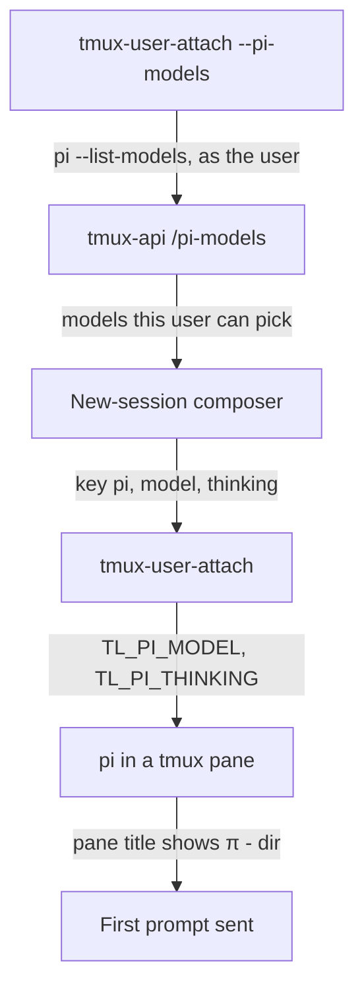
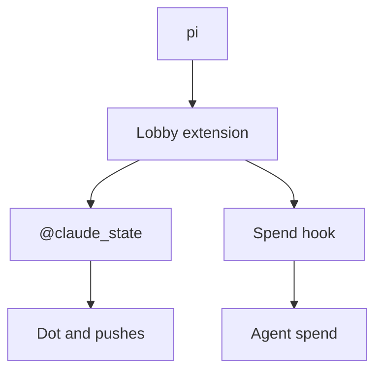

# Pi as a third harness

Terminal Lobby starts and recognises two harnesses today, Claude Code and
Codex. This adds [pi](https://pi.dev), the minimal terminal coding agent
published as `@earendil-works/pi-coding-agent`, as a third, for every user on
the devvm. The design came out of a grill-with-docs session with Viktor on
2026-09-25, and two independent reviewers checked the build plan against the
code before any of it was written.

## Decisions

| Area | Decision |
|---|---|
| Who | Every roster user (today wizard and emo). Accounts outside the roster, such as Anca's parked account and breakglass, can run `/usr/bin/pi` but get neither the lobby extension nor the org policy. Viktor accepted this gap. |
| Sign-in | Each person signs pi in with pi's own `/login`. Viktor's pi runs on his Claude Enterprise seat for now, and his CLI auth proxy replaces `/login` later, as part of that separate work. Nothing in this change holds a credential. |
| Install | Machine-wide npm global, latest release, refreshed by the daily agent updater. Pi's phone-home defaults (install report, version check, model catalogue) stay on. |
| Org policy | The lobby extension appends `/etc/pi/org-policy.md`, the same text Claude and Codex receive, to pi's system prompt on every turn. |
| Personal instructions | `~/.pi/agent/AGENTS.md` links to `~/.agents/AGENTS.md`. Skills load from `~/.agents/skills`, which pi reads without setup, and that folder already holds all of Viktor's skills. |
| Lobby | Pi in the new-session composer with a first prompt, a π mark in the sidebar, a model and thinking picker, the running/idle dot, and its own section on Agent spend. |
| Hooks | None of Claude's hooks are ported (memory recall, unslop check, OTel telemetry). |
| Same as Codex | No text view timeline, agent-api, pre-warm pool, idle suspend or restore after kill for pi. A pi session's title comes from its first prompt line. The container image does not ship pi. |

### Why pi runs on the Enterprise seat, and what that means

> [!NOTE]
> Anthropic's
> [legal and compliance page](https://code.claude.com/docs/en/legal-and-compliance)
> describes subscription OAuth as designed for "ordinary use of Claude Code and
> other native Anthropic applications", with enforcement possible "without prior
> notice". Since April 2026, Anthropic has billed third-party harness traffic on
> a subscription as per-token extra usage rather than refusing it, and pi shows a
> warning saying so. Viktor weighed that and chose the seat; the alternative
> was a personal pay-per-token API key, which would be new spend.

## How the pieces fit

Starting a session:

While it runs, the lobby extension inside pi stamps the session state through
`claude-tmux-state` and posts spend to `/hooks/pi-usage` when a turn is done.
It also appends the org policy on every turn, and the model chip drives pi
through `/model` and `/thinking`.

## Components

### The lobby extension

`devvm/pi-extension.js`, shipped by the terminal-lobby package to
`/usr/share/terminal-lobby/pi-extension.js` and linked into each roster user's
`~/.pi/agent/extensions/terminal-lobby.js` by the provisioner. It is plain
JavaScript so pi loads it without a TypeScript transpile. It acts only in
pi's interactive mode inside tmux, keeps its factory free of side effects, and
runs its tmux calls one at a time so two quick stamps cannot land out of order.
Every failure is silent, so a fault in the extension never interrupts pi.

| Pi event | What the extension does |
|---|---|
| `session_start` | Applies the launch model and thinking level from `TL_PI_MODEL` and `TL_PI_THINKING`, reads the org policy, stamps `done`, and stamps the model, the thinking level and the levels that model supports. |
| `project_trust` | Stamps `awaiting` and returns no decision, so pi still asks the person. |
| `agent_start` | Stamps `running`. |
| `agent_settled` | Stamps `done`, and posts the session's running totals to `POST /hooks/pi-usage`. |
| `ui_prompt_start` / `ui_prompt_end` | Stamps `awaiting`, then `running` or `done` depending on whether a turn is in flight. |
| `model_select`, `thinking_level_select` | Re-stamps the model, thinking level and supported levels. |
| `before_agent_start` | Appends the org policy as a system prompt section. |
| `session_shutdown` with reason `quit` | Stamps `clear`. Other reasons (reload, new, resume, fork) leave the state alone. |

State goes through the existing `claude-tmux-state` script with empty stdin, so
pi sessions write the same `@claude_state` option five consumers already read.
The model details go into pane options `@tl_pi_model`, `@tl_pi_thinking` and
`@tl_pi_levels`, and the running cost into `@tl_usage_cost`, the option the
sidebar figure reads for Claude.

### terminal-lobby

- **Command key `pi`** in `tmux-user-attach`, `tmux-api/newcommands.go` and the
  frontend, labelled "Pi" and phrased "run pi". The chosen model and thinking
  level reach pi as `TL_PI_MODEL` and `TL_PI_THINKING` rather than as flags,
  because `pi --model` with a model the account no longer lists exits at once
  and the session would close as it opened. The launch-flag checks in
  `tmux-attach.sh` and `tmux-user-attach` widen to admit pi's model references
  (`provider/id`, up to 96 characters).
- **Model list**, recorded in ADR-0032: `tmux-user-attach --pi-models` runs
  `pi --list-models` in the user's own login shell, the way `--probe` answers
  `/new-commands`, and also prints the user's `enabledModels` setting.
  `GET /pi-models` in tmux-api parses both, keeps models matching exact ids or
  globs from that setting (all of them when it is empty or matches nothing),
  and caches the answer per user.
- **Tool detection**: comm `pi` maps to the tool `pi` in `tmux-api/proc.go`, with
  an explicit precedence behind claude and codex. A live pi counts as the owner
  of `@claude_state` in both `clearDeadStates` and tl-session-watch. Without the
  second one, every pi session would raise `ClaudeSessionDied` about a minute
  after its first turn.
- **First prompt**: `POST /prompt` takes the harness. For pi it waits until the
  pane title starts with `π - `, which, according to pi's source, it sets after
  startup has finished and after any trust question is answered; the live test
  confirms it. It never sends keys into pi's "Trust project folder?" dialog.
- **In-session switch**: `POST /model` accepts `pi` and types `/model
  provider/id` and `/thinking level` into an idle pane, then reads the result
  back from the stamped pane options.
- **Spend**: `POST /hooks/pi-usage` records a reading with tool `pi` into the
  same store Claude uses, and `GET /agent-spend` returns a Pi section.
  tmux-api cannot read other users' homes, so reading pi's session files
  directly would work only for wizard; posting from the extension works
  for everyone. Sessions that ran before the extension existed are not
  counted.
- **Smaller corrections**: push notifications name the harness instead of
  saying "Claude"; the skills page offers a restart only for Claude sessions;
  a cancel sent to a pi session is Escape, because Ctrl-C clears pi's editor
  and a second one exits.

### infra

- `playbooks/devvm.yml` installs the package with `ignore_scripts`, adds
  `pi-update` to the daily `agent-update` job, and makes `/tmp/jiti` a
  root-owned directory. Pi compiles extensions through jiti, which caches
  compiled code in `/tmp/jiti`. That directory is owned by wizard and
  group-writable today, so one user could leave compiled code there that
  another user's pi would then run. With the directory unwritable, jiti skips
  its cache.
- `scripts/t3-provision-users.sh` writes `/etc/pi/org-policy.md` from the
  committed managed settings (the same source as Codex's `requirements.toml`),
  and for each roster user creates `~/.pi/agent/extensions/terminal-lobby.js`
  pointing at the shipped extension. For users whose `AGENTS.md` it manages, it
  also links `~/.pi/agent/AGENTS.md` to `~/.agents/AGENTS.md`.

### Viktor's dotfiles

agents-sync links wizard's `~/.pi/agent/AGENTS.md` to `~/.agents/AGENTS.md`,
beside the Claude and Codex links it already keeps.

## Verification

Done means driving it in the lobby and reading the screenshots back:

1. Viktor signs his pi in with `/login` in a lobby pi session.
2. A new pi session from the composer, with a first prompt, in a folder that
   raises the trust question and in one that does not.
3. The π mark, and the dot moving from running to done.
4. The model chip switching model and thinking level.
5. A Pi figure on the Agent spend page and beside the session.
6. No `claude_died` line from tl-session-watch for a pi session that is alive.
7. `ansible-playbook --check` is a no-op after the apply, and emo's
   `~/.pi/agent` holds the provisioned links.

## Open questions

- Whether `agent_settled` fires when a turn is interrupted with Escape. If it
  does not, the dot could stay on running until the next turn; the live test
  settles it.
- How pi's own cost figure compares with what the Enterprise seat is billed.
  Pi prices tokens from its catalogue, so the Pi section shows pi's estimate.
- Multi-line input in the browser terminal. Pi uses Shift+Enter for a newline,
  and tmux on the box has extended keys off. The browser terminal may not send
  a distinct Shift+Enter at all, in which case nothing changes; the live test
  settles that too.
