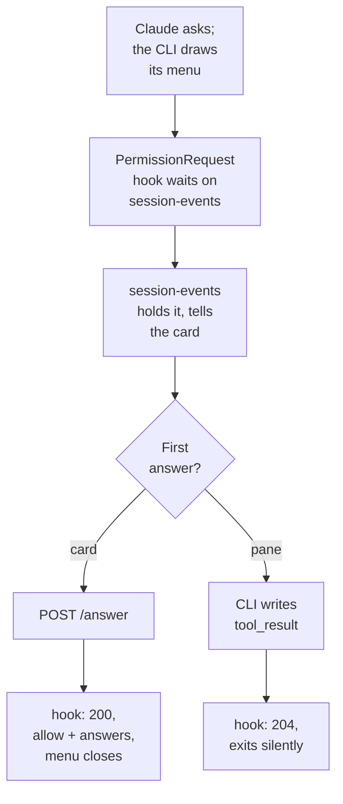

# Answering Claude's questions the way T3 Code does

**Status:** built and deployed 2026-09-27 (v0.79.0, with the removal in the release after it), and checked live.
**Owner:** wizard. **Repos touched:** terminal-lobby (devvm hook script, session-events, sessionio, frontend-v2) and infra (managed settings).
**Decisions from:** Viktor's request on 2026-09-27 and the four rounds of questions he answered the same day. The decision record is ADR-0034.

## The request

Viktor, 2026-09-27: *"let's work on t3 code question tool handling ... let's
see how t3 code handles it and mirror the behaviour. right now it's quite
unstable."*

His screenshot showed the question card reading "screen not recognised" over a
raw copy of the pane, cut off at the right edge, with a four-option multi-select
question underneath.

## What happens today

The card learns the question from the transcript, and `session-events` answers
it by pressing keys in the pane, after reading the pane to find out where the
dialog is (ADR-0010 and its three amendments).

| Measure | Value |
|---|---|
| Answers since the 2026-09-10 rework | 237 |
| Failed | 27 (11%): 10 `not-drawn`, 9 `no-dialog`, 8 `unverified` |
| Commits to the parser and card since 2026-09-10 | 22, roughly half for multi-select |

The screenshot's failure: the session's pane was 80x23 and the dialog was taller
than that. The CLI cuts a too-tall dialog off at the top, so the question text
never reached `capture-pane`, and `ParseDialog` needs that text. The fallback for
clipped dialogs shipped the same morning (257a4162) covers single-select only.
The cut-off right edge was the card showing 80-column pane lines on a phone.

## How T3 Code does it

T3 never reads a screen. The Agent SDK hands it the question through the
`canUseTool` callback (`apps/server/src/provider/Layers/ClaudeAdapter.ts:3864`),
and it answers with:

```ts
{ behavior: "allow", updatedInput: { questions: toolInput.questions, answers } }
```

where `answers` is keyed by the full question text. Its web card
(`ComposerPendingUserInputPanel.tsx`) docks above the composer, shows one
question at a time with an `i/N` counter and Previous/Next, auto-advances a
single-select pick after 200 ms, toggles multi-select in place, takes keys 1-9,
and collapses. It has no "Other" row: while a question is pending, the composer
is the free-text answer. It sends one answer map once every question has one.

## What we can use from Claude Code

Our sessions run the interactive CLI in tmux, not the SDK, so `canUseTool` is
not available. Claude Code offers the same payload through hooks. Measured on
2.1.283 with throwaway sessions:

| Behaviour | PreToolUse hook | PermissionRequest hook |
|---|---|---|
| Menu drawn while the hook waits | no, a spinner instead | yes |
| `allow` + `updatedInput` delivers the answers | yes | yes, and the menu closes |
| Fires in bypass mode | yes | yes |
| Terminal answers first | not possible | the terminal's answer wins; the hook keeps running and its output is ignored |
| Hook times out | the menu draws | the menu stays up |
| Partial answer map | accepted, rest treated as skipped | same |
| `deny` with a message | Claude gets the message as an error | same, and the menu closes |

`PermissionRequest` keeps both the pane and the card answerable, which is the
"whoever answers first wins" behaviour ADR-0010 established. The same probes
showed that no hook can approve an `ExitPlanMode`: the approval menu appears
whatever the hook returns.

## Decisions

| Decision | Choice |
|---|---|
| What to mirror | Both T3's transport (answers as data) and its card |
| Transport | A `PermissionRequest` hook matched only on `AskUserQuestion`, installed through managed settings. The pane and the card race and the first answer wins |
| The pane-reading answer path for `AskUserQuestion` | Removed, not kept as a fallback. Plan and permission parsing stay |
| A question with no hold behind it | One plain line and "Open terminal". No raw pane |
| Layout | T3 web: docked above the composer, collapsible to one line, one question at a time with `i/N` and Previous/Next. Single-select auto-advances; multi-select toggles; keys 1-9 on desktop. Same on phone and desktop |
| Submitting | One answer map once every question has an answer. Multi-select sent as `"A, B"` |
| Free text | The composer is the answer to the question on show |
| Declining | "Chat about this" sends a `deny` whose message is the reader's text |
| Option previews | Kept, shown under the list in monospace (T3 drops them) |
| Plan approval | Restyled to match the question card; transport unchanged. It landed 7 of 7 approvals and 9 of 9 feedback sends since 2026-09-10 |
| In scope | `AskUserQuestion`, and the plan card's look |
| Out of scope | Permission prompts. T3 threads, since the bridge was retired on 2026-09-19 (ADR-0029) |

## How it fits together



### The hook

A new `question` verb on `/usr/local/bin/claude-se-hook`, the script that
already registers sessions with `session-events`. It reuses that script's route
to `localhost:7685` and its caller check (`localhostOnly(peerOwnsClaim(...))`,
which matches the caller's uid to the claimed user). It POSTs the stdin JSON
plus `$USER` and the tmux session name, then waits:

- `200` with answers: print the `allow` decision and exit.
- `200` with a chat reply: print a `deny` with that message and exit.
- `204`: the question was settled some other way; exit with no output.
- Connection refused or dropped (a `session-events` restart during an update):
  retry every 2 s until it gets one of the above. Re-registering the same
  question is idempotent.

Managed settings gain one entry:

```json
"PermissionRequest": [{
  "matcher": "AskUserQuestion",
  "hooks": [{ "type": "command", "command": "/usr/local/bin/claude-se-hook question", "timeout": 86400 }]
}]
```

### session-events

- `POST /hooks/question` holds the request open and records a **held question**
  for the tmux session: the questions and when the hold began.
- The session's SSE stream carries whether a question is held, through the
  existing `MetaAsking` path.
- `POST /answer/{session}` gains an `answers` map and a `chat` string. Either one
  settles the hold. A request for a session with no hold is refused, and the
  refusal says so, so the card can switch to the terminal line.
- When the transcript shows a `tool_result` for an `AskUserQuestion` whose
  questions match the hold, the hold is released with `204`. The hook's stdin has
  no `tool_use_id`, so the match uses the session and the question text.
- Answer keys are built from the held `questions[].question`, never from the
  card's copy, so a trailing `?` cannot turn into a silent "did not answer".
- Telemetry, structure only per ADR-0008: held, answered by card, answered by
  pane, chat reply, released without an answer.

### The card

`frontend-v2/src/components/QuestionCard.tsx` is rebuilt around a local draft
per question (chosen labels or a custom answer), in the shape of T3's
`pendingUserInput.ts`. The card is answerable only while the question is held.
The plan card takes the same frame, header and collapse behaviour, and keeps
its own transport.

### What goes

- `ParseDialog` and the `AskUserQuestion` half of `answerdrive.go` and
  `answerplan.go`, including `clippedQuestion`, the marker fingerprint and the
  `dialog-*.txt` fixtures that only served them.
- The raw-pane keypad for questions.
- The glossary entries that described the removed reading: **Drawn question**,
  **Dialog progress**, **Free-text row**, **Commit row**, **Marker fingerprint**.

## Build order

1. `session-events`: the hold, the release on `tool_result`, the `answers` and
   `chat` fields, test-first.
2. The `question` verb in `claude-se-hook`, with a test that drives it against a
   stub server.
3. The card rebuild and the plan card restyle.
4. Release terminal-lobby. A server with the route and no hook installed changes
   nothing, since no question is ever held.
5. Add the hook to managed settings in infra and apply `devvm.yml`.
6. Remove the pane-reading path for `AskUserQuestion` and the retired glossary
   entries.

## How we will know it works

Each check runs against a real session on the devvm:

- The screenshot's case: a multi-select question with long descriptions in an
  80x23 pane, answered from the card.
- The race: the card open while the pane answers, and the card settling without
  sending anything.
- A multi-question call answered from the card, then read back from the
  transcript `tool_result`.
- "Chat about this", and Claude's reply to it.
- A `session-events` restart during a hold, then an answer from the card.
- A hold left for more than 10 minutes, then answered.
- The card on a phone: the shared Android emulator and `homelab ios shot`.

## What the live checks showed

Run on 2026-09-27 against v0.79.0 on the devvm, with a scratch Claude session
in an 80x23 pane driven through `scripts/qa-harness.py`.

| Check | Result |
|---|---|
| Hook fires as the menu draws | Held 33-38 ms after Claude asked, every time |
| The screenshot's case: a four-option multi-select with 35-word descriptions in 80x23, answered from the card | Landed. Claude received "A. Pages how-to into publish-page, C. Merge the short Memory section into M" and "After", and the transcript `toolUseResult.answers` matches |
| The terminal answers first | Hold released as `terminal`, the card left, no hook process remained |
| "Chat about this" with words in the composer | The CLI showed "Denied by PermissionRequest hook", Claude answered the words and did not ask again |
| session-events restarted during a hold | The hook re-held the question 2 s after the restart and the card's answer landed |
| A hold left for 11 minutes | Answered from the card after 672 s. The 86400 s timeout holds past 10 minutes |
| A phone | The card on the shared Android emulator's Chrome (1080x2400), answered by a tap |
| Real use | Another session on the box had a question released as `terminal` and a four-question call held, within minutes of the release |

Found and fixed during the checks: the answer record's `tl.questions` read 0
for a held call, and the composer's placeholder wrapped to a cut-off second line
on the phone.

Not checked: an iPhone. The `homelab ios` rig was unreachable (its Mac did not
answer ssh), so Safari is unverified.

## What was kept

- `ParseDialog`, for detection only: the prompt guard (`session-events/plan.go`)
  and the mode dial (`sessionio/setmode.go`) ask it whether a question is on
  screen before they type anything.
- `POST /answer-text`, which types free text and reads no screen.

## Decided after the build

Viktor, 2026-09-27: the blocking cards keep the composer under them, as shipped.
The T3 pass on the Text view (`docs/plans/2026-09-27-text-view-t3-pass.md` on
`wizard/t3-pass`) drafted the card taking the composer's place with "Type your
own answer" as its last option; that part of the draft is dropped, and the
question card's layout here is the one it builds on.

Viktor, 2026-09-27, later the same evening, superseding the note above: the
card takes the composer's place, as the T3 pass builds it. Asked to choose
between the two when the clash surfaced before release, he chose "Card
replaces the composer" for all three blocking cards (question, permission,
plan). The hook that holds the question, and the way this doc answers it, stay
as designed; only where the card sits changes, and the T3 pass carries it.

## Open questions

- Whether a managed-settings change reaches sessions already running is still
  not known. Sessions started before the hook was installed answer through the
  terminal, and the card says so after four seconds.
