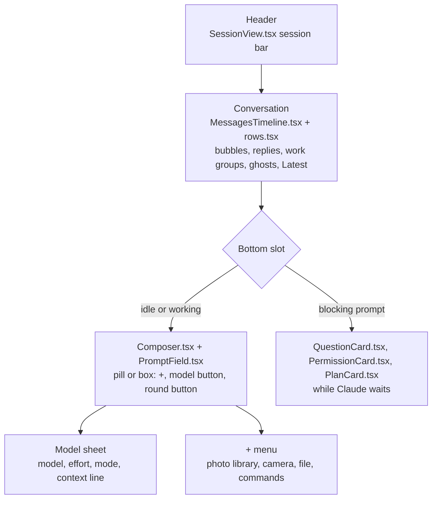
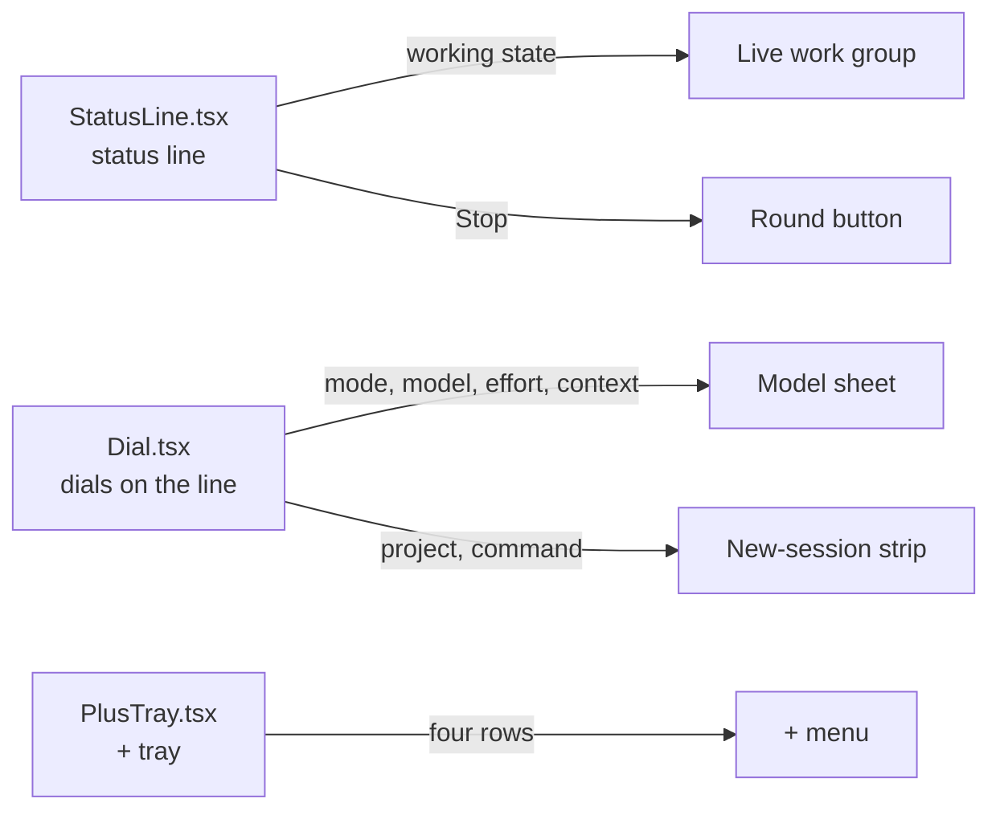

# Text view: a T3 pass

**Status:** draft, prototype for review (2026-09-27).
**Owner:** wizard. **Repos touched:** none yet. The prototype lives beside the published page on pages.viktorbarzin.me, under `composer/`; no lobby code has changed.
**Decisions from:** Viktor's request on 2026-09-27 and the answers he settled the same day, listed under [Decisions](#decisions).
**Builds on:** `docs/plans/2026-09-24-text-composer-redesign.md` (Quiet line, live since 0.78.0).

**[Open the prototype](composer/6-t3.html).** Both frames take typing, the state
switcher covers every screen below, and the theme toggle switches between
slate, t3-dark and t3-light.

## What Viktor asked for, and why

Viktor asked for the Text view to feel like T3 Code. He likes three things
about T3: its composer, how its conversation reads, and its overall look and
feel. He does not want its navigation; the lobby's sessions list, projects and
view switching stay the lobby's.

The pass is drawn with the lobby's own theme tokens
(`frontend-v2/src/theme/theme.css`), so every theme in the picker keeps
working. Desktop and phone carry equal weight. His phone is an iPhone with the
lobby added to the home screen, and what he finds hard there today is:

- with the keyboard up, the conversation is hidden;
- scrolling works against him;
- there is too much on screen at once;
- the controls are cramped.

The T3 figures the prototype works from were measured on this box on
2026-09-26 and in Viktor's own iPhone screenshots: a 50px pill at rest, a
142px box when focused, a 22px outer radius on the composer, a 32px round Send,
system-ui for prose (16px/24px body, 14px/22.75px message text, 16px in the
phone's field so iOS does not zoom), and a bordered tool row with a status dot,
a summary and a chevron.

## Decisions

All of these are Viktor's, settled on 2026-09-27.

| Area | Decision |
|---|---|
| Reference | T3 Code's composer, conversation and look, drawn with the lobby's theme tokens. Not T3's navigation. |
| Weighting | Desktop and phone weigh the same. |
| Composer at rest (phone) | One 50px pill: "+" on the left, the placeholder "Ask Claude, or run a command…", a round Send on the right. No mic. |
| Composer focused, and always on desktop | A box: the text on top, then a bottom row with "+", one model button ("Opus 5.5 ⌄" with a small sparkle), and the round button on the right. No mode chip and no context ring in the row. |
| The model button | Opens one sheet (a bottom sheet on the phone, a popover on desktop) with three sections: Model (a list, current one checked), Effort (segmented: low, medium, high, xhigh, max, and whatever the model offers), and Mode. Context usage is one quiet line in the sheet, for example "Context 42% used". |
| Modes in the sheet | Manual "Asks before every edit and command"; Edits "File edits land unasked. Commands still ask"; Auto "Most actions land unasked. Risky ones ask"; Plan "Reads and plans. Changes nothing". Below a rule, in the danger tone: Bypass "Nothing asks. Every tool runs"; No ask "Nothing asks. Anything that would ask is refused", disabled unless it is the current mode. |
| Bypass and no ask | The box or pill border turns the danger colour and the model button carries a small red shield. Nothing else changes. |
| "+" | Opens a small menu: Photo library, Camera, File, Commands (the `/` list). Typing `/` or `@` still works. |
| The round button | Send (an arrow) when idle. While Claude works and the field is empty, it is Stop (a square). Once you type mid-turn it turns back into Send, and the message queues as a ghost bubble at the end of the conversation. Send greys out when the field is empty and nothing is running. |
| Live state | Lives in the conversation. The running **work group** row at the end shows the live tool and the elapsed time, with a spinner ("Running sleep 6 && echo b · 2 done · 14s"). There is no status line above the composer. |
| Tool calls | Each run of tool calls between two replies is one bordered row ("Ran 3 commands, edited 2 files · 28s ▸"). A tap expands it into compact per-call rows. Pictures from tools show as thumbnails under the row, even when it is folded. |
| How the conversation reads | Claude's replies as plain text with no bubble; the user's messages as rounded grey bubbles on the right; calm spacing. System font for prose at T3's sizes, JetBrains Mono for code and commands. |
| Blocking prompts | A permission prompt, an `AskUserQuestion` and a plan approval each replace the composer while Claude waits, with "Type your own answer" as one option ("Tell Claude what to change" for the plan). The conversation keeps the rest of the screen. |
| Following | Like a chat app. Send jumps to your message. With the keyboard open, the last line stays in view if you were at the bottom. A reader who scrolled up stays put and gets a small "Latest" button that covers nothing. |
| Phone header | A round back button, the title with a subtitle (project and state, for example "code · working"), and one rounded group of icon buttons on the right: Terminal (`>_`) and "…". Desktop draws the same header in the pane. |
| Desktop layout | Conversation and composer share one centred column about 760px wide. |
| New session | The same box at full size, with the project and the command as a strip under it, like T3's workspace and branch strip. A plain shell turns the box into "Name this shell…". |
| Defaults | A watching device's pill reads "Watching · Take control" and cannot send. A folded pill with an unsent draft shows the draft's first line. All themes work. |

## Regions and who owns them

The Text view keeps three regions: the header, the conversation, and one
bottom slot that holds either the composer or the card Claude is waiting on.
The diagram names the component that owns each part today and marks what this
pass retires. Component names are the current ones under
`frontend-v2/src/components/`; where a part moves, the arrow shows where to.

The new-session screen is `NewSessionComposer.tsx`: the same box at full size,
with the project and command strip under it. Three pieces retire, and their
jobs move:

What the pass changes per owner, in short:

- `MessagesTimeline.tsx` and `rows.tsx` draw the work group, its thumbnails
  and the live group at the end. The ghost bubbles and the Latest button
  already live here; Latest moves into a band above the composer.
- `Composer.tsx` and `PromptField.tsx` draw the pill and the box and own the
  round button's three states. The status line above them goes.
- The sheet replaces the dials' popovers and the phone's tabbed sheet.
  `ModelPanel.tsx` and `ModePanel.tsx` look like candidates to reuse inside it;
  that has not been checked.
- `QuestionCard.tsx`, `PermissionCard.tsx` and `PlanCard.tsx` render in the
  composer's place instead of docking above it, and each gains the typed answer
  as its last row.
- `NewSessionComposer.tsx` moves its project and command pickers from dials on
  a line above the field to a strip under the box.

## What changes from Quiet line (0.78.0, live now)

| Area | Quiet line, live in 0.78.0 | This pass |
|---|---|---|
| Composer shape | A thin status line above a pill, on both desktop and phone. | Phone: a 50px pill at rest, a box when focused. Desktop: always the box. |
| Height at rest | 86px on desktop, 92px on the phone (without the home-indicator strip). | Measured in the prototype: 108px on desktop, where the box is always open; 50px pill plus 8px under it on the phone. The phone's focused box is 142px, matching T3. |
| Session state | The status line's left side: "Working · tool · elapsed · N steps". | The live work group at the end of the conversation, plus the header subtitle ("code · working"). |
| Stop | A pill on the status line, beside the work. | The round button, while Claude works and the field is empty. |
| Send mid-turn | Send stays Send with a "queues" hint beside it; it never greys out. | Send while typing, Stop while the field is empty. Send greys out only when the field is empty and nothing runs. |
| Mode, model, effort, context | Labelled dials on the status line; the phone gets one sheet with a tab per dial. | One model button in the box; one sheet with Model, Effort and Mode sections and a context line. |
| "+" | The + tray: attach a file, add a photo, a `/` command, an `@` path. | A menu: Photo library, Camera, File, Commands. `@` is typed only. |
| Bypass and no ask | Hatched danger mode tab, danger pill border, dashed danger rule on the dock's top edge, danger placeholder. | Danger border on the box or pill, and a red shield on the model button. |
| Blocking prompts | Cards dock above the composer (up to 62% of the pane), and the composer stays under them. | The card takes the composer's place, with a typed answer as its last option. |
| Tool calls in a settled turn | Everything but the last reply folds behind "Worked for Ns · N steps". | Each run of calls between two replies is one work group row; replies in between stay visible. Thumbnails show under folded rows. |
| Scrolled-up reader | "↓ Latest" floats over the end of the conversation while the reader is scrolled up (`MessagesTimeline.tsx`). | The same button, moved into its own band above the composer so it covers no text, and it says when Claude is working. |
| Phone header | "‹ Sessions", a title chip, a status dot, "…", and the Text/Terminal segmented switch. | Round back button, title with subtitle, one group with Terminal and "…". |
| Reading column | Up to 860px. | About 760px, shared by the conversation and the composer. |
| Prose font | DM Sans, the lobby's UI face. | System font at T3's sizes; JetBrains Mono stays for code. |
| New session | Three dials on a line above the field: project, command, model with effort. | The box at full size with the project and the command in a strip under it; the model sits in the box. |
| Watching | The status line gives the reason, with Take control on the line. | The pill reads "Watching" with a Take control button, and cannot send. |

## Screens

Every state below is in the prototype's switcher, drawn in both frames. These
are the slate theme; each has a t3-light twin at `composer/shots/6-<state>-light.webp`.

**Idle.** The phone's pill at rest, the desktop's box.

**Keyboard up.** The phone's focused box with the keyboard; the last lines stay in view.

**Working.** The live work group at the end; the round button is Stop.

**Typing mid-turn.** Text in the field turns Stop back into Send.

**Queued.** After Send, the message waits as a ghost bubble and the button is Stop again.

**Work groups.** One group open, the earlier one folded with its pictures under it.

**Model sheet.** Popover on desktop, bottom sheet on the phone.

**Bypass.** The danger border and the shield on the model button.

**The + menu.**

**Question, permission, plan.** Each card takes the composer's place.

**Scrolled up.** The reader stays put; Latest sits in its own band above the composer.

**New session and a new shell.**

**Watching.**

## How the prototype was checked

Each state was screenshotted in both frames and both themes with Python
Playwright, and every shot was read back. A script also checked each frame for
horizontal overflow (none at 390px), for the phone field's font size (16px),
and measured the composer: 50px as the phone's pill, 142px as its focused box,
108px as the desktop box. A second script drove the interactions: typing and
Enter on desktop, the phone's pill turning into the box with the keyboard,
typing on the drawn keyboard, queueing mid-turn, Stop, choosing a model and a
mode, `/` completion, answering each card, Take control, and starting a new
session.

What it does not show: real iOS behaviour. The keyboard is drawn, not raised,
so the keyboard-up layout is a simulation. Checking it on the iPhone
(`homelab ios shot`) belongs to the build, not to this review.

## Open questions

1. **Replies inside a turn.** Today a settled turn folds everything but its last
   reply behind "Worked for Ns". Work groups keep the replies between tool runs
   visible, which is how the prototype reads. Long turns with many short
   replies will be longer on screen than they are today. Is that the intent, or
   should a settled turn still fold, with work groups inside the fold?
2. **Where the typed answer goes for a multi-select question.** The prototype
   answers a single-select on the first tap. A multi-select needs ticks and a
   submit; the card's existing multi-select flow would carry over, but the
   prototype does not draw it.
3. **Stop with queued messages.** The prototype sends the first queued message
   once Stop ends the turn, as the queue does today when a turn ends. Should
   Stop also clear the queue?
4. **Header on desktop.** The prototype drops the back button on desktop, since
   the sidebar is always there. The Text/Terminal switch becomes the Terminal
   icon in both. Is one icon enough of a way back to the Terminal on desktop?
5. **Prose font.** The pass uses the system font for prose while the rest of the
   lobby uses DM Sans. Should the switch cover the whole lobby, only the Text
   view, or only its conversation?
6. **Effort per model.** The sheet shows the efforts each model offers (the
   prototype assumes Sonnet has no xhigh and Haiku has one level). The real
   list should come from what the box reports per model.
