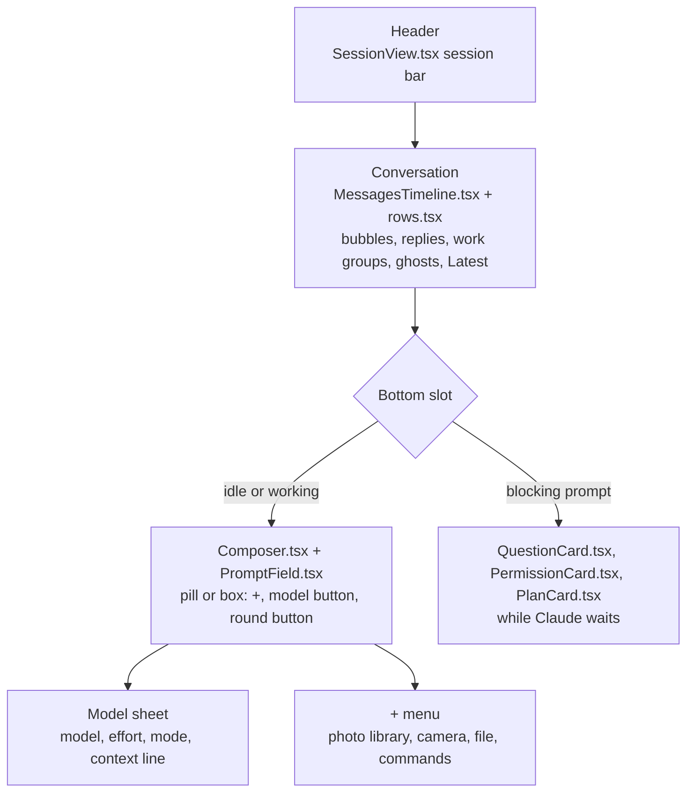
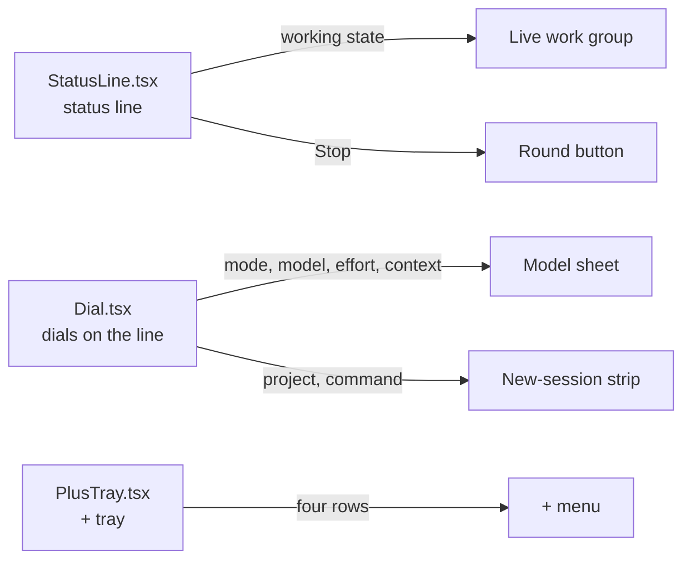

# Text view: a T3 pass

**Status:** released in 0.81.0 (2026-09-28). Viktor approved the prototype on 2026-09-27 ("yea looks good. go and build it"); what the build measured and where it differs from the prototype is under [What shipped](#what-shipped).
**Owner:** wizard. **Repos touched:** terminal-lobby (`frontend-v2`, `sessionio`, `session-events`). The prototype lives beside the published page on pages.viktorbarzin.me, under `composer/`.
**Decisions from:** Viktor's request on 2026-09-27 and the answers he settled the same day, listed under [Decisions](#decisions).
**Builds on:** `docs/plans/2026-09-24-text-composer-redesign.md` (Quiet line, live since 0.78.0).

**[Open the prototype](composer/6-t3.html).** Both frames take typing, the state
switcher covers every screen below, and the theme toggle switches between
slate, t3-dark and t3-light.

## What Viktor asked for, and why

Viktor asked for the Text view to feel like T3 Code. He likes three things
about T3: its composer, how its conversation reads, and its overall look and
feel. He does not want its navigation; the lobby's sessions list, projects and
view switching stay the lobby's.

The pass is drawn with the lobby's own theme tokens
(`frontend-v2/src/theme/theme.css`), so every theme in the picker keeps
working. Desktop and phone carry equal weight. His phone is an iPhone with the
lobby added to the home screen, and what he finds hard there today is:

- with the keyboard up, the conversation is hidden;
- scrolling works against him;
- there is too much on screen at once;
- the controls are cramped.

The T3 figures the prototype works from were measured on this box on
2026-09-26 and in Viktor's own iPhone screenshots: a 50px pill at rest, a
142px box when focused, a 22px outer radius on the composer, a 32px round Send,
system-ui for prose (16px/24px body, 14px/22.75px message text, 16px in the
phone's field so iOS does not zoom), and a bordered tool row with a status dot,
a summary and a chevron.

## Decisions

All of these are Viktor's, settled on 2026-09-27.

| Area | Decision |
|---|---|
| Reference | T3 Code's composer, conversation and look, drawn with the lobby's theme tokens. Not T3's navigation. |
| Weighting | Desktop and phone weigh the same. |
| Composer at rest (phone) | One 50px pill: "+" on the left, the placeholder "Ask Claude, or run a command…", a round Send on the right. No mic. |
| Composer focused, and always on desktop | A box: the text on top, then a bottom row with "+", one model button ("Opus 5.5 ⌄" with a small sparkle), and the round button on the right. No mode chip and no context ring in the row. |
| The model button | Opens one sheet (a bottom sheet on the phone, a popover on desktop) with three sections: Model (a list, current one checked), Effort (segmented: low, medium, high, xhigh, max, and whatever the model offers), and Mode. Context usage is one quiet line in the sheet, for example "Context 42% used". |
| Modes in the sheet | Manual "Asks before every edit and command"; Edits "File edits land unasked. Commands still ask"; Auto "Most actions land unasked. Risky ones ask"; Plan "Reads and plans. Changes nothing". Below a rule, in the danger tone: Bypass "Nothing asks. Every tool runs"; No ask "Nothing asks. Anything that would ask is refused", disabled unless it is the current mode. |
| Bypass and no ask | The box or pill border turns the danger colour and the model button carries a small red shield. Nothing else changes. |
| "+" | Opens a small menu: Photo library, Camera, File, Commands (the `/` list). Typing `/` or `@` still works. |
| The round button | Send (an arrow) when idle. While Claude works and the field is empty, it is Stop (a square). Once you type mid-turn it turns back into Send, and the message queues as a ghost bubble at the end of the conversation. Send greys out when the field is empty and nothing is running. |
| Live state | Lives in the conversation. The running **work group** row at the end shows the live tool and the elapsed time, with a spinner ("Running sleep 6 && echo b · 2 done · 14s"). There is no status line above the composer. |
| Tool calls | Each run of tool calls between two replies is one bordered row ("Ran 3 commands, edited 2 files · 28s ▸"). A tap expands it into compact per-call rows. Pictures from tools show as thumbnails under the row, even when it is folded. |
| How the conversation reads | Claude's replies as plain text with no bubble; the user's messages as rounded grey bubbles on the right; calm spacing. System font for prose at T3's sizes, JetBrains Mono for code and commands. |
| Blocking prompts | A permission prompt, an `AskUserQuestion` and a plan approval each replace the composer while Claude waits, with "Type your own answer" as one option ("Tell Claude what to change" for the plan). The conversation keeps the rest of the screen. |
| Following | Like a chat app. Send jumps to your message. With the keyboard open, the last line stays in view if you were at the bottom. A reader who scrolled up stays put and gets a small "Latest" button that covers nothing. |
| Phone header | A round back button, the title with a subtitle (project and state, for example "code · working"), and one rounded group of icon buttons on the right: Terminal (`>_`) and "…". Desktop draws the same header in the pane. |
| Desktop layout | Conversation and composer share one centred column about 760px wide. |
| New session | The same box at full size, with the project and the command as a strip under it, like T3's workspace and branch strip. A plain shell turns the box into "Name this shell…". |
| Defaults | A watching device's pill reads "Watching · Take control" and cannot send. A folded pill with an unsent draft shows the draft's first line. All themes work. |

## Regions and who owns them

The Text view keeps three regions: the header, the conversation, and one
bottom slot that holds either the composer or the card Claude is waiting on.
The diagram names the component that owns each part today and marks what this
pass retires. Component names are the current ones under
`frontend-v2/src/components/`; where a part moves, the arrow shows where to.

The new-session screen is `NewSessionComposer.tsx`: the same box at full size,
with the project and command strip under it. Three pieces retire, and their
jobs move:

What the pass changes per owner, in short:

- `MessagesTimeline.tsx` and `rows.tsx` draw the work group, its thumbnails
  and the live group at the end. The ghost bubbles and the Latest button
  already live here; Latest moves into a band above the composer.
- `Composer.tsx` and `PromptField.tsx` draw the pill and the box and own the
  round button's three states. The status line above them goes.
- The sheet replaces the dials' popovers and the phone's tabbed sheet. It was
  built as `ModelSheet.tsx`; `ModelPanel.tsx` and `ModePanel.tsx` were retired
  rather than reused, and their behaviour is covered by the sheet's tests.
- `QuestionCard.tsx`, `PermissionCard.tsx` and `PlanCard.tsx` render in the
  composer's place instead of docking above it, and each gains the typed answer
  as its last row.
- `NewSessionComposer.tsx` moves its project and command pickers from dials on
  a line above the field to a strip under the box.

## What changes from Quiet line (0.78.0 to 0.79.x)

| Area | Quiet line, live in 0.78.0 | This pass |
|---|---|---|
| Composer shape | A thin status line above a pill, on both desktop and phone. | Phone: a 50px pill at rest, a box when focused. Desktop: always the box. |
| Height at rest | 86px on desktop, 92px on the phone (without the home-indicator strip). | Measured in the prototype: 108px on desktop, where the box is always open; 50px pill plus 8px under it on the phone. The phone's focused box is 142px, matching T3. |
| Session state | The status line's left side: "Working · tool · elapsed · N steps". | The live work group at the end of the conversation, plus the header subtitle ("code · working"). |
| Stop | A pill on the status line, beside the work. | The round button, while Claude works and the field is empty. |
| Send mid-turn | Send stays Send with a "queues" hint beside it; it never greys out. | Send while typing, Stop while the field is empty. Send greys out only when the field is empty and nothing runs. |
| Mode, model, effort, context | Labelled dials on the status line; the phone gets one sheet with a tab per dial. | One model button in the box; one sheet with Model, Effort and Mode sections and a context line. |
| "+" | The + tray: attach a file, add a photo, a `/` command, an `@` path. | A menu: Photo library, Camera, File, Commands. `@` is typed only. |
| Bypass and no ask | Hatched danger mode tab, danger pill border, dashed danger rule on the dock's top edge, danger placeholder. | Danger border on the box or pill, and a red shield on the model button. |
| Blocking prompts | Cards dock above the composer (up to 62% of the pane), and the composer stays under them. | The card takes the composer's place, with a typed answer as its last option. |
| Tool calls in a settled turn | Everything but the last reply folds behind "Worked for Ns · N steps". | Each run of calls between two replies is one work group row; replies in between stay visible. Thumbnails show under folded rows. |
| Scrolled-up reader | "↓ Latest" floats over the end of the conversation while the reader is scrolled up (`MessagesTimeline.tsx`). | The same button, moved into its own band above the composer so it covers no text, and it says when Claude is working. |
| Phone header | "‹ Sessions", a title chip, a status dot, "…", and the Text/Terminal segmented switch. | Round back button, title with subtitle, one group with Terminal and "…". |
| Reading column | Up to 860px. | About 760px, shared by the conversation and the composer. |
| Prose font | DM Sans, the lobby's UI face. | System font at T3's sizes; JetBrains Mono stays for code. |
| New session | Three dials on a line above the field: project, command, model with effort. | The box at full size with the project and the command in a strip under it; the model sits in the box. |
| Watching | The status line gives the reason, with Take control on the line. | The pill reads "Watching" with a Take control button, and cannot send. |

## Screens

Every state below is in the prototype's switcher, drawn in both frames. These
are the slate theme; each has a t3-light twin at `composer/shots/6-<state>-light.webp`.

**Idle.** The phone's pill at rest, the desktop's box.

**Keyboard up.** The phone's focused box with the keyboard; the last lines stay in view.

**Working.** The live work group at the end; the round button is Stop.

**Typing mid-turn.** Text in the field turns Stop back into Send.

**Queued.** After Send, the message waits as a ghost bubble and the button is Stop again.

**Work groups.** One group open, the earlier one folded with its pictures under it.

**Model sheet.** Popover on desktop, bottom sheet on the phone.

**Bypass.** The danger border and the shield on the model button.

**The + menu.**

**Question, permission, plan.** Each card takes the composer's place.

**Scrolled up.** The reader stays put; Latest sits in its own band above the composer.

**New session and a new shell.**

**Watching.**

## How the prototype was checked

Each state was screenshotted in both frames and both themes with Python
Playwright, and every shot was read back. A script also checked each frame for
horizontal overflow (none at 390px), for the phone field's font size (16px),
and measured the composer: 50px as the phone's pill, 142px as its focused box,
108px as the desktop box. A second script drove the interactions: typing and
Enter on desktop, the phone's pill turning into the box with the keyboard,
typing on the drawn keyboard, queueing mid-turn, Stop, choosing a model and a
mode, `/` completion, answering each card, Take control, and starting a new
session.

What it does not show: real iOS behaviour. The keyboard is drawn, not raised,
so the keyboard-up layout is a simulation. Checking it on the iPhone
(`homelab ios shot`) belongs to the build, not to this review.

## Settled after the prototype

Viktor answered four questions the prototype raised, on 2026-09-27:

| Question | Decision |
|---|---|
| Replies inside a turn | A finished turn still folds to its last reply. Opening it shows the replies and work groups in order. |
| Stop with queued messages | Stop puts the queued messages back into the field as a draft, so nothing is sent that you did not see after stopping. |
| Text and Terminal on desktop | One icon in the header group on phone and desktop. The Terminal view shows a Text icon in the same place. |
| Reach of the system font | The whole Text view: conversation, composer, cards and header. The sidebar and the rest of the lobby keep DM Sans. |

## Open questions, answered in the build

1. **A multi-select question in the composer's place.** The prototype answers a
   single-select on the first tap. The card's existing multi-select flow
   carried over unchanged: ticks, then Next or Submit, one question at a time
   with an i/N counter. The card's own "Type your own answer" field joins it:
   its words win over the ticks while there are any, and Next or Submit use
   them like a pick. Checked live against a scratch session, where a typed
   answer plus two ticks went out as one call.
2. **Effort per model.** Read from the Claude Code 2.1.283 binary's built-in
   model catalogue (the `effort`, `xhigh_effort` and `max_effort` capabilities,
   which the CLI's own model list filters on). The prototype assumed Sonnet has
   no xhigh; it does. The table lives in `frontend-v2/src/lib/models.ts`
   (`effortsForModel`).

   | Model | Efforts the sheet offers |
   |---|---|
   | `claude-opus-5-5` | low, medium, high, xhigh, max. The CLI's default is medium; this box's managed `effortLevel` is high. |
   | `claude-opus-5`, `claude-opus-5[1m]` | low, medium, high, xhigh, max. Default high. |
   | `claude-sonnet-5` | low, medium, high, xhigh, max. |
   | `claude-opus-4-8` | low, medium, high, xhigh, max. Default high. |
   | `claude-haiku-4-5-20251001` | None: the model has no effort capability, and the sheet says "Haiku 4.5 has one effort level." |
   | Codex | Its existing catalogue (low, medium, high, xhigh, max, ultra); the repo has no per-model data for it. |
   | Pi | The levels the session stamps, under the heading "Thinking". |

   Ultracode is xhigh plus dynamic workflows rather than a level of thinking,
   so the live sheet's Effort row leaves it out; a session already running on
   it still sees it ticked. The new-session sheet keeps it on every model that
   has xhigh.

## What shipped

The build follows the prototype and the decisions above. These are the places
where it measured something first or differs from what the prototype draws.

**Stop.** Stop is the large round button now, and a second C-c at an idle
Claude prompt exits the CLI, so it has three guards. It shows only when the
session's hook-stamped state and the transcript's live row both read running:
the live row alone lags the pane, and Stop showed on a finished session in 98
of 100 samples. One press holds the button as "Stopping..." until the
hook-stamped state leaves running or 20s pass, after a live check found a
double tap sending two interrupts. Enter in an empty field does nothing; the
prototype stops on it, and the build does not copy that.

**Stop with queued messages.** Measured on Claude Code 2.1.283 on a scratch
session with two prompts queued mid-turn: C-c interrupts and then submits every
queued prompt as the next turn, and Escape does the same. Up on an empty input
box pops the whole queue into the box (the transcript's `popAll`), and an
interrupt after that leaves the text there unsent. So `POST /cancel` takes an
optional `{"restoreQueue": [...]}`: the server presses Up, waits for the box to
show the queue, clears it with C-e and one repeated run of Backspaces, and only
then sends C-c. The reply says whether the queue came off, and the Text view
fills the field only then; otherwise the prompts run as before. A dialog on the
pane, a pane with no input box, pi and Codex keep the plain interrupt. The live
check found two more things, both fixed: an interrupt before Claude's first
token puts a long prompt back on the input line wrapped, so the next Send now
clears every line of the box rather than one; and of two sends 100ms apart the
CLI recorded only the second's enqueue, so the hand-back merges the queue into
the order the prompts were sent. Re-run live on desktop and in iPhone
emulation: both prompts came back in order, nothing was submitted, and the
folded pill showed the draft's first line. `claude.cancelled` gains `tl.count`
for the prompts handed back (ADR-0006).

**Stop before Claude answers.** The live check on 2026-09-28 found that a
Stop pressed in the first seconds after Send lost the message. Measured on
Claude Code 2.1.283 on a scratch session: a C-c at 0.5, 1, 1.5, 2.5, 6 and 10
seconds after the prompt, with nothing from Claude yet, took the prompt out of
the conversation and put it back on the CLI's input line within 40 to 270 ms.
The transcript keeps the prompt's record and writes no interrupt notice, so
the Text view showed a sent bubble over an empty field, and the next send
erased the pane's copy. So the Text view names that prompt in the cancel body
as `returnPrompt` (the open turn's prompt while it is all the turn holds, or
the first message sent between turns that the transcript has not recorded
yet). After the interrupt the server waits up to 1.5 s for the text to land
on the input line, clears it, streams a `rewound` marker for the prompt's
turn and replies `"returned": true`; the view puts the prompt back in the
field ahead of any queued messages and drops the bubble. The normalizer also
marks a prompt as taken back from the transcript alone: the next user record
with words, with nothing from Claude and no interrupt notice in between,
unless the two were written as one queued batch (1 ms apart in every batch on
this box, 4.6 s apart at the least for a prompt taken back, over 21 cases).
Re-run live on desktop: Stop at 0.36, 1.5 and 2.7 s put the prompt back in
the field with an empty input line and no bubble; with a queued message behind
it both came back in order; a Stop 14 s in kept the bubble and the reply.

**A send right after a Stop.** The round 7 check on 2026-09-28 lost one message
in 9 tries: Enter 300 ms after an early Stop. The new prompt was pasted while
the cancel was still clearing the returned prompt off the input line, so the
clear's Backspaces took the new text with them and its Enter landed on an
empty line. POST /prompt and POST /cancel now take turns on a session's input
line, and a send pressed while a Stop is in flight waits for it (up to 5 s)
and goes out with only its own words. What a Stop hands back goes into the
field only when the field holds what it held at the Stop, or nothing; words
typed meanwhile go out alone, a toast says the stopped message follows, and
it lands in the field once they are sent. Before, it was glued in front of
them, and a quick Enter sent both. The replay of that race found the prompt
back about 100 ms after the Stop, often before typing began, so an Enter
within 3 s of it coming back, on a field that still starts with it, sends only
the words typed after it and leaves it in the field. Right after the
interrupt Claude Code can draw a panel where the input box was (its
feedback-draft panel did, over a scratch session), so the server keeps reading
the pane for the returned prompt for the whole 1.5 s rather than stopping at
the first read that shows no box. Replayed 12 times with Stop at 0.5 to 2.5 s
and typing 150 to 600 ms after it: every new prompt reached the transcript
alone, and the stopped prompt was back in the field each time it had been
taken back.

**The permission card's typed answer.** Measured on Claude Code 2.1.283 on a
scratch session: Tab on the prompt's No row opens a field ("No, and tell Claude
what to do differently"), and Enter there rejects the tool call with "the user
said: <words>". Claude carries on in the same turn; told "write bye instead of
hi", it asked to run the bye command next. So the words go through that row
rather than as a later prompt, as `POST /answer` with `{"permission":
{"decline": "<words>"}}`. The driver walks onto the No row one arrow at a time,
because the row's digit declines with no words, then presses Tab, pastes, reads
the words back off the row, and only then presses Enter. ADR-0010 and ADR-0006
carry the amendments.

**The question and plan cards.** With the card in the composer's place, the
question card's free-text answer and "Chat about this" read the card's own
field, and the plan card's "Approve with this feedback" moves under its "Tell
Claude what to change" field. The composer stays mounted behind a card, so its
draft and attachments come back as they were.

**Smaller differences.**

- A finished turn folded to its last reply carries the pictures of its hidden
  work groups under the fold row, so pictures stay in view when folded. The
  prototype does not draw a turn fold.
- The mode list's order is Manual, Edits, Auto, Plan, where Quiet line had
  Manual, Plan, Edits, Auto.
- Model rows carry a short description beside the name, as the prototype's
  do; the exact slug is the row's tooltip. More than three models go in two
  columns, on the phone and in the desktop popover, so every section and the
  context line fit at 390x844 and at 1280x800.
- The new-session button names the model a default start boots on (Opus 5.5,
  the managed settings' `model`), and its header carries the session header's
  icon group: Terminal starts a plain shell, and "…" holds Skills and
  Settings.
- The header uses the system font in both views, so the title keeps its face
  when the view switches. It has a fixed height, 56px on a desktop pane and
  58px on a phone, in both views, because a height change resizes the terminal
  under it. Find in session, Images, Files and the Watch toggle live in "…".
- Latest sits in a 42px band and reads "Latest · working" while Claude works.
  It stays away while a card is up.
- Card rows are 48px on a phone and 40px under any other finger.

**How the build was checked.** Unit tests for each item, then live checks: the
cards, Stop and the queue hand-back against scratch Claude sessions; desktop at
1280px and the phone at 390px in Chromium, in slate and T3 Light, beside the
prototype's shots; and the composer, header and switcher in real Chrome on the
Android emulator.

**What we don't know yet.** The build's commits record iPhone emulation and the
Android emulator, not the real iPhone. The keyboard-up layout in iOS Safari
from the home screen is the case to settle with `homelab ios shot` against the
deployed page.
