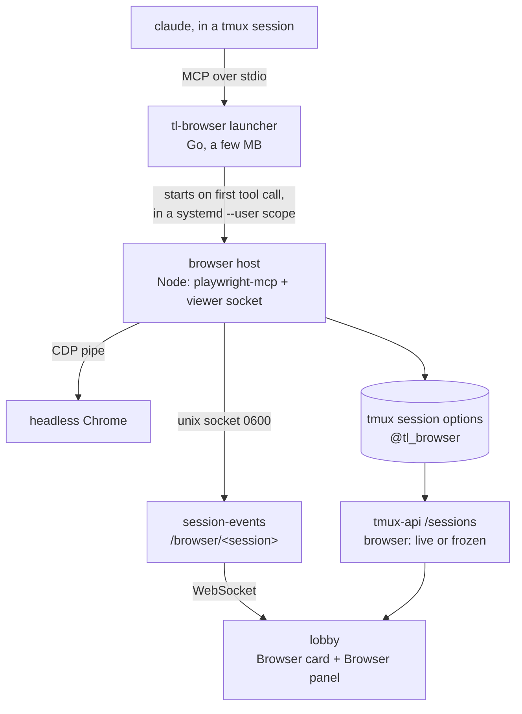
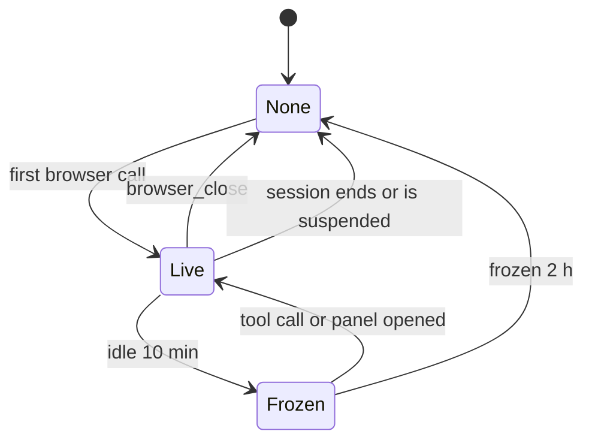

# See the browser a session is driving

Status: shipped in terminal-lobby 0.86.0 on 2026-10-01, with the infra side (ingress, provisioning, reaper). Viktor, 2026-10-01.
Decision record: [ADR-0035, each session gets its own browser, started on first use](../adr/0035-each-session-gets-its-own-browser-started-on-first-use.md).
Terms: **Session browser**, **Browsing run**, **Browser card**, **Browser panel**,
**Control**, **Frozen** in `CONTEXT.md`.

## The request

Viktor, 2026-10-01: *"let's add a way to view a browser in the session. i.e any
time a session uses a browser, we should be able to see the live browser in the
session. optionally we can click to take over the browser to fill in data."*
The reference was a chat with a "Browser" card holding a live thumbnail and an
"Open browser" button, beside a panel showing the live page with Stop and
"Take control of the browser".

On confirming the design he added: *"let's make sure browsers don't hog onto
memory and agents have a good way to clear up"*. That shaped the lifecycle and
memory sections below.

## Where things stand today

Every Claude session on the box drives a browser through one MCP server per OS
user, `playwright-mcp@<user>.service`. It runs headless Chrome with an isolated
profile seeded from the hourly storage-state snapshot of chrome-service.
Measured on 2026-10-01:

```stats
1 | playwright-mcp per OS user, shared by all of that user's sessions
141 MB | resident size of one idle playwright-mcp, before Chrome starts
29 | Claude processes on the box
9 GB | memory available, with swap at 13 of 14 GB
0 | ways the server can tell which session is calling
```

Each MCP connection already gets its own browser context, so sessions do not
see each other's tabs. What is missing is the link back to a session. Claude
Code sends a plain HTTP MCP server no session identifier, and its streamable
HTTP connections drop when idle, so mapping sockets to processes found 2 of 19
sessions. The lobby therefore has no way to say "this browser belongs to that
session", and the rest of this design depends on that link.

Playwright itself has what the viewing side needs: a JPEG screencast of a page
and public mouse and keyboard APIs. `@playwright/mcp` exports
`createConnection(config, contextGetter)`, so a program of ours can own the
browser and hand playwright-mcp the context to drive.

## Decisions

| Area | Decision |
|---|---|
| What counts | The browser the agent's built-in browser tool drives. `homelab browser` runs are not shown for now (see "Cluster browser runs") |
| Where Chrome runs | Locally, one per session, headless |
| Whose browser | One per session, started on the first browser action by a small launcher that answers Claude's startup handshake itself (ADR-0035) |
| Where it shows | Text view: a **Browser card** per **Browsing run**. Both views: a **Browser panel** inside that session's own pane |
| Opening | Only when someone opens it. The card stays in the conversation as a record |
| Live | Streams whenever a live card or an open panel is on screen. A card pauses when scrolled away, in a background tab, or when the session is parked; the panel pauses in a background tab or when its session leaves the screen, and for the person in control only in a background tab |
| Last frame | Kept in the page's memory only. A reload loses the picture, the card keeps its text |
| Tabs | The panel follows the tab the agent last acted on, with a tab strip to look at others |
| Taking control | The agent's browser calls are refused with "the user has control, don't retry, end your turn and wait" |
| Who controls | One person at a time. Anyone allowed may take it over. It lapses after 10 minutes with no input |
| Handing back | Tells the agent nothing. The person prompts it when ready |
| Input while in control | Click, scroll, typing, paste from the clipboard, copy out of the page, URL bar, back, reload |
| Stop | Interrupts the agent's turn, the same as Esc |
| Access | Follows **Attach mode**: rw may take control, ro and a **Lens** only watch |
| Phone | Watch and take control. The 1280x800 viewport is scaled to fit, pinch zooms |
| Ending | The agent's `browser_close` frees everything. Idle for 10 minutes means **Frozen**. Frozen for 2 hours means closed |
| Telemetry | Panel opens, take control, hand back: counts and durations, no URLs or page content |
| Rollout | Every user on the box |

## How the pieces fit



### tl-browser, the launcher

A Go binary in this repo, configured as each user's `playwright` MCP server
over stdio. The server keeps the name `playwright`, so tool names stay
`mcp__playwright__*` and every skill and rule that names them keeps working.

- It answers `initialize` and `tools/list` from a cached copy of the host's own
  answers, so a session that never browses costs a few MB and no Node process.
  The cache is keyed by the host's version and filled by running the host once
  in describe mode when it is missing.
- On the first other request it starts the host, replays the `initialize`
  Claude sent, and from then on pipes bytes both ways.
- It starts the host inside its own `systemd-run --user --scope`, in a
  per-user `tl-browser.slice`, so each browser has a memory and CPU ceiling
  (see "Memory"). systemd nests a dashed slice name under its prefix, so the
  scope's cgroup is `user@<uid>.service/tl.slice/tl-browser.slice/<scope>`,
  with `tl.slice` created implicitly.
- When the host exits, after `browser_close` or a hard stop, the launcher goes
  back to waiting and starts a fresh host on the next browser call.
- It inherits `TMUX` and `TMUX_PANE` from Claude, which is how it knows its
  session, exactly. Outside tmux, in a T3 thread for example, the browser works
  the same and the lobby simply does not show it.

### The browser host

A Node program in this repo, pinned to `@playwright/mcp@0.0.76`, the version
the box runs today. It:

- launches headless Chrome itself (`channel: "chrome"`, 1280x800), creates a
  context from `~/.cache/playwright-shared-storage-state.json`, and passes it to
  `createConnection`. Chrome starts on the first tool call that needs a page;
- sits between Claude and playwright-mcp on the MCP stream, so it sees every
  tool call. That is where the control lock is enforced and where activity is
  timed;
- adds server instructions, and a sentence on `browser_close`, telling the
  agent to close the browser when a browsing task is done because that frees
  its memory;
- serves a unix socket at `$XDG_RUNTIME_DIR/tl-browser/<session_id>.sock`, mode
  0600, speaking the viewer protocol below;
- records its state on the tmux session as `@tl_browser` (`live` or `frozen`)
  and `@tl_browser_sock`, and clears both when it exits.

### session-events, the relay

session-events already serves the text view per session and already runs
privileged operations as the session's owner. It gains:

| Route | What it does |
|---|---|
| `GET /browser/<session>` | State: `none`, `live` or `frozen`, the tabs, who holds control |
| `GET /browser/<session>/stream` (WebSocket) | Relays the viewer protocol to the host's socket. For another user's session it relays through `sudo -u <owner> session-events -privop browser-bridge`, the same pattern file-api uses |

The relay enforces **Attach mode**. For a ro share or a Lens it drops every
input and control message before it reaches the host, so watching cannot be
turned into driving by a crafted message. It stamps each connection with the
authenticated username, which is the name the host shows as the controller:
the identity header's name (`vbarzin`), not the OS account it maps to
(`wizard`). What a connection may do is still decided from the OS users and
the share store.
Stop calls the existing `/cancel/<session>`.

The ingress gains a `/browser/` prefix on the session-events IngressRoute
(infra, `stacks/terminal/main.tf`).

### tmux-api

`GET /sessions` adds `browser: "live" | "frozen"` for a session whose
`@tl_browser` is set. The sidebar poll already carries everything else the
session bar needs, so no new request runs until someone looks at a browser.

## The viewer protocol

Newline-delimited JSON over the unix socket, one WebSocket message per line.
Frames are base64 JPEG, about 60 to 120 KB at quality 60.

| Direction | Message | Meaning |
|---|---|---|
| relay → host | `hello` | A connection's first line, written by session-events and never passed on from the lobby: `user`, the name the host shows as holder, and `canControl` |
| host → viewer | `hello` | State, tabs, active tab, control holder, and `you`, this connection's id |
| host → viewer | `frame` | A JPEG of one tab, with its size |
| host → viewer | `tabs` | Tabs changed: id, url, title, which one the agent last acted on |
| host → viewer | `control` | Who holds control (`holder`, a name, and `holderId`, a connection), since when, when it lapses |
| host → viewer | `state` | `live`, `frozen`, `closed` |
| host → viewer | `copied` | Text selected in the page, answering `copy` |
| host → viewer | `cursor` | Where the mouse is on a tab: `tab`, `x` and `y` in the page's CSS pixels, `kind` (`move`, `down`, `up`, `click`). Sent to viewers watching that tab; a viewer that starts watching gets the last position as a `move` |
| viewer → host | `subscribe` / `unsubscribe` | Start or stop frames for a tab |
| viewer → host | `mouse`, `wheel`, `key`, `insertText` | Input, ignored unless this connection holds control |
| viewer → host | `navigate`, `back`, `forward`, `reload`, `copy` | Same rule |
| viewer → host | `selectTab` | Change which tab this viewer watches |
| viewer → host | `takeControl`, `handBack` | Control changes |
| viewer → host | `resume` | Sent right after the host's `hello` on a reconnect: `prev`, the `you` of this viewer's previous connection. Control held there moves to this one |
| relay → host | `release` | Frees control held by a user. Only as a connection's first line |

Control is held by one connection, not by a username. The host gives each
connection a random id and sends it back in its `hello` as `you`, and every
`control` message carries `holderId` beside the display name `holder`. A viewer
holds control exactly when `holderId` equals its own `you`. So the same person
on a laptop and a phone has two connections, and `takeControl` from the phone
moves control off the laptop: the laptop's input is then refused, and any popup
it was showing is withdrawn with `popup` `none`. Input, `handBack` and the
10-minute lapse all follow the holding connection. `since` restarts only when
the person changes. When the holding connection closes, control stays with it
until it lapses, so a reload does not hand the browser back to the agent, and
any connection allowed to control resumes it with `takeControl`.

A reconnect gets a new `you`, so a viewer that held control would otherwise
see someone else in control after any dropped connection. Right after the
host's `hello`, a reconnecting viewer sends `{"t":"resume","prev":"<its
previous you>"}`. The host moves control to the new connection when the
holder is that previous connection, it has closed, and the user matches, then
broadcasts `control`. `since` and the lapse stay as they were, so reconnecting
does not extend control. A watch-only connection's `resume` is dropped by the
relay's filter and ignored by the host. While the previous connection is
still open, `resume` changes nothing: that is a second device, which takes
control with `takeControl`.

session-events frees a user's control, for example when their share is revoked
after their holding connection has already closed, by opening a connection of
its own and writing `{"t":"release","user":"<name>"}` as the first line, in
place of the viewer hello. The host frees control if that user holds it, on
whichever connection, answers with one `control` line and closes the
connection. Only session-events writes a connection's first line, so the host
honours `release` there and drops it anywhere later in a viewer's stream.

session-events sends `release` at two moments. An open stream re-reads the
share that let it in every 5 seconds, and before a control message, and when
the share no longer allows control it releases the guest's control and ends
the stream. A guest whose last stream closed while able to control stays on
that 5-second check for 11 minutes, past the host's default 10-minute lapse,
and is released the moment the share is revoked or turned ro. The relay's own
filter drops `release` and `hello` from anything a viewer sends, before the
host's rule does.

The screencast carries no mouse pointer, so the host reports one, and there is
one cursor per browser: the agent and a person in control move the same one.
The agent's clicks and a person's input both reach Chrome as CDP mouse input,
which pages receive as trusted pointer and click events. A context init
script in every frame listens for `pointermove`, `pointerdown`, `pointerup`
and `click` in the capture phase and calls a binding (`__tlBrowserCursor`)
with the position. Pointer events rather than mouse events, because a page
that cancels `pointerdown` suppresses `mousedown` and `mouseup`. The top frame
reports positions as they are; a same-origin iframe adds each frame element's
offset on its way up. A cross-origin iframe cannot read where its frame sits,
so input inside one is not reported and the cursor stays where it last was.
A click is reported only as the end of a press and release in that frame, at
the release's spot, with a click count (`detail`) of 1 or more. Chrome also
fires a trusted click when Enter or Space activates a focused control, at
`clientX`/`clientY` 0 with `detail` 0, and a label forwards a second click to
its control; neither moves the cursor or rings. Moves leave a frame at most about 30 times a second, the latest one in a burst
always arriving; presses and clicks are never held back. The script patches
no prototype and catches its own errors. The host checks each report like any
other outside input, since a page can call the binding itself: it passes on
moves from a tab at most every 15 ms, and presses, releases and clicks at
most 20 a second after a burst of 10 (a double click is 6), dropping the rest.
Any cursor message may be dropped for a viewer that has not caught up.

Frames come from the CDP screencast (`Page.startScreencast`), which only paints
on change, so a `subscribe` first sends a fresh screenshot. The screencast runs
only while at least one viewer is subscribed. Input goes through Playwright's
`page.mouse` and `page.keyboard`. Paste is `insertText`, and copy reads the
page's selection.

"The tab the agent last acted on" is the page whose main frame last navigated
or that was last created. playwright-mcp does not expose its current tab, so
this is an approximation, and the tab strip covers the cases it misses.

The host opens one page in the context before handing it to playwright-mcp,
and playwright-mcp adopts it as its current tab. Without it, playwright-mcp
opens a page for each tool call that finds none, so two calls in flight at the
start (sent together, or the first one slow on a loaded box) each opened one,
and an empty `about:blank` tab sat beside the agent's page as the current tab.

### What a headless frame does not show

Measured on 2026-10-01 against headless Chrome 148: the screencast and CDP input
work as described above. Text typed through `Input.insertText` appeared in the
next frame. Native popup widgets are drawn outside the page, so they are absent
from every frame and from `Page.captureScreenshot`. Clicking a `<select>` opened
a dropdown the frame never showed. The panel draws these itself:

| Popup | What the panel does |
|---|---|
| `<select>` dropdown | Lists the focused select's options as its own overlay. Picking one selects it in the page |
| `alert`, `confirm`, `prompt` | Shows the dialog's text with OK and Cancel (and a field for `prompt`), from the dialog event |
| Date and colour pickers, autofill | Not drawn. Typing into the field still works |
| File chooser | Not supported. The panel says so when a page opens one |

The host sends `popup` only to the person in control, one per tab:

| `kind` | Fields | Sent when |
|---|---|---|
| `select` | `options` (`value`, `label`, `selected`, `disabled`), `multiple`, `rect` in page pixels | A press leaves a select focused whose list Chrome draws outside the page |
| `dialog` | `type` (`alert`, `confirm`, `prompt`, `beforeunload`), `message`, `defaultValue` | The page opens a dialog, or a person takes control while one is open |
| `filechooser` | none | The page opens a file chooser. The host cancels it |
| `none` | none | The tab's popup was answered or went away |

A dialog's `message` is cut to 4096 characters and its `defaultValue` to 1024.
A select option's `value` over 1024 characters is cut to 1024 and the option is
sent with `disabled: true`, because choosing by a cut value could select a
different option. A `choose` value over 1024 characters is dropped.

The person answers with `{"t":"choose","value":"..."}` (`"values":[...]` for a
multiple select) or `{"t":"dialog","accept":true|false,"text":"..."}`, each with
an optional `tab`. session-events passes both only on a connection that may
control. With the agent in control, dialogs and file choosers stay with
playwright-mcp's `browser_handle_dialog` and `browser_file_upload` as before.
Whatever a person answers is also cleared from playwright-mcp's own record, so
the agent's next call after the hand-back is not refused over a dialog that has
already closed.

## Lifecycle



"Idle" means no tool call, no viewer subscribed and nobody in control. A
session ending closes a frozen browser too, and so does the lobby suspending a
quiet session (ADR-0030): suspending stops Claude, which closes the launcher's
input, and the launcher stops the host.

Freezing sends SIGSTOP to Chrome's process group and SIGCONT to wake it. The
host stays responsive, so it can wake Chrome before forwarding a call.

A **Browsing run** is what the card records. It starts at the first
`mcp__playwright__*` tool use in a turn and ends when the turn ends or the
browser closes. The text view derives runs from the transcript, which already
lists tool uses in order. A card streams only while its run is the current
one. A finished card shows the last frame it held, or no picture after a
reload, and never wakes a frozen browser. Only opening the panel does that.

## Cluster browser runs, not in this build

Viktor, 2026-10-01, after the design was first approved: *"why can't we use the
homelab cli for controlling the browser?"* The design interview had treated
`homelab browser` as the single-tenant master. That was out of date: since
2026-07-14 it borrows an isolated, ephemeral pool worker, seeded read-only from
the master's cookies, and only `--shared-context` reaches the master
(`infra/docs/architecture/chrome-service.md`, "Browser pool").

The pool does not fit as every session's browser: 6 workers for the cluster
against about 29 Claude sessions, one script per call (acquire, run, release),
a 1-hour hard limit per pod, and every frame crossing a `kubectl port-forward`.
Showing pool runs in the lobby as well was discussed and set aside for now
(Viktor, 2026-10-01: *"let's use this approach for now. each session would get
its own browser that it can manage"*). If it comes back, the host can attach to
a worker over raw CDP without enabling the Runtime domain, so the viewer side
stays the same.

## Memory

Viktor asked that browsers not hold memory and that agents have a good way to
clean up. These are the bounds, each enforced by a different mechanism so they
do not depend on any single one:

| Bound | Mechanism | Frees |
|---|---|---|
| A session that never browses pays nothing | The launcher answers the handshake itself | ~141 MB of Node per session, ~4 GB across today's 29 |
| The agent closes the browser when done | `browser_close` makes the host exit. Server instructions and the tool's description say so | Node and Chrome, all of it |
| An abandoned browser stops using CPU | Frozen after 10 minutes idle | CPU only. Swap is full, so frozen pages stay in RAM |
| An abandoned browser does not hold memory for long | Closed after 2 hours frozen | Node and Chrome |
| One page cannot take the box | Per-browser scope: `MemoryHigh=1G`, `MemoryMax=1536M`, `CPUQuota=300%` | The kernel reclaims, then OOM-kills inside that scope only |
| One user's browsers together are bounded | `tl-browser.slice` per user: `MemoryMax=4G`, `CPUQuota=800%`, `CPUWeight=50` | The same, across that user's browsers |
| A wedged GPU process is cleared | `playwright-reaper` also watches `user@<uid>.service/tl.slice/tl-browser.slice` | The spinning process |

The 2-hour close extends the freeze-only answer given during the design
interview. It follows from the memory request: with swap full, a frozen browser
releases no memory, so freezing alone would let abandoned browsers accumulate.

## Access and safety

- The host socket is mode 0600 in the owner's runtime directory, so only the
  owner, or session-events acting as the owner, can reach the browser.
- Chrome uses `--remote-debugging-pipe`, never a TCP port, so no other user on
  the box can attach to it.
- Attach mode is enforced in session-events, before the host, and the frontend
  hides the controls as a convenience, not as the check.
- The storage-state snapshot carries Viktor's logged-in cookies today, as it
  does for the current shared server. That does not change here. A rw share is
  already a grant to run as the owner.

## The lobby

- **Browser card** (text view). Header "Browser" with what it is doing (the
  last tool call, for example "Loading wikipedia.org"), the frame, and "Open
  browser".
- **Browser panel**. Opens inside the session's own pane, splitting it with the
  chat or terminal. A header with title and URL, Stop, Take control or Hand
  back, close. Below it a tab strip, a URL bar with back and reload, then the
  page. While someone else holds control it reads "Viktor has control".
- **Session bar**. A browser indicator while the session has a live or frozen
  browser, in both views. It opens the panel.
- **Phone**. The panel takes the full screen. Taps become clicks, the soft
  keyboard types into the focused field, pinch zooms the scaled page.
- **Pausing**. A card requests frames only while it is intersecting the
  viewport, the document is visible, and the session is not parked
  (`docs/plans/2026-09-11-client-cpu-parking-design.md`). An open panel is
  what is on screen, so it asks only that the document is visible and its
  session is on screen, and while its connection holds control only that the
  document is visible. On the lobby added to an iPhone's home screen, the
  card's rule turned the panel's stream off about 3s after it opened
  (telemetry, 2026-10-02). Take control and Hand back wait, reading
  "Connecting…", until the host has greeted the panel's stream, and after a
  reconnect the panel sends `resume` with its previous `you`.
- **Cursor**. The panel draws the **Browser cursor** over the page at the
  position the host's `cursor` messages give, through the same page-to-screen
  mapping the popups use. It glides to each new position, with no glide when
  it first appears or the tab changes, and a ring pulses where a press lands.
  With reduced motion it jumps, and the ring is a brief fade. A card draws no
  cursor.

## Rollout

The order matters, because the infra change points every user at a binary the
lobby package installs.

1. terminal-lobby: launcher, host, relay, `/sessions` field, UI and packaging.
   The `.deb` installs `/usr/local/bin/tl-browser`, the host under
   `/usr/lib/terminal-lobby/tl-browser-host/` with its `node_modules`, and
   `tl-browser.slice` as a user unit.
2. infra: the `/browser/` ingress prefix, the reaper's slice list
   (`user@<uid>.service/tl.slice/tl-browser.slice`), and
   `t3-provision-users` wiring each user's `playwright` MCP as
   `tl-browser` over stdio in place of the HTTP entry.
3. The per-user `playwright-mcp@` units stay up for running sessions, which
   read `~/.claude.json` only at start. The provisioner disables a user's unit
   once none of their Claude processes started before the switch. The hourly
   snapshot refresh stays, since the host reads the same storage state.
4. `playbooks/devvm.yml` section 8a stops describing the playwright units as
   hand-installed. They have been in git under
   `scripts/workstation/playwright/` since 2026-06-16.

## How we will know it works

- Go tests for the launcher's handshake cache, replay and restart, and for the
  relay's attach-mode filter. Node tests for the host's control lock, idle
  timers and protocol.
- On the box: a Claude session browses, and the card and panel show it in the
  real lobby. Take control, type into a field, hand back, and confirm the
  agent's next call is refused while in control. Then `browser_close`, and
  confirm the host, Chrome and the scope are gone (`ps`, `systemctl --user`).
- Memory: resident size of an idle session before and after the switch, and a
  frozen browser closing after its timer (with the timer shortened for the
  test).
- Phone: the panel on the shared Android emulator and on the iPhone through
  `homelab ios`.

## What the live test showed

Run on the box on 2026-10-01 against 0.86.0, a real Claude 2.1.286 session,
the live session-events and tmux-api, and the lobby's frontend from the same
commit served by vite:

| Check | Result |
|---|---|
| Idle session | Launcher only, 5.7 MB resident, no host, no Chrome |
| First browser call | Host and Chrome in `tl.slice/tl-browser.slice/tl-browser-s<N>-<pid>.scope`, 248 MB together |
| Limits in force | `MemoryHigh=1G`, `MemoryMax=1536M`, `CPUQuota=300%` per browser; 4 GB on the slice |
| Card, indicator, panel | Shown; the panel streamed the page beside the chat |
| Take control | Typing, the panel's own select list (change event fired), the page's alert as the panel's dialog with Stop and Hand back still clickable |
| Agent while a person holds control | Refused, did not retry, asked to be told when done |
| `browser_close` | Host, Chrome, scope, socket and `@tl_browser` all gone; about 320 MB back |
| Freeze | After exactly 600 s idle, every Chrome process in state T except its two crash reporters (idle, 0% CPU) |
| Thaw | Opening the panel on the phone woke it at once |
| Android emulator (real Chrome) | Panel full screen, soft keyboard typed into the page, the select as a bottom sheet |
| Session ends | Nothing left behind; about 520 MB back |
| Ingress | `/browser/` routed to session-events behind Authentik |

Not checked: the iPhone (the rig could not reach the London Mac that day), and
the Authentik path in a real browser (no automated browser holds a lobby
login). Known limits from the reviews: a select opened from the keyboard shows
no list (arrow keys still work), a select inside an iframe is not detected,
date pickers and autofill are not drawn, and a hardware keyboard on a phone
doubled the first character in one test with adb key injection (soft keyboard
typing was exact).

## Open questions


- The "agent's current tab" approximation is unmeasured against real agent
  runs.
- The scope limits (1 GB high, 1.5 GB max per browser, 4 GB per user) are
  first values, not measured working sets. Prometheus will show whether pages
  hit them.
- Running sessions keep the shared server until they restart, so for a while
  some sessions will not show their browser in the lobby.
