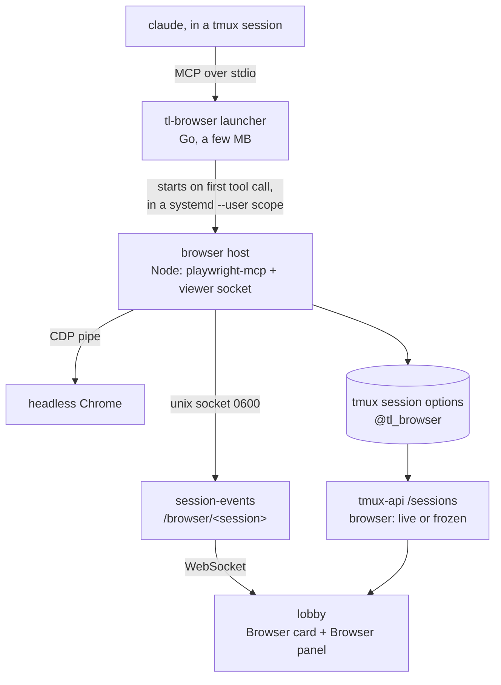
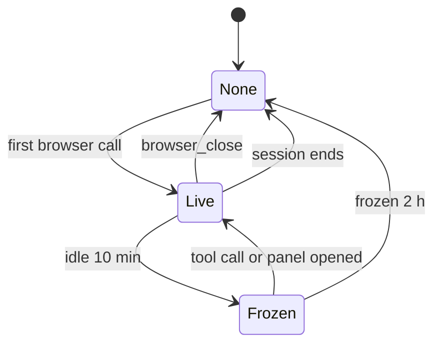

# See the browser a session is driving

Status: approved, being implemented. Viktor, 2026-10-01.
Decision record: [ADR-0029, each session gets its own browser, started on first use](../adr/0029-each-session-gets-its-own-browser-started-on-first-use.md).
Terms: **Session browser**, **Browsing run**, **Browser card**, **Browser panel**,
**Control**, **Frozen** in `CONTEXT.md`.

## The request

Viktor, 2026-10-01: *"let's add a way to view a browser in the session. i.e any
time a session uses a browser, we should be able to see the live browser in the
session. optionally we can click to take over the browser to fill in data."*
The reference was a chat with a "Browser" card holding a live thumbnail and an
"Open browser" button, beside a panel showing the live page with Stop and
"Take control of the browser".

On confirming the design he added: *"let's make sure browsers don't hog onto
memory and agents have a good way to clear up"*. That shaped the lifecycle and
memory sections below.

## Where things stand today

Every Claude session on the box drives a browser through one MCP server per OS
user, `playwright-mcp@<user>.service`. It runs headless Chrome with an isolated
profile seeded from the hourly storage-state snapshot of chrome-service.
Measured on 2026-10-01:

```stats
1 | playwright-mcp per OS user, shared by all of that user's sessions
141 MB | resident size of one idle playwright-mcp, before Chrome starts
29 | Claude processes on the box
9 GB | memory available, with swap at 13 of 14 GB
0 | ways the server can tell which session is calling
```

Each MCP connection already gets its own browser context, so sessions do not
see each other's tabs. What is missing is the link back to a session. Claude
Code sends a plain HTTP MCP server no session identifier, and its streamable
HTTP connections drop when idle, so mapping sockets to processes found 2 of 19
sessions. The lobby therefore has no way to say "this browser belongs to that
session", and the rest of this design depends on that link.

Playwright itself has what the viewing side needs: a JPEG screencast of a page
and public mouse and keyboard APIs. `@playwright/mcp` exports
`createConnection(config, contextGetter)`, so a program of ours can own the
browser and hand playwright-mcp the context to drive.

## Decisions

| Area | Decision |
|---|---|
| What counts | Only the browser the agent's built-in browser tool drives. `homelab browser` (chrome-service) is never shown: it is single-tenant on Viktor's logged-in profile |
| Whose browser | One per session, started on the first browser action by a small launcher that answers Claude's startup handshake itself (ADR-0029) |
| Where it shows | Text view: a **Browser card** per **Browsing run**. Both views: a **Browser panel** inside that session's own pane |
| Opening | Only when someone opens it. The card stays in the conversation as a record |
| Live | Streams whenever a live card or an open panel is on screen. Pauses when scrolled away, in a background tab, or when the session is parked |
| Last frame | Kept in the page's memory only. A reload loses the picture, the card keeps its text |
| Tabs | The panel follows the tab the agent last acted on, with a tab strip to look at others |
| Taking control | The agent's browser calls are refused with "the user has control, don't retry, end your turn and wait" |
| Who controls | One person at a time. Anyone allowed may take it over. It lapses after 10 minutes with no input |
| Handing back | Tells the agent nothing. The person prompts it when ready |
| Input while in control | Click, scroll, typing, paste from the clipboard, copy out of the page, URL bar, back, reload |
| Stop | Interrupts the agent's turn, the same as Esc |
| Access | Follows **Attach mode**: rw may take control, ro and a **Lens** only watch |
| Phone | Watch and take control. The 1280x800 viewport is scaled to fit, pinch zooms |
| Ending | The agent's `browser_close` frees everything. Idle for 10 minutes means **Frozen**. Frozen for 2 hours means closed |
| Telemetry | Panel opens, take control, hand back: counts and durations, no URLs or page content |
| Rollout | Every user on the box |

## How the pieces fit



### tl-browser, the launcher

A Go binary in this repo, configured as each user's `playwright` MCP server
over stdio. The server keeps the name `playwright`, so tool names stay
`mcp__playwright__*` and every skill and rule that names them keeps working.

- It answers `initialize` and `tools/list` from a cached copy of the host's own
  answers, so a session that never browses costs a few MB and no Node process.
  The cache is keyed by the host's version and filled by running the host once
  in describe mode when it is missing.
- On the first other request it starts the host, replays the `initialize`
  Claude sent, and from then on pipes bytes both ways.
- It starts the host inside its own `systemd-run --user --scope`, in a
  per-user `tl-browser.slice`, so each browser has a memory and CPU ceiling
  (see "Memory").
- When the host exits, after `browser_close` or a hard stop, the launcher goes
  back to waiting and starts a fresh host on the next browser call.
- It inherits `TMUX` and `TMUX_PANE` from Claude, which is how it knows its
  session, exactly. Outside tmux, in a T3 thread for example, the browser works
  the same and the lobby simply does not show it.

### The browser host

A Node program in this repo, pinned to `@playwright/mcp@0.0.76`, the version
the box runs today. It:

- launches headless Chrome itself (`channel: "chrome"`, 1280x800), creates a
  context from `~/.cache/playwright-shared-storage-state.json`, and passes it to
  `createConnection`. Chrome starts on the first tool call that needs a page;
- sits between Claude and playwright-mcp on the MCP stream, so it sees every
  tool call. That is where the control lock is enforced and where activity is
  timed;
- adds server instructions, and a sentence on `browser_close`, telling the
  agent to close the browser when a browsing task is done because that frees
  its memory;
- serves a unix socket at `$XDG_RUNTIME_DIR/tl-browser/<session_id>.sock`, mode
  0600, speaking the viewer protocol below;
- records its state on the tmux session as `@tl_browser` (`live` or `frozen`)
  and `@tl_browser_sock`, and clears both when it exits.

### session-events, the relay

session-events already serves the text view per session and already runs
privileged operations as the session's owner. It gains:

| Route | What it does |
|---|---|
| `GET /browser/<session>` | State: `none`, `live` or `frozen`, the tabs, who holds control |
| `GET /browser/<session>/stream` (WebSocket) | Relays the viewer protocol to the host's socket. For another user's session it relays through `sudo -u <owner> session-events -privop browser-bridge`, the same pattern file-api uses |

The relay enforces **Attach mode**. For a ro share or a Lens it drops every
input and control message before it reaches the host, so watching cannot be
turned into driving by a crafted message. It stamps each connection with the
authenticated username, which is the name the host shows as the controller.
Stop calls the existing `/cancel/<session>`.

The ingress gains a `/browser/` prefix on the session-events IngressRoute
(infra, `stacks/terminal/main.tf`).

### tmux-api

`GET /sessions` adds `browser: "live" | "frozen"` for a session whose
`@tl_browser` is set. The sidebar poll already carries everything else the
session bar needs, so no new request runs until someone looks at a browser.

## The viewer protocol

Newline-delimited JSON over the unix socket, one WebSocket message per line.
Frames are base64 JPEG, about 60 to 120 KB at quality 60.

| Direction | Message | Meaning |
|---|---|---|
| host → viewer | `hello` | State, tabs, active tab, control holder |
| host → viewer | `frame` | A JPEG of one tab, with its size |
| host → viewer | `tabs` | Tabs changed: id, url, title, which one the agent last acted on |
| host → viewer | `control` | Who holds control, since when, when it lapses |
| host → viewer | `state` | `live`, `frozen`, `closed` |
| host → viewer | `copied` | Text selected in the page, answering `copy` |
| viewer → host | `subscribe` / `unsubscribe` | Start or stop frames for a tab |
| viewer → host | `mouse`, `wheel`, `key`, `insertText` | Input, ignored unless this connection holds control |
| viewer → host | `navigate`, `back`, `forward`, `reload`, `copy` | Same rule |
| viewer → host | `selectTab` | Change which tab this viewer watches |
| viewer → host | `takeControl`, `handBack` | Control changes |

Frames come from the CDP screencast (`Page.startScreencast`), which only paints
on change, so a `subscribe` first sends a fresh screenshot. The screencast runs
only while at least one viewer is subscribed. Input goes through Playwright's
`page.mouse` and `page.keyboard`. Paste is `insertText`, and copy reads the
page's selection.

"The tab the agent last acted on" is the page whose main frame last navigated
or that was last created. playwright-mcp does not expose its current tab, so
this is an approximation, and the tab strip covers the cases it misses.

## Lifecycle



"Idle" means no tool call, no viewer subscribed and nobody in control. A
session ending closes a frozen browser too.

Freezing sends SIGSTOP to Chrome's process group and SIGCONT to wake it. The
host stays responsive, so it can wake Chrome before forwarding a call.

A **Browsing run** is what the card records. It starts at the first
`mcp__playwright__*` tool use in a turn and ends when the turn ends or the
browser closes. The text view derives runs from the transcript, which already
lists tool uses in order. A card streams only while its run is the current
one. A finished card shows the last frame it held, or no picture after a
reload, and never wakes a frozen browser. Only opening the panel does that.

## Memory

Viktor asked that browsers not hold memory and that agents have a good way to
clean up. These are the bounds, each enforced by a different mechanism so they
do not depend on any single one:

| Bound | Mechanism | Frees |
|---|---|---|
| A session that never browses pays nothing | The launcher answers the handshake itself | ~141 MB of Node per session, ~4 GB across today's 29 |
| The agent closes the browser when done | `browser_close` makes the host exit. Server instructions and the tool's description say so | Node and Chrome, all of it |
| An abandoned browser stops using CPU | Frozen after 10 minutes idle | CPU only. Swap is full, so frozen pages stay in RAM |
| An abandoned browser does not hold memory for long | Closed after 2 hours frozen | Node and Chrome |
| One page cannot take the box | Per-browser scope: `MemoryHigh=1G`, `MemoryMax=1536M`, `CPUQuota=300%` | The kernel reclaims, then OOM-kills inside that scope only |
| One user's browsers together are bounded | `tl-browser.slice` per user: `MemoryMax=4G`, `CPUQuota=800%`, `CPUWeight=50` | The same, across that user's browsers |
| A wedged GPU process is cleared | `playwright-reaper` also watches `tl-browser.slice` | The spinning process |

The 2-hour close extends the freeze-only answer given during the design
interview. It follows from the memory request: with swap full, a frozen browser
releases no memory, so freezing alone would let abandoned browsers accumulate.

## Access and safety

- The host socket is mode 0600 in the owner's runtime directory, so only the
  owner, or session-events acting as the owner, can reach the browser.
- Chrome uses `--remote-debugging-pipe`, never a TCP port, so no other user on
  the box can attach to it.
- Attach mode is enforced in session-events, before the host, and the frontend
  hides the controls as a convenience, not as the check.
- The storage-state snapshot carries Viktor's logged-in cookies today, as it
  does for the current shared server. That does not change here. A rw share is
  already a grant to run as the owner.

## The lobby

- **Browser card** (text view). Header "Browser" with what it is doing (the
  last tool call, for example "Loading wikipedia.org"), the frame, and "Open
  browser".
- **Browser panel**. Opens inside the session's own pane, splitting it with the
  chat or terminal. A header with title and URL, Stop, Take control or Hand
  back, close. Below it a tab strip, a URL bar with back and reload, then the
  page. While someone else holds control it reads "Viktor has control".
- **Session bar**. A browser indicator while the session has a live or frozen
  browser, in both views. It opens the panel.
- **Phone**. The panel takes the full screen. Taps become clicks, the soft
  keyboard types into the focused field, pinch zooms the scaled page.
- **Pausing**. Frames are requested only while the card or panel is
  intersecting the viewport, the document is visible, and the session is not
  parked (`docs/plans/2026-09-11-client-cpu-parking-design.md`).

## Rollout

The order matters, because the infra change points every user at a binary the
lobby package installs.

1. terminal-lobby: launcher, host, relay, `/sessions` field, UI and packaging.
   The `.deb` installs `/usr/local/bin/tl-browser`, the host under
   `/usr/lib/terminal-lobby/tl-browser-host/` with its `node_modules`, and
   `tl-browser.slice` as a user unit.
2. infra: the `/browser/` ingress prefix, the reaper's slice list, and
   `t3-provision-users` wiring each user's `playwright` MCP as
   `tl-browser` over stdio in place of the HTTP entry.
3. The per-user `playwright-mcp@` units stay up for running sessions, which
   read `~/.claude.json` only at start. The provisioner disables a user's unit
   once none of their Claude processes started before the switch. The hourly
   snapshot refresh stays, since the host reads the same storage state.
4. `playbooks/devvm.yml` section 8a stops describing the playwright units as
   hand-installed. They have been in git under
   `scripts/workstation/playwright/` since 2026-06-16.

## How we will know it works

- Go tests for the launcher's handshake cache, replay and restart, and for the
  relay's attach-mode filter. Node tests for the host's control lock, idle
  timers and protocol.
- On the box: a Claude session browses, and the card and panel show it in the
  real lobby. Take control, type into a field, hand back, and confirm the
  agent's next call is refused while in control. Then `browser_close`, and
  confirm the host, Chrome and the scope are gone (`ps`, `systemctl --user`).
- Memory: resident size of an idle session before and after the switch, and a
  frozen browser closing after its timer (with the timer shortened for the
  test).
- Phone: the panel on the shared Android emulator and on the iPhone through
  `homelab ios`.

## Open questions

- The "agent's current tab" approximation is unmeasured against real agent
  runs.
- The scope limits (1 GB high, 1.5 GB max per browser, 4 GB per user) are
  first values, not measured working sets. Prometheus will show whether pages
  hit them.
- Running sessions keep the shared server until they restart, so for a while
  some sessions will not show their browser in the lobby.
