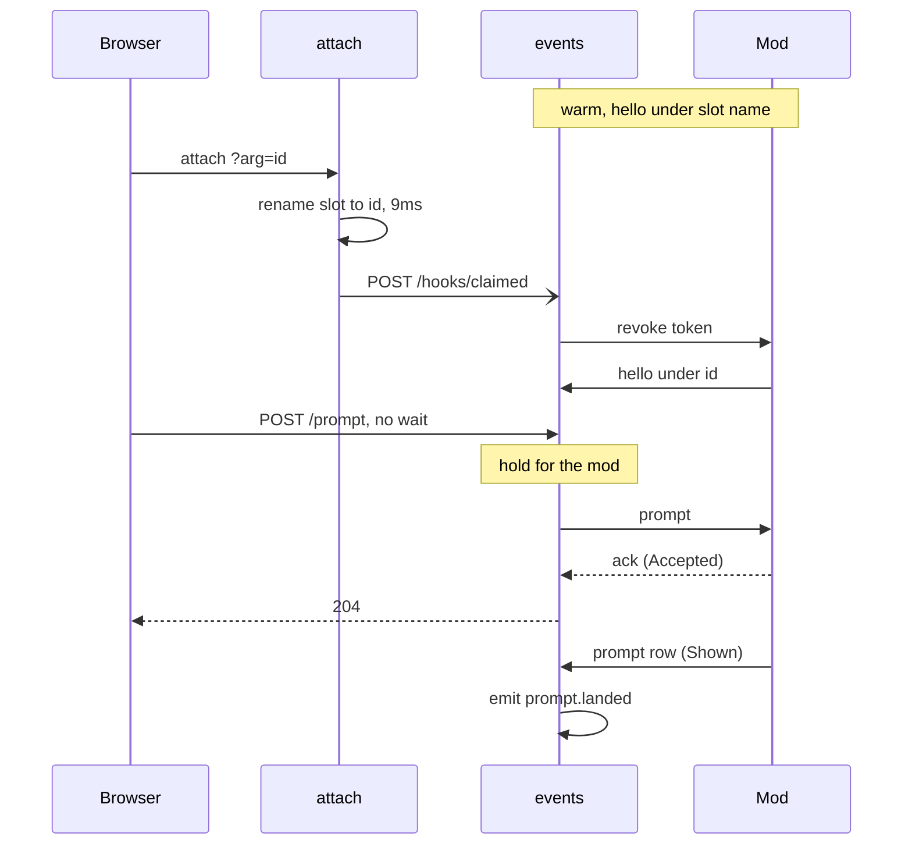

# First prompt latency

Viktor, 2026-10-03: *"once i send a prompt, it takes quite a while to get it
passed to the terminal - why is it so slow. let's review and redesign it so
that it's faster"*. Viktor sees 5 to 10 seconds from Send in the **New-session
composer** to the prompt showing up, on desktop and on the phone.

## What we measured

Each new session's start (the `tmux-user-attach` journal) was joined with
session-events' record of the prompt reaching Claude (`claude.prompt_sent`),
for 2026-09-26 to 2026-10-03, creates that claimed a **pre-warm slot** only:

| first prompt path | n | median | p90 | over 5s |
|---|---|---|---|---|
| typed into the pane, before 2026-10-02 | 26 | 0.9s | 1.9s | 1 |
| through the **Lobby mod**, since 2026-10-02 | 24 | 2.75s | 16.2s | 9 |

The pool itself works well: 50 of 58 Claude creates claimed a slot (86%). The
time goes after the claim.

## Why

Since ADR-0036, a Claude session takes its prompts through its Lobby mod, and
the mod is addressed by the tmux session's **name**. A pre-warm slot's Claude
says hello under the slot's name. Claiming the slot renames the session, so the
first prompt arrives under a name no mod has said hello with yet.

1. **The prompt route waits for a hello nothing has asked for.**
   `servePromptViaMod` waits up to 4s for a hello under the new name. The mod
   only says hello again at a turn start, a refused request, or its own retry
   backoff (1s doubling to 30s). `modHub.follow` already asks the mod to
   reconnect under a new name, and the event stream and agent-api use it, but
   the prompt route does not yet. When a Text view happened to open first, the
   prompt landed in 1.2s; otherwise it waited, up to 23s.
2. **Slots for longer paths never connect.** The mod's hello accepts session
   names of up to 64 characters. The slot name for `~/code/terminal-lobby` is
   69, so that slot's mod said no hello in any of 141 warm-ups, and the
   prompt waited for its backoff after the claim. The older the slot at claim
   time, the longer that backoff had grown: 1.3 to 2.8s for a slot under 10s
   old, 8 to 23s for one 17 to 50s old.
3. **The browser waits 700ms before its first try**, even for a warm slot. The
   rung dates from when the server could not hold a request for a session that
   did not exist yet. It can now, and before 2026-10-02 this wait was most of
   the 0.9s median.

## What we decided

| decision | choice | why |
|---|---|---|
| scope | the three causes, plus telling the mod its new name at claim time | small, and removes the wait rather than shortening it |
| what signals a claim | `tmux-user-attach` posts to session-events right after the rename | the claim script is the one actor that knows the moment; same localhost and peer-credential gates as `/hooks/usage` |
| fallback | the prompt route asks the mod to follow a rename itself | covers a claim signal that was lost, and any rename the signal does not cover |
| long slot names | the mod's hello accepts them | slot names are long on purpose, so the lobby can never address one |
| first try | immediately; the server holds it | the server's hold already covers a session that does not exist yet |
| targets, warm slot, p90 | **Accepted** under 1s, **Shown** under 2s | Claude's own record takes 0.6 to 1.2s after acceptance, which the lobby does not control |
| measuring | one event per first prompt with both durations from the Send press | a regression like 2026-10-02 shows up in Loki the day it ships |
| alerting | none | Viktor's call |
| out of scope | pool misses (14% of creates, ~3s of Claude's own boot); addressing the mod by pane instead of name | |

## The flow

Here `attach` is `tmux-user-attach`, `events` is session-events, and `Mod` is
the Lobby mod inside the slot's Claude. The claim post and the first POST race. Either order works: when the POST comes
first it waits for the hello, and when nothing asked the mod to follow, the
prompt route asks itself.

## Measuring both moments

The browser sees **Accepted** (its POST returns) but cannot see **Shown** unless
a Text view happens to be open. session-events sees both, through the mod. So
the browser sends, with the first prompt only, how long ago Send was pressed
and whether the page was hidden since. session-events adds what it measures
from the request's arrival, and emits one `prompt.landed` event when the row
appears. The name and attributes are the ones the journey telemetry design
(2026-09-12) set out for this question: `tl.session`, `tl.first` (true),
`tl.post_ms` (Send to **Accepted**), `tl.settle_ms` (Send to **Shown**), `tl.n`
(the prompt's length), plus `tl.hidden`. That design emits from the browser; the
first-prompt arm emits from session-events instead, because after a create the
browser usually has no Text view open to see the row. Each part is measured on
one clock, and the only time left out is the request's own trip to the server,
a few milliseconds.

## Verification

- Create sessions from the composer on `terminal.viktorbarzin.me` on desktop,
  on the shared Android emulator, and on the iPhone through `homelab ios`, and
  watch the prompt appear.
- Read `prompt.landed` back from Loki for creates in `~/code` and in
  `~/code/terminal-lobby`, including one claimed from a slot that has been warm
  for over a minute.

## Open questions

- The 0.6 to 1.2s for Claude's own record is from a measurement on 2026-08-18.
  The new event will show whether that still holds on the current Claude Code.
- A first prompt that is itself a slash command may never produce a row, so its
  event never fires. Pending marks expire after two minutes.
