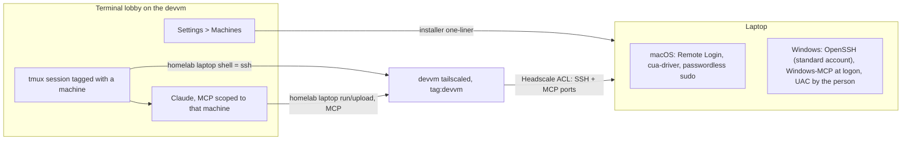
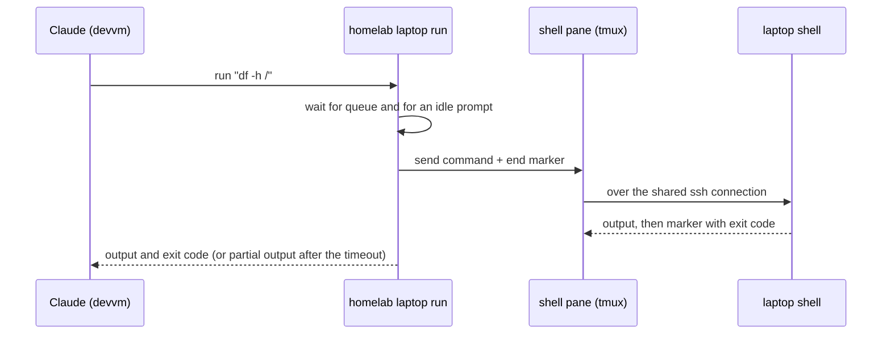

# Let Claude work on a laptop from the lobby

Status: parked, not built. Viktor, 2026-10-03: *"let's keep this plan. i don't
want to implement it for now as i don't have a clear issue to solve but it's
useful research ... we can come back to it next time we consider a desktop app"*.
Research: [laptop remote-control options](../research/2026-10-03-laptop-remote-control-options.md).

## How we got here

The conversation started as *"can we make a desktop app for the terminal lobby?"*
and moved through three framings before settling:

1. A desktop shell for the lobby. The installed PWA already gives most of what a
   desktop shell would (own window, push, badges), and a few manifest additions
   (`launch_handler`, `shortcuts`, `protocol_handlers`, `file_handlers`, Window
   Controls Overlay) would cover the rest. A browser sandbox cannot control the
   machine it runs on, so "control the laptop" needs something outside the page.
2. Something like agent conductor, which runs a daemon on the machine and drives
   its PTYs from a remote UI. Viktor wanted the concept, integrated into the
   lobby, without porting agent conductor's code.
3. *"Ideally I'd like to be able to help fix issues on the system."* That made
   the goal concrete, and the design below follows from it.

## The goal

A lobby user adds machines they look after to their lobby settings. From a normal
lobby session, Claude (running on the devvm) connects to one of those machines
and fixes software, config and network problems on it. Usually the person is
sitting at the machine, watching Claude work and helping it.

Out of scope: a machine whose network link is fully down. Remote help needs the
network, so the fallback is a phone call or tethering the laptop to a phone.

## Decisions

| area | decision |
|---|---|
| machines | personal Mac, Windows, family members' machines (registered under the helper's lobby account), Viktor's work Mac |
| users | any lobby user, their own machines only. Admin act-as does not reach laptop sessions; ordinary session sharing works as for any session |
| foundation | Headscale plus each OS's own SSH server for shell and files; cua-driver on macOS and Windows-MCP on Windows for computer use. No resident app of ours on the laptop |
| not used | MeshCentral (already deployed, kept as it is), a custom agent, Tactical RMM, RustDesk, Teleport and the other options in the research doc |
| reachability | always on, through the tailnet |
| devvm on the tailnet | the devvm joins Headscale as one node tagged `tag:devvm`, declared in `infra/playbooks/devvm.yml`. The Headscale ACL allows `tag:devvm` to members' devices on the SSH and MCP ports only |
| adding a machine | a Machines page in lobby Settings, list kept server-side. It shows an installer one-liner (curl on macOS, PowerShell on Windows). The person signs in to Headscale on the laptop; the script enables SSH, installs the computer-use tool and authorises the user's key |
| Claude's access | Claude runs on the devvm with the same free rein as any devvm session. `homelab laptop shell|run|upload` wrap ssh and scp; computer use is an MCP server (macOS: `ssh <mac> cua-driver mcp`; Windows: Windows-MCP over HTTP with a bearer token, started at user logon, bound to the tailnet address) |
| scope per session | a session started for a machine gets an MCP config and `homelab laptop` defaults for that machine only |
| admin rights | macOS: passwordless sudo through a sudoers drop-in. Windows: SSH logs in as a standard account; admin actions run through `Start-Process -Verb RunAs` on the desktop and the person at the machine approves the UAC prompt |
| credentials | a plain SSH key per user in `~/.ssh`, mode 600. The Windows-MCP token is stored the same way (a default, not discussed in detail). Sudo holders on the devvm can read both, which was accepted |
| lobby UI | laptop sessions are ordinary devvm tmux sessions tagged with their machine, grouped by machine in the sidebar. Every configured machine is listed with an online dot (from the devvm's tailnet view) and a new-session button. The composer offers a Claude session (preselected) or a plain shell |
| updates | `homelab laptop update` from the devvm, with pinned versions of cua-driver and Windows-MCP |
| removing a machine | forget it in Settings and, if it is online, remove the user's key and the MCP token from it. Tailscale and the tools stay installed; an uninstall one-liner is shown |
| indicator and kill switch | the tools' own: Windows-MCP's screen-edge glow and takeover key, macOS's screen-recording indicator. Turning Tailscale off is the kill switch. Shell access on its own shows nothing on screen |
| Windows shell | PowerShell |
| verification | Viktor's personal Mac and the Proxmox Windows VM (VM 300, "Windows10", 192.168.1.230) |

## Persistent shell

Added 2026-10-03. Viktor: *"I think we should also have some persistent shell so
we don't have to login on each tool call"*. Computer use already runs over one
long-lived connection (cua-driver over a single ssh stdio session, Windows-MCP
over HTTP), so this covers shell commands only.

| area | decision |
|---|---|
| connection | SSH ControlMaster with ControlPersist in the ssh config `homelab laptop` uses, so no command authenticates again |
| shell | one persistent shell per Claude session, opened on its first command and closed when the session ends |
| where | a visible second pane in the Claude session's tmux session, running ssh into the laptop. Claude's commands and their output appear there live, and people can watch it in the lobby |
| capture | `homelab laptop run` writes the command into the pane and reads output up to a marker that carries the exit code. Pagers are turned off through the environment (`PAGER=cat` and similar) |
| parallel calls | queued, one at a time, so the shell's state stays consistent |
| long or stuck commands | after a timeout, return the output so far and report the command as still running. Claude reads more later or sends Ctrl-C with `homelab laptop interrupt` |
| people typing | the person goes first. While a command a person typed is running, or a half-typed line sits at the prompt, Claude's next command waits and Claude is told why. Claude continues from whatever state the person left |
| link drop | the remote shell ends; the wrapper reopens it and tells Claude its state was reset |
| Windows admin | unchanged: one UAC approval per admin command, and no elevated process stays running. Keeping one alive would need a channel from the standard account into it, which anything running as that user could also use |

## Facts found while designing

- The devvm is not a tailnet node today. The Headscale ACL refers to it by its
  LAN address `10.0.10.10`, behind a `tag:infra` subnet router, and no system
  `tailscaled` runs on it.
- The lobby has no machine concept yet. A session is a tmux session on the devvm,
  reached over ttyd's WebSocket, which trusts only the Authentik header.
- The Claude state dot works only for Claude inside a devvm tmux session, which
  fits this design because Claude stays on the devvm.
- No single free, self-hosted product covers both a human remote desktop and an
  agent screenshot/input API; see the research doc for the comparison.
- MDM on a managed Mac can deny Screen Recording but cannot grant it, so the work
  Mac may end up with shell access only.

## Open questions

- Does `ssh <mac> cua-driver mcp` reach the CuaDriver app and its Screen Recording
  and Accessibility grants when nothing launched it from the desktop?
- Does Headscale accept `autogroup:member` as an ACL destination for a tagged
  source?
- What does macOS show on screen while cua-driver captures it?
- When the link drops, the laptop shell ends and the lobby pane reconnects with a
  fresh shell; Claude keeps running on the devvm. Whether that is enough, or the
  Mac side should keep its shell in tmux, was not discussed.
- Other lobby users can enroll machines only if Headscale's sign-in accepts their
  Google accounts.

## When to pick this up

There was no specific laptop problem driving this, so it waits for one. A good
first slice is macOS only: the tagged devvm node, the installer, `homelab laptop`
and cua-driver, verified on Viktor's Mac. Windows follows on VM 300.
