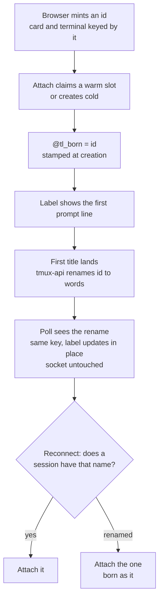

# A new session keeps its terminal through its first rename

Status: built, verifying
Date: 2026-10-03
From: a grilling session with Viktor
Related: ADR-0022 (amended by this change), ADR-0026, ADR-0027

Viktor, 2026-10-03: *"today we reuse the warm session and then we rename it.
but this causes a flicker in the UI which is not good UX."*

## What moves today

A new session goes through two renames in its first few seconds.

| rename | when | visible? |
|---|---|---|
| warm slot to minted id (the claim, `tmux-user-attach`) | about 9 ms after the terminal socket opens | no. The lobby never lists a slot, and the browser already holds the id |
| minted id to words (ADR-0022, when the first title lands) | 3-5 s into the first turn | yes |

The second rename is the one Viktor sees. Two things move:

- The terminal blanks. The lobby keeps each mounted terminal under the key
  `owner + name`. When the poll reports the new name, the selection follows it,
  the new name reads as a different terminal, and the lobby disposes the live
  one and attaches a fresh one. ADR-0027 measured that rebuild at 779 ms; the
  pane is blank while Claude's first reply streams.
- The label changes from the id to words, and the sidebar card is rebuilt
  under its new name, and can drop to the bottom of its group if the rename
  lands inside the 4 s window where the browser ignores the server's layout.

The rename itself does not need to disturb the terminal. An open socket's tmux
client is attached to the session, not to its name, so it survives a rename;
only the next reconnect needs the new name. The rebuild comes from the browser
keying by name.

The warm slot is not the cause. It makes the rename arrive about 2.4 s sooner,
which moves it into the seconds a person is watching.

## What we decided

**The lobby knows a session by its birth name, and a rename changes the label
and nothing else.** The birth name is the minted id a session was created
with, already kept as `@tl_born` once a session is renamed (ADR-0022, the
2026-09-06 section). It is now stamped at creation instead, so the browser and
the server share it from the first moment.

| piece | change |
|---|---|
| warm slot claim | unchanged |
| `tmux-user-attach` | stamps `@tl_born` on both the claim and the cold create, for a minted id only. Before attaching, a name no live session answers to is looked up against birth names, so a reconnect holding the old name lands in the renamed session instead of creating an empty one |
| lobby terminals and cards | keyed by `bornAs ?? name`. A rename re-labels the mounted terminal and the card in place; the open socket is untouched and the next connect uses the new name |
| optimistic card | the pending card and the listed session share a key, so the first listing replaces neither, and a pending card whose session was renamed before any poll saw it is dropped |
| local layout | follows a rename the way the other per-browser records already do, so a rename inside the 4 s grace window keeps the card where it was |
| label before the title | the first line of the prompt, or the directory name when there is none. Never the raw id |
| URL hash | unchanged; it keeps following the name |

### Why the birth name and not tmux's `session_id`

tmux's `$N` is not known until a poll has listed the session, and the
optimistic card and the first terminal mount both exist before that. The birth
name is the one value the browser holds from the first frame. Server-side
records that track a session across time keep using `session_id`.

### Why only minted ids get a birth name

A session someone named by hand, say `beads`, could be retitled to `x`, and a
new `beads` created later. If both carried birth name `beads`, the lobby would
see one session twice. A minted id is 60 random bits and is never reused, so a
birth name stays unique. A hand-named session is known by its name, and an
explicit retitle of one still remounts its terminal; that path is rare and is
something a person asked for.

## Scope

In scope: the terminal remount on rename, the card rebuild and reorder, the
pending card being replaced on first listing, a pending card left behind by a
rename no poll saw, the placeholder label, the phantom-session trap on the
owner's own attach.

Not in scope:

- The URL hash, which keeps following the name.
- Shared viewers. Their attach targets `=name` and fails closed on a stale
  name rather than creating one, and their lobby follows the rename on its next
  poll.
- Server-side stores keyed by name. They already follow a rename through
  `carryRenameAcrossStores`.

## How we will know it works

A live create in desktop Chrome against the real lobby, from a warm slot,
watched across the title rename:

- exactly one terminal socket opens for the session;
- the terminal's DOM node and the card's DOM node are the same objects before
  and after the rename;
- a frame strip across the rename shows no blank pane and no card jump.

Then a forced reconnect after the rename, holding the old id: it lands in the
renamed session, and `tmux ls` shows no empty session under the id.

## What the build added

Three things the design left implicit, found while building:

- The session view and its transcript store captured the session's name once
  at mount. Kept alive across a rename, they would have sent prompts, grid
  claims and the next transcript connect to a name nothing answers to. Both now
  read the name when they act; an open stream is left alone.
- A workspace arrangement stored on a device keys its tiles the same way. A
  tree saved before this change holds a renamed session under its name, so
  `reconcileTree` re-asks the key for that name and keeps the tile where it was
  instead of closing it and splitting it back in at the bottom.
- The pane header and the tab title had no row to read before the first poll,
  and showed "New session" where the card showed the prompt line. They now
  read the prompt line too.

And four found by the live check, each measured against the deployed backends
before and after:

- The join decision (drive or watch) was re-taken whenever the view's name
  was re-read, and it counts this tab's own read-write client as somebody
  driving. With the name now read live, the first poll after a create
  reattached the terminal read-only. The decision now follows the session's
  key, which a rename leaves alone.
- The sidebar keyed its project groups by object, and a group whose cards
  change is a new object, so the group and every card in it were rebuilt on
  the first listing and on the rename. Groups are keyed by token now, as the
  origin groups already were.
- A poll's answer was applied as separate writes, and for one step the layout
  said the new name while the list still said the old one. Rendered, that
  filed the session outside its project and rebuilt its card. The poll now
  applies as one batch.
- The browser's layout carry kept a dead session's entry under the new name,
  which the server drops, so the two copies disagreed and "Layout changed
  elsewhere" fired on the rename. The carry now drops it too.

| run (live, desktop Chrome) | terminal sockets | terminal rebuilt | card rebuilt | toast |
|---|---|---|---|---|
| before (0.97.1 frontend) | 2 | yes, at the rename | yes, twice | yes |
| after | 1 | no | no | no |

## Open questions

- None at the design level.
