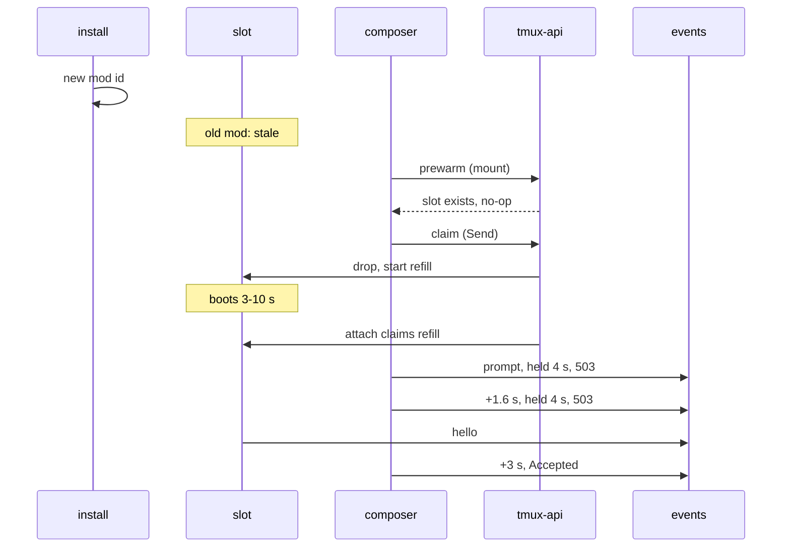
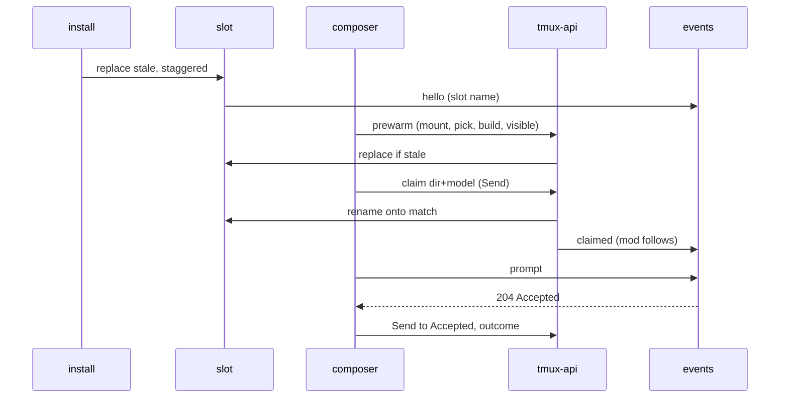

# A warm slot at Send

Viktor, 2026-10-04: *"startup performance is still poor. it takes ~20 seconds
from me sending the prompt in the composer until i see it in the session and
claude working on it."* Seen on the desktop browser, starting one session at a
time from `~/code` and its projects.

This follows [the first prompt latency design](2026-10-03-first-prompt-latency-design.md)
(ADR-0038), which moved the claim to Send and made a claimed slot's mod follow
the rename. With it in place, a create that claims a booted slot is fast. What
remains is the creates that claim a slot whose Claude has not finished booting.

## What we measured

`prompt.landed` for every **first prompt** since it shipped (2026-10-03 16:15 to
2026-10-04 15:24, n=17, all wizard, all desktop):

| | n | Send to **Accepted** | Send to **Shown** |
|---|---|---|---|
| fast | 13 | 448 to 1020 ms | 803 to 2036 ms |
| slow | 4 | 3711 to 12948 ms | 6341 to 15866 ms |

The slow ones are a separate mode, not a slower version of the fast ones. Their
timelines, from the `tmux-user-attach` journal and session-events:

| session | what the claim found | Claude boot to mod hello | Accepted | Shown |
|---|---|---|---|---|
| yffdt6prbr7k, 10-04 15:23 | stale slot, dropped; refill 362 ms old claimed | 10.2 s | 12.9 s | 15.9 s |
| 7hcbq17n8cre, 10-04 15:08 | stale slot, dropped; refill 212 ms old claimed | 4.6 s | 5.8 s | 9.7 s |
| k6rdkqe0g6b1, 10-04 06:30 | stale slot, dropped; refill 601 ms old claimed | 3.4 s | 3.7 s | 9.9 s (a 1.6 MB image) |
| grfwz4nn46a6, 10-03 20:17 | speculative slot 4.1 s old | 9.1 s | 6.0 s | 6.3 s |
| hevaqev68p1e (fast) | standing slot, warm for 41 s | booted | 0.5 s | 1.5 s |

## Why

1. **A package install makes every slot stale, and nothing replaces it until
   someone presses Send.** A slot is stamped with the mod id it booted under,
   and a claim refuses a slot whose stamp differs from the installed mod
   (`slot_is_stale`, `devvm/tmux-user-attach`). The mod is two days old and
   changes often: 13 commits touched `claude-mod/` since 2026-10-02, and 14
   packages installed between 10-03 15:59 and 10-04 14:56. Each slow case
   above is the first create in its directory after an install.
2. **Opening the composer does not replace a stale slot.** The composer asks
   for a slot when it mounts (`NewSessionComposer.tsx`), but `handlePrewarm`
   answers 204 and does nothing whenever a slot of that name exists, stale or
   not (`tmux-api/prewarm.go`). The composer also asks only when its project
   changes, so a composer left open across a deploy never asks again.
3. **The wait for a booting slot has gaps.** session-events holds a first prompt
   up to 4 s for the mod's hello, and the browser then waits 1.6 s and 3 s
   before trying again (`FIRST_PROMPT_LADDER`). A hello that lands during a gap
   waits for the next attempt: 2.5 s of yffdt6prbr7k's 12.9 s, 0.9 s of
   7hcbq17n8cre's.
4. **A create with a model or effort picked never claims a slot.** Slots boot
   with no flags, and a running Claude cannot be re-flagged, so these always
   boot cold.

Claude's boot itself also varies: over 7 days, boot to hello was p50 3.5 s,
p90 9.7 s, max 21.4 s (n=36), and the outliers came in clusters where two or
more Claudes booted together. A time-boxed look did not find the cause (see
open questions). With the slot kept warm, the boot is no longer on Send's path,
so this design leaves it alone.

## What we decided

The target is Send to **Accepted** as the person sees it, under 2 s. It applies
to a create into a directory the composer has had on screen for longer than one
Claude boot, on the default model or on a model picked in the composer. It does
not cover the first create in a directory with no slot, a Send within ~4 s of
opening the composer, or a second create in the same directory seconds after
the first.

1. **An install re-warms every slot.** The package's post-install step asks
   each lobby user's manager to replace stale slots on the new mod, one at a
   time a few seconds apart, so they do not boot together. A standing slot is
   replaced as a standing slot and a speculative one as a speculative one, with
   the same directory and flags.
2. **The composer keeps its slot fresh while it is on screen.** It asks again
   when the lobby notices a new build and when the tab becomes visible again,
   on top of when it mounts and when the project changes. tmux-api replaces a
   slot that is stale instead of answering that one exists.
3. **A model or effort picked in the composer is warmed on pick.** Closing the
   **Model sheet** with a non-default choice swaps the composer's speculative
   slot for one booted with those flags, and the claim at Send looks for a slot
   matching the directory, model and effort together. The standing slot stays
   on Default.
4. **session-events delivers the moment the mod says hello.** A first prompt is
   held until the hello for as long as the browser's 8 s request deadline
   allows, and the browser repeats a held request without a gap, so a booting
   slot costs its boot and nothing on top.
5. **The browser times Accepted, and Prometheus alerts on it.** The composer
   records Send to the moment its prompt request is accepted, on the browser's
   clock, with what the claim found (warm, booting, stale, no slot). tmux-api
   counts first prompts and the ones over 2 s, and an alert fires when more than
   10% of a day's first prompts are over 2 s (a daily p90 over 2 s), given at
   least five.
6. **Slow Claude boots are not pursued here.** Decisions 1 and 2 keep them off
   Send's path.

## The flow after

## Pieces

| piece | change |
|---|---|
| `devvm/tmux-user-attach` | Slot name carries model and effort. Claim takes model and effort and claims only a matching slot. A `refresh` mode replaces each stale slot as the kind it was. Claim prints what it found. |
| `release` (post-install) | Starts a slot refresh for every running user manager, without blocking the install. |
| `tmux-api/prewarm.go` | Replaces a stale slot instead of answering that one exists. Takes model and effort. |
| `tmux-api/claim.go` | Passes model and effort through, and returns the claim's outcome. |
| `session-events` | Holds a first prompt until the hello within the browser's deadline. |
| `frontend-v2` composer | Re-asks on new build and tab visible, warms on Model sheet pick, retries a held request without a gap, reports Send to Accepted. |
| `tmux-api` metrics | `tl_first_prompt_total` and `tl_first_prompt_slow_total` by slot outcome. |
| infra Prometheus rules | `LobbyFirstPromptSlow` on the daily share over 2 s. |

## Verification

- Unit tests for each piece, test-first where there is behaviour.
- Live, on the deployed package: a deploy, then a create from the composer on
  desktop, timed from Send to the turn appearing; then the same with a model
  picked in the Model sheet. `prompt.landed` and the new counter should both
  read under 2 s with the slot outcome `warm`.
- `systemctl --user` and the journal after an install show each stale slot
  replaced once, a few seconds apart.

## Open questions

- **Why some Claude boots take 9 to 21 s.** Verified: the delay is on the
  Claude side before the mod's hello is sent; the mod sends hello 1 ms after
  session start with per-process random retry jitter, and session-events logged
  no slow request. Not reproduced with one or three boots in a scratch tmux
  server. One hypothesis, not tested: the boots share the user's main tmux
  server, and something there stalls all of them at once.
- **How often a deploy lands while the composer is open and Send follows within
  a boot.** Decision 2 narrows this to about one boot's length after each
  install; the slot outcome on the new counter will show whether it matters.
