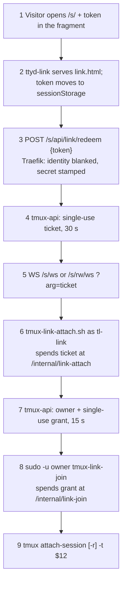
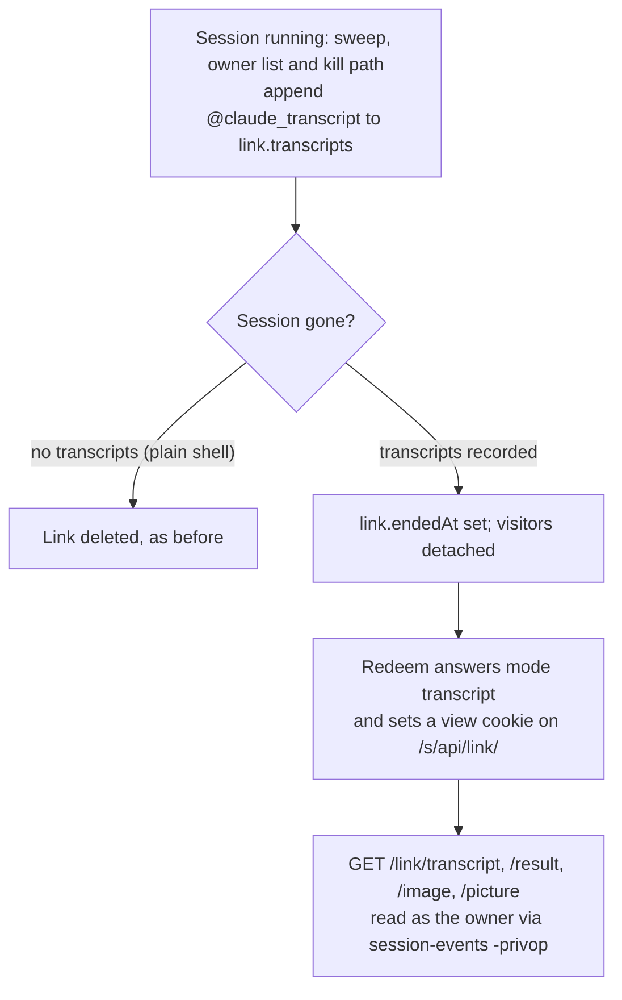

# Public links: share a session with someone who is not signed in

**Status:** shipped 2026-10-06 (terminal-lobby 0.109), verified live; ended-link transcripts (ADR-0040) building · **Scope:** `tmux-api/links.go`,
`devvm/tmux-link-attach.sh`, `devvm/tmux-link-join`, `devvm/ttyd-link-{ro,rw}.service`,
`frontend-v2/link.html` and `src/link/`, the Share dialog and Settings,
`docker/`, `infra/stacks/terminal/public_links.tf`, `infra/playbooks/devvm.yml` ·
**ADR:** [0039](../adr/0039-a-public-link-attaches-through-a-ticket-and-a-grant.md)

Viktor, 2026-10-06: *"i want to create public urls which i can share to users
that are not signed in. we can share in both read only or read write mode."*

A **Share** grants a session to a named account on the box, so the person on the
other end has to have an account and sign in through the proxy. A **Link** is
the other case: a URL that works for whoever holds it, with no account and no
sign-in. This document records the decisions from the grilling session and the
design that follows from them.

## Decisions

| # | Question | Decision |
|---|---|---|
| 1 | What a link opens | Exactly one session, which the link's creator owns. A session shared with you cannot be linked. |
| 2 | Read-write | The full terminal, as the owner, the same as a read-write Share. Always opens driving. |
| 3 | Lifetime | The owner picks 1h, 24h, 7d or until revoked. A read-write link is capped at 24h. |
| 4 | Visitor identity | Anonymous. The lobby shows "guest 1", "guest 2". |
| 5 | Visitor page | A bare terminal with the session title and a watching/driving badge. No sidebar, gallery, files, uploads or text view. |
| 6 | Several links | Allowed, each revocable on its own, each with an optional private note. |
| 7 | Session ends | ~~The link ends with it.~~ Amended the same day (ADR-0040): the link outlives the session and shows its conversation read-only until it expires or is revoked. A rename keeps it working; a plain shell's link still ends with its session. See "After the session ends". |
| 8 | Where links live | `terminal.viktorbarzin.me/s/#<token>`, an unauthenticated path on the lobby's own host. |
| 9 | Token in logs | The token travels in the URL fragment, which browsers never send. The page exchanges it for a single-use ticket that lives 30 seconds, and only the ticket appears in a request URL. |
| 10 | Telling the owner | A live visitor count in the session bar with a one-click stop, and a push notification when a read-write visitor connects. Every visit is journalled and emitted as telemetry. |
| 11 | Who can create | Every user, in every install mode. No deployment flag. |
| 12 | Where it is managed | A new Share… item on your own session's ⋯ menu, and a list of all your links in Settings. |
| 13 | Terminal size | A driving visitor resizes the window the way a read-write Share does. A watching visitor pins the grid the way a read-only Share does. |
| 14 | Named shares | Move to the same session identity, so a grant no longer outlives its session and passes to the next session that takes the same name. |

Two defaults were chosen during design rather than asked: only a SHA-256 of
each token is stored, so the URL can be copied once, at creation; and the
ticket exchange is rate-limited.

The lobby had no Share dialog to extend: it lived in the vanilla lobby, which
was removed. Viktor chose (2026-10-06) a new Share… dialog holding public links
only; named shares stay an API call.

Two blind design reviews ran before the build and changed four things, all
recorded below: two link servers instead of one, a dedicated `tl-link`
account with a second single-use step (the grant), exact-path routing with the
identity headers blanked, and visitor records kept on disk.

## How a visit works

`attach` is `devvm/tmux-link-attach.sh`, running as `tl-link` under
`ttyd-link-ro` (:7692) or `ttyd-link-rw` (:7693). `join` is
`devvm/tmux-link-join`, running as the session's owner. Traefik blanks the
identity headers on every `/s/` route and stamps the proxy secret on redeem
only. The token never leaves the browser except in the redeem POST body.

Each reconnect redeems the token again, so a ticket is never reused. Revoking a
link, or reaching its expiry, deletes the row, drops any outstanding tickets and
grants for it, and detaches every visitor client recorded against it. The
detach runs again at 1, 3 and 10 seconds, because a visitor recorded at
`/internal/link-join` attaches a moment later and a revoke can land in between.

### Why two link servers, and why a second account

The lobby's ttyd authenticates with `-H <identity header>`, and
`tmux-attach.sh` refuses any identity missing from the user map. A visitor has
neither, so links need their own terminal servers. They need two:

- A read-only tmux client still runs keys bound to `switch-client`, and the
  default bindings include `prefix (` and `prefix )`. Through a ttyd started
  with `-W`, a watcher could move to the owner's other sessions. Both reviewers
  reproduced this. ttyd without `-W` drops every input frame, so read-only
  links are served only by `ttyd-link-ro`, and tmux-api refuses a ticket on the
  instance that does not match its link's mode.
- The servers take connections from the internet, so they run as `tl-link`
  rather than the service account, which has sudo to every account here.
  `tl-link` holds no credential: it can only run `tmux-link-join` as another
  account, and that wrapper attaches nothing without a grant tmux-api issued for
  that account and that tty.

| | `ttyd` :7681 | `ttyd-link-ro` :7692 | `ttyd-link-rw` :7693 |
|---|---|---|---|
| Base path | `/` | `/s` | `/s/rw` |
| Auth | identity header (`-H`) | none; a ticket | none; a ticket |
| Takes input | yes (`-W`) | no | yes (`-W`) |
| Runs as | service account | `tl-link` | `tl-link` |
| Script | `tmux-attach.sh` | `tmux-link-attach.sh ro` | `tmux-link-attach.sh rw` |
| Can create a session | yes, your own | never | never |
| Other flags | | `-O -m 64` | `-O -m 64` |

Both scripts exit at once on any refusal, with no banner hold: the caller is
anyone on the internet, and a held connection is a held pty.

### Session identity

A link records the owner, tmux's `session_id` and the session's `created`
second. `session_id` alone is not enough, because tmux numbers sessions from
`$0` again after a server restart, so a stored `$3` could name a different
session after a reboot. The pair is unique for the life of the box. Attaching by
`-t '$12'` also sidesteps tmux's prefix matching on names, which the existing
attach path handles with the `=name` form.

Named shares gain the same two fields. A share row whose session no longer
exists is dropped by the sweep (every 15 s), and the attach check requires the
live session named in the request to match the recorded id. Rows written before
this change carry no id; the sweep stamps them from the live session of that
name, which is the grant they already expressed, before it prunes, and drops
them if no such session is running.

### Routes

| Path on `terminal.viktorbarzin.me` | Upstream | Middlewares |
|---|---|---|
| `/s/api/link/redeem` (exact) | `tmux-api` :7684, rewritten to `/link/redeem` | strip identity, real-ip, rate limit, proxy secret |
| `/s/rw/` | `ttyd-link-rw` :7693 | strip identity, real-ip, rate limit, in-flight cap |
| `/s/assets/` | `clipboard-upload` :7683, `/s` stripped | strip identity, real-ip, rate limit |
| `/s/` and `/s` | `ttyd-link-ro` :7692 | strip identity, real-ip, rate limit, in-flight cap |

The redeem route is an exact path on purpose. Every route here blanks
`X-Authentik-Username`, `X-Forwarded-User` and `X-TL-Proxy-Secret` first,
because without forward-auth nothing else would overwrite a header the client
sent, and tmux-api trusts the identity header once the proxy secret checks out.
A `/s/api/` prefix would have handed every tmux-api route to anyone who typed
their own username. The 7692-7693 ports are limited to the Traefik nodes by the
devvm's nftables and to the traefik namespace by the cluster's network policy.
The container's nginx mirrors the same four routes.

The visitor page is a second Vite build (`vite.link.config.ts`, `base: "/s/"`)
run after the lobby's into the same `dist/`. Its hashed chunks land in the same
`dist/assets/` directory the lobby's do, which makes the lobby's own chunks
fetchable without signing in as well. They are application code and carry no
user data, so this is accepted.

tmux-api serves:

| Route | Who | What |
|---|---|---|
| `GET /links`, `POST /links`, `DELETE /links/{id}`, `DELETE /links?session=` | the signed-in owner, not from a lens tab | list, create (returns the token once), revoke one, revoke a session's |
| `POST /link/redeem` | anyone, rate-limited in process and at Traefik | token → `{ticket, mode, title}`; the same 404 for unknown, expired, revoked or ended |
| `POST /internal/link-attach` | loopback | ticket + tty + instance mode → `{owner, grant}` |
| `POST /internal/link-join` | loopback | grant + user + tty → `{target, mode}`, records the visitor |

`GET /sessions` gains a `visitors` field on a session with live link visitors,
`{total, driving}`, counted from the `list-clients` reading the session poll
already makes.

## What the owner sees

- **Share…** on the ⋯ menu of a session you own opens a dialog with the
  session's links: mode, expiry, note, live visitors and a revoke button, plus a
  form for a new link. The URL appears once, with a Copy button, when a link is
  created.
- **Settings → Public links** lists every live link across your sessions.
- **The session bar** shows `2 via link (1 driving)` while visitors are
  attached, with a Stop button that revokes every link on that session.
- **A push notification** goes to your devices the first time a read-write
  visitor connects through a link.

## Security model

- A read-write link is a shell as the owner for whoever holds the URL. That is
  the same grant as a read-write Share, given to a bearer instead of an account,
  which is why it is capped at 24h, why the owner is notified, and why Stop is
  one click. What a visitor did before a revoke stays done.
- The token is 128 bits from `crypto/rand`, base64url-encoded, and only its
  SHA-256 is stored, in `/var/lib/tmux-api/links.json`.
- The token never appears in a request line: it sits in the fragment, the page
  moves it to sessionStorage and cleans the address bar, and the redeem call
  carries it in a POST body. Access logs hold only tickets, which are single
  use and expire after 30 seconds. The page sends no Referer.
- Tickets and grants live in tmux-api's memory. A restart drops them, and the
  visitor page redeems again. Visitor records are kept in
  `/var/lib/tmux-api/link-visitors.json`, so a revoke after a restart still
  detaches. A detach first checks that the client on the recorded tty attached
  when the visitor did, because ttys are reused.
- A lens tab cannot list, create or revoke links.
- The QA harness refuses to create or revoke links.

## After the session ends

Viktor, later on 2026-10-06: *"Once I kill the session, the link should still
point to a read-only transcript of the session unless I've explicitly revoked
the link. This would be helpful so that I can share it with others without
having it to clutter my sessions list."* Settled in a second grilling round
and recorded in [ADR-0040](../adr/0040-an-ended-link-shows-its-transcript.md).

| # | Question | Decision |
|---|---|---|
| A1 | What switches it | The session ending, by kill or otherwise |
| A2 | While the session runs | The live terminal, unchanged |
| A3 | Lifetime after | The link's original expiry; "until revoked" until revoked |
| A4 | Content | Everything the Text view shows, tool calls and results included |
| A5 | Which conversations | Every one the session ran while the link existed, oldest first, a divider at each `/clear` |
| A6 | Plain shells | The link ends with the session |
| A7 | Pictures | Served through the link, limited to those the transcript references |
| A8 | A restored session | Does not revive the link |

The view key is in a cookie rather than the URL because pictures are ``
GETs and a URL is what access logs keep; it is bound to the link, lasts six
hours, and goes when the link is revoked or expires. A visitor still watching
when the session is killed is moved to the transcript by the page's peek,
which already polls every five seconds. Pictures a transcript names outside the
owner's clipboard store are not served.

## Open questions

- The visitor page has no text view. Adding one later would need session-events
  to serve a foreign session, which it does not do today.
- Read-only named Shares attach through the lobby's ttyd, which takes input, so
  a guest can still use the tmux prefix to switch to the owner's other sessions.
  Public links do not have this gap. Closing it for Shares is a separate change.
