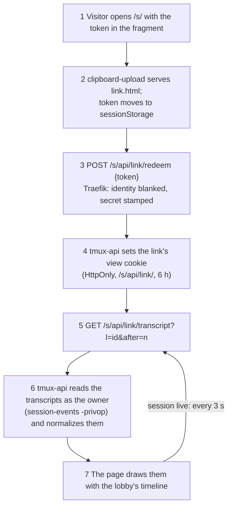

# Public links: share a session's conversation with someone who is not signed in

**Status:** shipped 2026-10-06, revised 2026-10-07 to share the conversation
only · **Scope:** `tmux-api/links.go`, `tmux-api/links_transcript.go`,
`clipboard-upload/assets.go` (the `/s/` page), `frontend-v2/link.html` and
`src/link/`, the Share dialog and Settings, `docker/`,
`infra/stacks/terminal/public_links.tf` · **ADRs:**
[0039](../adr/0039-a-public-link-attaches-through-a-ticket-and-a-grant.md),
[0040](../adr/0040-an-ended-link-shows-its-transcript.md),
[0041](../adr/0041-a-public-link-shares-the-conversation-not-the-terminal.md)

Viktor, 2026-10-06: *"i want to create public urls which i can share to users
that are not signed in."* Later the same day: *"Once I kill the session, the
link should still point to a read-only transcript of the session unless I've
explicitly revoked the link."* And on 2026-10-07, after using it: *"we should
share the text mode only. the terminal is not helpful."*

A **Share** grants a session to a named account on the box. A **Link** is the
other case: a URL that works for whoever holds it, with no account and no
sign-in, and shows the session's conversation read-only.

## Decisions as they stand

| # | Question | Decision |
|---|---|---|
| 1 | What a link opens | One session's Claude conversation, which the link's creator owns. A session shared with you cannot be linked; a plain shell has no conversation and cannot be linked either. |
| 2 | Access | Read-only. Nobody types into a session through a link. |
| 3 | Lifetime | The owner picks 1h, 24h, 7d or until revoked. |
| 4 | Visitor identity | Anonymous. The owner sees a count, "2 viewing". |
| 5 | Visitor page | The session title, a Live/Ended badge, and the conversation as the Text view draws it, tool calls and results included. No terminal, sidebar, files or uploads. |
| 6 | Several links | Allowed, each revocable on its own, each with an optional private note. |
| 7 | Session ends | The link stays and shows the finished conversation until it expires or is revoked. A rename keeps it working. A restored session does not revive it. |
| 8 | Where links live | `terminal.viktorbarzin.me/s/#<token>`, an unauthenticated path on the lobby's own host. |
| 9 | Token in logs | The token travels in the URL fragment, which browsers never send. Redeeming it sets a per-link view cookie, and only the link id appears in a request URL. |
| 10 | Telling the owner | "N viewing" in the session bar with a one-click Stop. Every link creation and revoke is journalled and emitted as telemetry. |
| 11 | Who can create | Every user, in every install mode. |
| 12 | Where it is managed | Share… on your own Claude session's ⋯ menu (card and session bar), and a list of all your links in Settings, ended ones included. |
| 13 | Several conversations | Every conversation the session ran while the link existed, oldest first, with a divider at each `/clear`. |
| 14 | Named shares | Pinned to one session by `session_id` and `session_created`, so a grant no longer passes to the next session that takes the same name. |

## How a visit works

While the session runs, the page re-reads every 3 seconds and receives only
the events after the last one it holds. Once the session ends the answer says
so, and the page stops polling. Pictures and full tool results load through
`/s/api/link/image`, `/picture` and `/result` with the same cookie.

### Recording the conversation

A session's transcript path is the tmux option `@claude_transcript`, set by
Claude Code's SessionStart hook and gone with the session. tmux-api appends it
to the link's `transcripts` list on creation, on every read of a live link, in
the 15-second sweep, from the owner's link list, and in the kill path just
before the session is killed. When the session is gone, the link is marked
`endedAt` and keeps the list.

### Session identity

A link records the owner, tmux's `session_id` and the session's `created`
second. `session_id` alone is reused from `$0` after a tmux server restart, so
the pair is what identifies one session over the life of the box.

### Routes

| Path on `terminal.viktorbarzin.me` | Upstream | Middlewares |
|---|---|---|
| `/s/api/link/redeem` (exact) | tmux-api `/link/redeem` | strip identity, real-ip, rate limit, proxy secret |
| `/s/api/link/{transcript,result,image,picture}` (each exact) | tmux-api, `/s/api` stripped | strip identity, real-ip, read rate limit, proxy secret |
| `/s/assets/` | clipboard-upload, `/s` stripped | strip identity, real-ip, rate limit |
| `/s` and `/s/` (exact) | clipboard-upload | strip identity, real-ip, rate limit |

Every tmux-api route here is an exact path. Without forward-auth nothing else
overwrites an identity header a client sends, and tmux-api trusts the header
once the proxy secret checks out, so a prefix route would expose every
tmux-api route. The container's nginx mirrors the same routes.

## What the owner sees

- **Share…** on the ⋯ menu of your own Claude session opens a dialog with the
  session's links (expiry, note, how many are viewing, Revoke) and a form for a
  new one: a lifetime and an optional note. The URL appears once, with Copy.
- **Settings → Public links** lists every link, including those whose session
  has ended ("Session ended, shows its conversation read-only").
- **The session bar** shows "2 viewing" while people read, with Stop, which
  revokes every link on the session.

## Security model

- A link exposes the whole conversation, tool output included, to whoever
  holds the URL, for as long as it lives. An "until revoked" link is a public
  copy until it is revoked.
- The token is 128 bits from `crypto/rand`, base64url-encoded, and only its
  SHA-256 is stored, in `/var/lib/tmux-api/links.json`.
- The token never appears in a request line. The view cookie is random, bound
  to one link, held in tmux-api's memory, HttpOnly, Secure, SameSite=Strict and
  scoped to `/s/api/link/`; revoking or expiring the link drops it.
- tmux-api reads another user's transcripts through session-events' existing
  privileged child, which bounds every path to that user's
  `~/.claude/projects`. Pictures come only from transcript image blocks, or from
  the owner's clipboard store when a transcript names the path verbatim.
- A lens tab cannot list, create or revoke links. The QA harness refuses to
  create or revoke them.

## History

- **2026-10-06, ADR-0039.** Links attached a live terminal, read-only or
  read-write, through two ttyd instances run as a dedicated `tl-link` account,
  with a single-use ticket and grant per attach. Two design reviews shaped that
  path: a read-only tmux client can still switch sessions with the prefix key,
  and an unauthenticated route must strip identity headers.
- **2026-10-06, ADR-0040.** Links outlived their session and showed the
  conversation afterwards.
- **2026-10-07, ADR-0041.** The terminal went. On a wide screen a watcher's
  terminal was a small block in an empty page, and the conversation was what
  visitors needed. Read-write links went with it, and so did the link ttyds,
  `tl-link`, its sudo grant and the 7692-7693 firewall rules.

## Open questions

- Every live reader re-parses the transcripts every 3 seconds. If that shows
  up in tmux-api's rollup timings, a parse cache keyed on file size is the next
  step.
- Read-only named Shares attach through the lobby's ttyd, which takes input, so
  a guest can still use the tmux prefix to switch to the owner's other sessions.
  Closing it for Shares is a separate change.
