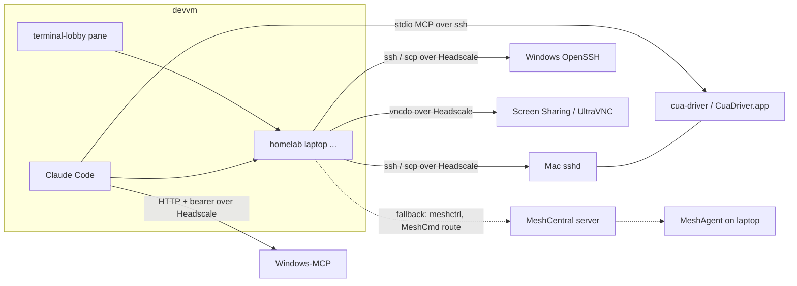

# Laptop remote control options for humans and agents

Date: 2026-10-03. Scope: self-hosted, zero-cost ways to reach Windows and macOS laptops from the devvm, for a human admin terminal and for a Claude Code agent doing commands, file transfer and computer use (screenshots plus mouse and keyboard). Repo metadata (licence, last push, latest release) was read from the GitHub API on 2026-10-03.

## Summary

No single free, self-hosted product covers both needs well. The remote-access suites (MeshCentral, RustDesk, Tactical RMM, NetLock) give humans a remote desktop, but none exposes screenshot or input injection through a documented API that an agent on Linux can call. The agent-oriented projects (cua-driver, Windows-MCP) do expose that, but they run on the laptop and need a transport. The recommended shape is a combination: Headscale (already running) plus each OS's own SSH server for `homelab laptop shell|run|upload`, cua-driver on macOS and Windows-MCP on Windows for agent computer use reached over the tailnet, VNC plus `vncdotool` as a plain pixel fallback that also works at the login screen, and the existing MeshCentral as an always-on out-of-band channel for when the tailnet path is down. The corporate-managed Meta Mac is treated separately: nothing here should be installed on it without employer approval, and its MDM can deny Screen Recording regardless.

## Comparison

| Candidate | Maintained (2026) | Licence | macOS side | Windows side | Privilege, login screen | NAT | Consent / indicator | Agent API from Linux | Cost, paid-only parts |
|---|---|---|---|---|---|---|---|---|---|
| MeshCentral | Yes, 1.2.6 on 2026-09-24; MeshAgent commits 2026-09-23 | Apache-2.0 | Root LaunchDaemon plus per-user KVM LaunchAgent; signing/notarization unverified; open desktop bugs on recent macOS | SYSTEM service; server signs agent, default cert self-signed (SmartScreen likely) | Root/SYSTEM; login-window agent present on macOS | Outbound websocket to server, relays | Per group/device/user notify, prompt, toolbar | `meshctrl` RunCommand, Shell, Upload, Download, WebRelay (HTTP only); MeshCmd `route` maps TCP ports; no screenshot or input command | Free |
| RustDesk (OSS server) | Client 1.5.0 on 2026-09-30; server 1.1.16 on 2026-07-20 | AGPL-3.0 | App needs Accessibility, Screen Recording, Input Monitoring granted by hand | Installable service | Service mode; macOS login screen unverified | Outbound to hbbs, relay via hbbr | On-screen session window; details unverified | CLI is install/config only (`--get-id`, `--password`, `--config`); no session API in OSS | Server Pro (web console, REST API, address book) from $11.88/month |
| Tactical RMM | Yes, v1.5.2 on 2026-08-11 | Tactical RMM License (source-available, not OSI) | Signed agent only for paying sponsors | Signed agent only for paying sponsors | SYSTEM/root | Outbound to server (NATS) | Remote desktop is embedded MeshCentral | REST API with API key: run command, run script; no screen API | Code-signed agents need monthly sponsorship |
| NetLock RMM | Yes, 3.3.0.4 on 2026-09-16 | AGPL-3.0 core, some parts unpublished | Agent yes; remote screen listed for Windows and Linux only | Agent, remote screen (H.264) | SYSTEM/root (assumed, unverified) | Relay server, TCP tunnels | Unverified | Unverified | Community edition 25 devices, no Windows code signing; membership portal required |
| Teleport Community | v18.10.0 on 2026-07-09 (latest GitHub release) | AGPL-3.0 source; binaries under Community licence | `teleport` daemon supported | Daemon not supported; RDP desktop access via Windows Desktop Service | Root on macOS; RDP host needs Pro/Enterprise Windows | Agents reverse-tunnel to proxy | Session recording | `tsh ssh`, `tsh scp`; no macOS desktop | Free under 100 employees and US$10M revenue; local-user desktops capped at 5 |
| Apache Guacamole | guacamole-server 1.6.0 tagged 2025-06-23; commits 2026-09 | Apache-2.0 | Gateway only (VNC/SSH targets) | Gateway only (RDP/VNC/SSH targets) | Depends on target protocol | None; guacd must reach the target | None of its own | REST API for connections; no agent-oriented screenshot call | Free |
| Headscale + OS SSH / VNC / RDP | Headscale v0.29.4 on 2026-09-23; Tailscale v1.102.5 on 2026-09-29 | BSD-3-Clause | Remote Login (OpenSSH), Screen Sharing (VNC); Tailscale SSH only in `tailscaled` variant | OpenSSH Server; RDP host only on Pro/Enterprise/Education; VNC needs third-party server | sshd root; GUI Tailscale on macOS disconnects at login window; Windows "unattended mode" stays up | WireGuard, DERP relay (embedded in Headscale) | OS indicators only (Screen Sharing menu bar icon) | `ssh`, `scp`; `vncdotool` for capture/type/click | Free |
| DWService | Agent repo active 2026-09-18 | Agent source published, no licence file; server hosted only | Agent | Agent | Unverified | Vendor relay | Unverified | Vendor API at api.dwservice.net | Free tier capped at 6 Mbps; not self-hostable |
| NoMachine free | Unverified | Proprietary freeware | Yes | Yes | Unverified | Direct, or vendor network | Unverified | None found | Free for personal use; commercial use needs paid licence |
| osquery / Fleet | osquery 5.23.1 on 2026-06-24; Fleet 4.92.2 on 2026-09-30 | Apache-2.0/GPL-2.0 (osquery); Fleet open core | Agent | Agent | Root/SYSTEM | Outbound to Fleet | n/a | Read-only SQL queries | Fleet script execution and lock/wipe are Premium ($7/host/month) |
| cua-driver (trycua/cua) | Yes, v0.32.0 on 2026-10-01 | MIT (optional perception extension AGPL) | Notarized `CuaDriver.app` daemon; TCC grants kept across updates when signing requirement unchanged | Supported via UI Automation; needs interactive session | Runs as the logged-in user | None (needs a transport) | Permission modes; cursor overlay | MCP over stdio (`cua-driver mcp`), CLI `cua-driver call`; HTTP endpoint is loopback only | Free |
| Windows-MCP | Yes, v0.8.7 on 2026-09-30 | MIT | n/a | Python MCP server, stdio/SSE/streamable HTTP | Runs as the logged-in user | None (needs a transport) | Visible edge glow while AI controls; physical input or Ctrl+Alt+Shift+Backspace takes back control | Screenshot, Click, Type, Shortcut, PowerShell, FileSystem, Registry, Process; bearer token, IP allowlist, TLS | Free |
| VNC + vncdotool | vncdotool v1.4.2 on 2026-09-06 | MIT (vncdotool) | Apple Screen Sharing, built in | UltraVNC (GPL-3.0) or other VNC server | Server-dependent; Screen Sharing and service-mode VNC servers can serve the login screen (unverified on macOS 26) | Needs a transport (tailnet) | macOS menu bar icon; VNC server tray icon on Windows | `vncdo capture`, `type`, `move`, `click` from Linux | Free |
| Bytebot | Archived 2025-09-12 | Apache-2.0 | n/a | n/a | Linux container desktop only | n/a | n/a | n/a | Not usable for real laptops |
| mcp-remote-macos-use | Stale, last push 2025-06-10 | MIT | Drives Screen Sharing over VNC | n/a | As VNC | Needs transport | As VNC | MCP tools for screen, keys, mouse | Free; LiveKit optional |
| Anthropic computer-use demo | Repo active 2026-09-30 | MIT | n/a | n/a | Docker Linux desktop | n/a | n/a | Reference agent loop and tool schema | API usage only |

## Per-candidate notes

### MeshCentral

- Active. Server 1.2.6 released 2026-09-24 ([releases](https://github.com/Ylianst/MeshCentral/releases)); MeshAgent had several commits on 2026-09-23 including desktop-session heap fixes ([commits](https://github.com/Ylianst/MeshAgent/commits)). A 2024 thread asked for contributors to revive MeshAgent ([#253](https://github.com/Ylianst/MeshAgent/issues/253)); 2026 activity suggests that happened.
- `meshctrl` commands include RunCommand (with `--powershell`, `--runasuser`, `--runasuseronly`), Shell, Upload, Download, WebRelay, DeviceMessage and DeviceToast. There is no screenshot or input command, and WebRelay relays HTTP/HTTPS only ([meshctrl.js](https://github.com/Ylianst/MeshCentral/blob/master/meshctrl.js)). Auth is by user/password, 2FA token or login key.
- MeshCmd has a `route` action that maps a local TCP port through the server to a port on a managed device, and runs on Windows and Linux ([MeshCmd guide](https://meshcentral.com/docs/MeshCmdUserGuide.pdf)). That gives a way to reach a VNC server or a computer-use HTTP endpoint on a laptop without the tailnet. MeshCentral Router, the GUI equivalent, is Windows-only ([docs](https://docs.meshcentral.com/meshrouter/)).
- macOS: installs to `/usr/local/mesh_services/meshagent/` with launchd plists ([agents doc](https://docs.meshcentral.com/meshcentral/agents/)). MeshCentral 1.2.1 added a KVM helper LaunchAgent and ScreenCaptureKit path for macOS 26; a user reported an agent crash loop on macOS 26.5.2 arm64, closed as completed on 2026-09-04 ([MeshAgent #359](https://github.com/Ylianst/MeshAgent/issues/359)). A "desktop shows only wallpaper" report on 1.2.1 was auto-closed as stale ([#7946](https://github.com/Ylianst/MeshCentral/issues/7946)). Older reports show Screen Recording grants not taking effect depending on install method ([#4824](https://github.com/Ylianst/MeshCentral/issues/4824)). I found no notarization tooling in the MeshAgent repo; whether the macOS agent is notarized, and whether TCC grants survive agent self-update, is unverified.
- Windows: server can sign the agent; `authenticode.js` can create a self-signed cert, and an external signing hook exists ([code signing doc](https://docs.meshcentral.com/meshcentral/codesigning/)). A self-signed cert does not avoid SmartScreen; a CA certificate costs money.
- Consent: per domain/group/device/user notify, prompt and connection toolbar flags ([Intel article](https://www.intel.com/content/www/us/en/developer/articles/technical/meshcentral2-multi-os-user-consent-feature.html)). A macOS consent dialog bug with apostrophes was open on 2026-10-02 ([#8188](https://github.com/Ylianst/MeshCentral/issues/8188)).
- Computer use for an agent would mean writing a client for MeshCentral's desktop websocket protocol. Not attempted; effort unverified.

### RustDesk (self-hosted OSS server)

- Client 1.5.0 on 2026-09-30, server 1.1.16 on 2026-07-20 ([client releases](https://github.com/rustdesk/rustdesk/releases), [server releases](https://github.com/rustdesk/rustdesk-server/releases)). AGPL-3.0.
- A terminal feature shipped in 1.4.1 (2025-07-29), with persistent-session and reconnect work in 1.4.6 to 1.5.0 ([1.4.1](https://github.com/rustdesk/rustdesk/releases/tag/1.4.1), [1.5.0](https://github.com/rustdesk/rustdesk/releases/tag/1.5.0)). It is a GUI-client feature, not a CLI.
- Documented CLI flags are `--password`, `--get-id`, `--set-id`, `--silent-install`, `--config`, `--import-config` ([client docs](https://rustdesk.com/docs/en/client/)). No documented way to take a screenshot or inject input from a headless Linux client.
- Pro-only: web console, OIDC/LDAP/2FA, address book, audit log, access control, multiple relays, custom client generator, web client and REST API ([Server Pro](https://rustdesk.com/docs/en/self-host/rustdesk-server-pro)). Cheapest paid plan $11.88/month; the free plan is the OSS server ([pricing](https://rustdesk.com/pricing)).
- macOS needs Accessibility, Screen Recording and, on newer releases, Input Monitoring, granted by the user; Gatekeeper may need an allow ([mac docs](https://rustdesk.com/docs/en/client/mac/)). Notarization and grant survival across updates are not documented there.
- Fit: good human remote desktop for family support. Not an agent path.

### Tactical RMM

- v1.5.2 on 2026-08-11; agent v2.11.0 on 2026-06-15 ([releases](https://github.com/amidaware/tacticalrmm/releases)).
- Licence is source-available and states it is not open source; in-house use is allowed, commercial use needs approval ([licence](https://docs.tacticalrmm.com/license/)).
- Code-signed Windows, macOS and Linux agents require at least a Tier 1 monthly sponsorship ([code signing](https://docs.tacticalrmm.com/code_signing/)); the FAQ leaves self-building to DIYers ([FAQ](https://docs.tacticalrmm.com/faq/)). The sponsorship amount was not verified.
- Remote desktop is an embedded MeshCentral. REST API with `X-API-KEY` covers listing agents, `POST /agents/<id>/cmd/`, run script ([API](https://docs.tacticalrmm.com/functions/api/)).
- Fit: adds a paid macOS agent on top of MeshCentral, which we already run. Not recommended.

### NetLock RMM

- 3.3.0.4 on 2026-09-16. AGPL core, with the note that not every feature's source is published ([README](https://github.com/0x101-Cyber-Security/NetLock-RMM)).
- Remote screen control is listed for Windows and Linux, not macOS; remote shell, file browser and relay tunnels for RDP/SSH exist ([README](https://github.com/0x101-Cyber-Security/NetLock-RMM)).
- Community edition: up to 25 devices, all features except Windows code signing, and registration in the vendor's members portal is required ([service description](https://docs.netlockrmm.com/en/legal/service-description/current)).
- Fit: no macOS remote screen and a vendor portal dependency. Not recommended.

### Teleport Community Edition

- Latest GitHub release v18.10.0 on 2026-07-09 ([releases](https://github.com/gravitational/teleport/releases)); docs reference 19.x.
- Binaries are free for organisations under 100 employees and under US$10M revenue; source is AGPL-3.0 ([feature matrix](https://goteleport.com/docs/feature-matrix/)). Personal use fits.
- The `teleport` daemon runs on macOS but not on Windows ([Windows install](https://goteleport.com/docs/installation/single-machine/windows.md), [macOS install](https://goteleport.com/docs/installation/single-machine/macos/)).
- Desktop access covers Windows and Linux desktops over RDP, not macOS; the Windows Desktop Service reverse-tunnels to the proxy but still has to reach the host's RDP port ([desktop access](https://goteleport.com/docs/enroll-resources/desktop-access/introduction/)). Community Edition allows passwordless local-user access to at most 5 desktops ([local users](https://goteleport.com/docs/enroll-resources/desktop-access/getting-started/)). Windows Home cannot be an RDP host ([Microsoft](https://learn.microsoft.com/en-us/windows-server/remote/remote-desktop-services/remotepc/remote-desktop-allow-access)).
- Fit: good SSH for Macs, weak for Windows laptops. Duplicates what Headscale plus SSH gives.

### Apache Guacamole

- guacamole-server 1.6.0 tagged 2025-06-23, commits through 2026-09 ([repo](https://github.com/apache/guacamole-server)). Apache-2.0.
- A clientless gateway: guacd connects out to RDP, VNC or SSH endpoints, so it needs network reach (the tailnet) and adds no agent of its own ([manual](https://guacamole.apache.org/doc/gug/)).
- Fit: overlaps with terminal-lobby's own web UI. Only useful if we want an in-browser VNC/RDP view for humans.

### Headscale plus native SSH, VNC and RDP

- Headscale v0.29.4 on 2026-09-23 lists Tailscale SSH policy support ([features](https://github.com/juanfont/headscale/blob/main/docs/about/features.md), [policy](https://github.com/juanfont/headscale/blob/main/docs/ref/policy.md)).
- Tailscale SSH server runs only on Linux and the macOS open-source `tailscaled` variant, not Windows ([Tailscale SSH](https://tailscale.com/kb/1193/tailscale-ssh)). The `tailscaled` variant has no GUI but is the only macOS variant that runs before login ([macOS variants](https://tailscale.com/kb/1065/macos-variants)). The GUI variants run in the user session, so a Mac at the login window drops off the tailnet ([unattended mode](https://tailscale.com/kb/1088/run-unattended)). Windows has an unattended mode that keeps the node up with no user signed in (same page).
- Without Tailscale SSH, macOS Remote Login and Windows OpenSSH Server work over the tailnet with key auth ([Windows OpenSSH](https://learn.microsoft.com/en-us/windows-server/administration/openssh/openssh_install_firstuse)). These are signed OS components, so no Gatekeeper, SmartScreen or third-party agent update questions.
- macOS Screen Sharing accepts VNC clients with a password when "VNC viewers may control screen with password" is set ([Apple](https://support.apple.com/guide/mac-help/turn-screen-sharing-on-or-off-mh11848/mac)). Windows has no built-in VNC server; RDP hosting needs Pro or higher (Microsoft link above).
- `vncdotool` (MIT, v1.4.2 on 2026-09-06) provides `vncdo -s host capture screen.png`, `type`, `move`, `click`, and lists Apple Screen Sharing and UltraVNC on Windows as supported on their own OS ([README](https://github.com/sibson/vncdotool)). This is a pixel-only path: no accessibility tree, but it works with whatever the console shows, including a login window, assuming the VNC server serves it.

### DWService

- Agent source is published for Linux, macOS and Windows, with no licence file ([repo](https://github.com/dwservice/agent)). The server and relay are run by DWSNET; I found no self-hosting option.
- Free accounts are capped at 6 Mbps per session ([subscriptions](https://docs.dwservice.net/docs/site/basic-definitions/subscriptions/)).
- Fit: fails the self-hosted requirement.

### NoMachine free

- Proprietary. Free version is for personal use; commercial use needs a paid licence ([licensing](https://www.nomachine.com/licensing); detailed terms not read, unverified). No automation API found.
- Fit: not self-hostable in the relay sense and no agent API.

### osquery and Fleet

- Inventory and read-only SQL queries. Fleet Free lacks script execution and lock/wipe, which are Premium at $7/host/month ([pricing](https://fleetdm.com/pricing)).
- Fit: inventory only. Not a control channel at zero cost.

### cua-driver (trycua/cua)

- MIT; v0.32.0 on 2026-10-01 ([releases](https://github.com/trycua/cua/releases)). Supports macOS 14+ (Accessibility, ScreenCaptureKit), Windows 10/11 (UI Automation, Win32 input) and Linux ([docs](https://cua.ai/docs/cua-driver)).
- Integration: MCP over stdio (`cua-driver mcp`) and a CLI (`cua-driver call <tool>`). `get_window_state` returns the accessibility tree and a screenshot together; tools include click, type_text, press_key, hotkey, launch_app, list_windows ([README](https://github.com/trycua/cua/blob/main/libs/cua-driver/README.md), [test matrix](https://github.com/trycua/cua/blob/main/libs/cua-driver/docs/test-matrix.md)). The HTTP endpoint is authenticated and loopback only ([protocol doc](https://github.com/trycua/cua/blob/main/libs/cua-driver/docs/mcp-protocol-and-skills.md)). From the devvm, the natural transport is `ssh <laptop> cua-driver mcp` registered as a stdio MCP server.
- macOS: the installer wraps the binary in `/Applications/CuaDriver.app` (bundle id `com.trycua.driver`) so TCC grants attach to a stable identity, and it keeps the grants across updates when the new build satisfies the old designated signing requirement ([install script](https://github.com/trycua/cua/blob/main/libs/cua-driver/scripts/_install-rust.sh)). Release builds refuse to publish without macOS notarization ([CD workflow](https://github.com/trycua/cua/blob/main/.github/workflows/cd-rust-cua-driver.yml)). `cua-driver mcp` proxies to the CuaDriver.app daemon, so the TCC-holding process is the app, not the SSH session ([docs](https://cua.ai/docs/cua/guide/advanced/local-computer-server)). Whether this works when invoked over SSH was not tested.
- Windows: the e2e harness requires "an interactive console or RDP session" ([README](https://github.com/trycua/cua/blob/main/libs/cua-driver/README.md)). Whether an SSH-launched `cua-driver` can reach the desktop is unverified; Windows authenticode signing of releases is unverified.
- Permission modes `standard`, `bounded` (manifest of allowed tools) and `unrestricted` are fixed at daemon launch (README).

### Windows-MCP

- MIT; v0.8.7 on 2026-09-30 ([repo](https://github.com/CursorTouch/Windows-MCP)).
- Tools: Screenshot (per display or region), Snapshot (UI tree), Click, Type, Scroll, Move, Shortcut, App, PowerShell, FileSystem, Clipboard, Process, Registry, Notification.
- Transports: stdio, SSE, streamable HTTP. Network use supports a bearer `--auth-key`, `--ip-allowlist`, TLS and OAuth 2.0 with PKCE (README). Run it in the user's session at logon and bind it to the tailnet address.
- While the AI controls the desktop, an edge and cursor glow show it; moving the mouse or pressing Ctrl+Alt+Shift+Backspace returns control to the person for at least 10 seconds of idle. The README states the takeover is best-effort and not a security boundary.

### AI computer-use projects not recommended

- Bytebot: archived on 2025-09-12 and drives a Linux container desktop, not a real laptop ([repo](https://github.com/bytebot-ai/bytebot)).
- mcp-remote-macos-use: drives a Mac over Screen Sharing (VNC) with MCP tools for screen, keys and mouse; last push 2025-06-10 ([repo](https://github.com/baryhuang/mcp-remote-macos-use)). The approach is sound; the project is stale, and `vncdotool` covers the same ground from a CLI.
- Anthropic computer-use demo: a Docker Linux desktop with an agent loop; useful as the tool-schema and loop reference, not as a remote-machine driver ([README](https://github.com/anthropics/claude-quickstarts/tree/main/computer-use-demo)). The same repo points to a computer-use best-practices quickstart that runs natively on macOS.

### Corporate-managed Mac (MDM, EDR)

- Apple's PPPC payload lets MDM deny Screen Recording but not grant it, and it can allow Accessibility; it needs supervision ([Apple PPPC](https://support.apple.com/guide/deployment/privacy-preferences-policy-control-payload-dep38df53c2a/web)). An employer can therefore block every screen-capture path above.
- Installing a remote-control agent on a work laptop is a policy question for the employer. What Meta's MDM and EDR allow is unverified, and this doc does not recommend installing any of these tools there without approval.

## Ranked recommendation for this use case

1. Transport and human terminal: Headscale plus native SSH (macOS Remote Login, Windows OpenSSH Server). `homelab laptop shell|run|upload` become `ssh`/`scp` against tailnet names. Zero cost, OS-signed, no third-party agent. On Macs that must be reachable at the login window, install the `tailscaled` variant (or accept MeshCentral as the pre-login path).
2. Agent computer use on macOS: cua-driver, registered on the devvm as a stdio MCP server through `ssh <mac> cua-driver mcp`, with `cua-driver call` behind `homelab laptop screenshot|click|type`. Notarized, TCC grants persist across updates, accessibility tree plus screenshot.
3. Agent computer use on Windows: Windows-MCP in streamable-HTTP mode with an auth key, started at user logon and bound to the tailnet IP. It has PowerShell, file and screenshot tools and a visible AI-control indicator with a local takeover key. Try cua-driver on Windows too, once the SSH-session question is answered, so both OSes share one tool surface.
4. Pixel fallback for both OSes: VNC over the tailnet plus `vncdotool` (macOS Screen Sharing built in, UltraVNC on Windows). Lowest common denominator for screenshot/click/type, and the only agent path here that could work on a login or lock screen.
5. Out-of-band channel: keep MeshCentral (already deployed). Root/SYSTEM agent with outbound websocket, consent prompts per group, `meshctrl` RunCommand/Shell/Upload, and MeshCmd `route` to reach a laptop's VNC or MCP port when the tailnet is down. Good default for family machines that need consent prompts.
6. Human-only remote desktop for family: RustDesk OSS server, if MeshCentral's macOS desktop proves unreliable. No agent value.
7. Not recommended: Tactical RMM (paid macOS agent, wraps MeshCentral), NetLock (no macOS remote screen, vendor portal), Teleport CE (no Windows daemon, no macOS desktop), Guacamole (duplicates the lobby), DWService and NoMachine (not self-hosted), Fleet (inventory only at zero cost), Bytebot and the Anthropic demo (Linux containers).

## Open questions

- Whether a process launched over Windows OpenSSH can drive the interactive desktop (cua-driver or Windows-MCP over stdio). I expect not, which is why Windows-MCP is recommended in HTTP mode started at logon; not tested.
- Whether `ssh <mac> cua-driver mcp` reaches the CuaDriver.app daemon and its TCC grants when no GUI shell launched it; not tested.
- MeshAgent macOS signing and notarization, whether its Screen Recording grant survives agent self-update, and how stable desktop capture is on macOS 26 after the 2026-09 fixes.
- Whether macOS Screen Sharing serves the login window and lock screen to a plain VNC-password client on macOS 26, and whether `vncdotool` handles that.
- Whether the devvm is a Headscale node today, and which family devices are already enrolled in Headscale and in MeshCentral (enrolment on meshcentral.viktorbarzin.me not checked).
- Tactical RMM sponsorship price, NoMachine licence details, NetLock agent privilege and consent behaviour, RustDesk behaviour at the macOS login screen: not verified.
- What Meta's MDM and EDR permit on the work Mac.
