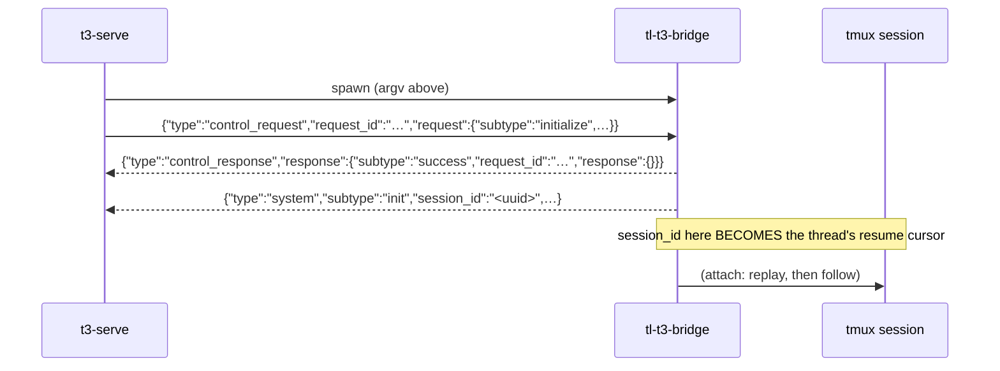

# The bridge contract

**Status:** phase 1 complete — the foundation is real code; phases 2 and 3 fill the skeletons in.
**Date:** 2026-08-15 · **Applies to:** `sessionio/`, `t3-bridge/`, `t3-sync/`

This is the document four agents work against simultaneously. It says who owns which file, what
each seam's signature is, and what goes on the wire. Design and rationale live in
`docs/plans/2026-08-15-t3-code-bridge-design.md` (the 14 decisions) and
`docs/adr/0009-t3-interop-via-a-provider-binary-bridge.md`; vocabulary is in `CONTEXT.md`. Read
those first — this document does not repeat them, and a decision restated here in shorter form
would only be a place for the two to drift.

## 1. Modules and ownership

Four Go modules, all stdlib-only, all wired by `replace` directives against local paths (the
pattern `telemetry/` already uses). No new dependencies; `go.sum` stays absent.

```
sessionio/          terminal-lobby/sessionio          shared library  — PHASE 1, DONE
  siotest/          terminal-lobby/sessionio/siotest  test doubles
session-events/     …/session-events                  existing service, now a consumer
t3-bridge/          terminal-lobby/t3-bridge          binary tl-t3-bridge
t3-sync/            terminal-lobby/t3-sync            binary tl-t3-sync
```

| Agent | Owns, exclusively | May read |
|---|---|---|
| A — protocol | `t3-bridge/main.go`, `t3-bridge/protocol.go` | everything |
| B — attach | `t3-bridge/attach.go` | everything |
| C — resurrect | `t3-bridge/resurrect.go`, `t3-bridge/index.go` | everything |
| D — syncer | all of `t3-sync/` | everything |

Rules that keep four agents out of each other's way:

- **Nobody edits `sessionio/`.** It is phase 1's output and every module depends on it; a change
  there is a change under three other agents' feet. If a seam is genuinely missing, add it in
  your OWN file first and say so in your report — a later phase promotes it if two callers want it.
- **Nobody edits another agent's file**, including to fix a compile error. The seams below are
  what you code against; if one is wrong, note it in your report and work around it locally.
- **Tests go in your own `_test.go` files**, named after the file you own (`attach_test.go`, …).
- Agents A, B and C share one package (`package main` in `t3-bridge`), so identifiers collide.
  Every name introduced in phase 2 is listed in §5; do not add a package-level name that is not
  in that table without prefixing it with your area (`protoX`, `attachX`, `resurrectX`).

## 2. What is already built and tested

`sessionio` is finished code with tests, not a skeleton. Reuse it; do not re-derive any of it.

### 2.1 tmux — `sessionio/tmux.go`

```go
const (StateRunning = "running"; StateAwaiting = "awaiting"; StateDone = "done")
const (OptionTranscript = "@claude_transcript"; OptionState = "@claude_state"; OptionThread = "@t3_thread")

type Options interface {
	Option(osUser, session, name string) (string, bool)
	SetOption(osUser, session, name, value string) error
}

func NewInjector(selfUser string) *Injector
func NewInjectorOnSocket(selfUser, socket string) *Injector   // tests only — an isolated -L server

func (in *Injector) Command(osUser string, args ...string) *exec.Cmd
func (in *Injector) Prompt(osUser, session, text string) error
func (in *Injector) Cancel(osUser, session string) error
func (in *Injector) State(osUser, session string) string
func (in *Injector) Option(osUser, session, name string) (string, bool)
func (in *Injector) SetOption(osUser, session, name, value string) error
func (in *Injector) HasSession(osUser, session string) bool
func (in *Injector) ListSessions(osUser string) ([]TmuxSession, error)
func (in *Injector) NewSession(spec NewSessionSpec) error
func (in *Injector) KillSession(osUser, session string) error

type TmuxSession struct{ Name, Dir string }
type NewSessionSpec struct {
	OSUser  string
	Name    string
	Dir     string
	Command []string
	Env     map[string]string
}
```

- `Option` is self-validating: tmux exits 0 for an unknown target, so the session name is printed
  back and checked. `ok=false` means "not this session's value", which is different from "unset".
- `NewSession` **fails on an existing name**, deliberately.
- `ListSessions` returns `(nil, nil)` when there is no server — an ordinary state.
- `KillSession` is the only irreversible verb here. Deliberate destruction only (decision 3).
- **In tests, only ever point an Injector at `NewInjectorOnSocket`,** and name any session you
  create `t3e2e-*`. Real sessions belonging to real people are on the default socket.

### 2.2 Transcript layout — `sessionio/layout.go`

```go
type SessionInfo struct{ TmuxSession, CWD, ClaudeID, Transcript string }

func ProjectsRoot(homeBase, osUser string) string      // /home/<user>/.claude/projects
func TranscriptSlug(cwd string) string                 // Claude Code's own cwd → directory rule
func TranscriptPath(root, cwd, claudeID string) string // <root>/<TranscriptSlug(cwd)>/<id>.jsonl
func TranscriptCWD(path string) string                 // where the conversation is really happening
func TranscriptModel(path string) string               // what it last answered with
func WithinProjects(root, path string) bool
func ClaudeIDFromTranscript(path string) string        // base name without .jsonl

func NewSessionMap(osUser, projectsRoot string, opts Options) *SessionMap
func (s *SessionMap) Root() string
func (s *SessionMap) Put(info SessionInfo) error
func (s *SessionMap) Get(tmux string) (SessionInfo, bool)
```

`Get` returns only `TmuxSession` and `Transcript` — a read-back recovers the stamp, nothing else.
Recover the uuid with `ClaudeIDFromTranscript`.

### 2.3 Transcript records — `sessionio/record.go`

```go
type RecordType string
const (RecordAssistant; RecordUser; RecordSystem; RecordAttachment; RecordLastPrompt; RecordQueueOperation)

type Record struct {
	Type        RecordType
	IsMeta      bool
	IsSidechain bool
	Timestamp   string   // RFC3339
	UUID        string
	ParentUUID  string
	CWD         string
	Message     Message
	SessionID    string  // "sessionId"
	SessionIDAlt string  // "session_id"
	Line        []byte   // the source line, verbatim
}

type Message struct {
	ID, Role, Model, StopReason string
	Content json.RawMessage
	Raw     json.RawMessage // the whole message object, byte for byte
}

type Block struct {
	Type, Text, ID, Name, ToolUseID string
	Input, Content json.RawMessage
	IsError bool
}

func DecodeRecord(line []byte) (Record, bool)
func (r Record) Conversational() bool          // assistant | user — a WHITELIST
func (r Record) ClaudeID() string
func (r Record) Role() string
func (r Record) Blocks() []Block
func (r Record) Text() string
func (r Record) HasBlock(types ...string) bool

func EndsTurn(stopReason string) bool
func InterruptNotice(r Record) (string, bool)
```

`Message.Raw` is the field the bridge forwards. Do not rebuild a message from `Blocks()` — the
transcript's `message` is already the SDK's `BetaMessage`, and re-encoding drops `usage`,
`stop_details` and everything a future Claude adds.

### 2.4 Tailing — `sessionio/tail.go`

```go
func ReadFrom(path string, off int64) (lines []string, next int64, err error)

func NewTail(path string) *Tail
func NewTailAt(path string, off int64) *Tail
func (t *Tail) Path() string
func (t *Tail) Offset() int64
func (t *Tail) Next() ([]Record, error)
```

`Next` returns whatever arrived since the last call, never redelivering. A missing file is an
`os.IsNotExist` error and an ordinary state at attach time — retry, do not give up.

### 2.5 Events — `sessionio/event.go`, `normalize.go`, `filesource.go`

The lobby's Event vocabulary. The bridge does not need it (it forwards records), but the settle
rules it is built on — `EndsTurn`, `InterruptNotice` — are shared and listed above.

```go
type Kind string; type Event struct{ … }; func (e Event) JSON() []byte
func NewNormalizer(session string) *Normalizer
func (n *Normalizer) Line(b []byte) []Event
func (n *Normalizer) Record(rec Record) []Event
func (n *Normalizer) Interrupt(at int64) (Event, bool)

func NewFileSource(session, path string, poll time.Duration) *FileSource
func (f *FileSource) Path() string
func (f *FileSource) Append(e Event)
func (f *FileSource) Replay(from int64) []Event
func (f *FileSource) Subscribe() (<-chan Event, func())
func (f *FileSource) TailOnce()
func (f *FileSource) Interrupt(at int64)
func (f *FileSource) Run(ctx context.Context)
```

### 2.6 Test doubles — `sessionio/siotest`

```go
func NewFakeOptions(live ...string) *FakeOptions   // names are "<osUser>/<session>"
func (f *FakeOptions) Option(osUser, session, name string) (string, bool)
func (f *FakeOptions) SetOption(osUser, session, name, value string) error
func (f *FakeOptions) Kill(osUser, session string)
func (f *FakeOptions) Start(osUser, session string)
```

## 3. The durable binding index

`~/.local/state/terminal-lobby/t3-bridge/index.json`, per user, `0600` in a `0700` directory.

**Why it exists.** T3 hands the bridge a Claude session uuid and nothing else. Resurrection also
needs the tmux session NAME and the cwd — and those live on the tmux session, which is precisely
what is missing. Every other binding in this system is deliberately tmux-session-lifetime so a
reused name never serves a dead conversation; this one is deliberately the opposite.

It lives in `sessionio` because both binaries read and write it and a `package main` cannot be
imported. `t3-bridge/index.go` is the bridge's policy layer over it.

### 3.1 On-disk shape

```json
{
  "version": 1,
  "bindings": {
    "6c420342-1111-2222-3333-444444444444": {
      "tmuxName": "feat-header",
      "cwd": "/home/wizard/code/terminal-lobby",
      "threadId": "eb1a92c6-…",
      "updatedAt": "2026-08-15T22:30:00Z"
    }
  }
}
```

Keyed by Claude session uuid. `threadId` is `""` until something adopts it. `updatedAt` is
RFC3339 UTC.

### 3.2 API — `sessionio/index.go`

```go
const IndexVersion = 1

type Binding struct {
	TmuxName  string    `json:"tmuxName"`
	CWD       string    `json:"cwd"`
	ThreadID  string    `json:"threadId"`
	Origin    string    `json:"origin,omitempty"`   // OriginLobby | OriginT3
	AliasOf   string    `json:"aliasOf,omitempty"`  // this uuid stands in for that conversation
	WarmedAt  time.Time `json:"warmedAt,omitempty"` // zero = the sentinel never landed
	UpdatedAt time.Time `json:"updatedAt"`
}

func DefaultIndexPath() (string, error)
func NewIndex(path string) *Index
func (ix *Index) Path() string
func (ix *Index) All() (map[string]Binding, error)
func (ix *Index) Get(claudeID string) (Binding, bool, error)
func (ix *Index) FindByThread(threadID string) (string, Binding, bool, error)
func (ix *Index) Put(claudeID string, b Binding) error
func (ix *Index) Merge(claudeID string, apply func(Binding) Binding) error
func (ix *Index) Delete(claudeID string) error
func (ix *Index) Update(fn func(map[string]Binding) error) error
```

- Every read-modify-write runs under an exclusive `flock` on `index.json.lock` (a sidecar, because
  the index itself is replaced by rename on each write). Saves are tmp + fsync + rename.
- A missing file is an EMPTY index; a corrupt file is an ERROR. Answering "no bindings" for a
  corrupt file would send the bridge resurrecting sessions that are alive.
- `Put` stamps `UpdatedAt` unless the caller set it.
- `Update` applies to a copy: a callback that fails changes nothing on disk.
- Prefer `Update` for a batch (the syncer's prune) so several changes land as one write.

### 3.3 Who writes what

| Writer | When | What |
|---|---|---|
| bridge (`Bindings.Record`) | every successful attach, and after a resurrection | `tmuxName`, `cwd`, `threadId` |
| syncer (`Adopter.Adopt`) | at adoption, **before** the warm-up turn | `threadId` on an existing entry, or a whole new one |
| syncer (`Reconciler.Apply`) | prune pass | deletes entries neither surface has |
| bridge (`Bindings.Forget`) | deliberate destruction only | deletes one entry |

The ordering constraint is real: the warm-up turn makes T3 spawn the bridge, and the bridge
resolves its target through this file. Writing the binding after dispatching the turn is a race
the bridge loses.

## 4. The wire

Shapes transcribed from `@anthropic-ai/claude-agent-sdk` 0.3.233's `sdk.d.ts`, as shipped inside
t3 `v0.0.34-nightly.20260815.1098` — the copy T3 actually talks to, at
`/usr/lib/node_modules/t3/node_modules/@anthropic-ai/claude-agent-sdk`. Where a field is required
there, it carries no `omitempty` here: T3's decoder is what has to be satisfied.

### 4.1 How T3 spawns the bridge

cwd is the thread's workspace root. argv:

```
--output-format stream-json --input-format stream-json --verbose
[--model M] [--effort E] [--permission-prompt-tool stdio] [--mcp-config <json>]
--setting-sources=user,project,local
[--permission-mode bypassPermissions] [--allow-dangerously-skip-permissions]
[--include-partial-messages] [--add-dir D]...
( --session-id <uuid>   # a NEW thread; T3 assigned the id
| --resume <uuid> )     # an EXISTING thread
```

Both `--flag value` and `--flag=value` appear in one command line. Unrecognised flags are kept,
not rejected: T3 upgrades nightly.

Two invocations are **not** bridge work and are handed to the real claude untouched: `--version`
(T3's provider health probe parses the output) and `auth …`.

### 4.2 Handshake



`request_id` is a **string**, and on the reply it lives on the INNER object, beside `subtype` —
not next to `type`.

**Reply success to every control_request you do not specifically handle.**
`SDKControlRequestInner` is a union of 35 shapes and T3 may send any of them; refusing the unknown
ones stalls a thread on a request the bridge merely has no opinion about. Observed live so far:
`initialize`, `set_permission_mode`, `get_context_usage`, `interrupt`.

### 4.3 Inbound frames (T3 → bridge, one JSON object per line)

| `type` | Meaning | Bridge action |
|---|---|---|
| `control_request` | see above | reply, then act on the four known subtypes |
| `user` | a prompt | paste into the pane and submit — unless it is the sentinel |

`Inbound.Text()` extracts the prompt text (string content or the joined `text` blocks).

### 4.4 Outbound frames (bridge → T3, one JSON object per line)

Go types in `t3-bridge/protocol.go`; `Encoder` is mutex-guarded because the control replies and
the transcript tail write from different goroutines.

```go
type Frame interface{ frameType() string }        // closed to the five types below
func NewEncoder(w io.Writer) *Encoder
func (e *Encoder) Emit(frame Frame) error
func (e *Encoder) ControlSuccess(requestID string, payload json.RawMessage) error
func (e *Encoder) ControlError(requestID, message string) error
```

```jsonc
// control_response
{"type":"control_response","response":{"subtype":"success","request_id":"…","response":{}}}

// system/init — session_id becomes the thread's resume cursor
{"type":"system","subtype":"init","session_id":"…","uuid":"…","cwd":"…","model":"…",
 "permissionMode":"…","apiKeySource":"…","claude_code_version":"…","output_style":"…",
 "tools":[],"slash_commands":[],"skills":[],"mcp_servers":[],"plugins":[]}

// assistant — `message` is the transcript record's message object VERBATIM
{"type":"assistant","message":{…},"parent_tool_use_id":null,"uuid":"…","session_id":"…"}

// user — the replay variant also needs isReplay
{"type":"user","message":{…},"parent_tool_use_id":null,"uuid":"…","session_id":"…","isReplay":true}

// result — closes a turn
{"type":"result","subtype":"success","is_error":false,"duration_ms":0,"duration_api_ms":0,
 "num_turns":1,"result":"","stop_reason":null,"total_cost_usd":0,"uuid":"…","session_id":"…"}
```

`parent_tool_use_id` is required and nullable — emit `null`, never omit the key (hence `*string`
without `omitempty`).

T3 **accepts out-of-turn content**: an assistant message emitted 6 s after the result frame, with
no user message in between, was persisted. That is what makes live mirroring work.

### 4.5 Transcript record → outbound frame

A thin key mapping, not a rewrite:

| transcript | frame |
|---|---|
| `type: "assistant"` | `AssistantFrame` |
| `type: "user"` | `UserFrame` |
| `message` (whole object) | `message` — use `Record.Message.Raw` |
| `sessionId` / `session_id` | `session_id` — use `Record.ClaudeID()` |
| `uuid` | `uuid` |
| everything else (`attachment`, `last-prompt`, `queue-operation`, `mode`, `system`, …) | **dropped** — `Record.Conversational()` is the filter |

Turn settling: emit a `ResultFrame` when `EndsTurn(rec.Message.StopReason)` on an assistant
record, or when `InterruptNotice(rec)` reports one, or when the bridge itself injects an interrupt
(which may leave nothing in the transcript at all).

### 4.6 T3's HTTP surface (syncer only)

Bearer from `t3 auth session issue --token-only --ttl <d> --base-dir <dir>`, held in memory.

- `POST /api/orchestration/dispatch` — `project.create`, `project.meta.update`, `project.delete`,
  `thread.create`, `thread.delete`, `thread.archive`, `thread.unarchive`, `thread.meta.update`,
  `thread.turn.start`, `thread.turn.interrupt`, `thread.session.stop`, pin/snooze/settle variants.
- `GET /api/orchestration/snapshot` — read state.
- **`thread.activity.append` is NOT dispatchable.** Only a process T3 spawns can put content in a
  thread. This single fact is why adoption needs a warm-up turn.
- `thread.turn.start` requires the thread to already exist; create it first.
- One active T3 project per workspace root — treat "already exists" from `project.create` as
  success.

### 4.7 Provider instances

`defaultInstanceIdForDriver(driver)` returns the instance whose id EQUALS the driver name. So:

| id | driver | binaryPath | role |
|---|---|---|---|
| `claudeAgent` | `claudeAgent` | `tl-t3-bridge` | the default — a new thread lands here |
| `claudeStock` | `claudeAgent` | the real `claude` | escape hatch (decision 5) |

T3 watches `settings.json` and invalidates its cache, so an idempotent merge from outside needs no
restart. The merge must preserve every key it does not set, and must not rewrite the file when
nothing changed.

## 5. Phase 2 and 3 seams

Everything below exists in the skeletons with a doc comment and a
`TODO(phase N, <owner>)`. Signatures are the contract; bodies are the work.

### 5.1 Agent A — `main.go`, `protocol.go`

```go
type Config struct {
	SessionID, Resume string
	Model, Effort, PermissionMode, MCPConfig, SettingSources string
	AddDirs []string
	IncludePartialMessages, SkipPermissions bool
	CWD  string
	Argv []string
	Rest []string
}
func (c Config) ClaudeID() string
func (c Config) NewThread() bool
func ParseArgs(argv []string) (Config, error)
func run(ctx context.Context, cfg Config) error

func delegatesToClaude(argv []string) bool
func execClaude(argv []string) int
func RealClaudePath() (string, error)   // TL_T3_BRIDGE_CLAUDE overrides
```

Already implemented in the skeleton: `delegatesToClaude`, `execClaude`, `RealClaudePath`, the
`Inbound`/`Decoder`/`Encoder`/frame types. Left to do: `ParseArgs`, `run`, and tests for all of it.

### 5.2 Agent B — `attach.go`

```go
type Target struct{ ClaudeID, TmuxName, CWD, Transcript, ThreadID string }

type Resolver interface {
	Resolve(claudeID string) (target Target, live bool, found bool, err error)
}

type AttacherDeps struct {
	OSUser string
	Tmux   *sessionio.Injector
	Out    *Encoder
	Poll   time.Duration
}

func NewAttacher(target Target, deps AttacherDeps) *Attacher
func (a *Attacher) Replay(ctx context.Context) (int64, error)  // returns the cursor Follow resumes from
func (a *Attacher) Follow(ctx context.Context) error
func (a *Attacher) Send(text string) error
func (a *Attacher) Interrupt() error

func IsSentinel(text string) bool
const SentinelPrompt = "[terminal-lobby] adopting this session — mirroring its transcript into this thread."
```

Agent B also owns the concrete `Resolver` implementation (live first: match `@claude_transcript`
across `ListSessions`; then the index, whose hit without a live session is the resurrection case).

### 5.3 Agent C — `resurrect.go`, `index.go`

```go
type Resurrector struct {
	OSUser    string
	Tmux      *sessionio.Injector
	ClaudeBin string
	Bindings  *Bindings
}
type ResurrectSpec struct {
	ClaudeID  string
	Resume    bool
	TmuxName  string
	CWD       string
	MCPConfig string
	ExtraArgs []string
}
func (r *Resurrector) Resurrect(spec ResurrectSpec) (Target, error)
func Slug(title string) string
const MaxTmuxNameLen = 32

func OpenBindings() (*Bindings, error)
func OpenBindingsAt(path string) *Bindings
func (b *Bindings) Index() *sessionio.Index
func (b *Bindings) Lookup(claudeID string) (sessionio.Binding, bool, error)
func (b *Bindings) Record(t Target) error
func (b *Bindings) Forget(claudeID string) error
```

`index.go` is already implemented apart from its tests. `resurrect.go` is the work: `Resurrect`
and `Slug` (32 chars of `[A-Za-z0-9_-]`, collision-safe against `ListSessions`).

After starting claude, **wait for `@claude_transcript` to be stamped** rather than deriving the
path — that way the binding comes from the same source every other reader uses.

### 5.4 Agent D — all of `t3-sync/`

```go
// main.go
type Config struct {
	OSUser, HomeDir, BaseDir, Endpoint string
	Interval, BearerTTL time.Duration
	DryRun, MergeSettings bool
	IgnorePrefixes []string
}
var DefaultIgnorePrefixes = []string{"qa-", "t3e2e-", "tlp-t"}
func run(ctx context.Context, cfg Config) error

// bearer.go
func NewBearer(baseDir string, ttl time.Duration) *Bearer
func (b *Bearer) Token() (string, error)
func (b *Bearer) Redacted() string

// t3client.go
func NewClient(endpoint string, bearer *Bearer) *Client
func (c *Client) Dispatch(ctx context.Context, verb string, payload json.RawMessage) (json.RawMessage, error)
func (c *Client) Snapshot(ctx context.Context) (Snapshot, error)
func (c *Client) SelfTest(ctx context.Context) error
type Snapshot struct{ Projects []Project; Threads []Thread }
type Project struct{ ID, Title, RootPath string; Archived bool }
type Thread  struct{ ID, ProjectID, Title string; Archived bool; SessionID, ProviderInstanceID string }

// adopt.go
type Candidate struct{ TmuxName, CWD, ClaudeID, Transcript, ThreadID string }
func (a *Adopter) Candidates() ([]Candidate, error)
func (a *Adopter) Adopt(ctx context.Context, c Candidate) (threadID string, err error)
func (a *Adopter) FileUnderWorkspace(ctx context.Context, snap Snapshot, c Candidate) (projectID string, err error)

// reconcile.go
type Plan struct {
	Adopt         []Candidate
	Rename        []Rename
	ArchiveThread []string
	KillSession   []string
	PruneBinding  []string
}
func (p Plan) Empty() bool
func (r *Reconciler) Plan(ctx context.Context, snap Snapshot) (Plan, error)
func (r *Reconciler) Apply(ctx context.Context, p Plan) error
func Ignored(name string, prefixes []string) bool

// settings.go
const (InstanceBridged = "claudeAgent"; InstanceStock = "claudeStock"; DriverClaude = "claudeAgent")
type InstanceConfig struct{ BinaryPath string; LaunchArgs []string; HomePath string }
type SettingsMerge struct{ Path, BridgePath, ClaudePath string }
func (m SettingsMerge) Apply() (changed bool, err error)
func (m SettingsMerge) Verify() error
```

`t3-sync/adopt.go` carries its own copy of `SentinelPrompt`. The two constants must stay
byte-identical — a drift puts a stray prompt into a live session. Pin it with a test that reads
`../t3-bridge/attach.go`.

## 6. Safety, for every agent

- Work only inside this worktree. Never `~/code/terminal-lobby` directly, never another repo.
- **Never touch `/home/wizard/.t3`** — that is a live T3's state. Any T3 you exercise is your own
  throwaway: `t3 serve --host 127.0.0.1 --port <free> --base-dir <tmp dir>`. Scan for a free port;
  3773 / 3774 / 3775 / 3780 are live instances. Kill yours when you are done.
- Never kill, rename, prompt or send keys to a tmux session you did not create. There are ~16 live
  Claude sessions on this box doing real work. Your own sessions are named `t3e2e-*`, on an
  isolated `-L` socket.
- Do not run `systemctl` against the live units (`t3-serve@*`, `session-events`, `tmux-api`,
  `ttyd*`).
- The box is memory constrained (earlyoom fires). At most one extra claude process.
- Do not commit and do not push; a later phase lands the work.

## 7. Conventions

Go 1.22, **stdlib only** — no new dependencies, `go.sum` stays absent. Test-first: the failing
test, then the code. Table-driven tests. Comments explain WHY, at the density and in the voice of
the existing `session-events` code. `gofmt` clean, `go vet` clean, no lint suppressions, no
`any`-shaped empty interfaces where a concrete type exists.

Every module must pass, from its own directory:

```
go build ./... && go vet ./... && gofmt -l . && go test ./...
```

## 8. The kill-notify, and what the unit passes to the syncer

Appended by the deploy agent (tmux-api kill-notify, `devvm/`, `scripts/deploy-services.sh`,
`t3-bridge/DEPLOY.md`). Sections 1–7 are phase 1's and are untouched. This section is the
seam between `tmux-api` — which produces the signal — and `t3-sync`, which consumes it,
plus the argv the systemd unit hands the syncer. It settles shapes, not decisions.

### 8.1 Why tmux-api sends anything

`killSession` in `tmux-api/main.go` is the only place on this box that knows a session was
destroyed **on purpose**. Every other way a session disappears — earlyoom, a claude that
exited, a crashed tmux server, a reboot — leaves exactly the same trace: the name is no
longer in `list-sessions`. Decision 3 ("kill crosses; exit does not") rests entirely on
having that one signal, so tmux-api hands it over rather than letting the syncer infer it.

Implemented in `tmux-api/killnotify.go`, with the dispatch three lines into `killSession`.

### 8.2 The wire

```
POST http://127.0.0.1:<notifyPort>/notify/kill
Content-Type: application/json

{"osUser":"wizard","session":"feat-header","killedAt":"2026-08-15T22:30:00Z","source":"tmux-api"}
```

| field | meaning |
|---|---|
| `osUser` | the session's owner. Redundant with the syncer's own uid and sent anyway, so a notice can be identified as somebody else's rather than acted on |
| `session` | the tmux session name that was killed |
| `killedAt` | RFC3339 UTC, stamped at the kill |
| `source` | `"tmux-api"` today; a second producer would be distinguishable in the journal |

Any 2xx is success. tmux-api ignores the response body and logs one line on anything else.

**What tmux-api guarantees**

- Sent only after `tmux kill-session` exits 0. A kill that 404s or 500s sends nothing —
  a session that was already gone was not killed by anyone.
- One POST per kill, no retry. Delivery is at-most-once and best-effort: a syncer that is
  down at that moment never learns about it. The consequence is bounded and benign —
  the thread stays unarchived in T3 until someone archives it there — and that is the
  safe direction to fail in, since the alternative is archiving threads a reboot merely
  interrupted.
- Off the response path: a goroutine, with a 2 s client timeout. A wedged syncer cannot
  slow a kill or turn it into an error. There is a test for exactly this
  (`TestKillSucceedsWhateverTheSyncerDoes`).
- Nothing at all when the user has no `TL_T3_SYNC_NOTIFY_PORT` (see §8.3). Absence of
  config is the feature gate, so a box where nobody enabled the syncer makes no requests.

**What the syncer needs to do**

- Listen on `127.0.0.1` only. The notice is unauthenticated; loopback plus "the only
  local accounts are the three humans on this box" is the whole boundary, which is why
  the actions it can trigger are deliberately checkable (next bullet).
- Treat the tmux server as the authority: confirm the session really is gone before
  archiving anything. That makes a stray or spoofed notice a no-op rather than a lost
  thread, and it costs one `has-session`.
- Drop (and log) a notice whose `osUser` is not this syncer's user — the shape a
  misallocated port would take.
- Answer quickly and do the archiving off the handler; 204 with an empty body is what the
  tests here expect from a healthy syncer.
- Be idempotent. The reconcile loop will also see the session gone on its next pass, so
  the notice and the poll can both act on the same kill.

### 8.3 Discovery

tmux-api reads the syncer's port from the same file the unit does:
`/etc/tl-t3-sync/<user>.env`, key `TL_T3_SYNC_NOTIFY_PORT`. One source of truth for one
number — a second registry would be a second chance to disagree. tmux-api runs as
`wizard` and serves every user, so those files are `0644 root:root`; they carry no secret
(the syncer's bearer is minted in memory and never written down).

The parser accepts the subset systemd applies: `KEY=value`, `#` comments, blank lines,
optional matching quotes, last assignment wins. Missing file, missing key, empty value or
an unparseable port all mean "this user has no syncer" and are silent.

Ports **7695–7699** are the block for these listeners (7684–7687 and 7690–7691 are taken
on the devvm). One per user, checked with `ss -ltn` before allocation.

### 8.4 What `tl-t3-sync@.service` passes — a request to agent D

`devvm/tl-t3-sync@.service` runs, with `${VAR}` from `/etc/tl-t3-sync/%i.env`:

```
/usr/local/bin/tl-t3-sync \
    -endpoint http://127.0.0.1:${T3_PORT} \
    -base-dir ${T3_BASE_DIR} \
    -interval ${TL_T3_SYNC_INTERVAL} \
    -ignore ${TL_T3_SYNC_IGNORE} \
    -notify-addr 127.0.0.1:${TL_T3_SYNC_NOTIFY_PORT} \
    $TL_T3_SYNC_ARGS
```

`-endpoint`, `-base-dir` and `-interval` already exist in the phase 1 skeleton. **Two do
not, and are the ask:**

| flag | env key | semantics |
|---|---|---|
| `-ignore` | `TL_T3_SYNC_IGNORE` | comma-separated name prefixes, feeding `Config.IgnorePrefixes`. Empty = `DefaultIgnorePrefixes`; the literal `none` = ignore nothing. The unit always passes the flag, so empty has to mean the default rather than "no ignores" |
| `-notify-addr` | `TL_T3_SYNC_NOTIFY_PORT` | `host:port` for the §8.2 listener. Empty = do not listen (then a lobby kill never crosses) |

There is no `-user` flag by design: the syncer takes its identity from `user.Current()`,
so a misconfigured unit cannot point one user's syncer at another's threads.

`$TL_T3_SYNC_ARGS` (no braces) word-splits and contributes zero arguments when empty —
the slot for `-dry-run` on a user's first enablement.

systemd expands an unset variable to an **empty argument** rather than dropping it, so a
half-filled env file reaches the binary as e.g. `-interval ""`. Rejecting an empty value
with a clear error is what turns that into a unit that fails visibly at start instead of
a syncer running on defaults nobody chose.

## 9. What phase 3 settled

The integration pass. Sections 1–8 are the phases they belong to and are
unchanged; this section records the seams that had two ends and no agreement
until the parts were built, and the places where the code deliberately reads
differently from §5. Nothing here changes a decision.

### 9.1 The handshake probe — `TL_T3_BRIDGE_PROBE`

`Client.SelfTest` spawns the bridge with the argv T3 uses and a session id **T3
never issued**. To an ordinary spawn that is simply a conversation with no tmux
session yet, so the bridge would do what §5.3 says it must: create a session and
start a claude in it — one stray session and one extra Claude per syncer
restart, on a box where memory is the binding constraint.

So the probe says what it is. `t3-bridge` reads `TL_T3_BRIDGE_PROBE` (exported
as `ProbeEnv`) and, once it has answered `initialize` and emitted `system/init`,
exits without touching tmux. `t3-sync` sets it in `SelfTest`, and
`TestSelfTestUsesProbeMode` pins the two constants to each other by reading the
bridge's source.

An environment variable rather than a flag, because the argv is the thing being
tested and the probe's has to stay identical to T3's.

### 9.2 The kill-notify, as built

§8.2's shape is what shipped: `POST /notify/kill` with
`{osUser, session, killedAt, source}`, answered `204`.
`TestKillNoticeWireMatchesTmuxAPI` reads `tmux-api/killnotify.go` and checks the
path and every key, the same way the sentinel is pinned.

`ListenSpec` accepts three forms — `unix:<path>`, `tcp:<addr>` and a bare
`host:port` — because the unit passes the bare one. It rejects an address with
no port, a non-numeric port and port 0 rather than handing them to `net.Listen`:
systemd expands an unset variable to an empty string, so `TL_T3_SYNC_NOTIFY_PORT=`
arrives as `127.0.0.1:`, which `net.Listen` would accept by binding a random
port that tmux-api could never find.

§8.4's two asks are implemented: `-ignore` (empty = `DefaultIgnorePrefixes`, the
literal `none` = ignore nothing) and `-notify-addr` (empty = do not listen).

### 9.3 Where the code differs from §5, and why

| §5 says | Built as | Why |
|---|---|---|
| `Resurrector.Tmux *sessionio.Injector` | `TmuxDriver` (attach.go) | the interface has no `KillSession`, so nothing on the resurrect path can destroy a session; `*Injector` satisfies it, so no caller changed |
| `Adopter.Tmux` / `Reconciler.Tmux` `*sessionio.Injector` | `tmuxSource` (list + read/write options) | the syncer mutates sessions only through tmux-api; a type that cannot express a kill cannot let one slip in |
| `Reconciler{Cfg, Client, Adopter, Tmux, Bindings}` | plus `Lobby *TmuxAPI`, `Notices *KillNotices` | the kill each way needs both: `Lobby` kills the session of a deleted thread, `Notices` carries the lobby kill that archives one |
| `Config{…}` | plus `ProjectsRoot`, `Model`, `RuntimeMode`, `NotifyAddr`, `BridgePath`, `ClaudePath`, `TmuxAPI` | thread.create needs a model and a runtime mode; the rest are the paths the unit and the merge need |
| `Plan{…}` | plus an unexported `notices` | a dry run has to put back what `Plan` drained |
| `Resurrector` | plus unexported `wait`, `poll` | the wait for `@claude_transcript` needs a short version in tests |
| `func (a *Adopter) Adopt(ctx, c) (string, error)` | unchanged, but it fetches its own snapshot | filing needs one and the signature has nowhere to pass it |

### 9.4 Still open

- **`Rename` is one-directional.** `Plan.Rename` retitles the THREAD to match
  tmux (decision 7's "tmux wins"). Decision 7's other half — a regenerated T3
  title renaming the tmux session — is not implemented; `TmuxAPI.Rename` is
  built and tested for it and nothing calls it yet.
- **A binding naming a thread the snapshot does not carry does nothing.**
  T3's snapshot is a projection and can lag a thread the syncer created seconds
  ago, so re-adopting on an absence would create a thread per tick. The session
  stays unmirrored and the pairing is logged once.

## 10. What phase 4 changed — the review pass

The adversarial review and the end-to-end run against a live T3 on 2026-08-16.
Sections 1–9 are the phases they belong to; this one records the seams that
moved, so a reader of §2–§5 is not working from a signature that has since
changed. Decisions are unchanged; the design doc carries the two it clarifies.

### 10.1 `sessionio`

- **`TranscriptPath` now goes through `TranscriptSlug`,** which rewrites every
  character outside `[A-Za-z0-9]` and applies claude's 200-character cap with
  its hash suffix. The old slashes-only rule produced a path nothing writes for
  any cwd containing a dot — every worktree under `.worktrees/`. Shared code, so
  `session-events`' text view was blind on those sessions too.
- **`TranscriptCWD` and `TranscriptModel`** are promoted here from the syncer, so
  the bridge and the syncer answer "where is this session" and "what is it
  running" the same way.
- **Every destructive or mutating tmux verb targets exactly one session**
  (`-t "="+name+":"` for pane targets, `-t "="+name` for `kill-session`). tmux
  prefix-matches an absent name and exits 0 doing it, and `base-2` beside a dead
  `base` is a state resurrection manufactures. `tmux-api` applies the same rule
  to `kill-session` and `rename-session`.
- **`Index.Merge`** writes through a callback over the stored entry. `Put`
  replaces, which is right for the syncer and wrong for the bridge — it knows the
  tmux name and never the thread id.

### 10.2 `t3-bridge`

- **`protoTmuxSide` is replaced by `protoRealDeps` + `protoDeferredSide`.**
  Opening happens off the reading goroutine and, for a session id nothing knows,
  not until a prompt says what it is for. `protoOpenSide` gains an `adopting`
  argument and returns `*Attacher`.
- **`Serve` answers control requests inline and queues prompts to a worker,** so
  an interrupt is answered while a prompt is still being delivered.
- **`Decoder.Next` returns `ErrFrameTooLong`** and rebuilds its scanner rather
  than ending the process on an oversize line.
- **The sentinel carries the conversation**: `SentinelFor(claudeID)` /
  `SentinelConversation(text)`, and `IsSentinel` matches on the prefix. Both
  spellings are pinned across the two modules by tests that read the other file.
- **`Bindings.Record` merges**, and records `Origin` and `AliasOf`.
- **`AttacherDeps.StatePoll`** reads `@claude_state` on its own slower cadence;
  the 200 ms poll stays on the transcript, which is a file read rather than a
  fork.

### 10.3 `t3-sync`

- **`thread.turn.start` carries `runtimeMode` AND `interactionMode`,** both
  without `omitempty`. The HTTP route decodes `ClientThreadTurnStartCommand`,
  which declares both plainly; only the internal command gives them decoding
  defaults. A payload missing one is HTTP 400 with an empty body.
- **`Adopter.WarmUp(ctx, threadID, claudeID)`** is separable from `Adopt`, and
  `Plan.WarmUp` retries one that never landed — keyed on `Binding.WarmedAt`
  rather than on the thread existing.
- **The prune pass needs positive evidence**: a thread T3 says is deleted, or an
  unadopted binding older than `bindingGrace`. A snapshot that merely lags, and
  a tmux server that is not answering, both mean "keep".
- **`threadForSession` takes the newest binding and skips a tie.**
- **A binding with `Origin == OriginT3` is neither adopted nor retitled.**
- **`SettingsMerge` never writes an empty `binaryPath`,** `Verify` treats one as
  a failure, and both instances get a `displayName`.
- **`T3Version` + a five-minute check** re-run `SelfTest` when the t3 build moves.
- **`validNotifyAddr` resolves the host and requires loopback.**
